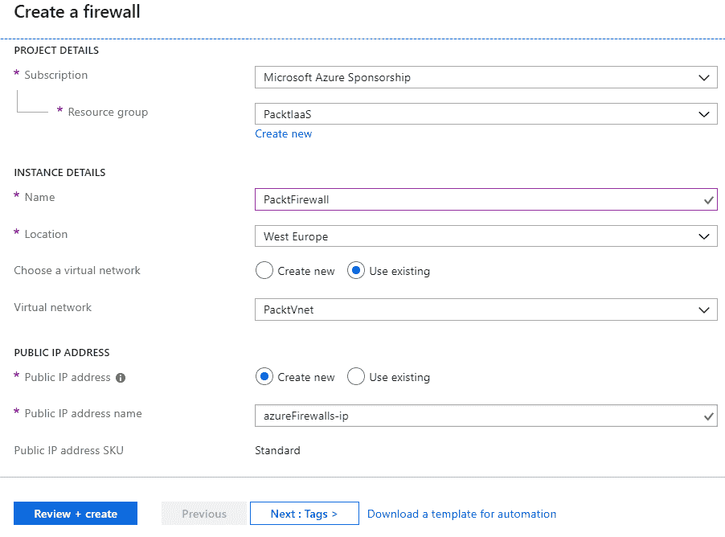
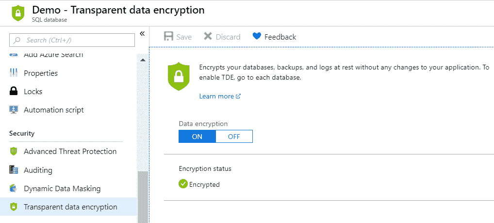

# Azure 安全性与管理

安全性常常是许多组织推迟迁移到云端的主要原因之一。原因在于存在太多未知因素；人们不理解安全性是如何设置的，且往往不信任任何人管理他们的数据。我常年听到的一句话是：“如果它离开了我们的数据中心，我就不知道它发生了什么。”

事实上，你的数据在 Azure 中可能比在本地数据中心更为安全。在本章中，我将尽力解释 Azure 安全性是如何设置的，并消除关于云安全的疑虑。

本章将涵盖以下主题：

+   Azure Active Directory 多重身份验证

+   Azure 网络安全

+   Azure 防火墙

+   数据加密

+   Azure 密钥保管库

+   Azure 安全中心

+   高级威胁防护

+   按需访问

# 技术要求

本章需要以下内容：

+   一个 Azure 订阅

+   PowerShell

+   Azure PowerShell

# 揭开云安全的面纱

那么，Azure 真的有多安全呢？我们可以从非常安全开始说起。

微软正在大力投资 Azure，特别是在 Azure 安全性方面。Azure 提供了广泛的合规性服务，包括 HIPAA、FFIEC、PCI DSS、ISO 9001 和 ISO 27001，仅举几例。

Azure 安全性始于物理安全。数据中心有专门的安全人员全天候值守；所有区域都被摄像头和报警系统覆盖，且有多个外围检查层级。

要进入 Azure 数据中心，你需要通过多个检查点并提供有效的身份验证和授权。身份验证采用多因素认证，除了提供 PIN 或密码外，你还必须通过生物识别和卡片读取器检查。

数据中心内的所有内容都经过加密和保护。所有数据在静态时都被加密，即便有人设法偷走了含有你数据的磁盘，它也是无法使用的。所有数据传输也都按照行业标准进行加密。

数据安全的另一个重要方面是冗余，以确保数据永远不会丢失。Azure 默认的冗余级别是 3（三个）。例如，当你创建一个新的资源，像是 Azure 虚拟机时，系统会创建一个有三个副本的磁盘。这保证了数据始终可用，即使其中一个磁盘发生故障，仍然有两个额外的副本。冗余 3 同样适用于备份发电机；如果一个发生故障，还有两个备份。

即使微软也深度参与了 Azure 安全性，但仅仅将数据放入 Azure 并不足以确保它的安全。与微软的合作负责安全的一部分，并提供各种工具和服务来帮助你保持安全。然而，如何实施这些工具并将它们投入使用，仍然由你负责。

# 保护你的身份

保护你的身份是 IT 安全中非常重要的一部分。大多数数据泄露是由于社会工程学或钓鱼攻击所致。因此，在大多数情况下，泄露的凭证是导致数据泄露的主要原因。

Azure Active Directory 提供了一些工具来提高安全性，其中最突出的一个是**多重身份验证**（**MFA**）。MFA 要求用户在登录后提供额外的安全身份验证。用户提供用户名和密码后，还需要进行额外的操作来证明身份。可以使用许多不同的工具进行附加检查，如生物识别读卡器或卡片读卡器，但最常用的工具是移动设备。登录后，用户会在移动设备上收到通知，并需要提供额外的确认。通知可以通过电话（用户需要在通话中提供代码）、短信（用户收到需要在登录时提供的代码）或应用程序（与用户账户连接，并需要确认用户正在尝试登录）进行。

启用 MFA 后，泄露的凭据不再那么令人担忧，因为窃取用户名和密码已不足以访问数据。需要访问用户的移动设备以授权你的登录尝试，这使得数据泄露变得更加困难。

# 启用多重身份验证

在 Azure Active Directory 中启用 MFA 非常简单和快速。在 Azure Active Directory 中，在**用户管理**下需要选择多重身份验证。截图中展示了一个示例：


一个新窗口会打开，在其中完成所有的 MFA 设置。你可以为单个用户设置个性化的设置，或者批量更新多个用户。在服务设置下，你还可以编辑 MFA 可用的选项，并选择电话、短信、移动应用或令牌。要启用单个用户的 MFA，选择该用户并在右侧的设置中点击启用，如下所示：


拥有全局管理员角色的用户可以免费使用 MFA。因此，对于管理员来说，没有理由不添加额外的安全层，因为泄露的管理员账户可能造成的损害远超过普通用户。然而，如果你想为所有用户启用 MFA，则需要额外的许可证。MFA 随 Azure Active Directory Premium 提供，但也可以按用户或每次登录为独立服务进行授权。

# 其他身份安全选项

Azure Active Directory 还提供其他可以帮助你增强安全性的服务。

其他服务如条件访问或特权身份管理可以帮助我们提高安全性并防止未经授权的访问。我们可以使用审计日志和风险性登录来查看谁尝试访问服务和数据以及何时访问。Azure Active Directory 提供了大量的日志，可以用于审计。大部分这些功能都需要 AAD Premium，并且在基础版或免费版许可证中不可用。

# 保护网络

保持安全的下一步是保护我们的网络资源。如果网络没有保护，可能会导致数据泄露或服务拒绝。即使 Azure 网络堆栈提供了许多安全功能，例如默认的 DDOS 保护或网络安全组，有时这些也不够，我们需要采取额外的措施。

# Azure Firewall

Azure Firewall 是一个托管的、基于云的网络安全服务，保护 Azure 虚拟网络资源。它是一个作为服务提供的防火墙，内置高可用性和可扩展性。

使用 Azure Firewall，您可以创建、执行和记录应用程序及网络连接策略。为虚拟网络资源分配的静态公共 IP 地址可以让外部防火墙识别来自您的虚拟网络的流量。该服务与 Azure Monitor 集成，用于日志记录和分析。

# 准备环境

Azure Firewall 要求连接到一个名为 AzureFirewallSubnet 的子网。我们可以在创建新的 Azure Firewall 过程中创建一个新的 Azure VNet 和子网。但由于我已经有了想要使用的 VNet，我将向之前创建的`PackVnet`中添加一个新的子网。

以下截图展示了如何为 Azure Firewall 添加新子网的示例：


# 创建 Azure Firewall

要创建一个新的 Azure Firewall，我们需要提供订阅、资源组、名称和位置。此外，还需要提供虚拟网络和公共 IP 地址。在这两种情况下，我们可以选择使用现有资源或创建新资源。请注意，对于现有虚拟网络，必须存在`AzureFirewallSubnet`。示例参数如截图所示：



部署完成后，Azure Firewall 已准备好使用，我们可以开始配置。此时，请注意私有 IP 地址（记住它或写下来），因为我们将在接下来的几个步骤中使用它。

以下是 Azure Firewall 面板的截图：


我们也可以使用 ARM 模板来部署 Azure Firewall。

以下是部署新 Azure Firewall 的 ARM 模板：

```
{
    "$schema": "http://schema.management.azure.com/schemas/2015-01-01/deploymentTemplate.json#",
    "contentVersion": "1.0.0.0",
    "parameters": {
        "location": {
            "type": "string"
        },
        "resourceGroup": {
           "type": "string"
        },
        "azureFirewallName": {
            "type": "string"
        },
        "vnetName": {
            "type": "string"
        },
        "vnetAddressSpace": {
            "type": "string"
        },
        "subnetAddressSpace": {
            "type": "string"
        },
        "publicIpAddressName": {
            "type": "string"
        },
        "subnetId": {
            "type": "string"
        }
    },
    "variables": {
        "networkApiVersion": "?api-version=2018-08-01"
    },
    "resources": [
        {
            "apiVersion": "2018-08-01",
            "type": "Microsoft.Network/publicIpAddresses",
            "name": "[parameters('publicIpAddressName')]",
            "location": "[parameters('location')]",
            "sku": {
                "name": "Standard"
            },
            "properties": {
                "publicIPAllocationMethod": "Static"
            },
            "tags": {}
        },
        {
            "apiVersion": "2018-07-01",
            "type": "Microsoft.Network/azureFirewalls",
            "name": "[parameters('azureFirewallName')]",
            "location": "[parameters('location')]",
            "dependsOn": [
                "[resourceId(parameters('resourceGroup'), 'Microsoft.Network/publicIpAddresses', parameters('publicIpAddressName'))]"
            ],
            "properties": {
                "ipConfigurations": [
                    {
                        "name": "IpConf",
                        "properties": {
                            "subnet": {
                                "id": "[parameters('subnetId')]"
                            },
                            "publicIPAddress": {
                                "id": "[resourceId(parameters('resourceGroup'), 'Microsoft.Network/publicIpAddresses', parameters('publicIpAddressName'))]"
                            }
                        }
                    }
                ]
            },
            "tags": {}
        }
    ]
}
```

# Azure Route Table

现在我们要创建一个路由表，将所有流量通过 Azure Firewall。要创建一个新的 Azure 路由表，我们需要提供名称、订阅、资源组和位置。我们还可以选择启用或禁用 BGP 路由传播。以下截图展示了如何创建新的路由表：


在创建路由表后，我们需要将其与子网关联并创建路由。在路由表面板的子网选项下，选择“关联”，如图所示：


要将路由表与子网关联，我们需要提供虚拟网络和该网络中的子网。在以下示例中，选择了虚拟网络 PacktVnet，子网为默认子网：


最后，我们需要添加一条路由。我们需要提供路由名称、地址前缀、下一跳类型和下一跳地址。对于下一跳类型，我们需要选择虚拟设备。Azure 防火墙作为服务（Firewall as a Service），但仍属于这一类别。为了实现类似效果，我们可以使用任何虚拟设备，在其中使用 IaaS 模式的第三方防火墙。在下一跳地址下，我们输入 Azure 防火墙的私有 IP 地址（我之前提到过，您需要记住这个地址）。路由设置的示例如下所示：


来自`PacktVnet`虚拟网络默认子网的所有流量现在都被路由到我们的 Azure 防火墙。我们可以继续并创建规则，决定允许或拒绝的内容。

# 配置 Azure 防火墙

在 Azure 防火墙面板中的规则下，我们有三个选项：NAT 规则集合、网络规则集合和应用规则集合。根据我们的需求，可以使用 NAT 规则重写源地址。我们可以使用网络规则定义允许哪些源流量到达哪些目标，或者通过应用规则定义允许或拒绝的 FQDN。Azure 防火墙中规则面板的示例如下所示：


让我们创建一条规则，允许默认子网的流量访问 VSTS。首先，我们需要提供名称、优先级和动作（允许或拒绝）。然后，我们需要定义源地址、协议：端口和目标 FQDN。可选地，我们可以为规则添加标签。对于源地址，我将添加一个子网，因为我希望从子网中的任何地方都能访问 VSTS。如果您希望限制 FQDN 的访问来源，可以使用更小范围的 IP 地址。

协议将是 HTTP 和 HTTPS，目标 FQDN 为 `*.visualstudio.com`。新的应用规则示例如下所示：


请注意，您可以在一个集合中拥有多个规则，并且可以将适用于特定服务的所有规则创建在一个集合中。这使得管理和维护 Azure 防火墙规则变得更加容易。

如果一切配置正确，您可以进入位于默认子网中的虚拟机（VM），并打开任何浏览器。您应该能够访问任何 VSTS 集合，但其他任何内容都将被禁止访问。

# 其他网络安全选项

除了使用默认的 Azure 组件，如 NSG、路由表，甚至 Azure 防火墙之外，还有许多作为虚拟设备提供的第三方防火墙。虚拟设备作为 Azure 虚拟机（VM）设置，网络安全领域的大多数行业领导者都可以在 Azure 上使用。管理虚拟设备包括两个部分：管理 Azure 虚拟机和管理防火墙。我们已经讨论过如何管理 Azure 虚拟机，至于防火墙的管理则取决于制造商，和在本地管理这些防火墙没有什么不同。

除此之外，我们可以通过 Azure Monitor 和 Log Analytics 收集网络资源的日志，帮助我们审核和故障排除 Azure 网络。还有一个工具可以帮助我们监控 Azure 网络，它被称为 Network Watcher。Azure Network Watcher 提供了监控、诊断、查看指标并启用或禁用虚拟网络资源日志的工具。

使用 Azure Network Watcher，我们可以监控端点、网络流量、跳数、VPN 和其他一切与网络相关的内容。它是一个非常棒的工具，因为它允许我们以图形方式显示网络架构，并更轻松地定位问题。

# 加密

安全中的另一个重要步骤是加密。我们希望我们的数据始终保持加密——无论是在静态存储时还是在传输中。一切都具有冗余性，确保没有数据丢失，即使有三份加密的副本，我们也可以选择使用地理复制和其他设置来创建额外的冗余。

默认情况下，Azure 中的所有资源在静态存储时都会进行加密。但有时我们需要额外的安全性来确保数据得到更好的保护。例如，我们的 Azure 虚拟机磁盘在 Azure 数据中心内是加密的，即使磁盘未经授权访问，也没人能够读取磁盘上的数据。但如果磁盘被下载呢？在这种情况下，磁盘是可以被使用的。数据可以被读取或附加到另一个虚拟机，或者可以使用该磁盘创建一个虚拟机。

我们可以通过使用**Azure Key Vault**来应用额外的加密并使我们的资源更加安全。

# Azure Key Vault

Azure Key Vault 用于存储机密、密钥和证书。它是一个集中式管理解决方案，用于保存、分发和控制机密、密钥和证书。在部署过程中可以调用 Azure Key Vault 中的机密，以防止密码以明文形式显示。密钥可以用来加密存储和磁盘。你可以在 Azure Key Vault 中使用证书，并在部署过程中将其分配给服务以保障 SSL 和 TLS 安全。

Azure Key Vault 大大减少了机密被意外泄露的可能性，通过使用密钥加密增加了资源静态存储时的安全性，并通过分配证书增加了传输过程中的安全性。

# 创建 Azure Key Vault

创建新的密钥库时，我们需要提供名称、订阅、资源组和位置。我们还可以选择更改定价层、分配访问策略，并提供虚拟网络访问。定价层有两个选项：标准和高级。唯一的区别是高级支持**硬件安全模块**（**HSM**）。默认分配的策略是授予创建密钥库的人员所有访问权限。您还可以在创建过程中或之后随时添加策略。虚拟网络访问默认授予您订阅中的所有网络，但您可以编辑此设置，只授予特定网络访问权限。这里显示了默认设置的示例：


创建 Azure 密钥库相对快速，应该在一分钟内完成。请注意 DNS 名称，因为稍后会用到它。以下截图显示了一个 Azure 密钥库页面的示例：


要部署 Azure 密钥库，您可以使用以下 ARM 模板：

```
{
    "$schema": "http://schema.management.azure.com/schemas/2014-04-01-preview/deploymentTemplate.json#",
    "contentVersion": "1.0.0.0",
    "parameters": {
        "name": {
            "type": "String"
        },
        "location": {
            "type": "String"
        },
        "sku": {
            "defaultValue": "Standard",
            "allowedValues": [
                "Standard",
                "standard",
                "Premium",
                "premium"
            ],
            "type": "String",
            "metadata": {
                "description": "SKU for the vault"
            }
        },
        "accessPolicies": {
            "defaultValue": [],
            "type": "Array",
            "metadata": {
                "description": "The access policies defined for this vault."
            }
        },
        "tenant": {
            "type": "String"
        },
        "enabledForDeployment": {
            "type": "Bool"
        },
        "enabledForTemplateDeployment": {
            "type": "Bool"
        },
        "enabledForDiskEncryption": {
            "type": "Bool"
        },
        "networkAcls": {
            "type": "Object",
            "metadata": {
                "description": "The network firewall defined for this vault."
            }
        }
    },
    "resources": [
        {
            "type": "Microsoft.KeyVault/vaults",
            "name": "[parameters('name')]",
            "apiVersion": "2016-10-01",
            "location": "[parameters('location')]",
            "properties": {
                "enabledForDeployment": "[parameters('enabledForDeployment')]",
                "enabledForTemplateDeployment": "[parameters('enabledForTemplateDeployment')]",
                "enabledForDiskEncryption": "[parameters('enabledForDiskEncryption')]",
                "accessPolicies": "[parameters('accessPolicies')]",
                "tenantId": "[parameters('tenant')]",
                "sku": {
                    "name": "[parameters('sku')]",
                    "family": "A"
                },
                "networkAcls": "[parameters('networkAcls')]"
            }
        }
    ]
}
```

# 添加密钥和机密

密钥库创建完成后，我们可以添加机密和密钥。

首先，我们添加一个密钥，以便稍后用于加密。密钥可以生成、导入或从备份中恢复。如何添加新密钥的示例如下：


密钥库中的密钥可以用来提供创建资源时需要的密码。在使用 ARM 模板创建资源时，您需要提供密码。为了防止密码以明文显示，您可以使用密钥库中的机密提供密码的值，防止密码泄露。机密可以手动创建或从证书中导入。以下示例展示了如何手动添加新的机密：


与这两个示例类似，您可以添加证书。证书可以生成或导入。请注意，如果您想将这些证书用于公开的应用程序，必须使用由公认证机构颁发的有效证书。

# 加密存储账户

如前所述，大多数资源默认是加密的，Azure 存储账户也不例外。然而，您可以选择使用自己的密钥来加密存储。要使用自己的密钥，您必须选择“使用您自己的密钥”，这将允许您选择将用于加密的密钥库和密钥。以下截图显示了一个示例：


加密存储的时间取决于存储账户中的数据量。对于较小的存储，几秒钟就能完成，但对于大型存储账户，可能需要几个小时才能完成加密过程。如果您在生产环境中加密大型存储账户，请尽量在非工作时间进行，因为这可能会影响性能。

# 加密数据库

Azure SQL 数据库使用 TDE 进行加密。在创建新的 Azure SQL 数据库时，默认启用此选项。如果您有更早创建的数据库，可以将此选项更改为启用并保存。Azure SQL 数据库窗口中的透明数据库加密选项如下所示：



当 Azure SQL 数据库启用 TDE 时，数据和备份在静止状态下被加密。但如果您下载或导出备份，则情况会有所不同。为了确保数据库在离开 Azure 数据中心后仍然加密，我们可以使用自己的密钥进行加密。为此，我们需要使用 Azure PowerShell。

# 安装 Azure PowerShell

PowerShell 是基于 .NET Framework 的命令行外壳和脚本语言。系统管理员使用它来自动化任务和管理操作系统。

Azure PowerShell 是一个 PowerShell 模块，允许我们自动化和管理 Azure 资源。

要安装 Azure PowerShell，我们需要先安装 Windows PowerShell。幸运的是，Windows PowerShell 从 Windows 7（客户端操作系统）和 Windows Server 2012 R2（服务器操作系统）开始，微软的操作系统就已经预装了 Windows PowerShell。

要安装 Azure PowerShell，我们需要运行以下命令：

```
Install-Module -Name AzureRM
```

接下来，我们需要导入模块：

```
Import-Module AzureRM
```

如果模块已安装，我们可以使用以下命令更新它：

```
Update-Module -Name AzureRM
```

成功导入模块后，我们可以使用以下命令连接到 Azure：

```
Connect-AzureRmAccount
```

# 使用您自己的密钥进行 Azure SQL 数据库加密

要使用自己的密钥进行 Azure SQL 数据库 TDE，我们必须执行几个命令。

首先，我们需要将我们的 Azure Active Directory 身份登录到 Azure SQL 服务器：

```
$dbRG = 'PacktPaaSDB';
$dbServer = 'packt';
$server = Set-AzureRmSqlServer -ResourceGroupName $dbRG -ServerName $dbServer -AssignIdentity
```

其次，我们必须授予服务器对 Key Vault 的权限：

```
$dbRG = 'PacktPaaSDB';
$dbServer = 'packt';
$KeyVaultName = 'PacktKV';
Set-AzureRmKeyVaultAccessPolicy -VaultName $KeyVaultName -ObjectId $server.Identity.PrincipalId -PermissionsToKeys get, wrapKey, unwrapKey
```

第三，我们将 Key Vault 密钥添加到服务器并设置 TDE 保护级别：

```
$dbRG = 'PacktPaaSDB';
$dbServer = 'packt';
$rgName = 'PacktKeyVault';
$KeyVaultName = 'PacktKV';
$keyEncryptionKeyName = 'MyKey';
$keyEncryptionKeyUrl = (Get-AzureKeyVaultKey -VaultName $KeyVaultName -Name $keyEncryptionKeyName).Key.kid;

<# Add the key from Key Vault to the server #>
Add-AzureRmSqlServerKeyVaultKey -ResourceGroupName $dbRG -ServerName $dbServer -KeyId $keyEncryptionKeyUrl
<# Set the key as the TDE protector for all resources under the server #>
Set-AzureRmSqlServerTransparentDataEncryptionProtector -ResourceGroupName $dbRG -ServerName $dbServer -Type AzureKeyVault -KeyId $keyEncryptionKeyUrl
<# To confirm that the TDE protector was configured as intended: #>
Get-AzureRmSqlServerTransparentDataEncryptionProtector -ResourceGroupName $dbRG -ServerName $dbServer
```

最后，我们启用 TDE：

```
$dbRG = 'PacktPaaSDB';
$dbServer = 'packt';
$dbName = 'Demo'
Set-AzureRMSqlDatabaseTransparentDataEncryption -ResourceGroupName $dbRG -ServerName $dbServer -DatabaseName $dbName -State "Enabled"
```

Azure PowerShell 脚本中的所有参数都可以编辑。要在任何 Azure SQL 数据库中使用任何 Key Vault 执行此操作，请相应地更改参数的名称。

# 加密虚拟机（VM）磁盘

同样的操作也适用于 Azure 虚拟机（VM）。磁盘默认加密，并且数据在静止状态下受到保护。但正如前面所提到的，当磁盘被导出或下载时，它将不再受到保护。通过使用 Key Vault，我们可以为 Azure VM 磁盘设置额外的加密保护，确保任何情况下的数据安全。如果我们查看任何 Azure VM 中的磁盘，我们会看到磁盘未加密，如下所示：


要启用磁盘加密，我们首先必须启用用于磁盘加密的 Key Vault：

```
Set-AzureRmKeyVaultAccessPolicy -VaultName 'PacktKV' -ResourceGroupName 'PacktKeyVault' -EnabledForDiskEncryption
```

现在我们可以启用磁盘加密：

```
$VMRG = 'PacktIaaS';
$VMname= 'DBserver';
$rgName = 'PacktKeyVault';
$KeyVaultName = 'PacktKV';
$KeyVault = Get-AzureRmKeyVault -VaultName $KeyVaultName -ResourceGroupName $rgname;
$diskEncryptionKeyVaultUrl = $KeyVault.VaultUri;
$KeyVaultResourceId = $KeyVault.ResourceId;

 Set-AzureRmVMDiskEncryptionExtension -ResourceGroupName $VMRG -VMName $vmName -DiskEncryptionKeyVaultUrl $diskEncryptionKeyVaultUrl -DiskEncryptionKeyVaultId $KeyVaultResourceId;
```

该命令将在 5 到 15 分钟内运行，具体时间取决于磁盘的大小。收到完成消息后，我们可以再次检查磁盘状态，查看加密是否已启用：


# Azure 安全中心

Azure 安全中心提供了一个集中式的安全管理和高级威胁防护平台，涵盖 Azure 和混合云环境。通过安全中心，我们可以在工作负载中应用安全策略，限制对威胁的暴露，并检测和响应攻击。它分为两个层级：免费版和标准版。免费版默认启用，提供安全策略、持续的安全评估以及可操作的安全建议，以保护 Azure 资源。标准版扩展到私有或混合云工作负载，并增加了高级威胁检测。高级威胁检测使用内置的行为分析和机器学习技术来识别攻击和零日漏洞，减少暴露于任何类型的攻击。

# Azure 安全中心概述

Azure 安全中心概览仪表板提供了您 Azure 和非 Azure 工作负载的安全状态的即时总结，使您能够发现并评估工作负载的安全性，识别和减轻风险。我们可以看到不同的指标，这些指标使我们能够立即识别任何安全风险，并根据最佳实践看到需要改进的推荐事项。Azure 安全中心中的概览仪表板示例如下图所示：


Azure 安全中心是一个功能复杂的服务，提供了很多选项。与许多其他服务一样，它值得一本专书，而很难在一个章节中涵盖所有选项。我们将专注于一些最重要的选项，这些选项将帮助您立即提升安全性。

# Azure 安全中心推荐

Azure 安全中心分析您的安全设置并将其与最佳实践进行对比。基于此，您可以看到在安全中心 - 推荐中需要实施的建议变更。建议分为四类——计算与应用、数据与存储、网络、以及身份与访问（预览）。所有资源可以有三种状态：绿色、橙色和红色。绿色表示所有安全最佳实践已启用，并且资源是安全的；橙色表示应实施但不关键的建议；红色表示存在高安全风险的建议，应该立即实施。我们还可以看到基于已实施和待解决的内容，可能存在的安全风险的安全得分。安全中心 - 推荐仪表板如下图所示：


以“计算”部分为例。在这里，我们可以找到与计算资源（虚拟机和计算机、应用服务（预览）以及云服务）相关的所有安全问题列表。在这些推荐列表中，我们可以看到问题描述以及这些问题影响了多少资源。在此示例中，我们可以看到列表顶部列出，8 个虚拟机中有 10 个没有启用端点保护，并且被标记为红色：


# 启用端点保护

作为示例，让我们点击这个推荐并解决它。会打开一个新窗口，列出没有启用端点保护的虚拟机（VM）。我们可以选择特定的虚拟机或所有虚拟机，并选择安装端点保护。安装将开始，完成后我们会看到推荐已解决：


类似这样，我们可以解决大多数安全中心的推荐。我们点击推荐并按照步骤操作。然而，有些推荐无法通过这种方式解决，需要额外的步骤。在这种情况下，你将被引导到文档中，描述该问题并提供解决步骤。

# Azure 安全中心警报

警报是 Azure 安全中心的另一部分；这些警报非常有用，可以帮助你检测潜在问题。安全警报部分可以让你追踪并查看何时有未授权访问你的资源的尝试。在 Azure 安全中心的警报概览中，你可以看到可能的资源攻击列表，并且能查看它们发生的时间，如下图所示：


如果我们选择任何警报，我们会看到更多信息，如日期、使用了什么凭证、登录尝试次数以及其他信息。在“地理和威胁情报信息”下，我们可以看到攻击发生的地点，提供了详细的地理位置信息。根据登录信息和地理位置，我们可以判断这是否是合法用户，还是对资源进行的暴力破解攻击。如果有一个有效用户在已知地点尝试了三次，我们可以推测这可能是用户忘记了密码。

如果我们有 50 次来自未知用户的登录尝试，且来自未知地点，我们可以推测这是一次暴力破解攻击。在“修复步骤”下，我们会有如何防止未来类似攻击的说明。这里展示了一个可疑的认证活动示例：


在底部，我们有两个附加操作——“调查”（Investigate）和“查看操作手册”（View playbooks）。调查允许我们查看事件的详细信息。查看操作手册允许我们创建（或使用现有的）逻辑应用程序，如果将来发生类似事件，它将采取相应措施。通过逻辑应用程序，我们可以设计步骤和操作来防止攻击。例如，如果尝试使用无效用户登录超过三次，它将添加一个 NSG 规则，阻止访问资源 48 小时。调查详情的示例如下所示：


# 即时访问

Azure 安全中心的最佳功能之一就是即时访问。即时访问可以防止访问 Azure 虚拟机，除非该访问已被特别请求。默认情况下，所有管理端口都被关闭，您需要从特定的 IP 地址请求访问，并且仅在短时间内启用此访问。

要在 Azure 虚拟机上设置即时访问，请进入安全中心的即时访问面板并从列表中选择一个或多个虚拟机，如下所示：


在选择要启用即时访问的虚拟机后，将会打开一个新面板。在这里，我们必须定义默认关闭且仅在请求时启用的端口。默认端口包括 SSH（`22`）、RDP（`3389`）和 WinRM（`5985`和`5986`），但您可以删除和添加任何您需要的端口。以下截图显示了默认设置的示例：


启用即时访问后，连接虚拟机的选项将不可用。要访问虚拟机，您必须在 Azure 安全中心请求访问。在这里，您需要定义要打开的端口、允许从哪些 IP 地址连接以及允许连接的时长（1 到 3 小时）。以下是请求面板的示例，您可以看到如何从当前 IP 地址打开 RDP 端口一小时：


通过即时访问（Just-in-Time access），您可以控制谁可以访问您的虚拟机（VM）、何时访问以及从哪里访问。未经授权的访问降到最低，您的虚拟机得到了保护。另一个令人惊叹的功能是，在标准层的 Azure 安全中心中，您可以注册并保护私有和混合云中的资源。此选项不仅仅限于 Azure 虚拟机，还可以为本地虚拟机启用。

# 总结

微软非常重视 Azure 安全。采取了许多步骤来确保您的资源在 Azure 中得到保护和安全。除此之外，微软还提供了许多额外的服务，帮助我们进一步提高安全性。为了确保安全并实现最大化保护，需要微软和我们的共同努力，我们需要利用 Azure 提供的安全服务，除了微软已经在保护我们的数据和服务之外。此外，除了被声明为安全服务的安全功能（例如密钥保管库或安全中心），还有很多服务内置的安全功能（例如 Azure SQL 防火墙或网络安全组）。

随着我们逐渐接近尾声，我们将回顾我们所学的内容。在最后一章，我们将讨论我们之前讨论过的服务以及使用它们的最佳实践。基础设施即代码（Infrastructure-as-Code）是云计算中非常重要的一部分，我们将讨论一些工具，这些工具可以通过自动化任务帮助我们与 Azure 进行工作。使用 Azure 门户是了解 Azure 的一个很好的方式，但如果你想充分利用它，基础设施即代码是你需要使用的工具。

# 问题

1.  Azure 中的一切都是冗余的，拥有多少份副本？

    1.  一

    1.  两个

    1.  三个

1.  大多数数据泄露是由...引起的

    1.  暴力破解攻击

    1.  泄露的凭证

    1.  病毒

1.  MFA 代表...

    1.  多因素认证

    1.  多因素授权

    1.  多因素激活

1.  多因素认证（MFA）可以配置为使用：

    1.  电话呼叫

    1.  短信

    1.  移动应用程序

    1.  以上所有

1.  Azure 防火墙是...

    1.  基础设施即服务

    1.  防火墙即服务

    1.  两者

1.  Azure 资源可以使用...进行加密

    1.  Azure 提供的密钥

    1.  自定义密钥

    1.  两者

1.  要使用自定义密钥，我们必须使用...

    1.  Azure 安全中心

    1.  Azure 密钥保管库

    1.  两者

1.  Azure 安全中心提供...

    1.  安全管理

    1.  高级威胁防护

    1.  两者

1.  Azure 安全中心可以用于保护...

    1.  Azure 资源

    1.  本地资源

    1.  两者

1.  即时访问提供...

    1.  我们对虚拟机（VM）管理访问的控制

    1.  实时监控虚拟机的访问

    1.  两者
