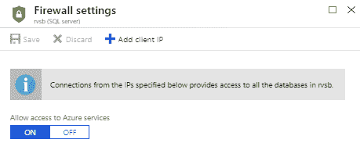

# 第十章：最佳实践

在这最后一章中，我们将回顾到目前为止所学到的内容，并强调一些最佳实践。一些简单的技巧可以帮助您从一开始就正确设置，并为以后节省大量麻烦。最佳实践将帮助您在管理和故障排除中更好地跟踪事物并注意到错误。我们将添加一些安全提示以及如何避免最常见的错误。我们将使用**基础设施即代码**（**IaC**）作为工具，帮助我们在 Azure 中的日常任务中取得成功。使用 Azure 门户简单且有助于学习，但要充分利用 Azure，我们必须使用 ARM 模板、Azure PowerShell 或 Azure CLI。最后，为了扩展 IaC，我们将讨论配置即代码，并介绍**期望状态配置**（**DSC**）和 Azure 自动化。

本章将涵盖以下主题：

+   Azure 最佳实践

+   基础设施即代码

+   ARM 模板

+   Azure PowerShell

+   Azure CLI

+   配置即代码

+   期望状态配置

+   Azure 自动化

# 技术要求

对于本章，您将需要以下内容：

+   Azure 订阅

+   PowerShell

+   Azure PowerShell

+   Azure CLI

# Azure 最佳实践

有许多细小的事项需要注意，否则可能会在长期内出现问题。当您管理单个订阅和少量资源时，可能看起来很简单，不重要去创建一些基本规则。但随着订阅和资源数量的增加，您可能会遇到混乱，此时纠正错误可能为时已晚。在这些情况下，纠正错误和回到正确的轨道将会很困难。

# 命名约定

对于订阅、资源组和资源设置命名约定非常重要。您的第一个订阅可能会有类似`Pay-as-you-go`的名称。如果您只有一个订阅，这并不重要。但如果您最终拥有 5 个、10 个或 100 个订阅，并且它们都命名为`Pay-as-you-go`，情况将会变得混乱。这些订阅将具有不同的订阅 ID，您可以利用此信息对它们进行区分，但这可能会很困惑。订阅可以重新命名，您应该利用此选项。您可以以不同的方式组织订阅，具体取决于您的需求，如基于部门、应用程序、环境等等。

例如，您可以每个部门拥有多个订阅。这将帮助您分离成本和消耗，并查看每个部门在资源上的支出情况。在这种情况下，您可能希望将订阅重命名为类似`HumanResources`、`Finances`、`IT`等。如果每个部门都有不同的生产、测试和开发环境，您可以在订阅名称中添加环境，并类似于`HumanResources-prod`、`HumanResources-test`和`HumanResources-dev`。

你可以根据需求将类似的原则应用于资源组的命名。假设我们使用一个单一的订阅，并希望将部门、环境或应用程序添加到资源组的名称中。在这种情况下，资源组的名称可能是`IT-helpdesk-prod`。或者，如果我们为每个部门分配一个订阅，资源组的名称可能是`helpdesk-prod`。

但是，当你有多个订阅，并且所有订阅都列在资源组视图中时，如果一些资源有相似的名称，可能会造成混淆，因此最好在资源组名称中包含订阅名称。例如，你可能有`Finance`和`HR`两个订阅，它们各自都有一个名为`Employees`的应用程序。如果你只是使用产品和环境来命名资源组，那么这两个生产环境的资源组将会被命名为`Employees-prod`。它们虽然在不同的订阅中，但当所有订阅中的资源组列出时，可能会造成混乱。在这种情况下，将完整路径包含在资源组名称中，将订阅名称作为资源组名称的前缀，是一个有益的做法。

对于资源，最好也有一定的命名规范。设计可能依赖于不同的因素，但我建议使用所有可用的变量，以避免混淆。例如，假设我们的 IT 部门有自己的订阅，并使用一个名为`helpdesk`的应用程序。该应用程序需要两个虚拟机（Web 和数据库服务器），并且有生产、开发和测试环境。在这种情况下，我们会有六个虚拟机被同一个应用程序使用，用于不同的目的和环境。在这种情况下，使用诸如订阅、环境、产品、资源类型和资源用途等参数会很有帮助。因此，生产环境中的虚拟机名称可能是`it-helpdesk-prod-VM-web`和`it-helpdesk-prod-VM-db`。还有一种情况是你有多个虚拟机具有相同的角色，比如负载均衡器后面的多个 Web 服务器。在这种情况下，最好在名称中添加数字，像这样`it-helpdesk-prod-VM-web-01`、`it-helpdesk-prod-VM-web-02`，依此类推。

# 公共端点

通常，如果没有必要，避免暴露公共端点是一个好主意，尤其是当我们谈论管理和行政时。暴露你的 Web 应用的端点是你可能希望做的事情，但为什么要暴露数据库呢？这只会带来额外的安全风险，并增加你的数据被泄露的可能性。管理方面也是如此；应该避免暴露 RDP、SSH 或任何其他可以用来管理和行政资源的端口。

如果我们使用 IaaS 中的数据库，最佳实践是只允许通过端口 `1433` 在 Azure Vnet 内访问数据库，或者甚至限制访问到特定的子网。使用 NSG 和 **应用程序安全组**（**ASG**）来设置访问权限，并仅在需要时允许访问。例如，我们可以使用 NSG 和 ASG 设置对数据库的访问，但仅当流量来自特定子网（使用 NSG）并且来自属于 Web 服务器组的服务器时（使用 ASG）。这一方法不限于端口 `1433` 和 MS SQL Server；您可以将这种方法应用于 IaaS 中使用的任何其他数据库以及这些数据库使用的任何端口，如 Oracle 的 1521、IBM DB2 的 50000、MySQL 的 3306，或任何您定义的自定义端口。

PaaS 中的数据库、Azure SQL 数据库以及其他数据库 PaaS 选项提供了防火墙保护。通过防火墙保护，您可以限制能够连接到数据库的 IP 地址。请确保保持防火墙的更新，并移除任何不必要的 IP 地址。此外，Azure SQL 数据库防火墙中有一个选项可能会带来额外的风险。该选项允许 Azure 服务访问您的 Azure SQL 数据库，如下所示：



默认情况下，此选项是开启的，看起来似乎启用它是有道理的。大多数人会认为：“是的，我希望我的 Azure 服务能够连接到我的数据库。”但这个选项只检查连接是否来自 Azure；它并没有检查连接是否来自您的订阅或租户。如果保持此选项开启，就允许任何人创建一个 Azure 账户并尝试访问您的数据库，因为如果连接来自 Azure，则防火墙规则将不再适用。

连接到数据库仍然需要用户名和密码，但这为攻击者提供了机会。在这种情况下，微软要求在创建试用订阅时提供信用卡信息，这对于我们来说是非常有利的，因为任何账户都可以追踪到其所有者。如果有人通过这种方式成功访问数据库，那么该人是可以被追踪的，但您可能想要禁用此选项，以防止任何未经授权的访问。

对于其他不应公开暴露的后端服务，也可以采用类似的方法。这些服务可以是数据库、不同的连接器、业务逻辑以及各种 API 等。不要暴露任何不需要暴露的内容。在 IaaS 场景中，可以使用 NSG 和 ASG 来限制访问。当使用 PaaS 时，也有不同的策略可以采用。如我们之前提到过，Azure SQL 数据库具有防火墙。对于 Web 应用程序，我们可以使用隔离的应用服务计划，只允许通过 Azure 虚拟网络访问。类似地，大多数 PaaS 服务都可以连接到 Azure VNet，并且我们可以设置从 Azure 虚拟网络内部访问服务。然后，NSG 和 ASG 规则也可以应用于这些服务。

限制对 Azure 虚拟机管理端口的访问是我们需要注意的另一个事项。例如，公开 RDP 访问到虚拟机的互联网可能会带来严重后果。我测试了将默认的 RDP 端口开放，并通过 Azure 安全中心跟踪访问尝试。在一个月内，有超过 150,000 次未授权的访问尝试。这些尝试大部分使用的是管理员、admin、sysadmin 和 root（超过 80%的尝试使用了这四个用户名），所以幸运的是 Azure 虚拟机不允许使用这些名字。

有几种方法可以限制对 Azure 虚拟机管理的访问：

+   禁用管理端口的公共访问，并通过安全连接管理 Azure 虚拟机。这可以是 P2S、S2S 或 Azure ExpressRoute。通过使用安全连接，您将管理访问限制为来自可信位置的授权用户。

+   如果无法使用安全连接，限制对可信公共 IP 地址的访问。使用 NSG 来限制对仅能通过预先允许的 IP 地址访问的 Azure 虚拟机的访问。以下截图展示了如何使用 NSG 限制访问的示例：


+   使用即时访问（Just in Time Access）来访问 Azure 虚拟机。在 Azure 中设置即时访问简单快捷。启用此选项时，您需要创建一个来自预定 IP 地址并且只限于一段时间的访问请求。这样，除非创建了特定的请求来允许管理访问，否则访问将被阻止。以下是一个示例，展示了如何为用户当前的 IP 地址开放 RDP 端口一个小时的请求：


# 其他需要考虑的事项

除了命名标准或端点安全性，我们还需要注意很多细节：

+   尽可能使用 PaaS。Microsoft Azure 提供了多种选择，但 IaaS 通常会更昂贵。在某些情况下，您别无选择，但使用 PaaS 可以降低订阅成本。

+   使用监控和日志记录服务。每个 Azure 服务都有某种形式的日志记录、监控和警报功能。尝试通过 Azure Monitor、Azure Network Watcher 或 Log Analytics 等服务扩展这些功能。这些工具可以帮助你跟踪问题和性能变化。

+   使用 Azure Advisor 应用一些最佳实践。Azure Advisor 会分析订阅中的资源，比较设置与最佳实践，并提供需要实施的建议，以提高性能或降低成本。

+   类似于 Azure Advisor，Azure Security Center 提供增强资源安全性的建议。Security Center 会比较你当前的安全设置，并结合安全事件，生成增加安全性的建议。

+   加密数据。尽管大多数 Azure 服务默认启用了加密，但那是静态加密。为了在导出或备份后保护我们的数据，我们需要应用额外的加密。

+   加密连接并使用 HTTPS。如果数据在传输过程中暴露，那么安全性就没有意义，因此我们也需要考虑这一点。

+   如果遇到问题，检查 Azure 服务健康状态。这可以节省你数小时的故障排除时间。你将能够发现性能问题，或者查看某个服务是否不可用，并自动连接到 Azure 查看出什么问题。这可能是 Azure 在全球或数据中心级别的问题，作为第一步检查是否是这种情况，可以节省大量时间。

+   在可能的情况下配置自动扩展。Azure 提供的一个优势是你只需为实际使用的资源付费。如果正确设置，自动扩展可以在负载增加时增加实例的规模/数量，而在负载减少时减少规模。这可以随着时间的推移节省大量费用。

+   尽可能使用 Azure Active Directory 认证。大多数服务可以设置为使用不同的认证方式，或者仅为特定服务创建本地账户。这种方式很难审计或跟踪访问情况。使用 AAD 账户可以提供更多的洞察，并使跟踪变得更加容易。

+   启用服务的审计功能。一些服务，例如 Azure SQL，内置了审计功能。在可能的情况下启用此功能，或者使用 Log Analytics 记录所有内容。

+   尽可能设计为具有韧性。拥有冗余服务可能会花费大量资金，在某些情况下甚至会使我们的成本翻倍。然而，将冗余服务部署在另一个 Azure 数据中心可以提高服务的可用性。如果服务出现问题，不论是你的服务问题还是 Azure 数据中心级别的问题，你都可以切换到冗余副本。

+   始终为故障做好规划。这不仅仅是 Azure 或云相关的最佳实践——为故障做规划是 IT 的最佳实践。尝试预测不同的场景以及如果服务失败会发生什么。然后，尽量修复可能的问题并防止故障发生。

+   尝试启用多因素认证。由于这可能增加成本，因此并非总是可行，预算也可能会阻止你实现这一目标。在这种情况下，至少为管理员启用 MFA；管理员的 MFA 是免费的。

+   在 Azure 虚拟机上安装端点保护。端点保护将提供实时保护，防止恶意或不需要的软件被安装，并可能对你的系统造成损害。

+   安装 Azure 虚拟机的最新补丁。定期安装补丁有双重效果：安全补丁能提高安全性，其他更新可以提高性能。

+   定期分析性能。仅仅拥有自动扩展有时并不足够。尽量在可能的情况下手动监控资源的性能。你可以发现性能问题，或者看到某些服务没有被充分利用。你可以使你的服务表现得更好，并节省成本。

# 基础设施即代码

基础设施即代码（IaC）是 Azure 最佳实践中的一个非常重要的部分。使用 Azure 门户简单且非常适合创建单一资源并学习，但如果我们要创建复杂的环境，IaC 是我们想要使用的工具。例如，创建一个 Azure 虚拟机时，Azure 门户是一个不错的选择。只需 3-5 分钟即可完成新的虚拟机向导并完成所有步骤。但如果我们每天都需要创建新的虚拟机，或者创建数十个甚至数百个虚拟机呢？在这种情况下，我们可能希望使用某种自动化来简化工作，这正是 IaC 的作用所在。为了在 Azure 上工作，我们有几种可用的选项：

+   ARM 模板

+   Azure PowerShell

+   Azure CLI

我们已经提到过 ARM 模板。ARM 模板是存储 Azure 资源信息的 JSON 文件，可以用于部署（或编辑/更新现有资源）。

要回答 Azure PowerShell 是什么，我们首先需要回答 PowerShell 是什么。PowerShell 是一种基于 .NET 框架的任务驱动型命令行脚本语言。它用于自动化任务并通过命令行管理操作系统和进程。Azure PowerShell 是一个 PowerShell 模块，提供了一组 `cmdlet`（命令），允许我们管理 Azure 资源。

Azure CLI，或称 Azure **命令行界面** (**CLI**)，是微软的跨平台命令行工具，用于管理 Azure 资源。它支持 macOS、Linux 和 Windows，并且无论选择哪个平台，都能提供相同的体验。Azure CLI 1.0 的第一个版本也叫做 X-Plat CLI，是用 JavaScript 编写的。最初，它是为了支持 Azure 服务管理 API 而创建的，后来才添加了 Azure 资源管理支持。Azure CLI 2.0 从一开始就为 ARM 架构而构建，并且是用 Python 编写的。

# 安装工具

在本节中，我们将讨论各种工具，通过这些工具你可以开始不同的安装过程。

# ARM 模板

ARM 模板实际上不需要任何特殊要求，但您可以使用各种工具来帮助管理它们。由于它们是 JSON 文件，您可以使用任何文本编辑器创建一个，但使用**集成开发环境**（**IDE**）会更方便。我的推荐是使用 Visual Studio 或 Visual Studio Code。通过使用 Visual Studio 或 Visual Studio Code，您可以连接到代码库并设置版本控制，从而跟踪模板随时间的变化。然而，我们也可以使用 ARM 模板进行部署，通过调用 API 或直接从 Azure 门户进行，无需任何额外的工具。

# Azure PowerShell

要安装 Azure PowerShell，首先需要安装 Windows PowerShell。幸运的是，在客户端操作系统中，Windows 7 及更高版本已经预装了该工具，服务器操作系统则在 Windows Server 2008 R2 及更高版本中预装。因此，我们缺少的只是 Azure PowerShell 模块。要安装该模块，我们需要运行 PowerShell 并执行以下命令：

```
Install-Module -Name AzureRM
```

您将收到一条消息，要求您从`PSGallery`安装模块，选择“是”或“全部是”。安装模块后，我们需要使用以下命令导入它：

```
Import-Module AzureRM
```

最后，我们可以使用以下命令登录：

```
Connect-AzureRmAccount
```

这将打开一个窗口，您需要在其中输入凭据并授权访问我们的订阅。

由于 Azure PowerShell 每三周发布一个新版本，您需要保持它的更新。要安装最新版本，我们需要运行以下命令：

```
Update-Module -Name AzureRM
```

# Azure CLI

安装 Azure CLI 取决于我们使用的平台。

对于 Windows，我们需要从[`aka.ms/installazurecliwindows`](https://aka.ms/installazurecliwindows)下载安装程序，并像这样运行安装程序：


要在 macOS 上安装，我们需要运行以下命令：

```
brew update && brew install azure-cli
```

在 Linux 上的安装依赖于发行版。例如，在使用`yum`的发行版（如 RHEL 或 CentOS）上，我们需要运行三条命令。

首先，我们导入 Microsoft 仓库密钥：

```
sudo rpm --import https://packages.microsoft.com/keys/microsoft.asc
```

其次，我们创建仓库信息：

```
sudo sh -c 'echo -e "[azure-cli]\nname=Azure CLI\nbaseurl=https://packages.microsoft.com/yumrepos/azure-cli\nenabled=1\ngpgcheck=1\ngpgkey=https://packages.microsoft.com/keys/microsoft.asc" > /etc/yum.repos.d/azure-cli.repo'
```

最后，我们运行安装：

```
sudo yum install azure-cli
```

安装过程可能会依赖于平台，但完成安装过程后，在所有平台上运行 Azure CLI 命令是相同的。要使用 Azure CLI 登录 Azure，我们需要运行以下命令：

```
az login
```

这将显示一条消息（如下所示），并打开一个新的浏览器会话，您需要授权访问 Azure：


所有 Azure CLI 的命令都以`az`开头。要获取更多信息，可以运行以下命令：

```
az --help
```

您将看到以下输出：


您可以将`--help`与列表中的任何命令结合使用，以获取有关特定命令的更多信息。

# 使用基础设施即代码（IaC）创建 Azure 资源

为了更好地理解 ARM 模板、Azure PowerShell 和 Azure CLI 如何工作，我们来看一个简单的例子，并使用每个工具创建一个 Azure Web 应用。

# 使用 ARM 模板创建 Azure Web 应用

使用 ARM 模板，我们需要两个 JSON 文件。第一个文件定义了需要创建的内容，第二个文件包含在部署过程中定义的参数。因此，基本上，第一个文件包含了需要创建的内容（在我们的示例中是应用服务计划和 Web 应用），而第二个文件包含了服务的部署位置、大小、名称等信息。

这是模板文件：

```
{
"$schema": "https://schema.management.azure.com/schemas/2015-01-01/deploymentTemplate.json#",
"contentVersion": "1.0.0.0",
"parameters": {
"webAppName": {
"type": "string",
"metadata": {
"description": "Base name of the resource such as web app name and app service plan "
},
"minLength": 2
},
"sku":{
"type": "string",
"defaultValue" : "S1",
"metadata": {
"description": "The SKU of App Service Plan, by defaut is standard S1"
}
},
"location": {
"type": "string",
"defaultValue": "[resourceGroup().location]",
"metadata": {
"description": "Location for all resources."
}
}
},
"variables": {
"webAppPortalName": "[concat(parameters('webAppName'))]",
"appServicePlanName": "[concat( parameters('webAppName'),'-AppServicePlan')]"
},
"resources": [
{
"apiVersion": "2017-08-01",
"type": "Microsoft.Web/serverfarms",
"kind": "app",
"name": "[variables('appServicePlanName')]",
"location": "[parameters('location')]",
"comments": "This app service plan is used for the web app and slots.",
"properties": {},
"dependsOn": [],
"sku": {
"name": "[parameters('sku')]"
}
},
{
"apiVersion": "2016-08-01",
"type": "Microsoft.Web/sites",
"kind": "app",
"name": "[variables('webAppPortalName')]",
"location": "[parameters('location')]",
"comments": "This is the web app, also the default 'nameless' slot.",
"properties": {
"serverFarmId": "[resourceId('Microsoft.Web/serverfarms', variables('appServicePlanName'))]"
},
"dependsOn": [
"[resourceId('Microsoft.Web/serverfarms', variables('appServicePlanName'))]"
]
}
]
}
```

这是参数文件：

```
{
"$schema": "https://schema.management.azure.com/schemas/2015-01-01/deploymentParameters.json#",
"contentVersion": "1.0.0.0",
"parameters": {
"webAppName": {
"value": "packt-demo-arm-webapp-01"
},
"sku": {
"value": "S1"
},
"location": {
"value": "[resourceGroup().location]"
}
}
}
```

保存这两个文件。现在，让我们创建一个资源组来进行部署。创建一个名为 `packt-demo-arm` 的新空资源组。打开模板部署并选择自定义模板。在编辑模板下，加载模板文件，在编辑参数下，加载参数文件。选择订阅和资源组 `packt-demo-arm`（如果您之前没有创建，您可以在此处创建）。所有其他字段应自动从参数文件加载，如此示例所示（记得接受条款和条件）：


部署完成后，您应该能找到应用服务计划和 Web 应用，如下图所示：


我们可以使用相同的 ARM 模板来部署新的 Web 应用，只需更改参数文件中的资源名称或层级；我们不需要在每次部署时都通过 Azure 门户的部署向导。这可以节省大量时间，特别是当我们需要部署多个 Web 应用时。

# 使用 Azure PowerShell 创建 Azure Web 应用

要使用 Azure PowerShell 创建相同的资源，我们需要执行一个脚本，该脚本将创建资源组、应用服务计划和 Web 应用。脚本以参数开始，然后执行三个 `cmdlets` 来创建我们所需的所有部署内容。请确保您已经连接到 Azure 的 Azure PowerShell：

```
$ResourceGroupName = "packt-demo-ps"
$webappname="packt-demo-ps-webapp-01"
$location="West Europe"
New-AzureRmResourceGroup -Name $ResourceGroupName -Location $location
New-AzureRmAppServicePlan -Name $webappname -Location $location -ResourceGroupName $ResourceGroupName -Tier Free
New-AzureRmWebApp -Name $webappname -Location $location -AppServicePlan $webappname -ResourceGroupName $ResourceGroupName
```

执行脚本后，您应该会收到以下输出：


如果我们进入 Azure 门户，我们应该能找到一个新的资源组及其中的新项目：


要启动新的部署，我们只需更改参数值并再次执行。我们可以通过仅更改 Web 应用的名称并在同一资源组中部署站点来快速部署多个网站。例如，如果我需要在同一资源组中部署四个相同网站的实例，我可以仅更改 `$webappname` 的值，并将末尾的数字更改为 `packt-demo-ps-webapp-01`、`packt-demo-ps-webapp-02`、`packt-demo-ps-webapp-03` 和 `packt-demo-ps-webapp-04`。这样，我就可以通过修改一个值来运行脚本，而不需要每次都经过 Azure 门户的向导。

要清理部署，您可以执行一个命令，删除资源组及其中所有资源：

```
$ResourceGroupName = "packt-demo-ps"

Remove-AzureRmResourceGroup -Name $ResourceGroupName -Force
```

您应该会收到如下输出，并可以在 Azure 门户中验证资源组是否已经不存在：


# 使用 Azure CLI 创建 Azure Web 应用程序

现在，让我们使用 Azure CLI 重复相同的过程。 您可以看到 Azure CLI 脚本结构与 Azure PowerShell 非常相似：

```
$webappname='packt-demo-cli-webapp-01'
$ResourceGroupName ='packt-demo-cli'
az group create --location westeurope --name $ResourceGroupName
az appservice plan create --name $webappname --resource-group $ResourceGroupName --sku Free
az webapp create --name $webappname --resource-group $ResourceGroupName --plan $webappname
```

执行脚本后，您应该会收到一个以此结尾的长输出：


如果我们转到 Azure 门户，应该会找到新的资源组及其中的新项：


与 Azure PowerShell 类似，要重新部署，只需编辑参数值。 要清理部署，您可以执行一个命令，该命令将删除资源组以及资源组中的所有资源：

```
$ResourceGroupName ='packt-demo-cli'
az group delete --name $ResourceGroupName
```

您应该收到命令完成的输出消息，并在 Azure Portal 中验证资源组不再存在。

# 部署多个资源

每种部署方法都可以用来在单个脚本中部署多个资源。 我个人最喜欢的工具肯定是 Azure PowerShell，但这可能是因为我的系统工程背景。 多年来，我一直在使用 Windows PowerShell，并发现 Azure PowerShell 最易于使用。 这并不意味着 ARM 模板或 Azure CLI 比 Azure PowerShell 落后，我认为开发人员会觉得这些其他工具更为熟悉。

例如，为了尽可能简单地部署多个资源，我将创建一个 Azure PowerShell 脚本，该脚本将在单次运行中部署多个网站。 您也可以使用其他工具做类似的事情：

```
$ResourceGroupName = "packt-demo-ps-multiple"
$webappname="packt-demo-ps-webapp"
$location="West Europe"
$NumberOfWebApps= 4

New-AzureRmResourceGroup -Name $ResourceGroupName -Location $locationNew-AzureRmAppServicePlan -Name $webappname -Location $location -ResourceGroupName $ResourceGroupName -Tier Standard

$i=1

Do

{

New-AzureRmWebApp -Name $webappname'-0'$i -Location $location -AppServicePlan $webappname -ResourceGroupName $ResourceGroupName

} While (($i=$I+1) -le $NumberOfWebApps)
```

在上述输出中，您将收到每个创建的资源的消息，并且可以在 Azure 门户中验证部署。 如果脚本执行成功，您应该能看到所有资源，如下所示：


要清理部署，您可以使用我们之前使用的相同命令：

```
$ResourceGroupName = "packt-demo-ps-multiple"
Remove-AzureRmResourceGroup -Name $ResourceGroupName -Force
```

我们可以在 Azure 中部署任何类型的资源时使用类似的方法； 例如，我们可以部署多个 Azure VM。 让我们执行一个类似的脚本，这次部署两台 Web 服务器：

```
$ResourceGroupName = "packt-demo"
$location = "westeurope"
$vmName = "packtdemoVM"
$NumberOfServers= 2

New-AzureRmResourceGroup -Name $ResourceGroupName -Location $location

$i=1

Do

{

New-AzureRmVm -ResourceGroupName $ResourceGroupName -Name $vmName"-0"$i -Location $location -VirtualNetworkName $vmName"-Vnet" -SubnetName $vmName"-subnet" -SecurityGroupName $vmName"-nsg" -PublicIpAddressName $vmName"-IP-"$i -OpenPorts 80,443,3389

} While (($i=$I+1) -le $NumberOfServers)
```

该脚本应该部署一个虚拟网络、一个子网和一个 NSG。 这些资源将在 VM 之间共享。 我们不希望创建不必要的资源，因为这将使 VM 能够通信。 对于每个 VM，我们将创建一个 NIC 和一个磁盘。 此处显示了脚本为两台服务器创建的资源示例：


现在，我们可以编辑此脚本以部署更多服务器，部署到新的资源组或新的子网，或更改任意数量的参数以影响部署结果。

因此，使用此脚本，我可以部署 1 到 100 台甚至更多服务器。 现在，想象一下，您需要在 Azure Portal 中使用向导部署 100 个 VM。 哪个任务需要更多时间？ 我认为我们可以认识到使用 IaC 进行部署具有多重好处，并且可以显著简化我们的工作。

# 代码配置

IaC 仅仅是自动化的第一步。在我们使用代码部署服务器后，仍然需要对其进行配置。手动配置服务器可能比部署它们还要花费更多时间。幸运的是，存在作为代码的配置选项，可以完成配置步骤。有很多不同的配置工具，但我们将探讨 Azure 自动化，作为 Azure 原生的配置即代码工具。

Azure 自动化可用于自动化和调度不同的任务。谈到作为代码的配置时，Azure 自动化使用 DSC。DSC 是 PowerShell 中的声明式管理平台，用于系统的配置、部署和管理。

# 使用 Azure 自动化应用 DSC

要创建一个新的 Azure 自动化帐户，我们需要提供帐户的名称、订阅、资源组和位置。另一种选择是创建“以管理员身份运行帐户”。以管理员身份运行帐户是一个服务主体，用于通过 Azure 自动化管理 Azure 资源时进行身份验证。我强烈建议您创建这个帐户，这样在有了帐户的情况下管理会更轻松。以下是创建 Azure 自动化帐户的示例：


使用 Azure 自动化，您可以执行各种操作、调度和运行脚本、管理资源等等。值得一提的是，您可以管理 Azure 和本地资源，以及其他云中的资源。在这里，我们将专注于将 DSC 应用于 Azure 虚拟机。

在 Azure 自动化中管理 DSC 是通过“状态配置（DSC）”来完成的。在这里，我们可以管理节点、配置、已编译的配置，并访问画廊。我们将会看到这些设置中的每一项，除了画廊。画廊包含一些可以使用或编辑的 DSC 脚本，您可以根据自己的需求进行修改。以下是状态配置（DSC）窗格的示例：


DSC 使用一个脚本，该脚本应用于选定的节点。节点可以是虚拟机（VM）或虚拟机组。这些虚拟机可以是 Azure 虚拟机或本地虚拟机。

要开始新的配置，我们需要一个 DSC 脚本。我们将使用的脚本确保服务器上安装了 IIS 角色。将脚本保存在本地，并确保文件名与配置的名称相同。在我们的示例中，名称应该是 `webserverDSC`：

```
configuration webserverDSC {
   Node WebServer {
      WindowsFeature IIS {
         Ensure = 'Present'
         Name = 'Web-Server'
         IncludeAllSubFeature = $true
      }
   }
}
```

在“配置”下，选择“新建配置”，并导入之前保存的脚本：


导入脚本后，需要编译它才能继续。选择已导入的脚本，新的窗口将会打开。选择“编译”，并等待编译完成。编译时间将取决于脚本的大小，但在这种情况下，应该不会超过 2-3 分钟。以下是配置窗格的示例：


在脚本编译完成后，我们可以继续并将配置应用到节点。进入节点页面，选择“新建”，将打开一个新的面板。在虚拟机列表中，我们可以选择希望应用 DSC 的虚拟机。我将选择我在本章中使用上一个脚本创建的虚拟机 packtdemoVM-01。

在注册页面下，我们可以选择几个选项。我们可以选择将使用哪个注册密钥、节点配置名称、刷新频率、配置模式频率、配置模式、是否允许模块覆盖或在需要时重新启动节点，以及重新启动后的操作。我将选择我们刚刚创建的新配置，并将其余设置保持为默认。以下是节点注册的示例：


注册完成后，我们需要等待初步检查并确保配置已应用到我们的服务器。这可能需要一些时间，具体取决于所选的频率以及我们想要应用的 DSC 配置的复杂性。如果你监控节点面板，添加的节点将从待处理状态变为进行中，直到最终达到合规状态。以下截图显示了一个已应用配置的节点：


在节点合规后，我们可以验证配置是否已应用。进入我们在节点注册时使用的虚拟机面板，找到公共 IP 地址。打开浏览器，尝试访问 `http://'youripaddress'`。你应该能看到默认的 IIS 页面，这将确认 IIS 已经在服务器上安装：


# 总结

微软 Azure 是一个拥有众多服务和选项的云平台。将这些服务结合在一起，产生了无限的可能性。我们提到了一些最佳实践，它们可以指导你创建高效且安全的云环境。基于这些，你可以根据自己的服务和需求扩展并创建你自己的规则和实践。

尽管我们已经完成了本书的内容，但我们所覆盖的仅仅是 Azure 提供的一小部分。涵盖所有可用的服务在一本书中几乎是不可能的，如果我们想要深入探讨每个服务，可能最终每个服务都会成为一本单独的书。本书旨在帮助你理解云设计、云服务以及云中的最佳实践，以便为你提供坚实的基础，帮助你开始云之旅，并在此基础上构建更多的知识。

学习 Azure 是一个持续的过程，因为每天都会添加新的服务和选项。我使用 Azure 已经很长时间了，几乎每次打开 Azure 门户时，我都会发现新的东西。但是，如果你掌握了云计算模式和最佳实践，理解新服务就不是问题。如果你理解了当前使用的服务，理解新功能和服务就不成问题，并且你会很快找到将它们运用到实际中的方法。

希望你喜欢这本书，并至少从中学到了一些知识！

# 问题

1.  资源的名称应包含...

    1.  尽可能多的信息

    1.  尽可能少的信息

    1.  基本信息

1.  公共终端节点应当是...

    1.  始终暴露于互联网访问

    1.  仅在需要时暴露于互联网访问

    1.  永不暴露于互联网访问

1.  要控制对 Azure 虚拟机的管理访问权限，您可以使用...

    1.  网络安全组（NSGs）

    1.  随时访问权限

    1.  两者

1.  多因素认证是...

    1.  所有用户免费

    1.  管理员免费

    1.  所有用户收费

    1.  管理员收费

1.  IaC 代表...

    1.  基础设施即代码（IaC）

    1.  基础设施即配置

    1.  信息即代码

1.  ARM 模板是一个...

    1.  脚本

    1.  JSON 文件

    1.  TXT 文件

1.  Azure 命令行工具是...

    1.  Azure PowerShell

    1.  Azure CLI

    1.  两者

1.  使用 IaC，我们可以...

    1.  部署单个资源

    1.  部署多个资源

    1.  仅部署相同类型的资源

1.  DSC 代表...

    1.  所需状态配置（DSC）

    1.  数字签名配置

    1.  所需的扩展配置

1.  在 Azure 自动化中应用 DSC 的步骤是...

    1.  导入脚本、编译脚本并注册节点

    1.  注册脚本、应用到节点并编译配置

    1.  注册节点、编译脚本并应用配置
