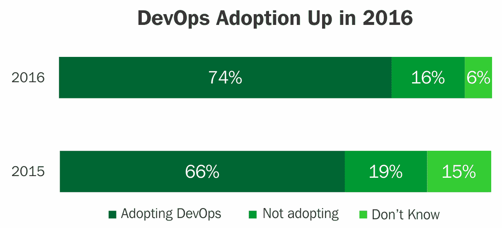
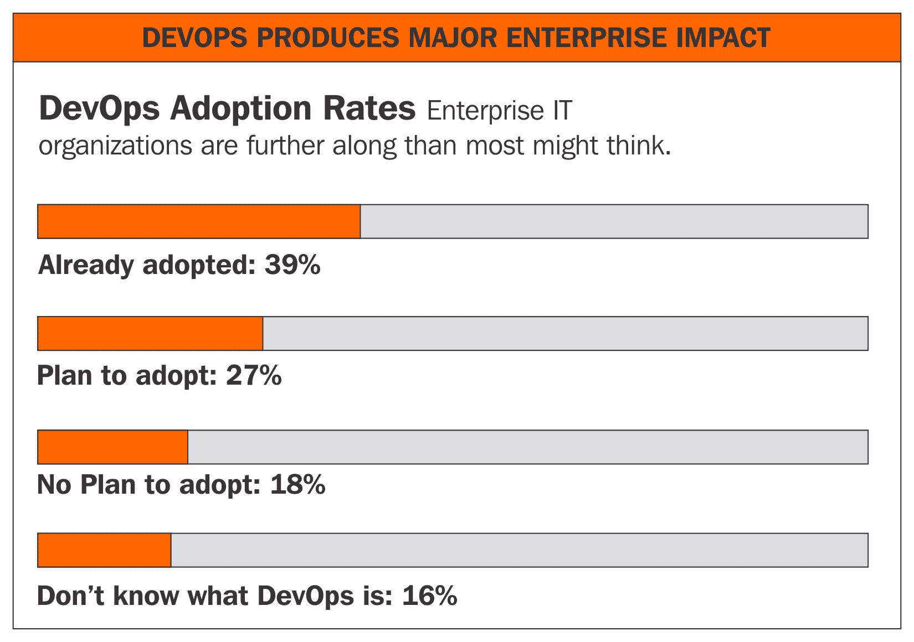
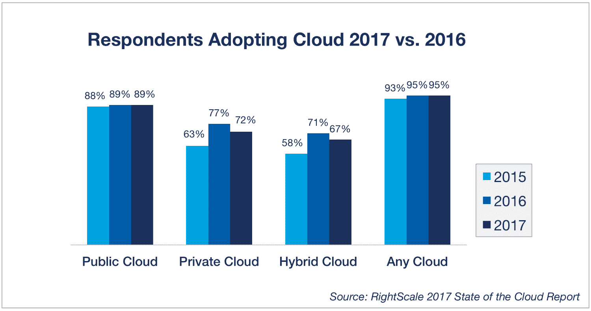

# 第一章：DevOps 简介

在传统的应用程序开发和维护方法中，多个利益相关者、部门、团队和供应商参与了整体的**软件开发生命周期**（**SDLC**）。我们大多数人都熟悉应用生命周期管理的各个阶段：业务分析师收集业务需求，然后由开发团队开发（或可能外包），由 QA 团队测试（也可能外包）功能和适用性。在适用的情况下，还会进行性能和压力测试，由相关的团队使用相关的工具进行。接着，生产部署过程会通过 IT 团队进行管理，使用检查表和审批流程，之后由维护团队进行监控和支持。我们会发现，从功能开发到可用性和维护的每个成熟周期阶段，都是由独立的团队、部门、流程和工具在孤岛中管理的。这种方法往往由于技术、框架、流程、人员和工具的影响，导致最终产品在功能、成本、进度、质量、性能以及与供应商之间的接口和集成等行政开销上产生影响。此外，在这种方法中，维护、支持成本和技能需求往往被忽视。然而，从应用生命周期和业务角度来看，维护和支持活动是关键的，且需要提前评估、估算和充分考虑。

本章将涵盖以下主题：

+   DevOps 简介

+   DevOps 的业务应用

+   业务驱动因素/市场趋势

+   DevOps 战略

+   DevOps 的好处

在几乎每个领域，许多技术创新已经发生，挑战着传统的 IT 管理方法。技术的进步和变化是深刻的、迅速的，并且通常是交织在一起的，涉及多个领域，如敏捷方法论、DevOps、大数据、云计算等。全面和整体的方法无疑将带来回报，并为组织带来最大价值。许多机构已经开始采用这些技术，迈向未来的征程。

在 DevOps 之前，软件开发面临的挑战包括系统的抗拒变更；部署充满风险，环境间缺乏一致性（*它在我的机器上能运行*症状），孤岛效应的影响——例如团队之间相互传递问题，导致重复工作、技能集重复以及内部争斗。为了解决上述问题并弥合这个差距，DevOps 作为一种流行的选择应运而生。

DevOps（开发加运维）最近在 SDLC 中占据了核心地位。DevOps 提供了一个通过开源工具增强的过程框架，用于整合应用生命周期的所有阶段，并确保它们作为一个统一的单元运作。它有助于在开发、测试、部署和支持的各个阶段对过程进行对齐和自动化。它包括诸如代码仓库、构建自动化、持续部署等最佳实践。

DevOps 在包括大数据系统和项目在内的系统中的应用，是与传统开发周期相比的一种文化转变。本书的目的是提出组织的概念和采纳策略，涵盖 DevOps、大数据、云、数据科学、内存技术等技术领域。采纳并遵守 DevOps 实践将为任何组织带来回报，并帮助其提高绩效和效率。

各个 IT 功能领域对开源工具的接受度、其受欢迎程度和多功能性，正在全球范围内日益增加。事实上，许多新型的工具变体已被引入市场，针对每个领域。DevOps 的开源工具是 DevOps 在市场中成功被机构采纳的主要推动力，接下来的部分将详细讨论这一点。

如我们所见，各行各业的 DevOps 采纳在每年都稳步增长：

根据以下图示，DevOps 在企业中的渗透显示出健康的趋势：

>

# DevOps 应用 - 商业场景

DevOps 的应用因多种场景而有所不同，以下是其积累的好处：

+   **开发周期的自动化**：通过最小的人工干预满足业务需求，开发人员可以通过代码仓库使用开放工具运行构建；QA 团队可以创建一个作为复制品的 QA 系统，并将其无缝快速地部署到生产环境中。

+   **单一的真相版本 - 源代码管理**：*虽然有多个版本的代码，但很难确定哪个版本适用于特定目的。我们缺乏一个单一的真相版本。代码评审反馈通过电子邮件进行且没有记录，导致混乱和返工。*

+   **一致的配置管理**：我们在不同的系统上开发、测试和构建源代码。验证平台和依赖关系的兼容版本是手动的，容易出错。确保所有系统使用相同的语言，具有相同版本的工具、编译器等是非常具有挑战性的。我们的代码在构建系统上运行正常，但在移至生产系统时却无法正常工作，导致关于业务交付的尴尬，以及为响应而产生的成本开销。

+   **产品准备就绪**：*我们有一个开发代码、测试和构建的过程，并且有明确的时间节点。这个过程中有很多手动检查和验证；不同团队之间的整合导致我们的承诺和交付日期变得不可预测。我们希望定期了解我们的产品离交付还有多远以及它的质量，以便提前规划，而不是被动应对。*

+   **手动过程自动化**：我们正在遵循手动过程，这些过程常常容易出错，希望通过在适用的地方遵循自动化过程来提高效率。测试周期自动化、增量测试和与构建周期的集成将加速产品质量、发布周期，以及基础设施服务的自动化，例如创建、启动、停止、删除、终止和重启虚拟机或裸机。

+   **容器化**：*代码的可移植性是主要挑战。代码在开发和 QA 环境中可以运行，但迁移到生产系统时会遇到许多问题，例如由于依赖问题导致代码无法编译，构建失败等。构建平台无关的代码是一个挑战，而维护多个平台版本的开发和 QA 平台则是一个巨大的负担。可移植的容器代码可以缓解这些问题。*

+   **本地化挑战**：我们有许多本地系统。从容量规划到周转时间，都存在多种挑战。资本支出和运营费用是不可预测的。云迁移似乎有多种选择和供应商，因此需要有效的采纳方法来确保结果。

# DevOps 采用大数据的商业驱动因素

促使大数据系统广泛流行和采纳 DevOps 的因素列举如下。

# 数据爆炸

*数据是新型货币*——没错，你没看错，它和石油、黄金一样，都是一种宝贵的资产。在过去十年里，许多公司意识到数据作为一种无价资产对其增长和业绩的潜力。

让我们了解数据为何如此重要。对于任何组织来说，数据可以有多种形式，例如客户数据、产品数据、员工数据等。如果没有关于员工、客户或产品的正确数据，后果可能是灾难性的。正确的数据是有效经营企业的基本知识和常识。如今几乎没有企业不依赖于数据驱动的决策；现如今，CEO 们比以往任何时候都更加依赖数据来做出商业决策，例如哪个产品在市场上更成功，哪个地区的需求量更大，哪个价格更具竞争力，等等。

数据可以通过多种渠道生成，包括内部数据、外部数据甚至社交媒体数据。内部数据是通过内部系统和操作生成的数据，例如在银行中，通过多个渠道如 ATM、在线支付、购买等，新增客户或进行客户交易。外部数据来源可能是从印度储备银行（RBI）获取黄金汇率和外汇汇率等数据。如今，社交媒体数据广泛用于产品的营销和客户反馈。智能地利用来自各个渠道的数据是商业成功的关键。

更进一步，部分公司甚至将数据变现，例如 Healthcare IQ、Owens & Minor、State Street Global Corporation、Ad Juggler、comScore、Verisk Analytics、Nielsen 和 LexisNexis。这些组织购买原始数据，如在线产品销售的网页分析数据，或每个品牌的在线搜索记录，再将这些数据重新处理成有组织的格式，出售给需要竞争情报数据以重新定位产品市场的研究分析师或组织。

让我们分析一下推动数据和商业增长的因素。市场和客户行为的根本变化对数据爆炸产生了显著影响。一些关键的变化驱动力包括：

+   **客户偏好**：如今，客户有多种方式与企业互动；例如，银行提供多个渠道，如 ATM 提款、在线银行、移动银行、卡支付、现场银行等。购买方式也是如此，可以是在商店、在线或基于移动设备的，这些渠道都需要企业维护以进行业务运营。因此，这些多个渠道促成了数据管理的增加。

+   **社交媒体**：数据正源源不断地从社交媒体涌入，如 Facebook、LinkedIn 和 Twitter。一方面，它们是个人之间的社交互动网站；另一方面，企业也依赖社交媒体来推广他们的产品。以 TB 或 PB 级别发布的数据反过来被许多组织用于数据挖掘。这正在促进数据的爆炸性增长。

+   **监管**：公司需要按照监管机构的要求，以适当的格式存储数据，并保持一段规定时间。例如，为了打击洗钱，每个从事金融业务的组织都需要保留清晰的客户记录和凭证，以便在较长时间内（如 10 到 15 年）与监管机构共享。

+   **数字化世界**：随着我们向无纸化的数字世界迈进，我们不断增加更多的数字数据，如电子书和企业资源计划（ERP）应用程序，以自动化许多任务并避免纸质工作。这些创新也正在推动数字数据增长。

下一代将更加依赖数据，物联网和数据科学处于前沿，推动着商业和客户的优先事项。

# 云计算

云平台作为事实上的服务线的接受带来了许多基础设施采购和管理方面的变化。将硬件和其他类型的商品化工作迁移到云端对于提高效率也至关重要，因为将这些 IT 功能迁移到云端可以提升服务效率，并且使 IT 部门能够将注意力从操作系统的修补上转移开。随着云的采用，DevOps 成为了最广泛实施的流行选择。随着云的普及，基础设施/服务器的添加变得触手可及。这一点，再加上可信的开源工具，为 DevOps 铺平了道路。

在短短的时间内，可以使用开源工具添加构建、QA 和预生产机器，并根据需要进行精确的复制和配置。

# 大数据

大数据是用来表示数据的多个维度，如大容量、高速和多样性，并为业务提供价值的数据术语。数据来自多个来源，如结构化、半结构化和非结构化数据。数据的速度可以是批量模式、来自机器传感器或在线服务器日志的实时数据，甚至是实时流式数据。数据的体积可以是 TB 或 PB，通常存储在基于 Hadoop 的存储和其他开源平台上。大数据分析还扩展到了建立社交媒体分析，例如基于 Twitter、LinkedIn、Facebook 等社交媒体数据的市场情绪分析；这些数据有助于了解客户情绪，并支持市场营销和客户服务活动。

# 数据科学与机器学习

数据科学作为一个领域有许多维度和应用。我们熟悉科学；我们理解通过建立可重用的、已确立的公式而产生的特征、行为模式和有意义的见解。以类似的方式，数据也可以通过工程学和统计方法进行研究，以了解行为模式和有意义的见解。因此，它可以被看作是数据+科学，或者说是数据的科学。机器学习是数据提取、**提取、转换、加载**（**ETL**）或**提取、加载、转换**（**ELT**）准备的结合，并使用预测算法从数据中提取有意义的模式，以生成商业价值。这些项目具有与项目或产品开发一致的开发生命周期。与 DevOps 方法论的对齐将为程序的演进提供有价值的益处。

# 内存计算

传统的软件架构以前基于磁盘作为主要的数据存储；随后，数据从磁盘转移到主内存和 CPU，以执行业务逻辑的聚合操作。这造成了大批量数据从磁盘到内存单元来回移动的 IO 开销。

内存技术基于硬件和软件创新，将完整的商业应用数据处理在主内存中，因此计算速度非常快。为了实现内存计算，许多底层硬件和软件的进步做出了贡献。

软件进展包括以下内容：

+   数据分区

+   没有汇总表

+   插入唯一的增量

+   数据压缩

+   行与列存储

硬件进展包括以下内容：

+   多核架构支持大规模并行扩展

+   多重压缩

+   主内存具有可扩展的容量

+   快速预取无限大小

我们将在接下来的章节中详细阐述这些内容。

# 规划 DevOps 战略

本书讨论的良好 DevOps 战略帮助用户深入理解主题，并将其应用于多种技术和接口，使组织提供聚焦，形成对当前问题的共同（无偏）视角，发展未来状态，揭示增长机会，最终产生更好的商业成果。

一个全面的 DevOps 战略，在最基本的层面，必须回答以下问题：

+   我们的商业目标是什么？

+   我们如何规划路线图？我们从哪里开始？

+   我们应该如何集中我们的努力？

+   我们试图达成什么目标？

+   这一进度表是什么？

+   这对业务的影响是什么？

+   我们的利益相关者如何看待这一价值？

+   做这件事的好处与成本是什么？

一个良好的 DevOps 战略将为组织带来多重好处，将精力集中在高影响问题上，清晰地制定未来状态，识别增长机会，为更好的商业成果铺平道路。

DevOps 平台战略将是一个独特且广泛的程序，涵盖软件生命周期的各个方面，集成多种技术、平台和工具，面对许多需要用技巧、精确度和经验来处理的挑战。

一个组织可以考虑引入 DevOps 来满足特定需求，例如以下目的：

+   自动化基础设施和工作流配置管理

+   自动化代码库、构建、测试和工作流

+   持续集成和部署

+   虚拟化、容器化和负载均衡

+   大数据和社交媒体项目

+   机器学习项目

有许多种开源工具可供选择，以在 DevOps 的特定领域中进行采纳，例如以下工具：

+   **Docker**：Docker 容器将应用程序及其依赖项打包在一个箱子里。它作为主机操作系统上的隔离进程运行，共享内核与另一个容器。它享有像虚拟机一样的资源隔离和分配优势，但更便捷和高效。

+   **Kubernetes**: Kubernetes 是一个用于 Docker 容器的开源编排系统。它将容器分组成逻辑单元以便易于管理和发现，在节点上处理调度，并积极管理工作负载，以确保其状态与用户声明的意图匹配。

+   **Jenkins**: Jenkins 是一个通过应用程序或像 Tomcat 这样的 Web 服务器进行使用的 Web 启用工具，用于持续构建、部署和测试，并与构建工具（如 Ant/Maven）和源代码库 Git 集成。它还具有主节点和从节点。

+   **Ansible**: Ansible 自动化软件的供应、配置管理和应用程序部署，采用无代理、**Secured Shell** (**SSH**)模式，Playbooks、Towers 和 Yum 脚本是其机制。

+   **Chef 和 Puppet**: Chef 和 Puppet 是基于代理的拉取机制，用于工作单元的部署自动化。

+   **GitHub**: Git 是一种流行的开源版本控制系统。它是一个基于 Web 的托管服务，用于 Git 仓库。GitHub 允许您托管远程 Git 仓库，并具有丰富的基于社区的服务，使其成为开源项目的理想选择。

有各种可用的全面框架，如 RedHat Openshift、Microsoft Azure 和 AWS 容器服务，配备预集成和配置的工具以实施。

这里列出了一些流行的开源工具:

+   **源代码管理**: Git、GitHub、Subversion、Bitbucket

+   **构建管理**: Maven、Ant、Make、MSBuild

+   **测试工具**: JUnit、Selenium、Cucumber、QUnit

+   **仓库管理**: Nexus、Artifactory、Docker hub

+   **持续集成**: Jenkins、Bamboo、TeamCity、Visual Studio

+   **配置供应**: Chef、Puppet、Ansible、Salt

+   **发布管理**: Visual Studio、Serena Release、StackStorm

+   **云**: AWS、Azure、OpenShift、Rackspace

+   **部署管理**: Rapid Deploy、Code Deploy、Elastic box

+   **协作**: Jira、Team Foundation、Slack

+   **BI/监控**: Kibana、Elasticsearch、Nagios

+   **日志**: Splunk、Logentries、Logstash

+   **容器**: Linux、Docker、Kubernetes、Swam、AWS、Azure

我们将深入探讨 DevOps 框架、成熟模型及在相应上下文中应用这些工具的章节。

# DevOps 的好处

对于以下原因，组织不遵循 DevOps 实践将是具有挑战性的:

+   对于开发、QA 和生产系统的每一次部署都需要高投入

+   复杂的手动安装过程既繁琐又昂贵

+   缺乏全面的操作手册使得系统难以操作

+   缺乏足够的跟踪或日志文件细节使得故障排除不完整

+   未评估其他应用程序的性能影响的应用程序特定问题

+   根据业务应用程序要求的 SLA 遵守，将是具有挑战性的

+   在隔离环境中监视服务器、文件系统、数据库和应用程序将存在漏洞

+   在独立环境中，为故障转移而进行的业务应用冗余是昂贵的

DevOps 在大数据系统中的应用和成熟将为组织带来以下好处：

+   DevOps 流程可以作为独立流程实施，或与其他流程结合使用

+   自动化框架将提高业务效率

+   DevOps 框架有助于在应用程序代码中构建弹性

+   DevOps 流程包含了针对操作要求的 SLA（服务水平协议）

+   操作手册（runbook）在开发过程中准备，以支持运营

+   在成熟的 DevOps 流程中，基于操作手册（runbook）的开发已经集成

+   在 DevOps 流程中，特定应用的监控是开发过程的一部分

+   DevOps 规划考虑了高可用性和灾难恢复技术

+   弹性与技术特性相一致地被构建到应用程序代码中

+   DevOps 全脚本安装实现完全自动化部署

+   DevOps 运维团队和开发人员熟悉使用日志框架

+   非功能性需求，如可操作性、维护性和监控，得到了充分关注，并与系统开发规范相结合

+   持续集成和持续交付消除了人为错误，减少了升级时的计划停机，并促进了生产力的提升

# 总结

本章我们了解了 DevOps 的概念、主要市场趋势，以及推动 DevOps 在大数据、云计算、数据科学等系统中应用的商业驱动因素。并展示了包含大量 DevOps 应用示例的商业场景。接下来的章节将详细介绍如何使用流行的开源工具实现 DevOps 的应用，从而极大提高组织的生产力。

在下一章，我们将讨论大数据、内存技术、数据科学技术以及数据可视化技术的概念。
