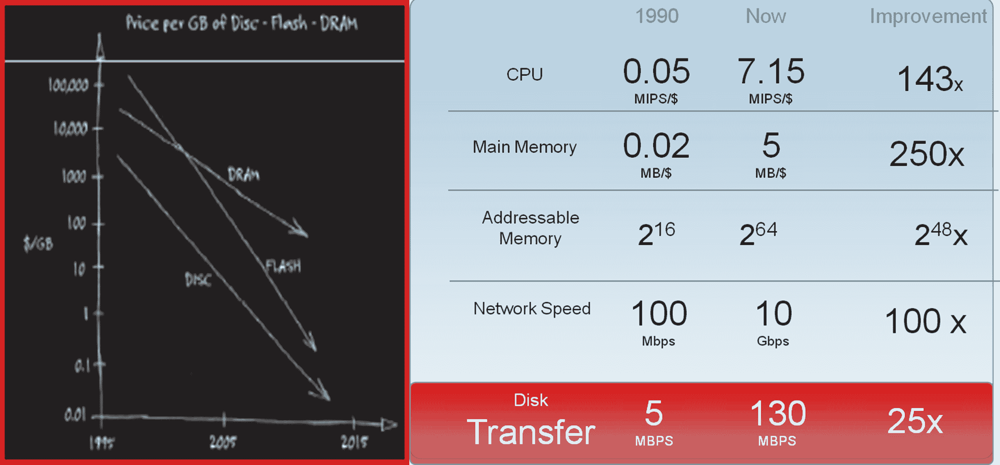
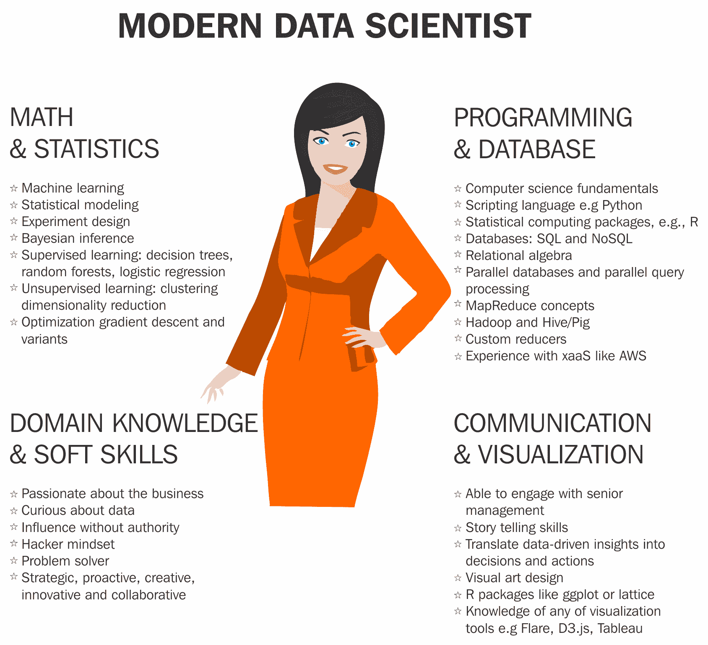

# 第二章：大数据与数据科学简介

我们将讨论一些关键的技术概念，如内存计算和 NoSQL 数据库，这些都是大数据主题的基石，此外还会涉及数据可视化和数据科学的概念。这些概念对于初学者来说非常有价值，并且在未来的章节中构建大数据应用时会受到赞赏。熟悉这些概念的读者可以选择跳过本节。在本章中，我们将涵盖以下主题：

+   大数据特性

+   内存计算概念

+   NoSQL 数据库

+   数据可视化

+   数据科学

# 大数据

大数据在各行业、学术界、组织和个人中有许多解释和定义。这是一个非常广泛且不断发展的领域，许多组织以某种形式采用大数据来补充现有的分析和业务工具。大数据系统主要用于从数据中提取有意义的价值和隐藏的模式。它们还用于补充不同类型的传统工作负载，从而实现规模经济，降低成本。大数据的三大主要来源是人类、组织和传感器。

大数据系统的特点包括一些属性，如数据量、数据速度、数据的多样性和价值；其他特征包括真实性、有效性、波动性和可视化：

+   **价值**：大数据的最终目标是通过大数据项目的所有分析，为公司创造一定的商业价值和目的。

+   **数据量**：大数据系统的规模可以根据业务需求扩展，达到千兆字节、太字节、拍字节、艾字节、泽字节等。每个企业有不同的规模需求；例如，**企业资源计划**（**ERP**）系统可能涉及到千兆字节的数据，而**物联网**（**IoT**）和机器传感器数据可能涉及到拍字节的数据。

+   **数据速度**：数据访问的速度可以是批处理作业、定期处理、接近实时、实时数据，如来自 Web 服务器日志的数据、实时视频和多媒体流数据、物联网传感器信息、天气预报等。我们可以将每分钟每一天由一个组织发送的短信数量、Facebook 状态更新或信用卡刷卡次数相关联。

+   **数据的多样性**：数据的多样性是大数据的关键组成部分之一。数据可以有多种形式，例如，类似销售发票报表日期、销售金额、商店 ID、商店地址等的结构化数据，这些数据可以轻松适应传统的关系型数据库管理系统（RDBMS）；半结构化数据，如网页或服务器日志、机器传感器数据和移动设备数据；非结构化数据，如社交媒体数据，包括 Twitter 动态、Facebook 数据、照片、音频、视频、MRI 图像等。

结构化数据有一个形式和规则，遵循特定的元数据模型，并且日期遵循特定的模式。然而，非结构化和半结构化数据没有预定义的元数据模型规则。大数据的目标之一就是利用技术从非结构化数据中提取业务意义。

+   **数据真实性**：这是数据的可信度；数据应该没有偏差和异常。它确保从不同源系统收集的数据的质量和准确性，并进行预处理质量检查，保持数据的干净，确保没有脏数据积累。

+   **数据有效性**：数据应该正确且有效，确保其适合预定用途，确保其适用性。即便是在传统的数据分析中，数据的有效性对于程序的成功至关重要。

+   **数据波动性**：这是数据的保质期，它的有效性只限于特定的时间段。过时的数据将无法为任何项目或程序生成预期的结果。

+   **可视化**：通过图像进行可视化比使用度量或 Excel 格式的原始数据更能吸引人眼球。能够从输入数据系统或数据流到最终分析的过程中可视化数据趋势和模式，是大数据项目的一项重要资产。

在传统的数据仓库中，数据是结构化的，就像关系型数据库（RDBMS）中的数据一样，数据模式会被建模以便将数据加载到数据库中。

在大数据系统中，数据的处理从数据摄取到持久化、计算、分析等，与传统的数据仓库系统有很大不同，因为数据量、速度和格式在从源系统摄取到持久化的过程中差异很大。这些系统需要高度可用性和可扩展性，才能支撑从暂存到持久化和分析的过程。

可扩展性是通过集群资源池化的方式实现的，包括内存、计算和磁盘空间。根据不同的工作负载需求或随着业务扩展而增加的数据量，可以向集群中添加新的机器，以补充资源需求。对于执行实时分析、生产系统或持有实时数据的暂存和边缘系统来说，高可用性非常重要。高可用性集群意味着即使发生硬件或软件故障，也能确保容错系统，确保数据和系统的持续访问。

我们将在第四章中讨论基于 Hadoop 的集群建设作为支持，*大数据 Hadoop 生态系统*，包括各种行业工具。

另一种重要的大数据技术是内存计算，它包括软件和硬件技术的进步，用以处理大数据系统中巨大的数据量、速度和多样性。我们将详细讨论这些技术。

# 内存技术

在传统的应用程序开发中，磁盘是数据存储的主要持久性。此方法的挑战在于，针对业务逻辑和应用计算，数据需要从存储磁盘传输到主内存，造成巨大的 I/O 开销。同样，在基于业务逻辑的计算完成后，聚合、计算或分析结果的数据会从 CPU 和主内存传输到存储中，或者数据会被持久化回存储磁盘，从而导致多次 I/O 开销。

如下简单示意图所示，与其他硬件组件相比，磁盘速度增长较慢，而对更高性能和更快速度的需求则日益增加：

# 内存数据库（IMDB）

与传统的基于磁盘的数据持久化方法相比，内存技术使得完整的应用程序需要将数据加载到系统的主内存中。这使得应用程序的执行速度提高了 10 到 20 倍。

+   数据永久驻留在主内存中

+   主内存是数据存储的主要*持久性*。

+   磁盘作为持久化存储，用于日志记录和从磁盘恢复

+   主内存访问对性能至关重要

+   依赖缓存的算法/数据结构在响应上更加高效

** **

# 为内存系统采用的硬件技术进展

许多硬件进展已被集成到现代内存计算架构中，如多核架构和大规模并行扩展。

内存数据库经过优化，能够利用多核处理器的能力来实现极快的查询。处理器速度不再依赖于时钟速度，而是取决于系统并行度。现代服务器主板上有许多 CPU，每个 CPU 有多个核心。

可以在不同级别实现并行性，例如从应用程序级别到数据库级别的查询执行。多线程应用程序处理通过将每个查询映射到单个核心来处理，因此多个查询被并行分配到多个核心上。查询处理还涉及数据处理（即，数据库需要并行查询）。内存系统将工作负载分布到单个系统的多个核心上。

# 为内存系统采用的软件技术进展

软件技术进展促进了**内存数据库**（**IMDB**）引擎的发展；它们如下所示：

+   数据压缩

+   无聚合表

+   仅插入表

+   列、行和混合存储

+   分区

# 数据压缩

内存技术使数据压缩技术能够实现高达 20 倍的数据压缩。有多种算法，如位图、游程编码、字典编码、前缀/后缀编码、集群编码、相对编码、增量编码和间接编码。内存引擎将应用最合适的算法或算法组合，以实现最佳的压缩比和性能。

数据压缩的目标是尽可能减少数据来回传输的量。为实现此目标，需要使用适当的算法和技术，以最小化与数据压缩和解压缩相关的开销。提高整体查询性能也是有效数据压缩的目标之一。

# 没有聚合表。

内存数据库消除了维护昂贵的预聚合表的需要，因为数据存储在系统内存中，计算和聚合是即时进行的，因为数据没有来回传输。这消除了维护物化聚合视图的开销，我们可以实时生成这些视图。

# 仅插入表。

在典型的数据库中，删除记录是性能和开销密集型的。内存数据库不是删除记录，而是将其标记为过时记录，类似于版本控制系统，它不用于计算。因此，删除记录和重新索引其余记录（这些操作是性能密集型的）所带来的开销被消除。

# 列、行和混合存储。

**在线事务处理**（**OLTP**）应用程序采用行存储方式，其中表数据作为记录序列存储。行存储表和存储在 OLTP 应用程序中更为高效，原因如下：

+   应用程序在任何给定时间只处理单个记录。

+   在任何时刻，单个记录可能会遭受多次选择和/或更新。

+   应用程序通常访问完整的记录（或行）。

+   由于列值有很多不同的值，因此压缩率较低。

+   在 OLTP 应用程序中，需要聚合或快速搜索。

+   配置表的行数较少。

在**在线分析处理**（**OLAP**）系统（如数据仓库）中，使用列存储，其中聚合函数起着重要作用；列中的条目存储在连续的内存位置，因此在列存储中聚合操作快速而高效。列存储或表在以下情况下是有利的：

+   计算通常只在单列或少数几列上执行。

+   根据少数几列的值来执行表搜索。

+   表中有大量的列。

+   需要对表行执行列密集型操作，如聚合、扫描等。

+   由于大多数列仅包含少量不同的值（与表中的行数相比），因此可以实现较高的压缩率

IMDB 技术通过使用混合存储提供更高的效率。它使用算法选择适当的行存储和列存储的组合，以获得最佳的性能效率。它还为用户提供了自定义存储选项的选择，如选择或更改任何特定表的列式或表式存储。在某些情况下，使用列存储在 OLTP 应用程序中能最大化效率；这需要对事务系统中的插入和索引列数据存储进行平衡且充分理解的方式。

# 分区

数据分区是为了提高性能、方便管理、简化备份和恢复等。数据分区技术有多种类型。

基于一些共同亲和力的分区方法，例如按相等的时间段（如月份、周、年）分组数据，或按表的大小、维度、功能等进行分区

示例包括将前 1M 条记录分组的表、分组处理工资数据的表等

数据分区策略中使用了多种技术，如分组分区、水平分区、垂直分区、混合分区等。

内存数据库系统列举如下：

+   Apache Spark

+   Pivot GemFire

+   eXtremeDB

+   SAP HANA

+   IBM SolidDB

+   MSSQL 服务器

+   Oracle TimesTen

+   MemSQL

+   VoltDB

启用商业智能和可视化工具的内存技术列举如下：

+   Microstrategy

+   Tableau

+   QlikView

+   PowerBI

+   TIBCO Spotfire

# NoSQL 数据库

传统的关系型数据库管理系统（RDBMS）因其结构化数据、预配置模式和事务企业应用程序中严格的数据一致性而广受欢迎，具有以下特点：

+   支持集中式应用程序，如 ERP 系统，这些系统整合了企业数据

+   应用程序可用性可能从适中到高可用性

+   支持的数据流速适中

+   通常，数据输入限制在少数几个源系统

+   它们处理的数据主要是结构化的

+   数据库支持复杂和嵌套事务

+   主要期望是扩展支持多个并发用户的读取操作

+   支持适中的数据量，并具有缓存和清除功能

大多数现代应用程序基于 NoSQL 数据库来创建灵活的数据模式、读取时模式或无模式，从而有效设计基于网页和云的系统。关键需求是能够处理大量数据，并迅速将数据分发到计算集群中，以支持不断更新的应用程序快速变化。传统的 RDBMS 系统无法满足云和网页应用程序中大规模数据库集群的需求。

NoSQL 数据库系统是为以下场景设计的：

+   支持分布在多个位置的去中心化应用程序，如 web 应用程序、移动应用程序、物联网等

+   应用程序需要持续可用，不能容忍停机

+   它们支持高速数据，数据来源可能是设备、传感器等

+   获取的数据不局限于单一位置，可以分布在多个位置

+   数据形式分为结构化、半结构化和非结构化

+   事务类型大多较为简单；然而，它们可以维持高数据量，并能长时间保留数据

+   需要为高强度读写操作和大数据量的系统提供可扩展性

+   支持多个用户的并发操作

NoSQL 数据库有四种类型，分别有不同的用途：

+   **键值数据库**：也叫做 **键值存储**。它存储没有模式的数据。该名称来源于数据按索引或唯一键与关联值存储的特点。它们具有高度可扩展性，能够为 Web 应用程序提供会话管理和缓存，具有高性能和无模式设计。此类数据库很受欢迎，示例包括 Cassandra、DynamoDB、**Azure 表存储**（**ATS**）、Riak、BerkeleyDB、Aerospike 和 MemchacheDB。

+   **文档数据库**：这些数据库存储半结构化的数据，如文档描述和信息。每个文档都会分配一个唯一键，用于检索文档数据。一个优势是数据记录可以基于唯一键创建和更新，从而存储、检索和管理文档。对于基于 Web 的应用程序，数据交换通过 JavaScript 和 **JavaScript 对象表示法**（**JSON**）进行，JSON 在内容管理和移动应用程序数据处理中非常流行。文档数据库的流行示例包括 Couchbase 服务器、CouchDB、DocumentDB、MarkLogic 和 MongoDB。

+   **宽列存储**：这些存储是将数据表按列而非按行组织。宽列存储可以在 SQL 和 NoSQL 数据库中找到，提供非常高的性能和高度可扩展的架构。宽列存储比传统的关系数据库更快，能够非常快速地查询大量数据，因此被用于如推荐引擎、目录、欺诈检测等数据处理密集型系统。一些流行的宽列存储示例包括 Google Bigtable、Cassandra 和 HBase。

+   **图形数据库**：图形数据存储将数据表示为关系模型，并将数据组织为节点。它们的设计目的是表示数据关系作为相互连接的元素，例如，通过图形展示它们之间关系的数量。一个例子是节点之间的连接；图形数据模型可以随时间演变，因此适用于灵活的架构。图形数据库在必须映射关系的系统中得到了有效应用，比如社交网络中的好友连接、预订系统或客户关系管理。图形数据库的例子包括 AllegroGraph、IBM Graph、Neo4j 和 Titan。

NoSQL 数据库的选择基于业务需求，如构建需要高性能、可扩展性、灵活性、功能性和复杂性的海量数据和 Web 应用程序。

+   **架构**：基于 Web 和云的系统的基本要求是持续运行、跨地域的数据复制、可预测的性能等等。架构应设计为支持多样化的工作负载模式，技术应支持高容量、多样性和高速的数据摄取。能够实时执行事务，对数据湖或多个系统进行实时分析。一些系统基于主/从模型，比如 MongoDB，另一些是无主模型，其中数据库集群中的所有节点执行相同的角色，如 Cassandra。

+   **数据模型可扩展性**：数据模型基于不同类型，如宽行表存储、文档导向、键值存储或图形存储等，以便快速和弹性地扩展，以适应所有场景和时刻，必要时可以跨多个数据中心，甚至扩展到云端。

+   **数据分布模型**：根据其固有的架构差异，NoSQL 数据库在数据的读取、写入和分布方面表现不同。例如，Cassandra 非常适合在集群中的每个节点上进行写入和读取，并且可以在多个云提供商的数据中心之间复制和同步数据。

+   **开发模型与支持**：根据它们的开发 API，NoSQL 数据库可能有独特的类似 SQL 的语言（例如，Cassandra 的 CQL）。技术的供应商或社区支持将是管理环境的个人和团队宝贵的资源。

+   **性能和持续可用性**：在一个在线世界中，海量数据必须在变化的工作负载下以极高的速度执行，因此数据库必须扩展并执行，以支持应用程序和环境，因为纳秒级的延迟可能会导致销售损失。像航班预订系统（及其数据）这样的创收系统需要 24 小时、7 天不间断地可用，因为企业无法承受任何停机时间。

+   **可管理性和成本**：需要平衡 NoSQL 平台开发和运营复杂性的成本，以便从成本和使用角度对企业可行。部署一个结构良好的 NoSQL 程序提供了所有已经列出的好处，同时还能降低运营成本。

# NoSQL 的好处

正如我们所见，对于云应用程序和分布式系统，NoSQL 数据库是事实上的标准数据库，主要是因为 NoSQL 数据库相比其他数据库管理系统提供了许多强大的特性和好处，如下所示：

+   **持续可用性**：数据库应全天候 24 小时、每周 7 天，或者达到 99.999%的可用性，即使在基础设施故障时也能保持可用。

+   **经济性/最低操作成本**：与维护相关的投资和支出；NoSQL 系统的可扩展性应对企业可负担，并能够支持现有应用程序。

+   **可扩展架构**：网页应用程序支持多个地理位置，因此数据库的架构特性应具备弹性和可扩展性。数据处理功能和能力需支持多个并发的企业系统。

+   **高响应性**：云端和基于网页的应用程序是低延迟的应用程序，必须根据业务需求快速响应。这些应用程序应能在不同条件下运行，如变化的混合工作负载、多种数据模型，以及与第三方工具和应用程序的集成。

+   **弹性可扩展**：数据库和支持的应用程序应设计为能线性和可预测地满足当前和未来的数据需求，并且在运营上成熟。

# 数据可视化

一张图胜千言。数据可视化是以图表、图形、图片或其他视觉方式表示数据。它帮助用户快速理解和分析与数据相关的复杂数据模式、变化和偏差。我们都能同意，浏览大量数值数据记录会非常疲劳。而能够通过图形化方式展示相同的数据将是一种非常有效、高效且节省时间的方法，用来识别我们需要的模式。有许多工具可以帮助进行数据可视化；最简单的形式包括条形图、饼图等。

在大数据可视化中，数据模式起着重要作用。数据可视化的几个好处如下：

+   以简洁、易懂的方式传达概念

+   识别需要关注或改进的领域

+   明确影响客户行为的因素

+   帮助你了解应将哪些产品放置在哪些位置

+   按细分市场和时间段预测销售量

数据表示和可视化方法如下所列：

+   图形图表：

    +   区域图

    +   条形图

    +   气泡图

    +   密度图

    +   误差条

    +   直方图

    +   折线图

    +   多组条形图

    +   平行坐标图

    +   点线图

    +   人口金字塔

    +   雷达条形图

    +   放射性柱形图

    +   散点图

    +   跨度图

    +   螺旋图

    +   堆叠面积图

    +   流图

+   图表：

    +   流程图

    +   插图图表

    +   时间轴

    +   树形图

    +   网络图

    +   文氏图

    +   饼图

    +   象形图表

    +   泡泡图

    +   矩形树图

+   表格：

    +   日历

    +   甘特图

    +   热力图

    +   茎叶图

    +   计数图

    +   时间表

+   地图：

    +   区域分级图

    +   连接图

    +   点图

    +   流向图

# 数据可视化应用

数据可视化非常有价值，可以预览原始数据，以图片和图表形式作为可呈现的格式。以下列出了一些有助于此类工具：

+   **时间序列**：用于绘制单个变量的性能趋势，例如某一汽车型号在 5 年内的销售情况，使用折线图（[`en.wikipedia.org/wiki/Line_chart`](https://en.wikipedia.org/wiki/Line_chart)）展示趋势。

+   **名义比较**：比较一般趋势，例如使用条形图比较不同车型的销量。

+   **排名**：用于比较不同地点在 5 年内特定车型的汽车销售情况。使用条形图（[`en.wikipedia.org/wiki/Bar_chart`](https://en.wikipedia.org/wiki/Bar_chart)）显示在销售上跨区域的比较。

+   **部分到整体**：用于测量整体的比率（即 100%中的百分比）。班级中获得*A*等级学生的百分比通过饼图（[`en.wikipedia.org/wiki/Pie_chart`](https://en.wikipedia.org/wiki/Pie_chart)）或条形图来显示比较比例。

+   **频率分布**：用于评估特定变量在给定区间内的趋势，例如房产价格变化在 0-10%，11-20%等区间内的年数。可以使用直方图（[`en.wikipedia.org/wiki/Histogram`](https://en.wikipedia.org/wiki/Histogram)）或条形图。箱线图（[`en.wikipedia.org/wiki/Box_plot`](https://en.wikipedia.org/wiki/Box_plot)）有助于可视化分布的关键统计数据，如中位数、四分位数、异常值等。

+   **相关性**：用于比较两个变量（*X*和*Y*）趋势移动的依赖性，以确定它们是否倾向于一起移动或相反方向移动，例如，绘制月份内失业率（*X*）和 GDP 增长（*Y*）的散点图（[`en.wikipedia.org/wiki/Scatter_plot`](https://en.wikipedia.org/wiki/Scatter_plot)）。

+   **偏差**：用于比较实际与参考金额，例如比较业务几个投资组合的实际与预算支出的比较，使用条形图表示。

+   **地理或地理空间：** 用于比较变量在地图或地理布局中的分布，例如按州划分的商店位置。*地图图*（[`en.wikipedia.org/wiki/Cartogram`](https://en.wikipedia.org/wiki/Cartogram)）是一种典型的图形，用来绘制停车场各个楼层的汽车数量。

一些商业数据可视化工具如下：

+   Tableau

+   QlikView

+   Microstrategy

+   微软 PowerBI

+   TIBCO Spotfire

+   Looker

+   DOMO

+   ZOHO

+   Information Builders

+   Chart

一些数据可视化开源工具如下：

+   Google Charts

+   Js

+   Ploty

+   Chart Js

+   Charted

+   Leaflet

+   FusionCharts

# 数据科学

与数据科学相关的一些类似术语包括：

+   **数据科学：** 一门跨学科的领域，也被称为数据驱动科学。包括几个阶段，如数据发现、研究来源于不同数据源的各种信息（无论是结构化还是非结构化），获取数据，并应用科学方法和流程以获得洞察力，并应用这些知识创建增值的业务和 IT 策略。

+   **数据挖掘：** 数据挖掘是寻找大数据集中模式的广泛术语。它是将大量数据分类成更易理解且具有凝聚力的信息集的过程。挖掘大量结构化和非结构化数据以识别模式，有助于组织控制成本、提高效率、发现新的市场机会，并增加竞争优势。

+   **机器学习：** 机器学习是设计能够基于输入数据进行学习、调整和改进的系统的学科和实践。这通常涉及到实现预测性和统计性算法，随着更多数据的流入，系统能够不断地聚焦于*正确*的行为和洞察。

数据科学与大数据和数据发现其他接口部分的相互依赖和接口关系如下所示：

大数据发现是大数据、数据科学和数据发现的结合。

Gartner 分析师定义了一种新的发展角色——**公民数据科学家**，他们使用这些工具，将传统业务分析师的技能与专家统计学家的部分专业知识相结合。

现代数据科学家的角色需要具备广泛的跨学科技能，涉及数学、统计学、计算机科学、沟通能力和商业理解等多个领域的交叉。数据科学家最基本、最普遍的技能是能够整合系统并从底层数据中提取有意义且可重复的模式。更为持久的需求是数据科学家需要用所有利益相关者都能理解的语言进行沟通，并展示数据讲故事的特殊技能，无论是口头的还是视觉的，理想情况下两者兼具。

# 总结

在本章中，我们了解了大数据、内存技术、NoSQL 数据库、数据可视化和数据科学的概念。

在下一章中，我们将讨论 DevOps 框架和最佳实践的概念。
