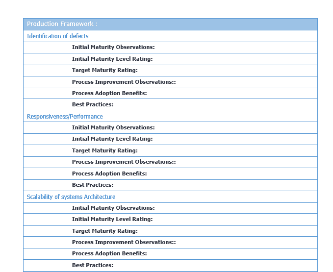

# DevOps 框架

本章将介绍不同的 DevOps 流程、框架和最佳实践。我们将展示 DevOps 流程成熟度框架和进阶模型，并提供每个阶段的检查表模板。我们还将熟悉敏捷术语和方法论，以及组织采纳它所带来的好处。本章将涵盖以下主题：

+   DevOps 流程

+   DevOps 进阶框架

+   DevOps 成熟度模型

+   DevOps 最佳实践

+   敏捷与 DevOps

# DevOps 流程

业界公认的 DevOps 标准流程并被组织采纳，列举如下；我们将详细讨论它们：

+   源代码管理

+   源代码审查

+   配置管理

+   构建管理

+   仓库管理

+   发布管理

+   测试自动化

+   持续集成

+   持续交付

+   持续部署

+   基础设施即代码

+   应用性能监控

+   常规自动化/持续改进

+   DevOps 框架——在 DevOps 框架下，我们将学习生命周期模型、成熟度状态、进阶和最佳实践框架，并同时研究敏捷方法论：

    +   DevOps 项目生命周期

    +   成熟度状态

    +   进阶框架

    +   DevOps 实践框架

    +   敏捷方法论

# DevOps 最佳实践

采纳 DevOps 最佳实践有助于使团队与组织目标保持一致，并推进组织目标的实现。DevOps 在软件开发的每个阶段提供了多个流程框架。DevOps 的全面实施需要组织文化的转变，将部门、人员和软件生命周期的过程整合在一起。这使得组织能够在合规性和流程遵循方面在成熟度路线图上不断向上发展：

# DevOps 流程

以下是业界公认并被组织采纳的 DevOps 标准流程，详细讨论如下。

# 源代码管理(SCM)

源代码管理系统已经使用了数十年，提供了许多功能和优势。然而，将它们与 DevOps 流程集成则能提供强大的集成和自动化功能。源代码管理系统使得多个开发人员可以在不同的地理位置的多个开发中心同时开发代码。SCM 有助于在文件级别进行代码库和版本控制，避免开发人员互相覆盖代码，并能让他们在各自的分支上并行工作。

开发人员将他们的代码更改合并到主分支或子分支，这些更改可以被跟踪、审计、查询以修复漏洞，并在需要时回滚。分支管理是版本控制系统（SCM）的一个重要功能，软件的多个分支被用于不同的大版本和小版本发布，跟踪各个版本发布中的功能和漏洞修复。SCM 使得在开发、测试和生产环境中管理过程遵循成为可能，促进了从开发到支持的整个软件生命周期管理。

DevOps 流程框架强调采用 SCM 为组织带来以下好处：

+   软件开发团队成员之间服务的协调

+   定义任何版本的单一真实来源，无论是小版本还是大版本

+   在实施之前审查更改

+   跟踪共同作者、协作和个人贡献

+   审计代码更改和回滚功能

+   增量备份和恢复

市场上流行的 SCM 工具如下：

+   IBM ClearCase

+   Perforce

+   PVCS

+   Team Foundation Server

+   Visual Studio Team Services

+   Visual SourceSafe

开源 SCM 工具如下——它们的流行也归功于 DevOps 的广泛采用：

+   **Subversion** (**SVN**)

+   **Concurrent Version System** (**CVS**)

+   Git

+   SCCS

+   版本控制系统

+   Bitbucket

# 代码审查

代码审查是提高软件实例质量的重要过程，在它们集成到主流之前。代码审查有助于识别并消除常见漏洞，如内存泄漏、格式错误和缓冲区溢出。代码审查或检查可以是正式的也可以是非正式的。在正式的代码审查中，过程通过多种方法进行，比如正式会议和逐行审查代码的互动。非正式的代码审查可以是肩膀上的审查、电子邮件、对编程、工具辅助代码审查——这些也叫做**代码走查**。

代码审查流程框架为组织带来的好处如下：

+   软件开发团队成员之间的协作

+   在集成之前识别并消除代码缺陷

+   改善代码质量

+   快速的开发周期回转

用于代码审查自动化的专有工具：

+   Crucible

+   Collaborator

+   Codacy

+   Upsource

+   Understand

用于代码审查自动化的开源工具：

+   Review board

+   Phabricator

+   Gerrit

+   GitLab

# 配置管理

**配置管理**（**CM**）是根据**基础架构库**（**ITIL**）在企业级别管理配置项的广泛主题；即使是**配置管理数据库**（**CMDB**）也是配置管理策略的一部分。配置管理包括识别、验证和维护软件和硬件的配置项，例如补丁和版本。简而言之，它就是管理系统的配置，确保其适合预期用途。配置管理工具将验证系统配置的适当性，确保其符合需求并在各系统之间的互操作性。一个常见的例子是确保在开发系统上开发的代码在 QA（测试）系统和生产系统上有效运行。系统之间的任何配置参数丢失都会对应用程序的性能造成灾难性影响。

根据 DevOps，结合配置管理流程和工具对组织的好处可以总结如下：

+   促进组织进行配置变更影响分析

+   允许在不同系统上自动配置，如开发、QA 和生产

+   促进系统的审计、账户和验证

+   通过确保一致性来减少冗余工作

+   高效管理同时更新

+   避免单一真相版本的配置相关问题

+   简化开发和运维团队成员之间的协调

+   它有助于跟踪缺陷并及时解决

+   有助于预测性和预防性维护

一些流行的基础设施配置管理工具如下：

+   BMC Software 的 Atrium

+   惠普企业的通用配置管理数据库

一些流行的软件配置管理工具如下：

+   Chef

+   Puppet

+   Ansible

+   Salt

+   Juju

# 构建管理

构建管理是准备构建环境的过程，将软件应用程序的所有组件组装成一个完整、可工作的产品，适合其预期用途。源代码、编译器、与硬件和软件组件的依赖关系等被编译成一个有机的整体。构建可以是手动的、按需的或自动的。按需自动构建会使用脚本重新启动构建，并且只在少数情况下使用。计划的自动构建通常是在持续集成服务器上进行的夜间构建。触发的自动构建是在持续集成服务器中，一旦提交到 Git 仓库后即会启动。

根据 DevOps，构建管理流程和工具对组织的好处可以总结如下：

+   确保软件可用性的关键功能

+   确保软件在客户环境中的可重用性和可靠性

+   提高软件的效率和质量

+   它也是一种监管要求

一些常用的构建工具如下：

+   Ant

+   Buildr

+   Maven

+   Gradle

+   Grunt

+   MSbuild

+   Visual Build

+   Make (CMake/QMake)

# 构件仓库管理

构建构件仓库管理器是用于托管多个成功构建的二进制组件（可执行文件）仓库的专用服务器。通过集中管理不同类型的二进制文件，它减少了访问的复杂性及其依赖关系。

其好处如下：

+   管理构件生命周期

+   确保构建是可重复和可重现的

+   有序访问构建构件

+   方便在团队和供应商之间共享构建

+   基于构件的保留策略，以符合审计要求

+   高可用性的构件和访问控制

一些常用的仓库工具如下：

+   Sonatype Nexus

+   JFrog Artifactory

+   Apache Archiva

+   NuGet

+   Docker Hub

+   Pulp

+   Npm

# 发布管理

发布管理是软件生命周期中的一个过程，旨在促进发布从开发、测试、部署到支持/维护的顺利流动。它与 SDLC 中的其他 DevOps 过程领域进行接口交互。

发布管理已经成为开发过程中的一个重要组成部分几十年。然而，它被纳入 DevOps 框架后，形成了一个完整的自动化周期。

发布管理是一个迭代周期，由增加新功能或对现有功能进行更改的请求开始。一旦变更获得批准，新版本将被设计、构建、测试、审查，并在接受后部署到生产环境。在支持阶段，可能会有增强或性能改进的需求，从而启动新的开发周期。

采用发布管理的好处如下：

+   产品生命周期的整体管理，跟踪并整合每个阶段

+   协调所有阶段活动——开发、版本控制、构建、质量保证、系统配置、生产部署和支持

+   跟踪各个环境中最近部署的状态

+   与每个发布相关的所有工作项活动的审计历史

+   发布管理的自动化依赖于其所有阶段的自动化

+   团队可以编写发布定义并以可重复、可靠的方式自动化部署，同时追踪从开发到生产的所有发布。

+   对授权访问和变更批准进行细粒度访问控制

一些发布管理工具如下：

+   Electric Cloud

+   Octopus Deploy

+   Continuum

+   Automic

+   Quikbuild

+   UrbanCode Release

+   CA Service Virtualization (LISA)

+   BMC 发布过程管理

+   Plutora Release

+   CA Release Automation

+   Serena Release

+   MS Visual Studio

+   StackStorm

+   Rally

# 测试自动化

手动测试每一个可能的场景既繁琐、劳动密集，又费时费力且昂贵。测试自动化或自动化测试是指在没有人工干预的情况下运行测试用例。尽管并非所有测试用例都符合自动运行的条件，但大部分用例都可以安排自动执行。自动化是通过使用自动化工具运行测试用例，或通过调度自动化脚本来实现的。最近的测试数据作为输入，结果则被捕获以供分析。测试自动化的目标是通过减少需要手动运行的测试用例数量来补充手动测试，而不是完全替代手动测试。

自动化测试适用于重复性、单调、繁琐且耗时的测试用例，且这些用例具有明确的输入和边界条件。不适用于频繁变更的、临时的或首次执行的测试用例。软件自动化测试可以基于几种框架类型：数据框架、关键字框架、模块化框架和混合框架。

测试大数据系统涉及多种技术、集成、框架和测试模块，如功能测试、安全性测试、可用性测试、性能测试、集成测试等。

采用测试自动化的好处如下：

+   提高软件质量和响应能力

+   通过用自动化替代手动工作实现快速周转

+   提高整体测试生命周期的有效性

+   持续集成和交付的增量和集成测试

一些测试自动化工具如下：

+   Visual Studio Test Professional

+   QTP (UFT)

+   SoapUI

+   TestDrive

+   FitNesse

+   Telerik Test Studio

+   Selenium

+   TestComplete

+   Watir

+   Robotium

# 持续集成

持续集成是一种 DevOps 最佳实践，开发人员将他们的代码以小的逻辑单元连续集成到共享的公共仓库中，并保持规律性（例如，每天一次）。这种过程的优势在于代码质量和适应性透明化。如果不采用这种方式，而是等待固定时间后再进行批量代码集成，可能会暴露出许多缺陷或集成问题，而解决这些问题可能会很昂贵。

为了实现持续集成，需要实现一些前提条件，如下：

+   使用版本库来管理源代码

+   定期代码提交计划

+   自动化测试代码更改

+   自动化构建

+   在预生产环境中部署构建

持续集成的好处如下：

+   提前并频繁提交最新的代码

+   由于早期暴露了构建问题，构建周期更短，提交更频繁

+   构建过程的透明性意味着更好的责任归属和更少的缺陷

+   自动化部署过程可实现更快的周转时间

一些常见的持续集成工具如下：

+   Jenkins

+   TeamCity

+   Travis

+   Go CD

+   Buddy

+   Bitbucket

+   Chef

+   Microsoft Teamcenter

+   CruiseControl

+   Bamboo

+   GitLab CI

+   CircleCI

+   Codeship

以下图示展示了持续集成、持续交付和持续部署的角色：

# 持续交付

持续交付是软件开发周期中持续集成的下一步；它通过尽量减少人工努力和开销，实现软件的快速、可靠开发和产品交付。在持续集成中，正如我们所见，代码开发结合了审查，接着是自动化构建和测试。在持续交付中，产品以小的、频繁的单位移动到预生产（暂存）环境中，进行彻底的用户验收测试。重点是了解软件功能和性能相关的问题。这使得与业务逻辑相关的问题能在开发周期早期被发现，确保在进入生产环境部署或添加新功能等其他阶段之前解决这些问题。持续交付为开发人员提供了更高的可靠性和可预测性，确保预定功能的可用性。通过持续交付，您的软件始终准备好发布，最终的生产部署是根据业务决策在时间上手动进行的步骤。

持续交付过程的好处如下：

+   开发的代码不断交付

+   代码不断且定期接受审查

+   高质量的软件被快速、可靠且重复地部署

+   最大化自动化，最小化人工开销

执行持续集成的工具同样完成持续交付的工作。

# 持续部署

持续部署是代码更改的完全成熟和完整的过程周期，涵盖了软件生命周期的每个阶段，最终将代码部署到生产环境中。

持续部署要求整个过程实现自动化——也称为自动化应用发布——涵盖所有阶段，如应用打包、确保依赖项集成、部署测试，以及为合规性生成充分的文档。

持续部署和自动化应用发布的好处如下：

+   频繁的产品发布尽可能快地交付软件

+   通过代码更改实现自动化和加速的产品发布

+   代码更改从技术和质量角度都符合生产要求

+   产品的最新版本以可交付格式准备好

+   部署建模减少了错误，从而提高了产品质量

+   集中访问所有工具、流程和资源数据有助于更快地故障排除和缩短市场时间

+   开发、质量保证和运营团队之间的有效协作提高了产出和客户满意度

+   由于集中查看所有阶段的活动，减少了审计工作量

执行持续集成的工具也完成持续交付的工作。

# 基础设施即代码

**基础设施即代码**（**IaC**）是一种通过定义配置文件来执行基础设施服务的方式。在 DevOps 的范围内，IaC 是通过代码自动化日常任务，通常是配置定义文件，如 Shell 脚本、Ansible 剧本、Chef 食谱或 Puppet 清单。通常是服务器和客户端的设置，采用推送或拉取机制，或者通过**安全外壳**（**SSH**）无代理进行操作。许多常规的系统任务，如创建、启动、停止、删除、终止和重启虚拟机或裸金属机器，都是通过软件来执行的。在传统的本地系统中，许多系统管理任务都是手动的，并且依赖于人为操作。然而，随着大数据和云计算的爆炸式发展，所有常规的系统活动和任务都像软件代码一样进行管理。它们被保存在代码仓库中，并且最新的构建更新会经过测试以进行部署。

IaC 的优点如下：

+   使用定义文件和代码更新系统配置非常快捷

+   所有代码及其更改的版本更加不易出错，并且具有可复现的结果

+   对 IaC 部署和测试系统的彻底测试

+   较小的常规更改容易管理，而较大的基础设施更新可能包含难以检测的错误

+   使用定义文件进行审计追踪和合规性检查非常容易

+   多台服务器同时更新

+   系统可用性高，停机时间少

一些基础设施即代码（IaC）工具如下：

+   Ansible Tower

+   CFEngine

+   厨师

+   Puppet

+   SaltStack

# 常规自动化

每个组织都致力于自动化日常的重复任务；事实上，大多数公司和软件产品的生存依赖于它们自动化的程度。企业资源规划（ERP）系统、数据可视化、领域应用、数据分析等几乎所有环节都可以进行自动化。一些自动化的领域包括基础设施（部署、补丁、可扩展性）、应用程序（开发、集成、构建、交付、部署）、负载均衡器、反馈和缺陷/错误管理。

有多个工具可以自动化每个环节，正如我们在前面的章节中所见，我们将在接下来的章节中探索它们的应用。

# 关键应用性能监控/指标

性能指标是每个工具、产品和服务的一部分。因此，组织始终保持对其应用程序、产品和服务的性能指标监控的警觉。为了实现任何产品的高质量输出，首先必须达到一定的标准化过程和度量标准。衡量性能指标有许多参数，例如：应用程序或硬件系统的可用性或运行时间与停机时间的对比和响应能力，工单分类、确认、解决时间表等。

DevOps 关注的是度量指标和反馈，并通过持续改进流程推动发展。

有多种工具可用于各种需求的应用监控；我们将在本章后续部分中讨论在 DevOps 框架背景下最合适和最适用的工具。

# DevOps 框架

在 DevOps 框架下，我们将研究生命周期模型、成熟度状态、进展与最佳实践框架，以及敏捷方法论。

实现 DevOps 成熟度是一个逐步的过程，朝着良好的结构化和规划目标前进，如以下各阶段所述。

# DevOps 成熟度生命周期

DevOps 项目的各个阶段与软件开发生命周期相对应，具体描述见此处。我们将详细探讨每个阶段：

+   **发现与需求阶段：** DevOps 发现阶段是一个高度互动的项目阶段，旨在从关键利益相关者处收集当前流程、框架和工具的输入与反馈。模板和检查表用于捕捉这些输入。该阶段的时间线取决于关键利益相关者的可用性、所需文档的存在以及待探索流程的复杂性。发现阶段的交付物如下：

    +   详细描述当前流程、工具、框架状态的模板

    +   关键利益相关者对收集的详细信息的签署确认

    +   现有最佳实践和 DevOps 方法

    +   现有挑战、约束（如适用）

    +   可重用的工具、流程、工件

+   **设计阶段：** 设计阶段也是架构阶段；它旨在制作出实现目标状态的蓝图。这是一个反复权衡工具和流程替代方案的过程，最终通过关键利益相关者达成一致。时间线和成本将基准化，并根据项目的新发现进行定期回顾和修订。该阶段的时间线取决于关键利益相关者对流程、工具和预算的接受度。设计阶段的交付物如下：

    +   已达成目标状态共识

    +   将要采用的 DevOps 流程基线

    +   最可行工具的基线，准备实施

    +   商定的时间线和成本基线

+   **开发阶段：** 从蓝图阶段基准的工件将作为开发阶段的输入；包括已商定的流程变更、要实施的工具、要采纳的框架等。一个涵盖交付物、时间表、依赖关系、约束条件、资源平衡等的详细项目计划将非常有用。敏捷 Scrum 方法论将是实施 DevOps 的框架，并将在后续详细讨论。开发阶段的时间线将根据最初基准的项目计划来制定，并随着已完成的里程碑进度定期修订。开发阶段的交付物如下：

    +   初步项目计划已基准并已签署确认

    +   在项目完成之前持续收集反馈

    +   每个阶段的资源分配

    +   包括新技能、新方法、新流程和工具

    +   针对项目风险、约束等的解决方案

    +   按照项目计划约定的交付物

+   **部署阶段：** DevOps 部署阶段遵循上述 DevOps 流程框架中详细列出的最佳实践。它取决于部署的是流程、应用工具，还是基础设施。时间线将根据开发阶段积累的经验进行评估。部署阶段的交付物如下：

    +   部署指南——生产环境切换计划

    +   部署检查清单

    +   关键利益相关者的签字确认

    +   回滚计划

    +   容量规划

+   **监控阶段：** 监控每个阶段在开发、构建、集成和部署过程中的关键性能因素，随着时间的推移进行跟踪。接着是跟踪缺陷、漏洞修复、用户反馈和持续改进的计划。监控阶段的时间线依据组织的需求和性能基准来设定。监控阶段的交付物如下：

    +   操作手册

    +   反馈表和检查清单

    +   用户指南，支持手册

    +   流程手册

    +   性能基准

# DevOps 成熟度图

DevOps 采用是一个为组织增值的过程。它不是一蹴而就的，而是随着时间的推移，逐步成熟并显现出成效。就像任何**能力成熟度模型**（**CMMI**）或流程成熟度模型一样，关键的成功因素必须定义为程序的绩效目标。关键评估参数的初步成熟度状态由关键利益相关者达成一致。然后，项目章程中将定义要实现的参数变量的目标成熟度水平，并详细列出程序、里程碑、预算和由利益相关者批准的约束：

DevOps 流程成熟度框架

# DevOps 进展框架/准备度模型

正如前面模型中所讨论的，DevOps 的采用是组织向更高成熟度状态发展的过程。以下表格列出了 DevOps 在广泛范围内的不同实践领域和成熟度水平。DevOps 的成熟度水平可能会根据团队的标准有所不同，甚至同一组织的不同部门或分支机构，在相同流程下，可能会有显著更为先进的实践。提升到整个企业的最佳 DevOps 流程工作流应成为所有团队和部门的最终目标：

# DevOps 成熟度检查清单

如前节所见，流程成熟度框架通过检查清单和讨论进行评估。对于每个关键重点领域，详细的发现将指示成熟度水平。

发现的结果提供了成熟度水平的一般估计，并评估其产生的影响：

# DevOps 过程项目的敏捷框架

DevOps 项目通常基于敏捷框架，以实现开发和实施过程的高效快速周转。

基于敏捷软件开发的项目已经在行业内得到广泛接受和采纳。传统的瀑布模型已经过时，无法跟上敏捷方法论带来的优势。

敏捷方法论的成功归功于其核心目标：

+   个人和互动优先于流程和工具

+   工作软件优先于全面文档

+   客户协作优先于合同谈判

+   变更采纳灵活性优于项目计划遵循

# 敏捷开发方法

Scrum 是一种敏捷开发方法，专注于功能开发，由以下角色组成的团队来执行：

+   Scrum Master 负责团队组建、主持冲刺会议和消除开发障碍

+   产品负责人创建并优先排序产品待办事项列表，并负责每个冲刺迭代周期内功能的交付

+   Scrum 团队负责管理和组织在冲刺周期内完成的工作

+   产品待办事项列表是要开发的功能特性和需求的清单

敏捷开发方法是一种增量和迭代的方法，用于开发用户故事、软件功能或功能模块。客户可以早期看到产品特性，并在需要时做出必要的更改。开发周期被划分为两个到四周的冲刺周期，以完成工作单元。其理念是，较小的周期能够与开发人员和测试人员共同快速开发和管理。结构和文档不重要，但工作特性被认为是有价值的。开发过程在连续的冲刺周期中迭代完成。发现的缺陷会在最早的冲刺中修复并成功测试。当开发新功能或逻辑时，会进行回归测试。用户验收测试会在冲刺周期后进行，以标记产品是否可以发布：

采用敏捷软件开发最佳实践的好处如下：

+   工作软件能够让客户满意，因为他可以查看功能特性

+   客户可以在任何开发阶段添加变更请求

+   软件能够在几周内快速且持续交付

+   项目围绕着有动机的个体构建，并且应当信任这些个体

+   冲刺团队在交付方面具备高技能和高效率

+   由于开发人员和测试人员共同开发，缺陷将在冲刺周期内解决

+   沟通方式有效，因此交付的产品质量更高

+   持续关注技术卓越带来良好的设计

+   自组织团队专注于最佳架构、需求和设计

+   团队精简且高效，因此生产力得到了最大化

# 总结

在本章中，我们了解了 DevOps 流程、框架、最佳实践以及 DevOps 流程成熟度框架和进展模型，并且配有检查表模板。我们还探讨了敏捷术语和方法论。

在下一章，我们将详细讲解大数据生态系统、不同的框架、Hadoop 集群、节点、容量规划等内容。
