# 大数据 Hadoop 生态系统

我们在前几章讨论了**大数据技术**的关键概念。在本章中，我们将介绍构建大数据集群、框架、关键组件以及流行厂商的架构。我们将在后续章节中讨论大数据 DevOps 概念。

本章将涵盖以下主题：

+   大数据 Hadoop 生态系统

+   大数据集群

    +   类型与应用

    +   高可用性

    +   负载均衡

+   大数据节点

    +   主节点、工作节点、边缘节点

    +   它们的角色

+   Hadoop 框架

    +   Cloudera CDH Hadoop 发行版

    +   **Hortonworks 数据平台** (**HDP**)

    +   MapR Hadoop 发行版

    +   Pivotal 大数据套件

    +   IBM 开放平台

    +   基于云的 Hadoop 发行版

    +   Amazon Elastic MapReduce

    +   Microsoft Azure 的 HDInsight

+   容量规划

    +   因素

    +   指导原则

# 大数据 Hadoop 生态系统

Apache Hadoop 是一个开源软件平台，基于廉价硬件构建，用于将集群扩展到 TB 或 PB 级别，支持大数据处理，跨越成千上万的服务器。它在分布式数据存储和大规模数据集的分布式处理方面非常流行和高效。Hadoop 提供了一整套服务，如数据持久化、数据处理、数据访问、数据治理、数据安全和运营。Hadoop 集群的几个好处列举如下：

+   **数据可扩展性**：大数据量可以指数级增长以容纳这些大数据量，Hadoop 支持数据的分布式处理；数据集群中的每个节点都参与存储、管理、处理和分析数据。节点的增加使得集群能够迅速扩展，支持 PB 级别的数据存储。

+   **数据可靠性**：Hadoop 集群配置提供数据冗余。例如，在某些节点发生意外故障的情况下，Hadoop 集群管理软件会自动将数据和处理任务复制到其余活跃节点上。即使在某些节点不可用的情况下，应用和数据的功能也能得到保证，从而确保了业务的持续性。

+   **数据** **灵活性**：在传统的关系数据库管理系统中，通常在存储结构化数据之前会创建模式表，这被称为*写时模式*。根据处理应用程序的数据需求，Hadoop 系统可以加载多种数据格式，例如结构化、半结构化或非结构化数据。因此，模式是在数据加载过程中动态创建的，称为*读时模式*。

+   **经济性**：Hadoop 是开源的，基于低成本的廉价硬件构建，因此比专有的许可证软件更加经济。

组织采用 Hadoop 系统是因为其多功能性，能够在大数据量下持久化数据、快速、可靠和高效地管理、可视化和分析大量数据，并且支持各种数据格式，具有数据治理、工作流、安全性等功能，并且成本低廉。

# Hadoop 生态系统中的内置工具和功能

Hadoop 生态系统提供了许多内置工具、功能和能力，列举如下：

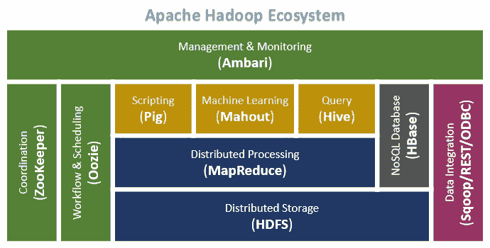

+   **数据存储**：**Hadoop 分布式文件系统**（**HDFS**）提供可扩展、容错且具有成本效益的存储。Hadoop 可以通过将存储分布到多个节点上来处理数据的指数级增长；组合的存储容量可以根据需求增长，同时单位存储成本保持经济。还有其他存储管理工具，如 HBase、Solr 等。

+   **数据湖**：Hadoop 的一个关键优势是能够经济地构建数据湖。它将成为组织存储所有相关数据需求的宝贵资产，这些数据来自不同的数据源并被收集和整合。例如，在制造业中，机器维护数据、库存数据、销售数据、机器性能的传感器数据、客户反馈的社交媒体数据、供应商和供应商数据、天气报告等，可以根据数据湖的需求定期捕获。

+   **数据处理**：

    +   **Hadoop 生态系统**：Hadoop 生态系统提供了批处理、流处理和混合系统的数据处理功能。

    +   **MapReduce**：MapReduce 是 Hadoop 中用于批处理任务的初始处理框架。MapReduce 的处理技术遵循映射、洗牌和归约算法，使用键值对。批处理任务类似于客户的每月电话账单。

    +   **流处理**：像股票价格信息和航空公司预定数据一样，Apache Storm 非常适合处理流数据。

    +   **混合处理系统**：这些处理框架可以同时处理批量和流数据工作负载，例如 Apache Spark、Flink 等。一个典型用例是 **物联网**（**IoT**）中的卡车传感器数据捕获、在云中聚合并分析以推导模式等。

+   **数据访问**：

    +   **Hadoop**：Hadoop 提供了多种方式来访问和处理数据。

    +   **Apache Solr**：Apache Solr 提供了对存储在 HDFS 中数据的索引和搜索功能。

    +   **Hive**：Hive 为 Hadoop 提供数据仓库功能，采用一种类似 SQL 的简单语言叫做 **HiveQL**，该语言提供了索引，使查询更快。可以使用标准 SQL 编程接口，并且提供了与一些分析软件包（如 Tableau、QlikView 等）更好的集成。

    +   **HBase**：一个 NoSQL 列式数据库，提供列式数据存储模型等功能，并为 Hadoop 系统提供稀疏数据存储。

    +   **Flume**：Flume 从源系统（如 Web 服务器日志数据）收集数据，通过 Flume **代理**进行聚合并传输到 Hadoop。

    +   **Mahout**: Mahout 是一个机器学习库，包含了一系列用于聚类、分类和协同过滤的核心算法。这些算法可以在任何处理框架或引擎中实现，如 MapReduce，并且在像 Spark 这样的内存数据挖掘框架中更加高效。

    +   **Sqoop**: Sqoop 是一个有价值的工具，用于将数据从其他数据库系统（主要是关系型数据库）迁移到 Hadoop 中。

    +   **Pig**: Pig Latin 是一种基于 Hadoop 的语言，擅长处理非常深且非常长的数据管道（这是 SQL 的一个限制）。它比 SQL 更简单，更易于使用。

+   **资源管理**: YARN 是动态资源利用的一个重要推动力，是 Hadoop 框架的核心部分。它管理多租户用户的日益增加的工作负载，运行各种 Hadoop 应用而不会影响性能。

+   **统一管理**: Ambari 是一个 RESTful API，提供一个用户友好的网页界面用于 Hadoop 管理。它是 Apache Hadoop 集群的配置、管理和监控工具。Hadoop 集群的配置任务包括在多个主机上安装 Hadoop 服务并为集群配置 Hadoop 服务。Ambari 通过中央管理控制台管理 Hadoop 集群服务，例如启动、停止和重新配置 Hadoop 服务。Ambari 通过仪表盘监控 Hadoop 集群的健康状况和状态，并与 Ambari Metrics System 集成，用于指标收集，以及 Ambari 警报框架。该警报系统会在节点宕机、磁盘使用率超过阈值等情况下进行通知。

+   **工作流管理**:

    +   **Oozie**: Oozie 是一个工作流处理系统，管理和调度一系列任务。任务可以用多种语言编写，如 MapReduce、Pig 和 Hive，并且可以逻辑地相互链接。Oozie 允许调度依赖任务，将一个查询的输出作为下一个任务的输入，确保数据流的顺利进行。

    +   **ZooKeeper**: ZooKeeper 是一个集中式服务，用于维护配置文件、命名、提供分布式同步和提供组服务。所有这些服务都以某种形式被分布式应用程序使用。

+   **综合数据安全与治理:**

    +   Hadoop 的安全性有三种实现模式——身份验证、授权和加密。

    +   身份验证确保只有真实用户能够访问 Hadoop 集群。目前使用的工具有 MIT Kerberos、AD、OpenLDAP 等。

    +   授权授予用户数据权限，如只读、写、修改、删除等。目前使用的工具是 Apache Sentry。

    +   数据加密确保数据在静态和传输过程中免受未经授权的访问。静态数据加密工具是 Navigator Encrypt，传输中的数据加密工具可以通过启用 TLS/SSL 来实现。

    +   在分布式环境中管理 Hadoop 系统的访问权限可能是一项挑战，因为这些环境将 Hadoop 的各个组件部署在不同的集群中，以优化性能。例如，在大型生产环境中，将会有不同的集群组负责工作流、数据存储、数据分析等；因此，管理各个组的访问权限可能会是一项艰巨的任务。

# 大数据集群

Hadoop 集群是由两个或更多计算机或系统（称为节点）组成的系统。它为用户提供一个统一的系统。节点协同工作来执行应用程序或执行其他任务，类似于虚拟机。根据不同的数据需求，有多种 Hadoop 集群变体。这些平台构建的关键特性是可靠性、负载均衡和性能。

单节点或伪分布式集群包含必要的守护进程，如 NameNode、DataNode、JobTracker 和 TaskTracker，这些进程都在同一台机器上运行。单节点集群是一种简单的配置系统，用于通过模拟完整集群环境来测试 Hadoop 应用，且其副本因子为 1。

小型 Hadoop 集群由一个主节点和多个工作节点组成。主节点包含 Job Tracker、Task Tracker、NameNode 和 DataNode。一个从节点或工作节点在需要时可以同时充当 DataNode 和 TaskTracker；可以配置仅存储数据的工作节点和仅计算的工作节点。这些节点用于 Hadoop 应用和项目的全栈开发，副本因子为 3，例如用于有效备份的多节点集群。

多节点或完全分布式集群遵循 Hadoop 集群的主从架构模式。NameNode 和 TaskTracker 守护进程运行在主机上，DataNode 和 TaskTracker 守护进程则运行在一个或多个从机上。此部署用于 Hadoop 应用的全栈生产部署，并且副本因子为 3。

# Hadoop 集群特性

本节将讨论 Hadoop 集群的关键特性，如高可用性的负载均衡和分布式处理等。

# 高可用性

**高可用性**（**HA**）集群通过系统中的冗余设计提供不中断的服务和资源。高可用性不仅要在集群内实现，也需要在集群之间实现。

集群内的高可用性通过一个主节点实现，主节点监控工作节点的任何故障，确保负载分配到其他活跃工作节点。

在不同区域的集群实例之间实现高可用性是通过使每个集群系统监控其他集群，并在故障转移发生时，通过冗余硬件和软件重新配置复制服务器和服务来完成的。硬件故障容忍通过 RAID 系统实现，而对于网络系统，在链路断开时，提供备用链路路径以保证服务的连续性。

# 负载均衡

服务器之间的负载均衡是网络和基于互联网的应用程序日益广泛使用中的一个关键功能。它是一个重要特性，能够将来自客户端的流量请求均匀地分配到所有分配给应用程序的集群中的活跃节点机器上。在节点发生故障时，请求会重新分配到其余活跃的节点上，这些节点负责处理订单。为了可扩展，Web 集群必须确保每个服务器得到充分利用，从而提高网络容量并改善性能。基于负载均衡的 Web 应用服务器被称为**Web 农场**，它们根据调度器和算法独立地重定向请求。几种常见的负载均衡算法包括最少连接法、轮询法和加权公平法，每种算法都有其独特的适用性。

# 高可用性和负载均衡

高可用性和负载均衡结合了两种类型集群的特性，增加了服务和资源的可用性和可扩展性。持续的高可用性和负载均衡是整个 Web 托管和电子商务项目的支柱；它需要确保支持网络流量的可扩展性，而不会最终成为瓶颈或单点故障。除了简单地将客户端流量重定向到其他服务器外，Web 系统还需要验证服务器、冗余和负载均衡特性，如全天候的通信检查。这种类型的集群配置广泛应用于航空公司和火车订票系统、电子商务、银行、电子邮件服务器以及 24/7 应用程序中。

# 分布式处理和并行处理

分布式处理涉及将一个大型计算任务分解成多个较小的任务，以便在单独的小型节点集群上并行运行。它代表了一个大规模并行的超级计算机。这种集群模型适用于大规模计算任务的应用，并提高了可用性和性能。这些集群系统用于基于科学研究的计算、天气预报等需要高处理能力的任务。

# Hadoop 大数据集群的使用

大数据集群用于多种目的，如存储、分析、测试、开发等。为正确的工作负载选择合适大小的集群至关重要，因此集群的容量规划是一项重要且关键的任务。

满足不同需求的大数据集群如下：

+   **开发集群**：构建开发平台有许多需求，例如验证将应用程序迁移到大数据平台上开发功能的技术，以便开发带有机器学习的高级分析用例。

+   **测试集群**：构建一个测试平台，用于测试在开发集群中开发的功能和特性。

+   **数据湖集群**：用于提供广泛存储容量的构建，来自不同源系统的数据（包括第三方数据源）被汇聚到数据湖中。在数据加载到数据湖之前，会进行预处理活动以过滤和执行聚合操作。数据湖为组织中不同部门提供多功能的数据需求。

+   **分析集群**：一个用于执行高级分析的平台，使用适当的算法并发布生成的结果。

# Hadoop 大数据集群节点

我们将讨论不同类型的节点及其在 Hadoop 生态系统中的角色和用途：

+   **NameNode**：NameNode 是 HDFS 文件系统的重要组成部分。它保存文件系统中所有文件的目录树，并跟踪集群数据文件的存储位置。该文件的数据本身并不存储。每当客户端应用程序需要查找文件，或想要修改文件时，都会与 NameNode 进行通信。这些修改会作为日志存储在 NameNode 中，并附加到本地文件系统的编辑文件中。当 NameNode 启动时，它会从一个镜像文件（fsimage）读取 HDFS 的状态，并将编辑应用到日志文件中。

+   **Secondary NameNode**：Secondary NameNode 的整个目的是在 HDFS 中设置检查点。Secondary NameNode 仅是 NameNode 的辅助节点；它定期合并 fsimage 和编辑日志文件，并保持编辑日志的大小在一个限制内。

+   **DataNode**：DataNode 在 HDFS 中存储数据。一个功能齐全的文件系统拥有多个 DataNode，数据在它们之间进行复制。客户端应用程序可以直接与 DataNode 进行通信，一旦 NameNode 提供了数据的位置。

+   **边缘/跳跃节点**：边缘节点是 Hadoop 集群与外部网络之间的接口。通常，边缘节点用于运行客户端应用程序和集群管理工具。它们也常常作为数据传输到 Hadoop 集群的中转区。

+   **集群管理**：集群管理软件应用程序提供端到端的功能和特性，用于管理集群环境。它有助于提升性能，增强服务质量，提高合规性并降低管理成本。

+   **安全性**：以下是 HDFS 文件级别和节点级别的安全性：

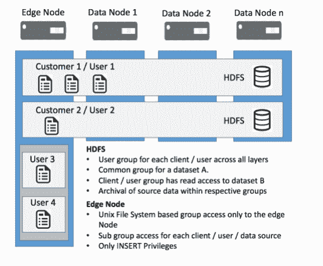

通常，边缘节点通过外部交换机连接到外部世界，允许第三方系统通过 Kafka 或基于 STB 的方式访问，并为入站用户提供 SSH 访问。

上述所有集群服务器通过专用网络交换机相互连接，隔离与外部世界的流量。

# 节点类型及其角色

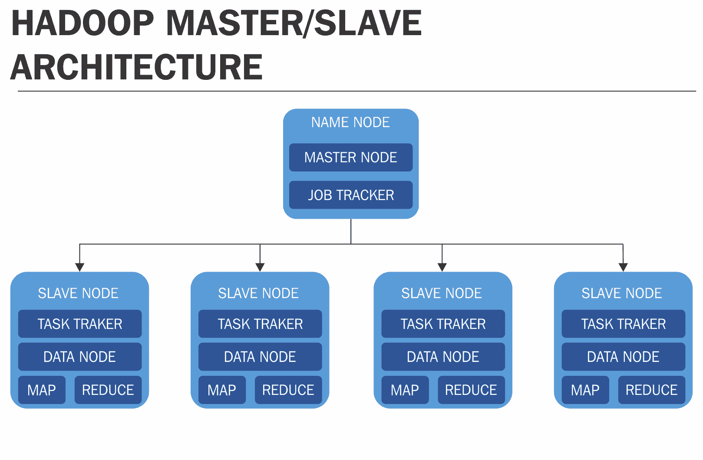

+   **节点**：Hadoop 集群可以根据其所承担的角色配置不同的服务器。大致可以分为三种类型，每种类型的硬件配置不同：

    +   **主节点**（也称为**名称节点**）：在企业部署中，主节点运行关键的管理服务。这些节点只存储元数据，因此不需要大量存储空间，但由于这些文件至关重要，主节点服务包括以下内容：

        +   企业管理器

        +   资源管理器

        +   备用资源管理器

        +   NameNode

        +   备用 NameNode

        +   日志节点

        +   HBase 主节点

        +   Hive 服务器

        +   Sqoop 服务器

        +   ZooKeeper

        +   Oozie 服务器

        +   Spark/作业历史服务器

        +   Cloudera 搜索

        +   Cloudera Navigator

        +   Hive 元存储

        +   Kafka 主节点

        +   Flume 主节点

    +   **工作节点**：在 Cloudera 企业部署中，工作/从节点是运行工作服务的节点。由于这些节点执行任务并存储实际数据，因此它们设计为容错的。工作节点可以有以下角色：

        +   数据节点

        +   节点管理器

        +   HBase 区域服务器

        +   Impala 守护进程

        +   Solr 服务器

        +   Kafka 经纪人

        +   Flume 代理

    +   **网关/边缘节点**：这些是运行 Hadoop 客户端服务的地方，包括：

        +   第三方工具

        +   Hadoop 命令行客户端

        +   Beeline

        +   Impala Shell

        +   Flume 代理

        +   Hue 服务器

        +   Spark 和其他网关服务

        +   HA 代理

# 商业 Hadoop 发行版

如前所述，Hadoop 是一个开源社区分发的堆栈，集成了多个组件或接口层。许多商业厂商在基本的 Hadoop 平台上进行定制，提供市场上的硬件产品平台和服务。我们将讨论以下几种流行的选项：

+   Cloudera CDH Hadoop 发行版

+   **Hortonworks 数据平台**（**HDP**）

+   MapR Hadoop 发行版

+   亚马逊弹性 MapReduce

+   IBM 开放平台

+   微软 Azure 的 HDInsight——基于云的 Hadoop 发行版

+   关键大数据套件

# Hadoop Cloudera 企业版

Hadoop 开源的标准框架，包含不同的层和组件，展示如下：

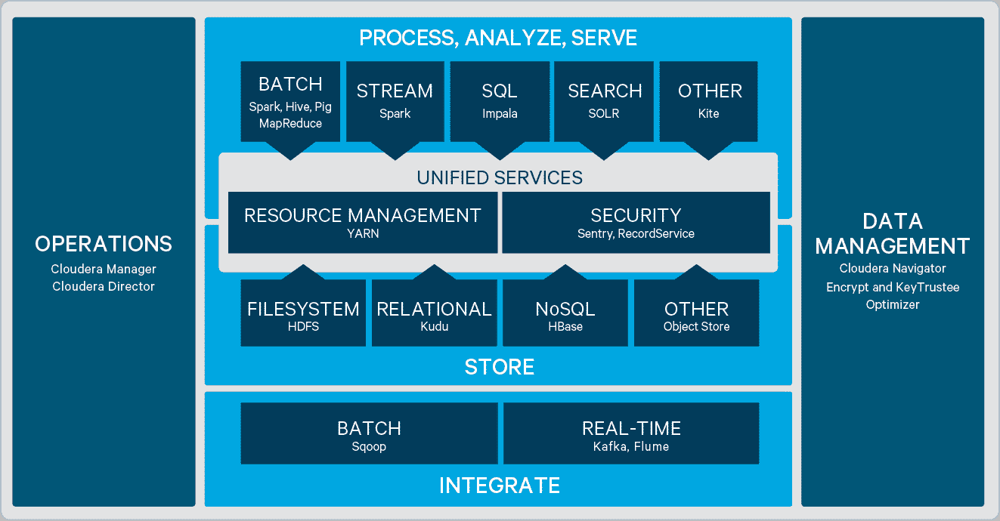

Cloudera 专有的发行版框架是基于 Hadoop 开源代码构建的，定制化服务如以下主题所示。我们将讨论使其成为领先企业产品的各个组件。

# 数据集成服务

外部源系统的数据导入到 Hadoop 系统可以通过多种方式，具体取决于业务需求。

+   **批量传输**：

    +   **Apache Sqoop**：Sqoop 是一个命令行界面应用程序，用于在关系型数据库和 Hadoop 之间传输数据。它支持保存的作业，可以多次运行，帮助我们导入自上次导入以来对数据库所做的更新。它还支持增量加载单个表或自由格式 SQL 查询。

+   **实时数据传输**：

    +   **Apache Kafka**：Kafka 是一个由 Apache 软件基金会开发的开源消息代理项目，使用 Scala 编写。该项目旨在提供一个完整的、高吞吐量、低延迟的实时数据流处理平台。它是一个高度可扩展的发布/订阅消息队列，构建为分布式事务日志，这使得它在企业基础设施中处理流数据时非常重要。

    +   **Apache Flume**：Flume 采用一种简单、灵活且分布式的架构来进行数据流处理。它能够可靠地摄取大量日志数据并进行聚合。它有一个简单且可扩展的数据模型，灵活地构建和支持在线分析应用程序。Flume 是一个非常强大、容错性高且可靠的服务，具有内置的故障切换和恢复功能。

    +   **Apache Chukwa**：Chukwa 是一个用于在分布式文件系统（如 Hadoop）上进行数据收集和分析的框架，简化了日志分析、处理和监控。Chukwa 代理在相应的机器上运行，收集来自各种应用程序生成的日志。它提供了高度的灵活性来摄取由服务器生成的大量日志数据。收集器从代理接收数据并将其写入 HDFS，HDFS 作为存储，MapReduce 框架将处理、分析和解析任务，并归档这些海量日志数据。

    +   **Apache Avro**：Avro 是一个语言中立的远程过程调用和数据序列化框架，开发于 Apache 的 Hadoop 项目中。由于 Hadoop 可写类缺乏语言可移植性，Avro 使用 JSON 来定义数据类型和协议，并以紧凑的二进制格式序列化数据。Avro 对于处理可以被多种语言（如 Java、C、C++、C#、Python 和 Ruby）处理的数据格式非常有帮助。

# Hadoop 数据存储

Hadoop 中的数据存储是一个关键功能，我们将讨论实现这一目标的各种方式：

+   **Apache HDFS（文件系统）**：HDFS 是一个分布式、可扩展且便携的文件系统，使用 Java 编写，旨在支持 Hadoop 框架。HDFS 存储大型文件——通常是从几 GB 到 PB 级别——并分布在多台机器和数据节点上。数据节点之间可以相互通信，重新平衡数据，移动副本并保持数据的高复制性。

+   **Apache HBase (NoSQL)**：HBase 是一个开源的非关系型分布式数据存储系统，运行在 HDFS 之上，提供了一种容错的方式来存储大量稀疏数据。HBase 是一个面向列的键值数据存储系统，由于与 Hadoop 和 HDFS 的渊源，它备受推崇。它适用于在大规模数据集上进行快速的读写操作，具有高吞吐量和低输入/输出延迟。

+   **Apache Kudu (关系型)**：Apache Kudu 是一个开源存储引擎，专为结构化数据设计，支持低延迟随机访问，并且能够高效地执行分析访问模式。它填补了 HDFS 和 HBase NoSQL 数据库之间的空白。Kudu 表看起来像 SQL 关系型数据库中的表，作为结构化数据的存储系统。像关系型数据库管理系统（RDBMS）一样，主键由一个或多个列组成，确保唯一性，并充当高效更新和删除操作的索引，作为结构化数据表的存储系统。

# 数据访问服务

+   **Apache Spark**：Spark 是一个开源框架，用于机器学习和基于内存技术的数据处理流处理。它为程序员提供了一种名为弹性分布式数据集（RDD）的数据结构，这是一种应用程序接口。RDD 是只读的，可以将多个数据集分布到一群机器上，具有容错功能。

+   **Apache Hive**：Hive 数据仓库软件通过 SQL 便于对存储在分布式存储中的大型数据集进行读取、写入和管理。结构可以映射到已经存储的数据上。提供了命令行工具和 JDBC 驱动程序，用于将用户连接到 Hive。

+   **Impala**：Impala 是 Cloudera 的 SQL 查询引擎，用于查询存储在 Apache Hadoop 集群中的数据，支持开源的大规模并行处理（MPP）。Impala 使用户能够对存储在 HDFS 和 Apache HBase 中的数据执行低延迟 SQL 查询，而无需额外的数据移动或转换。

+   **Solr**：Apache Solr 是一个网站搜索平台，因其可以用来索引和搜索文档及电子邮件附件，广受企业搜索领域的欢迎。它基于一个名为 **Lucene** 的 Java 库（[`whatis.techtarget.com/definition/Apache-Lucene`](http://whatis.techtarget.com/definition/Apache-Lucene)），用 Java 编写，提供了 RESTful XML 接口和 JSON API，用于构建搜索应用程序。Solr 可以搜索和索引多个网站，根据搜索查询的分类法（[`searchcontentmanagement.techtarget.com/definition/taxonomy`](http://searchcontentmanagement.techtarget.com/definition/taxonomy)）返回相关内容推荐（[`searchsqlserver.techtarget.com/definition/query`](http://searchsqlserver.techtarget.com/definition/query)）。

+   **Apache Pig**：Pig 提供了一种高级语言，称为 Pig Latin，它是一种类似 SQL 的语言，拥有许多内置操作符，用于执行数据操作，如连接、过滤、排序等，并用于执行 Hadoop 中的所有数据操作。Apache Pig 的组件是 Pig Engine，它将 Pig Latin 脚本作为输入，并将脚本转换为 MapReduce 作业。作为一个工具，它非常高效，能减少开发和编码时间。作为一个平台，它采用多个查询路径，将其表示为数据流来分析大量数据集。

+   **Kite** 是 Hadoop 的高级数据层，提供 API 和一组工具，用于在存储系统（如 HDFS）之上创建逻辑抽象，并以记录、数据集和数据集仓库的形式操作。它可以通过插件访问 Mavin，并协助打包、部署和运行分布式应用程序。它加速了 Hadoop 中流处理 ETL 应用程序的开发，这些应用程序提取、转换和加载数据到目标仓库，如 Apache Solr、企业数据仓库、HDFS、HBase 和 OLAP 应用程序。

+   **MapReduce** 是一种基于 Java 的分布式计算处理技术和框架。正如 MapReduce 名称的顺序所暗示的那样，reduce 任务始终在 map 作业之后执行。map 作业通常将输入数据集拆分为独立的块，每个块中的单个元素被分解为元组（键/值对）。reduce 框架对 map 作业的输出进行排序，然后将其输入到 reduce 任务中。这些任务完全并行处理，从而在多个计算节点上扩展数据处理。输入作业和输出作业存储在文件系统中。该框架负责任务调度、监控并重新执行失败的任务。通过配置更改，MapReduce 模型框架可以轻松扩展应用程序，使其在集群中的数以万计的机器上运行。

# 数据库

Apache Cassandra 架构是一个分布式 NoSQL 数据库管理系统，以其可扩展性、性能和持续运行的能力而著称。Apache Cassandra 基于环形设计，其中所有节点都扮演相同的角色，没有主节点的概念。与其他架构（如主从架构、传统架构或分片设计）相比，Cassandra 设置和维护都非常简单，并且设计用于处理跨商品服务器的大量结构化数据。

Apache Cassandra 的高可用性和可扩展架构使其能够处理大量数据，以及跨多个数据中心分布的数千个并发用户和操作，通过分发用户流量来确保高性能。Cassandra 具有内置功能，如数据建模、高可用性集群、监控工具、查询语言等。

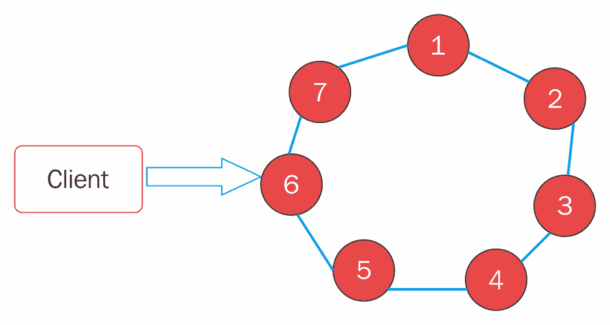

# 统一（公共）服务

+   **资源管理**：Apache Hadoop 的**Yet Another Resource Negotiator**（**YARN**）是一种集群管理技术。YARN 是 Apache 软件基金会第二代 Hadoop 2 版本的关键特性之一，也是其开源分布式处理框架的一部分。它还具有多功能性；资源管理器可以支持其他范式，而不仅仅是 Map/Reduce。

+   **Apache Oozie**：Apache Oozie 是一个调度工作流以管理 Hadoop 作业的系统。Oozie 中使用有向无环图（DAG）表示工作流，它由控制流节点和活动节点组成。工作流的开始和结束，以及控制工作流执行路径的机制，都是由控制流节点定义的。通过工作流触发计算处理任务的执行发生在动作节点上。

+   **Apache Sentry**：Hadoop 在文件系统级别提供强大的安全性，但缺乏足够的粒度来有效地保护用户和商业智能应用程序对数据的行级访问。Sentry 允许在服务器、数据库和表级别进行访问控制，并授予不同的权限级别，包括选择、插入等。它为经过身份验证的用户提供数据访问权限，能够控制和强制执行数据访问等。它能够实现 Hadoop 中数据和元数据的细粒度访问控制。列级安全性可以通过创建允许列子集的视图来实施，通过限制基础表和授予权限来实现。Sentry 的管理简单且方便，通过基于角色的授权进行管理。它是一个策略引擎，可以轻松地授予多个组在不同权限级别（如资源、角色、用户和组）上对相同数据的访问权限。

以下图表提供了 Hadoop 系统所采用的安全模型的全面视图。企业级实现中，在多个层面上都存在安全需求，例如集群级、用户级和应用级等。

Cloudera 提供了四层安全性，分别是；边界安全、访问控制、安全可见性和数据保护。Cloudera 企业安全可以分为四个广泛类别；身份验证、授权、数据保护和审计：

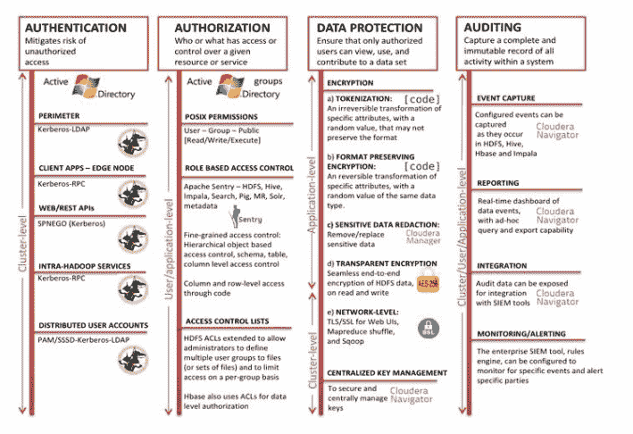

以下表格列出了流行工具提供的安全特性：

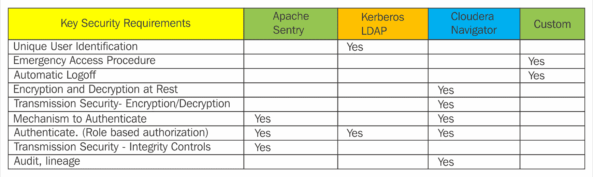

# Cloudera 专有服务与操作/集群管理

+   **Cloudera Navigator**：Cloudera Navigator 是 Cloudera Enterprise 的一部分，是一个完全集成的数据管理和安全系统，旨在为 Hadoop 平台提供支持。Cloudera Navigator 是 Hadoop 的数据治理解决方案，提供数据发现、持续优化、审计、数据血缘、元数据管理和策略执行等关键功能。Cloudera Navigator 支持持续的数据架构优化，并满足合规性要求。

+   **Cloudera Manager**：Cloudera Manager 是一个端到端的应用程序，用于管理 CDH 集群。Cloudera Manager 通过提供对 CDH 集群每个部分的精细化可视化和控制，设定了企业级部署的标准——使操作员能够提高性能、增强服务质量、增加合规性并降低管理成本。

+   **Cloudera Director**：Cloudera Director 与 Cloudera Manager 以及云服务提供商合作，提供对云中集群的集中式和程序化管理，包括 CDH 集群的部署、配置和维护。使用 Cloudera Director，您可以监控和管理多个 Cloudera Manager 和 CDH 部署，跨不同的云环境进行管理。

# 一个 Hadoop Hortonworks 框架

以下图像展示了 Hortonworks 的框架。许多组件与之前看到的 Hadoop 堆栈相同；接下来我们将讨论该发行版独有的组件：

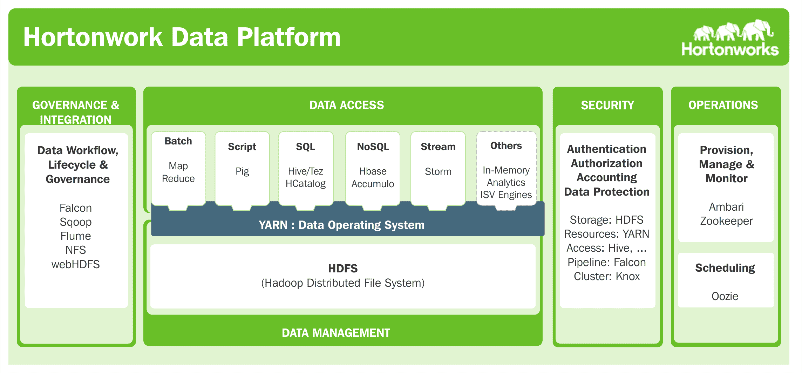

# 数据治理和调度管道

Apache Falcon 是一个数据管理工具，用于管理系统基础设施、数据和处理逻辑之间的依赖关系。数据管理员可以为 Hadoop 工作流定义操作和数据治理策略，以监督 Hadoop 集群中的数据管道 ([`searchdatamanagement.techtarget.com/definition/Hadoop-2`](http://searchdatamanagement.techtarget.com/definition/Hadoop-2))。使用 Falcon，我们可以管理成千上万的计算节点，在任何给定时间，集群中通常会运行大量作业，从而确保复杂处理作业的一致性和可靠性。

Falcon 依赖于 Oozie 作业调度软件来生成处理工作流，设置复制程序，并对传入数据进行保留和归档。数据治理引擎调度和监控数据管理策略，如增强的监控等。其他功能包括跟踪作业活动中的失败、依赖关系、审计和数据血统，并对数据进行标签化，以符合数据保留和发现要求：

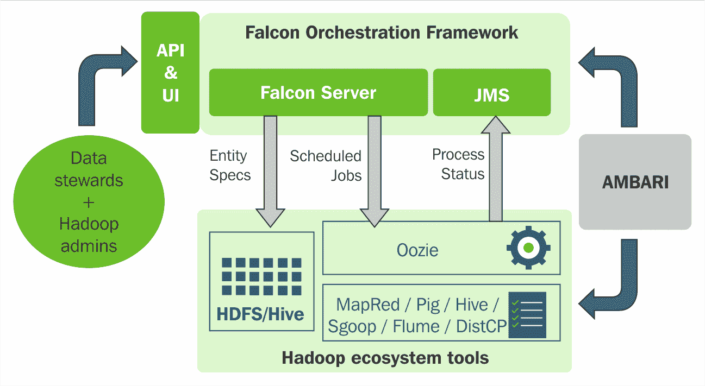

# 集群管理

Apache Knox 是一个堡垒安全服务器；通过屏蔽对 Hadoop 集群节点的直接访问，帮助设置更加安全，适用于企业级安装。Knox 通过支持无状态协议，能够轻松地进行水平扩展。Knox 提供由用户和组通过 LDAP 或 Active Directory 管理的身份验证功能。身份联合是基于 SSO 和 HTTP 头的。

通过服务级别的**访问控制列表** (**ACL**) 支持授权。Knox 策略的实施涵盖了身份验证、联合认证、授权、审计、调度、主机映射和内容重写规则等。该策略通过在拓扑和集群定义内定义的提供者列表实施，用于路由和在用户-facing 的 URL 和集群内部之间进行转换。

# 数据访问

+   **Apache Tez**：这是一个应用框架，允许为数据处理构建复杂的有向无环图任务。它是基于 Apache YARN 功能的资源管理框架，能够扩展构建高性能的批处理和交互式数据处理应用程序，从而在保持 MapReduce 可扩展性至 PB 级数据的同时，显著提高响应时间。Tez 适用于需要接近实时的查询处理和机器学习等场景，提供了一个强大的框架，以数据流图的形式表达计算。

+   **Apache HCatalog**：这是一个 Hadoop 的存储管理层，方便从 Hadoop 集群网格读取和写入数据，支持不同的数据处理工具，如 Hive、Pig、MapReduce 等。对于存储在 HDFS 中的不同数据格式，如 RCFile、Parquet、ORC 文件或 Sequence 文件，使用 Hive **序列化-反序列化器** (**SerDe**) 以启用关系视图。Apache HCatalog 提供了诸如表抽象和数据可视化等功能，供工具用于清理和归档。

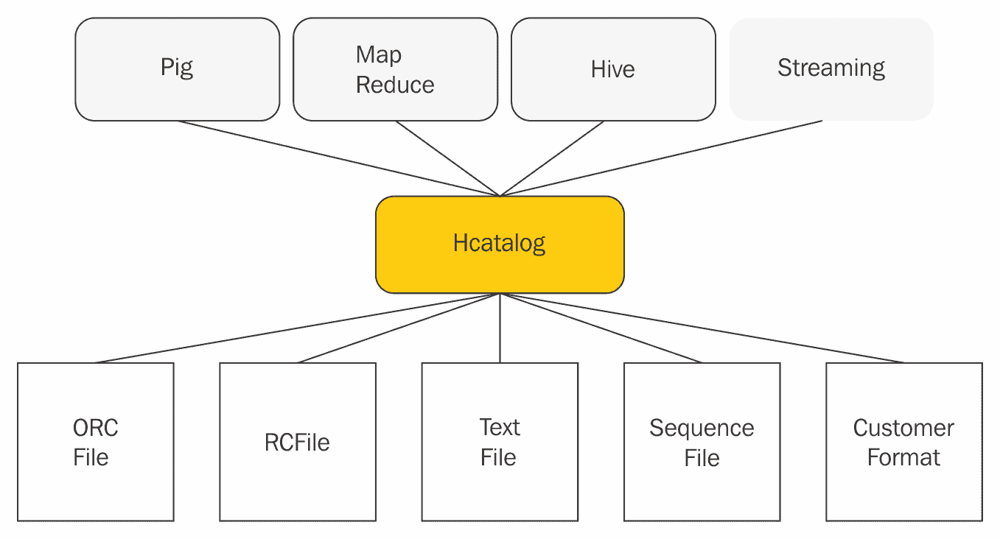

# 数据工作流

WebHDFS 协议为外部应用程序提供通过互联网、HTTP 或网页访问，用于管理存储在 HDFS 集群中的文件和数据，与 Hadoop 集群的高性能本地协议或默认的 Java API 同等。WebHDFS 基于行业标准的 RESTful 机制，提供与本地 Hadoop 协议相当的安全性。使用 WebHDFS 常用工具如`curl/wget`，用户可以访问 HDFS 执行操作，如读取文件、写入文件、创建目录、修改权限、重命名等。

# Hadoop MapR 框架

MapR 是 Apache Hadoop 的商业发行版，其 HDFS 被 MapR-FS**替代**。以下是包含常见 Hadoop 开源组件的 MapR 框架；我们将接下来回顾这个发行版中特有的组件：

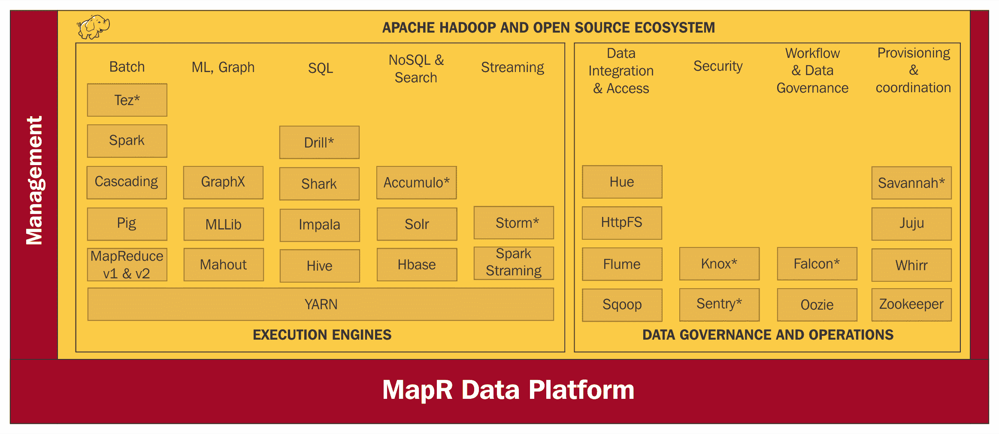

# 机器学习

MLLIB 是一个机器学习算法和工具集，适用于预测模型和数据科学。它包含一些广泛的类别，如分类、聚类、协同过滤等。每个类别下使用的部分机器学习算法如下所示：

+   **分类**：逻辑回归，朴素贝叶斯

+   **回归**：广义线性回归、生存回归、决策树、随机森林和梯度提升树

+   **聚类**：K-means、Gaussian 混合模型（GMMs）、频繁项集、关联规则和序列模式挖掘

**GraphX** 是 Spark 中用于图和图并行计算的新组件，用于实现需要建模对象之间关系的算法类型。在许多实际应用中，如社交网络、网络通信和天体物理学，图形处理在表示实体之间的模型关系时非常有效和高效。

# SQL 流

Apache Drill 是一个分布式 SQL 引擎，支持在非关系型数据存储上进行数据探索和分析，如 Hadoop、MapR、CDH、NoSQL（MongoDB、HBase）、云存储（Amazon S3、Google Cloud Storage、Azure Blob Storage、Swift）等。它使用碎片化的内存列式执行引擎进行分布式查询优化和执行，适用于复杂数据和无模式数据。通过在运行时编译和重新编译查询的查询引擎，能够实现高性能的数据处理，支持任何数据结构。用户可以使用标准 SQL 和 BI 工具查询数据，而无需创建和管理模式。它支持无模式的 JSON 文档模型，类似于 MongoDB 和 Elasticsearch，并支持行业标准的 API——ANSI SQL、ODBC、JDBC 和 RESTful API。

**Apache Shark** 是基于数据仓库的系统，和 Apache Spark 配合使用；它的分布式查询引擎大大提高了高端分析结果和 Hive 查询的性能。Shark 支持 Hive 的大部分特性，如查询语言、元数据存储、序列化格式和用户定义函数。Apache Shark 基于 Apache Spark 构建，而 Spark 是一个并行数据执行引擎，因此 Shark 可以以亚秒延迟响应复杂查询。它通过列式内存存储系统提供最大的性能提升，因为数据存储和处理都在集群内存中或数据库中的内存化视图中进行。

# 存储、检索和访问控制

**Accumulo** 提供细粒度的数据访问控制和单元格级访问控制，通过复杂的策略管理对敏感数据的访问。它是一个低延迟、大表数据存储和检索系统，基于键/值存储设计。Accumulo 提供对庞大的 HDFS 表的极快速访问，同时控制对其数百万行和列，甚至单元格级别的访问。它通过为每个数据单元格编码策略规则，结合不同数据集并实施访问控制策略，从而实现对数据集的细粒度访问控制。

# 数据集成和访问

Hue 是一个开源 Web 界面，允许通过 Apache Oozie 在任何 HDFS 集群中分析数据。它具有许多内置功能，例如 Hue 编辑器，可以构建工作流并安排它们定期自动运行。它还提供一个仪表板，用于数据查询、监控进度和日志，并执行如暂停或停止任务等操作。支持的应用程序包括 Apache Hive、Apache Impala（孵化中）、MySQL、Oracle、PostgreSQL、SparkSQL、Apache Solr SQL、Apache Phoenix、Apache Solr 和 Apache Spark。

**HttpFS**--Apache Hadoop HttpFS 是一项服务，提供通过 REST API 对 HDFS 的 HTTP 访问，支持所有 HDFS 文件系统操作（包括读取和写入）。它支持不同版本 Hadoop 运行的 HDFS 集群之间的数据传输（解决 RPC 版本问题），或者支持防火墙后面的集群。

# 配置和协调

数据提供工具为 Hadoop 系统提供云托管和协调服务，以下讨论了两种流行的选择：

+   **Juju**：Hadoop 发行版中提供的容器选项是 Juju 框架。它允许用户在一系列服务上部署本地构建的软件，包括 MAAS、EC2、Azure 和 LXD 容器。Juju 可以建模、配置和管理服务，并通过几条命令将其部署到所有主要的公共和私有云。Juju 商店中有数百个预配置的服务可供使用。

+   **Apache Whirr--云上的大数据**：Apache Whirr 可用于在云平台（如 Amazon EC2、Rackspace 服务器和 CloudStack）上定义、配置和配置大数据解决方案。Whirr 会自动启动云中的实例（库集合）并在其上启动 Hadoop。它启动云中立的大数据服务，用于定义和配置 Hadoop 集群，并为 MapReduce 任务添加 Hive、HBase 和 Yarn 等包。

# Pivotal Hadoop 平台 HD Enterprise

以下是 Pivotal HD Enterprise 框架。该框架中的开源 Hadoop 组件已在前面讨论过。

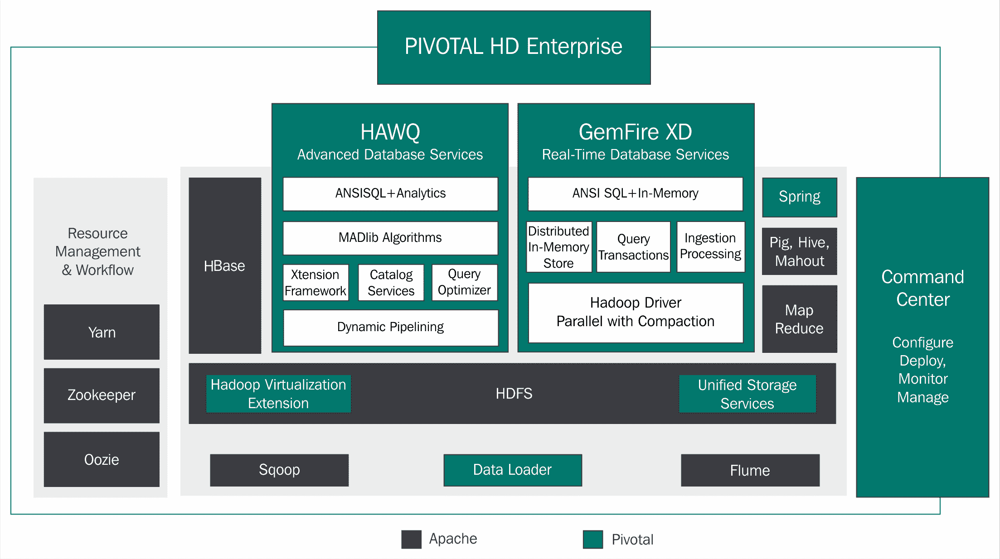

# 基于 IBM 大数据的 Hadoop 生态系统

以下是基于 IBM 大数据的 Hadoop 生态系统。我们已经熟悉了此框架中列出的多数开源 Hadoop 大数据组件：

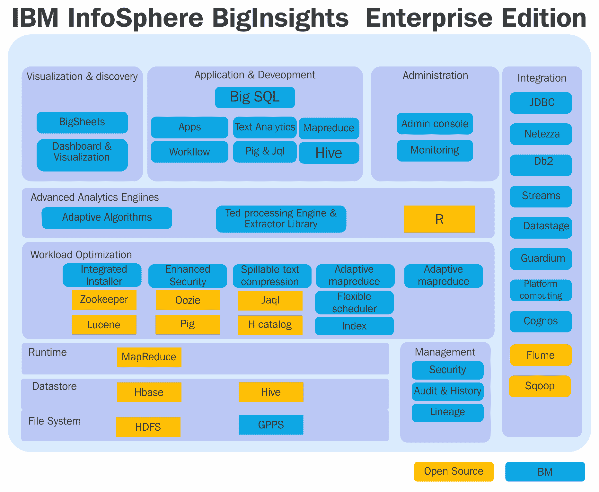

# 基于 AWS 的 Hadoop 生态系统

Amazon **Elastic MapReduce**（**EMR**）是一项服务，允许用户在 Amazon 的网络基础设施内启动和扩展 Hadoop 集群。EMR 实例使用 Amazon 预构建和定制的 EC2 实例，这大大简化了 Hadoop 和 MapReduce 组件集群的设置和管理。EMR 能够在 AWS 云 Hadoop 集群中有效地分析大数据集。

以下图示展示了 AWS EMR 框架，其中描述了多个服务层：

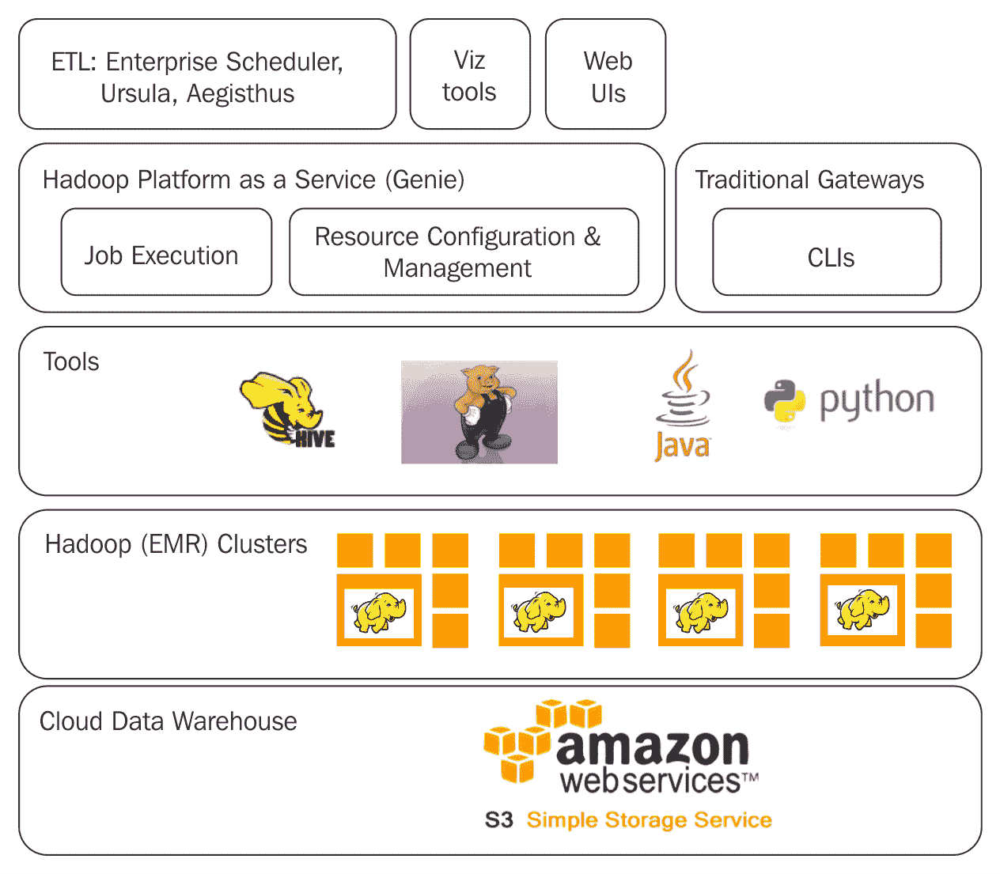

提供了一个与多种 Hadoop 开源组件集成的 AWS EMR 框架，如下所示：

+   **R**：它是一个 GNU 包，是一个开源编程语言和统计计算与图形软件环境，广泛应用于统计学家和数据挖掘人员开发统计软件和进行数据分析。作为一门语言，R 既灵活又强大。

+   **Presto**：Apache Presto 是一个分布式并行跨平台查询执行引擎，运行于 Hadoop 平台上。Presto 支持使用标准 ANSI SQL 查询多个数据源，如 HDFS、MySQL、Cassandra、Hive、关系型数据库及其他数据存储。Presto 执行多个分析查询，优化低延迟和交互式查询分析，并且在不间断的情况下进行扩展。Presto 支持如今许多最佳的工业应用，如 Facebook、Teradata 和 Airbnb 等。

+   **Gradle**：现代软件开发的格局在不断演变，构建自动化的需求也在不断变化。项目涉及大量且多样的软件栈，使用多种编程语言，并采用广泛的测试策略。采纳敏捷实践有助于尽早集成代码，以及通过构建支持频繁且便捷地交付到测试和生产环境。Gradle 是一个开源构建自动化系统，建立在 Apache Ant 和 Apache Maven 的概念之上。Gradle 使用有向无环图来安排任务的顺序，并引入了一种基于 Groovy 的领域特定语言来声明项目配置。Gradle 专为多项目构建而设计，具备管理依赖关系的能力。Gradle 可以定义和组织大型项目构建，并建模项目间的依赖关系。它支持增量构建，通过智能地确定构建树的依赖关系和是否需要重新执行来优化构建过程。

+   **Cascading**：Cascading 是一个用于在 Apache Hadoop 上构建大数据应用的应用程序开发平台，提供了 Apache Hadoop 和 Apache Flink 的抽象层。Cascading 用于在 Hadoop 集群上创建和执行复杂的数据处理工作流，隐藏了 MapReduce 作业的底层复杂性。Cascading 通过计算引擎、系统集成框架、数据处理和调度能力提供了所需的抽象层级，具有最佳的抽象级别。Cascading 为 Hadoop 开发团队提供了可移植性，可以在不需要重写代码的情况下开发简单或复杂的数据应用程序。

+   **Apache Phoenix**：Apache Phoenix 是一个开源的、支持大规模并行的关系数据库引擎，它以 Apache HBase 为基础支持 Hadoop 上的 OLTP。它提供了对大数据集的随机实时访问，并通过熟悉的 SQL 接口支持如 Spark、Hive、Pig、Flume 和 MapReduce 等 Hadoop 系统。Apache Phoenix 抽象化了底层数据存储。聚合查询在数据存储节点上执行，减少了通过网络发送大量数据的需求。

+   **Apache Mahout**：Apache Mahout 是一套可扩展的机器学习算法，主要集中在协同过滤、聚类和分类等领域。

# 微软 Hadoop 平台是托管在微软 Azure 上的 HDInsight

以下是托管在微软 Azure 上的 HDInsight 生态系统架构。虽然一些原生开源层按原样嵌入，但其他一些则根据微软的专有产品进行了定制：

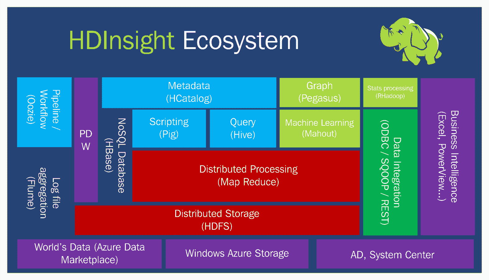

# 系统的容量规划

Hadoop 集群的大小调整是一个重要任务，因为有许多因素会影响其性能。容量规划和 Hadoop 集群的大小调整对优化分布式集群环境及其相关软件至关重要。机器的数量、机器的规格以及每个节点的有效处理规划将帮助您有效地优化性能。

在 Hadoop 生态系统中，不同层次（组件/服务）相互作用，导致在任何层次之间复杂集群堆栈中的性能开销；因此需要在每个接口进行必要的性能测试并进行适当的调优，如下图所示：

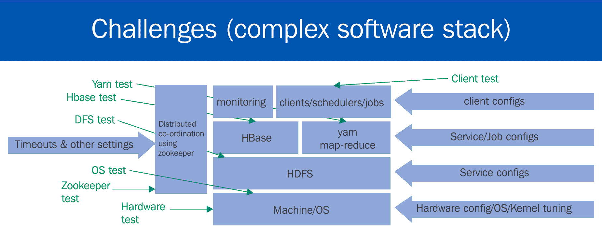

有许多因素会影响复杂 Hadoop 分布式集群的容量规划、大小调整和性能。以下是一些需要考虑的因素：

+   **数据量**：

    +   数据量及其增长

    +   数据保留策略：在丢弃数据之前保留多少年的数据

    +   数据存储机制（数据容器，如果有的话使用的压缩类型）

+   **工作负载类型**：如果工作负载是 CPU/IO/内存密集型的，我们将需要相应地考虑硬件。如果处理量可能快速增长，我们还需要考虑增加新的数据节点。

+   **工作负载的频率**：如果数据负载是批处理还是实时流数据，是每天几次、每晚、每周还是每月加载？

+   **安全类型**：身份验证、授权和加密

+   **所需的服务类型**：

    +   集群的业务 SLA 是什么？是否需要实时支持？

    +   除了核心 Hadoop 服务外，还有哪些类型的服务在运行？

    +   将安装/使用多少第三方工具？

+   **操作系统选择**：选择操作系统取决于多个因素，例如团队的管理能力、采购和维护成本、稳定性、性能、可靠性、支持的可用性等。

    +   **CentOS**：Linux CentOS 在功能上与 RHEL 兼容，并且是 Hadoop 集群中工作节点的流行选择。

    +   **RedHat 企业 Linux（RHEL）**：Linux RHEL 广泛应用于 Hadoop 集群中的服务器。

    +   **Ubuntu**：非常流行的基于 Debian 的 Linux 发行版，提供桌面版和服务器版。

    +   **SLSE**：由 SUSE 开发的 Linux 企业服务器。它主要为服务器、大型机和工作站设计，但也可以安装在桌面计算机上进行测试。

    +   **Solaris, OpenSolaris**：在生产集群中不太流行。

    +   **Fedora Core**：用于服务器和工作站的 Linux 发行版。

+   **网络考虑**：Hadoop 非常依赖带宽，因为大多数时间所有节点都在同时互相通信。可以考虑使用专用交换机、10 GB/sec 的以太网带宽，以及通过交换机互联的机架。

# 估算和容量规划的指导方针

合理的集群规模包括为主节点和工作节点以及边缘节点选择合适的硬件，同时保持低成本。

以下是一些需要考虑的因素，并附上一些容量规划的基本指导：

+   **数据大小**：

    +   对于数据大小，建议的副本因子为 3

    +   如果要存储的总数据为 *Y* TB，则在复制后将变成 *3Y* TB

    +   如果使用任何压缩技术存储数据，则可以考虑压缩因子

    +   对于磁盘效率，建议总磁盘可用容量的 60-70% 使用率

    +   因此，包含磁盘压缩因子的总磁盘容量 = *3 x Y x 7*

+   **数据增长率**：

    +   考虑到数据增长因素，比如每年增长 1 TB

    +   考虑使用 3 倍副本因子

    +   磁盘效率因子为 70%

    +   我们需要计算 *1 TB * 3 / .6 = 4-5 TB*

    +   每增长 1 TB 数据的存储容量

    +   考虑到数据处理需求和数据量的增长，相当于添加一个新的节点

    +   数据节点规划数：

        +   假设我们需要在 HDFS 中存储 200 TB 的数据

        +   使用 3 倍副本时，总容量将达到 600 TB

        +   考虑到副本因子，总存储将是 *600 * 1.3 = 780* TB（大约）

        +   假设每个节点有 12 个磁盘，每个磁盘容量为 2 TB = 每个节点 24 TB

        +   所需节点数量为 *780/24* = *33* 个节点

        +   考虑到数据增长需求，我们需要按月、周、年等计划集群扩展所需的额外节点

# 集群级别的规模估算

根据各个节点的角色，集群规模和容量规划对不同节点非常重要。

# 对于主节点

主节点模式的容量规划至关重要，需要考虑系统资源和托管服务，如下所示：

+   **内存**：主名称节点的容量规划是一个非常重要的任务。经验法则是为每百万个块预留 1 GB 堆内存。例如：

    +   考虑一个 5 节点的集群

    +   每个节点的原始存储为 20 TB

    +   假设 HDFS 块大小为 128MB

    +   总块数 = *5 * (20*1024*1024)*  = *33* *百万*（大约）

    +   总 HDFS 块大小为 3300 万

    +   基于复制因子为 3，所需堆内存大小 = *33/3* = *11*

    +   实际块的总数大约为 11 GB。

    +   还有其他因素需要考虑：

        +   名称节点是稳定的实体，因此在规划大小配置时，还应考虑未来的增长前景。

        +   资源管理器、HBase 主节点、zookeeper 等服务也将运行在此节点上。

        +   经验法则是为 HBase 等服务保留至少 2 GB，为资源管理器保留 4 GB。

        +   根据正常使用情况，主节点的内存配置应为 128 GB 至 512 GB。

+   **CPU**：每个节点的处理器核心数应为 2 GHz 或更高，具体取决于该节点上运行的服务数量。

+   **磁盘**：主节点的本地磁盘应配置为 RAID10，并配有热备件，以确保在磁盘故障时能够提供良好的性能和快速的恢复。应该为 `/var` 配置一个单独的分区，最小大小为 1 TB，或者根据日志存储所需的容量进行配置。强烈建议在生产环境中配置高可用性。

# 工作节点

工作节点的容量规划需要根据它所运行的服务仔细考虑系统资源（内存、CPU、磁盘）：

+   **内存**：工作节点上的内存基于它们将要运行的工作负载和守护进程。每个工作节点应考虑配置 256 GB 至 512 GB 的内存。

+   **CPU**：CPU 的容量基于工作负载类型和计划的并行 MapReduce 任务数。通过启用超线程，MapReduce 任务的总数应为核心数的 1.5 倍。建议至少配置 24 核心，且处理器主频大于 2 GHz。

+   **磁盘**：应考虑使用大量小型 SATA 磁盘（2 至 4 TB），而不是少量大型磁盘。所有磁盘应配置为 JBOD，并启用 noatime 和 nodiratime，同时 `/var` 作为与根 OS 分区分离的单独分区。建议添加额外节点来增强存储，因为这也会提高处理能力。

# 网关节点

网关节点不运行任何特定的 Hadoop 服务；它们的配置应基于将要运行的任务。

+   **网络**：

    +   网络是一个核心组件，应非常仔细地考虑，因为 Hadoop 的处理是基于数据的邻近性。

    +   如果工作负载仅包含映射作业，且只进行数据转换，那么数据在网络上传输的量不会很大。如果工作负载有大量的 reduce 操作，如聚合、连接等，那么节点之间的数据传输量就会很大，在这种情况下，我们应该考虑至少 10 GB 的网络容量。

    +   在考虑网络配置时，还应考虑运行其他服务，如 HBase 和 Spark。

    +   每个机架平均考虑 15 到 20 个节点。

    +   推荐将双以太网卡绑定在一起，以支持故障转移。

    +   设置数据本地性和跨机架的复制配置（机架意识）是一种良好的实践，这样即使某个机架发生故障，数据仍然可以访问。

    +   核心交换机与机架顶部交换机相连时，应该具有高带宽（10 GB/sec 或更高）。应考虑机架顶部交换机以及核心交换机的冗余配置。

# 总结

在本章中，我们介绍了大数据 Hadoop 组件、流行框架及其为各种服务提供的独特组件。在下一章中，我们将介绍云计算的术语和技术，如公共、私有、混合模型，基础设施、平台、身份、软件和网络服务等服务产品。我们还将介绍一些流行的市场供应商。
