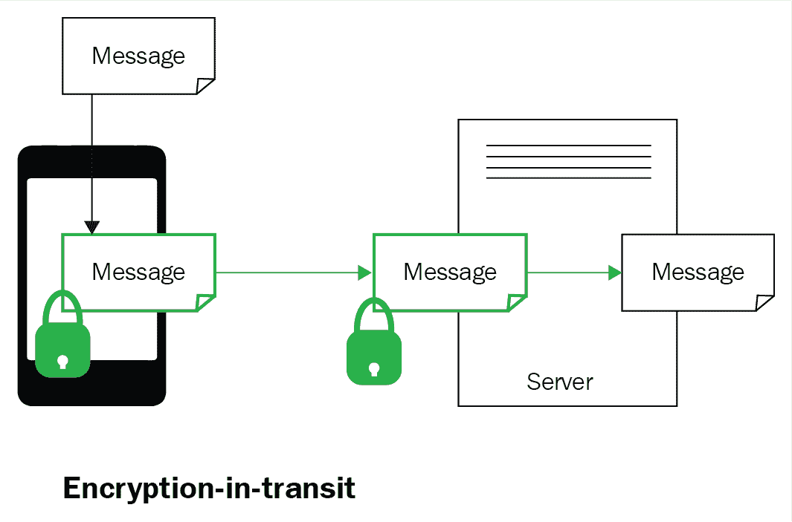

# 云计算

云技术对于构建大数据、数据科学和物联网系统至关重要，它们可以应对海量数据，并提供灵活性和可扩展性。DevOps 在云环境中尤为突出，它通过将环境配置作为代码执行，能够创建与软件项目一致的复制环境。在本章中，我们将讨论云计算术语、架构模型、服务提供的基础构件，如平台、基础设施等。我们还将讨论流行的市场供应商等内容。

在本章中，我们将讨论以下主题：

+   云计算概念

+   架构模型：

    +   公有云

    +   私有云

    +   混合云

    +   社区云

+   服务提供：

    +   PaaS

    +   IaaS

    +   SaaS

    +   IDaaS

    +   NaaS

+   市场供应商：

    +   亚马逊

    +   Azure

    +   SalesForce

+   云计算安全

+   云备份解决方案

# 云计算技术

云技术涵盖了多种服务提供和基础技术，以下图所示：

云计算的日益普及导致其在银行、保险、高科技、制药、制造等行业的广泛应用。大数据系统从多个源系统中获取大量数据，且数据格式多样。因此，将数据存储或暂存于云端，相比本地系统，具有较高的经济效益。

即使是物联网，来自机器的传感器数据也会迅速达到 TB 和 PB 级别，因此只有云系统能够经济地存储如此庞大的数据量。通过战略性和系统化地采用业务流程、应用程序、平台和基础设施，企业可以获得以下多重好处：

+   **动态负载模式与弹性可扩展性**：云的一个知名应用场景是工作负载变化且不可预测。在这种情况下，客户可以通过将高需求计算任务转移到云端，按需扩展 IT 容量，而无需为峰值负载配置资源，从而为企业节省成本。

+   **快速部署**：云端资源的容量规划和采购时间大幅缩短，因此使用云设置时，应用程序部署变得相对容易且迅速；同时可以将基础 IT 需求转交给云服务提供商。

+   **按需付费**：只为所需和使用的部分付费。其主要优点在于节省了许多支持网络和系统的产品的努力和成本，如垃圾邮件/病毒防护、加密、数据归档、电子邮件服务和异地存储。

+   **更高价值**：IT 支持系统的管理工作转移到云服务提供商那里，从而使内部 IT 资源能够专注于更高价值的业务活动，并且资本支出可以用于更紧迫的业务投资。

云的采用涉及以下各层：

+   商业流程

+   应用

+   平台

+   基础设施

我们将在接下来的部分详细讨论这些内容。它们也在以下图表中表示：

# 云技术概念

虚拟化是一个重要的技术，通常与云技术一起提及。它是云计算相关的主要技术框架，旨在通过创建多个共享同一物理基础设施（如操作系统、服务器、存储设备或网络）的专用执行环境。虚拟化软件操作硬件，而云计算指的是服务，并提供共享计算资源软件或数据作为综合服务的价值。

虚拟化是在裸机或现有操作系统上创建虚拟机，并使用虚拟机管理程序。

有一些模型，比如 Oracle VM、Sun xVM Server、LynSecure 和 VirtualLogicVLX，能够在没有操作系统的裸机系统上运行虚拟机管理程序（hypervisor）：

另一个类别涉及在现有操作系统上安装虚拟机管理程序软件。一些例子包括 VMWare Fusion、Virtual Server 2005 R2、容器、Microsoft Hyper V、Windows Virtual PC 和 VMWare workstation 6.0：

**虚拟机监控器**（**VMM**）或虚拟管理器，是一种技术，用于创建设备或资源的虚拟版本，使多个应用程序能够在同一台服务器上同时运行多个不同的操作系统。DevOps 确保在开发、QA、预生产和生产等环境之间的配置一致性。云上虚拟机的使用以及与 DevOps 一致的复制，是快速响应的有效模式。安装在操作系统上方的虚拟机管理程序或 VMM，使服务器、工作站、存储和其他系统独立于物理硬件层。**虚拟机**（**VM**）是基于架构的计算机系统仿真，并提供专门的功能。主机是运行一个或多个虚拟机的计算机，而每个虚拟机被称为**客户端机器**。

虚拟化提供了许多好处，包括以下几点：

+   **最大化资源**：传统构建的系统通常大部分未得到充分利用。虚拟化可以通过高效利用容量来减少需要获取的物理系统数量。虚拟化帮助最大化硬件投资的使用，以便从服务器中获得更多价值。

+   **多系统**：这些可以帮助你在相同的物理硬件上运行多种类型的应用程序，甚至为这些应用程序运行不同的操作系统，比如在同一台服务器上运行 Linux 和 Windows，并部署相应的应用程序。

虚拟化可以是完全虚拟化或准虚拟化。

**完全虚拟化**是指将包含所有软件的服务器模拟到另一个系统。它在以下场景中更为适用：

+   在多个用户之间共享计算机系统

+   隔离用户之间以及控制程序之间

+   模拟客户端或主机系统的服务器系统

**Para-virtualization（半虚拟化）**允许多个操作系统在单个硬件设备上运行，它在以下场景中更为适用：

+   方便迁移到新系统，因为可以轻松迁移客户机系统

+   容量管理，轻松增加额外资源

+   客户机实例的灾难恢复管理

虚拟化提供了诸如系统整合、完全托管的虚拟化系统和成本高效的系统等好处。

然而，超越虚拟化的云解决方案提供了以下功能，我们将详细讨论：

+   自助服务

+   弹性

+   自动化管理

+   资源池和可扩展性

+   按需付费服务

有状态、无状态服务器和 REST 协议通常与云计算技术一起提及。

有状态服务器通过会话形式保持用户的状态信息。一旦用户登录到网站，便会创建一个唯一标识符，并由 Web 服务跟踪该会话的信息。会话信息将在用户的所有其他请求中保持，直到浏览器关闭；这些会话信息有助于为用户提供个性化服务。会话的详细信息也有助于监控并发的网页流量，并结合安全功能，例如防止恶意用户通过已建立的连接同时发起多个请求，导致网页服务器被淹没。

无状态服务器顾名思义，不会为用户保持任何状态信息，因此每个请求都是完全独立处理的，作为一个新的请求，与前一个请求无关。

Web API 的设计遵循无状态架构，并使用**REpresentational State Transfer（**REST**）协议**。这种无状态设计中的用户身份是通过分配给用户的唯一用户 ID 来实现的，该 ID 需要随每个请求一起传递。

REST 是一种以资源（或数据）为主要目标的架构方法，而不是 API 应提供的功能（功能性）。它提供了更好的可扩展性、互操作性，并且在以下场景中应用得当：

+   客户端服务器

+   无状态服务器

+   可缓存的网页系统

+   分层系统

+   按需代码

+   统一接口

REST 是一组约束，确保了可扩展、容错且易于扩展的系统，这些约束已被 **万维网** (**WWW**) 采纳。RESTful API 可以使用其他传输协议，例如 SNMP、SMTP 等。**超文本传输协议** (**HTTP**) 是用于在 WWW 中链接超文本页面的协议。这也是除了其他传输协议（如 FTP、gopher 等）之外，传输文件的常用方式。在大多数情况下，RESTful API 使用 HTTP 作为传输层，因为 HTTP 的基础设施、服务器和客户端库得到了广泛采用。RESTful API 遵循所有 REST 约束，而 HTTP API 则利用 HTTP 作为其传输协议，包括依赖 HTTP 的 SOAP API。

使用 REST API 的过程就像在网站之间进行导航一样。HTTP 和 HTTPS 是实现 REST API 时使用的两种关键协议。**统一资源标识符** (**URI**) 被 REST API 用作访问特定网站的地址。URI 由两部分组成——**统一资源定位符** (**URL**) 和 **统一资源名称** (**URN**)。URL 表示计算机网络上特定资源的位置，并定义了检索该资源的机制。URN 是 web 资源的名称。

例如，`https://en.wikipedia.org` 是我们的 URL，而 `/wiki/Cloud_computing_architecture` 是我们的 URN。

组合 [`en.wikipedia.org/wiki/Cloud_computing_architecture`](https://en.wikipedia.org/wiki/Cloud_computing_architecture) 是一个独特的 URI 资源地址或标识符。

在与任何 REST API 交互并通过 HTTP 协议与服务器通信时，有四个基本操作：GET、POST、PUT 和 DELETE。

+   GET 将检索指定的元素

+   PUT 将创建或替换指定的元素

+   POST 用于创建另一个元素

+   DELETE 将删除指定的元素

这些也用于获取调用响应的状态；例如，HTTP 状态码 404 表示页面或地址 *未找到*。

在使用 REST API 时，展示输出结果的两种数据格式是 **JavaScript 对象表示法** (**JSON**) 和 **可扩展标记语言** (**XML**)。JSON 的优点是更容易解析，因此在大多数情况下比 XML 更受欢迎。而 XML 在结果验证和导航方面具有一些更先进的功能，但它更为复杂。通过在 URI 末尾使用 `.json`，可以传递 JSON 格式的输出。

# 身份验证与安全

通过 HTTP 协议的 REST API 确保身份验证、安全机制和数据保护，它们加密客户端和服务器之间的流量。一些 API 依赖于 GET 请求来查看数据，而无需身份验证；然而，对于任何数据修改，身份验证是严格执行的。HTTP 身份验证的用户名和密码是基础模型，使用 Base64 哈希，这不是一个可扩展和安全的模型，基于令牌的身份验证机制，通常称为 **Authtype 1/2**，现在在 API 调用中更为突出。

# 多层云架构模型

云架构也遵循表现层、业务逻辑层和数据层的分层表示模式，以支持应用的多层模型。典型的架构模型及其底层组件如下图所示：

这一分层架构模型得到了流行的云服务提供商的支持，在每个服务层提供多个增值特性和功能，具体如所列。

# 表现层

表现层是面向用户并与之互动的层。它通过与其他层通信，在网站/网页上显示与可用服务相关的信息。它协调与网络中其他层（如业务层和数据层）之间的交互，将服务和查询请求的结果发送到浏览器：

+   **弹性基础设施**：为了满足实时需求，虚拟化管理程序被启用以创建虚拟机或容器，实现云基础设施的弹性。这些系统具备自助服务 BI 功能，提供如资源利用率监控、可追溯的计费和资源供应等特性。

+   **纵向扩展**：将应用迁移到更大的虚拟机上，或通过重新调整虚拟机（回收虚拟机的容量）以适应应用的可扩展环境，这被称为纵向扩展或扩展上行。这通常与多个依赖关系相关。

+   **弹性平台可扩展性**：这通常与应用层相关，指其能够处理不断增长的工作量。通过增加或扩展系统、网络或流程，以满足业务增长的需求。

+   **横向扩展**：这是通过在额外的机器上提供更多应用层实例（通过额外资源），然后在它们之间分配负载来实现的。尽管横向扩展允许通过提供资源在应用之间重新分配资源，应用架构应能够通过额外节点扩展，并通过分配负载来支持。

+   **基于节点的可用性**：大多数传统应用程序都是为在单一机器上运行而开发的。在这里，每个节点在托管应用程序中扮演着独特角色，并且其可用性受到衡量。这些应用程序需要重新编写代码，以适应云提供的可扩展性和弹性：

+   **基于环境的可用性**：采用多线程架构构建的应用程序能从基于集群的环境中获益，这些环境具备内建的弹性和可扩展性。对于使用不均衡，或者在某些特定时期出现的高峰情况，这是至关重要的。应用程序应设计成能够检测实时资源需求变化，如带宽、存储和计算能力，并自动采用：

# 业务逻辑层

业务逻辑层也称为**应用层**。顾名思义，业务逻辑执行应用程序所需的所有处理，并通过与底层数据层的通信，将所需的详细信息发送到展示层。

+   **虚拟网络**：这是一种用于访问网络上远程系统的技术，也被称为**远程桌面共享**，并使得通过其他协议（如**远程帧缓冲**（**RFB**）、**远程桌面协议**（**RDP**）和**Apple 远程桌面**（**ARD**））实现对系统的可视化显示和控制。

+   **面向消息的中间件**：**面向消息的中间件**（**MOM**）使得在分布于异构平台的应用程序模块之间发送和接收消息成为可能。MOM 通过软件或硬件基础设施的支持，减少了跨多个操作系统和网络协议开发应用程序的复杂性。以下是 MOM 的一些变种：

    +   **精确一次交付**：对于许多关键系统而言，消息的精确一次交付至关重要。通过使用过滤条件，可以避免重复消息。

+   **至少一次交付**：为确保消息至少交付一次而不丢失，针对每条消息，都会添加一个相关的确认。

+   **基于事务的交付**：这确保消息被完全交付，并作为一个事务接收，符合 ACID 标准。

+   **基于超时的交付**：在此过程中，消息不会从系统中删除，直到客户端系统确认收到并读取该消息。因此，消息将被存储在系统中，直到那个时刻，并且在客户端系统中隐藏，作为备份。

# 数据层

数据层是数据的存储库；它支持展示/业务/应用层处理浏览器请求。浏览器的请求通过共享底层数据转化为应用逻辑，确保根据业务需求保密性和一致性。

+   **严格一致性**：数据的多个副本在不同位置进行维护，以便在发生故障时提供数据冗余，确保副本的一致性，并提高响应时间。数据副本可以进行读操作或写操作；它们的方程式 *N*（副本数量） *< R*（副本读取访问） *+W*（副本写入访问），*N <R+W*，确保数据一致性。

+   **最终一致性**：最终一致性由存储在不同位置的数据使用；数据并非始终保持一致，以确保在网络分区情况下数据的性能和可用性。所有副本通过异步传播数据修改来更新。

# 关系数据库

许多传统的关系数据库，数据根据模式结构化并通过数据操作进行强制执行，如 Microsoft SQL Server、Oracle 数据库、MySQL、IBM DB2 和 Amazon 关系数据库服务，得到了支持。

# NoSQL 数据库

云平台提供并支持许多新时代的 NoSQL 数据库版本，如以下内容：

+   提供文档数据库，如 Couchbase Server、CouchDB、DocumentDB、MarkLogic 和 MongoDB

+   提供图形数据库，包括 AllegroGraph、IBM Graph、Neo4j 和 Titan

+   提供列存储，如 Google Bigtable、Cassandra 和 HBase

# 数据存储

云平台支持多种类型的存储，包括以下内容：

+   **键值存储**：我们已经看到，在 Map Reduce 框架中，值以键值对的形式存储，没有模式，数据的值可以是数字、字符串、计数器、JSON、XML、HTML、二进制文件、图片、短视频等。在键值存储或键值数据库中，值通过键进行标识和访问。这种数据存储形式适合存储、检索和管理关联数组。这种数据结构设计方法被称为字典或哈希。一些流行的数据库包括 Aerospike、Apache Cassandra、Berkeley DB、Couchbase Server、Redis、Riak 等。

+   **Blob 存储**：Blob 是二进制大对象。它用于存储大量非结构化的二进制数据，如文本或二进制数据，这些数据可以通过 Web 协议（如 HTTP 或 HTTPS）访问。

+   **块存储**：块 Blob 由不同大小的存储块组成，并通过块 ID 进行标识。块存储非常适合流数据，其中大视频被分割成更小的片段并并行上传以减少上传时间，并进行组装。这适用于文件共享应用程序，将文件块并行上传到存储服务，然后组装成块 Blob：

# 云架构

接下来介绍了最常见的实施模型。

# 公共云

在公共云中，应用程序和服务托管在公共云平台上。系统和服务易于公众访问；例如，亚马逊、微软 Azure、谷歌、Salesforce 等：

公共云的好处包括以下内容：

+   **经济规模**：通过与大量消费者共享相同的资源，公共云具有成本效益。

+   **可靠性**：公共云在不同位置维护副本，用于故障转移时提供冗余，提供高可靠性。

+   **弹性可伸缩性**：公共云可以根据需求从资源池中灵活扩展或缩小。

+   **灵活性**：有多种选择供应商的选项，还可以将公共云与私有云集成等。

+   **按需付费**：此功能使资源在消费者需要时可访问。

# 私有云

在私有云中，应用程序、操作系统、云基础设施和存储均位于私有云中。它们仅供组织内部操作。私有云可以由组织内部管理，也可以由第三方管理：

最重要的安全功能是防火墙将私有云与外部世界分开，从而从数据窃取中大幅增强安全性：

私有云的优势在于在组织内部保持组织信息的隐私和安全性，并且组织内部具有更多控制权。尽管成本较高，但通过增强安全性，也提供了更高的效率。

挑战在于私有云的可伸缩性受限，并且取决于组织的资源可用性。采购可能导致价格虚高或不灵活。私有云可能局限于本地地理位置，无法扩展到其他地区。

# 混合云

混合云结合了私有云和公共云的优势，包括：

+   根据组织需求定制并整合的安全功能

+   可伸缩性特性、架构灵活性，以及在公共和私有模型之间平衡成本效率的优化

挑战包括网络集成及相关的复杂性，以及在集成公有云和私有云时的安全合规性：

# 社区云模型

社区云便于一组机构共享系统和服务，所有合作伙伴组均可访问；例如，在教育领域，研究可以跨机构设置，基础设施和服务可由第三方管理。它在大组织的不同供应商组之间也能有效地促进协作。

好处包括成本效益，以及快速社区协作的优势。

安全功能根据社区需求进行优化，且优于公有云。

挑战可能包括数据治理、安全性和成本。由于所有数据都托管在一起，因此必须采取严格的安全措施，以防止未经授权的访问：

# 云服务

云服务通常被广泛分类为**私有云**、**基础设施即服务**、**平台即服务**和**软件即服务**。每种服务的变体取决于提供商与客户之间管理的层级：

# 软件即服务（SaaS）

如前图所示，在 SaaS 中，所有组件和服务层级均由提供商所有。

SaaS 是一种应用程序托管在云端作为服务的模式，客户通过互联网的网页接口（如浏览器）访问。与传统的在单独计算机上安装应用程序的系统不同，客户无需在其计算机上安装任何特定的应用程序，也不需要维护或支持 SaaS 上的应用程序。云服务提供商负责升级、托管集成等工作。提供商负责所有的修补、升级，并确保基础设施的正常运行，并适当地收取费用。

SaaS 应用程序的设计和构建旨在支持多个并发用户使用网页浏览器工具。这些应用程序在大多数情况下非常适合标准的商业用途，在某些场景下也提供定制化的应用程序，例如以下内容：

+   视频会议

+   内容管理

+   人力资源薪资应用程序

+   团队协作和共享屏幕、应用程序等：

软件即服务有几种选项，接下来将讨论。

# 单租户

每个客户作为租户拥有一个独立的软件实例，所有支持的基础设施都为该客户提供服务。每个租户都有自己的独立数据库和软件实例。没有共享，每个租户都是相互隔离的。其优势如下：

+   增强的安全性

+   服务的可靠性

+   轻松备份和恢复

+   从 SaaS 迁移到自托管系统很容易

+   灵活性

+   升级控制

# 多租户

多租户意味着多个组织访问同一服务器或资源；每个组织（或公司）被视为一个租户。架构具有集中化的计算、存储和网络，多个客户通过共享基础设施和软件来提供服务。每个客户共享支持基础设施和单一数据库。对于每个租户来说，系统看起来就像是专门为他们定制的。数据在客户之间被分区并加密，以便分别为他们提供服务；所有客户共享相同的应用程序代码副本，这使得它成为一个多租户云应用程序。所需的 IT 资源较少，用于修补、维护和升级应用程序（降低 TCO）。

多租户通过两种方式实现：通过实例复制的多租户，以及通过数据隔离实现的有效多租户。随着租户数量的增加，实例复制会成为一种开销，相应地虚拟机（VM）的数量会爆炸，导致性能和维护上的开销。

# 多实例

多实例按用户需求进行部署，以水平和无限的方式扩展多实例云。每个客户部署单独的应用逻辑和数据库进程，并根据组织的需求配置独特的实例集。多实例系统提供数据隔离，因为客户不会共享数据库和基础设施。

多实例环境提供了许多好处，包括更大的灵活性和更高的数据安全性，有效防止未经授权的入侵。其架构使得部署和扩展变得容易，可以满足更高的性能要求和服务水平协议（SLA）或 24×7 无缝服务体验。它有助于更好地管理产品更新、升级、配置管理和定制。客户的服务可以继续保持可用，同时迁移到本地服务器或另一个云平台进行例行维护和应对突发问题。创建和管理多个应用实例是一个有效的模型。

持续维护和升级多个实例环境（如数据库和 Web 应用实例）的挑战是，它比多租户模型更昂贵，因为从一个实例到多个实例的功能或特性传播不被支持。

# SaaS 的好处

SaaS 的好处如下：

+   快速的设置时间使得企业能够快速适应 SaaS 平台

+   降低 IT 系统基础设施、硬件、许可证、软件等的采购成本

+   降低软件升级等方面的维护成本

+   **安全套接字层**（**SSL**）已经建立起来用于安全访问，并且无需 VPN

+   SaaS 应用程序非常可靠和稳定

SaaS 的一些挑战包括低安全性特点，并且它的可定制性较差。

# 平台即服务（PaaS）

在 PaaS 中，用户可以获得一个基础设施，并为他们的定制需求提供一个平台，以便开发应用程序，并具有部署和维护它们的能力：

有不同类型的平台即服务（PaaS）：

+   PaaS 开发即服务——独立开发环境。

+   带有数据即服务的 PaaS。

+   带有数据库即服务的 PaaS。

+   与 SaaS 相关联的 PaaS。

+   配备操作环境的 PaaS。

+   开源平台 PaaS。

# 开发即服务（DaaS）。

开发即服务（Development as a Service）是一个基于网页的、社区共享的开发工具，相当于传统（非云计算）交付模型中本地安装的开发工具。在独立开发模型中，提供了运行时环境和集成开发工具，用于应用程序开发。可以选择多种开源开发和部署工具来开发应用程序，这些工具已包含在软件包中：

# 数据即服务与 PaaS。

数据即服务通常被认为是软件即服务（SaaS）提供的一种专业子集。这是一种基于网页的设计构造，通过某些定义的 API 层访问来自基于云的应用程序的数据，云应用程序的底层数据层可以是 RDBMS、文件系统或 Amazon S3。

# 数据库即服务与 PaaS。

数据库即服务类似于平台即服务（PaaS），其中可选择传统的关系型数据库（RDBMS）或非关系型数据库。

# 与 SaaS 环境相关联的 PaaS。

许多成功的产品供应商为他们的合作伙伴和**独立软件供应商（ISV）**创建了商业模式，共同开发应用程序，以利用扩展的技能、成本效益和市场速度。为了支持这一点，生态系统或环境作为 PaaS 被创建，使得合作伙伴和 ISV 可以根据规定的要求进行开发。

一些与 SaaS 环境协作的 PaaS 示例包括：

+   **Salesforce.com 的 Force.com**：客户和独立软件供应商（ISV）可以在[salesforce.com](https://www.salesforce.com/in/?ir=1)生态系统中进行开发，并可以通过自己选择的方式或通过[salesforce.com](https://www.salesforce.com/in/?ir=1)应用市场 AppExchange 进行销售。

+   **Workday PaaS**：通过 Workday 解决方案，客户可以集成应用程序，并利用服务进行构建、配置、测试和部署集成解决方案。例如，财务管理、人力资源 SaaS 解决方案等。

+   **Google 应用环境**：这是为独立软件供应商（ISV）开发 Google 应用程序的 PaaS。Google 应用引擎是一个可扩展的模型，根据弹性需求分配资源。Google 应用市场是所有 Google 应用的仓库，还提供搜索功能。Google 应用引擎的开源云平台是 AppScale，可以部署在公共云和私有云上。

+   **Intuit 开发者网络**：这是为 QuickBooks 会计软件提供的 PaaS，支持本地和云选项。ISV 可以开发定制化软件，并通过 Intuit 市场集成和推广其应用程序。

# 与操作环境相关的 PaaS

许多平台（IaaS）供应商已不再仅仅提供操作系统、网络等基础设施；他们还提供其他增值服务，如应用程序开发工具和性能指标。他们提供的产品包括平台和操作环境，以便提供更好的增值服务，让开发人员在支持下构建或部署应用程序。

与操作环境相关的 PaaS 示例如下：

+   **Windows Azure**：从仅提供基础设施（IaaS）发展起来，Azure 提供了从 Windows、SQL 抽象、开发工具、管理工具到服务的多个工具，成为一个完全成熟的 PaaS。

+   **AWS Elastic Beanstalk**：这是 Amazon 与**Amazon Web Services**（**AWS**）一起打包的 PaaS，用于部署应用程序。Elastic Beanstalk 具有内置自动化功能，有助于组织实现自动化，按需自动扩展，并控制底层 IaaS 资源。

+   **AT&T 平台即服务**：AT&T 提供的 Synaptic **计算即服务**（**CaaS**），使用户能够轻松从零开始构建和部署应用程序。该平台提供预构建的应用程序模板。

+   **IBM SmartCloud**：这是一个混合型产品，能够根据需求增加将工作负载转移到公共云。支持的应用程序包括 Java、Web 和企业应用程序，部署在他们的私有云上。

# 开放平台 PaaS

开放平台 PaaS 不依赖于任何单一的云实现；开发人员可以根据平台开发自己的自定义工具或开源工具。通过开放平台 PaaS，云之间的迁移非常方便。这些平台非常适合混合云环境，支持在公共云和私有云上部署。

以下是一些开放平台 PaaS 的示例：

+   **OpenShift**：由 Red Hat 提供的全面集成平台，先进的功能也包括 JBoss 应用服务器和中间层。支持的应用程序包括 Java、Python、Perl、PHP、Ruby 等。

+   **Cloud Foundry**：该平台提供 VMware 公共云、vSphere 和 vCloud，用于构建、部署和操作基于云的应用程序，支持多种编程语言，如.NET、Java、Scala 和 Ruby。

+   **Engine Yard**：这是一个完全托管的 PaaS，与多个私有云和公共云（如 Azure 和 AWS）配合使用。可以为 Ruby on Rails 和 PHP 等语言构建应用程序。

+   **CloudBees**：这是一个为公共和混合云提供完整生命周期应用程序的平台。它主要是一个基于 Java 的平台，支持构建、测试、运行、管理和开发，独立于底层平台。

+   **OrangeScape**：支持私有或公共云，并提供可移植性。主要功能是使用 OrangeScape Studio 为非程序员进行面向过程的应用程序开发。它有预建立的业务模板可供使用。

+   **Apprenda**：主要用于 Azure PaaS 上的.NET 应用程序开发。组织可以将应用程序重新部署到其他本地或公共云中。

+   **DotCloud**：这是一个多栈解决方案，支持多种语言、数据库、缓存和消息组件。平台支持的语言有 Java、Perl、Ruby 和 PHP。

+   **CumuLogic**：这是一个云服务平台，支持自动化、自动扩展、监控、资源管理和用户管理，适用于基于 Java 的公共和私有云平台。

一个开源平台服务将包括整套开源应用程序。Cloudera 企业分发提供了一整套组件，用于

大数据 Hadoop 平台作为平台服务，包括 20 个组件（以下列出）从**ETL**（抽取转换加载）应用到**MLLs**（机器语言库）作为完整的平台服务：

这里，我们举一个 Cloudera 企业 PaaS 包的例子，因此它将符合其自己的规范。

+   **Apache Sqoop**：提供关系数据库（RDMS）和 HDFS 之间的数据移动；具有高度可扩展的架构。

+   **Apache Spark**：基于内存使作业处理更快、更容易编写。

+   **Apache Sentry**：为 Hadoop 用户提供基于角色和粒度级别的访问控制。

+   **Apache Pig**：这是一个用于处理大型数据集的批量分析框架，使用高级语言。

+   **Apache Parquet**：为 Hadoop 提供了高效的列式数据和压缩格式。

+   **Apache Oozie**：用于有效调度所有 Hadoop 作业的工作流调度程序。

+   **Apache Mahout**：用于各种任务的机器学习库，如分类聚类、协同过滤等。

+   **Apache Kafka**：基于发布订阅的 Hadoop 消息服务；其架构是分布式和弹性的。

+   **Apache Impala**：这是一个用于 HDFS、S3 或 HBase 的 SQL 查询编程语言，具有高并发和低延迟。

+   **Apache Hive**：这是用于 Hadoop 数据的 ETL 转换的批处理处理，具有 SQL 框架。

+   **Apache HBase**：这是一个流行的 Hadoop 列存储，它具有可扩展性，并支持随机读写访问。

+   **Apache Flume**：这是一个流数据处理框架，用于实时收集和聚合事件数据到 HDFS 或 HBase 中。

+   **Apache Hadoop**：这是最流行的存储平台，它还提供数据处理和资源管理功能。

+   **Apache DataFu**：用于大规模数据分析的统计评估定制函数，使用 PIG 编写。

+   **Apache Avro**：这是一个数据序列化框架，支持以二进制格式和 RPC 进行丰富的数据结构处理。

+   **Apache Crunch**：这是一个框架，包含用 Java 编写的用户自定义函数，用于编写、测试和运行 MapReduce 管道。

+   **HUE**：Hadoop 用户体验，提供基于 Web 的图形用户界面，便于与 Hadoop 数据交互。

+   **Kite SDK**：软件开发工具包，提供应用程序接口（API）。它包含创建 Hadoop 应用程序的示例和文档。

+   **Cloudera Search**：这是一个自由文本搜索引擎，类似 Google 风格，供使用 Hadoop 数据的企业用户使用。

+   **Apache Zookeeper**：这是一个资源协调服务，效果显著且可靠，用于分发 Hadoop 环境的**基础设施即服务**（**IaaS**）。

IaaS 提供基础设施资源的访问权限。客户可以根据协议时间租赁服务，按需使用这些资源。基础资源包括物理机器、虚拟机、虚拟存储等。

除了这些主要资源外，IaaS 还通过服务器虚拟化扩展资源给最终用户；这些资源包括虚拟机磁盘存储、**虚拟局域网**（**VLANs**）、负载均衡器、IP 地址和软件包等。

基础设施即服务（IaaS）是一种灵活高效的硬件计算资源租赁模式，包括虚拟机、存储、带宽、IP 地址、监控服务、防火墙等。消费者需根据使用资源的时间长度支付费用。

这个过程也非常简单便捷，提供虚拟机的管理访问权限。消费者还可以运行任何软件，启动 Web 服务器，安装新应用程序，甚至自定义操作系统。

IaaS 平台还支持云平台之间的可移植性和互操作性。例如，消费者拥有的服务器硬件上运行的网络应用（如 Web 服务器和电子邮件服务器），可以移植到 IaaS 云中的虚拟机上运行。

IaaS 面临的挑战如下：

+   与 PaaS 和 SaaS 面临的挑战类似，IaaS 也存在网络依赖性和基于浏览器的风险。

+   IaaS 支持消费者在虚拟机基础设施中运行传统软件，但这可能暴露与这些传统软件相关的安全漏洞：

针对 Linux 平台的 IaaS 提供以下所有流行的云端虚拟机模型：

+   CentOS

+   Debian

+   Kali

+   Red Hat

+   SUSE

+   Ubuntu

提供 IaaS 的两个流行云平台是亚马逊 AWS 和微软 Azure。这些平台不仅提供 IaaS，还提供 PaaS 和 SaaS 服务。

# Microsoft Azure 门户

Microsoft Azure 门户是一个企业云平台，提供多种多样的产品，以下是其中的一些：

+   **虚拟机**：提供支持 Linux、Windows Server、SQL Server、Oracle 等的虚拟化

+   **应用服务**：为企业级构建网页、移动应用和 API

+   **云服务**：用于在云端构建和部署的应用程序和服务

+   **SQL 数据库**：云端关系型数据库

+   **Azure Cosmos DB**：全球分布式数据库，覆盖多个区域

+   **Azure Active Directory**：云端的身份和访问管理

+   **存储**：文件、磁盘、表、队列和 Blob 类型

+   **备份**：集成云备份服务

# 亚马逊 Web 服务

亚马逊基于云的服务提供多种多样的产品，涵盖以下高阶功能，这些功能集成在其门户中并可访问：

+   **计算服务：**

    +   **Amazon EC2**：云端虚拟服务器

    +   **AWS Elastic Beanstalk**：网页应用托管

    +   **AWS EC2 容器注册表/服务**：存储/检索/运行/管理 Docker 镜像

    +   **AWS Lambda**：基于事件的代码执行

    +   **自动扩展**：自动弹性调整

    +   **AWS 批处理**：可扩展以运行批处理作业

+   **存储服务：**

    +   **Amazon S3**：云端可扩展存储

    +   **Amazon Glacier**：云端归档存储

    +   **Amazon EBS**：EC2 的块存储

    +   **AWS 存储网关**：混合存储集成

    +   **Amazon Elastic File System**：为 EC2 提供的托管文件存储

+   **数据库功能：**

    +   **RDS**：关系型数据库服务，支持 MSSQL、Oracle、PostgreSQL、SQL Server

    +   **DynamoDB**：托管的 NOSQL 数据库

    +   **Aurora**：高性能关系型数据库

    +   **ElasticCache**：内存缓存系统

    +   **RedShift**: 有效的数据仓库。

+   **迁移功能：**

    +   应用发现服务

    +   服务器迁移服务

    +   Snowmobile 数据运输

    +   数据库迁移服务

    +   AWS 迁移中心

# Salesforce 云端产品

Salesforce 提供的多个服务与其他云供应商的产品相当。

销售渠道：

+   **Sales cloud**：基于云的 CRM 解决方案。

+   **SalesforceIQ**：通过电子邮件智能支持的 CRM 解决方案。

+   **Salesforce 报价到收款**：从准确的报价、提案到合同的周期，自动化的计费、订阅和收入确认，涵盖整个周期。

+   **Service cloud**：基于云的 CRM（客户关系管理）系统。

+   **营销云**：基于云的邮件、移动、社交、广告、网页等营销活动。

+   **社区云**：为社区群体提供合作、参与和互动的平台，支持共同开发。

+   **爱因斯坦分析**：云端分析，支持深入分析选项。

+   **应用云**：用于应用开发的云平台。

+   **物联网云**：基于云的物联网机会。

# 网络即服务（NaaS）

与其他服务如 IaaS 和 PaaS 一样，NaaS 也作为增值服务提供，并基于按需付费模式将网络作为公用事业。NaaS 使用虚拟化网络基础设施提供网络服务；它使得可以直接且安全地访问网络基础设施。客户可以部署自定义路由协议；然而，NaaS 提供商负责维护网络资源，以确保工作负载得到支持。

NaaS 提供多项好处，包括可以作为 AWS 和 Azure 等门户的一部分。客户的网络是独立且逻辑隔离的，流量也是如此。网络带宽容量可调，客户只需为使用量付费。内置冗余和弹性保障备份。NaaS 便于新增服务元素，提供高敏感数据保护的专业解决方案。

# 身份即服务（IDaaS）

**身份即服务** (**IDaaS**) 是一项重要的服务和关键功能，它是 IaaS、PaaS 和 SaaS 等其他服务的支柱。IDaaS 提供一整套身份和访问管理功能，帮助客户通过在客户端或云端的系统设置来使用服务。

IDaaS 功能包括以下广泛领域：

+   **身份治理与管理**：这是一种确保组织数字信息资产安全并适应治理政策的能力。

+   **身份访问管理**：为用户提供身份验证、**单点登录** (**SSO**) 和按角色强制执行的授权等访问功能。

+   **智能指标**：记录事件、审计和合规性，以及访问详情，如访问了什么内容、由谁访问、以及访问时间？

IDaaS 解决方案灵活地存储组织的身份目录，既可以存放在本地，也可以存放在云端。组织通常需要本地的 Active Directory 或 LDAP，以便更高效地控制和保护安全，这是非常重要的。这些解决方案支持故障转移和自动负载均衡，确保服务持续运行。基于云的 IDaaS 也非常流行，包括 Google 目录等。LDAP 或 Active Directory 会根据业务需求通过防火墙进行集成。管理身份需要在安全性和生产力之间找到平衡，最佳方案应满足相关标准。审计合规性是强制执行政策、跟踪云活动、检测异常的关键功能，通过控制访问权限来防止通过应用程序或环境未经授权的数据丢失。

IDaaS 至关重要，它必须具备强制执行细粒度策略的能力，提供安全访问并控制云应用程序，以防止数据丢失或盗窃。企业需要获取并部署被批准和未批准的云应用程序，以应对组织的关键需求。因此，数据访问的严格政策管理是不可或缺且强制执行的。

IDaaS 提供身份（信息）作为数字实体的管理。该身份可用于电子交易中。

一个独特的标识属性被分配用来唯一标识一个数字资产或一个对象作为数字实体。所有对象可能具有相同的属性，但它们的身份不能相同，因此必须识别与之相关联的一组属性，使其能够唯一识别。这些身份服务在网站、交易、交易参与者、客户等服务的验证中需求量很大。

我们已经看到了 IDaaS 的三个大致领域。以下展示了这些服务的更细分：

+   联邦服务

+   单点登录服务

+   注册

+   认证服务

+   风险和事件监控

+   身份与个人资料管理

+   目录服务

接下来我们将探讨身份解决方案。

# 单点登录

SSO 是业界和企业最流行的技术，用于减轻需要为不同服务器使用多个用户名和密码组合凭证的问题。单点登录软件使用户只需凭证登录一次，便可访问所有系统。

SSO 环境中有一个单一的认证服务器，如下图所示，管理对多个系统的访问：

SSO 操作方式如下：

+   使用用户名和密码凭证登录到认证服务器

+   用户浏览器从认证服务器获取票据

+   票据由用户浏览器发送到内网服务器

+   票据由内网服务器发送到认证服务器

+   用户安全凭证由认证系统发送到内网服务器

维护非常简便，只需通过认证服务器即可进行访问的增加或删除，这反映了用户对所有支持系统的访问：

# 联邦身份管理（FIDM）

如其名称所示，安全凭证在不同的安全域之间进行联合，支持相关技术和协议。**安全声明标记语言**（**SAML**）是封装用户安全凭证的主要方式，如下图所示：

# OpenID

OpenID 是一项服务，使用户可以使用一个账户登录多个网站。支持 OpenID 的公司包括 Google、Yahoo、Flickr、MySpace、WordPress 等。

相关的某些好处包括：

+   增加网站转化率

+   更广泛的用户累积资料访问

+   降低用户维护问题，避免多重凭证

+   内容集成到社交网络平台的便利性

# 云安全

安全性是提到云计算时的一个主要关注点。根据云的类型（公共云、私有云、社区云或混合云），有多种处理方式。安全管理从有效规划开始，需要分析不同模型（IaaS、PaaS、SaaS）下的多种属性，评估其对风险的敏感度。每种模型中，客户与云提供商在不同服务层次上的安全责任需要彻底理解。

在此背景下收集相关信息的一些指引如下：

+   应用程序或资源如何在云上部署

+   数据加密形式以供云端存储

+   应使用代理和经纪服务

+   限制对共享数据的直接访问的需求

+   云提供商的系统和工具用于数据进出云端

每种云部署模型，根据服务模型和云类型，都会带来不同的风险。云服务提供商与消费者之间的责任根据提供的服务和商业需求来定义：

来源：云安全联盟（CSA）（https://cloudsecurityalliance.org/csaguide.pdf）

如前图所示，IaaS 是基础层级的服务提供模式，其次是 PaaS，最后是 SaaS。安全性特性和关注点从一层传递到另一层，依次由 IaaS（基础设施）到 PaaS，再到 SaaS。因此，在集成系统中，IaaS 拥有最低的集成功能和安全性，而 SaaS 拥有最高的服务水平。责任在供应商与客户之间共享如下：

+   根据服务边界

+   如商业条款中约定

+   根据采用的云模型（公共云、私有云、混合云等）

无论选择哪种模型和服务，云数据安全至关重要。数据安全执行包括以下选项：

+   访问控制

+   审计

+   身份验证

+   授权

存储在云中的数据可以从任何地点访问；因此，需要实施适当的数据保护机制，将数据与客户端访问隔离。有效的云存储隔离方法之一是**经纪云存储访问**。

在此方法中，创建两个服务：

+   一个完全访问存储但无法访问客户端的经纪人

+   一个没有存储访问权限的代理，但可以访问客户端和经纪人

当客户尝试访问经纪云存储系统中的数据时，它会遵循以下工作流程：

1.  客户数据请求会触发代理的外部服务接口。

1.  代理将请求转发给经纪人。

1.  经纪人向云存储系统发出数据请求。

1.  云存储系统将数据返回给经纪人。

1.  经纪人将数据返回给代理。

1.  代理将数据发送给客户端。

以下图示说明：

来源：云安全联盟（CSA）([`cloudsecurityalliance.org/csaguide.pdf`](https://cloudsecurityalliance.org/csaguide.pdf))

加密可以防止未经授权的访问。它防止数据在传输过程中（移动或传输时）以及静止时（存储在云中）被泄露。然而，加密不能避免如磁盘故障等数据丢失问题。

# 数据加密

云服务是常常存储敏感信息的集中式仓库，因此其安全性应当比单个用户的笔记本或移动设备更为严格。网络安全行业一直在创新并投资于技术和流程，以保护云服务器，比如防火墙、威胁检测与分析、以及加密机制。数据加密有不同的模式，如下所示。

# 传输中的加密

使用诸如**安全套接字层**（**SSL**）或**传输层安全性**（**TLS**）等技术，传输中的加密用于保护从手机或计算机到服务器的消息传输。这将确保消息在互联网中的传输安全，但解密后的消息对设备和服务器都可用。这使得服务器易受攻击，因为数据是以未加密的格式存在，且消息是以解密格式显示：

# 静态加密

**静态加密**意味着数据在不使用时被加密，例如存储在云服务器上的存储介质中。然而，由于服务器拥有解密后的信息，它仍然是脆弱的，并不是完全安全的。

# 端到端加密

这将通过确保数据安全而不仅仅是设备，提供完整的解决方案：

在端到端加密过程中，消息从发送方的设备开始加密，直到到达接收方设备并解密。因此，通过端到端加密，服务器无法访问解密后的数据，也不会泄露任何用户信息。在这种情况下，安全性体现在数据本身，而不仅仅是设备上。

通过多种功能实施额外的数据安全措施，例如以下内容：

+   作为微控制器的安全处理器

+   安全加密虚拟化

+   安全内存加密

+   固件和数据的安全离线存储

+   用于安全密钥生成和密钥管理的加密功能

+   硬件验证启动（TPM）

通过将 AES-128 引擎直接连接到内存管理单元（MMU）来实现 DRAM 级别的加密，以防止物理内存攻击。

操作系统或虚拟机监控器可以通过页表选择需要加密的页面。

然而，DMA 引擎加密页面被外部设备（如网络存储和显卡）访问。

每个虚拟机（VM）或容器都有自己的加密密钥，能够独立工作，防止交叉污染。密钥对虚拟机本身是透明的，由受保护的虚拟机监控器管理。

数据污染通过报告和机器检查恢复模式来处理。

# 备份与恢复

云计算备份与恢复的最佳实践如下：

+   为了实现零数据丢失和便捷的灾难恢复，维护了四份数据副本。

+   两份数据副本将保存在主数据中心，通过同步复制以确保高可用性。

+   第三份数据副本将保存在另一个数据中心作为备份。

+   第四份数据副本将通过异步复制保存在不同的数据中心和地震区的备份中。

# 总结

在下一章，我们将逐步学习大数据应用的核心架构原理，使用 Spark 平台构建系统。我们还将研究许多数据科学算法来解决商业挑战。
