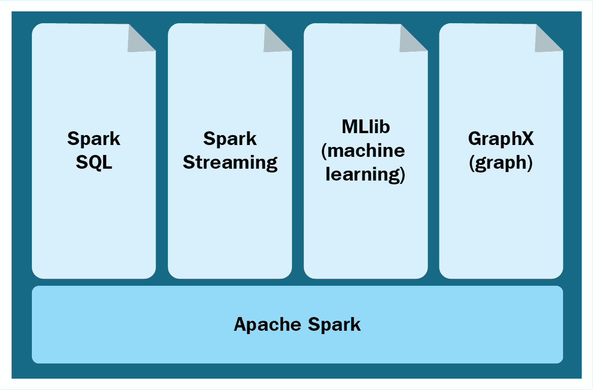

# 第六章：构建大数据应用程序

在本章中，我们将学习构建大数据应用程序，分析传统端到端数据工作流生命周期，并按类似的线路逐步构建大数据应用程序。我们将涵盖大数据流程--发现、摄入、可视化和治理。重点将放在 Spark 平台和数据科学预测模型上。随后章节将探讨 DevOps 应用于大数据各个阶段。

+   传统数据平台

+   大数据平台核心原则

+   大数据生命周期：

    +   数据发现

    +   数据质量

    +   数据摄入

    +   数据分析

    +   Spark 平台

    +   数据可视化

    +   数据治理

+   构建企业应用程序

+   数据科学--预测模型

# 传统企业架构

传统上，**企业数据仓库**（**EDW**）系统被视为商业智能环境的核心组件。数据仓库系统是通过集成来自多个不同源系统的数据构建的中央存储库，用于满足企业的数据分析和报告需求。

让我们回顾传统系统端到端数据生命周期组件：

+   **数据发现**阶段是探索和分析源系统中相关数据和数据结构的阶段。如果分析的数据有效、正确且可用，则将其摄入数据仓库系统。例如，如果我们需要客户 ID 信息，则应连接并从正确的列和表中提取数据。

+   **数据质量**确保摄入的数据是可接受和可用的。一个简单的例子是名字格式的第一个名和姓氏惯例，应该遵守，并根据需要为一些记录进行纠正。

+   **数据转换**是根据业务逻辑应用数据操作规则的阶段。例如，每个员工的年薪从多个系统计算并保存在系统中。

+   **提取**、**转换**和**加载**（**ETL**）是所有前述阶段（数据发现、数据质量和数据转换）的集合参考常用术语。

+   **数据暂存**是您系统中从源系统收集数据的着陆区域。

+   **数据血缘**追溯数据摄入到系统中的来源和可信度，以确保只有真实、可信和授权的数据被引入系统。

+   **元数据**是关于数据的数据。例如，销售收据是记录的起源，包含交易详情，从中提取我们计算所需数据的位置。从销售收据中提取商店 ID、销售金额、商品 ID、交易日期等详细信息。

+   **数据仓库**是存储层，将转换后的数据加载为汇总副本。它具有时间变体、一致性和读取密集性。

+   **数据集市**是专门用于某一类别的数据服务仓库，如客户数据、产品数据、员工数据等。

+   **数据分析**是指为满足所有业务需求而进行的分析。其构建的查询解决业务需求，例如上个月新增了多少客户，或者本周哪些产品的销售超过了目标。

+   **语义层**——其业务接口使用商业智能工具在数据库上构建查询，隐藏复杂的数据表格，使业务用户无需接触。

+   **报告**——报告是供业务使用的，例如展示上个月在某州销售的所有产品。

+   **仪表盘**提供重要关键绩效指标的快速整合视图。一个类比是汽车仪表盘，显示速度、电池、电量剩余等信息。

+   **数据可视化**——仅仅根据 Excel 报告找到关键的业务表现趋势可能是一项艰巨的任务。将其以可视化形式呈现非常具有吸引力，例如将其表示为图表、直方图和饼图。

# 构建大数据企业应用的原则

大数据平台和应用程序管理、集成、分析和保护对多种数据类型的分析，不仅涵盖企业内部数据，还包括外部数据。它们实时集成多个数据源，考虑到数据的体积、速度和种类。该平台可以构建为企业知识库的存储库，存储组织的集体数据资产。

一些构建这些平台的显著特点已经讨论过，正如我们所见，DevOps 非常适合，并且是增强每个阶段价值的工具，比如用于构建算法、数据模型的版本控制系统，使用虚拟机构建可扩展的可复现平台，正如前一章所见：

+   **灵活的数据建模**：大数据系统集成了来自多个数据源的多种不同形式的数据。与其采用预定义的固定行列结构，数据架构应动态定义，并且数据建模需反映如何同化信息。为了反映现实世界中的实体，它也可以灵活地指定为具有关系的对象图。

+   **知识管理**：带有版本控制的知识库，包含组织积累的洞察力，可以作为企业资产加以利用。

+   **隐私和安全控制**：该平台设计用于数据血缘、多级安全和审计合规。平台中集成的每个对象都可以追溯到其原始数据源，并且设置了访问限制，包括授权和认证。

+   **数据处理算法**：这些是大量的数据集，需要使用内置的机器学习算法进行编译和分析，以增强人工用户通过识别数据模式理解大规模数据的能力。

+   **可扩展平台**：这些平台通过可扩展的架构与联合数据存储相结合，处理 PB 级别的数据，以存储大量非结构化数据，如文档、电子邮件、音频、视频、图像等。这些平台被设计为开放平台，可以在堆栈的每一层进行扩展。需要考虑高效的数据发现、数据血缘关系和弹性搜索工具的提供。

+   **协作**：该平台使多个用户能够在组织内外无缝、安全地协作，实时分析相同的数据，从低级数据集成、导入管道定制到构建自定义用户界面。已集成的数据可以通过 API 作为对象访问，或导出供其他框架和工具使用。

+   **在模型上构建模型**：简单的模型可以作为更复杂模型的构建模块，构建精细的分析并将其流线化为模块化过程。可以使用内置的丰富可重用统计和数学操作库来构建模型。

+   **数据可视化**：这是一个互动用户界面，提供一个无缝的整体视图，展示所有集成数据的丰富可视化形式，如表格、散点图和图表。这些可视化图表实时与源数据保持同步，使得用户始终能够在任何给定时刻查看最准确和最新的信息。

# 大数据系统生命周期

大数据系统是根据数据生命周期模型构建的，通常可以分为以下几个阶段：

+   数据发现

+   数据质量

+   将数据导入系统

+   将数据持久化存储

+   对数据进行分析

+   数据治理

+   可视化结果

我们将在接下来详细学习它们。

# 数据导入系统

数据发现，像传统过程一样，从多个源系统中摄取原始数据；然而，在将其转化为商业洞察时，数据的体积、种类和速度将会有所不同。通过利用大数据的力量，数据发现过程使得数据清洗和数据丰富成为可能，促进将数据集组合以重建新的视角和互动的可视化分析。一个互动的数据目录有助于引导搜索功能，帮助我们彻底分析和理解数据质量。成熟而强大的数据发现过程确保可能的数据关联，它让用户定义基于属性的规则、数据源之间的关系，协调数据源并基于数据集市创建丰富的数据。

为了拓展传统商业智能系统的边界，充分利用大数据的潜力是企业成功的关键。这有助于有效地解锁来自新信息源的洞察力。随着新型数字信息源的不断涌现，组织有潜力访问到丰富的知识，并能得当挖掘这些知识。

使用大数据工具和技术进行数据发现，有助于深入探索组织内外的数据，从而清晰地看到商业表现。企业可以探索新的维度，改变商业分析系统的构建和使用方式，使其更高效。通过结合各种数据源，数据发现允许快速、直观地探索和分析信息；它为业务提供了更深层次的洞察力，并带来了更高效率的机会。它建立了重新定义商业与 IT 之间角色的新关系，同时增设了新的角色、新的领导力，并对数据治理的方式进行了修订。

许多组织已经更新了商业智能决策系统，以基于现有数据和系统来提升商业表现，帮助理解和监控数据。如今，绝大多数数据增长来源于传统商业智能环境无法触及的系统，例如网站、社交媒体、内容管理系统、电子邮件、文档、传感器数据、外部数据库等。因此，需要采用新时代的数据发现工具，同时也要考虑到这些多样化和变化的数据正在呈指数级增长。在发现阶段需要处理的数据类型多种多样，从结构化的数据库表格，到包含数字和自由格式文本的半结构化形式，再到完全非结构化的文档。

数据量和种类的多样性，以及其不确定的价值，是最大的挑战之一。互联网文化的普及和消费者与企业商业软件的互动，特别是通过移动和网页应用程序，催生了迅速探索相关信息的迫切需求，以发现新的业务洞察力并做出决策。

**数据化**是将所有类型来源、所有类型格式的数据量化的过程。数据化使得信息能够被收集、整理和分析，从而使信息的潜在用途仅受技能熟练的商业用户的创造力限制。数据的真正价值就像浮在海洋中的冰山。最初，只有一小部分是可见的，而大部分则隐藏在水面下。那些理解这一点的创新公司能够提取隐藏的价值，获得潜在的巨大收益。

企业级数据发现系统能够快速、直观地探索和分析来自多种结构化和非结构化来源的数据。它们使组织能够利用现有投资，将商业分析能力扩展到新的、多样化的来源组合，包括社交媒体、网站、内容系统、电子邮件和数据库文本，为数据和业务流程提供新的可见性，节省时间和成本，并帮助做出更好的商业决策。此方法的一些优势包括：

+   通过为用户提供更深入的见解和可见性，帮助他们找到自己想要分析的数据，从而深入了解业务。

+   通过访问更新的信息，可以实现近实时的数据和内容传递，帮助人们根据最当前的信息做出决策。

+   增加资产的重用。你可以重用信息资产，并消除重新创建这些资产的成本。

+   为 BI 专业人员提供开发和交付适合商业专业人员使用的分析型消费级应用的便利，进而提高采用率、降低培训成本并加快价值实现的速度。

# 数据发现阶段

数据发现过程涉及原型设计、可视化、桥接、复制和转化等阶段。将这些概念在数据发现的背景下并行应用，可以从大数据中获得价值：

+   **原型设计**：通常，在任何商业环境中，项目总是面临压力，并受限于时间和预算等资源。在复杂项目中，原型设计是当面临紧迫、苛刻、看似困难且时间有限的挑战时，推动进展的有效方式。原型设计是在没有找到答案之前采取行动，在没有经过验证的公式或已知解决问题的方法的情况下冒险。原型设计让我们能够测试假设并探索替代方法，通过构建小模块来获取整体视图。DevOps 加快了原型设计过程，使其成为一个持续的开发循环。

数据发现让人们能够在数据中自由探索，尝试新的数据源组合、筛选和精炼分析，发现先前隐藏的模式，或者如果第一次尝试没有得到有价值的见解，可以跳转到另一个实验线程。一个关键的挑战是如何实时同步源系统的数据模式变更与暂存和开发系统；可以采用 DevOps 方法和流程来解决这一问题。

通过数据发现的实验包括三个主要任务——提出新问题、观察新模式和添加新数据。这些步骤构成了一个连续的过程，是迭代的，并且会根据用户在任何给定时刻所看到或假设的内容流动到任何方向。与数据发现阶段集成的 DevOps，使得这一过程从源系统识别到数据摄取，再到暂存系统的过程自动化。

+   **可视化**：数据可视化帮助数据分析师快速反馈他们的假设，因为图形化更便于在定量信息中发现模式。实时查看经验性业务分析的结果，使数据分析师能够确定哪些细化或进一步的搜索可能导致对绩效差距或市场机会的更深理解。通过快速可视化分析结果来增强有效的数据发现，帮助经验丰富的数据分析师以及非技术性的业务用户。数据可视化技术，如拖放式仪表板、快速生成的图表、易用的向导以及类似消费者风格的导航，加速了对数据模式及其行为特征的理解。

+   **桥接**：通过数据发现过程，业务与 IT 之间可以建立更加高效的合作关系。在传统环境中，业务和 IT 分别扮演提供者和用户的角色，进行数据发现阶段的独立活动。这使得他们可以作为一个团队合作，汇聚力量共同探索和学习。IT 分析师帮助业务合作伙伴，向他们展示如何添加数据源、完善搜索，并探索新的问题，逐步了解软件的功能。他们还可以直接与业务方合作，如何实时构建发现应用程序，并如何在分析可能性时变得自给自足。传统的提取需求、编写复杂规范，以及经过漫长的开发和部署过程，通常在时间和精力上都非常繁琐。IT 通过绕过大部分 SDLC 流程并赋能业务用户自助服务数据，从而大大提高了效率。

+   **系统化**：随着数据探索与深度洞察技能的不断提升，在某些情况下，某一条调查路径可能会重复几次。这也可能带来超越单次情景的宝贵见解，更有效地抓住业务问题的一部分，并不断重复和追踪结果。一旦通过用于描述关键业务流程的度量标准和维度将业务查询和响应建立起来，就可以考虑将分析和度量整合到组织的企业 BI 系统中。商业智能平台通过让用户对标准数据集执行标准化查询来回答已知问题，从而表现出色。

数据发现与商业智能系统互为补充，数据发现擅长解决未知问题，而 BI 则专注于系统化分析，如下图所示：

DevOps 将标准化数据模型、仪表板和可视化报告的维护过程，并将其自动化测试和部署，从开发系统到 QA 和生产环境，形成持续集成和部署模型。

+   **转型**：数据发现过程能够帮助探索无限多的新途径，解决业务问题并发现之前隐藏在数据中的新机会。通过实验过程揭示这些新维度，能够发现有价值的新洞察，为转型铺平道路。然而，对于标准已知领域，企业仍将继续使用现有的 BI 系统，并利用数据发现探索为新问题和问题提供洞察的方法。因此，数据发现通过易于探索多样数据的方式，展现了其价值，帮助揭示推动收入和生产力显著增长的洞察，同时改善了业务与 IT 的对齐和关系。它推动了商业分析世界的转型。

大数据发现领域有多种工具，如 Apache PIG、Oracle Big Data Discovery、Zoomdata、Exasol、Revolution、GridGain 等。

传统的商业智能（BI）工具，如 Tableau、QlikView、Microstrategy、Informatica 等，也在为大数据提供广泛的数据发现功能。

# 数据质量

其中一个最大的挑战是确保数据质量和准确性，这说起来容易做起来难。DevOps 将增强数据质量过程，确保从脚本到整个验证过程的自动化循环。我们来看看一些挑战：

+   **数据多样性**：来自移动设备、Web 技术、传感器数据、社交媒体等各种数据源的数据，带来了多种复杂的数据类型和数据结构，增加了数据集成的难度。这些数据源生成了例如文档、视频、音频等形式的非结构化数据，以及软件包、模块、电子表格、财务报告等形式的半结构化数据和结构化数据。所获得的有价值洞察依赖于收集、存储和验证的数据。由于这些数据来自如此多的不同来源，且依赖于集成过程的有效性，因此至关重要。在处理生命科学等数据密集型且敏感的行业时，这一过程必须是万无一失的。

+   **数据复杂性**：数据变得复杂，涉及多个属性，例如来自不同来源的原始数据，这些来源包括消费者、销售人员、运营部门以及组织内的其他来源。数据的时效性至关重要；你需要实时收集所需数据，或实时处理数据需求，否则数据可能会变得陈旧、过时和无效。基于这些数据的处理分析将产生无用或误导性的信息和结论，从而误导决策系统。

+   **确保数据安全**：有许多技术有助于通过移动、网络和 ERP 等应用程序跨多个渠道进行通信，这增加了维持数据安全的复杂性。云、大数据和移动等新兴技术正迅速扩展其应用范围并变得越来越流行。然而，数据安全的需求和挑战比以往更加复杂。

确保数据质量的一般指南如下：

+   **数据可用性**：大数据系统所需的数据应根据预期用途适当提供。数据应是及时的，可以通过实时流式传输或批处理模式获取。数据应通过可用的 API 接口进行访问，并且数据应被授权用于使用。

+   **数据适当性**：数据应具有可信度，否则目标将无法实现。数据溯源过程追溯数据的来源。数据定义应适当，并且在数据的新鲜度和定期更新方面应是可以接受的。数据文档和元数据应在可接受的值范围内经过审计以确保其正确性。

+   **数据准确性**：数据应可靠；数据值应真实反映源信息的状态，数据不应含糊不清，应是事实的单一版本。数据应在预定时间内保持一致并可验证。数据应完整并且可审计。

+   **数据完整性**：数据格式应清晰，并符合一致性的结构和内容标准。数据的完整性应保持完好。数据应相关并符合所需的用途，且在各方面完整，适合用于其预定目的。

+   **呈现质量**：数据的内容和格式应清晰易懂。数据描述、分类和编码内容应易于理解，并符合既定目标和规范。

有许多开源大数据工具提供多种数据质量特性，例如 Talend、AB Initio、Data Manager、Datamartist 和 iManage Data。

在数据摄取过程中，原始数据来自多个数据源并被加入系统。根据源系统的数据格式和质量，以及目标数据处理状态的需求，这一过程可能会非常复杂。数据摄取到大数据系统的方式多种多样，具体取决于摄取的数据类型。为了准备原始数据供系统使用，通常在摄取过程中需要进行某些程度的分析、排序和标记。从传统的遗留数据仓库过程扩展出来的，包含提取、转换和加载（ETL 过程）。一些相同的概念也适用于进入大数据系统的数据。

数据摄取过程涉及对输入数据进行格式化、分类和标记的处理。数据结构应遵循预定义标准，通过剔除不需要的数据来确保符合要求。因此，从多个源系统捕获的大量数据将用于进一步处理。它以原始格式存储在数据湖中。

# 批处理

批处理作业，顾名思义，是那些数据集作业，这些作业对时间不敏感，并且在大型数据集中以批量方式处理。批处理作业的处理可以以多种模式进行，下面将描述这些模式。

# 从 RDBMS 到 NoSQL

存储在关系型数据库（RDBMS）中的大部分遗留数据可以使用 Sqoop 导入到 HDFS 上的 NoSQL 数据库中，DevOps 可以为 Sqoop 脚本的基准提供支持，自动化数据导入和导出的过程，存储和计算系统的可扩展性，数据完整性的测试自动化，以及自动部署。数据迁移过程如下所述：

+   Sqoop 是一个命令行界面应用程序，用于在关系型数据库和 Hadoop 之间传输数据。它支持增量加载单个表或自由格式的 SQL 查询，以及可以多次运行的保存作业，以导入自上次导入以来对数据库所做的更新。导入还可以用于填充 Hive 或 HBase 中的表。

+   Oozie 可以用于调度和创建数据导入/导出的流程。

+   在 Sqoop/Oozie 中可以配置全量和增量导入。

+   我们可以直接导入并创建 Hive 表，但如果构建分层架构，建议将数据导入到暂存区。

+   例如--`sqoop import -connect jdbc:mysql://:/ -username -password --table --target-dir`。

# Flume

对于其他批处理数据源，我们可以部署 Flume。它会监控新的源文件并将数据推送到 HDFS。

+   Flume 在将大量日志数据传输到分布式系统、收集并根据业务需求汇总数据方面非常有效和可靠。

+   架构简单且灵活，能够满足传入流数据流的需求。

+   Flume 具有强大的容错性和可定制性，拥有高级功能，如故障转移和恢复机制等。

+   一个简单且可扩展的数据模型支持在线分析应用程序

# 流处理

流处理，顾名思义，是对实时数据的计算，这些数据通常具有时效性，且通常带有高速度的度量。分析通常在流数据被摄取时进行，以便进行质量检查等。

# 实时

如果数据以流的形式存在，例如应用日志、程序输出（如网页抓取器）、传感器、地理位置或社交媒体，这些可以通过 Kafka 实时收集。

+   Kafka 是一个开源消息代理项目，旨在提供一个统一的、高吞吐量、低延迟的平台，用于处理实时数据流。它本质上是*一个大规模可扩展的发布/订阅消息队列，构建为分布式事务日志，使其在企业基础设施中处理流数据时具有极高的价值*。

+   Kafka 可以轻松扩展，以支持更多的数据源和不断增长的数据量。

+   Kafka 还支持与 Spark 的直接连接。

+   每个输入数据源对应一个主题，每个消费者组对应一个主题。

+   每个主题的分区数量将取决于数据的大小。

除了 Sqoop 和 Kafka，还有一些其他专门的数据摄取工具，用于导入和聚合服务器及应用日志，这些工具包括 Apache Flume 和 Apache Chukwa。**Gobblin**也提供了一个数据摄取框架，用于聚合和规范化数据。

# Lambda 架构

当批处理和流数据同时导入系统时，Lambda 架构非常有效，如下图所示：

# 数据存储层

持久化大数据有多种存储选项，例如数据湖和数据仓库；云技术对数据存储的支持大大增强了大数据存储系统的需求，这些系统能够通过简单的存储设备和虚拟机扩展至 TB 和 PB 级别。本书详细讨论了 DevOps 作为管理可扩展数据存储的有效解决方案，使用基础设施即代码。

+   **数据湖**：数据湖与水湖同义，水湖储存水并供许多人使用。数据湖是原始数据的存储库。收集到的数据可能是非结构化的，并且经常变化，因此，最初这些数据会被集中存储在大存储库中，以便用户根据其预定需求进行使用。

+   **数据仓库**：数据仓库是一个有序的数据存储库，用于存储大量数据以供分析和报告使用。数据仓库中的数据通常是经过清洗的、组织良好的，并且与其他数据源进行了集成。它在传统系统中通常更为显著。

摄取过程确保进入的数据根据业务需求被处理，并可靠地持久化到存储磁盘。摄取过程可能很复杂，取决于来自源系统的数据的量和多样性。分布式存储系统的可用性通过 Apache Hadoop 的 HDFS 文件系统实现。通过 HDFS，大量原始数据可以同时写入多个节点，并具备冗余性。

Ceph 和 GlusterFS 是提供所有这些功能的其他文件系统。

分布式数据库，如 NoSQL，适合导入数据以便进行更结构化的访问。它们具备容错功能，并能够摄取异构数据格式。根据组织的业务需求，可以从多种可用选择中选择适当的数据库。

# 数据存储 - 为了更好的组织和效率的最佳实践

# 着陆

着陆区是初始数据从不同源系统以原始状态进入存储系统的地方。

+   着陆区是存储进入数据的地方

+   所有的输入验证应该在此进行

+   文件夹结构可以是`<source>/<type of data>/<yyyymmddhhisss>`

+   应该同时应用归档机制（按天/周/月）

+   访问应仅限于处理用户，而非最终用户

# 原始

一旦数据进入着陆区，就会进行适当性、格式和质量的完整性检查；在符合要求的情况下，它会以原始数据的形式存储。

+   这是存储原始数据的地方，数据保持其原始格式

+   来自着陆层的经过验证的输入数据存储在这里

+   目录结构由摄取框架管理

+   只有选定的超级用户和系统用户能够访问这些数据

+   应应用 Snappy/LZO 压缩

+   应该应用数据分类器（热数据、冷数据），并设置归档策略

+   文件夹结构可以是`<base dir>/<system type>/<dataset Source Name>/<Source Type>`

# 工作

工作区存储已识别的清洁数据，用于业务目的

+   这是临时工作区，清理应该在相关任务完成后进行，除非任务需要数据用于调试

+   Spark 流式处理的检查点位置也会位于这里

# 黄金

黄金数据是经过转换、分区，并分类为主数据的有价值数据。

+   这是存储转换后数据的位置

+   在这一层，分区是非常重要的，应该根据最常访问的列来进行分区

+   应对非常热、热、冷和非常冷的数据进行分类

+   非常冷的数据应该归档到 Blob 存储（或任何其他便宜的存储）

+   文件夹结构可以是`<base dir>/<system type>/<dataset Source Name>/<Source Type>/<Job ID>`

# 隔离

这是保存不需要的、过时的数据的地方，这些数据当前没有活跃的即时用途。

+   来自不同步骤的所有被拒绝的文件将存储在这里，如摄取、转换以及验证异常记录

+   应对非常热、热、冷和非常冷的数据进行分类

    +   非常冷的数据应该归档到 blob 存储（或任何其他廉价存储）

# 业务

业务数据是客户特定详情的主数据，如地址、产品偏好等。

+   这一层将包含应用程序/客户端特定的数据

+   所有数据必须以 parquet 格式存储，因为此阶段的所有数据将是结构化的

# 输出

输出数据是将要与外部实体共享的数据，例如供应商、卖方或第三方 API。

+   这是可以与外部应用程序共享数据的位置

+   文件在复制后需要被归档

+   客户端可以拥有临时或永久访问权限

一个良好的易用备份和灾难恢复解决方案提供了 Hadoop 集群之间的集成数据同步。它通过复制存储在 HDFS 平台中的数据并跨数据中心进行同步，从而实现数据保护。

# 计算和分析数据

从前面的过程生成的数据可以被分析，以发掘实际的信息价值。计算层执行各种功能，其中数据通常通过组合工具进行迭代处理。为了满足不同的业务需求，提取的各种洞察力通过量身定制的做法得以实现，而这些做法因组织而异。

批处理是对大数据集进行计算的一种方法，其中数据以批处理模式进行摄取，可以是每日或每小时。Apache Hadoop 的 MapReduce 是最突出和强大的批处理引擎，它被称为分布式 MapReduce 算法；它采用以下策略，在处理需要大量计算的非常大数据集时最为有效：

+   **拆分**：在这个过程中，工作被划分为更小的部分

+   **映射**：这是将每个数据块调度到单独机器上的过程

+   **洗牌**：基于中间结果重新洗牌数据

+   **减少**：处理每组输出数据

+   **组装**：最终结果被组合在一起

MapReduce 框架形成了计算节点，而 HDFS 文件系统则形成了数据节点。通常，在 Hadoop 生态系统架构中，数据节点和计算节点执行相似的角色。MapReduce 组件的委托任务由两个守护进程执行，**Job Tracker** 和 **Task Tracker**，它们的活动如下图所示：

接下来讨论的是批处理、实时处理和流处理中的数据处理。DevOps 是大数据系统中不可或缺的一部分，涉及从源系统发现到基础设施的可扩展性，以支持存储需求的高容量数据处理。

+   **批处理**：在处理大量数据时非常高效。数据被导入系统、处理，然后以批次形式生成结果。系统的计算能力是根据处理的数据大小设计的。系统配置为无需人工干预即可自动运行。该系统可以快速扩展，以适应大量数据文件的计算分析。根据处理的数据量和定义的系统计算能力，输出时间线可能会有显著变化。

+   **实时/流处理**：虽然批处理适用于某些类型的数据和计算，但其他工作负载则需要更低延迟的响应。有一些实时系统需要在处理信息时做出实时响应，并在持续吸收新信息的同时，使分析或可视化结果迅速呈现给业务方。这些系统称为流处理系统，它们基于连续的数据流进行工作，这些数据流由独立的数据项组成。实时处理系统或流处理系统，利用内存引擎的实时处理能力；计算分析是在集群的内存中执行的，从而避免像传统的基于磁盘的持久系统那样必须写回磁盘。实时处理最适用于分析较小的数据块，这些数据正在快速变化或被添加到系统中。

有许多平台和工具可以实现实时处理，如 Apache Storm、Apache Flink 和 Apache Spark。每个平台都设计为实现实时或接近实时处理的不同方式。除了这些列出的计算框架外，还有许多其他手段可以在大数据生态系统中分析数据或执行计算。这些工具常常与前述框架集成，并提供额外的接口与底层层次进行交互。我们在前一章已经讨论了它们在不同场景中的适用性以及每个问题的最佳应用，但我们将在此再次回顾一些工具：

+   Apache Hive 提供了 Hadoop 的数据仓库接口

+   Apache Pig 提供了一个高级查询接口

+   Apache Drill、Apache Impala、Apache Spark SQL、Presto 等，提供类似 SQL 的数据交互

+   R 和 Python 是常见的简单分析编程语言选择

+   Apache SystemML、Apache Mahout 和 Apache Spark 的 MLlib 提供机器学习库的预测模型构建功能

# Apache Spark 分析平台

Apache Spark 是一个下一代内存中开源平台，集成了批处理、流处理和交互式分析。Spark 提供了易于使用的功能，能够快速编写应用程序，并具有内置的操作符和 API，此外还提供更快的性能和实现。

Spark 提供了一个更快、更通用的数据处理平台，内存中运行的程序比 Hadoop 快最多 100 倍，磁盘上运行的程序比 Hadoop 快最多 10 倍，具备极速的集群计算能力。Spark 框架建立在 Hadoop 集群之上，用于处理来自结构化系统（如 Hive）的数据，并从 Flume 和 Kafka 流式传输数据。它具有许多先进功能，并支持多种编程语言，包括 Java、Python 和 Scala。它拥有广泛的分析功能、开箱即用的算法、机器学习、交互式查询和复杂功能分析。

Spark 的流行度源于其许多优点，包括：

+   Spark 是 Hadoop 生态系统的一个子集。它与生态系统中的可靠且安全的存储平台 HDFS 良好集成，且与其他数据源兼容，如 Amazon S3、Hive、HBase 和 Cassandra。它可以在 Hadoop YARN 或 Apache Mesos 管理的集群上运行，也可以作为独立模式运行。

+   Spark 是一项用于大规模数据处理的快速技术。该框架提供基于 Java、Scala 和 Python 的高级 API，并为流处理和机器学习提供丰富的数据存储。虽然主要 API 是为 Scala、Java 和 Python 设计的，但也支持 R 等语言。

+   Spark 确保数据的并行处理，并与 Hadoop/HDFS 进行良好的集成以进行数据存储，同时支持多种文件系统和数据库。

+   Spark 的机器学习能力被证明是流处理的优秀解决方案。通过 Spark REPL，编写代码更容易、更快捷，内置了高级（80 个）操作符。Spark 的**读取评估打印循环**（**REPL**）是交互式的（开箱即用）Shell，是 Scala 交互式 REPL 的修改版。使用 REPL 时，无需编译和执行代码。用户的表达式会被评估，并且 REPL 将显示该表达式的结果。*读取*将表达式作为输入，解析并以内部数据结构存储在内存中。*评估*遍历数据结构，评估调用的函数。*打印*显示结果，并具有打印功能。*循环*迭代返回读取状态，在退出时终止循环。REPL 加快了周转时间，并支持临时数据查询分析。

+   Spark 更加灵活，特别适合大数据分析。其基于自身流处理 API 的持续微批处理和集成的先进分析功能对开发者友好。

+   与 MapReduce 相比，Spark 的效率更高。对于相同的处理过程，它比 MapReduce 快 100 倍。

+   Hadoop 的流行批处理作业引擎 MapReduce，由于其批处理模式响应的高延迟，面临着巨大的挑战，且由于其架构设计和代码的固有低效性，维护起来非常困难。Spark 的主要组件是 Spark Core Engine，它还配有一套强大的、更高级的库，这些库可以无缝地在同一应用程序中使用：

    +   Spark SQL 是一个强大的查询语言，内置 DataFrames。

    +   Spark Streaming 引擎用于数据流处理

    +   Spark MLlib 用于机器学习以及机器学习管道模型

    +   GraphX 与 GraphFrames 将实体之间的关系存储为图形表示。

# Spark 核心引擎

Spark 核心引擎是 Spark 进行大规模并行和分布式数据处理的基础引擎。它执行以下功能：

+   容错和基于恢复的内存管理

+   集群作业调度、分发和监控

+   存储设备系统接口

Spark 是基于不可变的、容错的、分布式的对象集合构建的，称为**弹性分布式数据集**（**RDD**），可以并行操作。对象通过加载外部数据集或从内部驱动程序分发来创建。通过 RDD 执行的操作是转换。

转换操作包括 map、filter、join 和 union，执行在 RDD 上并产生新的结果。

动作操作包括 reduce、count、first，它们在对 RDD 进行计算后返回一个值。

Spark 引擎设计高效。转换操作实际上是在调用动作时计算，并将结果返回给驱动程序。转换是惰性操作，不会立即计算结果；然而，它们会记住要执行的任务和数据集（例如文件），以执行操作。转换后的 RDD 可以为下一个转换重新计算。其优点是避免了不必要的变更和计算。所有这些都通过内存引擎实现，数据会在 RDD 对象上持久化并缓存。Spark 会将元素保存在集群缓存内存中，以便下次查询时能够更快地访问。

# Spark SQL

Spark 组件 Spark SQL 支持通过 SQL 或 Hive 查询语言查询数据。Spark SQL 与 Spark 堆栈集成，提供对各种数据源的支持。它允许你将 SQL 查询与代码转换结合，使其成为一个非常强大的工具。

# Spark Streaming

Spark Streaming 是一个强大的基于内存技术的功能。Spark Streaming API 与 Spark 核心引擎兼容。它支持批处理和流式数据处理，能够实时处理来自 Web 服务器日志文件、基于 Twitter 的社交媒体数据等系统的数据。Spark 还与其他工具（如 Kafka）接口，用于各种消息队列。

Spark Streaming 从上游系统接收输入数据，如 Apache Flume、Kafka 等，并将数据划分为批次，通过 Spark 引擎处理这些批次数据，并生成最终的结果流批次，将其存储在 HDFS/S3 等位置。

MLlib 是一组库函数，提供各种机器学习算法，如分类、回归、聚类和协同过滤。Apache Mahout（一个用于 Hadoop 的机器学习库）已经集成到 Spark MLlib 中。一些算法，如线性回归或 K-means 聚类，也支持流数据，并设计为在集群上扩展。

GraphX 提供了 ETL 功能、探索性分析和迭代图计算。它提供了一个用于操作图形和执行图并行操作的库，支持常见图算法，如**PageRank**。

Spark 非常适合简化复杂且计算密集型的任务，用于高容量实时数据处理，无论是流数据还是归档数据，结构化和非结构化数据都能轻松处理，同时无缝集成相关复杂功能，如机器学习和图算法。

一些挑战包括操作复杂性和开发管理应用所需的高技能水平。Spark 与 Hadoop 配合良好，能充分利用 Hadoop 的 HDFS。两个系统的性能调优至关重要，否则，Spark 的细微差别可能会导致内存溢出错误和内存滞后问题，特别是在作业未经过良好调优时。

# 大数据系统中的可视化

我们都熟知“**垃圾进，垃圾出**”这句话。识别和了解数据随着时间的变化、趋势、波动和变化通常比单纯的数据分析更为重要，而数据可视化则是不可避免的步骤。由于大数据系统处理的信息复杂性，数据可视化成为发现趋势并从大量数据点中提取有意义洞察的最重要和最有用的方法之一。

我们将在这里讨论一些实时处理工具：

+   **Prometheus**：用于实时处理应用和服务器指标，数据流作为时序数据库，进行可视化。系统的健康状况通过频繁的数据变化来衡量，指标的大幅波动通常表示重要的关键绩效指标（KPI）。

+   **Elastic Stack**：它在大数据系统可视化中非常流行，用于以视觉方式展示计算结果或原始指标。它也被称为 ELK Stack，由 Logstash（用于数据收集）、Elasticsearch（用于数据索引）和 Kibana（用于可视化）组成。

+   **SILK**：它是一个类似的堆栈，通过使用 Apache Solr 进行索引和一个名为 **Banana** 的 Kibana 分支来实现可视化。

+   **Jupyter Notebook** 和 **Apache Zeppelin** 提供了交互式数据探索和可视化的界面，数据呈现格式便于共享、展示或协作。这项技术通常用于交互式数据科学工作，并被称为数据 *笔记本*。

# 数据治理

数据治理是对企业数据进行分类，并为适当的角色和人员提供正确的访问权限和特权的过程。它指的是管理组织中数据资产的可用性、可用性、完整性和安全性的整体过程。成熟的数据治理模型是一套明确定义的策略，包含一个治理小组以及一个协调有序的计划来执行这些程序。

采用开源软件开发方法来进行平台/产品开发将带来许多优势，例如：

+   在组织内部跨不同技术团队的无缝协作

+   在组织内 leverage 和重用现有的软件和知识资产

+   它确保解决地区、客户和国家特定需求

这种软件开发方法有助于建立治理机制，以确保避免重复工作并按照统一的标准框架实现透明化。

数据治理应定义必要的最小规则，而不是成为负担。它还应在以下方面进行平衡：

+   规则与公众（人人可用）

+   人员与流程

+   授权与指引

开源治理基于三个支柱：

+   透明度

+   设置治理参数

+   更快地交付每个团队和每个成员的成果

实践透明度、鼓励积极参与并认可所有成员贡献的开源社区，更有可能繁荣、迭代并增强前景。开源社区开发模型中的治理原则可以通过描述以下图示中的七个支柱来更好地展示：

# 根据 DevOps 核心概念的人员与协作

技术由人驱动，因此技术的成功依赖于几个属性——它应该易于被人们采纳，应该具有灵活性，易于学习，并且便于协作。我们将在这里讨论这些：

+   确立过程示例代码、提交和审查过程的所有权

+   一个通用的仪表盘，用于查看任何组件的状态、已做更改、审查状态、测试、受影响的组件等

+   采用论坛讨论而非电子邮件、Yammer 小组等，来解决问题和解答疑问

+   定期（每周、每两周）全员部署会议，讨论组件变化和路线图

# 环境管理

信息技术中环境管理是一个复杂且至关重要的职能。

+   维护开发的并行环境，例如当前程序和其他生产修复

+   定义组件与数据库交互的访问限制

+   定义每个组件/程序的资源分配（磁盘空间、线程/映射器等）

# 文档

对正在进行的工作进行文档记录，对于项目的生命周期、功能升级以及作为操作手册的支持和维护都非常重要

+   核心组件、业务/装配线使用、治理等的全面文档。这对于跨团队合作、新成员的加入等非常重要

+   用于帮助每个团队成员的文档可以定期修订，添加更细化的细节：

    +   主架构参考文档——按照 TOGAF 建议的格式创建，以便使用统一的语言交流

    +   开发者指南

    +   治理指南

    +   部署指南

# 架构委员会

架构委员会负责企业的长期规划，并确保架构符合业务目标，例如面向服务的架构、使用符合安全指南的组件、开放源代码工具使用比例作为路线图等。

+   **架构评审委员会** (**ARB**) 是定义和参与门控（或里程碑）规划的权威机构

+   定义每个程序高层设计的门控里程碑

+   预算每个程序的重构工作量，并在门控会议中批准

+   集中化设计审批决策

+   用于门控和评审的审查清单

# 开发和构建最佳实践

开发最佳实践包括采用编码标准、适当的文档、同行评审、代码质量等，以确保代码和性能的高质量。构建是一个复杂的任务，涉及许多接口。遵循适当的指南将使其根据组织需求更为健壮和高效。

+   自动化构建与自动化测试流程

+   基于示例的源代码同行评审

+   通用 IDE、代码审查工具（PMD、check style 等）、构建工具（Hudson 和 Maven）

+   标准化的构建推广程序和时间表

+   每周通过持续集成和测试发布环境稳定性

+   定义测试环境和回归套件以执行受影响的模块

# 版本控制

版本控制将确保代码变更得到良好的跟踪，便于可追溯性和问责

所有组织团队使用企业标准工具进行版本控制是理想状态。版本控制治理具有以下特点：

+   每次检查提交时，自动向受控的主管邮件列表发送电子邮件

+   定义每个程序组件的贡献者，并限制对组件的访问

+   定期审计检查提交，并获得组件所有者的批准

# 发布管理

一个成熟的发布管理过程是组织向客户及时交付高质量可靠产品的重要资产

+   集中化发布管理

+   跨程序和功能定义的共同优先级

+   使用微服务/增量部署——支持独立部署的架构

# 使用 Spark 构建企业应用程序

对于企业应用程序的成功来说，仔细定义数据访问、处理和治理框架是非常重要的。

# 客户端服务展示层

这个图形用户界面将由一组 API 支持，帮助新用户入驻。支持的功能如下：

+   管理客户端数据源、文件格式、交付频率、验证规则、联接条件（如果有多个数据集）等

+   验证和转换数据集

+   管理数据集访问权限

+   Eureka 的附加数据传输要求

# 数据目录服务

这个图形用户界面将由一组 API 支持，提供与数据相关的服务。支持的功能如下：

+   类似于 Google 搜索的方式，在数据湖中搜索任何数据集/数据

+   浏览（带分页的预览）搜索结果

+   显示所选数据集的血统和数据概况

# 工作流目录

这个图形用户界面将允许你为应用程序定义工作流并安排执行。主要功能包括：

+   为应用程序创建工作流并安排执行

+   显示工作流的执行状态、所用时间，以及涉及的的数据集和血统

+   在失败或从任何给定点恢复时，能够重新启动处理过程

+   配置状态更新、通知和警报

# 使用和跟踪

这个图形用户界面将用于 Sentry 和 Navigator，跟踪整个集群中数据集的使用情况。其主要功能包括

+   **数据集的有效使用跟踪**：数据集被访问了多少次，以及由谁访问

+   **无效使用跟踪**：谁尝试访问他们没有权限的数据集

+   处理跟踪，了解哪些用户在运行什么处理过程以及消耗了哪些资源

+   需要根据运营团队的要求定义仪表板

# 安全目录

这个图形用户界面将由 REST API 支持，用于配置用户组的访问控制。包括的功能如下：

+   管理用户和用户组

+   管理用户对集群中各种数据集和能够在数据湖中运行的应用程序的访问

# 处理框架

这里是所有数据转换和处理的发生地。处理可以是批量的，也可以是实时的，支持各种框架，如 Spark 和 MapReduce，以及查询引擎，如 Hive 和 Impala。

# 数据摄取服务

数据可以通过多种来源进行摄取，从批处理到实时流，使用如 Sqoop、Flume、Kafka 和 SFTP 等工具。

+   数据摄取将由元数据驱动

+   为了摄取新的数据源，只要使用支持的摄取方法（如 Kafka、Flume、Sqoop 等），就不需要新代码

+   我们应该能够注册数据集，并在数据摄取后立即将它们开始进行目录化

获取的数据可以以多种形式使用：存储、持久化到设备、发布到外部供应商。它可以通过 API 被其他第三方程序访问。

+   **存储层**：为了保持数据完整性和隔离性，我们可以将数据分布在多个 HDFS 层中，以便每个层定义从获取原始数据到生成洞察之间的某个阶段。

+   **发布**：该服务将用于将数据发布到外部用户和订阅者，以及应用程序，作为数据湖的外部推送。

+   **批量 API**：该服务将用于通过异步 API 从系统中下载数据。用户将发出数据检索请求，并在数据集准备好时收到通知。数据的交付可以通过多种方式提供：

    1.  下载链接。

    1.  推送到 SFTP 位置。

    1.  内部用户的 HDFS 位置（同一集群或另一个集群）。

    1.  需要定义 API 合同。

+   **数据访问 API**：该 API 类似于批量 API，但仅支持频繁同步的小型数据集，例如信用评分。

+   **笔记本**：这些可以包括诸如 Apache Zeppelin 或 Hue 数据科学工作台等界面，为用户提供图形界面，以便访问集群中的数据集并使用 Impala、Spark、R 等进行查询。

# 数据科学

数据科学作为一个领域有许多维度和应用。正如我们都熟悉通过制定可重用和已建立的公式来理解科学，我们理解特征、行为模式和有意义的洞察。同样，通过工程和统计方法从相关数据中，我们也能理解行为模式和有意义的洞察。因此，它也被视为数据加科学，数据科学的科学。

数据科学在各行各业已经使用了几十年。许多算法已经开发并在各行业中使用，包括：

+   K 均值聚类

+   关联规则挖掘

+   线性回归

+   逻辑回归

+   天真贝叶斯分类器

+   决策树

+   时间序列分析

+   文本分析

+   大数据处理

+   可视化工作流

+   Apriori

+   神经网络

前述算法的组合用于解决流行的商业问题，例如以下问题，并且新的商业机会不断涌现：

| 交叉销售 | 查找客户特征之间的关系将营销活动与潜在客户匹配 |
| --- | --- |
| 产品产量分析 | 分类产品缺陷 |
| 直接营销 | 分类客户将营销活动与潜在客户匹配 |
| 流失分析 | 预测流失趋势争取挽回客户 |
| 交叉销售 | 查找交易中产品的关系 |
| 分割分析 | 分类客户将营销活动与潜在客户匹配 |
| 库存分析 | 查找交易中产品的关系做出补货决策 |
| 产品组合分析 | 分类客户将营销活动与潜在客户匹配估算产品组合的收入 |
| 欺诈检测 | 分类客户检测异常活动 |
| 信用评级 | 分类客户信用评级客户 |

例如，在数据分类中，我们可以实施以下三种模型，以获得一个精炼且准确的模型：

+   **随机森林**：随机森林或随机决策森林是一种集成学习方法，用于分类、回归和其他任务。它们通过在训练时构建多个决策树，并输出类别的众数（分类）或个别树的平均预测值（回归）。随机决策森林可以纠正决策树过拟合训练集的问题。

请查看以下链接：[`en.wikipedia.org/wiki/Naive_Bayes_classifier`](https://en.wikipedia.org/wiki/Naive_Bayes_classifier)。

+   **朴素贝叶斯**：朴素贝叶斯分类器是一类简单的概率分类器，基于在特征之间做出强独立假设的贝叶斯定理。朴素贝叶斯分类器具有很高的可扩展性，要求学习问题中的变量（特征/预测变量）数目与参数数量之间呈线性关系。

+   **支持向量机**：支持向量机是有监督的学习模型，配有相关的学习算法，用于分类和回归分析。给定一组标记为属于两个类别之一的训练样本，SVM 训练算法构建一个模型，将新样本分配到其中一个类别，从而成为一种非概率的二分类线性分类器。

以下是构建预测模型以解决业务问题的步骤：

+   定义具体的业务目标是最重要的标准。不同利益相关方对数据科学问题协议的业务价值和目的达成一致是最关键的步骤。

+   来自关键利益相关方的资助和支持对于项目的成功至关重要。

+   数据工程师和数据科学家之间的协作至关重要；否则，孤立作业将无法实现项目的成功。

+   数据湖是一个汇集来自不同源系统的有用数据的存储库，这些数据是为了解决业务问题所需的适当、有效、有意义、有用且历史的数据。建立数据湖时，应考虑初始数据的容量规划以及未来增长的考虑。

+   根据质量标准清理数据，以确保仅使用有效和适当的数据，避免脏数据或过时数据进入系统。

+   特征工程是数据科学项目的核心工程，旨在从原始数据中提取有意义的见解（特征）。

+   特征选择是消除不相关、冗余或高度相关的特征。

+   通过遵循适当的验证方法（例如 K 折交叉验证或 70:30 模型）来测试预测模型。

+   确定模型结果。与任何项目一样，结果准确性的重复验证模型的有效性。

+   通过使用新数据进行持续迭代改进，并进行微调来优化模型。

市场上有许多受欢迎的统计建模工具，例如：

+   SPSS 建模工具

+   KNIME

+   Microsoft Revolution Analytics

+   RapidMiner

+   SAP 预测分析

+   SAS Enterprise Miner

+   Oracle 高级分析（Oracle 数据挖掘，Oracle R 高级分析）

一些流行的开源工具提供与商业统计软件包相当的全部功能：

+   R

+   Python

+   Scala

+   MatLab

+   Julia

近期低成本技术（如 Hadoop 生态系统、云计算、大数据和开源工具）的普及，已促使从小型企业到大型巨头的各行各业大规模采用。

# 数据科学方法

数据科学解决方案的方法包括以下几个阶段：

数据集中的知识挖掘（发现）是一个交互式和迭代的过程，涉及多个步骤，用于识别数据中的有效、有用和可理解的模式。

+   **数据处理**：数据清洗将原始数据预处理成易于使用的格式；相关任务包括：

    +   抽样，即从大量数据中选择具有代表性的子集

    +   去除噪声

    +   对不完整行进行缺失数据处理

    +   数据标准化

    +   特征提取：提取在特定上下文中有用的数据

+   **数据转换**：通过缺失数据处理方法确保数据的可用性，例如：

    +   仅使用包含相关数据的行

    +   值替代：

        +   使用特定属性的均值

        +   使用相似案例的历史值进行回归替代

        +   使用匹配插补、相似属性关联的案例

        +   最大似然法、EM 算法等

+   **数据挖掘**：通过方法如：

    +   关联规则

    +   序列和路径分析

    +   聚类分析：

        +   根据一些共同属性将数据集划分为聚类或子集

    +   分类方法：

        +   将样本划分为类别

        +   使用经过训练的集合作为之前标注过的数据

    +   回归模型

        +   基于过去数据的推断预测新值

        +   基于少量其他测量属性计算因变量的新值

    +   可视化模式

    +   分类类似于聚类，但需要提前定义类别：

        +   基于输入标签的分类器返回的分类结果

        +   概率分类是指分类器返回可能的值，将它们分配到一个类别中。

        +   采用特定标准，如数据超过 90%，以避免成本高昂的错误

        +   根据概率限制（如超过 40%）将对象分配到类别中

    +   回归与预测

        +   数据表统计相关性：

            +   基于先验假设的功能形式中的数据分布

            +   基于机器学习的算法

        +   曲线拟合：

            +   探索数据背后定义良好且已知的函数

            +   理论和专业知识为基础

    +   机器学习：

        +   监督学习：

            +   输入和期望结果都作为训练数据的一部分

            +   模型训练过程的输入基于已知的正确目标和结果

            +   适当的训练、验证和测试集构建至关重要

            +   快速且准确的结果

            +   泛化能力，新的数据应能在没有目标先验知识的情况下得出正确结果

            +   泛化意味着能够为训练过程中未出现的输入产生有效的输出

        +   无监督学习：

            +   在训练过程中不会提供正确的结果给模型

            +   输入数据根据其统计特性仅按类别进行聚类

            +   聚类和标签的重要性

            +   即使是少量的代表性对象，也可以应用于所需的类别和标签

    +   曲线拟合

        +   通过使用适当的子集和早期停止实现

        +   基于数据学习，而不仅仅是底层函数

        +   用于训练的数据在面对新数据时应表现良好

+   +   数据集：

        +   **训练集**：用于学习，其中目标值是已知的。

        +   **验证集**：用于调优分类器架构，以估计误差。

        +   **测试集**：仅评估分类器的性能；在训练过程中从未使用。测试集的误差应提供无偏的泛化误差估计。

+   +   +   **数据选择**：垃圾进，垃圾出，底层模型表示应包括训练、验证和测试数据。

        +   **不平衡数据集**：

            +   网络最小化总体误差，因此数据集中各类型数据的比例至关重要

            +   损失矩阵包含

            +   不同情况的均衡表示是解读网络决策的最佳方法

    +   学习过程：

        +   反向传播：

            +   输出值与目标值进行比较，以计算预定义的误差函数

            +   误差反馈到网络中

            +   使用这些输入，算法调整每个连接的权重，以减少误差函数的值。

            +   网络将在经过足够次数的训练周期后收敛

+   +   结果：

        +   混淆矩阵：X 轴上的预测结果与 Y 轴上的目标值进行比较。行表示真实类别，列表示预测类别。

+   +   完整性和污染

        +   分类器的性能根据以下标准进行评估，例如在两个类别之间：

            +   **完整性**：正确分类的 A 类对象的百分比

            +   **污染**：A 类对象被错误分类为 B 类对象的百分比

            +   **分类率**：正确分类的对象的整体百分比

# 监督学习模型

+   神经网络

+   多层感知器

+   决策树

# 神经网络

它是一个结构化的流程，由神经元的输入层和输出层组成，中间有一个或多个隐藏层。

神经元通过选择激活函数与相邻层之间建立了良好的连接，尽管它们位于不同的拓扑结构中，**权重**是根据各种类型和架构的连接的函数值分配的。

**人工神经网络**：受生物神经系统过程的启发。人工神经网络是一种信息处理机制。

大量高度互联的简单处理神经元元素协同工作，解决特定问题。

一个简单的人工神经元：

节点或单元是一个基本的计算元素，接收来自其他单元或外部源的输入。

为了模拟突触学习，每个输入都与相关的权重 *w* 一起考虑。

该单元的输入加权和通过一个函数进行计算：

神经网络的不同类型有：

+   **前馈**：**自适应线性神经元** (**ADALINE**)，RBF，单层感知器

+   **自组织**：SOM（科霍宁映射）

+   **递归**：简单递归网络，霍普菲尔德网络

+   **随机**：玻尔兹曼机，RBM

+   **模块化**：**关联神经网络** (**ASNN**)，机器委员会

+   **其他**：神经模糊，级联，PPS，GTM，脉冲（SNN），即时训练

# 多层感知器

这是最流行的监督模型，通常由多个计算单元层组成，单元层之间通过前馈方式互联。每一层的神经元通过直接连接与后续层的神经元相连。

# 决策树

这是一种分类方法，基于一组简单的规则；它们是非参数的，不需要对每个类中变量的分布做任何假设。

例如，决策树如下所示：

# 无监督模型

+   聚类

+   距离

+   归一化

+   K 均值

+   自组织映射

# 聚类

聚类是层次化的，它使用先前分配的聚类来查找连续的聚类，采用自下而上（凝聚性）或自上而下（分裂性）以及分区类型的聚类，如下图右侧和左侧所示。

# 距离

用于确定两个聚类之间的相似性和聚类的形状。

# 归一化

+   **VAR**：对于每个属性的变换数据集，均值被减少到零；这是通过从每个属性的值中减去该属性的均值，并将结果除以该属性的标准差来实现的。

+   **范围（最小-最大归一化）**：它从每个属性的值中减去该属性的最小值，然后将差值除以属性的范围。其优点是准确地保持数据中的所有关系，不引入任何偏差。

+   **Softmax**：它是一种减少数据中极端值或离群值影响的方法，而无需将它们从数据集中删除。当你有离群值数据且希望将其包含在数据集中，同时仍然保留在均值标准差内的数据的显著性时，这种方法非常有用。

# K-means

K-means 是流行的模型，因为它快速且简单；然而，每次运行的结果可能不同。

+   根据特征将数据划分为 K 个簇。

+   每个簇由其质心表示，质心是簇中点的中心。

+   每个点被分配到最近的簇。

+   目标是最小化簇内方差或数据与对应簇质心之间距离的平方和。

+   计算均值点——质心。

通过将每个点与最近的质心关联来构建新的划分。计算每个数据集的均值点或质心。

近年来，低成本技术的涌现，如 Hadoop 生态系统、云计算、大数据和开源工具，已导致从小型企业到大型巨头的广泛采用。数据科学的渗透也遍及各行各业，生态系统得到了普及。

# 总结

在本章中，我们介绍了构建大数据应用程序的关键概念，涵盖了数据发现、质量和摄取的工具。我们讨论了 Spark Stream 内存引擎及其多功能性；还讨论了适用于各种行业解决方案的数据科学模型。
