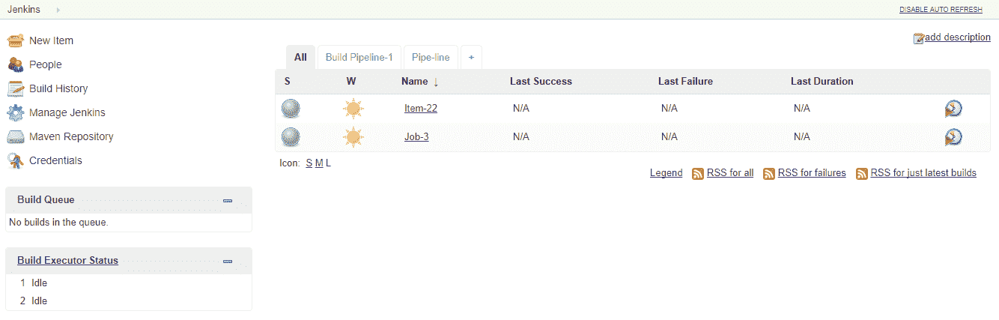

# 第七章：DevOps - 持续集成与交付

在本章中，我们将学习实施 DevOps 核心流程，如源代码仓库、代码审查、工件仓库、持续测试、持续开发、持续集成。如前面关于大数据和云的章节所讨论的，这些过程在每个阶段都非常有价值。我们将重点关注一些流行的工具，如 Git、Jenkins、Maven、Gerrit、Nexus、Selenium 等。

+   **持续集成**（**CI**）

+   **持续交付**（**CD**）

+   Jenkins 工具设置

+   配置管理 - Jenkins

+   源代码管理 - Git

+   构建管理 - Maven

+   源代码审查 - Gerrit

+   仓库管理 - Nexus

+   测试自动化 - Selenium

+   持续部署 - 管道

+   Jenkins 客户端设置

+   Jenkins 安全

+   Jenkins 指标

持续集成和持续交付是确保高质量和及时软件交付的流行且有价值的流程。持续集成是一个集成的软件开发过程，其中多个开发人员遵循敏捷方法，并将其调整为以下最佳实践：

+   确保所有开发代码都受版本控制系统的管理

+   包含适当的代码审查流程

+   代码更改快速集成、测试和构建

+   构建过程集成以运行单元测试并自动化

+   立即处理构建错误，快速调整

+   构建结果和仓库管理的跟踪与指标

+   透明度和用户友好的构建过程

持续交付是扩展持续集成的过程。

+   软件的最新版本随时可用

+   从技术和质量的角度来看，经过测试周期的更改已准备好部署

+   自动化发货和部署过程

持续集成过程如下图所示：


持续集成过程的详细步骤如下：

+   **开发者环境**：开发者在本地工作区使用集成开发环境运行时和安装在 PC 上的构建工具，或基于云的（Web IDE）创建代码更改。他们进行单元级测试、数据验证、代码性能检查等。开发者进行的代码更改被推送到源代码管理系统。

+   典型的持续集成和持续部署周期包括设置 CI/CD 基础设施和流程，如下所示：

    +   源代码版本和仓库管理系统

    +   启动编排管道的过程调度器

    +   管理代码构建和计划测试的构建过程

    +   执行构建的构建节点

    +   在已识别的测试节点上进行自动化测试的测试过程

    +   构建结果工件仓库

    +   用于存储构建结果的工件仓库

    +   测试节点上的场景和验收测试

    +   使用部署工具将应用程序安装到运行时系统

    +   部署在运行时系统上的应用程序的验收测试

质量经理将批准验收测试，以同意部署测试系统。

交付经理将批准应用程序部署到生产环境。

# CI/CD 的最佳实践

+   **使用版本控制**：在协作开发环境中进行同时开发将面临多个挑战：

    +   源代码管理系统在将代码置于版本控制系统下之后，定义了代码的单一真实来源。通过有效地采用合并流程进行主线开发，并在系统中使用回路修复等方式，源代码将是可重现的。Git 是一个流行的源代码管理系统，而 GitHub 作为一种**软件即服务**（**SaaS**）模式是其云版本：

+   **自动化构建**：标准化的自动化构建流程将稳定构建过程，产生可靠的结果。成熟的构建流程必须包含构建描述以及执行构建所需的所有依赖项，并使用标准化的构建工具安装。Jenkins 是最通用的构建调度工具；它提供便捷的用户界面，并且有许多插件集成了大多数流行的持续集成工具。

+   **构建中的测试**：需要执行一些测试，以验证代码的有效性和适应性，超越代码的语法正确性，如下所示：

    +   单元测试直接作用于构建结果

    +   在开发者提交代码前对源代码进行静态检查。可以使用 Git 提交前触发器或 CI 系统来设置门控或非门控检查

    +   新构建应用程序的场景测试，确保其能够安装并启动

    +   代码的功能性能：

单元测试框架在像 JUnit 这样的源代码技术中非常流行。Selenium 框架提供图形用户界面和浏览器行为。

作为构建的一部分，尽早在开发者的工作站上执行这些测试，可以节省时间和精力，避免在开发过程后期发现的错误。

+   **尽早且频繁地提交代码**：在多个项目的分布式开发环境中，每个团队或开发者都打算将自己的代码与主线集成。同时，特性分支也会发生变化并集成到主线中。最佳实践是尽早且快速地集成代码。新更改与主线合并之间的时间延迟越大，产品不稳定的风险、所需时间以及随着主线从基线发展而产生的复杂性也会增加。因此，每个在特性分支上工作的开发者应该每天至少提交一次代码。对于主分支上不活跃的项目，在实施之前必须评估不断变基所需的高昂努力。

+   **每次更改都需要构建**：开发者的更改需要并入主线，但它们有可能会破坏主线的稳定性，影响依赖主线的开发者的工作。

持续集成通过持续构建任何提交的代码变更来解决这个问题。任何构建失败都需要立即处理，因为构建失败会阻塞主分支的整个演进，而且根据提交的频率和此类问题的存在，修复这些问题可能会非常昂贵。通过强制执行分支级别的构建，可以最大限度地减少这些问题。

在 Gerrit 中推送进行审查或在 GitHub 中发起拉取请求是有效的机制，用于提出变更并检查变更质量，通过在推送到主分支之前识别问题，避免返工。

+   **快速解决构建错误**：在每个变更的分支级别进行构建的最佳实践将使相应的开发人员立即解决其代码构建问题，而不是将其传播到主分支。这形成了一个持续的变更-提交-构建-修复循环，发生在每个相应的分支级别。

+   **快速构建**：自动化过程快速返回构建结果和测试应该成为开发者工作流的重要输入；短暂的等待时间有助于提升持续集成过程的整体效率。

这是在将新变更安全地集成到主分支的同时，进行构建、验证和场景测试的平衡行为。有时，可能会出现相互冲突的目标，因此需要在不同级别的接受标准之间取得折衷，考虑到主分支的质量最为重要。标准包括语法正确性、单元测试和针对所做变更的快速场景测试。

+   **生产前运行**：在生产流水线的不同阶段，多个设置和环境会导致错误。这适用于开发者环境、分支级别的构建配置和中央主构建环境。因此，进行场景测试的机器应与主生产系统相似，并具有相当的配置。

手动遵循相同配置是一项艰巨的任务；这正是 DevOps 增值和核心价值主张的体现，并将基础设施设置和配置视为类似于编写代码的过程。所有机器的软件和配置都被定义为源文件，这些文件使得你能够重建相同的系统；我们将在第八章中详细讨论此内容，*DevOps 持续部署*。

+   **构建过程是透明的**：构建状态和最后变更的记录必须对所有人可用，以便确认构建的质量。Gerrit 是一个变更审查工具，可以有效地用来记录和跟踪代码变更、构建状态和相关评论。Jenkins 流程插件为构建团队和开发人员提供了一个完整的端到端概览，涵盖源代码管理工具、构建调度器、测试环境、工件库等相关内容。

+   **自动化部署**：以自动化方式将应用程序安装到运行时系统中，称为部署，并有多种方式可以完成此操作。

    +   自动化场景测试应成为变更接受过程的一部分。这些测试可以通过构建触发，以确保产品质量。

    +   设置多个运行时系统，如 JEE 服务器，以避免单实例瓶颈，序列化测试请求并能够运行并行的测试查询。使用单一系统也会带来重建环境的开销，每次测试用例都需要更改环境，导致性能退化。

    +   使用 Docker 或容器技术按需安装并启动运行时系统，在预定义的状态下运行，之后可以删除（我们将在第九章，*容器、物联网和微服务*中深入讨论容器技术）。

    +   自动化测试用例，由于新评论的验证频率和时间在大多数情况下不可预测，因此安排每天在指定时间执行作业是一种可探索的选项，构建将部署到测试系统，并在成功部署后发送通知。

    +   部署到生产环境是一个手动且经过深思熟虑的决策，确保符合所有质量标准，并确保该更改适合部署到生产环境。如果也能自信地自动化执行，这也是自动化持续部署的最高成就。

持续交付意味着对任何集成的更改都要进行充分验证，以便准备好部署到生产环境。这并不要求每次更改都必须自动部署到生产环境。

# Jenkins 设置

我们将从 Jenkins 开始，因为它是持续集成过程的核心组件。Jenkins 流程工作流如下所示：


参见 Jenkins 首页：[`jenkins.io/index.html`](https://jenkins.io/index.html)，如下所示：


# 安装 Jenkins 的先决条件

Jenkins 安装和配置要求应根据以下参数，参考 Jenkins 首页的建议进行规划：

+   操作系统——Ubuntu/Debian、Red Hat/Fedora/CentOS、openSUSE、FreeBSD、OpenBSD、Gentoo、Windows、macOS X 的 Linux 版本

+   JDK 版本

+   内存

+   硬盘空间

+   Java 容器——Jenkins 的 WAR 文件可以在任何支持 Servlet 的引擎上运行，如 Tomcat 或 Glassfish 应用服务器。

Jenkins 可以根据其用途以不同模式安装：

+   **独立运行**：Jenkins 可以在其自己的进程中独立运行，使用内置的 Web 服务器（Jetty）进行实验和小型项目。

+   **基于 Servlet**：它也可以作为一个 Servlet 框架运行，适用于开发项目。

+   **用于预发布或生产环境的多节点设置**：分布式客户端-服务器设置；建议使用 Jenkins 高级安装程序。

# 独立安装

建议的独立安装就像名字所暗示的那样，是在单台机器上独立完成的（与用于不同任务的多个系统相对）：

1.  独立安装需要在系统上安装 JDK。

1.  下载 `Jenkins.war` 文件

1.  打开命令提示符，并在 `Jenkins.war` 文件的位置运行以下命令：

```
C:>Java -jar Jenkins.war
```


在初始化过程中，将运行几个任务，并在安装过程中出现以下屏幕：

1.  初始屏幕页面将询问插件选项：


1.  插件将根据前述选项中选择的配置安装：


1.  成功安装后，以下管理员凭据创建页面将弹出：


1.  **访问 Jenkins**：成功安装后，可以通过本地计算机的 web 浏览器访问 Jenkins，如下所示：

```
http://localhost:8080
```

1.  Jenkins 仪表板将在此链接处打开：


1.  仪表板中的“管理 Jenkins”选项将提供各种配置各种参数的选项：


1.  仪表板中的“管理插件”选项是一个重要选项，提供了与源代码系统、认证系统、各种开发平台等集成的广泛选择。


在 Servlet 引擎上安装 Jenkins 需要安装 Tomcat 或 Glassfish。


1.  将 `Jenkins.war` 文件复制到 `tomcat` 文件夹中的 web 应用程序文件夹。

1.  从 Tomcat `bin` 目录启动 Tomcat 服务器。

1.  `http://localhost:8080/Jenkins`--在 Tomcat 服务器上访问 Jenkins。

# 在 Ubuntu 上安装 Linux 系统

1.  登录服务器并更新：`sudo apt-get -y update`。

1.  安装 Java：`sudo apt-get install -y default-jdk`。

1.  使用 `wget` 命令从 `Jenkins-ci.org` 站点下载 Ubuntu 版本：`wget http://pkg.jenkins-ci.org/debian-rc/binary/jenkins_2.0_all.deb`。

1.  包安装--`sudodpkg - i Jenkins.zip`。

1.  通过 `sudo apt - get -f install` 解决依赖关系。

1.  在端口 `http://localhost:8080/Jenkins` 上访问 Jenkins。

1.  继续按照前面图示中列出的步骤进行。

1.  要在启动时初始化 Jenkins，请在 `/etc/rc.local` 文件中添加命令 `/etc/init.d/jenkins start`。

# Git（SCM）与 Jenkins 的集成

Git 是最流行的源代码管理系统，提供了广泛的好处，例如：

+   版本控制允许您为不同目的维护代码的多个版本

+   需要一个代码存储库来将所有项目相关的代码放在一个地方

+   用户之间的协作和调试目的的干预

可从 [`git-scm.com/downloads`](https://git-scm.com/downloads) 下载 Git：


提供 Linux、Windows 等多个平台版本，支持桌面和网页版本。

存在多种类型的仓库：

+   在 GitHub 上创建的公共仓库可以让所有人读取访问权限，但写入或提交访问权限仅授予指定的个人或团队。

+   私有仓库允许合作者参与，并且是 GitHub 的付费订阅服务。

+   本地仓库是无需互联网连接的桌面版本。

+   远程仓库是一个基于 Web 的仓库，提供扩展功能，如问题管理和拉取请求。

GitHub 提供选项以同步来自单台计算机或多台计算机的代码更改。

拉取更改将同步来自桌面的代码更改与在线仓库，而克隆选项将创建仓库的全新副本到计算机中。

执行这些任务使我们能够在基于云的 SaaS 系统上维护源代码。

1.  在 GitHub 上创建一个登录帐户。

1.  创建一个项目仓库，用于组织与你的项目相关的代码。


# 将 GitHub 与 Jenkins 集成

要将 GitHub 仓库与 Jenkins 集成，请按照以下步骤操作：

1.  在管理插件中，搜索 Git 插件并安装它，位于筛选器部分。

1.  如果是默认安装，我们可以在已安装标签下找到它，如下所示：


1.  在 Jenkins 重启后，创建新项目时将显示如下界面：


1.  选择一个工作名称，下一屏幕将显示 Git 选项，如下所示，在源代码管理标签下。你可以以类似的方式添加其他 SCM 工具，如 CVS、Subversion 等：


1.  在前面仓库 URL 占位符中输入本地计算机的 Git 仓库地址或一个网页链接，以便将 Git 配置与 Jenkins 集成。

# Maven（构建）工具与 Jenkins 集成

1.  从 [`maven.apache.org/download.cgi`](https://maven.apache.org/download.cgi) 下载 Maven；这是二进制文件的最新版本：


1.  将下载的 Maven 文件提取到一个文件夹中。

1.  打开管理 Jenkins：


1.  选择 Maven 插件，如下所示，并安装它们，不选择重启选项。


1.  监控插件进度，如下所示：


1.  在配置工具下，添加 Maven，并提供仓库位置：


1.  使用 Maven 项目选项创建一个新的项目任务：


1.  构建环境中的 Maven 选项如下所示：


1.  项目创建如下：


# 使用 Jenkins 构建任务

1.  一个简单的应用程序构建并运行该程序：


1.  以下列出了源代码仓库的选项：


1.  我们可以指定需要构建的文件位置，这些文件可以来自源 Git 代码仓库，也可以来自 GitHub 上的 URL：


1.  可以使用多种选项、命令模式和 Maven 等执行构建：


1.  命令行程序可以按如下方式执行：


1.  保存后，可以看到构建选项，历史记录也可用：


1.  可以看到构建进度，并且可以访问仓库，如下所示：


# 源代码审查 - Gerrit

代码审查是软件开发框架中的一个重要功能。像 Gerrit 这样好的协作工具，非常适合且需要在代码审查过程中使用。Gerrit 启动基于拉取的工作流来发起变更请求，其中即使是源代码的评论也会被包括在内，以便通过工作流过程将变更合并到代码仓库中。Gerrit 维护着一个本地仓库，包含镜像的 Git 项目仓库和参考仓库。Gerrit 从主分支创建另一个维护分支，以跟踪对代码的审查；它为提交消息创建一个变更 ID 标识符，用于跟踪代码审查中的每一个变更。

Gerrit 允许进行代码变更比较，审阅者可以给出五个评分中的一个：

+   **+2**: 看起来不错，已批准

+   **+1**: 看起来不错，但需要额外批准

+   **0**: 无评论

+   **-1**: 建议不提交

+   **-2**: 阻止提交


# Gerrit 安装

1.  从[`www.gerritcodereview.com/`](https://www.gerritcodereview.com/)下载 Gerrit。

1.  根据平台选项按照安装说明操作，并通过以下方式访问 Gerrit，在`8080`端口上创建用户和项目：


1.  在 Jenkins 中通过“管理插件”配置 Gerrit：


在第三章中列出的版本控制工具，*DevOps 框架*，例如基于 Web 的代码审查界面 Gerrit，允许在线审查变更，从任何 git 客户端推送变更，然后将其自动合并到主分支；它也可以配置为远程 git 仓库。

Gerrit 的配置包括用户创建，**安全外壳**（**SSH**）设置，用于与 Gerrit 服务器交换数据。配置文件`/etc/gerrit.config`有许多参数，需要根据配置要求进行设置。

# 仓库管理

维护多个构建版本工件是仓库管理的关键特性，而 Nexus 是一个流行的仓库管理器。它可以从[`www.sonatype.org/nexus/downloads/`](http://www.sonatype.org/nexus/downloads/)下载。

安装后，可以通过`http://<nexus host>:8081/nexus`访问：


Nexus 可以通过插件进行 Jenkins 集成配置：


# 使用 Jenkins 进行测试

Jenkins 提供了许多开箱即用的功能和插件来进行测试。网站[`wiki.jenkins.io/display/JENKINS/xUnit+Plugin`](https://wiki.jenkins.io/display/JENKINS/xUnit+Plugin)提供了这些插件：


可用的测试插件列表如下所示：

+   JUnit 本身

+   AUnit

+   MSTest（从 MSTest 插件导入）

+   NUnit（从 NUnit 插件导入）

+   UnitTest++

+   Boost 测试库

+   PHPUnit

+   Free Pascal 单元

+   CppUnit

+   MbUnit

+   Google 测试

+   EmbUnit

+   gtester/glib

+   QTestLib

# 设置单元测试

1.  选择我们已经设置好的项目：


1.  选择构建选项：


1.  选择一个高级选项：


1.  输入`build.xml`的位置：


1.  选择后构建选项，并选择 - `发布 JUnit 测试结果报告`：


1.  在测试`reports.xml`中，输入我们项目中创建报告的文件夹，以便 Jenkins 自动识别运行 JUnit 测试用例后生成的 XML 文件：


我们可以选择构建并深入查看测试结果。

# 自动化测试套件

持续集成是验证构建的过程，用于客观评估其准备好进入下一个阶段的程度；这通过自动化测试实现。因此，构建工件设置为自动测试；Selenium 是最流行的框架。

可以从以下网站下载：


1.  在 Jenkins 下，选择插件管理器中的 Selenium 插件并安装，安装后重启以启动：


1.  配置 selenium 服务器 JAR 文件：


1.  配置我们创建的项目，使其适用于此自动化框架：


1.  在构建过程中，添加选项`SeleniumHQhtmlSuite Run`：


1.  Selenium IDE 将生成 TestSuite，启用 Selenium 测试时，通过启动 selenium 驱动程序并使用 SuiteFile：


# 持续交付 - 构建流水线

持续交付是从软件开发到部署构建一个健壮流水线的过程。


1.  按照以下步骤从“管理插件”安装构建管道插件：


1.  要设置构建管道，点击仪表盘中“All”标签旁边的“+”符号：



1.  选择构建管道视图并为管道选择一个名称：


1.  选择选项和创建的项目：


1.  交付管道视图根据项目每个阶段的状态创建。

# Jenkins 特性

+   客户端-服务器

+   安全性

+   报告

较大的项目需要配置多个机器，而不是在一台机器上进行集中构建。此外，还有对多个不同环境的测试构建要求。使用从属机器可以有效地将负载从主服务器转移。

它们需要通过 TCP/IP 套接字从主机到从属的双向通信链接，只需要从属代理而不是完整的 Jenkins 包或已编译的二进制文件。

1.  要在 Jenkins 中设置从属节点/节点，配置并选择“管理节点”选项，创建一个新节点：


1.  选择名称和“傻瓜从属”选项。


1.  从属节点的详细信息需要提供，然后选择让 Jenkins 将 Windows 从属视为 Windows 服务。需要提供机器的名称节点和登录凭据等详细信息。


1.  从属机器将如以下方式可用；可以配置新作业在此从属机器上运行。


# Jenkins 中的安全性

具有相关权限的用户可以通过安全配置进行设置：

1.  在“管理 Jenkins”下，选择“配置全局安全性”，并选择启用安全选项：


1.  一旦保存选项，将提示您输入管理员用户。


1.  在 Jenkins 管理设置下，选择“管理用户选项”以创建用户，并设置执行作业所需的基于矩阵的安全性授权：

1.  可以安装报告选项、度量选项和报告插件。


1.  有许多可用的度量指标，如构建历史度量插件：

    +   **平均故障时间** (**MTTF**)

    +   **平均恢复时间** (**MTTR**)

    +   构建时间的标准差


1.  可以在“管理插件”中安装，通过选择“构建历史度量插件”，上述度量指标将在作业页面上显示。

1.  要查看图形化表示，请在“管理插件”下使用 Hudson global-build-stats 和 Global Build Stats 插件。设置选项、初始化统计信息、创建新图表选项，所有现有的构建记录将显示出来。

# 摘要

在这一章中，我们学习了实现持续集成和持续部署的流程和工具。

使用仓库管理、代码审查和测试自动化来实现开发、持续集成和持续部署。

在下一章中，我们将讨论将基础设施配置管理作为代码来进行持续部署的话题，使用的工具包括 Chef、Puppet 和 Ansible。同时，我们将讨论使用工具 Splunk 和 Nagios 进行持续监控的过程。
