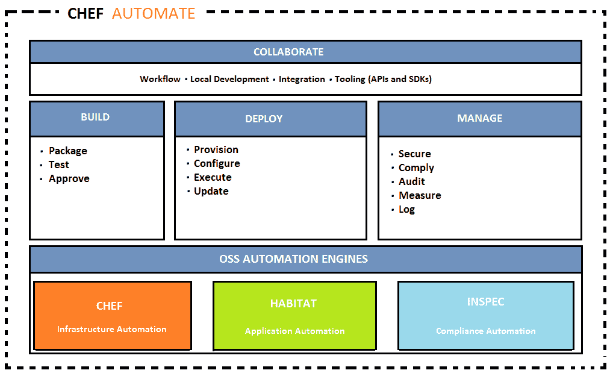

# 第八章：DevOps 持续部署

DevOps 持续部署使得变更可以快速地从开发迁移到生产环境。基础设施和自动化在实现持续部署中起着关键作用。在本章中，我们将学习配置自动化和基础设施自动化（基础设施即代码）的实现，使用的工具包括 Chef 和 Ansible。我们还将讨论使用工具 Splunk 和 Nagios 进行持续监控的过程：

+   持续部署

+   Chef

    +   组件

    +   术语

    +   架构

+   Ansible

    +   组件

    +   术语

    +   架构

+   持续监控

+   Splunk

+   Nagios

正如我们在前几章中讨论的，下面的图示展示了持续集成、持续部署和持续交付的对齐过程。


**持续集成**（**CI**）是将开发、单元测试和构建过程进行持续化处理，而不是分阶段（逐步）的过程。在 CI 过程中，每个开发者将他们的代码更改合并到中央版本控制系统，每次提交都会触发自动化构建。因此，最新的版本始终可用在代码库中，构建出来的可执行文件也来自最新的代码。

**持续交付**（**CD**）是持续集成过程的下一步，旨在通过短周期的测试和更频繁的软件发布，使软件工程能更快速和频繁地交付。自动化测试过程确保软件可以随时可靠地发布。

持续部署是通过减少开发新代码和代码在生产环境中可用之间的时间间隔（也就是“前置时间”）的过程。为了实现这一目标，持续部署依赖于自动化的基础设施，自动化执行各种步骤，确保每次成功的代码集成符合发布标准，最终导致部署，并且实时应用程序会更新为新代码。

传统上，新机器是由管理员和系统工程师根据文档和定制脚本等构建的。通过手动程序（如自定义脚本、黄金镜像配置等）管理基础设施既耗时又容易出错。寻求更快速和成熟部署的组织采用基础设施配置自动化，这意味着像管理软件代码一样管理基础设施，以实现可重复的结果，因此它也被称为**基础设施即代码**。

就像 SDLC 过程一样，基础设施也可以使用类似的工具和流程进行管理，如版本控制、持续集成、代码审查和自动化测试，扩展为使基础设施的配置变更更加强大和自动化。基础设施代码和配置更改会在从开发到 QA 测试系统，再到生产的所有环境中一致地进行测试、共享和推广，更加容易、快速、安全和可靠，并附有详细的变更审计日志。通过基础设施代码作为服务，新机器的配置可以像代码一样编写，并同时设置多个机器。通过利用云的弹性，这种可扩展模型更加高效。采用 DevOps 到基础设施即代码的转换等，不仅仅是简单的基础设施自动化，还能带来以下多种好处：

+   确保无误的自动化脚本是可重复的

+   可在多个服务器上重新部署

+   在出现问题时具有回滚能力

+   可以有效执行基础设施代码的测试标准，如单元测试、功能测试和集成测试

+   由于机器的文档化状态以代码形式维护并保持最新，因此避免了书面文档

+   使开发和运维团队在基础设施配置和供应上进行协作，将基础设施代码作为变更管理的一部分


我们将从流行工具功能和前述图中列出的功能角度讨论持续部署。

# Chef

Chef 是一个突出的配置管理和基础设施自动化平台；它提供了一整套企业级功能，如工作流、可视化和合规性。它支持从开发到生产的基础设施和应用程序的持续部署。基础设施配置自动化作为代码由 Chef 编写、测试、部署和管理，适用于云环境、本地环境或混合环境，并提供全面的 24/7 支持服务。例如，客户端系统、安全补丁可以通过主服务器写入配置作为一组指令，并在多个节点上同时执行。

如下图所示，Chef 平台支持多个环境，如亚马逊 Web 服务（AWS）、Azure、VMware、OpenStack、谷歌云等。Windows、Linux、VMware 等平台也可用。所有流行的持续集成工具，如 Bitbucket、Jenkins、GitHub、CircleCI 等，都支持工作流集成。运行时环境可在 Kubernetes、Docker 和 Swarm 上运行。

# Chef 平台组件

Chef landscape 包括 Chef 的各个元素，如节点、服务器和工作站，以及它们之间的关系，如下图所示。我们将讨论每个组件、术语及其在生态系统中的角色，以使 Chef 客户端能够执行分配的任务。Chef 术语类似于食品准备。食谱是制作菜肴的配方，而配方则是原料。

Chef 的组成部分包括：

+   Chef 服务器

+   Chef 客户端

+   Chef 工作站

+   Chef 仓库

# Chef 服务器

Chef 服务器是用于维护网络中配置数据的中心，存储食谱、将策略应用于节点，并由 Chef 客户端管理每个注册节点的详细元数据。Chef 服务器通过安装在相应节点上的 Chef 客户端提供配置细节，如配方、模板和文件分发。因此，Chef 客户端在其节点上实现配置，减轻了 Chef 服务器的处理任务负担。该模型具有可扩展性，可以在整个组织内一致地应用配置。

# Chef 服务器的特性

具有管理控制台和搜索功能的 Web 启用用户界面。

+   Chef 服务器上的管理控制台是一个基于 Web 的界面，用于管理多个功能，如：

    +   网络中的节点

    +   食谱和配方

    +   分配的角色

    +   数据包——JSON 数据存储，可能包含加密数据

    +   环境详情

    +   索引数据的搜索功能

    +   管理用户账户和 Chef 服务器访问数据

+   搜索功能方便查询任何在 Chef 服务器上索引的数据类型，如节点、角色、平台、环境、数据包等。Apache Solr 搜索引擎是基础搜索引擎，并扩展了所有功能，如精确匹配、通配符、范围搜索和模糊搜索等。可以在食谱、命令行、管理控制台搜索功能等中运行完整的索引搜索，具有不同选项。

+   数据包位于 Chef 服务器上的安全子区域中；它们存储敏感数据，如密码、用户账户数据和其他机密类型的数据。只有通过 Chef 服务器验证的具有有效 SSL 证书的节点才能访问它们。数据包通过 Chef 服务器以其存储在 JSON 格式中的全局变量进行访问。可以通过食谱进行搜索和访问并加载。

+   策略定义了如何在业务和操作需求、流程及生产工作流中实施角色、环境和食谱版本：

    +   角色是基于在组织中执行的特定功能、模式和流程来分配任务的一种方式，例如权限用户或业务用户等。每个节点、Web 或数据库服务器都有独特的属性，并根据角色分配运行列表。当节点要执行任务时，它会将其属性列表与执行该功能所需的属性进行比较。Chef 客户端确保属性和运行列表与服务器上的保持一致。

    +   环境反映了组织的实际需求，例如开发、测试或生产系统，每个环境都维护有对应版本的 cookbook。

    +   Cookbook 维护着特定组织的配置政策。不同版本的 cookbook 会进行版本控制，并维护关联的环境、元数据以及满足不同需求的运行列表；它们被上传到 Chef 服务器，并由 Chef 客户端在配置节点时应用。Cookbook 定义了一个场景，并包含支持该场景所需的一切，例如：

        +   指定使用哪些资源及其顺序的食谱（Recipes）

        +   属性值

        +   文件分发

        +   模板

        +   Chef 扩展，例如自定义资源和库

    +   运行列表（Run-list）包含所有 Chef 配置节点到目标状态所需的信息。它是一个有序的角色和食谱列表，按照执行顺序排列，用于将节点配置到预期的状态。每个节点的运行列表都是定制的，并作为节点对象的一部分存储在 Chef 服务器上。它可以通过 knife 命令或通过工作站上的 Chef 管理控制台进行维护，并上传到 Chef 服务器。

# 节点上的 Chef 客户端

Chef 客户端可以安装在不同类型的节点上——物理节点、虚拟节点、云节点、网络设备等，这些节点都已注册到 Chef 服务器。

+   节点类型：

    +   物理节点是一个活动设备（系统或虚拟机），它连接到一个网络，安装了 Chef 客户端，用于与 Chef 服务器通信。

    +   云节点是托管在外部云环境中的节点，如 AWS、Microsoft Azure OpenStack、Google Compute Engine 或 Rackspace。Knife 配合插件支持外部云服务，并创建实例来部署、配置和维护这些实例。

    +   虚拟节点是一个像软件实现一样运行的系统，不需要直接访问物理机器。

    +   网络节点，如交换机，可以通过 Chef 进行配置，并自动化物理和逻辑以太网链路属性及 VLAN 配置。网络设备的示例包括 Juniper Networks、Arista、Cisco 和 F5。

    +   容器是运行各自配置的虚拟系统，多个容器共享同一操作系统。容器在管理分布式和可扩展的应用程序与服务时非常有效。

+   Chef 客户端：

    +   Chef 客户端执行实际的配置。它定期联系 Chef 服务器，获取最新的 cookbook，并根据 cookbook 指令更新节点的当前状态（如果需要）。这一迭代过程由业务策略强制执行，以确保网络符合预期的目标状态。

    +   Chef 客户端是安装并运行在每个注册到 Chef 服务器上的节点上的本地代理，用于确保节点处于预期状态。Chef 客户端承担大部分计算工作。它通常是虚拟机、容器实例或物理服务器。

    +   Chef 客户端与 Chef 服务器之间的认证通过 RSA 公钥/密钥对进行，针对每个交易请求进行身份验证。Chef 服务器上存储的数据在注册节点身份验证后共享，避免任何未经授权的数据访问。

    +   安装 Chef 客户端后，节点成为基础设施上的计算资源，由 Chef 管理，用于执行如下任务：

        +   将节点注册到 Chef 服务器

        +   认证服务

        +   创建节点对象

        +   与 Chef 服务器同步 cookbook

        +   所需的 cookbook（包括食谱、属性和所有其他依赖项）被编译并加载

        +   根据需求配置节点

        +   异常处理和通知

# Ohai

Ohai 是 Chef 客户端运行的一个工具，用于收集系统配置和度量数据，具有许多内置插件，可以确定系统状态以供 cookbook 使用。Ohai 收集的度量数据包括：

+   操作系统

+   内核

+   主机名

+   完全限定域名

+   虚拟化

+   云服务提供商元数据

+   网络

+   内存

+   磁盘

+   CPU

Ohai 收集的属性会被 Chef 客户端自动使用，以确保这些属性与服务器上的定义保持一致。

# 工作站

工作站使用户能够编写、测试和维护 cookbook，并与 Chef 服务器和节点进行交互。Chef 开发工具包也会安装并配置在工作站上。Chef 开发工具包是一个软件包，包含一组规定的工具，包括 Chef、命令行工具、Test Kitchen、ChefSpec、Berkshelf 等。用户通过工作站进行：

+   开发 cookbook 和测试食谱

+   在不同环境中测试 Chef 代码

+   版本源控制与 Chef 仓库同步

+   定义和配置角色、环境和组织政策

+   强制数据包用于存储关键信息

+   在节点上执行引导操作

Cookbook 是存放文件、模板、食谱、属性、库、定制资源、测试和元数据的存储库。Chef 客户端通过 cookbook 和食谱配置组织中的每个节点，配置的基本单位是 cookbook，它为食谱提供结构。基础设施状态被定义为文件、模板或包，按照所需场景在策略分发中进行配置。

Chef cookbook 使用 Ruby 编程语言，这是一种完整的编程语言，具有语法定义。食谱是配置特定项（如软件包、文件、服务、模板和用户）的简单模式，其中包含定义属性和值的块，这些属性和值与其对应项相匹配。食谱是 cookbook 中的基本配置元素。Chef 食谱是一个文件，它将相关资源组合在一起，例如配置 Web 服务器、数据库服务器或负载均衡器所需的所有内容。食谱存储在 cookbook 中，并且可以依赖于其他食谱。

# Chef 仓库

Chef 仓库，顾名思义，是用于编写、测试和维护 cookbooks 的存储库制品。Chef 仓库像源代码一样进行管理，并与版本控制系统（如 GitHub、Bitbucket 等）同步。Chef 仓库的目录结构可以包含每个 cookbook 的 Chef 仓库，或者将所有 cookbooks 存放在一个 Chef 仓库中。

`knife` 是一个命令接口，用于从工作站与 Chef 服务器通信并上传 cookbooks。为了指定配置细节，使用 `knife.rb` 文件，`knife` 帮助管理：

+   节点引导

+   配方和 cookbooks

+   环境、角色和数据包

+   各种云环境资源

+   Chef 客户端安装到节点

+   Chef 服务器索引数据搜索功能

与 Chef 配合使用的工具和实用程序包称为 **Chef 开发工具包**（**Chef DK**）。它包括与 Chef 交互的命令行工具，例如 `knife` Chef 服务器和 Chef 客户端，以及本地 Chef 代码库（`chef-repo`）。Chef DK 的组件如下：

+   Chef 客户端

+   Chef 和 `knife` 命令行工具

+   Test Kitchen、Cookstyle 和 Foodcritic 作为测试工具

+   使用 InSpec 作为可执行代码的合规性和安全性要求

+   为上传到 Chef 服务器而编写的 cookbooks

+   数据包项的加密和解密使用 Chef-Vault，并使用已注册节点的公钥

+   Cookbooks 依赖管理工具

+   工作流工具 Chef

+   单元测试框架 Chef Specto 在本地测试资源

+   用于编写干净的 cookbooks 风格检查的 Rubocop 基于工具 Cookstyle

+   Chef Automate 服务器上的持续交付工作流，还提供命令行工具来设置和执行

+   用于配方代码静态分析的工具是 Foodcritic

+   它用于跨平台测试 cookbooks，集成测试框架工具是 Test Kitchen

+   为了快速进行 cookbook 测试和容器开发，`kitchen-dokken` 是一个带有驱动程序、传输工具和提供者的 `test-kitchen` 插件，用于在 Docker 和 Chef 中使用

+   用于 Vagrant 的 Kitchen 驱动程序是 `` `kitchen-vagrant` ``

+   人们在同一个 `chef-repo` 和 Chef 服务器中协作，`knife` 工作流插件是 `knife-spork`

+   Chef 的首选语言是 Ruby

配方是资源的集合，通过资源名称、属性值对和操作等模式定义。它是读取并以可预测的方式执行的基本配置元素，并用 Ruby 编程语言编写。

一些属性如下：

+   包括配置系统所需的所有内容

+   存储在 cookbook 中

+   要使用 Chef 客户端，必须将其添加到运行列表中

+   它按照运行列表中列出的相同顺序执行

+   Chef 客户端仅在指示时运行配方

+   可以包含在另一个配方中

+   可能会读取数据包的内容（加密的数据包）

+   可能会输入搜索查询的结果

+   可能依赖于其他配方

+   通过标记节点来促进任意分组的创建

+   如果配方是常量，则重复执行时不会发生任何变化。

配方 DSL 是一种 Ruby DSL，用于声明资源，主要来自配方内。它还有助于确保配方按预期方式与节点（和节点属性）交互。大多数配方 DSL 方法会找到特定的参数，指导 Chef 客户端根据节点参数采取相应的操作。

资源是一种配置策略声明，说明：

+   描述所需配置项的期望状态

+   声明所需的步骤，以使项达到期望状态

+   资源类型被指定，例如包、模板或服务

+   列出额外的资源属性

+   被分组为配方，描述工作配置

Chef 具有内置资源，覆盖常见平台上的常见操作，并且可以构建以处理任何定制的情况。

通过不同版本的烹饪书，管理多个生产、预发布、开发/测试环境。

烹饪书模板资源用于添加到配方中，以动态生成静态文本文件。

为了管理配置文件，使用 **嵌入式 Ruby**（**ERB**）模板。

烹饪书/模板目录包含带有 Ruby 表达式和语句的 ERB 模板文件。

烹饪书按照标准一致编写，并进行相应的测试。

通过单元和集成测试，验证烹饪书配方，测试代码质量也叫做 **语法测试**。

Test Kitchen、ChefSpec、Foodcritic 等是用于测试 Chef 配方的工具。

属性文件的执行顺序与在烹饪书中定义的顺序相同。

Chef 基于 Ruby 构建，它是一个轻量级的**领域特定语言**（**DSL**），具有内建的分类法，用于满足组织的定制需求。

为了管理环境、烹饪书、数据包，并为用户和组配置基于角色的访问，属性、运行列表、角色等，Chef 服务器用户界面是 Chef 管理控制台。

Chef 超市是一个社区平台，用于共享和管理。任何 Chef 用户或组织都可以使用烹饪书。

# Chef 的扩展功能

它是一个强大的自动化平台，将基础设施转化为在云端、本地或混合环境中运行的代码。通过 Chef Automate，基础设施可以在网络中跨组织规模进行配置、部署和管理。Chef Automate 的核心部分包括 Chef、Habitat 和 InSpec。

以下图片显示了三个开源、强大的引擎：



Chef 是基础设施自动化的核心引擎。Habitat 是一个应用程序自动化工具，模拟容器和微服务的概念。InSpec 通过指定可执行代码来确保合规性和安全性要求。

# Habitat

Habitat 提供了一种预定义的应用程序自动化打包格式；Habitat 管理员和应用程序依赖项被打包并作为一个单元进行部署。Habitat 包格式定义了如何结构化，它们是隔离的、不可变执行的，适用于任何类型的运行时环境，如容器、裸金属或 PaaS。Habitat 管理员管理包的同级关系、升级策略和安全政策，这些都可以审计。

# InSpec

InSpec 是一个开源工具，用于测试是否符合安全策略。它是一个框架，用于指定合规性、安全性和政策要求，以便自动测试基础设施中的任何节点。合规性可以通过代码表示，并集成到部署管道中：

+   使用 Compliance DSL，InSpec 使你能够快速轻松地编写审计规则。

+   InSpec 检查基础设施节点，以便在本地或远程运行测试。

+   安全性、合规性或政策问题的不合规情况会被记录。

InSpec 审计资源框架与 Chef Compliance 完全兼容。

它可以在多个平台上运行，使用 SSH 等远程命令或使用 Docker API，除了通过 API 确保合规性外，它还可以访问数据库、检查并限制服务或协议的使用，以及虚拟机的配置。例如，可以限制客户端或服务器机器上的 Telnetd 或 FTP 服务。

持续部署全栈管道是 Chef Automate。它包括自动化的合规性和安全性测试。该工作流提供了应用程序和基础设施的可见性，同时在开发和生产过程中的更改会传播整个管道。

Chef 高级架构组件包括 Chef DK、Chef Server 和客户端：


Chef 服务器扮演多个角色，充当配置数据的中心。它存储 cookbook，并根据基础设施应用政策到系统，按照每个系统定义的元数据进行操作。

Cookbook 开发工作流由 Chef 开发工具包规定，如下所示：

+   骨架 cookbook 创建：一个包含 Chef 开发工具包标准文件的 cookbook，Berkshelf 是帮助管理 cookbook 和相关依赖项的包管理器。

+   使用 Test Kitchen 创建虚拟机环境：该环境用于开发包含位置详细信息的 cookbook，以便在开发过程中进行自动化测试和调试。

+   准备和调试 cookbook 的配方：一个迭代过程，用于开发和测试 cookbook、修复 bug 并进行测试，直到它们达到预期目标。Cookbook 可以使用任何文本编辑器编写，例如 Sublime Text、vim、TextMate、EditPad 等。

+   执行验收测试：这些测试是在完整的 Chef 服务器上进行的，使用接近生产环境的环境，而不是开发环境。

+   通过所有验收测试的 cookbooks 以期望的方式部署到生产环境。

# Chef Automate 工作流

Chef Automate 管道是基础设施和应用程序的全栈连续交付方法。它为任何应用程序的安全部署提供支持，支持高速度的变更，并与基础设施变更相关联。

Chef Automate 管道质量门控自动将开发者的工作站中的变更从部署推送到生产环境。提议的变更经过团队审批后，接受测试通过并发布到相应的工件中进行生产交付。

此图显示了 Chef 代码的开发、测试和部署工作流：


工件在验收阶段之后通过管道，进入质量保证的联合阶段、彩排（预生产）阶段，并最终交付到生产环境。

Chef Automate 图形用户界面提供了操作和工作流事件的视图。其数据仓库收集来自 Chef、Habitat、Automate 工作流和合规性的输入。仪表盘跟踪每个变更状态通过管道，并且可以使用查询语言自定义仪表盘。


# 合规性

可以通过创建自定义报告，使用 InSpec 中的合规规则，识别合规问题、安全风险和过时的软件。内置的配置文件包含针对安全框架（如 **Centre for Internet Security**（**CIS**）基准）的预定义规则集等。合规报告可以是独立的，也可以是集成的。同时，Chef Automate 服务器提供高可用性和容错能力，提供有关基础设施的实时数据，并确保一致的搜索结果。

Chef Compliance 服务器促进了基础设施合规性的集中管理，执行以下任务：

+   创建和管理规则配置文件

+   根据组织的安全管理生命周期定期测试节点

+   扫描完全远程执行；节点上不会安装任何足迹

+   合规报告确保基础设施满足安全要求

+   节点合规性审计统计信息已提供


Chef 合规报告详细列出了多个参数，如按节点划分的补丁和合规性，以下为示例：


来自 Automate 的 Chef 合规报告视图。

Chef Automate 提供分析合规报告的能力，可以根据节点、节点平台、环境或配置文件来调取数据，并深入挖掘相关信息。

Chef Automate 合规控制状态报告提供了关于主要、次要、关键、补丁级别等的全面仪表盘。

# Ansible

Ansible 是一个流行且强大的自动化框架，专为持续交付而设计，其特点和优点在以下主题中列出：

# 突出功能

Ansible 提供以下功能：

+   **现代化**

    +   自动化现有的部署过程

    +   管理遗留系统和流程，像 DevOps 一样更新

+   **迁移**

    +   定义应用一次并可在任何地方重新部署

+   **DevOps**

    +   模拟所有内容，持续部署

# Ansible 的优点

使用 Ansible 提供了以下列出的多个优势：

+   **简单易用**

    +   不需要特殊的编码技能

    +   任务按顺序执行

    +   快速提高生产力

    +   自动化易于理解

+   **功能强大**

    +   应用部署

    +   配置管理

    +   工作流编排

    +   应用生命周期编排

+   **无代理**

    +   无代理架构

    +   使用 OpenSSH 和 WinRM

    +   无需代理进行利用或更新

    +   更高效且更安全

Ansible 是一个多维度的 IT 自动化引擎，它简化了云资源配置、服务间编排、配置管理、应用部署及其他许多 IT 功能的自动化。

Ansible 通过规定系统间的相互关系来模拟 IT 基础设施，支持多层级的部署，而非单独管理每个系统。

如前所述，Ansible 没有客户端代理，也不需要额外的自定义安全基础设施。通过使用一种称为 YAML 的普通英语语言描述自动化任务，并以 Ansible 剧本的形式，使得部署非常简单。

Ansible 架构如下所示：


# Ansible 术语、关键概念、工作流和使用方法

Ansible Tower 是一个基于 Web 的企业自动化框架解决方案，旨在成为控制、保护和管理 Ansible 环境的中心，提供用户界面和 RESTful API。它提供以下丰富的功能：

+   访问控制基于角色，以确保环境的安全，并有效管理——允许共享 SSH 凭据但不传输

+   通过一键部署访问，即使是非特权用户也可以通过即时访问安全地部署整个应用

+   确保完整的审计和合规性，因为所有 Ansible 自动化任务都集中记录

+   拥有各种云源的库存，可以通过图形界面管理或同步

+   它基于强大的 REST API，能够与 LDAP 集成，并记录所有任务

+   可与持续集成工具 Jenkins 轻松集成，提供命令行工具选项

+   支持通过配置回调来进行自动扩展拓扑

+   Ansible Tower 使用 Ansible 剧本进行安装


# CMDB

Ansible **配置管理数据库**（**CMDB**）在数据库中维护企业的所有配置信息，并支持多种格式的云创建选项，适用于不同的供应商。


# 剧本

剧本是用 YAML 编写的配置程序，用于自动化系统。Ansible 能够精细地编排多个基础设施拓扑实例，并对许多机器进行非常详细的控制。Ansible 的编排方法是通过简单的 YAML 语法或功能来管理精细调度的自动化代码。

Ansible 剧本描述了一项策略，以便在远程系统上执行配置和部署，强制执行一般的 IT 流程遵循步骤。

一个简单的类比是，主机库存是原材料，说明书是剧本，Ansible 模块是车间里的工具。

要管理部署到远程机器的配置，可以在基本层面使用剧本（playbook）。在更高级的层面，它们可以控制多层次的滚动更新，涉及到与监控服务器和负载均衡器的交互，并将操作委托给其他主机。

剧本是用一种基本的文本语言开发的，旨在便于人类阅读。剧本和文件的组织可以有多种方式。

一个简单的剧本示例**：**

```
- hosts: webservers 
serial: 6 # update 6 machines at a time 
roles: 
- common 
- webapp 
- hosts: content_servers 
roles: 
- common 
- content 
```


# 模块

Ansible 模块可以控制系统资源，如服务、软件包或文件，用于处理和执行系统命令。这些资源模块由 Ansible 推送到节点，配置它们为所需的系统状态。这些 Ansible 模块通过 SSH（安全外壳）在目标节点上执行，任务完成后会被移除。模块库默认随多个模块一起提供，这些模块可以通过剧本或直接在远程主机上执行。模块可以驻留在任何机器上，不需要维护服务器、守护进程或数据库的概念。模块和库是可定制的，通常使用任何终端程序和文本编辑器创建，并通过版本控制系统来有效地跟踪内容的变化。


# 库存

Ansible 库存是一个资源列表：

+   主机和组

+   主机变量

+   组变量

+   组和组变量

+   默认组

+   拆分组和主机以及特定数据

+   库存行为参数列表

+   非 SSH 连接类型

Ansible 通过库存列表，能够同时在多个系统上操作基础设施。动态库存机制允许多个库存文件通过库存插件灵活且可定制。库存列表可以位于默认位置，或者从动态或云源（如 EC2、Rackspace、OpenStack 等）指定库存文件的位置，支持不同格式。

下面是一个纯文本库存文件的示例：

```
[webservers] 
www1.example.com 
www2.example.com  
[dbservers] 
db0.example.com 
db1.example.com 
```


# 插件

Ansible 的核心功能通过一系列便捷的插件得到增强，并且可以用 JSON（Ruby、Python、Bash 等）进行自定义。插件可以连接到任何数据源，扩展 SSH 以外的其他传输连接类型，回调日志，甚至增加新的服务器端行为。

# Ansible Tower

提供多个功能，例如：

+   可以连接 LDAP、AD、SAML 和其他目录

+   基于角色的访问控制引擎

+   无暴露存储的凭据

+   对首次使用者友好

+   启用智能搜索的信息查找

+   在运行时配置自动化

+   基于 REST API 的与流程和工具的集成

+   扩展容量的 Tower 集群

Ansible Tower 可以调用多 playbook 工作流，链接任意数量的 playbook，使用不同的清单，以不同用户身份运行，批量运行，或使用不同的凭证。

Ansible Tower 工作流促进了许多复杂操作，可以构建工作流来配置机器、应用系统的基本配置，并由不同团队维护不同的 playbook 来部署应用程序。可以为 CI/CD 构建工作流，构建一个应用程序，将其部署到测试环境，运行测试，并根据测试结果自动提升应用程序。Ansible Tower 直观的工作流编辑器可以轻松地将不同的 playbook 设为备用，在先前的工作流 playbook 成功或失败时进行替代执行。

一个典型的工作流可能如下所示，它可以快速在多个系统上有效使用，而不会将其基础设施下线。为了实现持续部署，自动化 QA 对成熟到此水平至关重要：

+   脚本自动化以部署本地开发虚拟机

+   CI 系统，如 Jenkins，每次代码更改时部署到暂存环境

+   部署作业执行构建时的测试脚本，通过每次部署的 pass/fail 结果

+   在部署作业成功后，同一个 playbook 会对生产环境清单进行运行

Ansible Tower 工作流带来了以下功能：

+   作业调度

+   内置通知，通知团队

+   稳定的 API 可与现有工具和流程连接

+   新的工作流以建模整个过程


Ansible Tower 仪表板（参见图片）提供以下功能：

+   仪表板和实时自动化更新

+   图形化库存管理

+   集成的 RBAC 和凭据管理

# Ansible Vault

Ansible Vault 是一个将敏感数据以加密形式存储的功能，例如密码或密钥，而不是将其作为纯文本保存在角色或 playbook 中。这些 Vault 文件可以放在源代码管理中，或者分发到多个位置。数据文件，如 Ansible 任务、处理程序、任意文件，甚至二进制文件也可以使用 Vault 加密。这些文件在目标主机上解密。

# Ansible Galaxy

Ansible Galaxy 是一个开源网站，旨在为社区提供信息，并协作构建 IT 自动化解决方案，汇聚管理员和开发者。网站提供了预配置的角色，可以通过 Galaxy 搜索索引下载并快速启动自动化项目。这些角色也可以与 GitHub 账户一起使用。

# 使用 Ansible 的测试策略

尽管测试是一个非常组织化和站点特定的概念，但 Ansible 集成测试与 Ansible playbook 一起设计为一个有序的、快速失败的系统。它通过基于推送的机制，方便地将测试嵌入到 Ansible playbook 中。

Ansible playbook 是系统的期望状态模型，它将确保声明的事项，如要启动的服务和已安装的软件包，符合声明性声明。Ansible 是一个基于命令的系统，处理未处理的错误时，主机会立即失败并防止该主机进一步配置，并在 Ansible 执行结束时以摘要形式显示它们。Ansible 是一个多层次的编排系统，可以将测试嵌入到 playbook 执行中，作为任务或角色。

在工作流中进行基础设施集成测试的应用程序测试，将有效检查代码质量和性能，确保其在进入生产系统之前得到验证。由于是基于推送的，工作流中的检查和平衡机制，甚至升级，都很容易在本地主机或测试服务器上维护。

# 监控

企业监控是一个主要活动，它将监控开发里程碑、应用日志、服务器健康状况、操作、基础设施、漏洞、部署和用户活动进行分类。这些通过以下方式完成：

+   收集和关键信息

+   成熟的监控工具

+   避免基于不确定性做出判断和决策

+   参与式监控与评估

+   选择并使用正确的指标

+   在业务背景下解读指标结果

+   实时数据收集

+   管理数据和信息

开发里程碑：监控开发里程碑是衡量 DevOps 采纳策略是否有效的指标，通过深入了解实际过程和团队的表现来进行评估。一些度量标准包括冲刺范围变化、现场修复的 bug 数量、以及承诺与交付功能的比例。这些指标驱动团队效率和按时完成任务的遵守情况，此监控作为敏捷插件集成于问题追踪中。

代码漏洞：监控应用程序代码中的漏洞，列出不安全编码实践引入的顶层代码弱点。这些可以通过定期进行代码审查或更改第三方依赖关系等方式加以解决。

部署：部署监控是配置构建服务器，使其在过程中内建一些监控，通知团队。具有通知功能的持续集成服务器与聊天服务器通信，迅速提醒团队构建和部署失败。

应用日志输出：如果服务分布式部署，应计划将应用日志输出到集中式日志记录，以便充分利用，实时提供错误和异常的价值。能够以可搜索的格式追踪错误代码生成的通知，在生产之前带来收益。

服务器健康：监控可用资源的正常运行时间和性能，包括停机或过度利用的服务器。入侵检测和健康监控系统与同一通知管道集成，将提供额外的价值。

活动监控：用户活动监控既包括功能开发，也包括基础设施扩展。同时监控开发里程碑和数据量。

集中存储应用日志、用户活动监控、项目历史等合并日志数据，为检测和分析提供价值，能够在全球范围内关联不同的日志源，以了解应用和项目的状态。

# Splunk

Splunk 是一个流行的应用监控工具，可帮助实时监控由 DevOps 驱动的应用交付，支持持续交付或持续集成，帮助快速从概念转向生产。Splunk 企业版通过提升速度和质量，帮助提高应用交付对业务的影响。


Splunk 通过以下优势提升代码质量：

+   在客户看到问题之前解决代码问题。

+   更快速地检测和修复与生产相关的问题。

+   可以通过客观指标确保代码正常运行并满足质量服务水平协议（SLA）。

Splunk 是一个平台，能够捕捉并记录客户、机器数据、用户、事务、应用、服务器、网络和移动设备的所有活动和行为。

Splunk 平台通过集成从应用开发到测试再到生产监控的实时洞察，增强了其业务影响力。它提供了跨所有交付生命周期阶段的统一视图，而非离散的发布组件。

为业务和 DevOps 领导者提供实时可见的与业务相关的数据，包括应用性能、使用情况、收入系统、购物车履行和注册数据，帮助更好地规划库存、报告并改善客户体验。

支持开发生命周期集成和跨多种支持的阶段及应用的可视化：

支持操作生命周期的集成和跨多种支持的阶段及应用的可视化。使用分析可以更快地交付应用：

+   跨每个 DevOps 交付工具链组件实现端到端的可见性

+   在应用交付生命周期中，相关的洞察可以更快迭代

+   测量和基准化发布贡献，提升 DevOps 团队效率

Splunk 通过为业务领导者提供反馈循环，帮助组织评估代码更改对客户的实际影响。持续的互动有助于建立关于机器行为和深入资产模型的更多智能。

这些好处反映了应用交付对业务的影响：

+   通过将业务指标与代码更改相关联，获得新的业务洞察

+   通过交付表现更好的代码提升用户体验

+   提供更安全、更合规的代码有助于提升声誉

# Nagios 基础设施监控工具

有多个 Nagios 开源工具的变体，用于监控特定操作系统上每个细分领域的关键基础设施组件：

+   网络监控软件

+   网络流量监控

+   服务器（Linux、Windows）监控

+   应用监控工具

+   Web 应用监控

+   监控核心引擎和基础 Web 界面

+   Nagios 核心插件包及附加组件

+   Nagios 日志服务器安全威胁与审计系统

Nagios 有助于监控网络中的问题，如过载的数据链路、网络连接、路由器、交换机、由于服务器过载或崩溃造成的问题等。

Nagios 可以通过多种可视化方式和报告提供度量结果，以监控网络中每个节点的可用性、运行时间和响应时间，并支持基于代理和无代理的监控。

使用 Nagios 进行有效的应用监控能够使组织快速发现应用程序、服务或进程的问题，并采取纠正措施，以防止应用用户的停机。

Nagios 应用程序和应用状态监控工具扩展到 Windows 应用程序、Linux 应用程序、Unix 应用程序和 Web 应用程序。它拥有一个活跃的社区协作网络。

路由器监控功能提供了诸如在机器无响应时立即通知、通过检测网络中断和协议故障提前预警、提高服务器、服务和应用程序的可用性等好处。

使用 Nagios 进行 Windows 监控可以提高服务器、服务和应用程序的可用性，快速检测网络中断、服务失败、进程故障、批处理任务和协议故障等问题。系统度量、事件日志、应用程序（如 IIS、Exchange 等）、服务（如 Active Directory、DHCP、服务状态、进程状态、性能计数器等）等广泛的指标将被收集。

# Nagios——企业级服务器和网络监控软件

内置的高级功能包括：

+   提供全面仪表板，集成概览源、检查、网络流量数据等

+   通过安全性和可靠性网络分析仪的警报，检测可疑的网络活动。

+   提供网络流量、带宽、整体网络健康状况等的深度洞察与分析选项，并具有先进的可视化功能。

+   监控特定应用的网络使用情况，提供自定义应用监控、自定义查询、视图和报告。

+   通过专门视图展示的历史网络流量数据与网络流量信息的子集。

+   异常活动警报与自动警报系统示例，如带宽使用超过指定阈值。

+   集成的网络分析仪服务器负载与硬盘空间可用性度量

# 集成的网络分析、监控和带宽仪表盘。

Nagios 仪表盘提供多种监控选项，如源组、服务器 CPU、磁盘使用情况等，可以根据业务需求扩展和自定义更多选择。

# 总结

在下一章中，我们将讨论可视化的高级话题、多个供应商提供的容器、编排选项、物联网、微服务等。
