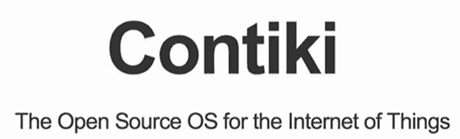
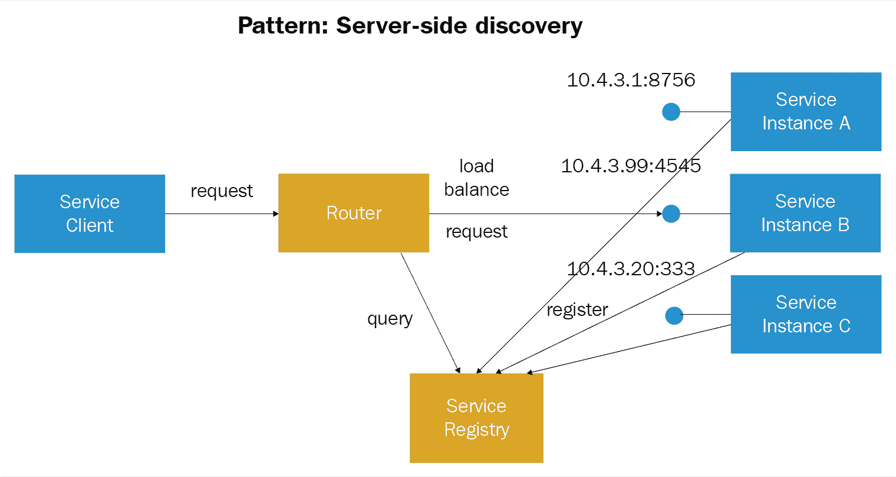

# 容器、物联网与微服务

在本章中，我们将学习容器、虚拟化、Kubernetes、物联网、微服务等概念。

+   虚拟化：

    +   半虚拟化

    +   基于容器的虚拟化

+   容器简介：

    +   容器类型

    +   Docker

    +   Java 容器服务

    +   亚马逊容器服务

    +   关键容器服务

    +   Google 容器服务

+   容器编排：

    +   Kubernetes

    +   Docker Swarm

    +   Mesosphere

+   物联网

+   微服务

# 虚拟化

这是一种逻辑上将大型计算机系统划分的方式，使多个应用程序能够同时并行运行。裸机应用无法跟上资源如服务器处理能力和容量改进的进步。这为设计**虚拟机**（**VMs**）铺平了道路，通过在物理服务器上运行专门的软件来仿真一种底层硬件系统。

同一物理服务器可以承载多个虚拟机，每个虚拟机都可以运行不同的操作系统。每个虚拟机都运行一个独特的操作系统以及它支持的二进制文件/库和应用程序。虚拟机可能会非常大，达到几个 GB。服务器虚拟化的好处包括将应用程序整合到单一系统中，减少服务器占地空间，加快服务器配置速度，改善灾难恢复和节省成本。

# 虚拟机管理程序

虚拟机管理程序是创建并运行虚拟机的软件、固件或硬件，也称为虚拟机监控器。它是操作系统和硬件之间的一层，用于虚拟化服务器。

虚拟机管理程序（Hypervisor）创建虚拟环境以承载客户机虚拟机（VM）。它监管客户机系统，并根据需要分配资源。虚拟机管理程序仿真主机操作系统上的操作，并在物理机和虚拟机之间为虚拟机提供虚拟化服务：

随着云计算的迅速发展，虚拟化技术变得越来越流行，使用像 Xen、VMware Player、KVM 等虚拟机管理程序，并在普通处理器中集成硬件支持，如 Intel VT 和 AMD-V。

# 虚拟化类型

虚拟化类型根据它如何模拟硬件以支持客户操作系统，并仿真客户操作环境进行分类。

主要有三种虚拟化类型：

+   仿真

+   半虚拟化

+   基于容器的虚拟化

# 仿真

模拟是完全的虚拟化，它通过软件在虚拟机中完全运行操作系统内核。这种类型的虚拟机管理程序被称为*类型 2 虚拟机管理程序*，它安装在主机操作系统上方，将来宾操作系统内核代码转换为软件指令。没有硬件的参与，翻译完全在软件层进行。通过模拟支持底层环境的任何操作系统，然而，由于额外的系统资源开销，与其他虚拟化类型相比，性能有所下降。

以下示意图展示了一些示例，包括 VMware Player、VirtualBox、QEMU、Bochs、Parallels 等：

# 半虚拟化

半虚拟化，也称为*类型 1 虚拟机管理程序*，直接运行在裸金属硬件上，为运行在其上的虚拟机提供虚拟化服务。它支持操作系统、虚拟化硬件和裸金属硬件之间的协作，以实现最佳性能。这些虚拟机管理程序不需要大量资源，通常可以在小型系统上运行。

以下是一些示例，包括 Xen、KVM 等：

# 基于容器的虚拟化

基于容器的虚拟化也称为操作系统级虚拟化；在单个操作系统内核中，它支持多个隔离环境的执行。这个隔离的虚拟执行环境称为容器管理，其中包含一组进程。它提供了高性能和动态资源管理等特点和优势：

# 容器

IT 中容器的概念与运输行业中容器的概念相同。容器的基本目的是从源点到目的地运送物品。

类比地，IT 中的容器在基本用途上起着将软件从一台服务器安全迁移到另一台服务器的作用。将应用程序从开发服务器迁移到 QA（测试）服务器，再到生产服务器，通常涉及多个复杂问题，如准备基础设施环境检查清单、验证编译器、库、运行时依赖关系等。容器的概念确保它将所需的生态系统一同携带，以便应用程序能够从一个裸金属系统运行到另一个裸金属系统。从这个意义上来说，容器是自给自足的，具备所有必要的组件，并且为应用程序提供了可以在任何服务器上运行的环境。容器镜像是一个独立的可执行包，它抽象了应用层的代码和依赖项；它们占用较少的空间，并在分配的资源内运行。

容器是一种逻辑打包机制，将应用程序与其实际运行的底层环境进行抽象。基于容器的应用程序由于解耦的特性，可以轻松且一致地在各种目标环境中部署，从私有数据中心到公共云，或个人笔记本电脑。容器化将角色、责任和关注点分离；这使得开发人员可以专注于应用程序逻辑和依赖关系。IT 运维团队可以在不深入了解特定软件版本和配置的情况下，专注于纯粹的部署和管理：

容器的特点使其成为一个非常受欢迎的选择：

+   **轻量级**：这些容器使用更少的资源并能立即启动；多个容器可以共享操作系统内核，使用更少的资源。它们共享公共文件，镜像是从文件系统层构建的，以最小化磁盘消耗并加快镜像下线速度。

+   **互操作性**：容器应基于开放标准运行，并能在不同平台之间移植，包括 Linux 发行版（Debian、Ubuntu 和 CentOs）、虚拟机和 Windows。

+   **安全性**：容器通过将应用程序与底层基础设施隔离和分离，提供了较高的安全性。与应用程序相关的问题应仅限于容器内，既不会影响其他应用程序，也不会影响整个机器。

多租户：容器通过独特的挂载进程共享公共内核（系统资源）。对于每个容器，共享的组件是可写的，而它们则具有只读访问权限。由于这种共享概念，容器带来了以下好处：

+   异常轻量

+   快速启动时间

+   在各种云部署中的可移植性，包括公有云、私有云等

+   通过快速组装（打包）带有依赖关系的应用程序，开发和测试阶段得以加速

+   管理工作量减少，相比于管理多个服务器，管理单个系统的工作量更小，打补丁和升级的工作量也降低

+   客户操作系统和宿主操作系统应兼容，因此两者应匹配，如 Linux，不能在 Windows 上运行，反之亦然：

+   **容器安全性**：Linux 内核中的命名空间特性促成了容器概念的创建。为全局命名空间创建了独立的实例；其工作原理是，为每个进程，容器添加一个唯一的 ID，并且每个系统调用时，都添加新的访问控制检查。这些作为隔离的容器，其中外部对象既无法访问也无法查看容器内运行的进程。尽管共享底层内核，每个容器都被单独对待；例如，每个容器的根用户仅限于各自容器，增强了安全性。

+   **容器管理**：公共内核在多个容器之间具有完全的可见性，因此必须限制资源分配给容器。这是通过 Linux **控制组**（**cgroups**）子系统进行资源分配和调度实现的。容器虚拟化是通过将进程分组来管理它们的总体资源消耗，从而限制内存和 CPU 消耗。用于限制 Linux 容器资源分配的管理工具包括 LXC、LXD、Linux-VServer、OpenVZ、Docker、systemd-nspawn、lmctfy、Warden 等。

+   **可扩展性**：集群管理基础设施支持可扩展性，能够根据资源需求和可用性在集群中安装、操作并调度容器化应用程序。它支持从单个实例扩展到多个实例的能力，并且在管理应用程序、批处理作业或微服务时无需额外的复杂性，抽象了基础设施的复杂性。

+   **任务定义**：任务通过声明性 JSON 模板定义，称为**任务定义**。任务所需的多个容器在任务定义中指定，包括 Docker 仓库/镜像、CPU、内存和共享数据卷。容器之间的链接方式可以作为一个单一的任务定义文件的一部分，注册到服务中。应用程序规范的版本控制也是任务定义的一部分。

+   **编程控制**：容器服务提供 API，用于集成和扩展服务，如集群的创建和删除、Docker 容器的注册和注销，包括启动和终止任务，并提供有关集群状态和其实例的详细信息。

+   **调度**：应用程序、批处理作业和服务通过调度器进行管理，按照指定的方式运行。调度器根据可用性要求和资源需求（如内存或 CPU）将容器放置到集群中。提供自定义调度器的配置，并集成第三方调度器、容器管理和编排支持与开源项目。

+   **容器自动恢复**：容器自动恢复不健康的容器，以确保以所需数量的容器支持应用程序。

+   **容器部署**：通过上传更新版的应用任务定义，调度器会自动停止旧版本的容器，并启动新版本的容器。通过方便的注册和注销容器，可以轻松地将容器更新为新版本。

+   **负载均衡**：通过**弹性负载均衡器**（**ELB**）分配流量到容器中，可以在任务定义中指定将容器添加到 ELB 或从 ELB 中移除容器。在任务定义中，动态端口分配会在容器调度时为其提供未使用的端口；要共享多个服务，基于路径的 ELB 路由也是一种选择。

+   **本地开发**：Docker Compose 是一个开源工具，用于定义和运行多容器应用程序；这可以扩展到工作机器和生产服务器。

+   **监控**：集群和容器运行任务，按任务定义、服务或集群分组的 CPU 和内存利用率的平均值和汇总值，提供设置警报的功能，以便在容器需要扩展或缩减时发出警告。

+   **日志记录**：捕获代理日志、API 调用和 Docker 日志的详细信息，用于问题诊断，包括 API 调用的时间、API 调用源 IP 地址、请求参数、响应元素、安全分析、合规性、审计和资源变更跟踪。

+   **仓库支持**：容器服务支持第三方、私有 Docker 注册表或 Docker hub 镜像仓库访问，以检索适当的镜像。

+   **安全性**：内置功能可以获得对角色和访问权限的可见性，在任务级别管理实例角色和任务角色，并通过最小权限策略进行分离。

如我们所见，容器是标准化的软件开发单元，涵盖了作为代码的所有内容，包括运行时、系统工具和系统库，以便软件应用程序运行。镜像是一个只读模板，用于创建容器。应用组件必须被架构化以便在容器中部署和运行。

容器在数字技术中变得越来越流行，并且被许多供应商提供。Docker 是一个流行的容器选择，因此其他供应商自然也会采用和支持它：

+   Docker

+   Java 容器服务

+   亚马逊

+   Pivotal

+   Azure

+   谷歌

+   IBM Bluemix 容器服务

# Docker 容器

Docker 容器平台分为**社区版**（**CE**）和**企业版**（**EE**），并为各种基础设施提供了优化的安装程序：

Docker 容器服务的特点如下：

+   **通用打包**：将任何编程语言或服务的应用打包成容器进行移植，避免了不兼容或版本冲突的风险。

+   **开发者工具包**：Docker 商店中提供的现成容器包含构建、测试和运行多容器应用所需的一切，适用于任何编程语言。

+   **内建容器编排**：通过内建的集群功能，具备复杂的调度能力，监控、构建高可用性和容错服务，运行应用程序。

+   **高度安全**：开箱即用的安全性，包括相互 TLS、证书轮换、容器隔离和镜像签名，使得容器应用运行时既安全又易于使用。

+   **面向应用的网络**：容器通过软件定义的网络连接在一起，智能路由并负载均衡流量。容器定义的网络抽象了配置，从底层网络基础设施部署应用程序。

+   **可扩展架构**：与第三方系统集成，支持开放 API、插件和驱动程序，便于在最小或不需要代码更改的情况下更改存储和网络后端。

# Java EE 容器作为 Java EE 的一部分

精简客户端的多层应用程序来处理事务和状态管理、多线程、资源池化及其他复杂的低级细节，这些都涉及许多行复杂的代码和难以维护的 Java EE 架构。Java EE 是基于组件的、平台独立的，确保了 Java EE 应用程序的便捷性，因为业务逻辑被组织成可重用的组件，并为每种组件类型提供容器形式的底层服务。与其投入开发这些服务，不如专注于解决当前的业务问题。

Java 容器是组件与支持该组件的低级平台特定功能之间的接口。对于 Web 服务，企业 Beans、应用客户端组件必须组装成一个 Java EE 模块，并部署到其容器中执行。

对于组装过程，为 Java EE 应用程序的每个组件以及 Java EE 应用程序本身指定容器设置。容器设置可以通过 Java EE 服务器的底层功能进行自定义，如事务管理、**Java 命名和目录接口**（**JNDI**）查找、安全性和远程连接。

一些功能包括：

+   Java EE 安全模型——授权用户被配置为访问 Web 组件或企业。

+   Java EE 事务模型将一个事务中的所有方法视为一个单元，通过指定方法之间的关系，将它们归类为单一事务。

+   JNDI 查找服务帮助应用组件访问企业中的统一接口，支持多个命名和目录服务。

+   Java EE 远程连接模型通过调用方法来管理客户端之间的低级通信，模拟虚拟机（VM），在企业 Beans 创建后进行管理。

Java EE 架构具有可配置服务和内部应用组件，可以提供不同的功能，如安全设置、访问数据库数据的权限级别，针对每个生产环境的定制。Java EE 容器提供不可配置的服务，如企业 Bean 和 servlet 生命周期、数据持久化、数据库连接、资源池和对 Java EE 平台 API 的访问。

# Java EE 服务器和容器

Java EE 应用程序组件中的容器类型包括：

+   **Java EE 服务器**：这是 Java EE 的运行时环境，提供 EJB 和 Web 容器。

+   **企业 JavaBeans（EJB）容器**：它是 Java EE 服务器的一部分，负责执行 Java EE 应用程序中的企业 Bean。

+   **Web 容器**：它们是 Java EE 服务器的一部分，负责管理 JSP 页面和 servlet 组件的执行，适用于 Java EE 应用程序。Web 组件及其容器运行在 Java EE 服务器上。

+   **应用客户端容器**：用于托管应用客户端及其容器的执行。

+   **小程序容器**：负责小程序的执行，并将 Web 浏览器和 Java 插件托管在一起，在客户端运行。

# Amazon ECS 容器服务

Amazon ECS 具有以下多种功能：

+   高度可扩展、快速的容器管理服务。

+   管理 Docker 容器可以轻松地在**Amazon Elastic Compute Cloud**（**Amazon EC2**）实例集群上运行和停止。

+   基于容器的应用通过简单的 API 调用启动和停止。

+   集中式服务用于监控集群的状态，并提供对许多熟悉的 Amazon EC2 功能的访问。

+   根据资源需求、隔离策略和可用性要求，安排容器在集群中的位置。

+   一致的部署和构建体验，管理规模**提取-转换-加载**（**ETL**）和批量工作负载。

+   构建复杂的微服务和基于模型的应用架构。

+   提供更细粒度的控制，并访问更多的使用案例，因此相比 AWS Elastic Beanstalk 更受欢迎。

Amazon ECS 也具有高度可用性，支持在多个可用区运行应用容器的概念。容器镜像存储在容器注册表中，并可以从中拉取（无论是在 AWS 内还是外）。任务定义和服务被定义以指定 Docker 容器镜像在相应集群上运行的对齐方式：

Amazon ECS 多区架构组件将在后文进一步讨论。

# 容器和镜像

应用组件必须被设计为在容器中运行，才能部署到 ECS。标准化单元是 Docker 容器，用于软件开发，包含运行代码所需的应用程序需求、运行时、系统工具、系统库等。镜像模板用于创建容器，并指定所有作为容器一部分的组件。通常，它是一个只读格式的文件，来自一个普通文本的 Dockerfile，存储在注册表中以供下载并在容器实例上运行：

# 任务定义

任务定义为应用程序在 ECS 上运行做准备，作为应用程序的蓝图，是一个 JSON 格式的文本文件。它通过各种参数描述应用程序的使用方式，包括要使用的容器、需要打开的相应端口、要定位的仓库以及与容器一起使用的数据卷，这些都是 Web 服务器（如 Nginx）上任务的一部分。

# 任务和调度

使用任务定义，可以指定任务的数量，以便在集群内的容器实例上进行实例化。任务调度程序负责同时将任务放置和调度到容器实例上：

# 集群

集群是用于运行任务的实例的逻辑分组。容器镜像从指定的注册表中下载，以便在集群内的容器实例上运行它们。

# 容器代理

容器代理在集群内的每个实例上运行。它将实例的信息，如当前运行的任务和资源使用情况，传递出去，并根据请求启动和停止任务：

Amazon ECS 的功能可以通过额外的服务进行增强：

+   **身份与访问管理**：IAM 是一项 Web 服务，用于通过认证控制对资源的访问，安全地控制用户如何使用资源和授权如何访问资源。通过使用 IAM 角色控制容器实例级别的访问权限，并且任务级别的访问权限也得到管理。

+   **自动扩展**：自动扩展是一项 Web 服务，用于扩展和缩减容器实例，自动启动或终止 EC2 实例。它可以在用户定义的策略、健康状态检查和计划中进行定义。

+   **弹性负载均衡**：ELB 通过自动将传入的应用程序流量分发到多个 EC2 实例和集群中的服务，实现应用程序的高故障容忍能力。

+   **EC2 容器注册表**：Docker 注册表服务是安全的、可扩展的且可靠的。通过 IAM 启用基于资源的权限，允许访问 Docker 私有注册表中的仓库和镜像。可以使用 Docker CLI 推送、拉取和管理镜像。

+   **AWS Cloud Formation**：AWS Cloud Formation 是一种方便的方式，用于创建、管理、配置和更新一组相关的 AWS 资源。Cloud Formation 脚本可以帮助以有序且可预测的方式定义 AWS 中的集群、任务定义和服务。

+   **Amazon ECS CLI**：Amazon ECS CLI 使用来自本地开发环境的 Docker Compose。它提供了高层次的命令，用于创建、更新和监控集群和任务。

+   **AWS SDKs**：SDK 支持多种编程语言，并自动处理以下任务：

    +   对服务请求进行加密签名

    +   重试请求

    +   错误响应处理

# Pivotal 容器服务

Pivotal 技术提供具有以下核心特性的容器服务：

+   容器化工作负载可以可靠地在私有云和公有云之间部署和运行。

+   容器编排内置高可用性、自动健康检查、监控等功能。

+   适用于需要访问基础设施原语的 Spark 和 Elasticsearch 工作负载。

+   适用于需要特定容器实例共址的应用，以及需要多个端口绑定的情况。

+   为 Kubernetes 和开源 Kubernetes 提供高效的操作性能，采用最新稳定的 OSS 版本，没有专有扩展。

+   通过 BOSH 按需配置，BOSH 是一个强大的发布工程工具链，在任何云环境中提供可靠一致的操作体验。

+   多云灵活性，能够在本地通过 vSphere 部署并使用 Kubernetes，或者在公有云中使用。

+   网络管理与安全性，通过编程方式管理基于软件的虚拟网络，提供 vSphere 和 VMC 上的开箱即用的网络虚拟化。

+   完全自动化的运维能够在没有停机的情况下部署、扩展、修补和升级系统，包括 Kubernetes 集群。

+   与 VMware 工具（如 vRealize Operations Manager、vSAN 网络存储和 Wavefront）轻松集成，实现功能齐全的本地部署。

+   Harbor，企业级容器注册服务器，是 PKS 的一部分。Harbor 扩展了开源 Docker 的功能，如漏洞扫描、身份管理以及对多个注册表的支持。

+   与 PCF 服务目录集成，轻松添加 APM 工具、数据库服务和服务代理 API。通过不断扩展的附加服务库扩展 PKS。

+   与 GKE 保持持续兼容，可以轻松将工作负载迁移到（或从）GKE。

+   PKS 构建于 Kubo 之上，这是一个由 Cloud Foundry Foundation 管理的开源项目。

# Google 容器服务

Google 容器服务是一个受欢迎的选择，具有如下所列的特性：

+   Google 容器化应用管理提供多项高级功能和灵活性

+   容器引擎为容器化应用提供了一个托管环境，用于在容器集群上部署、管理和扩展。

+   Kubernetes 开源集群管理系统驱动容器集群引擎

+   提供工具和接口执行管理任务，管理、部署应用程序并设置策略

+   监控应用程序容器的状态，检查已部署工作负载的健康情况

+   计算引擎实例的负载均衡

+   集群中的节点池作为附加的灵活性子集

+   集群节点实例的自动扩展

+   集群节点软件版本的自动升级

+   节点的自动修复，以保持节点的健康和可用性

+   Stackdriver 日志记录和监控，让你能更清晰地了解集群的情况

+   集群的主节点和节点架构

+   IP 别名、身份访问管理 (IAM)、基于角色的访问等

+   IP 轮换和 IP 伪装代理

# 容器编排

容器编排是自动化部署多个容器以优化方式实现应用程序的过程。随着容器和主机数量日益增长，这一点显得尤为重要。编排意味着该过程的自动化，并包括多个特性：

+   主机配置

+   容器实例化集合

+   失败的容器重新调度

+   容器通过接口互相连接

+   将集群外的服务暴露给机器

+   通过增加或移除容器来扩展集群

# 编排工具

这里列出了一些流行的编排工具：

+   Mesos

+   Kubernetes

+   CorCos Tectonic

+   Docker Swarm

以下图像展示了按使用情况排列的仓库的流行度：

在选择编排工具时，组织需要考虑的三个关键差异化因素是：

+   **抽象级别**：支持基于容器的容器或服务

+   **工具**：编排管理及与其他服务的集成

+   **架构**：它如何支持可扩展性并从故障中恢复？

我们将详细讨论以下流行工具：

+   Kubernetes

+   Docker Swarm

+   Mesosphere

每个编排平台都有相较于其他平台的优势。有多个评估因素需要考虑，比如：

+   企业 DevOps 框架和编排方法论，以及 APIs

+   主机数量超过数千台物理机器

    +   Mesos 可以用于大型农场

+   容器是基于裸机、私有虚拟机，还是云中的？

    +   对于云部署，Kubernetes 很受欢迎

+   对自动化高可用性的需求

    +   Kubernetes 失败的 Pods/容器将会被复制控制器自动重新调度

    +   在 Mesos 应用程序框架中，代码执行该角色，实现自动化的高可用性

+   服务的分组和负载均衡需求

    +   Kubernetes 提供了这个功能，但 Mesos 应用程序框架代码执行了这个功能

+   组织技能

    +   Mesos 允许应用程序以框架的方式通过编程运行，并支持自定义编码

    +   Kubernetes 更加声明式

+   设置编排框架的基础设施可能会面临挑战

# Kubernetes

Kubernetes 是由 Google 创建的，现在与 **Cloud Native Computing Foundation**（**CNCF**）共同维护。它的概念是为容器部署跨多个领域的公共云到混合部署建立编排。

Kubernetes 使得应用程序的部署和管理更加简便，自动化了容器化应用程序的部署、扩展和管理。Kubernetes 提供了更高层次的功能，如负载均衡、通过故障转移（重新调度）实现高可用性和弹性扩展，具体如下：

+   对服务进行自动健康检查

+   自我修复，重新启动失败或停滞的容器

+   横向扩展，根据使用情况上下调整服务的规模

+   服务发现和负载均衡

+   版本控制的自动化发布与回滚

+   秘密和配置管理

+   存储编排，仅运行所需的资源

+   批量执行，声明式管理你的集群

构成 Kubernetes 的关键组件有：

+   集群是由多个节点组成的集合，这些节点可以是裸金属服务器或虚拟机，提供运行一个或多个应用程序所需的资源。

+   Pod 是在同一主机组上共存的资源，例如容器和卷。基于 Pod 的容器共享相同的网络命名空间，并使用 localhost 进行通信。Pod 是基本的调度单元，是临时的，不是为持久存在设计的实体。

+   标签是可以将它们作为一组进行管理的标签。像是分配给容器等实体，以便将其暴露为对外服务。

+   服务是基本的负载均衡器，并提供将其暴露给外部世界和其他容器的引用。

+   副本控制器负责管理 Pod 在集群中的调度。

# Docker 编排工具

这里描述了 Docker 编排最常见的工具：

+   **Docker Swarm**：它是最易于使用的编排工具之一，仅需几条命令。它让你像启动第一个容器一样启动你的第一个集群。

+   **Docker Engine**：它是用于运行 Docker 容器的轻量级运行时和工具引擎。

+   **Docker Machine**：它负责为主机提供配置，并在其上安装 Docker 引擎软件。

+   **Docker Swarm**：通过将多个 Docker 主机聚集在一起，生成一个虚拟的 Docker 主机。它使得 Docker API 能够与兼容单一 Docker 主机的工具进行集成。

+   **Docker Compose**：适用于开发、测试和预生产环境。通过一个定义多容器应用程序及其依赖关系的文件创建部署所需的容器。

+   **Apache Mesos**：它被大型企业如 Twitter、Airbnb 和 Apple 采纳，因为它设计上能够扩展到数万个物理机器。Mesos 中的框架是运行在一个或多个容器上的应用程序。每个框架都可以接受 Mesos 提供的资源。与 Kubernetes 相比，Mesos 的功能较少，涉及额外的集成工作，更具程序化，定义服务或批处理作业。Mesos 还支持在 Kubernetes 节点集群中进行细粒度的资源分配：

Mesos 已被证明是高效的，其中应用与 Hadoop、Kafka 和 Spark 等其他服务协同工作。Mesos 是以下几个分布式系统的基础：

+   **Apache Aurora**：一个高度可扩展的调度服务，适用于长时间运行的服务和定时任务，如添加滚动更新、服务注册和资源配额

+   **Chronos**：一个容错的服务调度器，用于在 Mesos 中编排定时任务，作为 Cron 的替代品

+   **Marathon**：一个易于使用的服务调度器；通过同时运行两个 Chronos 实例，它增强了 Mesos 和 Chronos 的性能

# 物联网（IoT）

物联网将传感数据、大数据、网络、机器人技术和人工智能技术集成到一个先进的自动化和分析系统中。当物联网应用于任何行业或系统时，可以带来更高的透明度、控制力和性能，以交付完整的产品或服务。

物联网系统跨越多个行业，使用智能设备并启用强大的技术来增强数据收集、分析，实现更深层次的自动化、运营和通过适合任何环境的应用进行整合。

物联网的好处跨越多个业务领域，甚至生活方式，提供了改善客户参与度、技术优化、减少浪费、增强数据收集等优势。

IoT 感知的挑战如下：

+   **安全性**：一个由不断连接的设备组成的生态系统，通过网络进行通信，即便有安全措施，仍然是脆弱的

+   **隐私**：大量个人数据在用户未主动参与的情况下被捕获

+   **复杂性**：设计、部署和维护集成多种技术的物联网系统是一个复杂的系统

+   **灵活性**：拥有多个接口和锁定系统的物联网系统是紧密耦合的

+   **合规性**：当标准软件合规性以遵守规定为挑战时，物联网的复杂性使得监管合规问题更加棘手

物联网的最重要特性包括连接性、传感器、主动参与，以及小型设备与人工智能的结合：

+   **连接性**：在系统设备之间，尤其是物联网网络在更小且更廉价的规模上，新型的启用技术无需专门依赖主要供应商。

+   **传感器**：物联网的功能依赖于传感器，这些传感器将物联网从一个标准的被动设备网络转变为一个互动的集成系统，以应对现实世界的需求

+   **主动参与**：物联网引入了与连接技术的实时互动，形成了内容、产品和服务参与的新范式

+   **小型设备**：专门设计的小型设备扩展了物联网的功能，提供精确性、可扩展性和多功能性，且成本低廉，适合大众使用

+   **人工智能**：物联网本质上通过数据收集和分析与人工智能算法的结合，提升生活的各个方面

# 物联网 - 生态系统

物联网系统通过硬件设备（如远程仪表板、控制设备、传感器、服务器和路由桥设备）捕获数据。通过这些设备管理的关键任务和功能可以扩展到系统激活、安全、通信、动作和检测。

不同功能的多个设备传感器包括：

+   加速度计

+   磁力计

+   陀螺仪

+   声学传感器

+   压力传感器

+   湿度传感器

+   温度传感器

+   接近传感器

+   图像传感器

+   光传感器

+   气体 RFID 传感器

# 标准设备

标准设备，如桌面、平板电脑和手机，也与物联网集成，提供命令接口和远程管理功能。

桌面和平板电脑能够为系统及其设置提供最高级别的控制。

手机也可以提供远程功能，修改一些设置或配置。

路由器和交换机是标准的网络设备，是连接设备的关键。

# 数据合成

物联网系统的有效性通过数据收集、设备集成、实时分析、网络连接和通过平台、嵌入式系统、合作伙伴系统和中间件采取行动来实现。这些单个和主应用程序负责与关键业务系统的集成，如订单系统、机器人技术和物联网网络中的调度。

# 数据收集

数据收集软件收集并最终将所有收集到的数据传输到中央服务器。它收集各种数据，如传感器数据、测量数据，应用数据过滤、数据安全和数据聚合。通过协议，来自多个设备和传感器的数据实时连接到机器对机器网络。它还可以将分发数据反向传输回设备。

# 设备集成

通过依赖关系和关系集成所有连接的系统设备，构建物联网生态系统。它确保必要的合作来管理各个设备的各种应用、协议和限制，以便设备之间进行通信和稳定的网络连接。

# 实时分析

分析应用收集来自各种设备的实时数据输入，并将其转化为清晰的模式，供人类分析和可行的行动。信息分析和可视化技术可以扩展到特定行业需求的自动化相关任务。

# 应用和过程扩展

这些物联网应用集成了预定义的设备，扩展现有系统的覆盖范围，如允许某些移动设备或工程仪器访问软件，从而实现更广泛、更有效的系统，提高生产力并收集和分析更精确的数据。

# 技术和协议

除了标准的网络协议，物联网技术还包括 RFID、NFC、低能耗无线电协议、低能耗蓝牙、低能耗无线、LTE-A 和 WiFi-Direct，这些都支持物联网系统所需的特定网络功能。我们将回顾这些技术。

**射频识别**（**RFID**）和**近场通信**（**NFC**）是简单的低能耗连接启动和支付选项，用于身份和访问令牌。

更多关于物联网技术和协议的信息，请访问：[`www.tutorialspoint.com/internet_of_things/internet_of_things_quick_guide.htm`](https://www.tutorialspoint.com/internet_of_things/internet_of_things_quick_guide.htm)

# 物联网 - 多领域应用

以下是物联网在多个领域的应用：

+   **可穿戴电子设备**：物联网智能可穿戴设备的渗透率，如头盔、手表、鞋子和眼镜

+   **制造和工程行业**：动态响应市场需求、设备故障、配电网络问题、客户需求、不合格产品、降低成本、优化资源利用和减少浪费

+   **产品安全**：避免故障、不合格产品和其他危险，避免召回，并控制不合格产品或市场上的产品分发

+   **医疗应用**：通过物联网应用，偏远地区的医疗保健可以得到扩展，提供与发达地区相同水平的医疗援助，支持移动诊所

+   **住房、环境、健康与安全应用**：也利用物联网来提升其生产力，为改善生活质量带来好处

+   **交通运输应用**：扩展至公路上的商用车辆、列车、无人机，提供改进的通信、控制和数据分发

+   **商业农业**：利用先进的生物技术，物联网实现更深入的自动化和分析

# 物联网开发平台

有许多物联网开发平台，集成了开发工具，支持连接性和分析，以快速开发和部署智能连接设备：

+   PTC 的 ThingWorx

+   Cisco 的虚拟化数据包核心

+   Electric Imp- Salesforce

+   GE 的 Predix

+   Eclipse 物联网

+   Contiki 是开源的

# ThingWorx

提供快速开发的接口和嵌入式工具，如 Vuforia、Kepware、Composer、Mashup 构建器、存储、协作和连接性的搜索引擎：

+   Vuforia 用于现实开发

+   Kepware 用于单点数据分发，促进互操作性对齐

+   ThingWorx 代理用于工业连接

+   Composer 是设计测试的建模环境

+   Mashup 构建器是用于构建组件的仪表盘

+   SQUEL 是搜索引擎，扩展意味着搜索、查询和分析；用于数据分析和过滤

+   数据形状描述自定义事件、信息表、流和数据表的数据结构

+   Thing 模板允许新设备在大型物联网系统中继承属性

+   Thing 形状定义模板、属性或执行服务，允许开发人员避免重复定义设备属性

# 虚拟化数据包核心（VPC）

VPC 技术为 4G、3G、2G、Wi-Fi 和小型蜂窝网络提供核心服务，具有数据包核心服务整合、动态扩展和系统灵活性等关键特性。网络功能以虚拟化服务的形式提供，具有更大的可扩展性和更快的部署速度，同时降低了新服务的成本。它分发和管理数据包核心功能，无论是虚拟的还是物理的，覆盖所有资源：

VPC 应用更突出的是网络功能虚拟化、**软件定义网络**（**SDN**）以及通过支持低功耗、高流量的网络和广泛的小型设备的简单部署来实现快速的网络系统部署。VPC 引入了通过标准网络进行的直接通信、增强的自动化监控、通过智能标志的自动数据更新，以及原生 IP 网络和**以太网供电**（**PoE**）技术，改善了所有设备的整体安全性和服务质量。

# Electric Imp

Salesforce Electric Imp 平台用于快速将设备连接到云，并通过一种名为 Squirrel 语言的高级、面向对象、轻量级脚本语言开发应用程序。应用程序由两个模块组成：

+   设备模块运行在设备上

+   代理模块运行在 Electric Imp 云端

Electric Imp 平台通过模块间的简单调用，确保安全的通信消息传递，并为设备交互、监控和响应提供标准的 Web 应用开发代码，语法简单易学。

# Predix

**通用电气** (**GE**) Predix 是一个工业仪器的软件平台。它是基于云的 **平台即服务** (**PasS**)，数据收集平台用于支持工业级分析。它以简单的方式连接工厂数据、个人和设备，以优化操作和性能管理。Predix 生态系统由英特尔 Edison 处理器模块、双核板和树莓派板组成。开发人员提供 IP 地址、以太网连接和电源，自动建立连接，注册到中央 Predix 系统，传输来自传感器的数据。

# Eclipse IoT

基于开源技术的 Eclipse IoT 是一个由行业和学术界等实体组成的生态系统，创建开源框架和服务，用于 IoT 解决方案，开发 IoT 开发人员使用的工具，开源实现 IoT 标准技术。以下是一些实用工具：

# 智能家居

Eclipse IoT 的主要服务智能家居是构建智能家居解决方案的框架，集成了多种协议和标准，适用于异构环境。它通过统一的设备和信息访问促进设备之间的交互，包含部署在 OSGi 运行时中的 OSGi 服务的 OSGi 捆绑包。OSGi 捆绑包是包含文件内容、增强类行为的服务以及作为组件的聚合特性等信息的 Java 类组及其他资源的 manifest 文件。

# Eclipse SCADA

Eclipse 最先进的开源 SCADA 系统旨在通过共享通信系统将各种工业仪器连接起来，以进行数据后处理。所采用的技术包括 Shell 应用程序、JDBC、Modbus TCP 和 RTU、Simatic S7 PLC、OPC 和 SNMP。该 SCADA 系统具备通信服务、监控系统、档案存储和数据可视化功能，用于开发定制解决方案。

# Contiki

开源操作系统 Contiki 提供了用于小型 IoT 设备的功能，用于管理程序、进程、资源、内存和通信。其生态系统包括操作系统、网页浏览器、Web 服务器、计算器、Shell、Telnet 客户端和守护进程、电子邮件客户端、VNC 查看器和 FTP。

它在学术界、组织研究人员和专业人员中非常受欢迎，因其非常轻量化，十分适合内存、功耗、带宽和处理能力有限的设备，运行所需空间仅需几千字节，且占用空间不超过 30 KB。

# Contiki 通信

Contiki 支持的标准协议，以及为 IoT 启用的协议包括：

+   **uIP (针对 IPv4)**：此 TCP/IP 支持 8 位和 16 位微控制器。

+   **uIPv6 (针对 IPv6)**：uIP 的扩展是完全符合 IPv6 标准的。

+   **Rime**：此工具集为低功耗系统提供一组原语，并在 IPv4 或 IPv6 不适用时提供替代协议栈。

+   **6LoWPAN**：这是低功耗无线个人局域网上的 IPv6。它是一种低数据速率的无线压缩技术，支持具有有限资源的设备。

+   **RPL**：这种距离矢量 IPv6 协议可以在 LLNs（低功耗和丢包网络）复杂网络中找到最适合的路径，以适应不同能力的设备。

+   **CoAP**：这种协议适用于需要重度远程监督的简单设备。

# 动态模块加载

动态模块加载器加载、重定位并链接 ELF 文件，以便在运行时加载和链接，支持环境以支持部署后应用行为的变化。

# Cooja 网络模拟器

Cooja Contiki 网络模拟器生成用于工作 Contiki 和通过 Cooja 模拟器控制系统的编译。

IoT 设备、安全性、合规性和维护是采用时必须彻底考虑的重要特性。

# 微服务

这是一种架构模式，通过将业务能力实现为松耦合的服务来组织结构，使组织能够在持续交付/部署大型复杂应用的过程中发展其技术栈。

# 微服务核心模式

微服务架构是与单体架构相比的核心区别。

单体架构基于构建服务器端企业应用的独特需求。它必须支持多种客户端，例如桌面和移动浏览器，向第三方公开，并通过 Web 服务或消息代理与其他应用程序集成。业务逻辑通过处理 HTTP 请求和消息与数据库交互，并返回 HTML/JSON/XML 响应：

与这种架构相关的挑战包括：

+   大型单体代码库难以维护，模块化随着时间推移而逐渐崩溃，因为没有明确的模块边界；因此，随着时间的推移，实现更改变得繁琐。

+   **过载的 IDE**：IDE 的响应速度越慢，代码库越大，生产力就越低。

+   **过载的 Web 容器**：应用程序越大，容器启动的时间就越长，部署也会降低开发者的生产力。

+   **持续部署是困难的**：大型单体应用程序频繁部署更新是一个挑战。用户界面需要进行迭代开发并频繁重新部署，重新部署的风险也在增加。

+   **扩展应用程序可能很困难**：单体架构只能通过运行更多副本来在一个维度上扩展，以应对增加的事务量，动态调整实例数量以应对负载。然而，当数据量增加时，架构无法扩展。每个应用实例副本将访问所有数据，导致缓存效率降低，内存消耗和 I/O 流量增加。在单体架构扩展中，针对不同资源需求（如 CPU 密集型和可能的内存密集型）的每个组件独立扩展将面临挑战。

+   **开发扩展的障碍**：单体应用程序阻止团队独立工作，因此 UI 团队、财务团队、库存团队等之间必须进行协调开发。一旦应用程序达到一定规模，涉及多个团队的开发将成为扩展的障碍。

+   **长期承诺技术栈**：单体架构可能会绑定到某个技术栈，当使用更新的技术框架进行升级时会变得繁琐。如果平台框架随后变得过时，那么采用新的平台框架并重写整个应用程序可能会是一个风险较大的提案。

# 微服务架构

微服务是一组松散耦合的协作服务，是应用程序的构建模块。每个服务实现一组狭义相关的功能，如订单管理和客户管理服务。这些服务通过同步协议（如 HTTP/REST）或异步协议（如 AMQP）进行通信。服务是独立开发和部署的，每个服务都有自己的数据库，与其他服务解耦，确保数据一致性。

微服务架构的推动因素有：

+   快速构建应用程序，易于理解、维护和持续部署。

+   可扩展性和可用性，能够在多台机器上运行，多个应用副本

+   采用新兴技术，如框架、编程语言等

基于这种架构构建的应用程序可能包含多个组件，例如 StoreFrontU 实现用户界面、后端服务检查信用、维护库存和发货订单。这些组件能够接收客户订单、检查库存、信用可用性并发货：

该解决方案具有多个优势：

+   每个微服务相对容易理解，可以更快速地构建和部署；集成开发环境（IDE）更加高效和生产力更高

+   每个服务可以由各自的团队开发，并且可以独立部署其他服务

+   新版本的频繁部署变得更容易

+   改进的故障隔离，任何服务的内存泄漏只会影响该服务，其他服务将继续处理请求，不受影响

+   灵活地采用新的技术栈

基于微服务的解决方案面临的挑战包括：

+   创建分布式系统的复杂性，涉及多个服务事务。

+   IDE 支持和测试困难，包括协调多个服务之间的团队间通信机制。

+   部署/运维复杂性，管理一个由多种不同服务类型组成的系统。

+   增加的内存使用：微服务架构运行其自己的虚拟机以隔离实例。如果有 *M* 个实例，就会有 *M* 倍的虚拟机，从而增加了开销。

# 微服务决策

微服务架构更适合规模较大、复杂的应用，而不是适用于小型或初创应用程序，在这些应用中，单体架构更为合适。微服务架构将应用结构化为一组松散耦合的服务，从而通过实现持续交付/部署来加速软件开发。

微服务决策基于以下原则：

+   基于业务能力的微服务

+   基于子域的微服务

+   **面向对象设计**（**OOD**）

+   **单一责任原则**（**SRP**）

+   **公共封闭原则**（**CCP**）

**微服务架构**——服务必须经过充分规划，以便由小团队开发并且易于测试。单一责任原则（SRP）是服务设计的基础，用于定义类的责任以及触发更改的原因。它创造了服务的内聚设计，并实现了一小组紧密相关的功能。**公共封闭原则**（**CCP**）意味着因相同原因而变化的类应该放在同一个包中。如果两个类在不同方面实现了相同的业务规则，那么任何业务规则的更改只需对代码做出少量修改即可适应。

微服务应该对应于业务能力/业务对象，以产生价值：

+   库存管理

+   订单管理

+   交付管理

对应的微服务架构将把服务与这些能力对齐。遵循这种模式有以下优点：

+   业务能力相对稳定，因此架构也是如此。

+   开发团队基于跨职能、自治和组织方式交付业务价值，而非技术特性。

+   服务松耦合且内聚

识别业务能力，因此识别服务需要对业务有深入了解。通过分析组织的目标、业务流程、结构和专长领域，识别组织的业务能力和服务。

组织结构可以基于**领域驱动设计**（**DDD**）的子域或业务能力组。DDD 与应用程序的问题空间相关，作为领域标准；例如，按地区、领域、位置等基础组织的业务组。

一个域由多个子域组成。业务的不同部分对应子域，如：

+   **核心子域**：关键的业务差异化，是应用程序中最重要的部分

+   **支持**：不是关键的业务差异化，可以内部实现或外包

+   **通用**：非业务特定，使用现成软件实现

在线商店应用程序的子域可以如下：

+   产品目录

+   库存管理

+   订单管理

+   交付管理

相应的微服务架构将有与以下子域对应的服务：

# 微服务部署模式

服务的指导原则如下：

+   可以为服务使用各种语言、框架和框架版本

+   每个服务有多个服务实例，以提高吞吐量和可用性

+   独立部署和可扩展的服务

+   服务实例之间相互隔离

+   更快的构建和部署能力

+   服务消耗的资源（CPU 和内存）应该受到限制

+   每个服务实例应该对监控行为透明

+   服务的可靠且具成本效益的部署

+   应用程序度量和健康检查 API

+   审计日志和合规性

+   分布式追踪和管理

+   异常跟踪和管理

+   日志聚合、日志部署和变化

+   服务组件测试和服务集成契约测试

+   UI 组成（服务器端页面片段，客户端 UI）

+   安全性——基于 JSON Web Token 的访问令牌，安全地识别请求方到各个服务

# 分布模式

+   每个主机的多个服务实例，如在物理或虚拟主机机器上运行的不同服务的多个实例

+   在共享主机上部署服务实例

+   将每个服务实例部署为一个 JVM 进程，每个服务实例对应一个进程

+   在同一 JVM 中部署多个服务实例

+   避免资源要求或依赖版本冲突

+   每个虚拟机的服务实例

+   服务实例与每个容器关联

+   服务器无关的部署选项如下：

    +   AWS Lambda

    +   Google Cloud Functions

    +   Azure Functions

# 微服务底盘

+   外部化配置，用于凭证管理和外部服务（如数据库和消息代理）的网络位置

+   **日志记录**：使用如 log4j 或 logback 等日志框架

+   **健康检查**：通过基于 URL 的监控服务确定应用程序的健康状况

+   **度量**：应用性能的测量和洞察

+   **分布式追踪**：通过带有仪器代码的服务追踪服务之间的唯一标识符

例如：

+   Java：

    +   Spring Boot 和 Spring Cloud

    +   Dropwizard

+   Go：

    +   小工具

    +   微服务

    +   Go kit

# 通信模式

微服务中使用的各种通信类型如下：

+   远程过程调用（Remote Procedure Invocation），用于服务间通信，客户端请求通过以下服务进行列出：

    +   REST

    +   gRPC

    +   Apache Thrift

+   通过以下通道以异步模式传递来自客户端的消息请求：

    +   Apache Kafka

    +   RabbitMQ

+   特定领域协议：

    +   用于电子邮件的协议，如 SMTP 和 IMAP

    +   用于媒体流传输的协议，如 RTMP、HLS 和 HDS

# 数据管理选项

用于微服务的数据管理过程的各种模式列举如下：

+   每个服务使用单独数据库确保服务松耦合，每个服务可以选择最适合的数据库类型。

+   共享数据库有助于开发人员使用 ACID 事务来确保数据一致性，开发者对此非常熟悉且直观。

+   事件溯源将业务实体的状态持久化为一系列更改状态的事件。当业务实体的状态发生变化时，一个新事件会附加到事件列表中。

+   事务日志尾随。

+   数据库触发器将事件插入到 EVENTS 表中，供一个单独的进程轮询并发布这些事件。

+   应用事件。

# API 接口

微服务中使用的不同 API 如下：

+   桌面和移动浏览器的用户界面基于 HTML5/JavaScript

+   服务器端 web 应用程序生成 HTML

+   原生 Android 和 iPhone 客户端通过 REST API 与服务器交互

+   通过 REST API 在线暴露细节的第三方应用程序

应用程序编程接口（API）网关协议的使用

下图展示了后端为前端 API 的使用：

# 服务发现

微服务应用程序的设计是，服务的实例数量及其位置会动态变化，在虚拟化容器环境中运行，因此与服务发现相关的典型问题在这里展示：

客户端发现通过特定位置（主机和端口）暴露远程 API，如 HTTP/REST 或 Thrift，每个服务实例都有一个位置：

服务器端发现通过路由器（即负载均衡器）向服务发出请求，路由器运行在一个已知位置（如服务注册中心），该路由器查询并将请求转发到可用的服务实例：

# 总结

本章涵盖了不同供应商提供的容器和版本相关话题，

虚拟化方法、容器编排、物联网以及微服务应用程序和架构。
