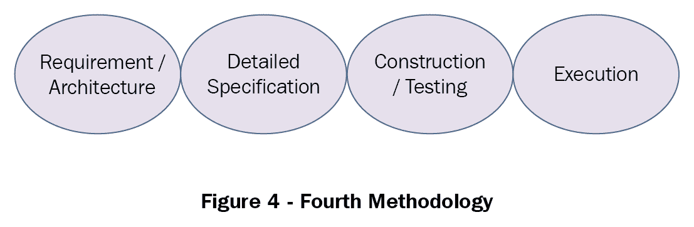
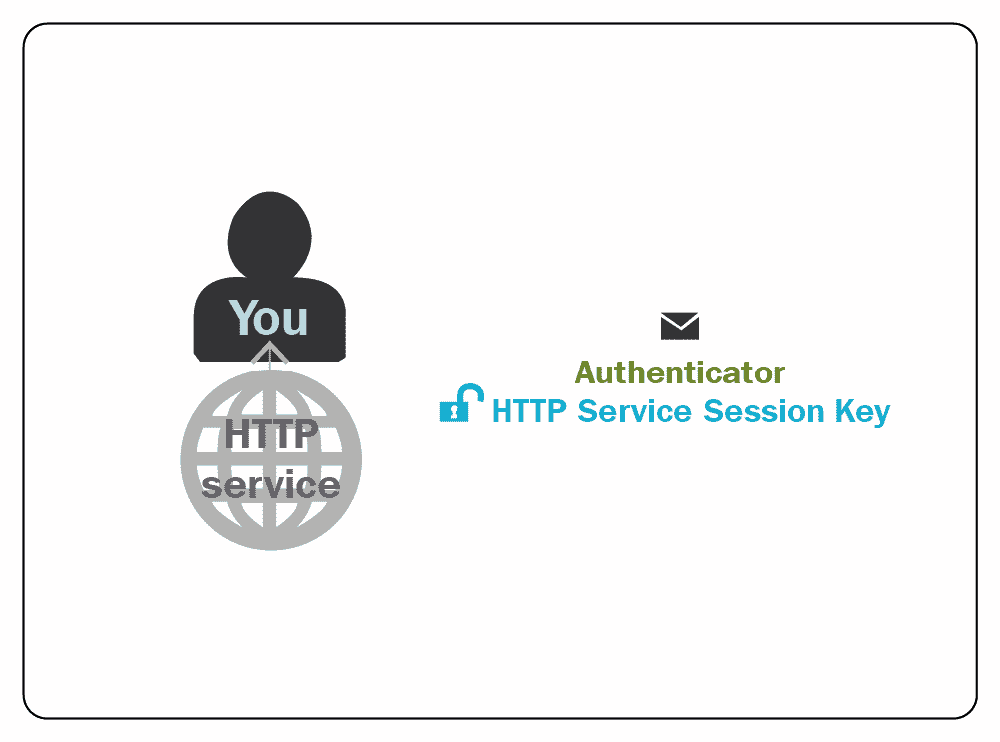

# 数字化转型中的 DevOps

在本章中，我们将探讨数字化转型之旅，重点是 DevOps 在大数据迁移、云迁移、微服务迁移、数据科学、身份认证安全和**物联网**（**IoT**）等系统中的应用。

将涵盖以下主题：

+   数字化转型

+   大数据中的 DevOps

+   云计算中的 DevOps

+   微服务中的 DevOps

+   数据科学中的 DevOps

+   身份认证系统中的 DevOps

+   物联网中的 DevOps

# 数字化转型

数字化转型之路对每个公司都是独特的，因此定义也会有所不同。从广义上讲，它是指通过采用和集成数字技术，将业务操作进行根本性转变，以便为客户提供价值。

为了实现这一目标，企业需要培养一种文化，持续挑战长期建立的流程现状，并常常进行实验，采用相对较新的、不断发展的实践。

这次数字化旅程的激励因素如下：

根据 Forrester Research 的报告，高管们预测到 2020 年，近一半的收入将由数字化驱动。

根据麻省理工学院数字商业中心的研究，*那些拥抱数字化转型的公司比同行业的平均竞争者盈利能力高出 26%，并且市场估值高出 12%。*

研究表明，*九成 IT 决策者认为遗留系统阻碍了他们利用所需的数字技术来推动增长和提高效率。*

他们的客户和内部员工将全力支持他们，因为数字化实践已经深入人们的生活各个方面，比如通过移动设备在线购物和远程调节家中的暖气系统。

数字战略的采纳应视为一种持久的文化和技术变革，而非战术手段。它是对软件平台和架构、开发方法、技术、业务流程、角色和职责的重新评估。这是渐进的、逐步的、反复迭代的，而不是革命性的或破坏性的。它关注的是组织与变革的对接，而不仅仅是**首席信息官**（**CIOs**）单方面推动以应对竞争。

成功数字化旅程的步骤如下：

+   为组织制定数字战略

+   人员参与和技术同样重要

+   遗留架构转型

+   现代化遗留流程和态度

+   使用移动设备作为变革的催化剂

+   利用**应用程序接口**（**APIs**）的强大功能

+   规划保持安全

数字化转型框架根据组织的具体挑战和需求有很大的不同。商业和技术领导者在进行数字化转型时常引用以下共同主题，帮助他们制定自己的数字化转型战略：

+   客户体验

+   操作敏捷性

+   文化和领导力

+   劳动力赋能

+   数字技术集成

组织数字化转型文化的转变，是由 IT 角色的根本变化所推动的。

Harvey Nash 和咨询公司 KPMG 的最新报告发现，*CEO 们关注的是能够赚钱的 IT 项目（63%），而不是节省成本的项目（37%）*。

Forrester 的研究表明，CIO 平均将 72%的预算花费在现有 IT 问题上，而只有 28%的预算用于新项目和创新。

在过去四年里，长期以来的 CIO 优先事项在相对重要性上的变化最大。例如，提高运营效率下降了 16%，而提供稳定的 IT 性能下降了 27%。

The Weather Company 的 CIO Bryson Koehler 表示，*当你将 IT 从“运行我们买来并已部署的封装解决方案”转变为“构建和创造以前不存在的新能力”时，工作思维方式会发生很大的变化*。

*Marc Carrel-Billiard*，埃森哲数字化转型全球技术研发负责人，在 TechCrunch 的文章中引用的话说，*找到帮助人们跨越数字鸿沟、应对快速变化所带来的文化冲击的方式，将和我们用来实现这些目标的技术一样重要*。

美国联邦通信委员会 CIO David Bray 博士谈到这种文化转变如何为转型奠定基础：*在人类历史中，我们能够用工具做的事情改变了我们作为人类能够做的事，进而改变了我们作为文化能够做的事*。Bray 说，*我们物种之所以“聪明”，是因为我们知道如何协作使用工具。归根结底，当我们谈论技术变革——无论是万物互联、大数据，还是机器学习——它首先是关于人和组织文化的。然后，才是这些人如何共同完成任务——这才是当你谈论转型组织文化时的核心内容*。

Nextgov 报道，*大约四分之三的联邦政府每年在信息技术上的 80 亿美元支出，仅仅用于维持传统系统的运行*。

根据 Tiger Text 的研究，并结合 HIMSS Analytics 的研究，在医疗行业中，*尽管智能手机和其他移动设备在医疗服务提供者中广泛使用，但 90%的医院仍然使用寻呼机，并且为了维持传统寻呼服务，支付费用超出了 45%*。

公司不再仅仅为了节省成本和运营而开发软件或管理 IT，而是 IT 已经成为推动商业创新的主要推动力和引擎。为了适应这种转变，公司角色需要与 IT 在日常体验中的影响进行重新对齐。在推动数字化转型战略时，尽管 IT 会发挥重要作用，但与数字化转型的实施和适应相关的大规模变化是每个人的责任。数字化转型主要与人有关，比如淘汰过时的流程和遗留技术，转而采纳敏捷原则，并推动全公司范围的现代化。

# 大数据与 DevOps

那些倾向于将 DevOps 视为纯粹的过程成熟度、而将大数据视为技术流的组织，往往会将它们割裂开来，从而导致低效。DevOps 的目标是使软件生产和交付更高效，将数据主题纳入持续交付流程的范围，并拥抱 DevOps，将成为组织成功的重要资产。许多 IT 领导者现在面临着更大的压力，需要为大数据和数据科学项目的投资取得成果。大数据项目变得越来越具有挑战性。随着大数据项目中的应用程序的出现，迫使分析科学家重新设计他们的算法。分析模型的重大变化会迅速带来资源和基础设施的调整。如果操作团队未能参与其中，整个过程就会放慢，从而抵消大数据分析所提供的竞争优势，也突显了 DevOps 协作的必要性。

在大数据项目中，需考虑的三个主要组件是：

+   确保事物是可靠的

+   确保事物具有可扩展性

+   确保它们的性能

大数据项目最具挑战性的方面是性能，需要处理成百上千台计算机，处理庞大的数据集，处理快速变化的数据，同时还要处理多个任务和人员。这些变量的组合使得性能对于大数据系统至关重要。

通过整合大数据和 DevOps，组织可以实现以下好处。

# 有效地规划软件更新

软件与数据密切互动，因此在更新和重新设计应用程序时，必须了解数据源的类型。与数据专家和程序员合作并编写新代码，有助于从数据的角度有效地规划更新。

# 降低错误率

数据处理问题占据了软件开发和测试错误的主要份额，复杂的应用程序和其处理的数据种类繁多，增加了出错的机会。DevOps 原则中的*向左测试*强调在开发周期的早期阶段进行代码变更测试，这也称为开发周期的*左*部分。这一过程通过 DevOps 实践得以实现，推动了持续集成过程中的进一步自动化。数据团队与 DevOps 团队之间的紧密合作对于避免应用程序中的数据相关错误，尤其是在持续交付和部署过程中至关重要。

# 开发环境与生产环境的一致性

大数据和 DevOps 团队共同合作并参与软件交付过程，可以帮助理解在快速构建应用程序以模拟现实世界行为的开发和测试环境中，所涉及的数据挑战。现实世界中的数据类型和多样性可能存在巨大的差异；DevOps 推荐非数据专家也要参与这一过程。

# 来自生产环境的快速反馈

持续交付过程包括在软件发布后从生产环境中收集度量数据，以分析优缺点并规划进一步的更新。让数据团队参与监控和维护生产中的软件，分析与生产相关的数据，如应用健康统计（CPU 时间、内存使用等），可以帮助组织更好地理解用于持续交付的 DevOps 链。

# 大数据项目的敏捷性

一个敏捷的环境有助于适应性流式传输，而进化开发有助于软件流之间的流动。企业将他们的大数据和数据科学项目迁移到公共云服务，以便能够更加灵活地在几分钟内启动虚拟的 Hadoop 或 Spark 集群。正如我们在前面章节中所看到的，DevOps 的采用为项目和企业带来了敏捷性。

# 大数据即服务

DevOps 对大数据的好处可以通过使用 Docker 容器来扩展，提供大数据即服务。数据科学家通过自服务，可以迅速启动集群并使用大数据工具，如 Hadoop、Spark 等。

为 DevOps 采用的大数据处理流程包括：

+   ETL

+   分析

+   可视化

+   安全性/Kerberos

+   数据科学

+   监控

大数据涉及将大量数据从源系统迁移到目标系统；这一过程需要适当的设计、数据提取、数据加载、数据验证和数据清洗来完成。接下来讨论的方法论以及 DevOps 流程，有助于即使是面对大量数据，也能在短时间内完成预期的迁移。

大数据的格式和种类可以是结构化、半结构化和非结构化数据，这些数据来自社交媒体、机器数据、服务器日志等，涵盖了包括医学、生物学、物理学、医疗监控、天体测量学、交通运输和制造业等多个领域。

大数据实现有多种选项和处理方法，如下所述，用于评估并采纳 DevOps，既适用于应用程序，也适用于基础设施。

# ETL 数据模型

**提取**、**转换** 和 **加载** (**ETL**) 是将数据从源系统提取、通过业务逻辑进行转换，并加载到系统中供业务使用的过程。数据模型和架构是根据输入和输出数据的业务规则构建的。

还有一种叫做 **提取**、**加载** 和 **转换** (**ELT**) 的模型，其中数据以原始形式加载到暂存层，随后应用转换、业务逻辑和规则，以便后续的业务使用。

# 方法论 1

该方法论包含以下八个步骤：业务影响分析、发现、映射与设计、迁移计划的创建、资源配置、迁移前测试、迁移与切换、以及迁移验证：

+   **业务影响分析** 是识别迁移过程中业务和操作需求

+   **发现** 阶段是关于收集数据源、迁移硬件和软件环境的详细信息

+   **映射与设计** 阶段确定数据将如何以及在哪里迁移

+   **迁移计划的创建** 是规定客户期望和项目交付物的蓝图

+   **资源配置** 为数据托管准备目标存储环境

+   **迁移前** **测试** 测试并验证迁移组件

+   **迁移与切换** 是指数据从源到目标的迁移

+   **迁移验证** 确认在迁移后环境中满足所有预期要求

# 方法论 2

该方法论确保在数据迁移到目标系统之前，数据得到适当的评估、审查和恢复。

+   **评估** 阶段分析源类型、介质状态和工作量估算

+   **审查** 阶段评估客户需求和标准，以及目标系统

+   **恢复** 阶段识别并恢复单个文件，并在数据提取过程前恢复数据

+   **迁移** 阶段对恢复的数据进行索引和去重，并将数据迁移到目标系统，交付给客户

# 方法论 3

该方法论专门用于处理诸如数据库迁移准备阶段、迁移阶段、ETL 阶段和应用程序阶段等方法。

+   **迁移准备阶段** 创建业务案例、评估风险、创建参与模型、评估数据库环境、基础设施规划，并包括硬件和软件。

+   **迁移阶段**根据业务目标分析当前数据库和目标数据库的设计。它构建数据库对象，如表、视图和触发器。它进行数据迁移；优先迁移路线图验证数据库模式，并验证数据是否正确迁移。

+   **提取、转换和加载阶段**设计和开发 ETL 包，以处理并行数据加载，验证技术准确性、功能性和安全性，并测试数据加载性能。

+   **应用阶段**进行应用程序集成测试和用户验收测试，以便在生产环境中实施。

# 方法论 4

这是由 Gershon Pick 提出的，包含四个步骤：

+   **需求/架构**阶段定义高级需求，如数据、性能需求，以及详细的项目计划。

+   **详细规范**阶段定义转换、验证和结构变更。

+   **构建/测试**阶段构建迁移解决方案并进行测试。

+   **执行**阶段确保目标系统验证结果以便在生产中实施。

# 方法论 5

这是由戴尔公司提出的，包含五个步骤：规划、生产前测试、迁移、验证和切换。

+   **规划阶段**定义迁移目标和要求，创建迁移计划，定义硬件/软件和工具。

+   **生产前测试**阶段测试迁移环境，收集并验证数据。验证硬件/软件及迁移工具，并更新最终迁移计划。

+   **迁移阶段**安装迁移软件，并根据计划执行迁移。

+   **验证阶段**验证迁移是否完成，收集迁移统计数据，并准备迁移报告。

+   **切换**将应用程序迁移到目标环境，并创建最终报告。

# 方法论 6

该方法论有八个步骤，解释了迁移过程中常见和必要的步骤。

+   **业务影响分析**：数据是增强业务流程的基础和重要方面。此步骤分析客户对业务的需求。

+   **信息收集**阶段收集有关源系统和目标系统的详细信息。软件和硬件信息的收集可以是手动的，也可以是自动化的过程。

+   **映射与设计**阶段映射源系统和目标系统，维持两种设计布局。一个是源和目标布局相同，另一个是源和目标模式不同的中继布局。

+   **迁移计划**阶段考虑业务和操作约束条件，迁移数据及其属性，并为此过程提供工具。

+   **供应阶段**复制源文件结构、数据卷和属性，为环境接收实际数据流做准备。

+   **测试迁移**阶段确保所有假设是有效的，工具也适合，以最小化时间和资金浪费的风险。

+   **迁移**阶段确定数据从源头到目的地的移动方式，包括两种可能性：将数据移出路径或进入路径。

+   **验证**阶段检查数据访问、文件权限和目录结构，以验证应用程序的正常运行。

正如我们所讨论的，整个大数据迁移过程的每个阶段，从 ETL、分析到可视化，都可以作为一个过程方法论来分析，并在每个阶段应用 DevOps 成熟度和工具，以提升性能和生产力。

# 云迁移 - DevOps

如果云迁移操作不当，成本可能会非常高。与本地环境相比，应用程序在云端的表现不同，特别是对于复杂的应用程序来说，成熟的测试策略能带来不同的结果。在迁移过程的每个阶段引入 DevOps 方法论，肯定能为多方面价值的提升做出贡献。这里详细介绍了云迁移的每个阶段，并根据组织的需求，采用 DevOps 策略来处理应用程序、基础设施和工具。

在将应用程序迁移到云时，需要考虑以下几个方面：

+   **应用可行性**：这是应用程序的架构兼容性，是否适合云托管。

+   **外部/内部依赖**：需要理解应用程序如何在云端访问内部和外部依赖。

+   **应用类别**：从业务角度来看，高需求的应用程序被归类为业务关键型和业务部门应用，要求具备高可用性。

+   **应用集成**：这验证了应用程序与其他本地应用程序和共享服务的性能。

+   **可扩展性/弹性**：应用程序设计支持云端的可扩展性。

+   **合规性遵守**：这保障了企业级合规性、法规和治理，适用于迁移或存储在企业场外的数据。

+   **投资回报率**：这有助于将应用程序托管在云端，使企业更加节省成本。

+   **安全性**：迁移到云后，可以提供与之前相同级别的安全性：

    +   数据安全

    +   身份验证

    +   授权

+   **数据库兼容性**：现有数据库受支持，且与云兼容。以下是迁移应用程序到云时保持应用数据的几种方式：

    +   本地部署数据库

    +   在虚拟机上创建数据库

    +   Windows 数据库（PaaS）

# 迁移策略/方法

迁移决策需要考虑多个因素：

+   **UI 分析**：UI 界面将进行分析，以便在 PaaS 模型中迁移到云。基于 Web 的本地应用程序和服务可以重新工程化以适应云服务，而本地非 Web 应用程序则需要重建以根据需要迁移到云。此外，与云兼容的第三方框架/类库可能需要一些修改或重新编写。使用 IaaS 模型时，整个服务器镜像将被迁移，云之间的代码更改最小。

+   **身份验证和授权**：应用程序中的身份验证机制将进行兼容性分析，如使用基于表单的身份验证和访问控制服务，或 ACS 与企业本地 Active Directory 集成。

+   **与其他模块/应用程序的交互**：

    +   **Web 服务**：这些服务可以作为 Web 角色或工作角色托管，保留为本地服务，并通过 API 暴露

    +   **原生代码**：可以创建并部署托管包装包

    +   **第三方依赖**：这些依赖项已验证可以直接从 Web 服务中消费

+   **诊断支持**：此项实现自定义日志记录并将日志信息保存到存储表中：

    +   将事件日志推送到诊断存储

    +   将失败的请求日志推送到诊断存储

    +   将性能计数器数据推送到诊断存储

+   **其他事项**

    +   **消息队列**：用于消息发布和订阅模型的订阅

    +   **配置变更**：应用程序不应硬编码物理磁盘或网络访问值

    +   检查任何第三方库或内容引用

    +   替换静态值和应用程序状态以处理可扩展性应用程序

    +   **应用程序日志**：这是自定义日志的捕获和存储管理

+   **数据迁移策略**：应用程序迁移策略应与数据迁移策略同步进行，因为大多数应用程序都是以数据为中心的。应用程序可以将数据存储在磁盘、数据库或网络存储中；然而，从本地迁移到云时，要求用户在数据上看不到任何不一致。

云提供了将数据以与本地应用程序中存储方式相同的方式持久化的灵活性。云托管的应用程序数据可以通过多种方式保存：

+   +   从本地数据库迁移到云数据库

    +   静态内容迁移到云存储

    +   消息队列迁移到云队列存储/服务总线队列

+   **迁移执行**：

    +   从本地迁移到云的 Web 应用程序是按组件分步规划的，独立进行

    +   接下来的章节将解释 PaaS 和 IaaS 选项的迁移过程

+   **缩写描述**

    +   **访问控制服务**（**ACS**）

    +   **Active Directory 联合身份验证服务**（**ADFS**）

    +   **基础设施即服务**（**IaaS**）

    +   **平台即服务**（**PaaS**）

# 迁移到微服务 - DevOps

DevOps 原则和方法非常适合微服务，而微服务的迁移涉及架构、API 和代码开发。这些都会在代码版本控制系统、持续集成、构建、测试系统中进行，直到持续部署。

从单体架构重构到微服务可以通过多种方式进行。这里列出了三种主要策略。

# 策略 1 - 独立微服务

向单体应用中实现新功能应当作为新的代码添加，而不是将其直接添加到单体应用中，以避免应用变得更为臃肿。下图展示了应用此方法后的系统架构：

在新架构中，新服务和遗留单体应用共存。这里有两个通信组件。请求路由器处理传入的（HTTP）请求，类似于 API 网关；路由器将请求发送到新的功能服务，将遗留请求路由到单体应用。

glue 代码是将服务与单体应用集成的第二个组件。服务需要访问数据以读取和写入单体应用所拥有和处理的数据，glue 代码可以驻留在单体应用、服务或两者中。

服务访问单体数据有三种策略：

+   调用单体应用的远程 API

+   直接访问单体应用的数据库

+   服务维护自身的数据副本，并定期与单体的数据库同步

glue 代码是用于在两种不同模型之间进行转换的重要功能。glue 代码维护其自身的原始领域模型。glue 代码必须防止其自身的模型被遗留的单体应用的领域模型污染；因此，它也被称为反腐层（anti-corruption layer）。

以轻量级服务的方式实现新功能的方法具有以下优点：

+   新功能/服务可以独立开发、部署和扩展，而不与单体应用绑定。

+   新创建的服务扩展了微服务架构的优势

+   它防止单体应用变得更为臃肿且难以管理

# 策略 2 - 分离前端和后端

这一策略是将单体应用中的表现层与业务逻辑层和数据访问层分离。

企业应用至少包括以下三个不同的层：

+   **表现层**：这是一个复杂的用户界面，包含大量代码；它处理基于 HTML 的 Web UI 或（REST）API 等的 HTTP 请求。

+   **业务逻辑层**：包含应用的核心业务规则组件。

+   **数据访问层**：访问数据库和消息代理等基础设施组件

在单体模式中，层之间的角色和责任划分是展示逻辑和业务及数据访问逻辑。业务层封装了具有粗粒度 API 的业务逻辑组件。这是一个自然的过程，可以通过将单体分成两部分来扩展为微服务架构。一部分包含展示层，另一部分包含业务和数据访问逻辑层。然后，展示逻辑部分或应用程序会远程调用业务逻辑应用程序或部分，如下图所示，展示了变更前后的架构。

主要的好处是使两个应用程序部分能够独立启用、开发、部署和扩展，例如从展示层分离的用户界面，以便可以进行迭代和快速开发与测试；这种方法的另一个好处是为微服务公开远程 API。

在这种情况下，三个层都是庞大的单体组件。这种策略只是一个部分解决方案，因此将探索下一种策略。

# 策略 3 - 提取服务

将现有的单体模块转化为独立的微服务是第三种重构策略。在这个过程中，每次提取一个模块并将其转化为服务时，单体逐渐缩小。通过足够的模块转换，单体不再是问题，完全消失，或者变得足够小以成为另一个服务。

# 优先选择要转换为服务的模块

促使此过程顺利进行的几个因素如下：

+   从一些易于提取的模块开始

+   确定将提供最大收益的模块

+   确定频繁变更的模块

+   按照收益或变更频率对模块进行排序

+   与单体应用中的其他模块相比，具有独特资源需求的模块，例如需要内存速度或计算密集型算法的模块，需要在专用机器上运行，以便快速、轻松地扩展应用程序

+   具有现有粗粒度边界的模块更容易且成本较低地转化为服务；例如，作为一个仅通过异步消息与其他应用程序通信的模块

采用这种方法后，一个复杂的单体应用程序，包含数十个或数百个模块，可以方便地逐个提取为微服务模块，然后该服务可以独立于单体进行开发和部署，从而加速开发进程。

# 提取模块的过程

提取模块的初始阶段涉及在模块与单体应用程序之间创建粗粒度交互，作为单体架构与服务之间的数据交换双向 API。根据复杂的依赖关系和细粒度交互模式，实现模块与应用程序其他部分的交互将具有挑战性。

基于领域模型模式的业务逻辑，具有大量的领域模型类依赖关系，可以通过代码更改进行调整。将粗粒度模块转换为一个独立的服务，通过**进程间通信**（**IPC**）API 进行通信，从而实现单体架构与服务的连接。

在重构之前、期间和之后的架构如下所示：

在最初的架构中，如前面图表的左上角所示，输入过程流是从**模块 X**到**模块 Z**。然后，**模块 Y**使用**模块 Z**的输入。

# 阶段 1

+   重构阶段定义了一对粗粒度的 API。

+   初始接口是来自**模块 X**的输入，调用**模块 Z**。

+   **模块 Z**的输出接口被用来调用**模块 Y**。

# 阶段 2

+   在这个重构阶段，模块被重新构建为一个独立的服务。

+   进出交互通过结合**模块 Z**与处理服务发现的微服务框架，使用 IPC 机制代码实现。

+   在提取模块后，服务可以独立于单体架构和其他服务进行开发、部署和扩展。

+   该服务可以通过 API 代码重新编写，作为一种反腐层，负责在两个领域模型之间进行翻译，从而将服务与单体架构集成。

+   每个提取的服务都是朝着微服务方向的一次进步；随着微服务数量的增加，单体架构将逐渐缩小。

# 应用现代化

微服务的采用是将现有应用程序迁移到现代平台的一种应用现代化形式。这是逐步规划的，并不是从零开始重写代码。正如我们所见，这一策略涉及将展示层组件与业务和数据访问组件分离，将现有模块转换为服务，并作为微服务实施新功能和特性，从而提高应用程序的敏捷性和性能。

# 架构迁移方法

Forrester Research 和 InfoWorld 提出了一个面向微服务的四层参与/架构平台。这个架构模型采用了计算和移动设备渗透的变化，用于应用程序开发。

最主要的考虑因素是决定微服务架构，并在优化之前设计服务的交互。

微服务的四层方法被拆分为以下不同的层级：

+   **客户端层**：这是基于移动客户端和物联网的客户体验

+   **交付层**：通过监控用户选择来优化用户体验，根据设备个性化内容

+   **聚合层**：这将数据从服务层聚合并进行数据协议转换

+   **服务层**：这是指使用内部现有的数据服务或外部服务，如 Twilio 和 Box

最大的区别是客户端层的分离；基于与用户的实时交互，底层的层次结构可以不断变化。

采用微服务的策略可以总结为以下三个步骤：

+   **组件化**：从现有应用中识别组件，并基于试点方案创建微服务实现

+   **协作**：基于从试点阶段获得的经验教训，与团队中的利益相关者、程序员和开发人员共同评估新的流程和倡议

+   **连接**：将微服务应用于现实场景

# 数据耦合

微服务架构是松耦合的，数据通常通过 API 进行通信。一个微服务甚至可以只运行小量代码，但专注于管理单一任务。

松耦合基于以下方面：

+   范围边界已定义并内建智能。

+   智能功能与消息传递功能分离。

+   与类似功能的微服务兼容，并能够容忍各种修改；变更不是强制的，也不需要协调。

+   服务通过 API 解耦，给予它们自由和灵活性。API 是服务的契约，规定了服务提供的内容以及程序依赖于它们的方式。

# 微服务可扩展性

根据此列出的架构可扩展性模型，这些可以包括：

+   功能分解（Y 轴扩展）

+   数据分区（X 轴扩展）

+   单个服务的横向扩展（X 轴扩展）

# 架构和实现考虑的最佳实践

迁移到微服务是一种策略，需要逐步规划，具体如下：

+   在单体应用中分离类

+   识别具有 CRUD 风格接口的类以及其他业务方法

+   识别与其他类无依赖关系的孤立类，除了与外部服务（如 Memcache、Cloud Datastore 或 Task Queue）交互所需的代码

+   使用静态代码分析工具识别与其他代码隔离的代码段

+   重构代码以移除不必要的依赖，循环依赖是最难解决的问题

+   作为迁移到微服务的前提，重构生产环境中的遗留代码库：

+   识别微服务的共同领域，如下所示：

    +   账户和用户信息

    +   授权和会话管理

    +   配置或偏好设置

    +   通知和通信服务

    +   照片和媒体，特别是元数据

+   在识别出类集之后，迁移到微服务的下一步

    +   通过保留现有代码在遗留应用程序中操作，实现回滚选项

    +   创建新的代码库，并将类复制到其中

    +   通过视图层创建 HTTP API，以提供正确格式化响应文档的钩子

    +   新代码作为独立应用创建（`exampleapp.yaml`）

    +   新的微服务作为服务或独立项目进行部署

    +   对代码进行功能测试

    +   从遗留应用程序迁移数据到新的微服务

    +   遗留应用程序已修改以使用新的微服务应用程序

    +   已修改的遗留应用程序将被部署

    +   确保功能性和性能的充分验证

    +   如果遗留应用程序中有死代码，则会被移除

# 领域建模

设计一致且松耦合的微服务的核心是领域建模，以确保微服务的隔离和封装及其可重用性。每个应用程序的微服务应适当隔离，以避免运行时副作用，同时也应隔离系统中其他微服务实现过程中发生的变化。恰当的领域建模有助于避免系统中基于技术或组织边界的建模缺陷，从而实现服务的分离，如数据、业务逻辑、展示逻辑等。

一个例子是从单体电子商务系统中提取促销服务，由不同的客户端（如移动 Web、iOS 或 Android 应用）使用。因此，*促销*的领域模型及其状态实体和逻辑需要被隔离，并且不应与系统中其他领域（如产品、客户或订单）的跨域逻辑或实体混淆。

# 服务规模

基于*单一职责原则*的微服务适当服务规模是驱动独立操作的动力，测试主张服务规模尽可能小，类似于基于 Unix 的小型实用工具，适用于易于维护和升级的小型代码库。

根据产品类型以及不同的业务逻辑，封装可能变得过于复杂，因此更好的方法是考虑在产品领域内添加更多的边界，并创建更多的服务。另一个选择是考虑替换微服务为新的实现或技术，并据此规划规模的重新调整。

# 测试

在将单体系统逐步转变为微服务系统的过程中，测试扮演着重要角色；需要执行与单体系统的服务集成测试，同时跨越预先存在的单体系统的业务操作仍然能够在新的微服务系统上继续执行。系统提供的消费者驱动契约可以转换为新的微服务测试用例，这种情况下，自动化测试确保系统的期望得到满足。

一些自动化测试套件：

+   `Pact`，一种基于消费者驱动的契约测试库，用于创建可重用的测试环境，以部署整个系统的测试副本来测试微服务

+   使用自动化工具，如 Docker Compose，可以将整个系统容器化为 Docker 容器，并编排这些容器，以便快速部署系统的测试基础设施，进行本地集成测试。

# 服务发现

服务发现系统使得各个服务能够在执行业务功能时彼此了解。每个服务都会引用外部注册表，获取其他服务的详细信息。对于少量服务，可以使用环境变量来实现服务发现；对于更复杂的系统，服务发现通常依赖于 Consul 和 Apache Zookeeper。

# 部署

每个微服务的部署应该通过运行时容器自我启用，或者通过将容器嵌入自身来实现，类似于基于 JVM 的微服务 Tomcat 可以容器化，避免了需要独立的 Web 应用服务器。在任何时刻，存在多个相同类型的微服务（参考规模立方体 X 轴扩展），以便更可靠地处理请求。实现中包括一个软件负载均衡器，作为服务注册表，用于故障切换和请求的透明负载均衡，例如 Netflix Eureka。

# 构建和发布管道

持续集成和部署管道对于实现基于微服务的系统非常有价值，它为每个微服务提供了按需、构建和发布的专用管道，减少了构建和发布整个应用程序的成本。

滚动升级（或蓝绿部署）应该成为发布实践的一部分，这意味着如果是绿色的，升级就成功了，否则应该实施回滚策略。这也可以通过在生产环境中始终保持同一微服务的并发版本（现有版本和新构建的版本）来实现，快速根据需要进行切换。在这种情况下，可以将用户负载的一部分路由到新的微服务版本以测试其操作，同时逐步淘汰旧版本。这为系统中的微服务故障提供了冗余，防止了系统瘫痪。

# 特性标志

微服务模式包括特性标志。它是一个添加到系统中的配置参数，用于控制某个功能的开关。这种模式使得系统能够触发与标志选项（例如，开启）关联的微服务的使用。例如，同一个功能可以在新微服务和生产环境中共存，流量可以通过特性标志进行路由；这使得交付团队能够加快构建周期时间。

# 微服务采用对开发人员生产力的提升

单体架构允许在紧迫的时间表下快速推出新业务功能，而整体系统也相对较小。然而，随着系统变得臃肿，开发和运维都会变得繁琐。

采用微服务优先的方式构建新功能或系统是复杂的，涉及许多活动部分。虽然它需要在架构和自动化方面具备强大的纪律性，但从长远来看，投资是值得的，因为它为团队快速而干净地构建微服务创造了一个良好的环境。一个方法是创建一个标准的模板项目，将关键的微服务设计原则封装在项目结构、测试自动化、与监控和仪表化基础设施的集成、断路器和超时模式、文档钩子、API 框架等方面。这类项目模板有助于团队专注于在微服务基础的分布式环境中构建业务功能，而不是关注脚手架和胶水代码。几个有趣的项目方法包括 Dropwizard、Spring Boot 和 Netflix Karyon，选择取决于架构和开发人员的技能水平。

# 监控与运维

在单体系统和微服务中共存的特性监控，有助于更好地了解实施新微服务后的性能提升。这需要收集统计数据，对系统和资源的性能进行全面监控，以提高继续迁移的信心。

# 组织考虑

从单体系统迁移到微服务时，组织变革是最具挑战性的部分，例如建立服务团队来负责微服务的各个方面。为了实现更集中的代码所有权，需要创建由开发人员、测试人员和运维人员组成的多学科团队，这些人关注软件工艺。

# 数据科学中的 DevOps

数据科学项目主要涉及多个角色流，执行大数据工程师、数据科学家和运维团队不同职能的任务。对于数据工程师来说，主要任务包括 ETL、准备数据集以供分析以及将数据科学家开发的模型编码为脚本。数据科学家则参与开发模型、根据样本测试数据评估不同算法和模型，并用真实数据进行验证。

在这种独立工作场景下，团队的产出可能仅限于概念验证（Poc），而无法扩展到大型项目。然而，即使是较小的任务也需要技能的重叠，并且需要与大数据工程师、数据科学家和运维团队进行多次互动和设计会议。

DevOps 可以通过采用最佳实践来弥合协作工作的差距：

+   **工具和平台的演变**：工程师和数据科学家应持续评估并为新工具和开源项目的创建做出贡献，并以 Apache Spark/Hadoop 生态系统为基础，确保其稳定性和日常操作中的用户友好性。

+   **跨技能教育**：数据科学家应当共同考虑现实的、理性且实际的可能性，而不是局限于编写抽象代码，例如查询时长和提取数据是否能足够存储系统使用。

+   **流程改进**：DevOps 是前进的道路，不仅限于工具的实现，如编写 Ansible 脚本或安装 Jenkins。DevOps 应当帮助发明新的自助工具，提升生产力，减少团队间的交接。

# DevOps 持续分析环境

随着持续分析和自助服务的成熟，数据科学家的职责从最初的构思延伸至数据项目的生产阶段。自主性帮助我们将更多时间投入到生成实际见解上。

数据科学家通过以下多个阶段进行操作：

+   从最初的商业构思开始，进行数据探索和准备工作

+   投资于模型开发

+   环境的部署和验证

+   部署到生产环境：使用合适的工具，他们能够自己完成完整的迭代，每天多次，且周转更快

大数据工程师专注于开发和贡献工具，如 Spark、可扩展性和存储优化，支持流架构，并提供数据科学家所需的 API 和 DSL。

产品工程师可以基于数据科学家开发的分析模型的捆绑服务，为业务用户构建智能应用程序。

每个人都在自己的抽象层次上工作，并以这种协作模式为整体成功作出贡献。

# DevOps 用于身份验证和安全

Kerberos 数据安全以以下流程列出

+   一种身份验证协议

+   用于身份验证的票据

+   避免在本地存储密码或通过互联网传输密码

+   可信第三方验证

+   对称密钥加密

# Kerberos 领域

Kerberos 领域基于策略管理定义；它包含了所有可供访问的内容，如客户端、服务、主机和**密钥分发中心**（**KDC**）（身份验证服务器和**票据授权服务器**（**TGS**））。身份验证的证明是用户/密码凭证，通过特定服务请求加密的密钥进行加密，**单点登录**（**SSO**）通过新登录或系统上的缓存验证创建的票据。

访问请求到服务或主机通过以下交互发生：

+   身份验证服务器

+   票据授权服务器

+   需要访问的服务或主机机器

+   KDC 将所有用户机器和服务的秘密密钥存储在其数据库中

+   秘密密钥是密码和哈希算法的组合

+   在初始设置过程中生成一个密钥，并在服务/主机机器上进行记忆

+   秘密密钥都存储在 KDC 数据库中，基于对称密钥加密

+   Kerberos 也可以使用公钥加密来代替对称密钥加密

# 用户与认证服务器之间

用户和服务器之间的服务请求认证过程如下：

1.  访问 HTTP 服务需要通过终端主机的 TGT 与服务器进行身份验证：

1.  认证服务器将在 KDC 数据库中检查有效性，但不检查凭证：

1.  一旦有效性确立，用户和**票证授权服务器**（**TGS**）之间会创建会话密钥：

1.  客户端密钥（密码）进行验证和授权：

1.  HTTP 服务请求也遵循类似的加密认证过程：

1.  TGS 将检查 KDC 数据库中的 HTTP 服务可用性：

1.  为了呈现网页服务，TGS 使用其秘密密钥解密 TGT：

1.  TGS 随机生成 HTTP 服务会话密钥，准备 HTTP 服务票证，并使用 HTTP 服务密钥加密：

1.  TGS 发送加密的 HTTP 服务票证；然而，机器等待 HTTP 服务的密钥：

# 客户端和 HTTP 服务

HTTP 服务与客户端节点之间的服务请求如下：

1.  为了访问 HTTP 服务，客户端机器准备另一个认证消息，并使用 HTTP 服务会话密钥进行加密：

1.  然后，HTTP 服务使用其密钥解密票证，获取 HTTP 服务会话密钥并解密共享的认证消息：

1.  与 TGS 类似，HTTP 服务器发送使用 HTTP 服务会话密钥加密的认证消息：

1.  客户端机器通过解密缓存的 HTTP 服务会话密钥读取认证消息：

1.  未来的请求使用缓存的 HTTP 服务票证，只要它没有过期，且符合生命周期属性的定义：

1.  安全认证过程涉及多个服务器、策略和凭证管理，启用 DevOps 后，能够有效支持自动化升级、部署等操作。

# 物联网系统的 DevOps

反馈驱动价值。DevOps 的基本方面是快速获取关于性能和使用情况的洞察，这转化为进一步改进的反馈，设计并自动化交付流水线，以提高软件交付质量，并为我们的客户和业务带来最大价值。更紧密的客户联系以征求反馈并进行使用指标分析，随后通过持续改进，帮助敏捷组织迅速响应新出现的需求。

在物联网中，我们收集有关设备性能和使用情况的反馈，这些可以帮助我们：

+   通过预测维修需求来进行预防性维护，这基于实际使用特征，从而减少定期维护的持续时间并改善整体维护。

+   自动调整设置以改善能源消耗并提升服务质量。

+   从设备中获得的洞察可以改善所有连接设备的行为。

+   基于客户独特需求和行为，产品和服务随着时间的推移不断改进。

+   消费者物联网；可穿戴设备的持续反馈可以帮助提升其性能，比如电池寿命，例如智能手机、手表、冰箱和汽车。

+   工业物联网；消费品和工业物联网通过反馈回路驱动价值。企业因此能够确保提供一个可靠、引人注目且有利可图的产品，这要求操作员和制造商基于指标深入了解设备性能；例如，你的恒温器、喷洒系统等中的嵌入式微处理器。

+   听取来自客户、系统和设备的反馈对业务价值链至关重要。DevOps 的敏捷性帮助智能组织解决物联网软件挑战。

物联网（IoT）不仅仅是硬件和连接性。它需要软件来快速开发和更新，同时确保其性能安全高效。持续交付和持续部署只有通过大规模的自动化才能实现。将敏捷实践融入 DevOps 加速了开发周期，通过增量构建和频繁发布小批量代码，使发布过程更加快速和安全。

# 安全设计

新的反馈机制在安全方面带来了成本；连接的产品和系统现在暴露出更多来自黑客和恶意软件的风险。安全关键系统需要采用*安全设计*方法进行开发。例如，在移动设备中，**受信任平台模块**（**TPM**）为设备内部提供了一个受限区域，用于处理加密、证书和密钥等事项。这对电池电量产生影响，被视为 DevOps 术语中的非功能性需求。安全不是孤立的，它是开发周期的一部分，就像产品、质量和性能是内置的一样。解决这些重要问题意味着采用现代开发实践的组织能够很好地应对物联网的挑战。

DevOps 的采用不仅仅是科学；它是一门艺术，在 DevOps 应用于大数据、云、微服务、数据科学、身份验证安全和物联网系统的数字化转型旅程中。

# 总结

在本章中，我们学习了数字化转型旅程与 DevOps 的结合。

复杂企业系统的大数据迁移、云迁移、微服务迁移、数据科学、身份验证系统和物联网的采用。
