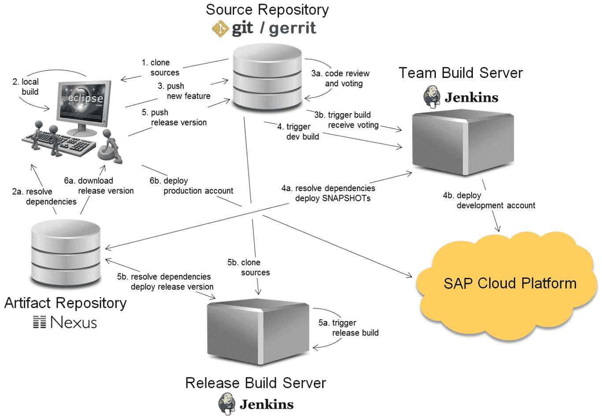

# ERP 系统的 DevOps 采纳

以下是 ERP 系统（SAP）在 DevOps 过程各个阶段的高调应用之一：

参考链接: [`cloudplatform.sap.com/capabilities/devops.html#`](https://cloudplatform.sap.com/capabilities/devops.html#)

正如我们从前述过程可以看到的，在成熟的 DevOps 采纳过程中，甚至替换传统的 SAP 生命周期管理器进行以下活动涉及：

+   基于 Eclipse 集成开发环境（IDE）的本地开发

+   Git/Gerrit 用于代码库管理

+   Nexus 用于工件库管理

+   Jenkins 用于发布构建服务器，以实现持续集成和部署

+   SAP Cloud 平台用于生产部署

通过采用开源工具和 DevOps 过程，用户能够受益于功能的灵活性和定制化，同时组织还节省了 SAP 生命周期管理器的采购和维护成本。
