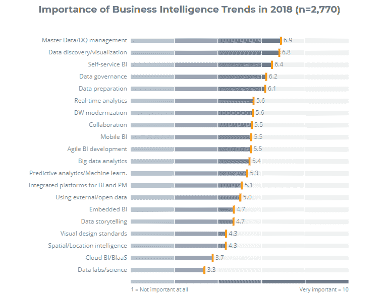

# 商业智能趋势

商业智能趋势的变化和分析如下所示：

参考：https://bi-survey.com/top-business-intelligence-trends

从上图可以看出，数据准备以及开放数据和外部数据的使用被认为是行业中的优先考虑事项。

下图展示了数据发现、准备、治理和可视化以及 MDM/DQ 是 2018 年趋势的重点领域：

参考：https://bi-survey.com/top-business-intelligence-trends
