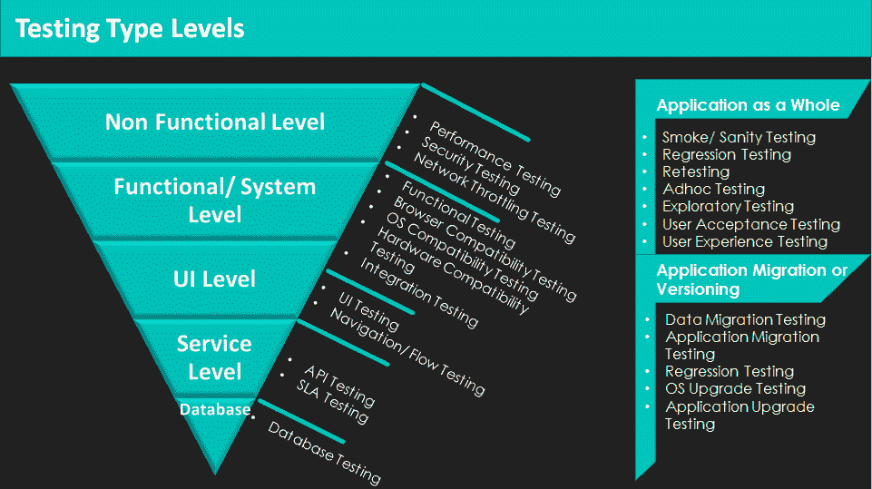

# 测试类型和级别

端到端测试是应用程序生命周期中的关键环节。理解这一点对于 DevOps 自动化尽可能多的环节至关重要。以下列出了测试变种的完整范围：

+   **功能测试**：根据业务规则和需求验证应用程序的功能。

+   **API 测试**：使用 Postman 验证各种服务的 JSON 请求和响应。通过 Postman 创建和自动化测试用例。

+   **SLA 测试**：验证不同服务/页面的请求和响应时间，并将其与开发团队提供的 SLA 指标进行比较。

+   **UI 测试**：根据设计团队提供的线框或创意，比较 UI 元素/图形。

+   **兼容性测试**：

    +   **操作系统兼容性测试**：在不同操作系统平台（如 Windows、Mac 和 Linux）以及不同的移动操作系统（如 iOS、Android、BlackBerry、Windows、Symbian 等）上验证应用程序。

    +   **浏览器兼容性测试**：在不同浏览器平台（如 Firefox、Chrome、IE、Safari（iOS）和 Chrome（Android））上验证应用程序。

    +   **硬件兼容性测试**：在不同硬件需求下验证应用程序。

+   **数据库测试**：验证在 UI 端（前端）执行的操作是否修改/创建或删除了数据。

+   **迁移测试**：验证用户数据在将网站从 v1.0 版本重写为 v2.0 版本后是否正确迁移。

+   **集成测试**：在测试并与所有服务集成后验证 API 服务。

+   **性能测试**：在各种工作负载下验证应用程序性能，并使用 Jmeter 测试内存泄漏。

+   **安全测试**：使用 VERA Code 验证应用程序的漏洞。

+   **用户体验测试**：验证应用程序的可访问性和用户友好性。

+   **本地化测试**：验证应用程序中不同语言（例如中文、日语、西班牙语、法语、意大利语、葡萄牙语等）的内容。

+   **冒烟/基本测试**：在对新版本进行任何重大测试之前，验证应用程序的基本功能。

+   **回归测试**：在修复任何缺陷或实现新功能时，验证受影响的区域。

+   **临时测试**：在不了解应用程序行为的情况下，随机验证应用程序功能。

+   **探索性测试**：在了解应用程序行为的基础上，随机验证应用程序功能。
