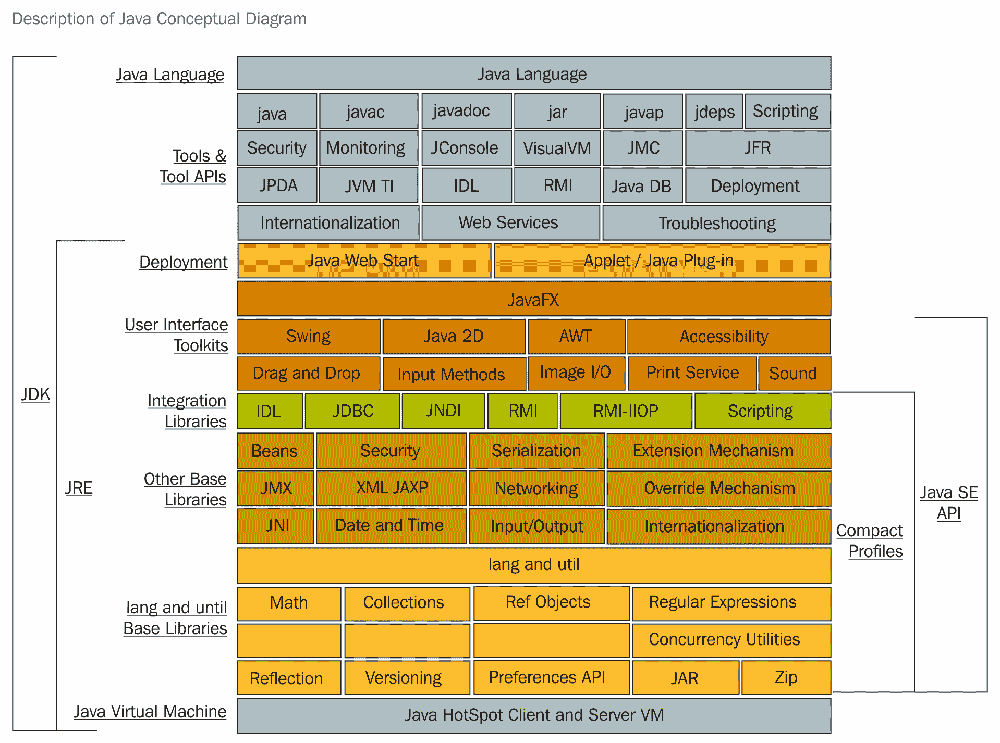

# Java 平台 SE 8

Oracle 有两个产品实现了**Java 平台标准版**（**Java SE**）8，分别是**Java SE 开发工具包**（**JDK**）8 和**Java SE 运行环境**（**JRE**）8。

JDK 8 是 JRE 8 的超集，包含了 JRE 8 中的所有内容，还包含了开发小应用程序和应用程序所需的工具，如编译器和调试器。JRE 8 提供了运行用 Java 编程语言编写的小程序和应用程序所需的库、**Java 虚拟机**（**JVM**）及其他组件。请注意，JRE 包括 Java SE 规范不要求的组件，包括标准和非标准的 Java 组件。

以下概念图展示了 Oracle Java SE 产品的组成部分：

