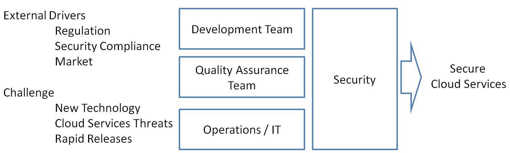
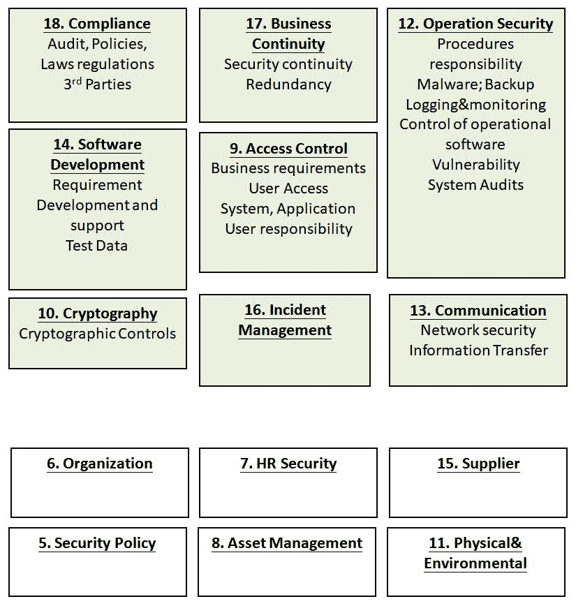
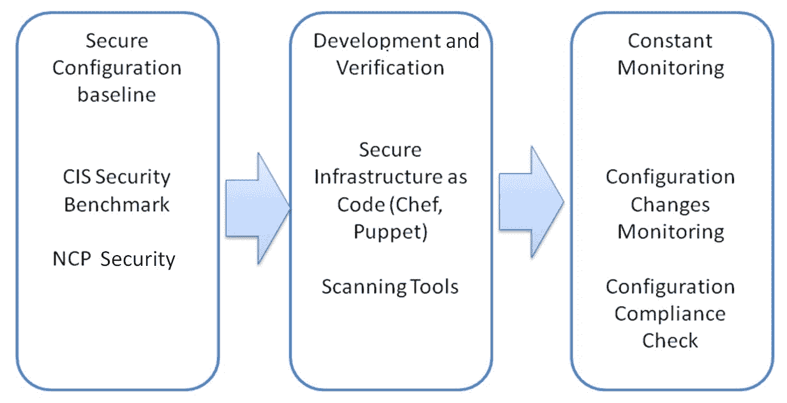
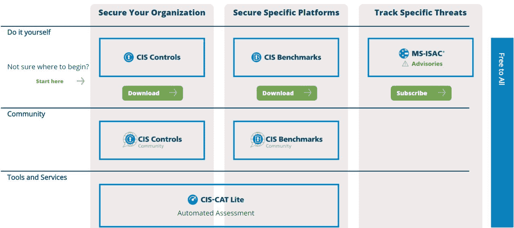
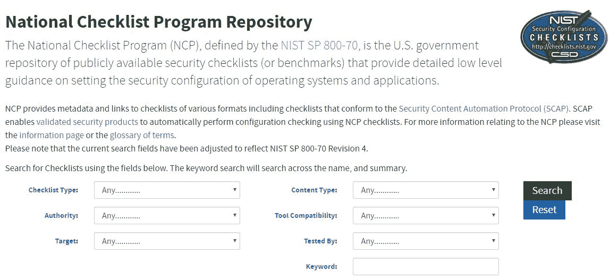
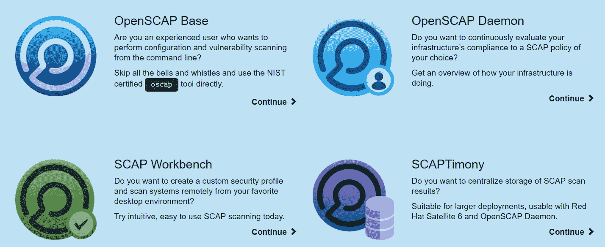
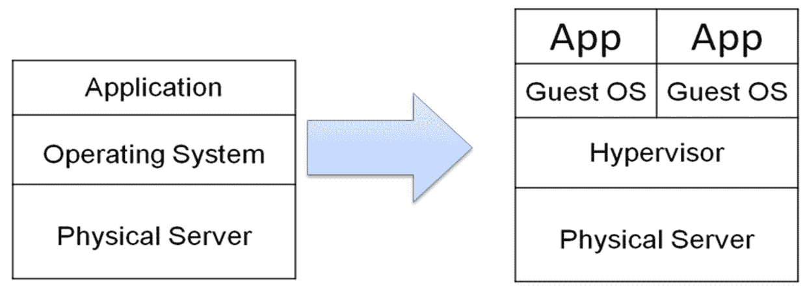
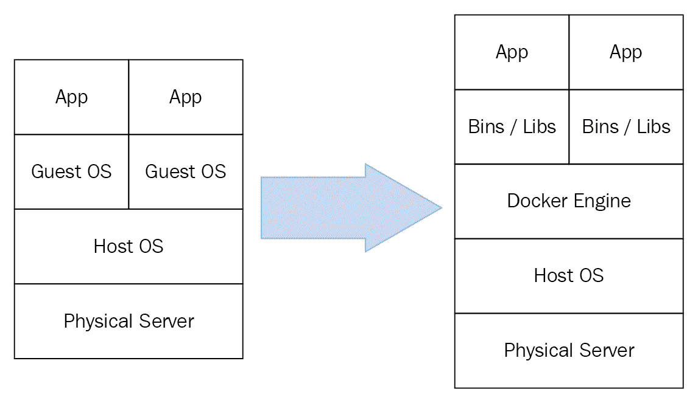
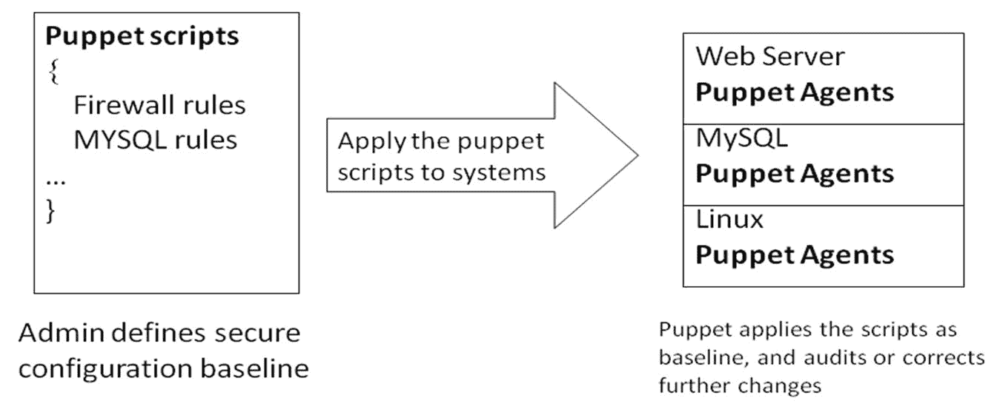
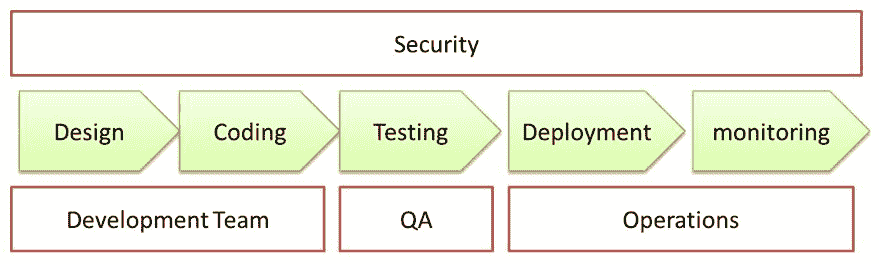

# 第一章：DevSecOps 驱动因素与挑战

由于云服务的快速发布、执法、安全事件和租户数据保护，安全对于云/互联网服务来说不可或缺。在开发生命周期中将安全活动从右向左转移，并在持续集成管道中内置安全实践，是 DevSecOps 的目标。

商业环境、文化、法律合规性和外部市场驱动因素与 DevSecOps 安全保证程序在组织中的推广方式相关。DevSecOps 或安全保证程序的管理涉及整个组织的所有业务单元，DevSecOps 的成功关键在于所有利益相关者达成共识，并同意目标和方法。

本章将涵盖以下主题：

+   安全合规性（ISO 2700x，FIPS，CSA-CCM）

+   法律/法律合规——**通用数据保护条例**（**GDPR**）

+   新技术（第三方、云、容器和虚拟化）

+   云服务攻击/滥用

+   快速发布

如下图所示，这就是外部驱动因素和挑战如何影响团队在提供安全云服务时的表现：

# 安全合规性

对于云服务来说，具备安全合规性是非常重要的。安全合规性不仅展示了云服务的安全控制如何符合安全标准，还表明了客户和合作伙伴对安全的信任。安全合规性提供了安全保证程序的概览，但不会具体说明应该应用哪种安全技术方法。对于频繁发布的云服务，持续监控和审计以满足安全合规性可能是一个巨大挑战。

尽管大多数云服务提供商已准备好符合安全合规性（ISO，PCI，FedRAMP，SOC 等），但确保数据安全和管理自身应用合规性评估仍然是云服务客户的责任。云服务客户和提供商都需要维护系统或应用的审计日志、配置清单和变更历史记录以进行合规性评估。合规性评估应被视为持续的活动——而不是一次性的审计检查。

本章将介绍关键的云服务安全合规性，作为构建安全保证程序的参考，并探讨这些安全合规性标准与 DevSecOps 的关系。

# ISO 27001

ISO 27001 是一个**信息安全管理体系**（**ISMS**）。它提供了组织级安全保障程序的概述。ISO 27001 不会规定技术安全方法，但提供了一整套安全管理程序。如图所示，上部分的段落可能与 DevOps 安全实践更直接相关，如合规性、业务连续性、操作安全、访问控制、软件开发、加密、事件管理和通信。这将作为进一步发展我们自己的 DevOps 安全程序的指导方针：

我们不会介绍 ISO 27001 的详细内容，但以下表格总结了 ISO 27001 与每个角色及 DevOps 团队的关系：

| **角色** | **公司/组织安全策略** | **运营或 DevOps 团队** | **开发团队** |
| --- | --- | --- | --- |
| ISO 27001 章节 | 5 信息安全政策 6 信息安全组织 7 人力资源安全 8 评估管理 15 供应商关系 11 物理和环境安全 | 9 访问控制 10 加密 12 操作安全 13 通信安全 17 业务连续管理的信息安全方面 16 信息安全事件管理 18 合规性；内部要求，如政策，以及外部要求，如法律 19 云服务控制 | 14 系统开发 10 加密 9 访问控制 |

# ISO 27017 和 ISO 27018

ISO 27018 主要用于云中的**个人可识别信息**（**PII**）保护。它是基于 ISO 27001 和 ISO 27002 的扩展安全合规。在 ISO 27001/27002 的基础上，ISO 27018 还额外定义了 PII 保护的安全要求。

ISO 27017 为服务提供商和云服务消费者提供了实施云服务安全控制的能力。ISO 27017 是 ISO 27002 的扩展，用于解决云特定的安全问题。

# 云安全联盟（CSA）

由于存在许多云安全合规方法，我们可能会因试图遵循每一个而感到沮丧。**云安全联盟（CSA）** **云控制矩阵**（**CCM**）将大多数安全合规方法整合到一个名为 CCM 的矩阵中。以应用和接口应用安全为例——CCM 包括所有与该领域相关的安全合规控制，如 ISO、FedRAMP 和 NIST 800-53，并定义了控制 ID。参考 CCM 的主要好处是，我们可以简单地专注于 CCM，并知道所有其他安全合规法规也将得到满足。

此外，CSA 提供了 **共识评估倡议问卷**（**CAIQ**）。这是一份用于云消费者或云服务提供商的“是/否”问卷，用于进行安全自我评估并了解安全控制的要求。**谷歌供应商安全评估问卷**（VSAQ）也提供了关于 Web 应用安全、安全与隐私程序、基础设施安全和物理及数据中心安全的安全评估问卷。

此外，如果您正在寻找主要的云安全威胁及其控制措施，**云安全联盟**（**CSA**）提供的云顶级威胁指南是一个很好的参考。在撰写本文时，CSA 已定义了 12 个主要云威胁，并提供了与威胁分析、CCM/控制 ID 和 CSA 安全指南参考领域的映射。以下表格展示了相关的 CSA 安全指南以及如何在您的组织中应用安全实践：  

| **CSA 安全指南** | **它是什么？** | **何时应用？** |
| --- | --- | --- |
| CSA 安全指南参考 | 云安全白皮书 | 如果您的组织需要云服务安全指南或白皮书，这可以作为一个好的参考。 |
| 云顶级威胁 | 12 个主要云威胁及其与威胁分析、CCM/控制 ID 和 CSA 安全指南参考领域的映射 | 它可以作为云威胁建模的基础。 |
| CAIQ | 是/否问卷 | 一个自我评估的“是/否”问题列表，用于了解现有的安全控制要求。 |
| CSA CCM | 一项全球统一的安全标准映射 | 这是一个极好的统一参考，包含了大多数安全合规标准（如 ISO 27001、PCI、NIST 等）。它是您审查安全标准合规性时唯一需要参考的矩阵。 |

# 联邦信息处理标准（FIPS）  

FIPS 主要定义了使用加密模块的最低安全要求。任何不打算获得 FIPS 证书的组织都应参考它。强烈建议您参考 *加密模块安全要求* 以了解哪些加密模块可能被认为是安全的、过时的或薄弱的。  

对于希望学习如何正确实现加密模块的开发人员，以下资源是推荐的：  

+   OWASP 加密存储备忘单。  

+   OWASP 加密指南  

+   OWASP 密钥管理备忘单  

以下是每种加密算法及其使用的最低安全要求总结：  

| **使用场景** | **不安全的加密算法**（密钥长度） | **仅限旧系统使用** | **推荐的加密算法** |
| --- | --- | --- | --- |
| 对称加密 | Blowfish, DES, Skipjack, RC4 | 仅在（三个密钥不相等时）使用 3DES | AES > 128 位 |
| 非对称加密 | RSA（< 1024 位） | RSA（1024 位） | RSA（> 1024 位） |
| 哈希 | MD5 | SHA1（1024 位） | SHA256 |
| 数字签名 | RSA（< 1024 位）DSA（< 1024 位）ECDSA（<= 160 位） | DSA（1024 位）RSA（1024 位） | RSA（>=2048 位）DSA（>=2048 位）ECDSA（>=256 位） |
| 赫尔曼密钥交换（DH） | DH（< 1024 位） | DH（1024-2047 位） | DH（>=2048 位）ECDH（> 256 位） |

# 互联网安全中心（CIS）与 OpenSCAP——保障您的基础设施安全

CIS 定义了安全基准，**国家检查单计划**（**NCP**），由 NIST SP 800-70 定义，提供了操作系统、数据库、虚拟化、框架和应用程序的安全配置指导。

IT 和运维团队主要负责确保基础设施的安全。然而，开发团队也可能在保障基础设施安全方面分担一些责任。例如，开发团队可能决定以容器的形式交付应用包，或应用基础设施即代码框架，如**Puppet**或**Chef**。这些技术允许开发团队在开发阶段就定义安全配置，而运维团队只需要在应用部署时应用该安全配置定义。

此外，开发团队的工作也是为每次发布的部署提供一份配置更改清单。这将使运维团队能够审查配置更改是否安全且适当。由于需要审查的配置复杂且数量庞大，因此采用扫描工具来检查所有配置是否安全，并符合行业最佳实践是必要的。云服务提供商可能会提供此类扫描服务或工具。在这里，我们推荐像 CIS 提供的开源工具 CIS-CAT Lite 和 OpenSCAP 等。

保障基础设施和平台安全的过程可以分为三个阶段。第一阶段是通过参考行业实践（如 CIS 或 NIST NCP）来定义安全配置基准。然后，我们可以使用 Chef 或 Puppet 等工具，确保每次部署都包含安全配置。最后阶段是对频繁的配置更改和安全合规性进行持续监控。

以下表格列出了典型的基础设施组件。CIS 为每个系统组件提供了安全配置建议，并提供了扫描工具，以验证安全最佳实践基准的符合情况。

CIS 提供了 CIS 基准，定义了操作系统、服务器软件、云服务、网络设备等的安全配置。它帮助运维团队理解如何保障和配置基础设施和平台的安全。

| **基础设施层** | **系统** |
| --- | --- |
| 网络服务 | Apache, Nginx, IIS |
| 数据库 | MS SQL, MySQL, Oracle, MongoDB |
| 虚拟化/容器 | VMware, Docker, Kubernetes |
| 网络 | Cisco 设备 |
| 操作系统 | Windows、Linux、Ubuntu、CentOS、SUSE |

除了 CIS 基准文件，CIS 还为基础设施或操作团队提供安全配置扫描工具。CIS 安全网站提供相关的安全配置扫描工具供下载。

来源：https://www.cisecurity.org/cybersecurity-tools/

# 国家检查清单计划（NCP）库

NCP 库为特定软件组件提供安全配置。例如，如果你在寻找 Apache 的安全配置或 CIS Apache，你可以使用 NCP 进行搜索。截图来自 NIST NCP（国家检查清单计划）。

来源：https://nvd.nist.gov/ncp/repository

# OpenSCAP 工具

OpenSCAP 类似于 CIS 安全基准，它也提供了一个安全配置基准。此外，OpenSCAP 还为操作或基础设施团队提供不同种类的工具，用于进行安全配置评估和扫描。根据需求，提供了四种工具，具体见下图：

来源：https://www.open-scap.org/tools/

# 法律和安全合规

欧盟的 GDPR（通用数据保护条例）于 2018 年 5 月生效，旨在保护所有欧盟公民免受隐私和数据泄露的威胁。根据 GDPR 常见问题解答：

“GDPR 不仅适用于位于欧盟境内的组织，还适用于所有处理和存储欧盟境内数据主体个人数据的公司，无论公司所在地。”

换句话说，如果一家公司在欧盟向客户提供服务，其数据处理必须完全符合 GDPR。从 DevSecOps 的角度来看，这与数据的收集、处理、存储、备份、修改、传输和删除等都相关，且必须以安全的方式进行。根据 GDPR 第 5 条，存在六项隐私原则：

+   合法性、公平性与透明度

+   目的限制

+   数据最小化

+   准确性

+   存储限制

+   完整性与保密性

与其他安全合规政策一样，GDPR 并未定义实现这一目标的技术方法。GDPR 可能对于工程团队来说仍然过于宏观，需要将其转化为软件安全需求、设计、威胁建模、工具等。下表总结了工程团队的典型安全实践：

| **阶段** | **隐私或敏感信息处理的常见安全实践** |
| --- | --- |
| 设计 | **隐私影响评估**（**PIA**） |
| 编码 |

+   数据掩码库

+   匿名工具箱

+   RAPPOR—隐私保护报告算法

+   加密存储（RSA，ASE）

+   安全擦除

+   安全通信协议（如 TLS v1.2、SSH v2、SFTP、SNMP v3）

+   Cookie 同意

+   数据保险库

+   密钥管理

|

| 测试 | OWASP 对弱加密的测试、错误处理测试、配置测试等 |
| --- | --- |
| 部署 |

+   OWASP 配置和部署管理测试

+   CIS 安全环境配置

+   Git 中的敏感信息

|

| 监控 |
| --- |

+   用于日志分析的 ELK

+   完整性监控（IDS/IPS）以监控任何未经授权的更改

+   CIS 安全配置监控

+   Git 中的敏感信息泄露

|

# 新技术（第三方、云、容器和虚拟化）

新技术如虚拟化、Docker 和微服务引入了新的软件交付方法，加速了应用程序的部署，但也带来了新的安全威胁和风险。我们将简要讨论这些新技术如何改变安全和 DevOps 的实践。

# 虚拟化

在虚拟化操作系统上安装应用服务是非常常见的。虚拟化技术有助于最大限度地利用物理机的资源，如 CPU、内存和硬盘。然而，虚拟化是一种共享操作系统技术，它还引入了如 VM 逃逸、信息泄露和拒绝服务等安全风险，影响在虚拟化上运行的应用程序。

客户操作系统虚拟化中的安全实践通常涉及操作系统和虚拟化的强化。以下是与虚拟化相关的一些关键安全配置。有关详细信息，请参考 CIS 基准：

+   限制虚拟机到 VMX 文件的消息传递

+   限制控制台连接共享

+   断开未经授权的设备（USB、DVD、串行设备等）

+   禁用**BIOS 启动规范**（**BBS**）

+   禁用客体与主机的交互协议处理程序

+   禁用主机和客体文件系统服务器

+   禁用 VM 控制台粘贴操作

+   禁用虚拟磁盘缩减

+   不向客户发送主机信息

以下图示展示了虚拟化的采用情况。虚拟化在物理服务器上增加了一个虚拟机监控器层，从而使虚拟化的客户操作系统可以在其上运行：

除了虚拟化的安全配置外，为虚拟化应用安全补丁也是运维或 IT 团队必须进行的操作。

此外，以下资源可能有助于您在漏洞数据库中查找**公共漏洞与暴露**（**CVE**）：

+   漏洞利用数据库 [`www.exploit-db.com/`](https://www.exploit-db.com/)

+   SecLists [`seclists.org/fulldisclosure/`](http://seclists.org/fulldisclosure/)

+   漏洞备注数据库 [`www.kb.cert.org/vuls/`](https://www.kb.cert.org/vuls/)

要查找特定产品或供应商的漏洞，请参考以下 URL 搜索 VMware 的相关信息：

+   [`cve.mitre.org/cgi-bin/cvekey.cgi?keyword=VMware`](https://cve.mitre.org/cgi-bin/cvekey.cgi?keyword=VMware)

+   [`www.cvedetails.com/vendor/**252/**Vmware.html`](https://www.cvedetails.com/vendor/252/Vmware.html)

# Docker

Docker 的引入为软件包的交付和安装提供了新的选择，可以成为在不使用完整独立操作系统虚拟机的情况下隔离不同应用程序的最佳方式之一。软件可以通过 Docker 打包成容器。容器像虚拟机镜像一样，包含了运行应用服务所需的一切，例如运行时、系统库和设置。虚拟机镜像和容器之间的关键区别在于，容器并不包含整个操作系统。容器只包含必要的系统库，每个容器在运行时共享同一个操作系统内核。因此，Docker 容器可以在几秒钟内启动，并且使用的内存和磁盘比虚拟化镜像少得多。

使用 Docker 还可以极大地帮助运维团队进行部署和安全配置，因为 Docker 容器包含了运行所需的所有配置和设置。要了解 Docker 安全实践，可以查看 *CIS Docker 基准* 和 *Docker 安全*，并参考 *进一步阅读* 部分。

以下是 Docker 的一些关键安全实践和配置：

+   为容器分配独立分区

+   更新的 Linux 内核

+   仅允许可信用户控制 Docker 守护进程

+   审计 Docker 守护进程、文件和目录

+   限制容器之间的网络流量

+   Docker 守护进程的 TLS 认证

+   不要将 Docker 绑定到另一个 IP/端口或 Unix 套接字

+   Docker 守护进程配置文件的权限

+   容器运行时（Linux 内核能力、SSH、端口、内存、CPU、IPC）

以下图表展示了虚拟化和 Docker 之间的关键区别。虚拟化是在客体操作系统层级，而 Docker 实际上是在应用程序层级进行隔离，并且共享相同的客体操作系统：

这是对 Docker 中已识别的已知安全漏洞的总结。

| **CVE ID** | **相关 CWE ID** | **描述** |
| --- | --- | --- |
| CVE-2014-5282 | 20 | Docker 在 1.3 之前没有正确验证镜像 ID，允许远程攻击者通过 **Docker load** 加载不可信的镜像来重定向到另一个镜像。 |
| CVE-2017-14992 | 20 | Docker-CE（也称为 Moby）及更早版本缺乏内容验证，允许远程攻击者通过构造的镜像层有效载荷发起拒绝服务攻击；即 Gzip 攻击。 |
| CVE-2017-7297 | 264 | Rancher Labs rancher server 1.2.0+ 存在漏洞，认证用户可以通过 API 调用禁用访问控制。此问题已在版本 rancher/server:v1.2.4、rancher/server:v1.3.5、rancher/server:v1.4.3 和 rancher/server:v1.5.3 中修复。 |
| CVE-2016-9962 | 362 | RunC 允许通过 runc exec 让附加的容器进程被容器的 pid 1 进行 ptrace 跟踪。这使得容器的主进程（如果以 root 身份运行）可以在初始化期间访问这些新进程的文件描述符，并可能导致容器逃逸或在进程完全放入容器之前修改 runC 状态。 |
| CVE-2014-0047 | n/a | Docker 1.5 之前允许本地用户通过涉及不安全的/tmp 使用的向量产生未指定的影响。 |

这里有一个查询特定漏洞的技巧。以'CVE-2014-0047'为例，只需在以下 URL 末尾替换 CVE ID 号即可。

+   [`cve.mitre.org/cgi-bin/cvename.cgi?name=CVE-2014-0047`](http://cve.mitre.org/cgi-bin/cvename.cgi?name=CVE-2014-0047)

+   [`nvd.nist.gov/vuln/detail/CVE-2014-0047`](https://nvd.nist.gov/vuln/detail/CVE-2014-0047)

# 基础设施即代码（IaC）

Puppet、Chef、Ansible 和 SaltStack 是应用 IaC 的工具。使用这些工具的关键优势是，任何系统配置都可以在设计阶段以文本文件的形式定义，且变化可以通过版本进行管理。这将帮助运维或开发团队构建安全配置基准，如文件权限、防火墙规则、Web 配置或 MySQL 连接。一旦安全配置基准定义完成，运维团队可以监控任何未经授权的更改，或将配置回滚到之前的特定版本。

例如，我们可能有一个为 Web 服务环境定义的安全防火墙基准规则，只允许端口`80`和`443`。操作团队只需使用其中一个工具（Puppet、Chef、Ansible、SaltStack）定义防火墙规则，框架就会应用这些规则，审核，并且如果其他端口因错误或其他服务部署而被意外打开，甚至会自动修正。

可在[`github.com/dev-sec`](https://github.com/dev-sec)访问的 DevSec 加固框架项目提供了 Ansible、Chef 和 Puppet 的安全配置基准模板脚本。

以下图表展示了 IaC（例如 Puppet）是如何工作的：

# 云服务的黑客攻击/滥用

CSA 关于云安全关注问题的调查已经确定了以下 12 个问题：

+   数据泄露

+   弱身份、凭证和访问管理

+   不安全的 API

+   系统和应用程序漏洞

+   账户劫持

+   恶意内部人员

+   **高级持续性威胁**（**APTs**）

+   数据丢失

+   不足的尽职调查

+   云服务的滥用和恶意使用

+   拒绝服务

+   共享技术问题

此外，服务滥用也成为大多数电子商务或购物网站的难题。我们以一个例子来了解黑客或不当用户如何从中获益。

# 案例研究 – 正在销售的产品

假设某在线购物商店将在 2 月 1 日 12:00 为前 100 名顾客提供某款新型号手机的 50%折扣。

# 黑客通常做什么？

对于这种利润达到 50%的销售活动，它对恶意用户有很大的吸引力。地下用户通常会采取一些行动，如大量注册用户账户。在短时间内，仅在促销前夕，可能会注册超过 10,000 个用户账户。销售开始时，他们会使用自动化脚本触发购买行为，并在几秒钟内完成订单。一旦他们下单或占用了所有手机，他们可能会以更高的价格转售，甚至可能不支付订单。

*这合法吗？* 这些行为遵循注册和购买的业务规则。尽管这些行为可能不违反法律，但可能被视为不当行为或滥用服务。因此，这种销售活动可能需要额外的业务规则和规范。毕竟，这并不是纯粹的黑客行为。我们将在后续章节中讨论这一点。这里，我们提供一些缓解措施的概述，这些措施可以通过业务规则或技术方法实现：

+   销售仅限于具有一定购买历史的客户

+   应用验证码以区分人类和机器

+   双因素认证和通过短信注册

+   检测和关联 IP、电话号码、电子邮件、账户 ID、物理地址和 GeoIP 位置

+   异常的页面浏览行为，如跳过产品直接进入购买页面

+   从同一 IP 或设备登录或注册异常大量行为

# 快速发布

对于云服务，快速、频繁和迭代发布非常常见。这通常推动了 DevOps 实践的需求。这既是一个机会，也可能是一个安全挑战。挑战在于，频繁的短周期发布可能没有足够的时间进行完整的安全测试。DevOps 实践有三个成熟度级别：

| **成熟度级别** | **已实现** | **技术采用** |
| --- | --- | --- |
| 持续集成 |

+   源代码仓库和版本控制

+   带有每日构建和单元测试的 CI 工作流

|

+   Jenkins

+   Git

+   单元测试

|

| 持续交付 |
| --- |

+   自动化部署到预生产环境

+   在预生产环境中的集成测试

+   部署到生产环境是手动完成的

|

+   IaC（Puppet）

+   Docker

|

| 持续部署 |
| --- |

+   在生产环境中的自动化部署和验收测试

+   生产环境的变更或配置管理

|

+   IaC（Puppet）

+   Docker

+   自动化验收测试

+   配置监控

|

DevOps 实践的采用意味着开发、QA、IT 和运维团队之间更多的协作，以及持续集成或持续交付工具的逐步采用。这为转向 DevSecOps 提供了良好的基础。根据现有 CI/CD 的成熟度，可以在现有的 CI/CD 框架上添加安全实践或工具。最有效且学习曲线最小的方式是不要改变现有的开发、QA、IT、运维团队的工作方式。围绕现有的 CI/CD 构建安全工具仍然是最佳方法。我们将在接下来的章节中进一步探讨这一点。

下图展示了开发、QA 和运维在整个 CI/CD 生命周期中涉及的安全性。

# 摘要

在本章中，我们讨论了驱动安全需求的外部因素，如安全合规性、法规和市场。此外，新技术的采用也带来了新的挑战，如 Docker、虚拟化、云服务和 IaC。

在安全合规性方面，我们简要讨论了 ISO 27001 以及 CSA 介绍的一些安全最佳实践/工具，如 CCM、云安全指南、CAIQ 和云顶级威胁。同时还讨论了 FIPS 在正确使用加密方面的重要性。在基础设施安全方面，介绍了 CIS 和 OpenSCAP。最后，欧盟 GDPR 法规规范并推动数据和隐私保护的安全要求。

基于所有这些安全挑战和合规规则，我们介绍了一个云服务的小案例研究，云服务可能被黑客攻击和滥用。此外，还探讨了哪些安全技术可能适用于 DevOps 实践。在接下来的章节中，我们将进一步讨论安全目标、度量标准和安全保障计划如何适用于不同类型的组织和实践。

# 问题

1.  FIPS 是否定义了加密的安全要求？

1.  以下哪个选项定义了主要关注个人数据隐私的安全合规性？

    1.  ISO 27018

    1.  FIPS

    1.  GDPR

    1.  CIS

1.  什么可以被视为云服务滥用？

    1.  账户共享

    1.  暴力破解登录

    1.  API 滥用

    1.  以上所有

1.  CIS 安全基准的用途是什么？

    1.  防病毒

    1.  定义操作系统、平台、数据库等的安全配置

    1.  防火墙

    1.  完整性

1.  在 DevOps 周期中，哪个角色涉及安全实践？

    1.  QA

    1.  RD

    1.  运维

    1.  以上所有

1.  基础设施即代码（IaC）如何帮助安全运维团队？

    1.  病毒检测

    1.  安全配置

    1.  入侵检测

    1.  加密

1.  以下哪个不是隐私原则？

    1.  欺骗

    1.  目的限制

    1.  存储限制

    1.  准确性

# 进一步阅读

阅读以下链接以获取更多阅读资料：

+   **CSA（云安全联盟）安全白皮书：**[ ](https://cloudsecurityalliance.org/download/)[`cloudsecurityalliance.org/download/`](https://cloudsecurityalliance.org/download/)

+   **NIST 在系统开发生命周期中的安全考虑**：[`nvlpubs.nist.gov/nistpubs/legacy/sp/nistspecialpublication800-64r2.pdf`](https://nvlpubs.nist.gov/nistpubs/legacy/sp/nistspecialpublication800-64r2.pdf)

+   **ISO 29100 信息技术安全技术隐私框架**：[`www.iso.org/standard/45123.html`](https://www.iso.org/standard/45123.html)

+   **NIST 国家检查表计划** [`nvd.nist.gov/ncp/repository`](https://nvd.nist.gov/ncp/repository)

+   **OWASP 加密指南** [`www.owasp.org/index.php/Guide_to_Cryptography`](https://www.owasp.org/index.php/Guide_to_Cryptography)

+   **NVD（国家漏洞数据库）** [`nvd.nist.gov/`](https://nvd.nist.gov/)

+   **CVE 详情** [`cvedetails.com/`](https://cvedetails.com/)

+   **CIS 网络安全工具** [`www.cisecurity.org/cybersecurity-tools/`](https://www.cisecurity.org/cybersecurity-tools/)

+   **ENISA 虚拟化安全性**：[`www.enisa.europa.eu/publications/security-aspects-of-virtualization/at_download/fullReport`](https://www.enisa.europa.eu/publications/security-aspects-of-virtualization/at_download/fullReport)

+   **CIS 基准还提供了 VMware、Docker 和 Kubernetes 的安全指南**：[`www.cisecurity.org/cis-benchmarks/`](https://www.cisecurity.org/cis-benchmarks/)

+   **OpenStack 对虚拟化层的加固提供了构建虚拟化层的安全指南**：[`docs.openstack.org/security-guide/compute/hardening-the-virtualization-layers.html`](https://docs.openstack.org/security-guide/compute/hardening-the-virtualization-layers.html)

+   **Docker 安全性** 在 [`docs.docker.com/engine/security/security/`](https://docs.docker.com/engine/security/security/)
