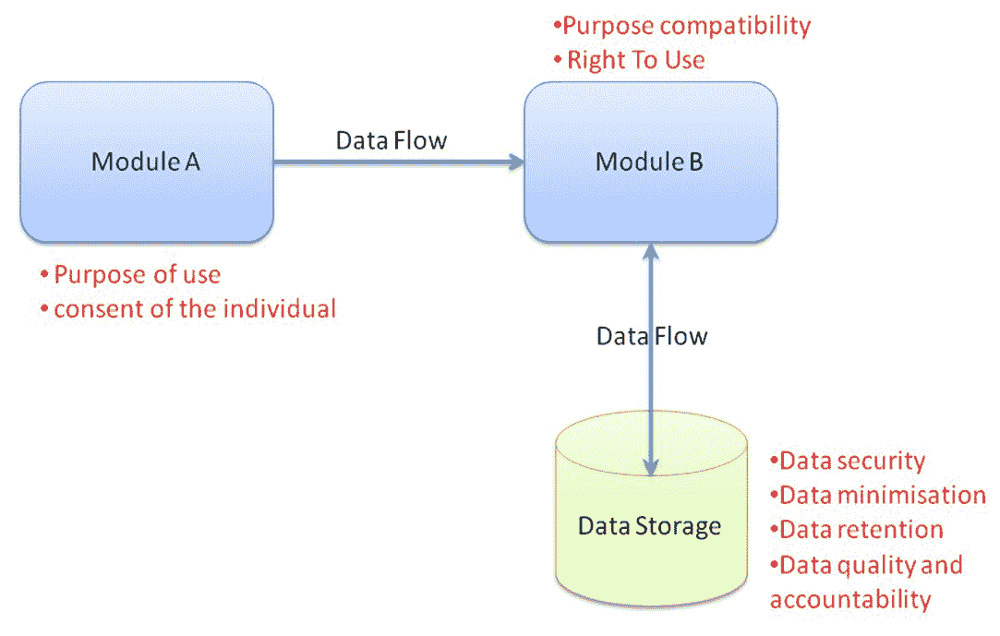
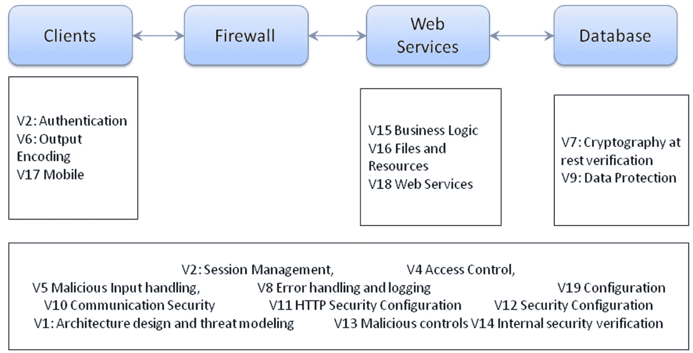

# 第二章：安全目标和度量

在前一章中，我们讨论了 DevSecOps 的挑战和业务驱动因素。在本章中，我们将讨论安全目标和度量。DevSecOps 的采用是一个持续的学习旅程，需要大量的利益相关者参与、流程优化、业务优先级冲突、安全工具定制以及安全知识学习。本章将基于功能角色的视角，为您提供一些实用的技巧、挑战和常见实践，并且还将以 GDPR 为例，解释如何进行隐私影响评估。

本章将涵盖以下主题：

+   组织目标

+   开发目标/度量

+   QA 目标/度量

+   运营目标/度量

# 组织目标

任何组织的安全最终目标是保护客户数字资产。我们将在这里讨论如何为安全保证程序和 DevSecOps 定义组织级分阶段目标的目标。

**开放式 Web 应用安全项目** (**OWASP**) 和 **软件保证成熟度模型** (**SAMM**) 治理在考虑组织安全目标时定义了三个关键领域：

+   **战略和度量**：建立软件安全保证程序的框架

+   **策略和合规性**：专注于确保满足外部法律或法规要求（如 GDPR 或 ISO 27001）

+   **教育和指导**：这是为了进行安全意识培训和特定角色的安全能力，以执行 DevOps

以下是与业务目标对齐的一些典型 DevSecOps 安全实践。DevSecOps 的目标可能不仅受业务目标的需求影响，还受安全环境成熟度的影响：

+   欧盟 GDPR 的安全合规性

+   OWASP SAMM 自评安全成熟度达到 2 级

+   每个项目准备的安全需求指南和基线

+   采用安全编码自动化工具供开发团队使用

+   威胁情报安全监控

+   准备好的安全设计知识库供所有开发人员参考

+   安全测试工具或平台已准备好用于 QA 使用

除了 OWASP SAMM 外，NIST 800-160《系统安全工程》也是软件工程过程全生命周期安全工程方法和实践的良好参考。

以**通用数据保护条例** (**GDPR**) 安全合规要求为例，审查如何在软件工程生命周期中实施数据隐私。每当企业决定在欧盟市场销售服务时，组织都必须遵守 GDPR。从组织级安全管理的角度来看，建议在策略和度量、安全政策以及安全意识培训方面规划 GDPR 合规性。

# 战略和度量

为了识别当前组织的业务风险概况，特别是 GDPR 合规性，建议定义**隐私影响评估**（**PIA**）模板和流程，审查当前数据处理风险。PIA 是一个工具，通过以下评估，帮助识别在开发和运营周期中的隐私风险。

+   是否应收集该信息

+   收集的信息类型，以及与个人可识别信息（PII）相关的信息

+   保护和处理信息的流程，以减轻任何隐私风险。

+   用户收集、处理、编辑或删除信息的选项和明确同意。

请参阅[`www.bitkom.org/noindex/Publikationen/2017/Leitfaden/170919-LF-Risk-Assessment-ENG-online-final.pdf`](https://www.bitkom.org/noindex/Publikationen/2017/Leitfaden/170919-LF-Risk-Assessment-ENG-online-final.pdf)以获取 PIA 资源和模板。

# 政策和合规性

定义所有项目需遵循的一般 GDPR 安全要求和发布门控。此外，组织可以定义以下安全政策：

+   发布日期的最低安全要求

+   身份和访问管理、隐私、密钥管理、加密和会话管理

+   安全设计最佳实践和模板

提供常见安全要求作为模板或政策供项目团队遵循可能是一个不错的做法。此外，提供或建议相关的实施框架，帮助将其构建到产品中，将更加有效，后续章节中我们将进行讨论。

# 教育和指导

教育和安全意识培训可能会根据企业的需求、文化、角色和内容而有所不同。如果 GDPR 合规性是企业目标之一，教育应当支持该目标。以下是一些示例：

+   隐私和数据处理安全意识培训

+   为开发人员、QA、DevOps 或 IT 团队提供角色特定的隐私信息培训

+   为员工建立一个案例研究知识库、常见问题解答和数据处理模板。

# 开发目标/度量标准

开发团队的安全目标是交付安全的设计和实现。根据 OWASP SAMM 实践，在构建阶段需要考虑三个关键方面：

+   威胁评估

+   安全要求

+   安全架构

尽管设计和实施审查通常也是开发团队活动的一部分，我们将在进一步讨论中考虑这些内容。

# 威胁评估

为了进行有效的威胁评估，建议项目团队使用以下指导方针或模板：

| **威胁建模工具/模板** | **理由和目的** |
| --- | --- |
| 威胁和缓解知识库 | 威胁和缓解知识可以帮助团队从知识列表中选择对项目最相关的内容，而不是从零开始。例如，CAPEC 或 ATT&CCK 也是很好的参考。 |
| 工具或威胁建模模板 | 一个模板或工具可以帮助团队交付一致质量的威胁建模报告。 |

此外，威胁建模分析不仅限于开发团队的角色，它还涉及整个团队，包括研发、QA 和 DevOps。

如果团队正在寻找模板或工具，以下资源是建议的起点。我们将在第七章中更详细地讨论威胁建模分析，*威胁建模实践与安全设计*。

+   **常见攻击模式列举与分类（CAPEC）**：[`capec.mitre.org/data/definitions/1000.html`](http://capec.mitre.org/data/definitions/1000.html)

+   **对抗性战术、技术与常识（ATT&CK）**：[`attack.mitre.org/wiki/Main_Page`](https://attack.mitre.org/wiki/Main_Page)

+   **Microsoft SDL 威胁建模工具**：[`www.microsoft.com/en-us/sdl/adopt/threatmodeling.aspx`](https://www.microsoft.com/en-us/sdl/adopt/threatmodeling.aspx)

+   **OWASP 威胁建模备忘单**：[`www.owasp.org/index.php/Threat_Modeling_Cheat_Sheet`](https://www.owasp.org/index.php/Threat_Modeling_Cheat_Sheet)

+   **特权提升（EoP）卡牌游戏**：[`www.microsoft.com/en-us/sdl/adopt/eop.aspx`](https://www.microsoft.com/en-us/sdl/adopt/eop.aspx)

+   **OWASP Cornucopia**：[`www.owasp.org/index.php/OWASP_Cornucopia`](https://www.owasp.org/index.php/OWASP_Cornucopia)

如果你正在寻找威胁与缓解的知识库，CAPEC 和 ATT&CK 都提供了非常好的参考。如果你需要绘制图表来进行威胁分析，Microsoft 的 SDL 威胁建模工具可能会有所帮助。如果你希望给团队快速介绍威胁建模，可以参考 OWASP 威胁建模备忘单。最后，EoP 和 OWASP Cornucopia 提供了卡牌游戏，使得威胁建模过程更加互动，并促进团队成员之间的参与。

# GDPR 威胁评估

典型的威胁评估包括**欺骗、篡改、否认、信息泄露、破坏、升级**（**STRIDE**）。当涉及到 GDPR 合规评估时，**隐私影响评估**（**PIA**）将重点关注每个模块如何收集、处理和删除个人可识别信息及隐私数据。除了 STRIDE，PIA 还关注个人数据保护的原则。

请参考下图的 PIA，以探索数据流：



# 交付物和开发团队自我评估

开发的交付物包括威胁建模、设计和编码。下表总结了开发团队自我评估的示例指标：

| **交付物** | **自我评估检查表** |
| --- | --- |
| 威胁建模分析报告 | 威胁建模分析是否涵盖了 STRIDE 六大威胁分析？图表中是否包括了所有组件、数据流和信任边界？所有的威胁缓解措施是否有效并已纳入发布计划？威胁建模分析是否覆盖了所有新特性和之前发布的风险？将有效的威胁缓解措施作为案例分享。 |
| 安全编码分析报告 | 是否有任何静态安全代码扫描工具适用于整个项目，包括遗留部分？所有扫描结果和误报警告是否已被审查和检查？安全编译选项是否已正确配置？所有危险或不安全的 API 是否已识别并移除？有效的代码扫描工具、定制扫描规则、缓解方法或常见编码问题案例的知识分享。 |
| 安全架构 | 案例研究。交付通用安全框架。应用行业最佳实践安全框架。 |

# 安全需求

安全需求取决于业务环境、法规和安全合规性。组织应定义一个最低的预期安全需求基准，作为发布门槛的一部分。根据严重性和影响，发布计划可能会有不同条件，如依赖热修复准备、直到问题修复后才发布、带有缓解保护的发布等。

拥有一个安全需求发布基准将有助于在利益相关者之间建立共识，比如 IT、开发团队、安全团队等。否则，业务团队可能希望发布，即使存在安全缺陷，而安全团队可能不同意发布。

这是市场时间与安全成熟度水平之间的权衡。目标是建立适当（而非完美）的安全控制，以保护数字资产，在安全质量和市场发布时间之间找到平衡。

OWASP **应用安全验证标准** (**ASVS**) 定义了三个安全需求级别：

|  | **应用场景** | **威胁保护** |
| --- | --- | --- |
| ASVS 级别 1 | 这是所有应用程序的最低安全要求。 | 简单且易于利用的漏洞。 |
| ASVS 级别 2 | 处理敏感数据的应用程序。 | 利用特定工具和目标攻击来攻击应用程序中的弱点。 |
| ASVS 级别 3 | 需要最高安全级别的应用程序，如电子商务、健康系统、股票交易所或关键服务。 | 攻击级别 3 应用程序需要更深入的架构或代码分析。 |

此外，OWASP 安全软件合同附件定义了一个软件合同模板，涵盖外包项目的安全需求：[Https://www.owasp.org/index.php/OWASP_Secure_Software_Contract_Annex/](https://www.owasp.org/index.php/OWASP_Secure_Software_Contract_Annex/)。

请参见以下图表，展示 OWASP ASVS 要求与 Web 架构的映射：



在组织层面，保持推荐的安全框架或模块清单可以帮助项目团队不仅在成熟框架之上构建服务，还能减少已知的安全风险。不要重复发明轮子。一个组织应该将这些常见的安全模块作为其安全知识库的一部分。以下是与 OWASP ASVS 对应的常见关键安全模块映射。这并不是一个全面的清单；如果你需要寻找其他开源模块，BlackDuck Open Hub 可能是一个很好的数据库：[www.openhub.net](http://www.openhub.net)。

| **安全需求** | **开源安全框架** |
| --- | --- |
| V2: 身份认证 | OpenSAML2 for JavaCentral Authentication ServiceHostapd |
| V3: 会话管理 | Shiro, Spring Security |
| V4: 访问控制 | Shiro, Spring Security, OpenSAMLOpenLDAP, Apache Directory Studio |
| V5: 恶意输入处理 | Apache Jakarta commons validatorBean ValidationOWASP Java HTML Sanitizer |
| V6: 输出编码/转义 | Apache Santuario, Apache XML Security for JavaOWASP Java Encoder Project |
| V7: 加密技术 | OpenSSL, BouncyCastle, scrypt, KeycZar |
| V8: 错误处理与日志记录 | Apache Log4j, Apache Jakarta 通用日志记录 |
| V9: 数据保护 | Hashicorp Vault, Google Rappor, 私密数据共享接口, UTD Anonymization 工具集, letsEncrypt, BetterCrypto, mbed TLS |
| V10: 通信安全 | OpenSSL, OpenSSH, JSCH |
| V11: HTTP 安全配置 | OpenSCAP |
| V12: 安全配置 | OpenSCAP |
| V13: 恶意控制 | VisualCaptcha |
| V14: 内部安全 | 本节已合并到 V13。 |
| V15: 业务逻辑 | 不适用 |
| V16: 文件与资源 | ProjectSend, LinShare |
| V17: 移动安全 | VisualCaptcha |
| V18: 网络服务 | Shiro |

# QA 目标/指标

在验证的这个阶段，QA 的角色是评估与软件安全相关的问题、代码级漏洞、配置错误或导致重大安全风险的逻辑错误等。OWASP SAMM 定义的验证阶段关键安全活动包括设计审查、实施审查和安全测试。由于我们将在后续章节中讨论软件安全验证的详细信息，这里重点介绍本阶段的一些关键实践。

# 设计审查

在实践中，安全设计审查可以视为低级威胁建模。设计审查时建议关注以下内容：

+   安全合规检查清单

+   安全需求检查清单（OWASP ASVS）

+   Top 10 安全设计问题

+   先前版本中的安全问题

+   客户或市场反馈的安全问题

当我们进行针对顶级安全问题的设计审查时，我们也可以参考一些行业实践，如 OWASP Top 10 和 CWE/SANS Top 25 最危险的软件错误。同时，项目团队也可以基于历史记录或客户反馈，制定自己的顶级安全问题：

+   **OWASP Top 10**: [`www.owasp.org/index.php/Category:OWASP_Top_Ten_Project`](https://www.owasp.org/index.php/Category:OWASP_Top_Ten_Project)

+   **CWE/SANS Top 25 最危险的软件错误**: [`cwe.mitre.org/top25/`](http://cwe.mitre.org/top25/)

此外，我们还可以审查设计是否能够有效缓解我们在威胁评估阶段分析的安全风险。ATT&CK 也是设计审查的一个很好的参考来源，因为它列出了威胁的技术以及缓解建议：

+   **ATT&CK 对抗战术、技术与常识**: [`attack.mitre.org/wiki/Main_Page`](https://attack.mitre.org/wiki/Main_Page)

# 实施审查

实施审查涉及开发团队中的以下关键活动：

+   安全编码

+   选择可靠且安全的第三方组件

+   安全配置

由于我们将在后续部分讨论安全配置，本节将重点讨论第三方组件和安全编码。自动化的安全代码扫描被认为是审查的最有效方式。对于安全代码审查，有一些不同的技术方法。

# 第三方组件

对于第三方组件的管理与审查，建议遵循以下安全指南：

+   **第三方软件评估检查表**：

这将使每个项目能够遵循一致的标准来引入外部第三方软件组件。

+   **项目推荐使用的第三方软件**：

拥有一个内部的第三方组件数据库可以让项目团队交叉参考哪些项目可能使用了第三方组件以及其集成方式。

+   **第三方组件的 CVE 状态**：

任何第三方组件都可能引入安全风险。将安全补丁更新的跟踪和规划作为运维团队的常规任务。

# IDE 插件代码审查

为代码审查配置 IDE 插件可以帮助开发者在提交代码之前，就能现场学习并纠正安全代码问题。这是最有效、对开发者来说挑战最小的安全编码方式。然而，由于它是逐行静态代码扫描，并且无法分析整个源代码的上下文，扫描结果可能会出现一些误报。

# 静态代码审查

静态代码扫描工具在日常构建中使用，或在代码提交进行扫描时使用。这是识别软件开发初期安全问题的最有效方法。有多种静态代码扫描技术。如果你希望进一步评估这些工具，可以参考 OWASP 基准项目（[`www.owasp.org/index.php/Benchmark`](https://www.owasp.org/index.php/Benchmark)）：

| **技术** | **它是什么？** | **示例** |
| --- | --- | --- |
| **静态应用程序安全测试**（**SAST**） | 静态代码扫描。开发人员可以将此工具作为 IDE 插件的一部分使用，或者与日常构建一起触发扫描。由于易于使用，因此被视为基础的代码扫描工具。 | FindSecbugs，Fortify，Coverity，klocwork |
| **动态应用程序安全测试**（**DAST**） | DAST 通过向运行时 Web 应用程序发送攻击负载来识别安全问题，代替代码审查。 | OWASP ZAP，BurpSuite |
| **互动应用程序安全测试**（**IAST**） | IAST 不仅进行 DAST 安全测试，还可以通过 RASP 代理在源代码级别识别根本原因/原因。简单来说，IAST = RASP 代理 + DAST。 | CheckMarks，Varacode |
| **运行时应用程序安全保护**（**RASP**） | RASP 通常用于 Web 应用防火墙，因为它可以实时检测攻击并采取缓解措施。 | OpenRASP，参考[`github.com/baidu/openrasp`](https://github.com/baidu/openrasp) |

# 目标代码审查

此外，我们还可以通过识别相关代码模式，针对特定的安全问题进行定位和聚焦。这也是一种**静态应用程序安全测试**（**SAST**），但更侧重于具体问题。这是审查特定类型安全漏洞的最有效方法。例如，当涉及到加密时，以下 Java API 被认为是不安全的，应该避免使用：

```
MD5; RC4; SH1; DES; skipjack, SEAL, blowfish, random
```

OWASP 代码审查项目和 SEI CERT 编码标准是很好的参考。如果需要其他代码审查过程的技巧，请参阅第八章，*安全编码最佳实践*。

+   OWASP 代码审查项目 [`www.owasp.org/index.php/Category:OWASP_Code_Review_Project`](https://www.owasp.org/index.php/Category:OWASP_Code_Review_Project)

+   SEI CERT 编码标准 [`wiki.sei.cmu.edu/confluence/display/seccode/SEI+CERT+Coding+Standards`](https://wiki.sei.cmu.edu/confluence/display/seccode/SEI+CERT+Coding+Standards)

# 安全测试

安全测试的目标是确保整体应用程序符合安全要求、行业标准、客户期望和监管控制。从组织层面来看，建议在发布标准、测试计划/用例和自动化测试工具包方面准备好以下工具和知识：

+   **安全发布标准**：

发布标准定义了质量发布门的最低要求。它们可以帮助业务利益相关者就何时发布软件达成共识。拥有这样的基准将有助于减少开发、质量保证和 DevOps 团队之间的大量沟通问题或争论。

+   **安全测试计划/案例**：

OWASP 测试指南和 OWASP ASVS 为安全测试计划/案例提供了非常好的参考基础。对于移动安全测试，请参考 OWASP 移动安全测试指南。[`www.owasp.org/index.php/OWASP_Mobile_Security_Testing_Guide`](https://www.owasp.org/index.php/OWASP_Mobile_Security_Testing_Guide)

+   **自动化测试工具包**：

安全自动化的最佳方法是将安全工具与现有的 CI/CD 框架（如 Jenkins）集成。这可能需要安全工具具备 CLI 或 RESTful API 接口，并能够输出 XML/HTML/JSON 格式的报告。

为开发和质量保证团队构建内部工具包进行安全测试非常重要。如果您的组织刚刚开始构建内部安全测试工具集，Kali Linux 中的工具集列表是一个不错的起点。Kali Linux 工具列表提供了多个领域的完整安全测试工具集。工具列表请访问：[`tools.kali.org/tools-listing`](https://tools.kali.org/tools-listing)。对于移动测试，请参考**移动安全测试指南**（**MSTG**）：[`github.com/OWASP/owasp-mstg/`](https://github.com/OWASP/owasp-mstg/)。

您可以考虑构建一个内部的安全测试平台，配备所有准备好的安全工具。一旦软件包被部署，安全测试平台将触发进行各种类型的安全测试。例如，**软件保障市场**（**SWAMP**）提供基于云的源代码安全分析，支持多种编程语言和工具：[`www.mir-swamp.org/`](https://www.mir-swamp.org/)。

# 操作目标/指标

基于 SAMM，操作目标可以分为三个功能：问题管理、环境加固和操作启用。我们来讨论一下每个功能中的一些最佳实践。

# 问题管理

这里的**问题管理**指的是如何处理安全事件、漏洞问题或安全漏洞。应该建立一个漏洞管理流程，涉及 DevOps 和开发团队的合作。

在组织级别的安全保障计划中，必须定义安全事件和漏洞响应流程，以及根本原因分析模板。NIST SP800-61 是组织建立安全事件响应流程的良好参考。它将事件处理行动清单分为三个阶段：检测与分析；遏制、根除与恢复，以及事件后活动。

该表列出了安全事件处理周期中的典型安全活动：

| **阶段** | **开发团队** | **DevOps/IT 团队** |
| --- | --- | --- |
| 漏洞接收 | 初步评估接收到的漏洞。给安全问题初步的 CVSS 评分，以了解其严重性和影响级别。事件响应团队（包括 DevOps、开发和 IT）讨论行动计划和初步响应。 |
| 内部/外部通信 |
| 根本原因分析 | 技术和开发团队将调查安全问题，如哪些 API 引发了问题、数据流可能产生的影响、使用了哪些工具或载荷，并提出修复计划。 | IT 或 DevOps 可能会检查它是否是已知的 CVE 或漏洞，并查看是否有可用的补丁。如果可以应用防火墙或虚拟补丁安全控制来缓解问题，还需要分析其他云服务或接口是否也存在类似问题。 |
| 缓解措施 | 代码更改及相关影响服务，安全配置更改。 | 防火墙安全策略 虚拟补丁安全规则 安全补丁部署 安全配置更改 |
| 部署与验证 | 部署与验证。 |

除了有行动清单外，最好还要有漏洞根本原因分析模板。根本原因模板将帮助事件响应团队了解应遵循的步骤、如何收集发现结果以及应进行哪些根本原因分析。

# 环境加固

环境加固中的组织级安全策略应至少涵盖：

+   安全配置基准

+   持续监控机制

安全配置基准定义了什么是安全的，监控机制确保所有配置始终保持安全。

# 安全配置基准

安全配置指南包括操作系统、服务器、通信协议、软件、Web 服务、数据库、虚拟化等。强烈建议参考 CIS 基准（[www.cisecurity.org](http://www.cisecurity.org)）作为基准：

|  | **常见软件组件** |
| --- | --- |
| 数据库 | MySQL, SQL Server, Oracle |
| Web 服务 | Apache Tomcat, NginX |
| 虚拟化 | VMWare, Docker |
| 操作系统 | Linux（CentOS、REdHat、Suse、Ubuntu），Windows Server |

# 持续监控机制

除了有安全配置基准外，还应有一个通用策略来定义应扫描哪些内容以及可以使用哪些工具：

|  | **目的** | **开源工具** |
| --- | --- | --- |
| **常见漏洞与暴露** (**CVE**) | 了解云服务是否存在任何已知的公共漏洞。参考[`cve.mitre.org/`](https://cve.mitre.org/)。 | OpenVAS, NMAP |
| **完整性监控** | 确定主要系统配置文件是否已被篡改。 | OSSEC |
| **安全配置合规性** | 安全配置以符合行业最佳实践。 | OpenSCAP([`www.open-scap.org/`](https://www.open-scap.org/)) |
| **敏感信息暴露** | 审查配置文件中是否存在任何个人身份信息、密钥或秘密泄露。 | 该领域没有特定的开源工具，但我们可以定义特定的正则表达式模式来扫描敏感信息。 |

# 操作支持

操作支持主要关注开发团队与 DevOps/IT 团队之间的互动。运营团队的典型活动包括将软件包部署到生产环境，确保每次软件发布的完整性，确保通信协议的安全性，确保配置的安全性，以及修复软件漏洞的更新。以下三项被认为是开发团队将软件发布交付给运营团队进行生产部署审查时必须具备的事项。

+   应用程序部署的代码签名

+   应用程序通信端口矩阵

+   安全的应用程序配置

# 应用程序部署的代码签名

代码签名的目标是确保软件包的完整性和真实性。它确保应用程序没有被修改，并确定该应用程序的来源是由特定的供应商签名的。代码签名不仅仅是一个指南或流程，它是持续集成构建过程的一部分。

# 应用程序通信端口矩阵

服务通信端口矩阵的目的是让 IT/DevOps 团队了解使用了哪些通信端口/协议。通信端口列表将帮助安全团队进行必要的防火墙配置调整或监控。这还将帮助 IT/DevOps 团队建立网络通信基线，并能够识别不寻常的端口或通信流量。下面是一个示例通信端口矩阵：

| **源服务** | **源 IP** | **源端口** | **目标服务** | **目标端口** | **协议** | **用途** | **如何配置** |
| --- | --- | --- | --- | --- | --- | --- | --- |
| `Service A` | `10.1.1.1` | `80` | `Service B` | `8080` | `10.1.1.2` | `REST API` | `/ect/nginx.conf` |

# 应用程序配置

应用程序配置列表定义了服务或应用程序配置的列表，并包含变更历史信息。其目的是允许 DevOps/IT 团队管理安全配置，并监控任何未经授权的更改。配置列表可能涵盖操作系统、虚拟化、Web 服务、数据库以及特定于目标服务的框架。这些配置通常通过基础设施即代码（如 Puppet 或 Chef）来完成。基础设施即代码使得在实施阶段也能实现安全配置，并允许开发与运维团队之间更轻松的协作。

# 总结

本章我们从不同角度基于 OWASP SAMM 框架讨论了安全实践。我们讨论了不同角色的安全活动，如安全管理、开发、质量保证和运营团队。

首先，从安全管理的角度来看，包括组织目标、政策和教育。我们以 GDPR 合规为例，展示了安全管理中可以进行的规划。

对于开发团队，关键的安全活动包括威胁评估、安全需求和安全架构与编码。尽管安全编码在开发阶段也被认为是关键，但我们将讨论转移到了安全代码验证阶段。在威胁评估方面，我们介绍了一些行业工具、最佳实践，甚至是卡牌游戏。我们以 GDPR 隐私评估为例，解释了如何执行 PIA（隐私影响评估）。对于自我评估，我们列出了开发团队的关键交付成果。我们还讨论了 OWASP ASVS 安全需求，以及 ASVS 如何与网页框架实施相结合，并提供了建议的开源组件。

在验证方面，包括设计审查、实施审查和安全测试。我们讨论了设计审查的关键考量以及 OWASP 十大安全风险。还讨论了不同类型的安全编码审查工具。安全测试包括发布标准、测试计划和自动化测试工具包。毕竟，自动化安全测试是 DevOps 中的终极目标。

运营活动主要包括安全问题管理、环境加固和运营支持。向 DevSecOps 发展，这些活动不仅高度涉及运营团队本身，还包括开发和 QA 团队。我们举了应用程序通信端口矩阵和配置清单等例子，并分析了安全事件的根本原因。

在下一章节中，我们将讨论安全保障项目和组织，以及组织或文化如何在组织中执行安全程序。

# 问题

1.  OWASP SAMM 是否代表软件保障成熟度模型？

1.  以下哪些是在 OWASP 安全治理中定义的？

    1.  策略与指标

    1.  政策与合规性

    1.  教育与指导

    1.  以上所有

1.  根据 OWASP SAMM，在构建阶段应考虑哪些事项？

    1.  安全架构

    1.  威胁评估

    1.  安全需求

    1.  以上所有

1.  以下哪项不是威胁建模的工具或技术？

    1.  CAPEC

    1.  ATT&CK

    1.  OWASP Cornucopia

    1.  GDPR

1.  在 GDPR 中，我们可以应用哪些安全实践进行隐私评估？

    1.  PIA 隐私影响分析

    1.  渗透测试

    1.  问题管理

    1.  ISO 27001

# 进一步阅读

+   **GDPR 隐私影响评估**: [`gdpr-info.eu/issues/privacy-impact-assessment/`](https://gdpr-info.eu/issues/privacy-impact-assessment/)

+   **对抗性战术、技术与常识**: [`attack.mitre.org/wiki/Main_Page`](https://attack.mitre.org/wiki/Main_Page)

+   **SDL 威胁建模工具**: [`www.microsoft.com/en-us/sdl/adopt/threatmodeling.aspx`](https://www.microsoft.com/en-us/sdl/adopt/threatmodeling.aspx)

+   **权限提升（EoP）卡牌游戏**: [`www.microsoft.com/en-us/sdl/adopt/eop.aspx`](https://www.microsoft.com/en-us/sdl/adopt/eop.aspx)

+   **SP 800-100 信息安全手册：管理者指南** [`csrc.nist.gov/publications/detail/sp/800-100/final`](https://csrc.nist.gov/publications/detail/sp/800-100/final)

+   **软件保障市场**: [`www.mir-swamp.org/`](https://www.mir-swamp.org/)

+   **NIST 软件保障参考数据集中的资源**: [`samate.nist.gov/SARD/around.php`](https://samate.nist.gov/SARD/around.php)

+   **NIST 测试套件**: [`samate.nist.gov/SARD/testsuite.php`](https://samate.nist.gov/SARD/testsuite.php)

+   **NIST 关于服务器虚拟化管理程序部署的安全建议**: [`nvlpubs.nist.gov/nistpubs/SpecialPublications/NIST.SP.800-125A.pdf`](https://nvlpubs.nist.gov/nistpubs/SpecialPublications/NIST.SP.800-125A.pdf)

+   **NIST 保护非联邦信息系统和组织中的受控非机密信息**: [`www.nist.gov/publications/protecting-controlled-unclassified-information-nonfederal-information-systems-and-3`](https://www.nist.gov/publications/protecting-controlled-unclassified-information-nonfederal-information-systems-and-3)

+   **NIST 系统安全工程**: [`www.nist.gov/publications/systems-security-engineering-considerations-multidisciplinary-approach-engineering-1`](https://www.nist.gov/publications/systems-security-engineering-considerations-multidisciplinary-approach-engineering-1)

+   **OWASP 移动安全测试指南**: [`www.owasp.org/index.php/OWASP_Mobile_Security_Testing_Guide`](https://www.owasp.org/index.php/OWASP_Mobile_Security_Testing_Guide)
