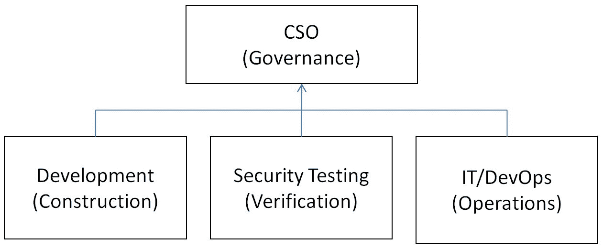
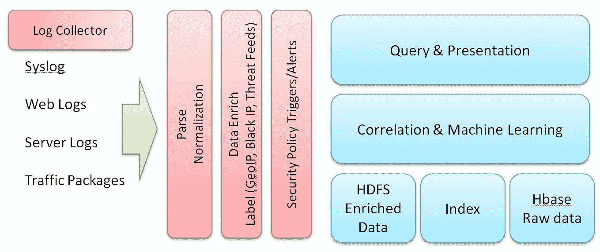
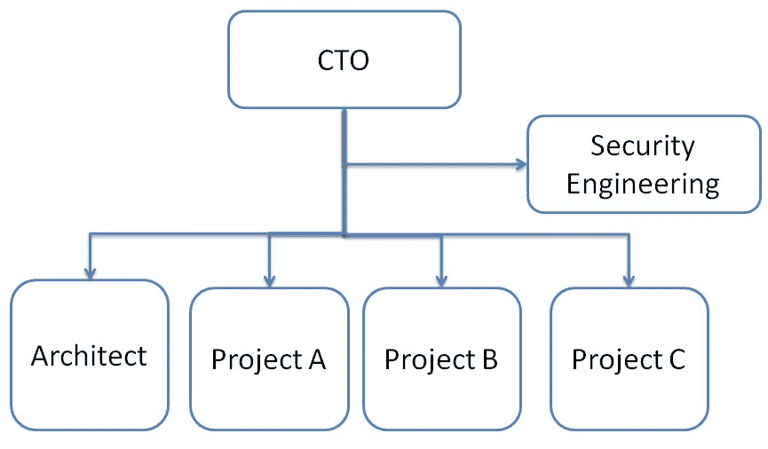
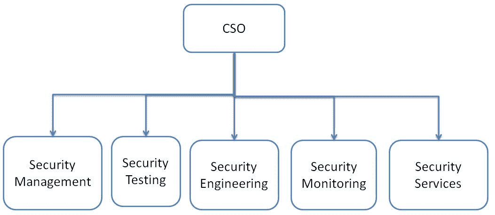
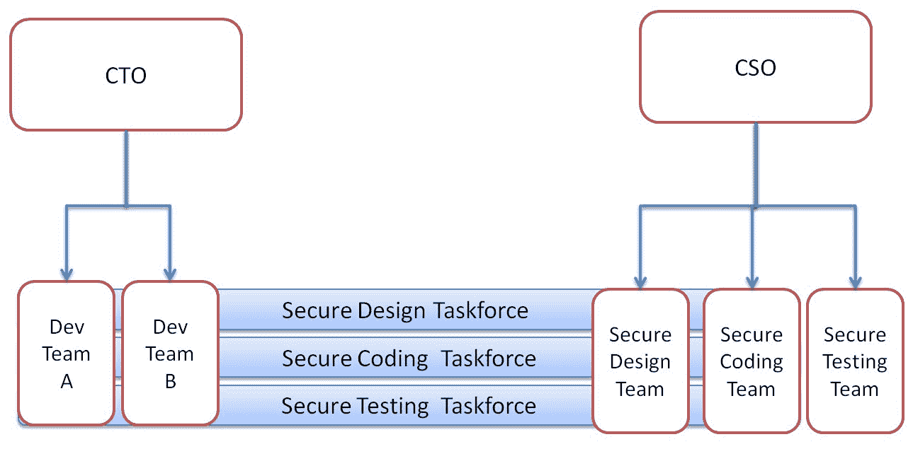

# 安全保障程序和组织

本章将讨论安全保障程序，如**安全开发生命周期**（**SDL**）、OWASP **软件保障成熟度模型**（**SAMM**）和 ISO 27001。然后，我们将讨论安全如何随着业务的增长而发展。此外，还有一些非技术性的内容对于任何安全程序的成功至关重要，比如流程、指导方针、培训和角色。将通过一个小案例研究来说明不同的组织结构如何影响安全保障程序的执行。

本章将涵盖以下主题：

+   安全保障程序

+   随着业务的增长，安全的发展

+   安全团队在组织中的角色

+   案例研究——矩阵、功能或工作组结构

本章结束时，你将学习以下内容：

+   安全保障程序的关键部分，用于推出 DevSecOps

+   安全如何与业务共同发展

+   安全程序中的过程、角色和培训部分

+   如何规划跨业务部门的安全团队

# 安全保障程序

我们将通过介绍一些行业实践，如 SDL、OWASP SAMM 和 ISO 27001，讨论安全保障程序。SDL 列出了整个开发生命周期中的安全活动。OWASP SAMM 解释了如何在四个不同的功能角色中应用三种成熟度级别的安全实践。ISO 27001 被认为是安全认证标准的基础，并概述了安全管理程序应该是什么样的。

# SDL（安全开发生命周期）

微软定义了**SDL（安全开发生命周期）**，帮助开发人员构建安全的软件。每个开发阶段的安全活动如下表所示：

| **MS SDL 阶段** | **安全活动** |
| --- | --- |
| 培训 |

+   核心安全培训

|

| 需求 |
| --- |

+   建立安全需求

+   创建质量关卡/缺陷标准

+   执行安全和隐私风险评估

|

| 设计 |
| --- |

+   建立设计需求

+   执行攻击面分析减少

+   使用威胁建模

|

| 实施 |
| --- |

+   使用批准的工具

+   弃用不安全功能

+   执行静态分析

|

| 验证 |
| --- |

+   执行动态分析

+   执行模糊测试

+   进行攻击面审查

|

| 发布 |
| --- |

+   创建事件响应计划

+   进行最终安全审查

+   认证、发布和归档

|

| 响应 | 执行事件响应计划 |
| --- | --- |

尽管组织可以遵循或参考成熟的 SDL 过程，但这些安全实践及其执行的关键在于如何将这些安全实践融入开发人员、QA 或开发团队的日常任务中。此外，任何安全程序要成功，必须根据业务需求量身定制，并支持业务的成功。

以开发者的日常例行任务为例——他需要理解业务和功能需求来进行设计，应用适当的第三方模块，编码、调试、排错，并进行本地编译/构建以进行验证。仅仅为了完成项目的功能以满足截止日期，就需要做很多工作。安全编码活动涉及超过 100 条安全编码规则。对于任何开发者来说，成为所有编码规则的专家，甚至只是意识到这些规则，都是一个巨大的挑战。

因此，在大多数情况下，采用合适的工具将大大有帮助。如果开发者使用 Eclipse 作为主要的源代码编辑器，那么建议你将安全编码工具作为 Eclipse 插件的一部分。根据编程语言和集成开发环境（IDE），安全和开发团队可能会制定一个计划，涉及如何将安全工具融入到日常任务的开发中。虽然安全编码指南依然是必不可少的，但实施安全编码最有效、最高效的方式是为每个开发者提供一个易于使用的工具，将其作为日常任务的一部分。

同样的情况也适用于 QA 或 IT DevOps 团队。要求每个 QA 或 IT 团队都熟悉所有的安全测试或加固实践是一项挑战。最好的方法也是提供相关的自动化安全工具来完成这些工作。

# OWASP SAMM

OWASP SAMM 将安全实践分为四个关键的业务功能——治理、构建、验证和运维。对于任何组织来说，这是一个非常实用的自评安全成熟度水平的指南。微软 SDL 在开发过程中定义了安全实践，而 OWASP SAMM 则基于业务功能和四个安全成熟度级别定义了安全实践：

| **业务功能** | **安全实践** |
| --- | --- |
| 治理 |

+   策略与度量

+   政策与合规

+   教育与指导

|

| 构建 |
| --- |

+   威胁评估

+   安全需求

+   安全架构

|

| 验证 |
| --- |

+   设计审查

+   实施审查

+   安全测试

|

| 运维 |
| --- |

+   问题管理

+   环境加固

+   运维启用

|

根据组织的不同，业务功能或构建、验证和运维之间的边界可能有所不同；在 DevOps 环境下，OWASP SAMM 12 安全实践被视为最低要求。如果我们将业务组织功能映射到 OWASP SAMM，它可能看起来像下图所示。这里有一个 CSO，负责管理整个安全程序：开发团队负责软件应用构建，安全测试团队负责验证，IT 或运维团队负责应用运维：

# 安全指南和流程

在审视了行业实践、SDL、OWASP SAMM 和 ISO 27001 后，通常是 CSO 或 CTO 安全办公室的责任来定义安全治理程序和安全指南。下表展示了安全指南的概述。在实践中，这些安全指南是模板，由中央提供建议并更新到安全知识库中，供每个项目团队参考。再次强调，如果这些指南无法融入开发人员、QA、IT 或 DevOps 的日常工作中，它们将无法发挥作用。为 DevOps 团队提供内置安全实践的工具仍然是 DevSecOps 成功的关键。下表建议了一些可能适用的行业实践和工具：

| ** 阶段** | **指南、模板、检查表、工具包** | **行业实践参考** |
| --- | --- | --- |
| 安全培训 |

+   安全意识

+   安全认证程序

+   案例研究知识库

+   常见问题

+   渗透学习环境

|

+   OWASP 前 10 名

+   CWE 前 25 名

+   OWASP VWAD

|

| 安全成熟度评估 |
| --- |

+   微软 SDL，OWASP SAMM 自评估成熟度水平

|

+   微软 SDL

+   OWASP SAMM

|

| 安全设计 |
| --- |

+   威胁建模模板（风险/缓解知识库）

+   发布门控的安全要求

+   安全设计案例研究

+   隐私保护

|

+   OWASP ASVS

+   NIST

+   隐私风险评估

|

| 安全编码 |
| --- |

+   编码指南（C++、Java、Python、PHP、Shell、移动端）

+   安全编码扫描工具

+   常见的安全编码案例研究

|

+   CWE

+   安全编码 CERT

+   OWASP

|

| 安全测试 |
| --- |

+   安全编译选项，如栈保护（Stack Canary）、NX、Fortify Source、PIE 和 RELRO

+   安全测试计划

+   安全测试用例

+   已知 CVE 测试

+   已知安全编码问题

+   API 级别安全测试工具

+   自动化测试工具

+   模糊测试

+   移动测试

+   利用与渗透

+   安全合规性

|

+   Kali Linux 工具

+   CIS

|

| 安全部署 |
| --- |

+   配置检查表

+   加固指南

+   通信端口/协议

+   代码签名

|

+   CIS 基准

+   CVE

|

| 事件与漏洞处理 |
| --- |

+   根本原因分析模板

+   事件处理流程和组织

|

+   NIST SP800-61

|

| 安全培训 |
| --- |

+   通过电子邮件进行安全意识培训

+   案例研究通讯

+   工具包使用实践培训

+   安全证书和考试

|

+   NIST 800-50

+   NIST 800-16

+   SAFECode 安全工程培训

|

# 安全与业务成长同步

根据企业的发展状态，安全需求和实施可能会受到企业目标和环境的影响。初创公司可能会利用外部云服务和现成的安全服务来保护其服务和数据。而一家价值数百万美元的云服务公司可能会根据自己的业务需求自建并定制安全服务，甚至分享其安全技术，使其成为开源。我们来讨论一下不同发展阶段的企业如何与安全实践的范围相关联。

# 阶段 1 – 基本安全控制

在这个阶段，我们可能在处理一家初创公司。IT 团队没有专门的安全团队。大多数安全控制来自云服务，例如 AWS。

尽管云服务可能提供安全服务，但仍然是用户的责任来保护应用和数据。因此，以下内容对这个阶段的安全保证计划至关重要。以 AWS 服务实践为例：

+   利用第三方云服务提供商的安全机制（例如，AWS 提供 IAM、KMS、安全组、WAF、Inspector、CloudWatch 和 Config）

+   安全配置依赖外部工具，如 AWS Config 和 Inspector

+   服务或操作监控可能会应用 AWS Config、Inspector、CloudWatch、WAF 和 AWS Shield

组织中可能仍然没有熟练的安全编码开发人员或渗透测试人员。团队大多仍依赖外部工具和服务进行安全实践。

# 第二阶段 – 构建安全测试团队

在这个阶段，业务已经稳定和成熟。组织可能会建立一个安全测试团队，负责在发布前进行应用安全验证，并持续监控环境漏洞。开发团队可能会在安全缺陷和问题上高度依赖安全测试团队，开发团队专注于业务的功能开发，尚未参与安全设计或安全编码。

专门的安全测试可能开始使用一些安全自动化测试或开源监控工具。开发人员通过逐步识别的安全缺陷案例来学习安全编码，仍然没有采用正式的威胁建模、设计或架构安全审查过程。团队正处于将安全转向左侧的初期阶段。

在这个阶段，内部安全团队可能会尝试调查或使用部分开源安全工具。以下表格展示了你可以考虑应用的典型安全工具包：

| **类别** | **开源工具名称** |
| --- | --- |
| 漏洞评估 |

+   NMAP

+   OpenVAS

|

| 静态安全分析 |
| --- |

+   Java 的 FindBugs

+   Ruby on Rails 的 Brakeman

+   适用于 Java、C++、Objective C 和 C 的推理工具

+   Cppcheck 或 Flawfinder for C/C++

|

| 网络安全 |
| --- |

+   OWASP 依赖性检查

+   OWASP ZAP

+   Archni-Scanner

+   Burp Suite

+   SQLMap

+   w3af

|

| 沟通 |
| --- |

+   Nmap

+   NCAT

+   Wireshark

+   SSLScan

+   sslyze

|

| 基础设施安全 |
| --- |

+   OpenSCAP

+   InSpec

|

| 虚拟机工具集 |
| --- |

+   Windows 用的 Pentest Box

+   Kali Linux

+   移动安全测试框架

|

| 安全监控 |
| --- |

+   ELK

+   MISP——开源威胁情报平台

+   OSSCE——开源 HIDS 安全

+   Facebook/osquery——高效的端点可见性

+   AlienVault OSSIM——开源 SIEM

|

# 第三阶段 – SDL 活动

随着软件服务交付变得越来越大规模且频繁，安全开发生命周期的需求变得至关重要。在这个阶段，关键目标是将安全实践融入到开发和运营团队中。

这一阶段的主要差异和新引入的安全实践如下：

+   安全性向左转，并涉及每个利益相关者

+   必须进行架构和设计评审，以进行威胁建模

+   开发人员接受安全设计和安全编码培训

+   运维和开发团队作为一个闭环协作

+   采用行业最佳实践，如 OWASP SAMM 和 Microsoft SDL，用于安全成熟度评估

在应用 SDL 时，可能会遇到一些学习曲线，甚至会有阻力。毕竟，这些安全实践将为团队带来额外的工作量。在初始的 SDL 实施阶段，充分的培训和沟通是必要的。为团队提供一些时间，以便他们熟悉安全实践和工具。让它成为一段有趣的学习之旅。

采用工具将安全性融入 DevOps 是至关重要的。使安全工具（威胁建模、安全编码、安全框架）对开发人员易于使用是将安全性提前到开发周期左侧的关键。

# 阶段 4 – 自建安全服务

在这一阶段，公司不仅拥有自己的安全测试和监控团队，还开发和定制自己的安全服务，例如**Web 应用防火墙**（**WAF**）和入侵检测。此外，公司甚至可能将一些安全工具或服务贡献给开源社区。安全保障计划不仅覆盖公司自身，还包括合作伙伴或生态系统。

以 Salesforce 为例—Salesforce 开发者中心门户提供安全培训模块、编码、实施指南、评估工具、代码扫描、测试或 CAPTCHA 模块，还提供开发者论坛。无论你是否在 Salesforce 上构建应用，Salesforce 开发者中心仍然是一个很好的参考，不仅适用于安全知识，也适用于你可能考虑应用的一些开源工具。

# 阶段 5 – 大数据安全分析和自动化

这个阶段的安全不仅仅是检测已知威胁，还包括利用云、大数据分析和机器学习来防范未知威胁，并使系统能够采取主动的保护措施。此阶段的关键特点是：

+   在整个开发周期中进行完全或主要自动化的安全测试

+   运用大数据分析和机器学习来识别异常行为或未知威胁

+   针对安全事件自动采取主动安全措施，例如部署 WAF 规则或虚拟补丁部署

大数据分析框架中的典型开源技术组件包括以下内容：

+   Flume、Log Logstash 和 Rsyslog 用于日志收集

+   Kafka、Storm 或 Spark 用于日志分析

+   Redis、MySQL、HBase 和 HDFS 用于数据存储

+   Kibana、ElasticSearch 和 Graylog 用于数据索引、搜索和展示

大数据安全分析的关键阶段在表格中进行了说明：

| **阶段** | **描述** |
| --- | --- |
| 数据收集 | 从各种来源和系统收集日志，如防火墙、Web 服务、Linux、网络网关、终端等。 |
| 数据规范化 | 将数据格式清理或转换为 JSON，特别是对于关键信息，如 IP 地址、主机名、电子邮件、端口和 MAC 地址。 |
| 数据增强/标记 | 就 IP 地址数据而言，它将进一步与 GeoIP 和 WhoIS 信息关联。此外，如果是已知的黑名单 IP 地址，还可能会被标记。 |
| 关联 | 关联分析关键特征之间的关系，如 IP 地址、主机名、DNS 域名、文件哈希、电子邮件地址和威胁知识库。 |
| 存储 | 将存储不同类型的数据——来自源的数据、丰富信息的数据、关联结果、GeoIP 映射和威胁知识库。 |
| 警报 | 当识别到威胁或基于指定的警报规则时触发警报。 |
| 展示/查询 | 用于监控和查询的安全仪表盘。ElasticSearch，RESTful API 或第三方 SIEM。 |

下图展示了典型的大数据安全分析框架，或者你可以参考开源的 Apache Metron 框架：[`cwiki.apache.org/confluence/display/METRON/Metron+Architecture`](https://cwiki.apache.org/confluence/display/METRON/Metron+Architecture)。

大数据安全分析的概念架构如下所示：

# 安全团队在组织中的角色

安全团队的角色和职责范围还取决于业务的阶段。最初可能是 IT 团队的一部分；之后是一个专门负责基础设施安全监控的安全团队，进而发展成专门的安全功能团队，负责安全工具开发和安全策略管理；或者是一个安全测试团队，等等。

我们来看看两种典型的场景，讨论一个组织可能涉及的角色和范围。一个是首席技术官（CTO）下的安全工程团队，另一个是一个拥有完整、安全职能的专职首席安全官（CSO）。

# CTO 下的安全办公室

这是一个典型的组织结构，安全工程团队隶属于 CTO 办公室。此类组织结构有一些特点：

+   没有专职的**首席安全官**（**CSO**）

+   安全团队可能规模不大——例如，少于 10 名成员

+   安全工程团队根据需求为所有项目提供服务

+   安全工程团队的主要职责是为所有项目团队提供安全指南、政策、检查表、模板或培训

+   安全工程团队的成员可能会被分配到不同的项目中，成为该项目的主题专家，具体取决于项目的需求

+   安全工程提供指南、工具包和培训，但是项目团队负责日常安全活动的执行。

这种团队结构的缺点在于，由于安全成员有限，安全工程团队可能无法完全专注于项目。毕竟，安全将通过更紧密地与业务结合，并更深入地了解工程团队的挑战，发挥最佳作用。

下图显示了 CTP 如何基于项目管理团队，并直接向首席技术官汇报安全工程团队，以支持他们并确保所有项目和架构的安全实践：

# 专职安全团队

随着业务的增长，组织可能会设立一个正式的 CSO 角色，拥有更专注的安全功能团队，例如安全管理团队、安全测试、安全工程、安全监控和安全服务：

+   **安全管理**：团队定义安全指南、流程、政策、模板、检查表和要求。安全管理团队的角色与之前在*首席技术官下的安全办公室*部分讨论的角色相同。

+   **安全测试**：团队在应用发布之前进行内部安全测试。

+   **安全工程**：团队为开发团队提供通用安全框架、架构、SDK 和 API。

+   **安全监控**：这是安全运营团队，负责监控所有在线服务的安全状态。

+   **安全服务**：这是开发安全服务（如 WAF 和入侵防御服务）的团队。

有时，可能是混合结构。例如，尚未有专职 CSO，但安全测试团队和安全管理团队向首席信息官报告。这一切取决于业务目标和业务需求的阶段。

这种安全团队结构包括大多数安全功能。然而，与之前的问题类似。我们希望安全内建于项目和实践之中。这将需要与项目团队的深度参与和对每个项目业务流程的清晰理解。这就是为什么我们希望在下一节讨论另一种矩阵式的组织结构：

# 案例研究 - 矩阵、功能或任务组结构

约翰，作为一家云软件应用提供商的 CSO，正在规划组织中的安全团队结构。现有的安全团队包括一个安全设计团队、一个安全编码团队和一个测试团队。安全设计团队负责威胁建模、安全框架和安全设计指南。安全编码团队为开发团队提供安全编码工具和检查清单。安全测试团队负责每次服务发布的安全验证。另一方面，CSO 彼得管理着软件开发团队（包括开发人员、质量保证和运营成员）。

彼得和约翰都知道安全是一项专家知识，最好有一个专门的安全团队来确保安全知识能够跨项目应用，同时也能帮助团队成员提升安全技能。另一方面，他们也知道安全必须与业务和现有的软件开发团队紧密结合。因此，他们正在经历两个主要阶段——安全资源池阶段，随后是安全技术委员会阶段。

# 安全资源池

保持安全成员在一个专门的安全团队中的主要优势是能够在项目之间共享安全知识，并能够为整个组织提供工具或最佳实践。然而，要将安全实践融入到 DevOps 实践中，DevOps 和安全团队需要在一定程度上参与其中。因此，CTO 列出了全年项目计划作为参考，以规划安全团队在项目中的参与。CSO 分配安全成员参与不同的项目。在项目分配期间，安全成员向项目经理汇报工作。虽然这种方式在一段时间内有效，但在这种组织结构下也存在一些问题：

+   项目团队可能在很大程度上依赖于安全团队的参与。例如，开发人员可能仍然对安全编码了解较少，因为大多数工作是由安全团队完成的。

+   随着业务和项目的增长，安全团队成员可能会同时负责多个项目，无法处理每个项目的所有安全细节。

因此，约翰和彼得意识到这一情况，并希望现有的 DevOps 团队能更多地参与安全任务，而安全团队的角色可能更像是安全顾问。

# 安全技术委员会（工作组）

随着项目团队逐渐壮大，项目数量也在迅速增长。John 和 Peter 决定成立一个安全技术委员会，这是一个虚拟的专责小组，旨在促进团队参与安全工作，并推动安全知识在项目之间的共享。他们成立了三个专责小组——**安全设计**、**安全编码**和**安全测试小组**。以安全设计小组为例，该小组由来自安全团队的一个或多个安全设计专家，以及每个项目团队的开发者代表组成。开发者代表相当于项目团队的安全冠军。他将参与小组的安全讨论，并将安全实践或指导方针带回项目团队。安全设计小组将与来自所有项目团队的安全代表以及来自安全团队的安全专家每周举行一次会议，讨论以下主题（不是详尽无遗的清单）：

+   常见的安全设计问题及其缓解措施（由安全团队发起）

+   项目应遵循的安全设计模式（由安全团队发起）

+   项目的安全设计框架建议（由安全团队发起）

+   一些项目提出的具体安全设计问题，并寻求其他项目的建议（由项目团队发起）

+   某项目的安全设计评审（由项目团队发起）

开发团队与安全团队之间的安全专责小组结构如下图所示：

没有完美的安全组织结构。关键在于与现有的业务需求和实践更好地契合。对于任何安全团队结构，最重要的是理解业务目标的目的。建立虚拟专责小组可能会补充现有的官方团队结构，因为该小组允许安全知识在各项目之间共享。

# 总结

本章讨论了三种典型的安全保障程序。SDL 聚焦于每个开发阶段中的安全活动。OWASP SAMM 定义了四个不同职能中的安全活动。ISO 27001 提供了安全管理程序的概述。这些都是我们构建自身安全指导方针、流程、检查表或工具包的基础。

随着业务的增长，安全的需求和范围变得更加复杂。我们将安全增长分为五个阶段。在第一阶段，我们从基本的安全控制需求开始。在第二阶段，组织可能会建立自己的内部安全测试团队。在第三阶段，安全活动将 SDL 应用到更大范围，并向左迁移——即向开发团队迁移——在早期设计阶段。在这一阶段，大多数安全工具或自动化不仅应用于测试，还应用于开发和运营团队。在第四阶段，安全团队开始建立安全服务，如 WAF 或入侵检测，而不是购买安全服务，以更好地适应业务需求。在第五阶段，团队使用大数据分析来防范未知威胁。

由于安全与每个业务利益相关者都息息相关，因此组织结构中的角色和安全团队也进行了讨论。没有完美的组织结构，只有根据业务需求和文化最适合的结构。毕竟，在任何安全计划的采纳中，都有一些重要的非技术因素需要考虑。

# 问题

1.  Microsoft SDL 是否代表安全开发生命周期？

1.  根据 SDL，设计阶段应进行哪些活动？

    1.  确定设计要求

    1.  执行攻击面分析减少

    1.  用户威胁建模

    1.  以上所有

1.  在 OWASP SAMM 中，哪个安全实践不属于安全治理的一部分？

    1.  安全与指标

    1.  教育和指导

    1.  安全架构

    1.  政策与合规

1.  在 OWASP SAMM 中，哪个安全实践不属于安全操作的一部分？

    1.  问题管理

    1.  安全需求

    1.  环境强化

    1.  操作启用

1.  以下哪项不是 CTO 领导下的安全办公室的特点？

    1.  大型安全团队——超过 100 名成员

    1.  没有专职 CSO

    1.  安全团队服务所有项目

    1.  安全团队可能无法完全参与项目团队

# 深入阅读

+   **Microsoft 安全开发生命周期**: [`www.microsoft.com/en-us/SDL/`](http://www.microsoft.com/en-us/SDL/)

+   **OWASP SAMM 项目**: [`www.owasp.org/index.php/OWASP_SAMM_Project`](https://www.owasp.org/index.php/OWASP_SAMM_Project)

+   **CWE/SANS 最危险的 25 种软件错误**: [`cwe.mitre.org/top25/`](https://cwe.mitre.org/top25/)

+   **OWASP 易受攻击的 Web 应用程序目录项目**: [`www.owasp.org/index.php/OWASP_Vulnerable_Web_Applications_Directory_Project`](https://www.owasp.org/index.php/OWASP_Vulnerable_Web_Applications_Directory_Project)

+   **CERT 安全编码标准**: [`wiki.sei.cmu.edu/confluence/display/seccode/SEI+CERT+Coding+Standards`](https://wiki.sei.cmu.edu/confluence/display/seccode/SEI+CERT+Coding+Standards)

+   **NIST 特别出版物 800-53**: [`nvd.nist.gov/800-53`](https://nvd.nist.gov/800-53)

+   **SAFECode 安全白皮书**: [`safecode.org/publications/`](https://safecode.org/publications/)

+   **Microsoft Threat Modeling tool 2016**: [`aka.ms/tmt2016/`](https://aka.ms/tmt2016/)

+   **Salesforce 开发者中心**: [`developer.salesforce.com/devcenter/security`](https://developer.salesforce.com/devcenter/security)

+   **用于实时大数据安全的 Apache Metron**: [`metron.apache.org/documentation/`](http://metron.apache.org/documentation/)

+   **介绍 OCTAVE Allegro：改进信息安全风险评估流程**: [`resources.sei.cmu.edu/asset_files/TechnicalReport/2007_005_001_14885.pdf`](https://resources.sei.cmu.edu/asset_files/TechnicalReport/2007_005_001_14885.pdf)

+   **NIST 800-18 联邦信息系统安全计划开发指南**: [`nvlpubs.nist.gov/nistpubs/legacy/sp/nistspecialpublication800-18r1.pdf`](http://nvlpubs.nist.gov/nistpubs/legacy/sp/nistspecialpublication800-18r1.pdf)

+   **ITU-T X.805 (10/2003) 提供端到端通信的系统安全架构**: [`www.itu.int/rec/dologin_pub.asp?lang=e&id=T-REC-X.805-200310-I!!PDF-E&type=items`](https://www.itu.int/rec/dologin_pub.asp?lang=e&id=T-REC-X.805-200310-I!!PDF-E&type=items)

+   **ETSI TS 102 165-1 V4.2.1 (2006-12) : 威胁、风险、漏洞分析的方法和表单**: [`www.etsi.org/deliver/etsi_ts/102100_102199/10216501/04.02.01_60/ts_10216501v040201p.pdf`](http://www.etsi.org/deliver/etsi_ts/102100_102199/10216501/04.02.01_60/ts_10216501v040201p.pdf)

+   **SAFECode 安全软件开发基本实践**: [`safecode.org/wp-content/uploads/2018/03/SAFECode_Fundamental_Practices_for_Secure_Software_Development_March_2018.pdf`](https://safecode.org/wp-content/uploads/2018/03/SAFECode_Fundamental_Practices_for_Secure_Software_Development_March_2018.pdf)

+   **NIST 800-64 系统开发生命周期中的安全考虑**: [`nvlpubs.nist.gov/nistpubs/legacy/sp/nistspecialpublication800-64r2.pdfhttps://csrc.nist.gov/publications/detail/sp/800-64/rev-2/final`](https://csrc.nist.gov/publications/detail/sp/800-64/rev-2/final)

+   **NIST 800-50 建立信息技术安全意识和培训程序**: [`nvlpubs.nist.gov/nistpubs/legacy/sp/nistspecialpublication800-50.pdf`](https://nvlpubs.nist.gov/nistpubs/legacy/sp/nistspecialpublication800-50.pdf)

+   **CIS 安全基准**: [`www.cisecurity.org/cis-benchmarks/`](https://www.cisecurity.org/cis-benchmarks/)

+   **NIST 800-16 信息技术安全培训要求**: [`csrc.nist.gov/publications/detail/sp/800-16/final`](https://csrc.nist.gov/publications/detail/sp/800-16/final)

+   **SAFECode 安全工程培训**: [`safecode.org/publication/SAFECode_Training0409.pdf`](http://safecode.org/publication/SAFECode_Training0409.pdf)

+   **一种混合威胁建模方法**: [`resources.sei.cmu.edu/library/asset-view.cfm?assetid=516617`](https://resources.sei.cmu.edu/library/asset-view.cfm?assetid=516617)

+   **微软 SDL 工具** [`www.microsoft.com/en-us/SDL/adopt/tools.aspx`](https://www.microsoft.com/en-us/SDL/adopt/tools.aspx)
