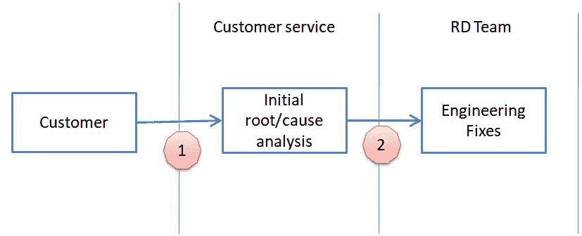

# 第四章：安全要求和合规性

我们先前在一个组织中讨论了安全保证计划，并将在本章中探讨安全要求和合规性。我们都同意安全和隐私对软件发布至关重要。然而，对产品经理来说，计划安全或隐私特性进入产品发布可能是一项挑战。

本章将讨论涵盖四个方面的安全需求：每个发布质量门的安全要求，通用 Web 应用程序的安全要求，大数据的安全要求，以及符合**通用数据保护条例**（**GDPR**）的安全要求。一些安全需求是工程驱动的，比如发布门，而一些是市场驱动的，比如 GDPR。本章通过从不同角度探讨安全需求规划指南，提供了安全需求的规划准则。

我们将在本章中涵盖以下主题：

+   发布门的安全要求

+   Web 应用程序的安全要求

+   大数据的安全要求

+   GDPR 的隐私要求

# 发布门的安全要求

对每个发布阶段设置安全质量标准非常重要，例如威胁建模、设计、编码、测试和部署。发布门的目标是在每个阶段提高安全发布的质量。在开始定义发布门时，建议从一些主要或高优先级的安全问题开始，因为长长的检查表不仅会增加开销，还会引起开发或质量保证团队的抵触。

在引入安全发布门时，允许团队学习，熟悉安全实践，并有可能犯错。试图成为支持团队达到更高安全质量标准的教练，而不是像警察一样检查可交付成果。

# 发布门的示例

当所有团队熟悉安全实践并进行了一些安全自动化后，可以为更高的安全标准添加额外的安全检查表。每个阶段的典型安全发布门示例如下表所示：

| **阶段** | **发布门示例** |
| --- | --- |
| **设计** |

+   针对高风险模块进行了威胁建模活动。

+   已审查了第三方组件版本的使用，没有主要漏洞。

+   已经审查了最常见的安全设计问题，没有主要问题。

|

| **编码** |
| --- |

+   使用静态代码分析工具识别了主要的安全风险。

+   代码扫描结果中的高严重性问题都已经进行了检查。

+   在源代码中没有发现敏感信息（如密码、IP、电子邮件、加密密钥）。

|

| **构建** |
| --- |

+   工具链（编译器和链接器）加固配置，如**位置独立可执行文件**（**PIE**），或**地址空间布局随机化**（**ASLR**），或**数据执行防护**（**DEP**）都已正确配置。

|

| **测试** |
| --- |

+   没有高严重性的安全问题。严重性是通过**常见漏洞评分系统**（**CVSS**）版本 3.0 来衡量的。

+   遵循并执行了 OWASP 测试用例。

+   所有协议均使用模糊测试工具进行测试。

|

| **生产交付** |
| --- |

+   已交付安全配置定义。

+   通信端口、接口和协议已文档化。

|

| **监控** |
| --- |

+   服务的准备情况以及安全扫描的配置列表。

+   服务日志的安全分析准备情况。

|

# 常见漏洞评分系统 (CVSS)

在发布评审阶段，不同的利益相关者之间常常会就是否进入下一阶段的问题发生争论。例如，开发团队可能认为这是一个小问题，可以继续进入下一阶段，而运维团队则可能认为这是一个高风险问题。

因此，为了更客观地评估安全问题的严重性和影响，建议使用 CVSS 3.0。CVSS 3.0，[`www.first.org/cvss/calculator/3.0`](https://www.first.org/cvss/calculator/3.0)，通过回答以下八个问题来评估安全问题：

+   **攻击向量 (AV)**：攻击是否需要物理访问，还是可以通过网络进行？

+   **攻击复杂度 (AC)**：攻击是否可以在任何时间进行，还是只能在特定条件下进行？

+   **所需权限 (PP)**：攻击是否需要管理员权限？

+   **用户交互 (UI)**：攻击是否需要用户交互（例如点击）才能成功？

+   **范围 (S)**：攻击仅影响脆弱组件，还是会影响所有其他组件及整个系统？

+   **机密性 (C)**：是否会有机密信息被窃取？

+   **完整性 (I)**：是否会对完整性产生影响，例如篡改或更改系统信息？

+   **可用性 (A)**：是否会影响可用性，例如性能影响或服务不可用？

除了前述的基础分数外，我们还可以通过审查**时间分数**和**环境分数**来进一步评估。时间分数审查利用代码的成熟度、修复级别（热修复、临时解决方法或无修复）以及报告的信心度。**环境分数**主要评估成功利用所需的网络或主机修改，例如权限、用户交互、完整性、可用性和机密性。这两个附加向量有助于让我们深入了解安全问题的完整严重性和影响。

# Web 应用程序的安全要求

OWASP **应用程序安全验证标准**（**ASVS**）不仅提供了开发团队应遵循的安全要求清单，还可以作为 QA 团队进行验证和评估应用程序安全级别的检查表。请参考项目源：[`www.owasp.org/index.php/Category:OWASP_Application_Security_Verification_Standard_Project`](https://www.owasp.org/index.php/Category:OWASP_Application_Security_Verification_Standard_Project)。

# OWASP 应用程序安全验证标准（ASVS）

OWASP ASVS 在撰写时（2018 年）定义了以下安全要求。由于某些章节被并入其他章节，部分章节号被跳过：

+   ASVS V1 架构

+   ASVS V2 身份验证

+   ASVS V3 会话管理

+   ASVS V4 访问控制

+   ASVS V5 输入验证和输出编码

+   ASVS V7 加密

+   ASVS V8 错误处理

+   ASVS V9 数据保护

+   ASVS V10 通信

+   ASVS V13 恶意代码

+   ASVS V15 业务逻辑漏洞

+   ASVS V16 文件和资源

+   ASVS V17 移动安全

+   ASVS V18 API

+   ASVS V19 配置

+   ASVS V20 物联网

OWASP ASVS 定义了三种安全要求等级。以*V7: 静态加密*为例，在一级应用程序中，可能仅要求加密模块安全地失败。对于二级/三级应用程序，其安全要求超过一级，此外还要求在应用程序中使用经批准的随机数生成器。

实际中，产品经理可能使用 ASVS 规划未来版本所需的安全特性，开发团队参考 ASVS 来正确实现安全的应用程序，而 QA 团队则将其作为检查表来评估应用程序，或作为发布门禁。定制 ASVS 检查表，并将其纳入您的安全实践，使其更加有效。例如，将安全要求基准作为产品功能规划模板的一部分，或在流程中将安全检查列为发布门禁。毕竟，我们不希望 ASVS 仅仅是一个检查表文档。它需要意识、流程和共识才能落实到实践中。

# 安全知识门户

您还可以考虑构建一个内部安全知识门户，包含安全要求、案例研究、指导方针或模板等。内部安全门户不仅有助于传达组织级的安全政策，还能建立内部知识库。项目团队还可以在门户上分享他们的最佳实践或工具，以增强跨业务部门的经验共享。理想的安全知识门户可能涵盖以下领域，如下图所示：

如果您的组织是新成立的，或者正在计划建立一个内部的安全知识门户，强烈推荐使用 OWASP **安全知识框架**（**SKF**）。OWASP SKF 提供了 OWASP ASVS 检查清单、安全知识库，以及安全代码示例。以下是下载 OWASP SKF 的 URL：[`github.com/blabla1337/skf-flask`](https://github.com/blabla1337/skf-flask)。

# 大数据安全需求

大数据的安全需求不仅包括整个大数据框架的安全，还包括数据本身的保护。保护数据不仅仅是加密。根据 CSA 大数据安全与隐私的十大挑战，大数据的安全与隐私分为四个领域：

+   基础设施安全

+   数据隐私

+   数据管理

+   完整性和响应性安全

我们将基于这四个安全类别进一步讨论安全需求。

# 大数据安全需求

下表列出了每个类别的安全需求示例。这不是一个详尽的清单，但这是您应该考虑的大数据安全的关键需求：

| **大数据安全分类** | **安全需求示例** |
| --- | --- |
| 基础设施安全 |

+   数据库和服务可用性

+   防范 DDOS 攻击和大规模数据流量

+   安全的数据传输，如 TLS 1.2

|

| 数据隐私 |
| --- |

+   数据分类和保护

+   未授权访问审计与日志记录

+   敏感或个人信息的数据掩码

+   遵守隐私法或法规

|

| 数据管理 |
| --- |

+   安全的数据库存储，如安全配置、加密和硬化

+   数据生命周期过程中的数据治理

+   告知用户数据如何被收集和使用

+   明确的用户同意收集任何个人数据

+   允许用户编辑、更新或删除收集的数据

|

| 完整性和响应性安全 |
| --- |

+   日志安全分析以识别异常的数据访问

+   防止数据被篡改

+   当发生安全事件时通知用户

|

# 大数据技术安全框架

另一方面，如果我们深入了解大数据基础设施，我们会发现它通常包括 HDFS、Hive、HBase、Storm、Knox、Solr、Kafka、ZooKeeper 和 YARN。这些带来了新的安全挑战，比如如何保护分布式数据环境、细粒度的数据访问控制、安全存储、隐私数据保护和数据治理。从大数据安全框架的角度来看，下表列出了大数据安全需求与建议的技术控制组件的映射：

| **安全需求** | **技术实施组件** |
| --- | --- |

|

+   集中式安全管理和管理

+   授权和权限控制

+   集中式审计与报告

|

+   Apache Ranger

+   Apache Sentry

|

|

+   操作监控与审计

|

+   Apache Ambari

|

|

+   强制执行 REST API 安全

+   边界安全

|

+   Apache Knox

|

|

+   安全传输

|

+   使用 TLS v1.2 代替 HTTP

+   使用 SSH v2 代替 Telnet

+   使用 SFTP 代替 FTP

|

|

+   身份认证

|

+   Kerberos

|

|

+   安全配置和部署

|

+   Kerberos 和 Knox 安全配置，如文件权限、守护进程用户、NTP、证书和 TLS

|

|

+   数据治理

+   数据生命周期管理

+   数据分类，例如 PII、机密数据

+   基于分类的授权/数据掩码

|

+   Apache Atlas

|

以下是关于大数据隐私与安全的进一步推荐参考资料：

+   SP.1500-4 大数据互操作性框架：第 4 卷，安全与隐私

+   ENISA：大数据中的隐私设计

+   CSA 扩展的十大大数据安全与隐私挑战

+   信息专员办公室的*数据保护指南*

+   ENISA：大数据安全

# GDPR 的隐私要求

GDPR 是欧盟关于隐私数据保护的法规，于 2018 年 5 月生效。我们需要了解并为之做好规划，因为 GDPR 定义了数据隐私的相关法规。它不仅仅是一个指南或最佳实践，GDPR 是一个必须在整个欧盟范围内遵守的正式法规。

在这里，我们将介绍一些关于 GDPR 自我评估及与软件应用相关的安全要求的关键步骤。共有四个主要步骤，如下所示：

| **关键步骤** | **检查清单** |
| --- | --- |

|

1.  GDPR 合规性

| 如果满足以下任一条件，必须遵守 GDPR 合规性：

+   位于欧盟的公司

+   向欧盟居民提供免费或付费商品或服务的公司（不在欧盟的公司）

+   监控欧盟居民行为的公司（不在欧盟的公司，或不向欧盟提供商品或服务的公司）

GDPR 官网提供了许多值得阅读的资源，如“谁必须遵守”和“常见问题解答” |

|

1.  隐私影响分析

| 这一步主要指的是进行**隐私影响评估**（**PIA**）。PIA 包括以下步骤：

1.  识别 PIA 的需求

1.  描述信息流

1.  识别隐私及相关风险

1.  识别和评估隐私解决方案

1.  签署并记录 PIA 结果

1.  与利益相关者制定行动计划

请参考这里的 PIA 评估模板。[`gdpr-info.eu/issues/privacy-impact-assessment/`](https://gdpr-info.eu/issues/privacy-impact-assessment/) |

|

1.  数据控制者或数据处理者

|

+   根据数据控制者或数据处理者的角色执行 GDPR 合规性

|

|

1.  验证

|

+   建议为开发团队提供一份自我评估和评估清单

+   或者，一个组织也可以考虑获得与隐私相关的安全认证，例如欧盟的 EuroPrise 认证或美国的 TRUSTe 认证

|

# 隐私影响评估（PIA）

PIA 的目标是对可能涉及隐私数据处理的业务模块进行初步自我评估，并准备好遵守 GDPR。数据隐私影响分析是 GDPR 第 35 条要求的内容。强烈建议为所有项目团队应用 PIA 评估模板，或者根据组织的需求定制模板。PIA 的关键成果包括隐私数据属性和数据流列表。典型的 PIA 评估报告可能包含以下议程。

1.  介绍

1.  PIA 的范围

1.  数据属性识别

1.  数据流评估

1.  计划的行动和现有的差距

1.  数据保护影响评估结果

以下部分展示了如何识别隐私数据以及数据流风险评估。

# 隐私数据属性

对于隐私数据，我们还必须进一步识别其属性。属性列表（目的、收集方式、存储、格式、保留期限等）有助于确定和审查如何处理隐私数据。例如，某些隐私数据可能被识别为不是必须收集的，或者没有合法的收集依据，这些隐私数据不应当被收集。

| **属性** | **描述相关的业务流程或应用** |
| --- | --- |
| **隐私数据类型** | 描述收集或处理的隐私数据，如姓名、地址、电话 |
| **收集目的** | 描述数据收集的目标及其业务背景 |
| **是否必须？** | 数据收集对保持业务应用的正常运行是否至关重要？ |
| **收集方式** | 个人数据如何收集，例如通过 API、电子邮件或网页表单注册 |
| **合法依据** | 数据收集是否基于用户协议、合同或法律合规？ |
| **数据主体的权利** | 数据主体是否可以编辑或删除数据？ |
| **传输方式** | 数据是如何传输的，如 FTP、电子邮件或 API |
| **存储国家** | 数据存储在哪个国家？ |
| **存储格式** | 数据以何种格式存储，例如大数据、关系型数据库或纸质形式？ |
| **过期期限** | 数据使用是否有指定的过期期限？ |
| **跨境传输** | 数据是否会从欧盟传输到其他国家或地区？ |
| **第三方参与** | 是否有任何第三方参与数据处理？ |
| **所有者** | 谁/哪个团队是数据的所有者？ |

# 数据流评估示例

下图展示了客户、服务和研发团队之间典型的数据流问题排查。对于数据流，必须识别是否包含任何隐私数据、数据处理操作以及数据处理的目标：

该表描述了在相关业务场景中处理数据隐私的操作，表格中标明了场景：

| **#** | **业务场景** | **数据隐私** | **操作** | **目标** |
| --- | --- | --- | --- | --- |
| 1 | 客户将其 PC 发送到客服中心进行修复 | 客户的联系信息和个人数据存储在 PC 上 | 客服中心接收 PC | 初步测试 PC 的功能 |
| 2 | PC 送交工程团队进行进一步检查 | 客户联系信息和个人数据存储在 PC 上 | 工程团队进行更深入的分析 | 提供 PC 的工程修复 |

# GDPR 对于数据处理者和控制者的安全要求

根据 GDPR 常见问题解答，*控制者是确定个人数据处理目的、条件和方式的实体，而处理者是代表控制者处理个人数据的实体*。

例如，一个向欧盟客户（数据主体）销售服务的电子商务网站。该电子商务网站是数据控制者，应遵守 GDPR 要求。作为数据处理者的软件供应商为该电子商务网站提供软件服务。

与数据处理者相比，数据控制者需要满足更多的 GDPR 要求。这就是为什么在隐私数据处理生命周期中，明确其角色至关重要。下表列出了软件/服务在数据处理者和数据控制者方面的 GDPR 安全要求。

| **GDPR 要求** | **数据处理者** | **数据控制者** |
| --- | --- | --- |
| 提供数据隐私声明 | 必须 | 必须 |
| 数据收集必须获得用户明确同意，并允许用户禁用数据收集 | 必须 | 必须 |
| 为了故障排除，必须通知用户日志收集是否包含个人信息 | 必须 | 必须 |
| 收集用户的 Cookies 需要用户的同意 | 必须 | 必须 |
| 如果数据是为了营销分析目的而收集，应用程序必须允许用户禁用分析 | 推荐 | 必须 |
| 在数据过期后提供安全的数据删除功能 | 必须 | 必须 |
| 如果数据将提供给第三方合作伙伴，必须获得用户的明确同意 | 推荐 | 必须 |
| 提供用户查询和更新数据的功能 | 推荐 | 必须 |
| 删除任何不再使用的临时数据 | 推荐 | 必须 |
| 提供导出数据的功能 | 推荐 | 必须 |
| 安全数据传输 | 必须 | 必须 |
| 使用加密、访问控制和日志记录安全控制的安全本地数据存储 | 必须 | 必须 |

# 总结

我们讨论了四个领域的安全要求，并提供了如何为每个开发阶段定义安全发布门的示例，如设计、编码、构建、测试、交付和监控。每当遇到是否进行下一次发布的难题时，建议进行 CVSS 评估。

为了让产品经理规划安全功能，我们推荐使用 OWASP ASVS。根据业务场景，安全有三个等级。基于 OWASP ASVS，我们引入了一个开源的 OWASP 安全知识框架，帮助组织建立内部安全知识门户。

关于数据安全与隐私，我们讨论了大数据的安全要求。

对于大数据需求，CSA 定义了四个安全类别：如基础设施安全、数据隐私、数据管理与完整性，以及响应性安全。此外，我们还提供了建议的大数据安全框架列表，如 Apache Ranger 和 Atlas。还建议进一步阅读 NIST SP 1500-4 和 ENISA 大数据安全相关内容。

最后，我们讨论了 GDPR 的安全要求。根据数据控制者或数据处理者的角色，安全要求可能会有所不同。我们还回顾了一个示例，看看如何使用 PIA 模板作为 GDPR 的自我评估。

我们讨论了与行业实践（OWASP ASVS，CSA 大数据）、工具（OWASP SKF，Apache Ranger）和模板（CVSS，PIA）相关的安全要求。在下一章中，我们将通过案例研究来探讨在 DevOps 过程中如何执行安全实践。

# 问题

1.  以下哪项可以作为设计阶段发布门的安全要求？

    1.  应执行威胁建模活动

    1.  审查第三方组件的使用

    1.  审查常见的安全设计问题

    1.  以上所有

1.  以下哪项不是编码阶段的安全门？

    1.  源代码已由静态代码分析工具扫描

    1.  源代码中未发现敏感信息

    1.  服务日志已准备好进行安全分析

    1.  代码扫描结果中的高严重性问题已全部检查

1.  CVSS 是否代表常见漏洞评分系统？

1.  以下哪种技术通常用于为大数据框架进行授权？

    1.  Apache Ranger

    1.  Apache Ambari

    1.  TLS

    1.  NTP

1.  GDPR 是否适用于那些不位于欧盟的组织，正确还是错误？

1.  数据控制者和数据处理者之间的主要区别是否是决定数据处理目的的能力？

# 进一步阅读

访问以下网址以获取更多信息：

+   **NIST 1500-4 大数据互操作性框架：安全与隐私**：[`bigdatawg.nist.gov/_uploadfiles/NIST.SP.1500-4.pdf`](https://bigdatawg.nist.gov/_uploadfiles/NIST.SP.1500-4.pdf)

+   **ENISA 大数据隐私设计**：[`www.enisa.europa.eu/publications/big-data-protection`](https://www.enisa.europa.eu/publications/big-data-protection)

+   **SAFE 实践安全故事与敏捷开发环境中的安全任务**：[`safecode.org/publication/SAFECode_Agile_Dev_Security0712.pdf`](http://safecode.org/publication/SAFECode_Agile_Dev_Security0712.pdf)

+   **大数据、人工智能、机器学习与数据保护：** [`ico.org.uk/media/for-organisations/documents/2013559/big-data-ai-ml-and-data-protection.pdf`](https://ico.org.uk/media/for-organisations/documents/2013559/big-data-ai-ml-and-data-protection.pdf)

+   **PCI DSS 3.2 的优先级方法：** [`www.pcisecuritystandards.org/documents/Prioritized-Approach-for-PCI_DSS-v3_2.pdf`](https://www.pcisecuritystandards.org/documents/Prioritized-Approach-for-PCI_DSS-v3_2.pdf)

+   **安全与隐私的开放参考架构**：[`security-and-privacy-reference-architecture.readthedocs.io/en/latest/`](http://security-and-privacy-reference-architecture.readthedocs.io/en/latest/)

+   **IT 产品国家清单计划 – 清单用户与开发者指南：** [`nvlpubs.nist.gov/nistpubs/SpecialPublications/NIST.SP.800-70r3.pdf`](https://nvlpubs.nist.gov/nistpubs/SpecialPublications/NIST.SP.800-70r3.pdf)

+   **CSA 扩展十大大数据安全与隐私挑战：** [`cloudsecurityalliance.org/download/expanded-top-ten-big-data-security-and-privacy-challenges/`](https://cloudsecurityalliance.org/download/expanded-top-ten-big-data-security-and-privacy-challenges/)

+   **信息专员办公室《数据保护指南》：** [`ico.org.uk/for-organisations/guide-to-data-protection/`](https://ico.org.uk/for-organisations/guide-to-data-protection/)

+   **SANS 网络应用设计安全清单：** [`www.sans.org/reading-room/whitepapers/securecode/security-checklist-web-application-design-1389`](https://www.sans.org/reading-room/whitepapers/securecode/security-checklist-web-application-design-1389)

+   **GDPR 谁需要遵守：** [`www.gdpreu.org/the-regulation/who-must-comply/`](https://www.gdpreu.org/the-regulation/who-must-comply/)

+   **GDPR 常见问题解答：** [`www.eugdpr.org/gdpr-faqs.html`](https://www.eugdpr.org/gdpr-faqs.html)

+   **GDPR 隐私影响评估：** [`gdpr-info.eu/issues/privacy-impact-assessment/`](https://gdpr-info.eu/issues/privacy-impact-assessment/)

+   **Cookie 法律：** [`www.cookielaw.org/the-cookie-law/`](https://www.cookielaw.org/the-cookie-law/)

+   **ISO/IEC 29151:2017 个人身份信息保护实践规范：** [`www.iso.org/standard/62726.html`](https://www.iso.org/standard/62726.html)
