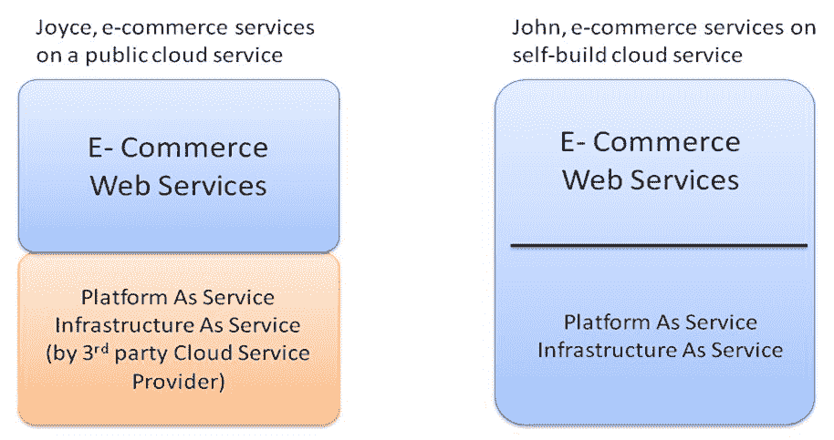
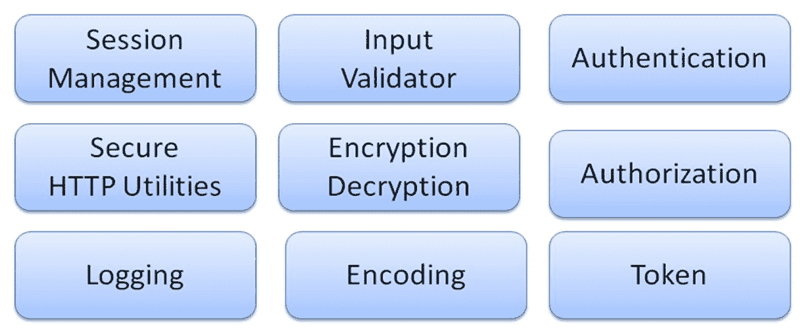
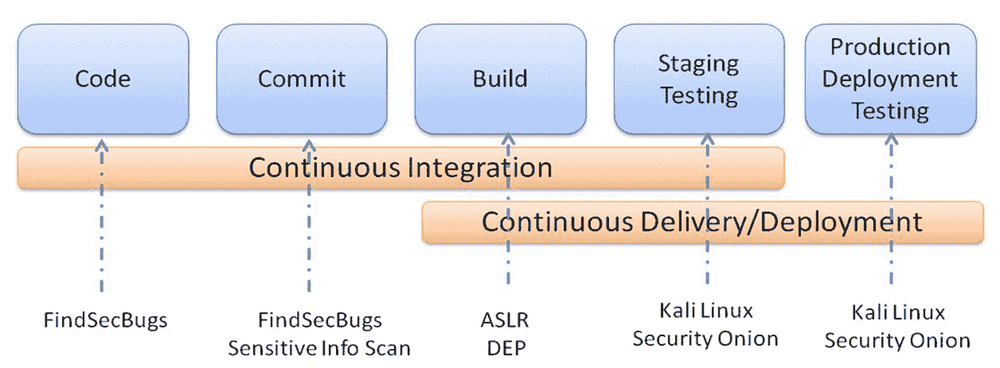

# 第五章：案例研究 - 安全保障计划

由于我们在前几章已经涵盖了安全要求和安全保障计划，本章将讨论两个案例，重点查看 DevOps 过程中的安全保障计划和安全实践。微软 SDL 和 SAMM 被引入用于应用安全保障计划。除了过程之外，非技术性部分，如安全培训和文化，对于安全计划的成功也至关重要。我们还将举例说明安全工具和 Web 安全框架如何在整个 DevOps 过程中提供帮助。

在本章中，我们将学习以下主题：

+   微软 SDL 和 SAMM

+   安全培训和意识

+   安全文化

+   将安全工具融入 DevOps

+   Web 安全框架

# 安全保障计划案例研究

让我们通过两个典型的业务场景来讨论安全保障计划的采用。一个是关于建立在第三方云服务提供商之上的服务，另一个是关于构建自己的完整云服务，包括**软件即服务**（**SaaS**）、**平台即服务**（**PaaS**）和**基础设施即服务**（**IaaS**）：

+   **场景 1：Joyce，基于公共云服务的电子商务服务：**Joyce 是电子商务公司的一名安全领导。该公司拥有内部的软件开发、IT 和安全团队。他们部署了基于第三方云服务提供商的电子商务服务，并采用 IaaS/PaaS 云服务提供商提供的大部分安全服务。由于涉及支付和信用卡信息处理，电子商务服务必须遵守 PCI DSS 合规性。

+   **场景 2：John，基于自建云服务的电子商务服务：**John 是电子商务服务的首席安全官。John 案例中的关键区别在于，存在一个成熟的安全组织团队，并且有很多安全服务，如 WAF、IDS 或安全监控，都是自行构建并根据业务需求定制的。此外，电子商务是建立在他们自运营的云服务之上的。在这种情况下，PCI DSS 合规性也是最低要求。

对于这两个场景，让我们通过参考微软 SDL 和 OWASP SAMM 实践，讨论采用安全保障计划的差异。

# 微软 SDL 和 SAMM

在 Joyce 的案例中，采用微软 SDL 和 SAMM 可能在云服务提供商提供的框架基础上应用安全性。我们始终建议基于现有的业务流程构建安全实践，或者将安全工具集成到现有的 CI 或 CD 框架中。

大多数云服务提供商提供相关的云安全服务。在 Joyce 的案例中，熟悉云服务提供商提供的安全服务，以及这些服务如何应用到她的电子商务应用程序中，将有助于构建安全基础。此外，大多数云服务提供商已获得 IaaS 和 PaaS 的安全标准认证。这意味着 Joyce 只需关注构建在 IaaS 和 PaaS 上的数据和软件安全。而在 John 的案例中，他需要自行构建或购买这些安全服务来保护 IaaS、PaaS 和软件应用程序。下表展示了云服务提供商提供的典型安全服务：

| **安全领域** | **云安全服务** |
| --- | --- |
| 安全管理 |

+   威胁情报

+   云连接器

+   外包安全服务

|

| 内容安全 |
| --- |

+   垃圾邮件防护

+   防止机器暴力攻击

+   账户滥用检测

|

| 基础设施 |
| --- |

+   CA 证书管理器

+   密钥管理

+   HTTPS 服务

+   安全配置监控与检查

|

| 数据保护 |
| --- |

+   加密

+   数据库审计

+   完整性监控

+   精细化访问控制

|

| 网络 |
| --- |

+   HTTPS 服务

+   Web 应用防火墙

+   防 DDOS 服务

|

在第三方云服务之上构建软件应用程序可能会减少保护云基础设施和平台的工作量。由于 Joyce 的业务需要符合 PCI DSS，因此还建议根据业务需求推荐相应的安全实践。以下是 Joyce 可能计划的安全实践示例：

| **安全领域** | **Joyce 案例中的安全活动示例** |
| --- | --- |
| 策略与度量 |

+   根据 PCI 合规性等级定义发布门槛

|

| 策略与合规 |
| --- |

+   符合 PCI DSS

|

| 教育 |
| --- |

+   团队的安全培训和考试

|

| 安全要求 |
| --- |

+   安全要求可能基于 PCI DSS 的六个类别

+   安全的网络和系统

+   保护持卡人数据

+   漏洞管理程序

+   强大的访问控制措施

+   监控和测试网络

+   维护信息安全政策

|

| 威胁评估 |
| --- |

+   威胁评估专注于软件应用程序

|

| 安全架构 |
| --- |

+   评估应用程序级组件中使用的外部依赖关系

|

| 设计审查 |
| --- |

+   与外部供应商的安全 API 接口

+   安全的数据存储与传输

|

| 实施审查 |
| --- |

+   采用安全编码扫描工具，如 flawfinder、FindSecbugs、OWASP 依赖检查。

+   Web 服务实现基于 Java 安全框架和 Apache Shiro，负责身份验证、授权、加密和会话管理。

|

| 安全测试 |
| --- |

+   应用云服务提供商提供的安全扫描服务，如安全配置扫描、Web 服务安全或漏洞扫描

|

| 问题管理 |
| --- |

+   云服务提供安全事件监控或警报，但乔伊斯仍然需要为公司建立一个安全事件处理流程。

|

| 环境加固 |
| --- |

+   云服务可能提供机制来保障配置安全，并自动应用最新的补丁。

|

| 运维赋能 |
| --- |

+   使用云服务提供商提供的服务监控工具；此外，将运维团队和开发团队聚集在一起处理客户反馈的问题，是这里最重要的事情。

|

在约翰的案例中，安全保障计划的覆盖范围扩展到云平台和基础设施。这意味着约翰还需要额外考虑这些安全控制：安全测试、问题管理、环境加固和运维赋能。其他方面，如策略、政策、教育、威胁评估、安全架构、设计审查和实施审查，将与乔伊斯的案例类似。

自建还是购买？这是每当我们规划安全实践工具时可能提出的问题。使用商业产品的一个主要优势是能够赢得客户的信任。这就像是服务通过第三方商业工具的测试和认证。另一方面，自建的安全工具能够与现有框架更紧密地集成，并可以根据需求进行定制。如果因为预算限制而陷入这种困境，使用开源工具可能是一个不错的替代方案。开源工具可能提供内置的安全规则和知识，同时也能让你灵活地根据需要进行定制。

# 安全培训与意识

在约翰和乔伊斯的案例中，安全意识的主题可能集中在 PCI DSS 合规性上。有很多方式可以提供安全培训，如海报、通讯、电子学习或远程会议、面对面的工作坊，或是动手实践教程。NIST SP 800-50 **构建信息技术安全意识与培训计划** 和 PCI DSS **实施安全意识计划的最佳实践** 是构建安全意识计划的两个很好的参考资料。在这里，我们讨论在组织内实施安全意识与培训计划时需要考虑的一些关键点。

发送新闻简报被认为是针对所有业务单元员工的最具成本效益和常见的做法之一。更有效的方式是查看与该角色或业务相关的实际案例或案例研究。例如，人力资源部门可能更感兴趣的是关于与访问控制相关的就业故事或每个职位等级所需的安全知识证书的案例研究，而不是关于安全技术或威胁介绍的内容。尝试使用特定于每个角色的案例研究，如人力资源、开发人员、测试人员或运营团队，来解释安全如何与他们的工作相关并影响他们。此外，新闻简报与其他邮件并无不同，可能会很容易被忽视。建议进行简单的在线问卷调查跟进或要求回复带有评论的邮件。对于经理、领导者和特定角色，安全意识的目的是赢得他们的支持。内容不仅需要提高安全意识，还需要呼吁他们采取行动。有时，这不仅仅是单向的信息传递；它可以是一个论坛讨论或寻求共识以实现安全目标的过程。尽可能的话，推荐为这一群体进行面对面的沟通或论坛讨论。

对于开发或运营团队来说，应用安全实践的最有效方式仍然是进行动手教程和研讨会。工程师喜欢构建并参与动手练习。面对面的动手练习需要时间并且需要身体参与。然而，它们比海报、新闻简报、在线学习或电话会议要有效得多。

对于大型的、地理分布广泛的组织，通常会有在线自学的电子学习课程。这些电子学习课程有考试，并要求达到一定的及格分数。一些组织可能要求你每年通过安全知识认证。对于任何新的安全合规要求（如 GDPR）的采用，将安全实践融入现有流程或培训项目仍然是推荐的方法。

# 安全文化

组织文化可能会影响安全实践和执行。*文化* 这个词可能相当模糊，但一般来说，有两种类型的安全文化。一种是**严格流程**类型，另一种是**赋能团队**类型。在严格流程中，几乎没有灵活性。一旦定义了预期的安全基线，它们就是强制性的。为每个项目定义了详细的安全检查清单，必须遵循。任何违规行为都是不允许的。另一方面，赋能团队类型意味着组织只定义一般的安全指南，而项目团队可以根据项目需求制定自己的安全检查清单。

严格的流程文化适用于需要高级控制的环境，例如军事或银行领域。每个安全控制都有明确的**标准操作程序**（**SOPs**）和检查清单。SOP 或检查清单将大大减少人为错误的可能性。此外，任何未能符合安全检查清单的例外情况，都需要团队提交正式的审查。从安全管理的角度来看，这可能减少了与每个项目团队进行检查的需求，因为项目团队需要为未满足的任何安全要求发起正式审查。项目团队几乎没有判断的空间，这些判断必须由安全管理团队做出。一个缺点是，项目团队成员可能仅仅遵循 SOP，而不知道检查清单背后的理由。

在一种赋能团队的文化中，安全管理仅定义指导方针，而每个项目团队可以根据项目需求制定检查清单。这里提到的检查清单是为开发团队设计的软件安全需求功能。这也意味着，组织层面的安全政策只定义了一些强制性的要求，没有详细的指导，并允许团队自行摸索如何实现这些要求。刚开始时，每个项目可能需要花费一些时间，并且新成立的团队可能会经历一些试错，但项目团队将从错误中吸取教训，这些错误可能仍会在测试阶段被发现，而不是设计阶段。毕竟，犯错和尝试不同的执行方法是创新和创造力的根源。

此外，团队可以根据自身的培训需求做出决定，而不是由安全管理团队定义强制性的课程列表。同样，团队决定的安全培训可能不够全面，但团队会通过经验学习。

这两种文化之间没有绝对的对错，关键取决于业务状况、合规需求、组织文化、现有流程等。一些组织可能有非常严格的安全程序，定义了具体的角色，但在其他角色上可能比较灵活。有些组织可能仍然为每个业务单元制定详细的安全检查清单，但允许每个项目团队判断是否严格遵循它。最终，融入组织文化并与业务目标对齐，是安全保障程序成功的关键。

# Web 安全框架

应用成熟的 Web 安全框架将帮助开发人员减少大量为了满足安全要求所需的设计和编码工作，因为 Web 安全框架本身提供了必要的安全控制，如身份验证、授权、日志记录、验证、加密和会话管理。要构建 Web 服务，以下是一些流行的、采用 Apache 2.0 许可的开源 Java 安全框架：

+   Spring Security

+   Apache Shiro

+   PicketLink

+   **对象访问控制** (**OACC**) 框架

一些大型组织可能倾向于为每个项目构建或定制一个网页安全框架。无论使用什么安全框架，通常都包括以下通用的安全模块。

一个组织级别的安全保障计划可能会建议一份成熟的安全框架清单，甚至为项目团队提供一个通用框架。毕竟，一个有效的安全框架远比一堆安全需求文档更有效。

# 将安全性嵌入 DevOps

我们已经讨论了安全如何融入组织的文化方面。现在，让我们讨论技术方面。当涉及到将安全性融入 DevOps 时，我们大多是在谈论与现有的 **持续集成** (**CI**) 或 **持续交付** (**CD**) 框架的集成。CI/CD 框架有多种类型。我们可能会重点讨论如何与 Jenkins 集成安全性，因为 Jenkins 是整个 CI/CD 生态系统的中心，涉及代码与提交、构建、扫描与测试、发布和部署等环节。下图展示了带有安全工具集成的典型 CI/CD 过程。请注意，安全需求、威胁建模、安全设计和架构设计并不在图中，因为这些活动的安全实践通常与团队流程相关，而不是与像 Jenkins 这样的工具直接相关。

在 Joyce 的案例中，她可能会根据云服务提供商提供的框架来构建安全性。在 John 的案例中，他则根据现有的内部 CI/CD 框架来构建安全性。无论采用哪种方法，CI/CD 过程中的安全性都会类似于下图中的某个示例：

带安全工具的 CI/CD 过程

避免重复造轮子，并将安全性融入现有的流程或框架，是任何阶段安全保障计划的关键成功因素。安全需求清单有助于我们了解所需的内容。此外，工具集和框架可以帮助实施产品的安全性。下表展示了工具和框架如何在 DevOps 中支持安全性的另一个示例：

| **安全工具类型** | **DevOps 中的关键活动** | **工具和框架示例** |
| --- | --- | --- |
| 安全框架 | 架构设计 |

+   Shiro

+   Spring Security

|

| 安全编码 | 实施与编码 |
| --- | --- |

+   FindSecBugs 用于 Java 代码扫描

+   Java HTML 清理工具

|

| 安全测试 | 验证 |
| --- | --- |

+   Kali Linux 工具包

|

| 安全监控 | 操作监控 |
| --- | --- |

+   安全洋葱（IDS/IPS、安全监控和日志分析）

+   OpenSCAP

|

# 总结

本章中，我们讨论了两种典型的安全保障计划业务场景。一种是在第三方云服务提供商的基础上构建软件，另一种是在自己的云上构建完整的云服务。云服务提供商可能会提供安全服务来保护平台和基础设施，但仍然是云服务租户的责任来保护云中的 Web 应用程序和客户数据。接着，我们讨论了 Microsoft SDL 和 SAMM 在不同开发和运维阶段中安全活动的采纳。关于安全培训，我们建议根据角色和需求进行培训。我们还讨论了安全文化如何影响安全保障计划。

最后，我们以安全工具与 CI/CD 集成和 Web 安全框架的采用为例，解释了工具和框架如何对任何安全计划的成功至关重要。在接下来的章节中，我们将进一步探讨如何构建安全架构、常见模块和设计原则。

# 问题

1.  云服务提供商是否承担所有安全责任，包括软件应用程序和客户数据？

1.  云服务提供商提供哪些安全服务？

    1.  数据加密

    1.  安全监控

    1.  防止 DDoS

    1.  以上全部

1.  提高安全意识的最具成本效益的方式是什么？

    1.  时事通讯

    1.  研讨会

    1.  电话会议

    1.  教程

1.  CI 是否代表持续集成？

1.  CD 是否代表持续交付和持续开发？

1.  哪些活动被认为是在 CI 循环内？

    1.  代码

    1.  提交

    1.  构建

    1.  测试

1.  FindSecBugs 工具用于哪些类型的安全实践？

    1.  安全代码扫描

    1.  安全监控

    1.  入侵防御

    1.  认证

1.  以下哪项不是 Java Web 安全框架？

    1.  护照

    1.  Spring 安全

    1.  Apache Shiro

    1.  PicketLink

# 进一步阅读

+   **PCI DSS**: [`www.pcisecuritystandards.org/pci_security/`](https://www.pcisecuritystandards.org/pci_security/)

+   **Microsoft SDL**: [`www.microsoft.com/en-us/sdl`](https://www.microsoft.com/en-us/sdl)

+   **SAMM**: [`www.owasp.org/index.php/OWASP_SAMM_Project`](https://www.owasp.org/index.php/OWASP_SAMM_Project)

+   **flawfinder**: [`www.dwheeler.com/flawfinder/`](https://www.dwheeler.com/flawfinder/)

+   **FindSecbugs**: [`find-sec-bugs.github.io/`](https://find-sec-bugs.github.io/)

+   **OWASP 依赖检查**: [`www.owasp.org/index.php/OWASP_Dependency_Check`](https://www.owasp.org/index.php/OWASP_Dependency_Check)

+   **NIST SP 800-50 构建信息技术安全意识和培训计划**: [`nvlpubs.nist.gov/nistpubs/legacy/sp/nistspecialpublication800-50.pdf`](https://nvlpubs.nist.gov/nistpubs/legacy/sp/nistspecialpublication800-50.pdf)

+   **实施安全意识计划的最佳实践**: [`www.pcisecuritystandards.org/documents/PCI_DSS_V1.0_Best_Practices_for_Implementing_Security_Awareness_Program.pdf`](https://www.pcisecuritystandards.org/documents/PCI_DSS_V1.0_Best_Practices_for_Implementing_Security_Awareness_Program.pdf)

+   **Spring Security**: [`projects.spring.io/spring-security/`](https://projects.spring.io/spring-security/)

+   **Apache Shiro**: [`shiro.apache.org/`](https://shiro.apache.org/)

+   **PicketLink**: [`picketlink.org/`](http://picketlink.org/)

+   **OACC（对象访问控制）框架**: [`oaccframework.org/`](http://oaccframework.org/)

+   **静态安全分析** [`github.com/mre/awesome-static-analysis/`](https://github.com/mre/awesome-static-analysis/)
