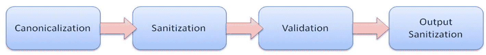
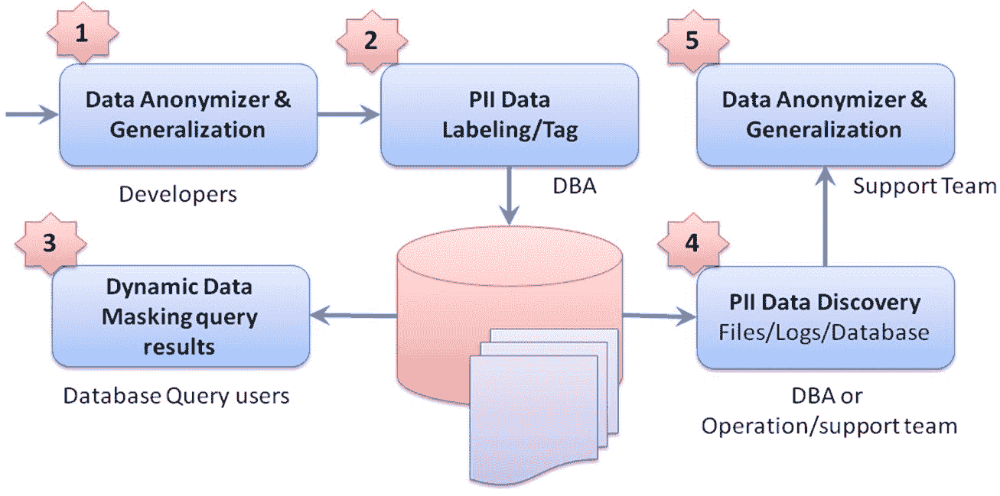
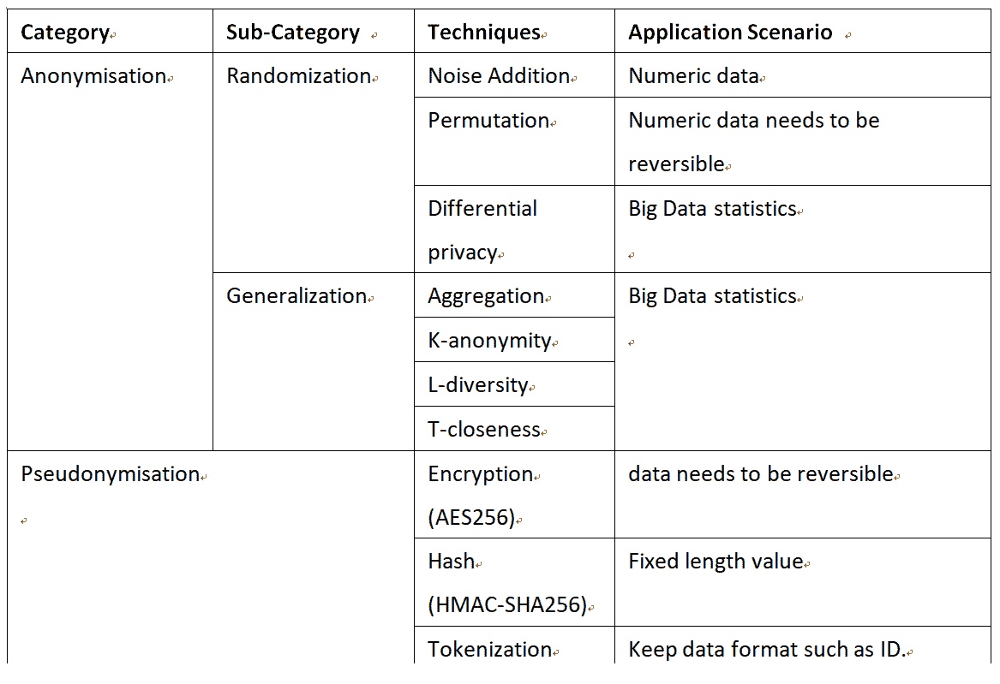
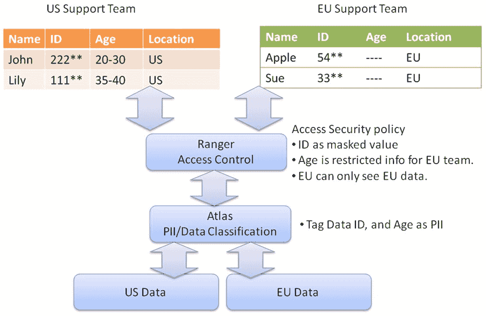

# 第六章：安全架构与设计原则

安全管理，包括其目标、安全保障计划和安全要求，在前面的章节中已有解释。本章将讨论安全架构和设计原则。对于安全架构师和开发人员来说，基于成熟的安全框架构建软件将大大降低安全风险，同时遵循行业最佳实践，也能减少实现过程中的工作量。因此，本章介绍了云服务架构的关键安全元素和一些成熟的安全框架，依据具体场景进行应用。我们还将在本章讨论 GDPR 和数据保护技术。

本章将涵盖以下主题：

+   安全架构设计原则

+   云服务安全架构参考（ESAPI）

+   安全框架（Shiro、加密、验证、数据屏蔽）

+   GDPR 和数据治理

# 安全架构设计原则

在本节中，我们将讨论两个关键概念，即安全设计和隐私设计。当我们讨论安全时，更侧重于整个系统的安全控制，如身份验证、授权、可用性、问责性、完整性和保密性。隐私则特别关注隐私数据或个人身份信息（PII）。隐私保护专注于授权的数据处理生命周期和治理。

如果我们以一般术语对一些安全控制进行分类，你可能会发现一些差异，尽管在安全和隐私方面有一些重叠区域：

|  | **安全设计** | **隐私设计** |
| --- | --- | --- |
| **主要关注点** | 未经授权的系统访问。 | 授权的隐私数据处理过程。 |

| **原则** | 根据 OWASP，安全设计原则如下：

+   最小化攻击面

+   建立安全默认值

+   最小权限原则

+   深度防御原则

+   安全失败

+   不信任服务

+   职责分离

+   避免通过模糊性来保障安全

+   保持安全简单

+   正确修复安全问题

| 参考 OECD 隐私原则，隐私设计一词由八项原则定义：

+   收集限制原则

+   数据质量原则

+   目的规定原则

+   使用限制原则

+   安全保障原则

+   开放性原则

+   个人参与原则

+   问责原则

|

| **控制示例** |
| --- |

+   访问控制

+   登录失败尝试

+   会话控制

+   时间戳

+   不可否认性

+   配置变更控制

+   审计安全事件

+   加密模块

+   事件监控

+   错误处理

|

+   Cookie

+   匿名性

+   同意

+   混淆

+   限制

+   通知与告知

+   身份验证

+   最小化

+   分离

+   加密

+   数据屏蔽

|

以下行业参考资料可以帮助你构建一个安全的架构：

+   **开放安全架构（OSA）模式**：[`www.opensecurityarchitecture.org/`](http://www.opensecurityarchitecture.org/)

+   **CSA CAIQ（共识评估倡议问卷）**: [`cloudsecurityalliance.org/group/consensus-assessments`](https://cloudsecurityalliance.org/group/consensus-assessments)

+   **Google VSAQ（供应商安全评估问卷）**: [`github.com/google/vsaq`](https://github.com/google/vsaq)

+   **PCI 自我评估问卷（SAQ）**: [`www.pcisecuritystandards.org/pci_security/completing_self_assessment`](https://www.pcisecuritystandards.org/pci_security/completing_self_assessment)

+   **NIST 1500-4 v4 大数据互操作框架 安全与隐私**: [`www.nist.gov/publications/nist-big-data-interoperability-framework-volume-4-security-and-privacy`](https://www.nist.gov/publications/nist-big-data-interoperability-framework-volume-4-security-and-privacy)

+   **NIST 800-122 保护个人可识别信息（PII）机密性的指南**: [`csrc.nist.gov/publications/detail/sp/800-122/final`](https://csrc.nist.gov/publications/detail/sp/800-122/final)

我们已经理解了安全与隐私的概念和原则。然而，大多数组织面临的挑战是如何将这些原则融入到应用程序或服务中。因此，我们将在接下来的章节中讨论一些设计模式以及开源框架的实现。

# 云服务安全架构参考

**开放安全架构**（**OSA**）模式 **SP-011：云计算模式** 和 **SP-008：公共 Web 服务器模式** 提供了整个系统的概览图。此外，**SP-001：客户端模块** 和 **SP-002：服务器模块** 也是很好的参考。请查看以下链接中的云计算模式组件：[`www.opensecurityarchitecture.org/cms/library/patternlandscape/251-pattern-cloud-computing`](http://www.opensecurityarchitecture.org/cms/library/patternlandscape/251-pattern-cloud-computing)

此外，如果你在寻找用于自我评估或合作伙伴安全评估的问卷或检查表，以下是一些推荐的参考资料。CSA CAIQ 汇总了大多数安全标准（包括 ISO 27001、FedRAMP、NIST 800-53 R3 和 PCI DSS）形成一个自我评估问卷。VSAQ 主要用于外部供应商评估，涵盖了网络应用安全、安全与隐私程序、基础设施安全以及物理和数据中心安全方面。

+   **CSA CAIQ（共识评估倡议问卷）**: [`cloudsecurityalliance.org/group/consensus-assessments/`](https://cloudsecurityalliance.org/group/consensus-assessments/)

+   **Google VSAQ（供应商安全评估问卷）**: [`vsaq-demo.withgoogle.com/`](https://vsaq-demo.withgoogle.com/)

+   **PCI 数据安全标准自我评估问卷（SQA）**: [`www.pcisecuritystandards.org/documents/SAQ-InstrGuidelines-v3_2.pdf`](https://www.pcisecuritystandards.org/documents/SAQ-InstrGuidelines-v3_2.pdf)

# 安全框架

架构原则可能对大多数开发人员来说仍然过于抽象。因此，在本节中，我们将讨论一些关键的开源安全框架。根据安全目标和编程语言的不同，存在各种类型的开源安全框架。我们将在这里讨论一些主要或广泛使用的安全框架。

采用安全框架是实现 *安全设计* 的最佳方法。一个成熟的安全框架提供如身份认证、访问控制、会话管理、HTTP 安全、加密和日志记录等安全控制功能。它还使得一个对安全知识了解较少的初级开发人员也能够构建安全的软件。

只需记住，我们将介绍的安全框架是与我们的应用程序集成的第三方安全组件。像杀毒软件、Web 应用防火墙和入侵检测等安全应用程序将不在本节讨论范围内，稍后章节中会详细讨论。

# Java Web 安全框架

如前所述，采用 Web 安全框架将帮助我们处理大量的安全控制。以 Spring Security 为例，编辑 XML 配置不仅能提供登录/登出表单认证，还能提供 CSRF 攻击防护、会话管理以及 HTTP 安全头（HSTS、X-content-type、XSS、X-Frame-Options）保护：

| **Java 安全框架** | **关键特性** |
| --- | --- |
| **Spring Security** |

+   Spring Security 框架仅适用于基于 Java 和 Spring 的应用程序。它提供了许多开箱即用的安全控制功能，如用户身份认证、CSRF 攻击防护、会话固定保护、HTTP 安全头和 URL 访问控制。此外，它还支持多种身份认证方式，如 Oauth2.0、CAS 和 OpenID。

|

| **Shiro** |
| --- |

+   与 Spring Security 相比，Shiro 是一个更轻量级、更简单的框架。Shiro 和 Spring Security 之间的主要区别在于，Shiro 不需要基于 Spring 的应用程序，它可以独立运行，无需与任何 Web 框架或非 Web 环境相结合。

|

| **对象访问控制 (OACC)** |
| --- |

+   OACC 主要提供身份认证和授权。OACC 的关键特点是，它提供了与应用程序资源的安全关系，而 Spring Security 则通过 URL、方法和角色来定义授权。

+   在 OACC 中，安全关系的示例定义可能是：（Sara）对（`TimeSheet.xls`）拥有（读取、编辑）权限。能够在安全关系中建立应用程序资源（`TimeSheet.xls`）是 OACC 中独特的授权模型。

|

对于 Java 开发团队，推荐使用哪种框架？如果网站完全基于 Java Spring 构建，Spring Security 仍然是最佳选择，因为它具有强大的安全特性和完整的技术文档。然而，如果你的 Web 应用程序运行在非 Web 或非 Spring 的应用环境中，推荐使用 Shiro。如果你的应用可能需要资源访问控制模型，尝试使用 OACC。

# 非 Java 网络安全框架

对于非 Java 编程，以下是一些建议：

| **编程语言** | **身份验证框架** |
| --- | --- |
| **Node.JS** |

+   **Passport 框架**是一个用于 Node.JS 的身份验证模块。

|

| **Ruby on Rails** |
| --- |

+   **Devise Security**：这是一个用于 Ruby 的安全模块。它提供了密码复杂性、验证码、用户账户不活跃检查、验证码和会话控制等安全功能。

|

| **ASP.NET** |
| --- |

+   **ASP.NET Core** 提供了身份验证、授权、防 XSS、SSL 强制、反请求伪造、加密等安全功能，并支持 GDPR 的 API。

|

| **Python** |
| --- |

+   **Yosai** 是一个 Python 应用程序的安全框架

+   **Flask Security**：它为 Flask 应用程序提供了常见的安全控制，如身份验证、密码哈希和角色管理。

|

# 网络隐私保护准备情况

要评估网站的隐私保护准备情况，不仅需要考虑一般的网络安全控制，还需关注以下几个主要领域：

+   **TLS 安全数据传输**：TLS 配置错误可能导致数据传输不安全或遭遇中间人攻击。

+   **Referrer Policy**：Referrer Policy 定义了浏览器应如何处理 Referrer 信息，该信息揭示了用户原始访问的网站。网站访问历史也被认为是个人隐私信息。

+   **Cookie 同意声明**：为遵守 GDPR，收集 cookie 信息和使用任何第三方 cookie 都需要明确的 cookie 同意。

+   **HTTP 安全头**：HTTP 协议本身提供了网络安全控制。请参考以下表格，了解建议的 HTTP 安全头配置。

以下表格总结了隐私安全要求的技术部分以及评估和构建网站的建议工具：

| **隐私技术要求** | **工具** |
| --- | --- |
| 安全通信：默认使用 HTTPS 并安全配置 TLS。 |

+   Pentest Box 或 Kali Linux 中包含 SSLyze、SSLScan 和 TestSSLServer

|

| 访问网站的来源不应通过 referer 头信息泄露给其他网站。 |
| --- |

+   Referrer Policy 定义了如何使用 referer 信息。Referrer Policy 的配置取决于具体要求。

+   no-referrer 将确保浏览器从不发送 referer 头信息。

+   如果需要发送此信息，建议使用‘strict-origin’配置通过 HTTPS 发送信息。

|

| 如果使用 Google Analytics，请启用隐私扩展来匿名化 IP。 |
| --- |

+   为 Google Analytics 启用 IP 屏蔽

|

| 第三方 Cookies 或嵌入式服务（如 Google Analytics），需用户同意。 |
| --- |

+   Cookie Consent

+   Cookie Consent JavaScript 插件：[`github.com/insites/cookieconsent`](https://github.com/insites/cookieconsent)

|

| HTTP 安全头 | 以下是推荐的强制性安全 HTTP 头示例。

+   内容安全策略（CSP）   "default-src 'self' "

+   Referrer-Policy    "no-referrer"

+   Strict-Transport-Security   "max-age=31536000"

+   X-content-Type-options    "nosniff"

+   X-Frame-Options    "SAMEORGIN"

+   X-Xss-Protection    "1;mode=block"

+   Cookie                                  "Secure"

参阅 OWASP 安全头项目，了解每个安全头的定义。 |

还建议为您的网站构建内部隐私扫描工具。以下资源提供了符合隐私要求的在线扫描服务：

隐私评分评估：[`privacyscore.org`](https://privacyscore.org).

# 登录保护

登录保护可以视为应用程序的第一道防线。黑客可能使用工具或 API 进行暴力破解登录攻击。CAPTCHA 是区分人类与机器输入的方式之一。CAPTCHA 要求客户端完成视觉感知任务。然而，CAPTCHA 可能会被 OCR 或无意的人力所破解。除了 CAPTCHA 之外，我们还可以增加另一层安全防护来监控登录失败次数。如果登录失败次数达到某一阈值，系统应采取措施，如禁止 IP 来源：

登录保护的工具/模块总结在下表中：

| **登录保护技术** | **工具/模块** |
| --- | --- |
| 检测日志中登录失败的次数并采取措施 |

+   Fail2Ban

|

| CAPTCHA 解决方案，防止机器暴力破解登录攻击 |
| --- |

+   使用 VisualCaptcha 构建自己的 CAPTCHA 服务

+   Google reCAPTCHA

|

# 加密模块

加密模块的典型使用案例不仅仅是数据加密/解密，还包括 SSL/TLS 安全通信、密钥交换、X509 证书处理、消息完整性的一-way 哈希以及随机数生成。开发团队可能需要的推荐加密模块如下：

| **加密模块** | **应用场景** |
| --- | --- |
| OpenSSL |

+   功能全面且最广泛使用的加密和 SSL/TLS 工具包

|

| Bouncy Castle Crypto APIs |
| --- |

+   轻量级加密 Java API

|

| mbed TLS |
| --- |

+   OpenSSL 替代品

+   嵌入式产品中的加密与 SSL/TLS

+   加密 C API

|

| SSLyze |
| --- |

+   验证 Web 服务器的安全 TLS 配置

|

此外，运营团队可能更关心的是服务器上的加密配置，例如 Web 服务器、SSH、邮件、VPN、数据库、代理和 Kerberos 等。

参见《应用加密强化》：[`betterCrypto.org/static/applied-crypto-hardening.pdf`](https://betterCrypto.org/static/applied-crypto-hardening.pdf)。

# 输入验证和数据清洗

输入验证就像是整个应用程序的外围安全控制。输入不仅包括用户的数据输入，还包括函数调用、方法、API 或系统之间传递的参数。验证的概念涵盖了各种技术方法：

| **技术** | **目的** | **示例** |
| --- | --- | --- |
| **规范化** | 将输入数据处理为已知或预期的格式。 |

+   URL 解码/编码

+   文件路径或名称处理

|

| **清洗** | 清洗是去除非法字符或使潜在风险数据变得安全。始终对输出进行清洗以避免 XSS。 |
| --- | --- |

+   转义：将 < > ' " & 替换为 HTML 实体。

|

| **验证** | 检查输入是否有效或是否符合约束的数据类型、长度等。 |
| --- | --- |

+   IsAlpha, isCreditCard, isDecimal, isIP

|

实施的正确顺序也很重要，可以减少恶意数据绕过验证的可能性。安全编码需要以下内容：

+   在验证之前对字符串进行规范化处理

+   在验证之前对路径名进行规范化处理

+   在验证之前进行任何字符串修改

+   在使用之前对 URL 进行规范化处理

当接收到数据时，应首先对数据进行规范化处理，将其转化为预期的格式，然后对数据进行清洗，移除非法字符，验证可能根据业务规则检查数据是否可接受。最后，如果数据需要输出，总是需要进行输出清洗，以防止 XSS 攻击：

对于一般的规范化、清洗和验证，我们可以应用成熟的安全框架提供的 API，而开发团队可以更多地专注于业务逻辑验证：

| **编程语言** | **验证和清洗框架** |
| --- | --- |
| Java |

+   OWASP Java HTML 清洗器

|

| Ruby on Rails |
| --- |

+   Active Record 验证

|

| Node.js/JavaScript |
| --- |

+   验证器

|

| JavaScript |
| --- |

+   DOMPurity 用于清洗 HTML 并防止 XSS 攻击

|

| Python |
| --- |

+   Cerberus

|

# 数据屏蔽

数据屏蔽是通过混淆原始/敏感数据来保护数据的过程。根据不同的角色或使用场景，需要使用不同的工具。典型的五种数据屏蔽场景包括：

| **场景** | **涉及角色** | **所需工具/模块** |
| --- | --- | --- |

|

1.  应用程序接收数据并根据定义的策略进行数据屏蔽

| 开发者 |
| --- |

+   数据屏蔽模块

+   数据屏蔽策略

|

|

1.  定义 PII 数据标签和访问策略

| 数据库管理员 (DBA) |
| --- |

+   PII 元数据定义

+   PII 访问策略

|

|

1.  基于定义的 PII 标签和访问策略查询数据结果并进行数据屏蔽

| 数据查询用户 |
| --- |

+   动态数据屏蔽

|

|

1.  运维团队可能会监控并检查数据、文件、配置或任何非结构化数据中是否存在 PII。

| 运维团队 |
| --- |

+   PII 数据发现

|

|

1.  日志或文件中的任何 PII 在进一步处理前必须进行掩码处理。

| 支持团队 |
| --- |

+   数据匿名化工具

|

对于数据掩码技术，匿名化和假名化是两大常见类别。

|  | **匿名化** | **假名化** |
| --- | --- | --- |
| **关键区别** | 匿名数据无法重新识别。 | 假名化数据是数据替代，可以进行某种形式的重新识别。加密或哈希是这一类别中最常用的技术。 |

| 数据 | 匿名化主要用于敏感的个人信息，例如：

+   姓名

+   身份证号（信用卡号、社会安全号码等）

+   邮政地址

+   电话号码

+   邮政编码 + 城市

|

+   任何数据

|

表格列出了常用的数据掩码、匿名化和假名化技术：

让我们以电话号码为例，说明匿名化与假名化之间的关键区别。如果电话号码的原始值是 12345678，那么该号码的匿名化将是 123*****，而该电话号码的假名化则是哈希或加密后的值 ADF231DADEF。这也意味着，如果号码的匿名化结果类似于 123*****，用户就无法知道原始值。然而，如果已知算法或收集到足够的数据样本，哈希或加密后的值仍然可能被逆向还原为原始值。

+   关于匿名化和假名化的实现，请参考 ARX 数据匿名化工具：[`arx.deidentifier.org/`](http://arx.deidentifier.org/)。

+   数据掩码技术参考：[`www.pdpjournals.com/docs/88197.pdf`](https://www.pdpjournals.com/docs/88197.pdf)

# 数据治理 – Apache Ranger 和 Atlas

在数据隐私治理方面，我们不仅仅需要**基于角色的访问控制** (**RBAC**) 或 **基于属性的访问控制** (**ABAC**)，这些是常见的安全访问控制方式。数据治理还需要额外的元数据或标签来定义数据分类，并且需要行级别的基于属性的访问控制来进行数据掩码或行过滤。以欧盟和美国的数据中心为例——我们希望能拥有细粒度的访问控制策略，具体如下：

+   美国支持团队只能查询美国数据，无法查看欧盟数据

+   欧盟支持团队只能查询欧盟数据，无法查看美国数据

+   年龄被视为个人身份信息（PII），只能作为范围显示给美国支持团队

+   欧盟支持团队不能查看年龄信息

+   身份证号是 PII 数据，将进行数据掩码处理

这个示例展示了数据隐私更多的是关于授权访问控制隐私数据的权限。随着大数据与云服务的使用、GDPR 合规性以及个人隐私意识的提升，对数据治理、数据掩码、加密、数据分类和细粒度 ABAC 等技术的需求不断增加：

你可以考虑基于 Apache Ranger 和 Atlas 框架构建数据隐私治理。Apache Ranger 主要用于 ABAC，而 Atlas 用于数据分类。

# 第三方开源管理

组织应建立内部开源和第三方软件的数据库及选择标准。该数据库记录项目中采用的开源或自家开发的组件，为类似项目（例如我们之前讨论的网络安全框架）提供良好的框架选择参考。如果你正在寻找一个开源组件搜索数据库，可以尝试 Open Hub。你可以在这里搜索开源项目并找到项目所需的资源：[`www.openhub.net/`](https://www.openhub.net/)。此外，开源选择标准有助于减少法律和质量风险。

以下表列出了典型的标准检查清单：

| **选择标准** | **示例和说明** |
| --- | --- |
| 开源社区是否及时修复安全问题？ |

+   高安全风险在 1 个月内修复。

|

| 采用最新且稳定的版本 |
| --- |

+   社区发布的官方且稳定版本。

|

| 是否提供技术支持？ |
| --- |

+   开源社区提供官方技术支持并反馈问题。

|

| 含有 GPL 和 LGPL 许可证的软件组件不太推荐。 |
| --- |

+   不推荐使用 GPL 和 LGPL 许可证的组件。如果使用了 GPL 软件组件，可能还需要将自定义开发的源代码作为开源代码公开。

+   **二进制分析工具**（**BAT**）建议用于基于二进制文件的许可证扫描：[`www.binaryanalysis.org/`](http://www.binaryanalysis.org/)。

|

| 漏洞状态与修复 |
| --- |

+   查询组件的漏洞状态。欲了解更多详细信息，请访问[`nvd.nist.gov/vuln/search`](https://nvd.nist.gov/vuln/search)。

|

| 软件发布或更新频率 |
| --- |

+   最新版本是在 6 个月内发布，还是几年之前发布的？

|

| 软件架构 |
| --- |

+   是不是使用了最新的软件技术，还是依赖于遗留框架？

|

对于开源组件的安全性，推荐的安全实践和工具在 DevOps 阶段的应用总结如下表所示：

| **阶段** | **活动** | **推荐工具/实践** |
| --- | --- | --- |
| 设计与选择 | 选择开源软件。 |

+   [www.openHub.Net](http://www.openHub.Net)

+   开源选择检查清单

+   内部开源数据库

|

| 软件包交付 | 识别项目中的所有依赖关系并检查已知的漏洞。 |
| --- | --- |

+   OWASP 依赖检查

+   OWASP 依赖追踪

|

| 软件包部署 | 在线服务监控和 CVE 扫描。 |
| --- | --- |

+   CVE 数据库 ([`nvd.nist.gov/vuln/search`](https://nvd.nist.gov/vuln/search))

+   NMAP 或 OpenVAS 扫描

|

此外，参考 SAFECode Managing Security Risks Inherent in the Use of Third-party Components: [`www.safecode.org/wp-content/uploads/2017/05/SAFECode_TPC_Whitepaper.pdf`](https://www.safecode.org/wp-content/uploads/2017/05/SAFECode_TPC_Whitepaper.pdf)。

# 总结

我们讨论了安全架构设计原则，包括安全设计和隐私设计的澄清。安全设计侧重于**机密性、完整性和可用性**（**CIA**），而隐私设计更关注隐私数据的保护。行业标准 CSA、Google、PCI 或 NIST 提供了良好的参考。我们还可以参考 OSA 云计算模式来理解云服务的整体安全架构。

要构建一个安全框架，我们列出了一些开源安全框架，以实现一些安全控制，而不是重新发明轮子。例如，在 Java 中有 Spring Security 和 Shiro 用于 Web 安全框架，NodeJS 中有 Passport 框架。

谈到网站隐私保护时，我们讨论了法律要求，例如版权声明、Cookie、免责声明和数据保护通知。我们列出了网页隐私的关键安全技术控制。

我们还讨论了登录保护模块，如 Fail2Ban 和 reCAPTCHA，以及加密模块（OpenSSL、SSLyze）。我们解释了输入验证的概念，包括归一化、清理和验证。为了保护敏感数据，解释了数据脱敏和技术（匿名化、假名化）的场景。解释了使用 Apache Ranger 和 Atlas 框架进行数据分类和脱敏的数据治理。介绍了大量第三方组件和安全框架组件后，我们还建议组织如何管理第三方开源软件。

在下一章中，我们将更详细地讨论威胁建模和安全设计安全实践。

# 问题

1.  以下哪项是安全设计原则之一？

    1.  建立安全默认值

    1.  最小权限原则

    1.  安全地失败

    1.  以上全部

1.  以下哪个参考汇总了大多数安全标准，如 ISO、FedRAMP 和 NIST？

    1.  CSA CAIQ

    1.  Google VSAQ

    1.  PCI DSS

    1.  （OSA）开放安全架构模式

1.  Spring Security 框架提供了什么安全保护？

    1.  认证

    1.  CSRF 攻击防护

    1.  HTTP 安全头部

    1.  以上全部

1.  Shiro 和 Spring Security 之间的主要区别是什么？

    1.  Shiro 不需要 Java Spring 框架

    1.  记录日志

    1.  加密

    1.  入侵防御

1.  以下哪个可能适用于 Passport 框架？

    1.  ASP .NET

    1.  Node.JS

    1.  Ruby on Rails

    1.  Python

1.  以下哪个加密模块特别用于嵌入式应用？

    1.  OpenSSL

    1.  Mbed TLS

    1.  SSLyze

    1.  Fail2Ban

1.  以下哪个是清理的示例？

    1.  将输入数据处理为已知或预期的形式

    1.  检查输入是否有效

    1.  删除非法字符

    1.  检查数据类型

# 进一步阅读

+   **隐私设计原则，七项基础原则**: [`ipc.on.ca/wp-content/uploads/Resources/7foundationalprinciples.pdf`](https://ipc.on.ca/wp-content/uploads/Resources/7foundationalprinciples.pdf)

+   **NIST 800-53 修订版 4：联邦信息系统与组织的安全与隐私控制**: [`www.nist.gov/publications/security-and-privacy-controls-federal-information-systems-and-organizations-including-0`](https://www.nist.gov/publications/security-and-privacy-controls-federal-information-systems-and-organizations-including-0)

+   **NIST SP800-30 修订版 1：进行风险评估指南**: [`csrc.nist.gov/publications/detail/sp/800-30/rev-1/final`](https://csrc.nist.gov/publications/detail/sp/800-30/rev-1/final)

+   **NIST SP 800-12 修订版 1：信息安全简介**: [`csrc.nist.gov/publications/detail/sp/800-12/rev-1/final`](https://csrc.nist.gov/publications/detail/sp/800-12/rev-1/final)

+   **SP 800-39 管理信息安全风险：组织、任务和信息系统视角**: [`csrc.nist.gov/publications/detail/sp/800-39/final`](https://csrc.nist.gov/publications/detail/sp/800-39/final)

+   **SP 800-37 修订版 1：适用于联邦信息系统的风险管理框架应用指南：安全生命周期方法**: [`csrc.nist.gov/publications/detail/sp/800-37/rev-1/final`](https://csrc.nist.gov/publications/detail/sp/800-37/rev-1/final)

+   **隐私模式**: [`privacypatterns.org/patterns`](https://privacypatterns.org/patterns)

+   **安全与隐私开放参考架构**: [`media.readthedocs.org/pdf/security-and-privacy-reference-architecture/latest/security-and-privacy-reference-architecture.pdf`](https://media.readthedocs.org/pdf/security-and-privacy-reference-architecture/latest/security-and-privacy-reference-architecture.pdf)

+   **OSA（开放安全架构）模式**: [www.opensecurityarchitecture.org/cms/library/patternlandscape](http://www.opensecurityarchitecture.org/cms/library/patternlandscape)

+   **Google VSAQ 供应商安全评估问卷**: [`github.com/google/vsaq`](https://github.com/google/vsaq)

+   **Hadoop 数据安全**: [`docs.hortonworks.com/HDPDocuments/HDP2/HDP-2.6.4/bk_security/content/ch_hdp-security-guide-overview.html`](https://docs.hortonworks.com/HDPDocuments/HDP2/HDP-2.6.4/bk_security/content/ch_hdp-security-guide-overview.html)

+   **加密密钥长度建议**: [www.keylength.com/](http://www.keylength.com/)

+   **SAFECode 管理第三方组件使用中固有的安全风险**: [`www.safecode.org/wp-content/uploads/2017/05/SAFECode_TPC_Whitepaper.pdf`](https://www.safecode.org/wp-content/uploads/2017/05/SAFECode_TPC_Whitepaper.pdf)

+   **云应用程序安全开发的实践**: [`safecode.org/wp-content/uploads/2018/01/SAFECode_CSA_Cloud_Final1213.pdf`](https://safecode.org/wp-content/uploads/2018/01/SAFECode_CSA_Cloud_Final1213.pdf)

+   **OECD 隐私原则** [`oecdprivacy.org/`](http://oecdprivacy.org/)
