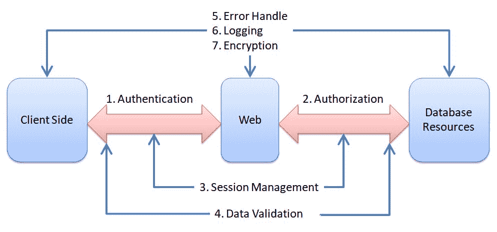

# 威胁建模实践与安全设计

在讨论安全架构和设计原则后，我们将介绍威胁建模的安全实践和工具。采用威胁建模实践有助于在设计阶段减少主要的安全风险。此外，一旦识别出风险，我们将介绍如何应用 OWASP 安全设计最佳实践来缓解这些安全风险。

本章将覆盖以下主题：

+   威胁建模实践

+   使用 STRIDE 进行威胁建模

+   图表设计工具

+   卡牌游戏

+   威胁库参考

+   案例研究：是否需要正式文档？

+   安全设计

# 威胁建模实践

威胁建模是一项安全实践，旨在帮助团队根据现有的架构设计识别威胁、攻击和风险，并减少这些潜在的安全风险。在进一步讨论之前，有几点关于威胁建模需要澄清：

+   这是一个团队活动，不仅仅是开发人员的工作。与 QA、运维、架构师和安全团队的参与将更为有效。

+   威胁建模可能是唯一不建议通过自动化完成的安全实践。这是一个团队协作的活动。

+   威胁建模的目的是识别高风险威胁，而不是提供一个全面的威胁列表，关键模块如身份验证、授权、购买或客户信息处理等是重点。

+   建议在架构设计完成后，或者在详细设计和编码阶段之前进行威胁建模，尽管将威胁建模应用于现有应用程序也是常见做法。

一个典型的威胁建模过程包括 DFD 图或架构审查、威胁分析、风险影响评估、缓解措施以及产品实施行动审查。威胁建模通常从对架构的分析开始。DFD 图在威胁建模活动中是常用的。然而，只要团队能够理解整个架构设计和信息流，UML 或其他现有架构设计也可以完成任务。威胁建模的目标是与缓解措施一起讨论最相关和优先级最高的安全风险。不要让过程或工具限制团队的学习和创新。

根据应用程序的复杂性，我们可以在架构或高级设计阶段进行威胁建模。如果是一个非常大的项目，并且大多数模块提供类似功能，建议对高风险部分或最能代表业务功能的模块进行威胁建模。以下是推荐进行威胁建模的模块。这些也适用于代码审查：

+   包含安全控制的模块，如身份验证、授权、会话管理、加密、数据验证、错误处理、日志记录、管理和数据库处理器。

+   存在漏洞的旧模块（CVE）。

+   可能与未知用户或第三方 API 进行外部交互的模块

+   处理敏感信息的模块。

# STRIDE 威胁建模

STRIDE 威胁模型定义了六类威胁，包括欺骗、篡改、否认、信息披露、服务拒绝和权限提升。通常用于评估架构设计。

STRIDE 威胁模型和通用安全缓解措施在下表中进行了总结。除了 STRIDE，还建议在分析中包括隐私：

| **STRIDE 威胁** | **缓解措施** |
| --- | --- |
| 欺骗 | 认证，如凭证、证书和 SSH |
| 篡改 | 完整性（HASH256，数字签名） |
| 否认 | 认证、日志记录 |
| 信息披露 | 保密性（加密，ACL） |
| 服务拒绝 | 可用性（负载均衡、缓冲区、消息队列） |
| 权限提升 | 授权（ACL） |
| 隐私（附加内容） | 数据屏蔽、访问控制、用户同意、删除 |

STRIDE 分析通常涉及实体（用户、管理员、外部应用）、过程（Web 服务器、FTP、服务）、数据存储（数据库或文件）、数据流（模块、过程、系统或用户之间的参数或信息）和信任边界。以下是 STRIDE 分析映射的一些示例：

| **STRIDE 和隐私威胁** | **示例** |
| --- | --- |
| 欺骗 | 实体（用户或客户端）可能伪装其身份。过程可能伪装其来源。 |
| 篡改 | 该过程可能会被篡改，例如 DLL 注入攻击。数据存储可能会被篡改。信息流可能会被篡改，例如 MITM 攻击。 |
| 否认 | 实体（客户端）可能否认已做的事情。过程可能篡改日志以否认已做的事情。审计日志的数据存储可能会被篡改。 |
| 信息披露 | 该过程本身可能包含一个加密密钥，并且可以被反向操作。数据存储会保留密码的明文副本。数据流在没有加密通道的情况下传输密码。 |
| 服务拒绝 | 过程可能连接到过多的客户端并导致超载。数据存储损坏或已满。数据流断开，无法到达目标。 |
| 权限提升 | 该过程应在用户模式下运行，但可以执行内核模式命令。该过程以附加权限运行。 |
| 隐私 | 外部实体（客户端应用）可能会收集 PII，但未告知用户。数据存储在日志中保留 PII，且未进行匿名化处理。 |

请参考 OWASP *应用威胁建模*，以获取基于 DFD 图的更多示例：[`www.owasp.org/index.php/Application_Threat_Modeling`](https://www.owasp.org/index.php/Application_Threat_Modeling)。

实际操作中，STRIDE 可能仍然过于概括，无法让团队深入讨论威胁。因此，强烈建议使用清单或威胁库列表，如 CWE 列表（[`cwe.mitre.org/data/index.html`](https://cwe.mitre.org/data/index.html)）、**常见攻击模式枚举与分类** (**CAPEC**) 或 **对抗性战术、技术与常识** (**ATT&CK**)，我们将在下一部分讨论这些内容。

工具和模板的目的是帮助团队更高效地进行威胁建模。另一方面，使用工具可能会给团队带来学习曲线或额外负担。我们将介绍一些可以应用于威胁建模实践的工具。

# 图表设计工具

这些工具帮助你绘制应用程序的图表（DFD），标出信任边界，并标注威胁属性。工具还包括一个威胁库，供用户从中选择威胁。它是一个理想的工具，用于记录威胁建模分析报告。通常，应用程序架构和系统图（DFD）展示之后，紧接着就是威胁识别。

如果你的团队分布在多个地区，或者威胁建模需要跨不同时区的多个角色提供离线反馈，强烈建议使用这些工具来生成威胁建模分析报告。

微软威胁建模工具、OWASP Threat Dragon 和 Mozilla SeaSponge 是这一类别中的工具，它们可以帮助你绘制带有威胁分析的 DFD 图表：

+   微软威胁建模工具：[`www.microsoft.com/en-us/download/details.aspx?id=49168`](https://www.microsoft.com/en-us/download/details.aspx?id=49168)

+   OWASP Threat Dragon：[`www.owasp.org/index.php/OWASP_Threat_Dragon`](https://www.owasp.org/index.php/OWASP_Threat_Dragon)

+   Mozilla SeaSponge：[`mozilla.github.io/seasponge/`](http://mozilla.github.io/seasponge/)

# 纸牌游戏

纸牌游戏使威胁建模成为团队建设的一部分。所有团队成员聚集在一起，手中持有一副卡片和应用程序的数据流图。每张卡片代表一种常见的威胁。以 OWASP Cornucopia 为例，这些威胁也映射到业界实践中，如 OWASP SCP、OWASP ASVS、CAPEC 和 SAFECode。

OWASP Cornucopia 定义了六个与关键安全领域相关的套件：

+   **数据验证和编码** (**VE**)

+   **身份验证** (**AT**)

+   **会话管理** (**SM**)

+   **授权** (**AZ**)

+   **加密** (**CR**)

+   **Cornucopia** (**C**)

请参考此链接以获取卡片的 DOC 或 PDF 版本：[`www.owasp.org/index.php/OWASP_Cornucopia#tab=Get_the_Cards`](https://www.owasp.org/images/6/6b/Owasplondon-colinwatson-cornucopia.pdf)。

例如，**数据验证与编码** 套件的第 2 张卡片展示了攻击场景，并将安全最佳实践映射到 OWASP SCP、ASVS、AppSensor、CAPEC 和 SAFECode：

| **2** |
| --- |
| Brian 可以通过错误信息、配置不当、默认安装文件的存在或旧的、测试的、备份的或资源的副本，或者源代码暴露来收集关于底层配置、模式、逻辑、代码、软件、服务和基础设施的信息 |

|

&#124; OWASP SCP69, 107-109, 136, 137, 153, 156, 158, 162 &#124;

&#124; OWASP ASVS1.10, 4.5, 8.1, 11.5, 19.1, 19.5 &#124;

&#124; OWASP AppSensorHT1-3 &#124;

&#124; CAPEC54, 541 &#124;

&#124; SAFECode4, 23 &#124;

&#124; OWASP Cornucopia 电商网站版 v1.20-EN &#124;

|

这个卡牌游戏即使只有一个开发人员也能作为一个有效的工具。开发人员或测试人员可以随机抽取一张卡牌，反映现有应用程序中的安全问题。利用这些卡牌思考现有设计是否容易受到威胁，或者是否缺少安全考虑。这款卡牌游戏能使威胁建模变得更加有趣。毫无疑问，面对面的讨论总是最有效的沟通方式。

有两个问题我们需要注意。首先，要使一个团队能够一起玩卡牌游戏，F2F 团队必须坐在一起。其次，一个分布在多个地区的项目团队可能无法一起玩卡牌游戏。为了解决这两个问题，仍然需要官方文档记录讨论结果。该文档包含已识别的风险和缓解措施，不仅供无法参与卡牌游戏的团队进行审核，还用于追踪目的。

卡牌游戏的参考资料如下：

+   微软 EOP 卡牌游戏：[`www.microsoft.com/en-us/sdl/adopt/eop.aspx`](https://www.microsoft.com/en-us/sdl/adopt/eop.aspx)

+   OWASP Cornucopia 卡牌游戏：[`www.owasp.org/index.php/OWASP_Cornucopia`](https://www.owasp.org/index.php/OWASP_Cornucopia)

# 威胁库参考资料

有时，在威胁建模分析过程中，很难头脑风暴出威胁。通过从威胁库中挑选符合现有应用设计的威胁会更容易。卡牌游戏确实有帮助，但它们可能只呈现最常见的威胁。如果你发现这些威胁不适合你的项目，或者需要更多的威胁库供参考，这里有一些建议的行业威胁库：

| **威胁库** | **特征** |
| --- | --- |
| CAPEC | 以树状视图列出了 508 种攻击模式。攻击模式也可以通过 CSV 和 XML 格式获取。每种攻击模式都标有 CAPEC-ID 编号。 |
| ATT&CK | 按平台（Linux、Windows、Mac、移动设备）分类的威胁，包含具体的攻击技术。每个威胁还讨论了技术性缓解和检测方法，涉及大量实用的黑客和恶意软件攻击技术。 |
| CWE | CWE 是一个软件弱点列表，每个 CWE 都被归类为威胁树视图，并展示不安全和安全的源代码实现。它也是安全编码的一个非常好的参考。 |

# 案例研究——是否需要正式文档？

让我们通过一个案例研究来讨论威胁建模实践的不同方法。Peter 和 Linda 是安全负责人，他们计划与项目团队一起进行威胁建模。Peter 所在的是一家非常大的组织，项目团队成员分布在全球各地。安全流程要求提供正式的威胁建模分析报告，作为进入下一步的标准之一。另一方面，Linda 在一家小型软件公司工作，团队成员都在同一地点。Linda 认为使用白板和卡片游戏进行讨论将比详细文档更加互动和高效。因此，Peter 和 Linda 决定采取不同的方法来进行威胁建模，具体总结如下表所示：

|  | **正式过程（Peter）** | **小组讨论（Linda）** |
| --- | --- | --- |
| **特点** | 需要正式文档交付使用模板和工具生成所需输出文档可能积累知识 | 无需正式文档交付采用专注于团队互动和讨论过程的卡片游戏 |
| **工具** | 检查表和模板威胁建模与图表设计器 | 卡片游戏白板 |
| **缺点** | 文档可能会增加团队的负担 | 讨论过程中缺乏文档可能仅适用于成员地理位置相近的团队 |

没有完美的过程，关键在于哪种方法最适合团队。没有规定 Peter 不能使用卡片游戏，或者 Linda 不能采用正式流程。任何过程采用的最重要部分是理解该过程的目标和合理性。例如，Linda 可能会考虑将最终的卡片游戏讨论结果记录下来，以供利益相关者参考。Peter 可能会考虑在小型模块/团队中使用卡片游戏，以减少文档负担。考虑混合方法可能是一个不错的主意。只要不让流程限制团队的创造力和创新。

# 安全设计

安全设计可以是一个非常广泛的讨论话题。在本节中，我们将重点讨论七个关键安全控制：身份验证、授权、会话管理、数据验证、错误处理、日志记录和加密。请参考以下图示：

安全设计可能与多个因素相关，包括安全需求、安全框架的采用、逻辑流程和正确的实现。以身份验证为例——市场安全需求可能要求添加双因素认证或**一次性密码**（**OTP**）。安全框架，如 Spring Security 或 Shiro 本身，提供身份验证、授权和会话管理的安全控制。然而，错误的逻辑流程和不正确的实现可能导致其身份验证绕过安全问题。尽管组织可以定义安全设计政策和指南，但通过展示安全框架、CWE 案例研究和实施示例仍然是最有效的。

安全设计培训或通讯可以包括行业常见的 CWE 以及公司内部项目的常见问题，随后给出安全设计建议。建议还可以介绍一个安全框架，并列出常见的错误实现，这些错误实现会导致安全风险。在这里，我们仅列出 Java 实现的示例。此外，以下链接建议供进一步阅读：

+   OWASP 备忘单：[`www.owasp.org/index.php/OWASP_Cheat_Sheet_Series`](https://www.owasp.org/index.php/OWASP_Cheat_Sheet_Series)

+   OWASP 安全编码实践：[`www.owasp.org/index.php/OWASP_Secure_Coding_Practices_-_Quick_Reference_Guide`](https://www.owasp.org/index.php/OWASP_Secure_Coding_Practices_-_Quick_Reference_Guide)

+   SAFECode 在敏捷中的安全性：[`safecode.org/publication/SAFECode_Agile_Dev_Security0712.pdf`](http://safecode.org/publication/SAFECode_Agile_Dev_Security0712.pdf)

+   OWASP 前 10 大主动控制：[`www.owasp.org/images/b/bc/OWASP_Top_10_Proactive_Controls_V3.pdf`](https://www.owasp.org/images/b/bc/OWASP_Top_10_Proactive_Controls_V3.pdf)

只需记住，采用安全框架并不意味着应用程序就会得到保障。它仍然需要正确的框架实现：

|  | **常见 CWE** | **开源框架** |
| --- | --- | --- |

| 身份验证 | CWE-294: 捕获重放导致的身份验证绕过 CWE-306: 关键功能缺少身份验证

CWE-307: 不当限制过多的身份验证尝试

CWE-640 忘记密码的弱密码恢复机制 | Spring SecurityShiroKeyCloakVisualCaptchaprivacyIDEA |

| 授权 | CWE-639: 通过用户控制的密钥绕过授权 CWE-647: 使用非标准 URL 路径进行授权决策 CWE-425: 直接请求（“强制浏览”） | Spring SecurityShiro |
| --- | --- | --- |
| 会话管理 | CWE-384: 会话固定 CWE-613: 会话过期不足 CWE-6: J2EE 配置错误: 会话 ID 长度不足 CWE-488: 数据元素暴露给错误的会话 | Spring SecurityShiroJetty |
| 数据验证 | CWE-89 SQL 命令中未正确中和特殊元素 CWE-77 命令中未正确中和特殊元素 CWE-120: 缓冲区复制时未检查输入大小（“经典缓冲区溢出”） | Java Commons Validator |
| 错误处理 | CWE-200: 信息泄露 CWE-460: 异常抛出时未正确清理 | 不适用。通常需要安全编码实践和正确的配置。 |
| 日志记录 | CWE-532: 通过日志文件暴露信息 CWE-117: 日志输出未正确中和 CWE-779: 记录过多数据 | SLF4F（Java 简单日志外观）OWASP 安全日志 |
| 加密 | CWE-759: 使用无盐的单向哈希 CWE-523: 未保护的凭证传输 CWE-330: 使用不充分随机的值 | OpenSSL BouncyCastle |

以下是 OWASP 主动控制建议的其他实用安全软件实施框架：

| **OWASP 十大主动控制** | **开源工具和框架** |
| --- | --- |
| C1: 定义安全需求 |

+   OWASP **应用安全验证标准**（**ASVS**）

+   OWASP **移动应用安全验证标准**（**MASVS**）

|

| C2: 利用安全框架和库 |
| --- |

+   OWASP 依赖检查

+   OWASP 依赖追踪

+   Retire.JS

|

| C3: 安全数据库访问 |
| --- |

+   CIS 数据库加固标准

|

| C4: 编码和转义数据 |
| --- |

+   OWASP Java 编码器项目示例

+   OWASP Java 编码器项目

+   AntiXSSEncoder

+   Zend/Escaper

|

| C5: 验证所有输入 |
| --- |

+   OWASP Java HTML 清理项目

+   Java JSR-303/JSR-349 Bean 验证

+   Java Hibernate 验证器

+   JEP-290 过滤传入的序列化数据

+   Apache Commons Validator

+   PHP 的过滤器函数

|

| C6: 实施数字身份 |
| --- |

+   LinOTP OTP 认证: [`www.linotp.org/`](https://www.linotp.org/)

+   Gluu Server: [`www.gluu.org/gluu-server/overview/`](https://www.gluu.org/gluu-server/overview/)

|

| C7: 强制访问控制 |
| --- |

+   OWASP ZAP 与可选的访问控制测试插件

|

| C8: 保护数据无处不在 |
| --- |

+   **SSLyze**: SSL 配置扫描库和 CLI 工具

+   **SSLLabs**: 免费的 TLS/SSL 配置扫描与检查服务

+   **OWASP O-Saft TLS 工具**: TLS 连接测试工具

+   **TLS 观察台**

+   **SSL 配置生成器**

+   **GitRob**: 查找 GitHub 公开文件中敏感信息的命令行工具

+   **TruffleHog**: 搜索意外提交的秘密信息

+   **KeyWhiz**: 密钥管理工具

+   **Hashicorp Vault**: 密钥管理工具

|

| C9: 实施安全日志记录与监控 |
| --- |

+   OWASP 安全日志记录项目

+   Apache 日志服务

|

| C10: 处理所有错误和异常 |
| --- |

+   错误易发（Error Prone）

+   混沌猴（Chaos Monkey）

|

在分析安全问题的根本原因时，有时很难确定问题是由于不安全的设计还是不安全的编码所导致。每当可能时，建议将安全设计文档化为详细的具体实现。例如，安全设计文档可能会定义使用安全的随机数进行加密。然而，如果没有对安全随机数的具体定义，开发团队仍然无法实现安全的实施。有关强随机数的建议，请参考 OWASP 加密存储备忘单。

组织可以考虑建立一个内部的安全设计知识门户，其中包括以下资源：

+   **安全设计案例研究**：每个案例研究都包括场景、安全问题和减轻风险的设计。

+   **建议的实施框架**：采用成熟的安全框架来解决常见的安全问题。

+   **作为 IDE 插件的一部分的安全助手**：所有的安全编码规则对开发人员来说仍然可能是一种负担。建议为开发人员提供一个 IDE 插件，进行安全编码检查，并补充其他安全编码扫描工具。

实施审查工具包，如代码审查和依赖性审查工具。我们将在下一章中讨论这些工具。

如果你仍然发现构建安全设计知识门户有困难，以下是一些好的参考来源。知识门户的目标是为开发人员提供所有实现安全设计所需的知识、工具、教程和最佳实践：

+   OWASP 安全知识框架：[`www.securityknowledgeframework.org/demo.php`](https://www.securityknowledgeframework.org/demo.php)

+   安全与隐私开放参考架构：[`security-and-privacy-reference-architecture.readthedocs.io/en/latest/index.html`](http://security-and-privacy-reference-architecture.readthedocs.io/en/latest/index.html)

+   移动威胁目录：[`pages.nist.gov/mobile-threat-catalogue/`](https://pages.nist.gov/mobile-threat-catalogue/)

+   OWASP 备忘单系列：[`www.owasp.org/index.php/OWASP_Cheat_Sheet_Series`](https://www.owasp.org/index.php/OWASP_Cheat_Sheet_Series)

在实践中，采用安全框架可以帮助你实现安全架构、设计和实施，因为这些安全框架是默认以安全为基础构建的。此外，采用安全框架仍然需要进行安全编码和实施。在下一章中，我们将更详细地探讨安全编码和实施。

# 总结

我们讨论了整个团队参与威胁建模实践和 STRIDE 示例（欺骗、篡改、否认、信息泄露、拒绝服务和权限提升）的重要性。

有多种工具和方法可以进行威胁建模。如果你需要一个 DFD/威胁图设计工具，可以使用微软的威胁建模工具、OWASP Threat Dragon 或 Mozilla SeaSponge。如果你有一个小团队，并且希望通过卡牌游戏的团队活动进行威胁建模，建议使用微软 EOP 卡牌游戏和 OWASP Cornucopia。

我们还介绍了一些威胁库，如 CAPEC、ATT&CK 和 CWE，这些库也能支持在威胁建模过程中进行威胁识别。我们还讨论了一个威胁建模案例研究，了解了使用威胁建模设计工具和卡牌游戏的优缺点。

在安全设计话题中，我们讨论了主要的关键安全控制措施，包括认证、授权、会话管理、数据验证、错误处理、日志记录和加密。我们建议在每个安全控制类别中参考 CWE 和开源安全框架。此外，推荐建立一个安全设计知识门户。OWASP SKF 和安全隐私的开放参考架构是很好的参考来源。

在接下来的章节中，我们将详细讨论安全实施和编码。

# 问题

1.  威胁建模只与开发人员相关。QA、架构师或运维团队不需要参与。对还是错？

1.  以下哪些模块应该应用威胁建模？

    1.  传统模块

    1.  与第三方供应商有外部交互的模块

    1.  处理个人信息的模块

    1.  以上所有

1.  以下哪一项是防止否认的安全缓解措施？

    1.  哈希

    1.  认证日志

    1.  负载均衡

    1.  加密

1.  以下哪一项主要不是用于威胁库参考？

    1.  CAPE

    1.  ATTCK

    1.  SeaSponge

    1.  CWE

1.  以下哪一项与认证安全框架无关？

    1.  Shiro

    1.  Spring Security

    1.  VisualCaptcha

    1.  Java Commons Validator

# 进一步阅读

+   **ETSI TS 102 165-1 V4.2.1 (2006-12)：威胁、风险、脆弱性分析的方法与表格**：[`www.etsi.org/deliver/etsi_ts/102100_102199/10216501/04.02.03_60/ts_10216501v040203p.pdf`](http://www.etsi.org/deliver/etsi_ts/102100_102199/10216501/04.02.03_60/ts_10216501v040203p.pdf)

+   **NIST 800-18 联邦信息系统安全计划开发指南：** [`csrc.nist.gov/publications/detail/sp/800-18/rev-1/final`](https://csrc.nist.gov/publications/detail/sp/800-18/rev-1/final)

+   **ITU-T X.805 (10/2003) 提供端到端通信的系统安全架构：** [`www.itu.int/rec/T-REC-X.805-200310-I/en`](https://www.itu.int/rec/T-REC-X.805-200310-I/en)

+   **Oauth2.0 威胁模型和安全注意事项：** [`tools.ietf.org/html/rfc6819`](https://tools.ietf.org/html/rfc6819)

+   **SafeCode 战术威胁建模：** [`safecode.org/safecodepublications/tactical-threat-modeling/`](https://safecode.org/safecodepublications/tactical-threat-modeling/)

+   **OWASP 威胁风险建模:** [`www.owasp.org/index.php/Threat_Risk_Modeling`](https://www.owasp.org/index.php/Threat_Risk_Modeling)

+   **OCTAVE Allegro: 改进信息安全风险评估过程:** [`resources.sei.cmu.edu/library/asset-view.cfm?assetid=8419`](https://resources.sei.cmu.edu/library/asset-view.cfm?assetid=8419)

+   **NIST 800-30 风险评估指南:** [`csrc.nist.gov/publications/detail/sp/800-30/rev-1/final`](https://csrc.nist.gov/publications/detail/sp/800-30/rev-1/final)

+   **SAFECode 安全软件开发基本实践:** [`www.safecode.org/publication/SAFECode_Dev_Practices0211.pdf`](https://www.safecode.org/publication/SAFECode_Dev_Practices0211.pdf)

+   **MSDN 威胁建模**: [Https://msdn.microsoft.com/en-us/library/ff648644.aspx](https://msdn.microsoft.com/en-us/library/ff648644.aspx)

+   **威胁评估与修复分析 (TARA):** [`www.mitre.org/sites/default/files/pdf/11_4982.pdf`](https://www.mitre.org/sites/default/files/pdf/11_4982.pdf)

+   **SAFECode 针对敏捷开发环境的实用安全故事和安全任务:** [`safecode.org/publication/SAFECode_Agile_Dev_Security0712.pdf`](http://safecode.org/publication/SAFECode_Agile_Dev_Security0712.pdf)

+   **SAFECode 安全软件开发基本实践:** [`safecode.org/wp-content/uploads/2018/03/SAFECode_Fundamental_Practices_for_Secure_Software_Development_March_2018.pdf`](https://safecode.org/wp-content/uploads/2018/03/SAFECode_Fundamental_Practices_for_Secure_Software_Development_March_2018.pdf)

+   **SAFECode 管理使用第三方固有安全风险:** [`www.safecode.org/wp-content/uploads/2017/05/SAFECode_TPC_Whitepaper.pdf`](https://www.safecode.org/wp-content/uploads/2017/05/SAFECode_TPC_Whitepaper.pdf)

+   **SEI 安全设计模式:** [`resources.sei.cmu.edu/asset_files/TechnicalReport/2009_005_001_15110.pdf`](https://resources.sei.cmu.edu/asset_files/TechnicalReport/2009_005_001_15110.pdf)

+   **安全设计模式，卡内基梅隆大学:** [`resources.sei.cmu.edu/library/asset-view.cfm?assetid=9115`](https://resources.sei.cmu.edu/library/asset-view.cfm?assetid=9115)

+   **MITRE 攻击矩阵**: [`attack.mitre.org/wiki/ATT%26CK_Matrix`](https://attack.mitre.org/wiki/ATT%26CK_Matrix)

+   **SAFECode 在敏捷中的实用安全故事与任务:** [`safecode.org/publication/SAFECode_Agile_Dev_Security0712.pdf`](http://safecode.org/publication/SAFECode_Agile_Dev_Security0712.pdf)

+   **NIST 800-63 数字身份指南**: [`nvlpubs.nist.gov/nistpubs/SpecialPublications/NIST.SP.800-63-3.pdf`](https://nvlpubs.nist.gov/nistpubs/SpecialPublications/NIST.SP.800-63-3.pdf)

+   **Java 异常处理教程:** [`docs.oracle.com/javase/tutorial/essential/exceptions/index.html`](https://docs.oracle.com/javase/tutorial/essential/exceptions/index.html)
