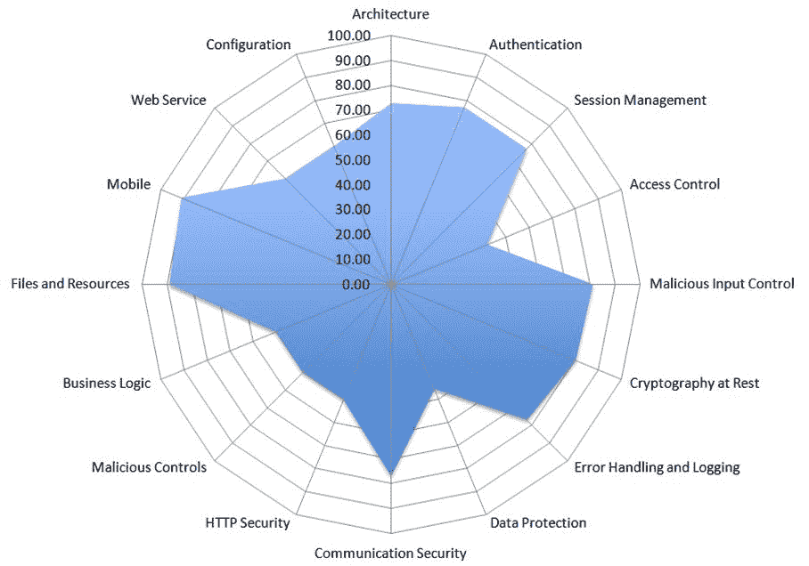
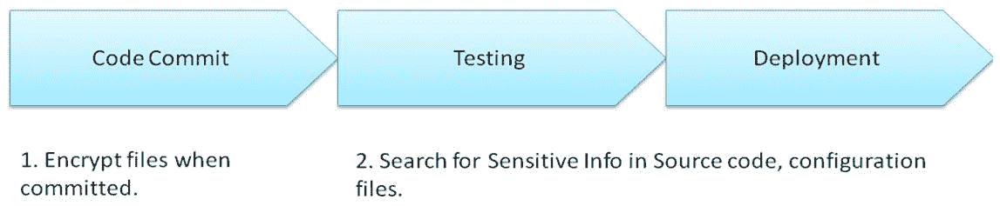

# 案例研究 - 安全与隐私设计

我们已经讨论了安全架构和设计原则、威胁建模以及安全编码实践。在本章中，我们将通过一个案例研究来讨论安全设计和隐私设计的实施。该案例研究将展示 DevOps 团队在应用安全实践时可能遇到的常见挑战，以及安全团队如何提供最佳实践、工具、安全框架和培训工具包来帮助解决这些挑战。

案例研究将从 OWASP ASVS 的安全评估开始，进一步识别所需的安全改进，例如身份验证、授权、会话管理、数据输入/输出控制和隐私设计。我们将查看一些建议的工具和开源安全框架的实现。此外，第三方组件还可能引入漏洞和安全风险。我们还将讨论用于审查和管理开源框架及依赖项的流程和工具。

本章将涵盖以下主题：

+   安全架构审查

+   隐私设计

+   安全与隐私框架总结

+   第三方组件管理

# 案例研究背景

理查德是一个在线书店的 CTO，管理着约 500 名开发人员。理查德希望与安全团队合作，在架构审查、设计审查和第三方框架审查过程中应用标准的安全实践，并且还应用安全编码。理查德和安全团队达成共识，他们应该具备以下条件，以为下一阶段的业务发展做准备：

+   安全设计检查清单

+   推荐的安全设计模式

+   可重用的第三方组件列表

让我们看看安全团队如何帮助理查德通过开发阶段。

# 安全架构审查

为了评估电子商务网站的现有安全架构，安全团队决定与架构师合作，基于 OWASP ASVS 实践进行初步架构审查。为了进行评估，项目团队可以使用在线门户或 EXCEL。在这个案例中，项目安全架构审查是使用 EXCEL 检查清单完成的，之后才使用了内部安全评估门户。以下表格包含了一些关于这两种工具的资源和文档，您可能会觉得有用：

| **OWASP 评估工具** | **资源参考** |
| --- | --- |
| 在线演示 |

+   OWASP ASVS 评估生成器

    +   演示网站：[`ibuildingsnl.github.io/owasp-asvs-report-generator/index.html`](http://ibuildingsnl.github.io/owasp-asvs-report-generator/index.html)

    +   来源：[`github.com/ibuildingsnl/owasp-asvs-report-generator`](https://github.com/ibuildingsnl/owasp-asvs-report-generator)

+   OWASP 安全知识框架

    +   演示网站：[`demo.securityknowledgeframework.org/project-new`](https://demo.securityknowledgeframework.org/project-new)

    +   用户名：admin 密码：test-skf。

    +   来源：[`github.com/blabla1337/skf-flask`](https://github.com/blabla1337/skf-flask)

|

| 离线 EXCEL |
| --- |

+   [`github.com/shenril/owasp-asvs-checklist`](https://github.com/shenril/owasp-asvs-checklist)

|

OWASP ASVS 评估的结果可以通过图表呈现，展示哪些安全领域需要进一步改进：

经过一些试点项目后，安全团队对 OWASP ASVS 评估越来越熟悉，且有更多项目需要进行安全评估。为了便于项目数据管理和交叉参考审查，安全团队决定基于以下开源框架之一，建立并定制一个内部评估门户，而不是使用 EXCEL：

+   [`github.com/ibuildingsnl/owasp-asvs-report-generator`](https://github.com/ibuildingsnl/owasp-asvs-report-generator)

+   [`github.com/blabla1337/skf-flask`](https://github.com/blabla1337/skf-flask)

为了建立**安全设计检查表**，安全团队引入了 OWASP ASVS 实践，建立了内部知识库，并与项目团队进行了自我评估。为了建立安全设计模式和一系列可复用的安全框架，安全团队决定基于 OWASP ASVS 的评估结果，提出一个开源安全框架。这是因为一些安全框架也包含了安全最佳实践，如 Web 安全框架、Spring 安全和 Shiro。

# 认证

基于对项目的 OWASP ASVS 评估，安全团队发现他们未能满足某些认证安全要求。

**OWASP ASVS 认证**：

OWASP ASVS 认证验证源代码中或在线源代码库中不包含秘密、API 密钥和密码。

安全团队进一步调查了现有的秘密管理实践。首席技术官理查德澄清了这个问题正成为开发和运维团队的头疼问题。在开发和测试环境中，开发人员可能会将密码或密钥保存在一个单独的配置文件中。然而，为了过滤这些文件，并将它们分开存放在不同的版本控制仓库中，确实需要大量的沟通，并且增加了协作负担。

为了减轻风险，安全团队提出了一些安全实践。他们建议在源代码提交到代码库时，应加密敏感信息。测试和运维团队将定期扫描源代码库，查找任何敏感信息。下图展示了修订后的开发工作流模型：

安全团队还建议了一些工具，以便整合到开发、测试和运维团队的日常工作中。以下是一些可能用于秘密管理的开源工具：

| **工具** | **场景和工具** |
| --- | --- |

| Git Secret | 开发人员可能需要一种工具，可以在提交时加密敏感文件，并在检出时透明地解密。如果您的开发团队使用 Git 作为主要的源代码仓库，以下工具可以用于减少 API 密钥、密码或加密密钥等秘密泄露。

+   Git-Secret

+   黑盒

+   Git-Crypt

+   Git-Remote-gcrypt

|

| TruffleDumpsterDiver | 开发人员、QA 或运维团队倾向于定期搜索源代码或配置文件，以识别文件中是否存在潜在的秘密泄露。TruffleHog 可以对 GIT 仓库进行秘密搜索，而 DumpsterDiver 则在本地文件中搜索秘密。 |
| --- | --- |

一旦安全团队评估了这些工具，下一阶段是与一些开发和运维团队进行试点测试，然后再进行大规模部署。试点测试的目的是使过程更加顺畅，并为更好的可用性定制工具。

# 授权

授权安全要求可以参考《OWASP ASVS V4：访问控制验证要求》。例如，OWASP ASVS 自我评估结果显示需要集中机制保护。

集中机制保护：您应验证是否存在集中机制（包括调用外部授权服务的库）来保护对每种受保护资源的访问。

为了实现集中机制保护，安全团队决定引入 API 网关架构，设计使所有 API 接口都由 API 网关/管理器控制，例如身份验证、API 密钥、监控、ACL、日志记录和速率限制。安全团队与 CTO Richard 讨论后，意识到现有的安全控制是由每个服务实施的，且每个服务的实施也会发生变化。Richard 希望有一个通用的安全框架，不仅为了确保一致的访问控制行为，还为了实现安全策略的集中管理。

对于需要与外部合作伙伴互动的服务，中央安全策略管理至关重要：

市场上有多种 API 管理器选项。以下表格列出了一些开源的 API 管理器解决方案。采用开源框架或工具的一个关键优势是，您可以根据业务需求进行进一步的定制：

| **API 管理器** | **开源参考** |
| --- | --- |
| Kong |

+   [`github.com/Kong/kong`](https://github.com/Kong/kong)

+   [`getkong.org/`](https://getkong.org/)

|

| API umbrella |
| --- |

+   [`github.com/NREL/api-umbrella`](https://github.com/NREL/api-umbrella)

|

| WSO2 API 管理器 |
| --- |

+   [`github.com/wso2/product-apim`](https://github.com/wso2/product-apim)

|

# 会话管理

CTO 还指出了会话管理实现中存在的一些挑战。现有的会话管理需要与特定的容器技术绑定，并不支持各种类型的客户端应用访问，如独立或非 Web 应用。CTO 希望会话管理能够支持异构客户端访问，并且希望它能够与容器无关。此外，团队还希望以不同的方式实现 CSRF 令牌，这可能会带来潜在的风险和额外的工作。CTO 希望团队提供一个公共库，以实现一致的 CSRF 保护。

在评估会话管理的挑战和需求后，安全团队着手评估可行的安全框架，并准备一个安全工具包，工具包可能包含下表中的信息。安全工具包的目的是帮助开发团队在开发过程中应用相关的安全实践和工具：

| **阶段** | **安全参考和工具** |
| --- | --- |
| 威胁分析 |

+   CWE-6 会话 ID 长度不足

+   CWE-352 跨站请求伪造（CSRF）

+   CWE-384 会话固定

+   CWE-488 数据元素暴露给错误的会话

+   CWE-613 会话过期不足：

查询特定 CWE 的提示。只需在下面的 URL 末尾指定 CWE ID 号。例如，CWE-613 为[`cwe.mitre.org/data/definitions/613.html`](https://cwe.mitre.org/data/definitions/613.html)。|

| 安全设计 |
| --- |

+   OWASP ASVS V3 会话管理

+   OWASP Top 10 A2 弱认证

+   OWASP 会话管理备忘单

|

| 安全架构 |
| --- |

+   Apache Shiro 会话管理

+   OWASP CSRFGuard: [`www.owasp.org/index.php/Category:OWASP_CSRFGuard_Project`](https://www.owasp.org/index.php/Category:OWASP_CSRFGuard_Project)

|

# 数据输入/输出

每个项目团队实现数据输入验证的方式不同。有些项目团队可能忽略了过滤某些非法字符，有些可能不知道如何正确地编码输出，有些可能忽视在验证前进行路径或 URL 的规范化。这些数据输入/输出处理问题可能导致一些安全问题。因此，CTO 希望安全团队提供合适的安全框架，并为其员工创建实操教程。

安全团队提出了一个安全培训工具包，其中包括编码规则、编码框架、扫描工具和一些案例研究。

**数据输入/输出培训工具包**：

培训工具包的目的是提供数据输入验证和数据输出编码的安全最佳实践、工具和实施指南，以防止 XSS 攻击。

**一般安全编码规则**：

必须在验证之前进行规范化和标准化。

应使用输出编码以避免 XSS 攻击。

下表展示了安全培训工具包的初步议程：

| **安全框架/工具** | **安全控制** |
| --- | --- |
| OWASP HTML Sanitizer Project ([`www.owasp.org/index.php/OWASP_Java_HTML_Sanitizer_Project`](https://www.owasp.org/index.php/OWASP_Java_HTML_Sanitizer_Project)) | 这是一个用于 Java 的 HTML 清理工具，旨在防止 XSS 攻击。 |
| Commons Validator ([`commons.apache.org/proper/commons-validator/`](https://commons.apache.org/proper/commons-validator/)) | 这是一个通用数据验证器，提供数据格式验证，如电子邮件、信用卡、日期、URL 等。 |
| ValidateJS ([`validatejs.org/`](https://validatejs.org/)) | 这是一个前端 JavaScript 数据验证器。 |
| OWASP Java Encoder ([`www.owasp.org/index.php/OWASP_Java_Encoder_Project`](https://www.owasp.org/index.php/OWASP_Java_Encoder_Project)) | 它的工作原理与 HTML 清理器类似。用于执行输出编码以避免 XSS 攻击。 |

安全编码扫描工具

+   检查器框架：[`checkerframework.org/`](https://checkerframework.org/)

+   查找安全漏洞：[`find-sec-bugs.github.io`](https://find-sec-bugs.github.io)

安全风险示例：

+   FIO16-J：在验证路径之前进行路径名规范化

+   IDS07-J：清理传递给`Runtime.exec()`方法的不可信数据

+   IDS00-J：防止 SQL 注入

+   IDS16-J：防止 XML 注入

+   IDS08-J：清理包含在正则表达式中的不可信数据

+   IDS06-J：从格式字符串中排除未清理的用户输入

更多内容请参见[`wiki.sei.cmu.edu/confluence/display/java/2+Rules`](https://wiki.sei.cmu.edu/confluence/display/java/2+Rules)。

# 隐私设计

团队意识到隐私的重要性，并接受了与隐私法相关的意识培训。然而，将法律语言转化为技术安全要求之间仍然存在差距。CTO 希望安全团队帮助提供常见的隐私设计解决方案，并使*隐私设计*在软件工程团队的技术指南中得以体现。此外，CTO 还计划让各项目团队完成现有的数据任务实现，计划制定通用库来实现一致的数据屏蔽行为，以减少跨团队的实施工作量。运营部门还提出了其他问题，如敏感信息分类和隐私评估扫描。安全团队的职责不仅是引入行业最佳实践，还包括评估支持在 DevOps 过程中进行隐私设计的可行工具或框架。在此阶段，以下资源可以为您提供帮助：

| **隐私设计的挑战** | **安全团队的建议** |
| --- | --- |
| 如何将“隐私设计”转化为技术安全要求？ |

+   隐私设计模式：[`privacypatterns.org/patterns/`](https://privacypatterns.org/patterns/)

+   NIST SP 800-122 保护个人身份信息（PII）机密性的指南

|

| 开发人员需要一个数据掩码实现 API 来处理敏感信息。 | ARX De-Identifier 数据匿名化工具。 |
| --- | --- |
| 运维团队需要根据现有数据库分类 PII 属性，并配置访问安全策略。 | 评估 Apache Atlas 框架以进行数据治理和访问控制。 |
| DevOps 团队需要一个自动隐私扫描工具，以评估所有 Web 服务的隐私状态。 | 尝试使用 'PrivacyScore' 进行 Web 隐私评估。 |
| 开发团队需要一个通用库来实现所有 Web 服务的一致 Cookie 同意行为。 | 开源的 CookieConsent 库可能是一个值得评估的候选项。 |

# 安全性和隐私框架总结

采用任何安全框架不仅需要考虑业务需求，还要考虑其与现有架构的契合度。以下是我们在本案例研究中讨论的行业实践、工具和框架的总结：

| **安全性改进领域** | **开源安全和隐私框架** |
| --- | --- |
| 身份认证 |

+   Gluu：它用于多因素认证和社交登录。

+   CAPTCHA 通常用于防止机器登录。可以考虑使用 HCaptcha、ReCaptcha、Patcha 这些开源解决方案。

+   Git-Secret：用于保护源代码库中的敏感信息，建议开发团队使用该工具。

|

| 授权 |
| --- |

+   Gluu：它还提供用户同意管理功能

+   Apache Shiro 会话管理

+   OWASP CSRF Guard 可以生成安全令牌来防止 CSRF 攻击。

|

| API 管理器 | 可以考虑应用以下开源框架来保护外部 RESTful API 接口的安全。

+   Kong

+   API umbrella

+   WSO2 API 管理器

|

| 数据输入/输出 | 根据编程语言的不同，可能有各种数据验证框架。

+   OWASP Java HTML Sanitizer 项目：它是一个用 Java 编写的 HTML Sanitizer，用于防止 XSS。

+   Commons 验证器：它是一个 Java 验证库

+   ValidateJS：它是一个 JavaScript 验证库。

+   OWASP Java Encoder：它是一个 Java 编码库，主要用于防止 XSS。

|

| 隐私 |
| --- |

+   数据匿名化工具：[`arx.deidentifier.org/`](http://arx.deidentifier.org/)

+   数据治理：[`atlas.apache.org/index.html`](https://atlas.apache.org/index.html)

+   Web 隐私评估：[`privacyscore.org/`](http://privacyscore.org/)

+   Cookie Consent：[`github.com/insites/cookieconsent`](https://github.com/insites/cookieconsent)

|

# 第三方组件管理

为了降低第三方组件的安全风险，团队定义了一个评估第三方组件的流程。然而，CTO 发现手动检查开源许可证以收集相关信息确实耗费了大量精力，而且在这个过程中，团队也犯了一些错误，比如信息丢失或错误输入数据。CTO 与安全团队进行了会面，讨论了自动化扫描整个项目、为每个组件创建身份许可证等相关信息的可行性。该审查的各个阶段和关键活动如下表所示：

| **阶段** | **第三方组件审查的关键活动** |
| --- | --- |
| 需求 |

+   从法律、许可证、安全性和支持等角度评估开源框架组件

|

| 设计 |
| --- |

+   将开源信息保存在中央数据库中，包括开源名称、版本、来源和许可证等详细信息

+   对组件进行威胁和安全分析，确保没有后门、硬编码的加密密钥以及隐藏的恶意软件

+   确保提供软件更新和补丁的渠道

|

| 实施 |
| --- |

+   必须使用安全代码扫描工具验证第三方组件

+   所有的安全更新和更改应作为变更管理的一部分进行文档记录

|

| 验证 |
| --- |

+   安全测试的范围包括所有第三方组件

+   项目中应实施许可证声明

+   必须与法律部门确认许可证的合规性

|

| 发布 |
| --- |

+   必须揭示已知的 CVE 或漏洞

+   确保所有二进制文件的完整性

|

| 维护 |
| --- |

+   必须制定并实施安全更新计划

|

没有适当的工具或自动化工具，安全实践可能会对开发团队造成很大的负担。在了解执行过程中面临的挑战后，安全团队确定了三个关键领域：

+   许可证信息的代码扫描

+   对已知漏洞进行二进制扫描

+   对二进制文件进行扫描和运行时行为监控，以发现潜在的后门和恶意行为

以下是一些推荐的第三方组件扫描工具：

| **目的** | **推荐的开源工具** |
| --- | --- |

| 开源许可证检查 | 以下项目有助于识别和提取开源组件中的关键信息，例如漏洞、许可证和版权状态。 |

+   AboutCode

+   FOSSology

+   Ninka

+   Linux 基金会开源扫描

|

| 已知漏洞检查 | OWASP Dependency Check、OWASP Dependency Track 和 OpenVAS 是推荐的开源工具，用于扫描软件漏洞。 |
| --- | --- |
| 恶意软件和可疑行为分析 | Cuckoo：这是一种沙箱工具，用于分析未知文件的静态和动态行为。 |

# 概要

在本案例研究中，我们回顾了一个典型电子商务网站在需求、架构、安全框架、设计评审和威胁建模阶段采用安全实践的情况。我们讨论了安全团队的角色以及 DevOps 团队在采用安全实践时面临的挑战。

团队通过应用 OWASP ASVS 进行了架构评估。团队发现有一些安全领域可以改进，包括身份验证、授权、会话管理和数据输入验证。此外，团队还在寻求关于隐私设计的实施建议。

对于身份验证过程，他们发现一些敏感信息，如加密密钥、密码或密钥，可能会不小心提交到源代码仓库中。安全团队建议应用监控或加密工具（Git-Secret），以防止开发人员将凭证以明文形式提交到 Git 仓库中。

对于授权过程，由于 REST API 与第三方合作伙伴的开放接口，架构需要中央安全访问控制。引入了 API 管理器来管理所有 API 的 ACL、日志、授权和速率限制。开源解决方案，如 Kong 和 WSO2 API Manager，被引入团队以供进一步评估。除了 API 访问控制，团队还在寻找一个安全的会话管理框架，以处理各种客户端技术，并保护系统免受 CSRF 攻击。为了解决安全会话管理问题，安全团队提出了一个安全工具包，其中包括带有 CWE 示例的威胁分析、OWASP 安全设计备忘单以及用于实现的开源框架，如 Shiro 和 CSRF Guard。

关于数据输入验证和输出编码，安全团队准备了一个培训工具包，其中包括安全编码规则、安全框架和代码扫描工具。在实施过程中，根据安全需求，建议使用一些开源框架，例如 HTTP Sanitizer、common validator、ValidateJS 和 Java Encoder。

隐私设计不仅对法律合规至关重要，而且对个人数据保护也至关重要。项目团队对如何将这些法律要求转化为软件工程技术要求感到困惑。安全团队根据可能的场景提出了一些行业最佳实践和工具。例如，开发人员需要确保他们的 API 正确地实现数据掩码。运营团队需要与现有数据库一起对个人身份信息（PII）属性进行数据分类，并配置访问安全策略。DevOps 团队需要一款自动化隐私扫描工具，以评估所有 Web 服务的隐私状态。开发团队需要一个通用库，以便为所有 Web 服务实现一致的 Cookie 同意行为。如果我们使用正确的工具和框架，隐私设计将使我们的要求更容易实现。

最后但同样重要的是，我们讨论了第三方组件管理。有许多开源框架和工具应用于安全实践。第三方组件也引入了法律和安全风险。我们介绍了一些实践和工具来减轻这些风险。

我们在开发阶段已经详细研究了威胁建模、安全需求、安全架构、框架、设计安全和隐私安全。接下来的章节，我们将更加深入地探讨安全测试。

# 问题

1.  以下哪些是我们不希望包含在源代码中的机密？

    1.  API 密钥

    1.  密码

    1.  加密密钥

    1.  以上所有

1.  API 网关不能做什么？

    1.  访问控制列表

    1.  限流

    1.  杀毒软件

    1.  API 密钥认证

1.  以下哪个与会话管理的安全性相关？

    1.  会话 ID 长度不足

    1.  跨站请求伪造（CSRF）

    1.  会话固定

    1.  以上所有

1.  对与数据验证相关的问题，标准化和规范化是否发生在验证之后？请判断正误。

1.  数据匿名化的用途是什么？

    1.  它用于执行敏感信息的数据掩码

    1.  它用于数据治理

    1.  网络隐私评估

    1.  Cookie 同意

1.  AboutCode、FOSSology 和 Ninka 工具能做什么？

    1.  开源许可证检查

    1.  已知漏洞检查

    1.  可疑行为分析

    1.  入侵防御

# 深入阅读

+   **OWASP 安全应用程序设计**：[`www.owasp.org/index.php/OWASP_Secure_Application_Design_Project`](https://www.owasp.org/index.php/OWASP_Secure_Application_Design_Project)

+   **Microsoft MSDN 安全检查清单：架构与设计评审**：[`msdn.microsoft.com/en-us/library/ff647464.aspx`](https://msdn.microsoft.com/en-us/library/ff647464.aspx)

+   **SANS Web 应用安全设计检查清单**：[`www.sans.org/reading-room/whitepapers/securecode/security-checklist-web-application-design-1389`](https://www.sans.org/reading-room/whitepapers/securecode/security-checklist-web-application-design-1389)

+   **微软安全 Web 应用设计指南**：[`msdn.microsoft.com/en-us/library/ff648647.aspx`](https://msdn.microsoft.com/en-us/library/ff648647.aspx)

+   **核心安全模式**：[`coresecuritypatterns.com/downloads/patterns.pdf`](http://coresecuritypatterns.com/downloads/patterns.pdf)

+   **OWASP ASVS 评估工具**：[`www.owasp.org/index.php/OWASP_ASVS_Assessment_tool`](https://www.owasp.org/index.php/OWASP_ASVS_Assessment_tool)

+   **微软的数据分类指南（PDF）**：[`download.microsoft.com/download/0/A/3/0A3BE969-85C5-4DD2-83B6-366AA71D1FE3/Data-Classification-for-Cloud-Readiness.pdf`](https://download.microsoft.com/download/0/A/3/0A3BE969-85C5-4DD2-83B6-366AA71D1FE3/Data-Classification-for-Cloud-Readiness.pdf)

+   **卡内基梅隆大学：数据分类指南**：[`www.cmu.edu/iso/governance/guidelines/data-classification.html#classification`](https://www.cmu.edu/iso/governance/guidelines/data-classification.html#classification)

+   **OVIC 隐私和数据保护检查表与工具**：[`www.cpdp.vic.gov.au/menu-resources/resources-privacy/resources-privacy-checklists-and-tools`](https://www.cpdp.vic.gov.au/menu-resources/resources-privacy/resources-privacy-checklists-and-tools)

+   **微软 GDPR 合规性评估**：[`assessment.microsoft.com/gdpr-compliance`](https://assessment.microsoft.com/gdpr-compliance)

+   **ENISA 隐私和数据保护设计方案**：[`www.enisa.europa.eu/publications/privacy-and-data-protection-by-design/`](https://www.enisa.europa.eu/publications/privacy-and-data-protection-by-design/)

+   **SP 800-122 保护个人身份信息（PII）机密性的指南**：[`csrc.nist.gov/publications/detail/sp/800-122/final`](https://csrc.nist.gov/publications/detail/sp/800-122/final)

+   **生产数据转储的** **数据匿名化**：[`github.com/sunitparekh/data-anonymization`](https://github.com/sunitparekh/data-anonymization)

+   **CSA GDPR 合规性行为准则**：[`cloudsecurityalliance.org/media/press-releases/cloud-security-alliance-issues-code-of-conduct-self-assessment-and-certification-tools-for-gdpr-compliance/`](https://cloudsecurityalliance.org/media/press-releases/cloud-security-alliance-issues-code-of-conduct-self-assessment-and-certification-tools-for-gdpr-compliance/)
