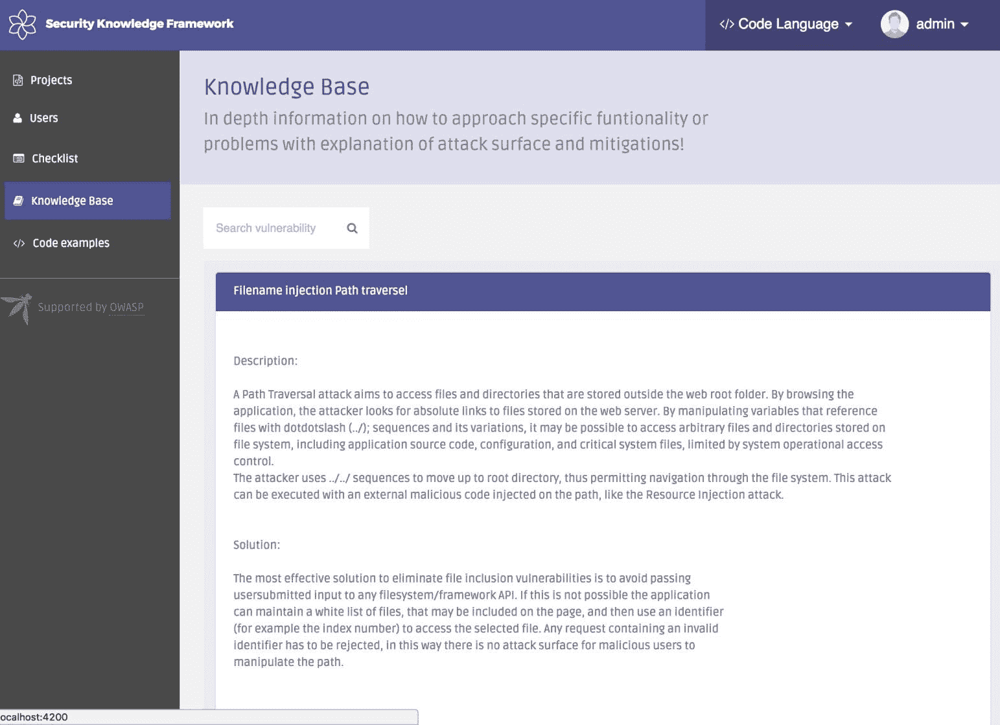

# 安全测试计划和实践

我们已经讨论了涉及开发过程中的安全实践，包括架构安全、设计安全、威胁建模和编码安全等阶段。现在我们将讨论测试阶段的安全测试计划和实践。

本章的目标是概述安全测试计划、安全测试领域以及最低安全测试范围的设置。我们将讨论安全测试计划、测试方法、风险分析、安全领域和行业实践，以构建你的安全测试知识库。此外，我们还将介绍一些行业最佳实践、测试方法和安全工具，以供安全测试使用。

本章将涵盖以下主题：

+   安全测试知识包

+   安全测试计划模板

+   Web 安全测试

+   隐私

+   安全测试领域

+   像黑客一样思考

+   安全培训环境

# 安全测试知识包

安全测试，也称为*渗透测试*，是一项非常专业的工作。没有适当的指导、培训和工具，测试结果和安全测试的质量可能会有所不同。建议拥有一个内部的安全测试知识门户，其中可以包含安全测试指南、最佳实践、说明、工具和培训环境。可以使用**开放 Web 应用程序安全项目**（**OWASP**）安全测试知识包来构建这样的知识门户。以下表格概述了整个安全测试知识包应涵盖的内容：

| **安全测试工具包** | **目的** |
| --- | --- |
| 安全测试计划模板 | 测试计划定义了实现业务目标的安全基准、测试方法、工具和风险分析。根据应用的业务需求，建议根据技术领域进行调整。 |
| 隐私或安全检查清单 | 检查清单可以是基本的测试用例集。安全更多关注应用程序的 CIA（机密性、完整性、可用性），而隐私则更侧重于保护个人信息。 |
| 安全测试工具包 | 工具包为项目团队提供常见的安全测试工具建议。 |
| 培训环境 | 培训环境使用易受攻击的应用程序，让安全团队进行实际的安全测试练习。 |

为了建立自己的内部安全测试知识门户，建议采纳 OWASP 安全知识框架，其中包括 OWASP ASVS、安全知识和代码示例，如下图所示：

来源: [`skf.readme.io/docs/knowledge-base`](https://skf.readme.io/docs/knowledge-base)

# 安全测试计划模板

黑客攻击与安全测试的主要区别在于，安全测试需要对整个应用程序进行全面的安全质量保证，而黑客攻击则是寻找特定的安全问题或漏洞。创建一个安全测试模板将有助于项目团队规划安全测试并维持安全测试的质量。以下是构建安全测试计划的业内公认最佳实践：

+   **OWASP 测试指南**：OWASP 测试指南提供了 Web 应用程序安全测试的什么、为什么、何时、何地和如何。

+   **PCI 渗透测试指南**：PCI 渗透测试指南并不是列出详细的测试案例和工具，而是包括了四个关键议程，如渗透测试组件、渗透测试人员的资格、渗透测试方法和渗透测试报告指南。

+   **NIST 800-115 信息安全测试与评估技术指南**：提供了有关规划和执行渗透测试活动的实用建议。

+   **移动安全测试指南**（**MSTG**）：专注于移动安全测试，包括测试方法、技术和工具。

以下是包含主要部分的安全测试模板示例。

# 安全测试目标

本节应明确安全测试的业务目标。例如，业务目标中最重要的部分可以是 GDPR 合规性、PCI DSS 合规性、客户期望，或定期或重大版本的安全检查。将安全测试与业务目标相结合有助于管理安全测试的重点和范围。

# 安全测试基线

安全测试基线定义了测试范围和标准的最低期望。OWASP ASVS 和 OWASP MSTG 是刚开始建立安全测试基线的组织的良好参考。除了软件应用程序的安全性外，还包括以下常常被忽视的领域：

+   平台安全配置，如操作系统、数据库、虚拟化技术、Web 服务（nginX、Apache）

+   安全通信协议，如 SFTP、SSH v2 或 TLS v1.2

+   第三方软件组件的已知漏洞

+   敏感信息或个人身份信息（PII）数据的处理、存储和删除

+   与访问管理、密码更改、认证以及外部通信接口使用相关的文档或在线帮助说明

+   软件补丁更新和完整性检查的安全通道

+   密码策略的复杂性

+   日志文件访问控制及所有非查询操作的日志记录

# 安全测试环境

测试环境列出了所有软件组件，包括应用程序、所有依赖项和平台。在准备安全测试环境时，建议有一个与生产环境完全相同的预备环境。在大多数情况下，安全问题可能不是由软件应用程序本身引起的，而是由依赖项或平台的安全配置问题引起的。

# 测试策略

测试策略强调了某些高风险功能的测试方法。测试策略可以是手动审查、自动化测试，或白盒测试与黑盒测试。白盒测试主要关注源代码级的检查，黑盒测试则从终端用户和黑客的角度审视整个应用程序。这些测试策略通常采用混合方式执行。以下表格展示了平台和身份验证功能的测试策略示例：

| **测试策略** | **平台** | **身份验证** |
| --- | --- | --- |
| **手动审查** | 不适用 | 设计审查 |
| **自动化** | 完全自动化扫描 | 暴力破解攻击 |
| **白盒测试** | 审查配置文件 | 加密代码审查 |
| **黑盒测试** | 端口或服务扫描 | 暴力破解攻击 |

# 高风险模块

本节的目的是列出黑客最感兴趣的攻击功能或可能具有更大安全影响的功能，标题为*高风险模块*。以下表格列出了一些高风险模块的风险及其测试方法：

| **模块或功能** | **安全风险** | **测试方法** |
| --- | --- | --- |
| 身份验证 | 账户被盗，暴力破解攻击。 | 暴力破解账户攻击，密码攻击 |
| 管理管理 | 权限提升。 | 通过不同角色测试相同的功能。列出管理员 URL 以供运营商或访客账户测试。文件访问控制列表（ACL）检查。 |
| 文件上传 | 上传恶意许可证文件或文件注入攻击。 | 非法的文件类型、大小、名称和内容。 |
| 软件更新 | 软件可能会被更新或注入恶意代码。 | 软件包完整性检查、签名检查和文件大小检查。 |
| 密码重置 | 账户可能被盗或遭遇账户枚举暴力破解攻击。 | 密码不能以明文形式发送。密码重置流程需要原始电子邮件、安全问题或手机验证。 |

# 推荐的安全测试工具

这可以是一个非常广泛的领域。这里是一个典型的安全测试工具集，我们将在后续章节中进一步讨论。最小的安全测试范围包括漏洞扫描、端口扫描、网络安全、模糊测试、安全配置等。建议每个安全测试领域至少使用两种安全工具，以涵盖更多的测试场景。请看一下这个表格：

| **安全测试领域** | **建议的安全测试工具** |
| --- | --- |
| 漏洞扫描 | **Nessus, OpenVAS, Retina**：这些是常见的开源工具，用于扫描应用程序、Web 服务以及所有软件依赖项的漏洞。 |
| 端口扫描 | **Nmap**：Nmap 广泛用于网络安全扫描。常见的网络安全扫描场景包括端口扫描、主机扫描和服务发现。 |
| Web 安全 | **OWASP ZAP, Arachni, Burp**：这些是最受欢迎的开源且免费的 Web 安全测试工具，可以执行 OWASP Top 10 安全测试。 |
| 代码扫描 | **FindBugs, SonarQube**：这些工具用于静态安全编码扫描。FindBugs 主要用于 Java。SonarQube 支持超过 20 种编程语言的代码质量问题扫描。 |
| Fuzz 测试 | **Peach, FuzzDB, API-fuzzer**：Fuzz 测试的目标是给定大量动态和随机数据输入，以验证目标应用在意外输入下的行为。 |
| 安全配置 | **OpenSCAP**：该工具执行操作系统、软件和服务配置的安全评估和强制执行安全配置基准。 |
| 秘密或敏感信息 | **TruffleHog 或 GittyLeaks**：这些工具扫描 GIT 源代码库中可能存在的秘密、API 密钥或密码。 |
| 移动 | **移动安全测试框架（MSTF）**：MSTF 提供 APK 文件的全自动静态和动态分析。 |
| SSL | **SSLScan, SSLyze**：这些工具扫描并检测网站的 SSL/TLS 配置是否不安全。 |
| 拒绝服务（DoS）攻击 | **Hping**：Hping 可以进行 TCP 数据包操作。**HTTPSlow**：HTTPSlow 用于生成 HTTP 慢速 DoS 攻击。 |
| 注入 | **SQLMap**：SQLMap 是用于 SQL 注入攻击的常用工具。**Commix**：Commix 用于命令注入攻击。 |
| 登录暴力破解 | **THC Hydra**：该工具以暴力破解登录攻击而著名。它支持多种协议，如 SNMP、SMTP、Cisco AAA、HTTP、MySQL 等。 |
| Android 测试 | **APKtool**, **dex2Jar**, **JD-Gui**, **Appie**：这些是常见的开源工具，用于进行 Android 安全测试。Appie 是一个便携的 Android 安全测试工具包，包含所有工具，且可以在 Windows 上执行，无需虚拟机。 |
| SQL 注入测试 | **SQLMap, Sqlninja**：SQL 注入是常见的攻击方式，允许黑客窃取或篡改网站后端数据库。SQLMap 和 Sqlninja 可以帮助进行各种类型的 SQL 注入测试。 |

# 网络安全测试

如我们所讨论的通用安全测试计划，还建议根据具体领域准备安全测试指令。每个领域需要不同种类的安全测试工具和方法。通常有 Web、虚拟化、固件、大数据、隐私和物联网安全领域。

Web 服务是应用程序和云服务最常见的呈现方式。几乎所有云服务都通过 Web UI 呈现，可以通过任何浏览器轻松管理，无需安装客户端应用程序。此外，用于服务间通信的 RESTful API 通信也是建立在 HTTPS 之上的。Web 安全可以被视为云服务的基础。谈到 Web 安全时，我们必须熟悉**开放 Web 应用安全项目**（**OWASP**）**Top 10**，它通过**行业排名调查**列出了最常见的 Web 安全问题。请查看以下内容：

+   **A1:2017-注入漏洞**：任何数据输入源都可能导致注入攻击，常见的攻击包括 SQL 注入、命令注入、XML 注入等。

+   **A2:2017-认证漏洞**：弱密码策略、认证控制或会话管理可能使攻击者获得未授权的账户访问权限。

+   **A3:2017-敏感数据泄露**：不安全的数据传输、弱加密或数据存储访问控制可能导致个人数据泄露。

+   **A4:2017-XML 外部实体**（**XXE**）：利用 XML 处理器漏洞进行 XXE 注入，进而实现远程控制、窃取数据或发动拒绝服务攻击。

+   **A5:2017-访问控制漏洞**：指在特权功能、URL 或关键资源上，访问控制机制薄弱或缺失。

+   **A6:2017-安全配置错误**：攻击者可能利用默认账户、启用的服务、错误消息、目录列表、默认权限或已知漏洞攻击系统。安全配置包括应用服务、网络服务、Web 服务器、应用服务器、数据库、框架等。

+   **A7:2017-跨站脚本攻击**（**XSS**）：利用跨站脚本（XSS）攻击，攻击者可以在受害者的浏览器中执行任意 HTML 和 JavaScript 代码，或将攻击者可控制的数据存储在 Web 服务器上。

+   **A8:2017-不安全的反序列化**：反序列化是将对象转换为字节流的常见过程，以便传输到内存、数据库或文件。攻击者可能会篡改对象或数据，从而实现远程代码注入攻击。

+   **A9:2017-使用存在已知漏洞的组件**：包括操作系统、Web/应用服务器、数据库管理系统（DBMS）、应用程序、API 及所有组件、运行时环境和库中存在的任何易受攻击的依赖项或未使用的库。

+   **A10:2017-日志记录和监控不足**：缺乏日志记录或监控可能会让攻击者或未经授权的用户在未被检测或审计的情况下窃取敏感信息。

OWASP 还建议安全测试人员考虑使用**开放 Web 应用安全项目**（**OWASP**）、**应用安全验证标准**（**ASVS**）、OWASP 测试指南和 OWASP 安全知识框架作为输入，而不仅仅依赖于特定的安全工具进行全面的安全保障。没有一刀切的解决方案。不要仅仅复制和应用这些 OWASP 项目。审视现有项目的需求，识别共同的安全基线。你可以进行一定的定制，以适应项目的需要。请查看此表：

| **OWASP 项目** | **项目目标与参考** |
| --- | --- |
| OWASP 前 10 大 | OWASP 前 10 大列出了 10 个最关键的 Web 安全问题。它还提供了如何识别应用是否脆弱、如何防止攻击、攻击场景示例及与每个关键安全问题相关的参考资料。 |
| OWASP ASVS | OWASP 应用安全验证标准提供了一系列应用安全要求，也可以作为安全测试清单使用。 |
| OWASP 测试指南 | OWASP 测试指南提供了如何测试的案例和建议的工具。 |
| OWASP 安全知识框架（SKF） | OWASP SKF 可以帮助建立安全知识门户，包含 OWASP ASVS 清单、安全知识库和代码示例。 |
| OWASP 安全移动测试指南项目（MSTG） | 这是一个移动应用（Apple iOS 和 Android）测试指南的好参考，提供了移动测试方法论，并建议了测试工具。 |

# 隐私

有两类隐私信息需要保护。一类是与应用安全相关的敏感信息，如密码、API 密钥、加密密钥、CA 证书，另一类是**个人身份信息**（**PII**），它也受到 GDPR 的监管。对于敏感信息的审查，涉及 IAM、加密、会话管理、日志记录、CA 管理和管理的功能是直接处理敏感信息的模块。以下是隐私数据处理生命周期的通用测试指南：

| **数据生命周期** | **测试关键点** | **建议测试工具** |
| --- | --- | --- |
| 数据传输 |

+   确保敏感信息不通过 GET 传输

+   安全通信协议，如 TLS v1.2、SSH V2、SFTP、SNMP V3。

| SSLyze, NMAP, Wireshark |
| --- |
| 数据存储 |

+   检查敏感信息是否被加密

+   检查文件的权限是否正确配置

| TruffleHog |
| --- |
| 数据加密 | 不使用弱加密算法，如 MD5、RC4、Jackfish 和 Triple DES | 代码扫描工具 |
| 数据访问与审计 |

+   记录所有敏感数据查询

+   ACL 权限

| AuthMatrix |
| --- |
| 数据删除 |

+   不要在临时文件、异常文件和 Cookie 中存储敏感信息

+   检查内存和缓存中的任何明文敏感信息

| GCOREWinHex LaZagne   |
| --- |

此外，还有一些与敏感信息高度相关的文件类型。以下是一些常见的文件，这些文件可能暴露敏感信息，需要在应用程序中进行加密或适当的访问权限控制：

| **文件可能包含敏感信息** | **文件类型** |
| --- | --- |
| SSH 密钥 | `*rsa`, `*dsa`, `edcsa` |
| 加密密钥 | `Pckcs12`, `pfx`, `p12`, `asc`, |
| Shell 历史文件 | `Bash_history`, `zsh_history` |
| Shell 配置文件 | `bashrc`, `zshrc`, `bash_profile`, `zsh_profile` |
| PHP 配置文件 | `.INC` |
| Docker 配置文件 | `Dockercfg` |
| MySQL 命令历史 | `Mysql_history` |
| 应用程序或网络日志 | `.log` |

对于 PII 处理审查，请参考以下行业最佳实践：

+   GDPR 清单 ([`gdprchecklist.io/`](https://gdprchecklist.io/)) 为数据控制者和数据处理者提供参考

+   NIST SP 800-122 *保护个人身份信息（PII）机密性的指南* ([`csrc.nist.gov/publications/detail/sp/800-122/final`](https://csrc.nist.gov/publications/detail/sp/800-122/final)) 同样有用

+   关于隐私模式的信息可以在这里找到：[`privacypatterns.org/patterns/`](https://privacypatterns.org/patterns/)

# 安全测试领域

我们已经讨论了网络安全测试和隐私问题。安全测试必须与业务和应用程序的目标紧密结合，这不仅与测试场景相关，还与测试工具有关。了解应用程序的领域知识始终是规划安全测试的第一步。以下是每个安全测试领域的行业参考总结。组织可以基于这些参考进一步制定自己的领域特定测试计划。请查看此表：

| **安全领域** | **行业安全最佳实践与测试指南** |
| --- | --- |
| 网络安全测试 |

+   OWASP 测试指南

|

| 虚拟化安全测试 |
| --- |

+   NIST 800-125 完整虚拟化技术安全指南

+   PCI DSS 虚拟化指南

+   Red Hat 虚拟化安全指南

+   SANS 顶级虚拟化安全错误

+   ISCACA 虚拟化安全清单

|

| 固件安全测试 |
| --- |

+   GitHub Awesome 固件安全

+   GitHub BIOS/UEFI 系统固件的安全性，从攻击者和防御者的角度

|

| 大数据安全测试 |
| --- |

+   NIST 1500-4 大数据互操作性框架

+   CSA 大数据安全与隐私手册

|

| 隐私 |
| --- |

+   GDPR 清单

+   NIST SP 800-122 保护个人身份信息（PII）机密性的指南 ([`csrc.nist.gov/publications/detail/sp/800-122/final`](https://csrc.nist.gov/publications/detail/sp/800-122/final)) 同样有用

|

| IoT 安全 |
| --- |

+   ENISA IoT 基线安全建议

+   GSMA IOT 安全评估

|

| 容器安全 |
| --- |

+   NIST 800-190 应用程序容器安全指南

|

| 移动安全 |
| --- |

+   OWASP MSTG（移动安全测试指南）

|

# 像黑客一样思考

安全测试需要系统化的方法来审查应用程序，并涵盖全面的安全测试用例。我们参考一些行业最佳实践和工具来规划安全测试。另一方面，我们还应该向白帽黑客或真正的黑客学习。研究真实的威胁和漏洞的目的是审查并改进现有的安全测试方法和工具。以下部分包含一些关于真实漏洞的推荐参考资料。

# 漏洞利用与 CVE

这些资源提供了 CVE 的概念验证（PoC）测试脚本和工具。它们非常有价值，因为我们可以将这些测试脚本应用或定制为我们安全测试工具集的一部分。Security Focus、Packet Storm Security 和漏洞数据库不仅提供 CVE 信息，还提供安全测试工具和 PoC 脚本。请查看以下内容：

+   Security Focus：Security Focus 列出了每个 CVE 漏洞的技术细节。

+   Packet Storm Security：除了漏洞利用，它还提供大量更新的安全工具和安全白皮书。

+   漏洞数据库：它提供漏洞利用、Shellcode、安全白皮书，还包括谷歌黑客数据库。

例如，对于 Java 反序列化安全问题，您可以搜索关键字*反序列化*以查找特定的易受攻击产品、测试脚本（大多是 Python 脚本）以及描述反序列化概念和测试技术的论文。您可以在漏洞数据库中找到它们：[`www.exploit-db.com/`](https://www.exploit-db.com/)

此外，**漏洞利用工具包**也值得研究。这些漏洞利用工具包可以生成恶意负载和攻击工具，以针对特定的软件漏洞或创建后门连接。ExploitPack 和 Metasploit 是该类别中最常用的测试框架。

# 黑客技术

**对抗性战术、技术与常识**（**ATT&CK**）提供了大多数平台（包括 Windows、Linux、macOS 和移动设备）恶意威胁战术和技术的详细列表。例如，在 Windows 技术矩阵中的**AppInit DLLs**，ATT&CK 解释了 AppInit DLLs 的原理、示例、缓解措施、检测方法和参考资料（[`attack.mitre.org/wiki/Technique/T1103`](https://attack.mitre.org/wiki/Technique/T1103)）。

以下是可以用于模拟 APT 攻击或 ATT&CK 的测试脚本。这些脚本可以用来测试现有的安全解决方案是否能够检测到这些可疑行为。参考以下内容：

+   APT 模拟器：它包括工具集和 PowerShell 脚本，用于在 Windows 上生成攻击。[`github.com/NextronSystems/APTSimulator`](https://github.com/NextronSystems/APTSimulator)

+   Atomic Red Team：它可以基于 MITRE 的 ATT&CK 生成攻击场景。[`github.com/redcanaryco/atomic-red-team`](https://github.com/redcanaryco/atomic-red-team)

# 恶意软件信息

了解现实世界中的恶意软件攻击是审查我们安全防御的另一种方式。US-CERT 是一个有价值的参考，因为它提供了对主要恶意软件攻击的详细技术分析、检测建议、妥协指标、恶意软件特征、应用程序的影响以及防御技术解决方案。有关“警报和提示”部分，请查看以下内容：

+   **US-CERT 警报**：[`www.us-cert.gov/ncas/alerts`](https://www.us-cert.gov/ncas/alerts)

# 安全培训环境

未经许可进行安全或渗透测试是违法的。开发安全测试技能需要一个适当的测试环境或培训平台。这些安全测试环境是专门构建的漏洞 Web 或移动应用程序。一些安全测试环境甚至提供在线教程，指导你进行安全测试技巧。请参考下面列出的 OWASP 项目，获取安全测试环境的在线或离线虚拟化镜像的完整列表。如果可能，最好设置一个内部的安全测试环境，而不是使用外部的在线测试站点。以下是一些可帮助建立安全测试环境的漏洞应用程序项目。请注意，这些是漏洞应用程序，因此应在安全控制的环境中设置这些应用程序。以下开源项目是用于安全测试的漏洞 Web 应用程序示例：

+   **OWASP 异常 Web 应用程序项目**

+   **OWASP 漏洞 Web 应用程序目录项目**

+   **OWASP Security Shepherd**

+   **MITRE 漏洞移动应用程序**

为了鼓励安全测试的参与，可以举行内部安全测试比赛。奖励可以基于报告的安全问题的严重性。对于外部的白帽安全研究人员，可以考虑设立安全漏洞赏金计划，以奖励提交的漏洞。例如，Google Bug Hunter University 定义了不合格发现的规则和奖励计划，如“Google 应用安全奖励计划”和“Google Bug Hunter University”。

# 总结

在本章中，我们建议设置一个安全测试知识包，包括测试指南和相关的安全工具。**OWASP** **安全知识框架** (**SKF**) 提供了一个内部安全测试知识门户，默认包含 OWASP ASVS 检查表、安全知识和代码示例。安全团队可以使用 OWASP SKF 进一步定制安全测试知识门户。

为了制定安全测试计划，我们建议参考行业参考资料，如 OWASP 测试指南、PCI 渗透测试指南、NIST 800-115 和 **移动安全测试指南**（**MSTG**）。一个典型的安全测试计划应包括测试目标、基准、测试环境、测试策略、已识别的高风险模块，以及推荐的安全测试工具。

我们还讨论了一些可以帮助进行 web 和移动应用安全测试的 OWASP 项目。除此之外，我们讨论了应用程序如何处理隐私信息和敏感数据，这对安全测试同样至关重要。我们讨论了数据生命周期的安全测试重点和工具，并列出了可能包含高度敏感信息的常见系统文件。

除了 web 和移动安全，我们还列出了其他安全测试领域及相关行业参考，包括虚拟化、固件、大数据、隐私、物联网安全和容器。最后，为了提高您的安全测试知识，我们分享了一些参考资料，可以帮助了解黑客使用的技术，如漏洞利用和 CVE、黑客技术、漏洞利用工具包以及恶意软件案例研究。安全培训环境可以为内部团队提供一个内部安全测试平台，以进行实践性安全测试。

在下一章中，我们将讨论白盒安全测试技巧。

# 问题

1.  建议的*安全测试工具包*应该包括以下哪些内容？

    1.  隐私检查清单

    1.  测试工具包

    1.  安全测试计划模板

    1.  以上所有

1.  以下哪项行业参考涉及到移动安全？

    1.  OWASP 测试指南

    1.  NIST 800-115 渗透测试

    1.  移动安全测试指南（MSTG）

    1.  PCI 渗透测试指南

1.  什么是测试策略？

    1.  它是一个安全检查清单

    1.  它定义了高风险功能的测试方法

    1.  这是白盒测试

    1.  这是黑盒测试

1.  以下哪项不是典型的高风险模块？

    1.  管理管理

    1.  身份验证

    1.  安装

    1.  密码重置

1.  以下哪种安全工具不用于 web 安全？

    1.  Nmap

    1.  OWASP ZAP

    1.  Arachni

    1.  Burp

1.  以下哪种通信协议是不安全的？

    1.  TLS v1.2

    1.  SSH v1

    1.  SFTP

    1.  SNMP v3

1.  ATT&CK 资源不能提供什么？

    1.  安全测试工具

    1.  对抗性战术

    1.  对抗性技术

    1.  对抗性知识

1.  OWASP Broken Web Application 项目用于什么？

    1.  它是一个 web 安全扫描工具

    1.  这是一个安全检查清单

    1.  这是一个为安全测试实践而构建的专用漏洞 web 应用

    1.  它是一个自动化测试框架

# 进一步阅读

访问以下网址获取更多信息：

+   **GitHub 精选渗透测试**: [`github.com/enaqx/awesome-pentest/`](https://github.com/enaqx/awesome-pentest/)

+   **PCI 渗透测试指南**： [`www.pcisecuritystandards.org/documents/Penetration_Testing_Guidance_March_2015.pdf`](https://www.pcisecuritystandards.org/documents/Penetration_Testing_Guidance_March_2015.pdf)

+   **NIST 800-115 信息安全测试与评估技术指南：** [`csrc.nist.gov/publications/detail/sp/800-115/final`](https://csrc.nist.gov/publications/detail/sp/800-115/final)

+   **GSMA IOT 安全评估**： [`www.gsma.com/iot/future-iot-networks/iot-security-guidelines/`](https://www.gsma.com/iot/future-iot-networks/iot-security-guidelines/)

+   **NIST 800-125 完整虚拟化技术安全指南：** [`csrc.nist.gov/publications/detail/sp/800-125/final`](https://csrc.nist.gov/publications/detail/sp/800-125/final)

+   **ISCACA 虚拟化安全检查单：** [`www.isaca.org/Knowledge-Center/Research/Documents/Virtualization-Security-Checklist_res_Eng_1010.pdf`](http://www.isaca.org/Knowledge-Center/Research/Documents/Virtualization-Security-Checklist_res_Eng_1010.pdf)

+   **GitHub** **精彩** **固件** **安全**： [`github.com/PreOS-Security/awesome-firmware-security`](https://github.com/PreOS-Security/awesome-firmware-security)

+   **GitHub BIOS/UEFI 系统固件安全从攻击者和防御者的视角：** [`github.com/rmusser01/Infosec_Reference/blob/master/Draft/BIOS%20UEFI%20Attacks%20Defenses.md`](https://github.com/rmusser01/Infosec_Reference/blob/master/Draft/BIOS%20UEFI%20Attacks%20Defenses.md)

+   **NIST 1500-4 大数据安全与隐私：** [`www.nist.gov/publications/nist-big-data-interoperability-framework-volume-4-security-and-privacy`](https://www.nist.gov/publications/nist-big-data-interoperability-framework-volume-4-security-and-privacy)

+   **CSA 大数据安全与隐私手册：** [`downloads.cloudsecurityalliance.org/assets/research/big-data/BigData_Security_and_Privacy_Handbook.pdf`](https://downloads.cloudsecurityalliance.org/assets/research/big-data/BigData_Security_and_Privacy_Handbook.pdf)

+   **NIST SP 800-122 保护个人身份信息（PII）机密性的指南：** [`csrc.nist.gov/publications/detail/sp/800-122/final`](https://csrc.nist.gov/publications/detail/sp/800-122/final)

+   **ENISA IoT 基线安全推荐：** [`www.enisa.europa.eu/publications/baseline-security-recommendations-for-iot/at_download/fullReport`](https://www.enisa.europa.eu/publications/baseline-security-recommendations-for-iot/at_download/fullReport)

+   **GSMA IOT 安全评估：** [`www.gsma.com/iot/future-iot-networks/iot-security-guidelines/`](https://www.gsma.com/iot/future-iot-networks/iot-security-guidelines/)

+   **NIST 800-190 应用容器安全指南：** [`nvlpubs.nist.gov/nistpubs/specialpublications/nist.sp.800-190.pdf`](https://nvlpubs.nist.gov/nistpubs/specialpublications/nist.sp.800-190.pdf)
