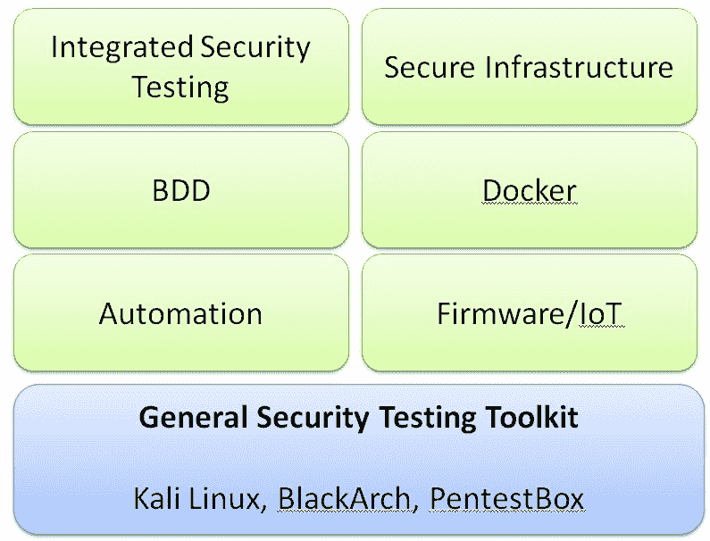
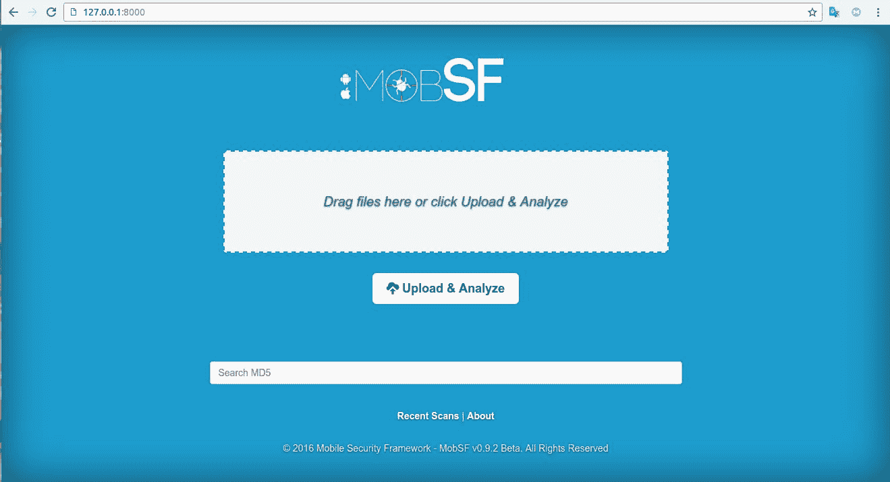
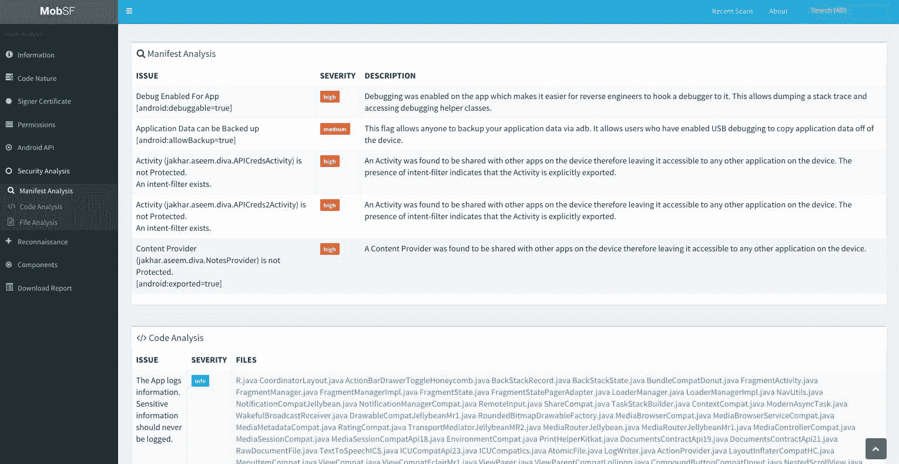
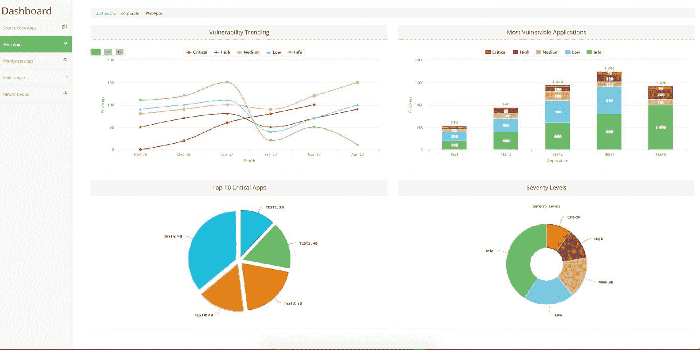

# 第十二章：安全测试工具包

在上一章中，我们讨论了白盒测试的技巧。本章将介绍一套常见的（但不是全面的）安全测试工具。涉及安全测试的网络主要包括网页和移动连接、配置、通信、第三方组件以及敏感信息。我们将逐一探讨每个元素的测试技巧和工具。此外，我们还将学习如何自动执行这些工具，以及如何将它们作为集成到持续集成中的工具。

本章将涵盖以下内容：

+   通用安全测试工具包

+   自动化测试标准

+   基于行为的安全测试框架

+   Android 安全测试

+   安全基础设施配置

+   Docker 安全扫描

+   集成安全工具

# 通用安全测试工具包

提供安全测试工具包的目的是让项目团队了解可用的工具，并根据业务应用场景判断并应用他们认为合适的工具。安全测试工具有很多种。一些组织可能会为所有项目定义一个通用的测试工具包，并根据特定领域（如自动化、基础设施、Docker、BDD 等）推荐其他安全测试工具：

有许多种 Linux 安全发行版，它们已经预装并配置了安全工具。Kali、BlackArch 和 PentestBox 是常见的 Linux 安全发行版。推荐使用 PenetestBox，因为它不需要 Linux 虚拟机环境来执行 Linux 实用工具，并且可以原生在 Windows 上执行。PenetestBox 也包含许多安全工具，就像 Kali Linux 一样。关于每个工具的更多信息，请访问以下链接：

+   Kali Linux: [`www.kali.org/`](https://www.kali.org/)

+   BlackArch: [`blackarch.org/`](https://blackarch.org/)

+   PentestBox: [`pentestbox.org/`](https://pentestbox.org/)

由于 Kali 或 BlackArch Linux 中可能有数百个安全工具，要求安全测试团队使用所有工具进行安全测试可能不可行。建议你熟悉一些关键的常见安全工具。

以下表格显示了推荐的最小安全测试工具集（这里只列出了开源或免费工具）：

| **正在进行安全检查的区域** | **常见的开源安全工具** |
| --- | --- |

| 白盒审查 | GraudIT 或 GREP-IT 这些工具推荐使用，因为它们不需要完整的可构建源代码来识别不同编程语言的安全问题：

+   GraudIT: [`github.com/wireghoul/graudit`](https://github.com/wireghoul/graudit)

+   GREP-IT: [`github.com/floyd-fuh/crass/blob/master/grep-it.sh`](https://github.com/floyd-fuh/crass/blob/master/grep-it.sh)

|

| Web | BurpSuite, OWASP ZAP, Vega, SQLmap, Arachni |
| --- | --- |
| 漏洞 | Nessus, OpenVAS, OpenSCAP, NMAP |
| 网络 | NMAP, WireShark, TCPDump, Hping, SSLScan, SSLyze, masscan |

# 自动化测试标准

我们希望大多数基本和显而易见的网页安全测试案例能够自动执行，而人工测试则集中在更深入的安全问题审查上。自动化网页安全测试的目标是将安全测试工具与持续集成框架（如 Jenkins）集成。每当构建提交时，可以自动触发网页安全测试。为了能够将网页安全测试工具与 Jenkins 集成，我们需要考虑几个关键标准：

+   **命令行控制台**：大多数安全测试工具提供命令行控制台或 GUI 接口来操作安全测试程序。理想情况下，工具应提供这两种接口。命令行控制台可用于 Jenkins 触发安全测试的执行，而 GUI 则可以辅助人工测试。从自动化测试的角度看，**命令行接口**（**CLI**）是与 Jenkins 集成的最低要求。CLI 接口还帮助我们与单元测试框架或 BDD 框架进行集成。

+   **API 接口**：网页安全测试可以在独立攻击者模式或代理模式下执行。API 接口将允许我们在运行时通过编程方式与测试工具进行交互。例如，OWASP ZAP 提供了一个 REST API，可以使用 Python 自动化所有操作，也提供了 ZAP CLI 以从命令行与 ZAP 进行交互。

+   **输出格式**：大多数网页安全测试工具提供不同种类的报告格式，如 HTML、PDF、XML、CSV、JSON 或控制台输出。如果我们希望将测试结果汇总在一起，CSV、JSON 和 XML 是基本的格式。由于不同的安全工具和每日报告中大量的结果，建议使用集成安全测试工具，如 OWASP DefectDojo，将所有测试结果汇总在一个仪表盘中（这个选项稍后会讨论）。此外，一些工具可能提供 Jenkins 插件，帮助您将结果输出到 Jenkins 管理控制台。

基于这些标准，建议用于自动化的网页安全测试工具总结在下表中。OWASP ZAP、Arachni 和 W3af 是三款开源网页安全测试工具，提供 CLI、API 和 Web GUI 接口。如果您需要轻量级的命令行工具，Nikto 和 Wapiti 也是不错的选择。由于每种工具的误报率，我们建议额外使用一种工具进行扫描。

请注意，Web 安全自动化测试无法完成所有 Web 安全任务。某些测试场景仍然需要人工安全测试人员来引导工具并进行进一步验证，如身份验证、网页授权、与业务逻辑相关的测试和多次订单提交。下表显示了这些工具及其特点：

|  | **Web GUI** | **CLI** | **REST API** |
| --- | --- | --- | --- |
| **OWASP ZAP** | Yes | ZAP CLI | ZAP API |
| **Arachni** | Yes | Yes | Yes（它还提供 Ruby 库。） |
| **W3af** | Yes | Yes | Yes |
| **Nikto** | n/a | Yes | n/a |
| **Wapiti** | n/a | Yes | n/a |

# 行为驱动安全测试框架

BDD 安全测试非常适合在您的安全测试报告需要与外部供应商共享，或者甚至在内部跨团队沟通时使用，以了解正在执行哪些安全测试用例。此外，BDD 安全测试还可以帮助您将各种安全测试工具整合起来，并根据框架汇总测试报告。

让我们通过一个简单的例子来了解什么是行为驱动的安全测试。在行为驱动的安全测试框架下，安全测试脚本是用人类可读的语言编写的测试用例。它使得安全测试用例和测试结果能够被非安全专业人员轻松理解。以下是这个人类可读脚本的一个例子：

| **场景：攻击者可能会执行系统命令来获取有价值的信息。** **前提条件：假设操作系统中有 "ping" 命令行二进制文件。** **当我发起一个 "ping" 攻击时：** **"Ping 127.0.0.1"** **那么它应该通过正则表达式：** **"<1ms TTL=128"** |
| --- |

上述示例是基于 GauntIT 测试脚本重新编辑的版本。您还可以参考[`github.com/gauntIT/gauntIt/tree/master/examples/`](https://github.com/gauntIT/gauntIt/tree/master/examples/)获取更多定义安全测试用例的示例。

在 BDD 安全测试框架中有三个开源工具。如果您熟悉 Java BDD cucumber，那么 BDD 安全将是您的最佳选择。如果您想使用 Python 与 BDD 框架，可以参考 MITTN。GauntIT 是独立于编程语言的，可以通过定义正则表达式轻松扩展以执行任何工具并验证结果。GauntIT 使安全测试人员可以专注于测试脚本的定义，适合那些对 Java 或 Python 知之甚少的测试人员。BDD 安全框架及其特色工具列在以下表格中：

| **BDD 安全框架** | **默认包含的安全工具** |
| --- | --- |

| BDD 安全 | OWASP ZAP、SSLyze、NessusBDD 安全基于 Java 和 Cucumber。

+   BDD 安全：[`www.continuumsecurity.net/bdd-security/`](https://www.continuumsecurity.net/bdd-security/)

|

| MITTN | BurpSuite、SSlyze 和 Radamsa API fuzzingMITTN 基于 Python 和 Behave。 |

+   MITTN: [`github.com/F-Secure/mittn`](https://github.com/F-Secure/mittn)

|

| GauntIT | CURL, NMAP, SSLyze, SQLmap, Garmr, heartbleed, dirb, Arachni

+   GauntIT: [`gauntlt.org/`](http://gauntlt.org/)

|

# Android 安全测试

Android 安全测试需要使用 APK 文件进行逆向工程分析，使用 Manifest 进行权限分析，以及使用意图、服务、广播和内容提供者进行内部组件分析。通常，在进行 Android 安全测试时，以下工具被认为是常用的测试工具：

| **工具** | **描述** |
| --- | --- |
| ApkTool | ApkTool 用于对 Android APK 文件进行逆向工程。 |
| ByteCode View | ByteCode View 是一个 Java 字节码查看器和 GUI Java 反编译器。 |
| Dex2JAR | Dex2JAR 将 DEX 文件转换为 CLASS 文件。 |
| JADX | JADX 将 DEX 文件转换为 Java 反编译器。 |
| JD-GUI | JD-GUI 是一个 GUI 查看器，用于读取 CLASS 文件的源代码。 |
| Drozer | Drozer 是一个交互式安全和攻击框架，用于 Android 应用程序。 |
| Baksmali | Baksmali 是一个 DEX 格式的汇编器/反汇编器。 |
| AndroBugs | AndroBugs 接受 APK 文件作为输入，并执行 APK 安全漏洞扫描。 |
| AndroGuard | AndroGuard 是一个 Python 框架，能够执行 APK 的逆向工程和恶意软件分析。 |
| QARK | **Quick Android Review Kit**（**QARK**）的工作原理类似于 AndroBugs，能够检测 APK 文件中的安全漏洞。 |
| AppMon | AppMon 可以监控 iOS 和 Android 应用的 API 调用。 |

单独安装和配置这些工具可能非常耗时，因此建议使用以下工具包，这些工具包已预安装了大多数 Android 安全测试工具：

| **工具包** | **描述** |
| --- | --- |

| AndroL4b | AndroL4b 是一个基于 Ubuntu 的虚拟机，不仅包括安全测试工具，还包括供实践使用的易受攻击 APK 实验室。 |

+   AndroL4b: [`github.com/sh4hin/Androl4b/`](https://github.com/sh4hin/Androl4b/)

|

| Appie | Appie 是一个 Android 测试工具包门户，可以在 Windows 上运行，无需任何安装和虚拟机。 |

+   Appie: [`manifestsecurity.com/appie/`](https://manifestsecurity.com/appie/)

|

| PentestBox | PentestBox 类似于 Appie，但还包括许多与 Android 无关的其他安全测试工具。 |

+   PentestBox: [`tools.pentestbox.org/`](https://tools.pentestbox.org/)

|

最后，如果你希望进行完全自动化的 APK 和 iOS 安全分析，并且可以通过拖放 APK 文件到 Android 安全分析平台上使用，那么 MobSF（移动安全框架）就是你需要的工具，具体见以下截图： 来源: [`github.com/MobSF/Mobile-Security-Framework-MobSF/`](http://github.com/MobSF/Mobile-Security-Framework-MobSF/)

MobSF/Mobile-Security-Framework-MobSF 采用 GNU 通用公共许可证 v3.0 授权。

以下截图展示了 MobSF 的基本使用方法。

以下截图显示了 Manifest 分析和代码分析的 MobSF 安全评估结果。

源代码：https://github.com/MobSF/Mobile-Security-Framework-MobSF

# 确保基础设施配置安全

确保基础架构配置的安全对于确保基础架构配置和系统硬化符合行业安全最佳实践（如 CIS 基准、PCI-DSS 以及**国家检查清单计划**（**NCP**））至关重要。如果 DevOps 团队已应用基础设施工具，如 Chef 或 Puppet，强烈建议您在这些工具之上定义安全配置，以实现**基础设施安全即代码**的目标。这有助于将基础设施安全从运维阶段转移到开发阶段。Inspec、Hardening Framework 和 ServerSpec 工具用于检查基础设施安全配置。您可以在以下链接了解更多信息：

+   Inspec：[`www.inspec.io/`](https://www.inspec.io/)

+   Hardening Framework：[`Dev-Sec.io`](https://Dev-Sec.io)

+   Serverspec：[`serverSpec.org/`](https://serverSpec.org/)

对于未使用配置管理工具（Puppet、Chef、Ansible 或 SaltStack）部署的基础设施环境，建议使用以下扫描工具：

+   Lynis 安全审计：[`github.com/CISOfy/lynis`](https://github.com/CISOfy/lynis)

+   OpenSCAP：[`www.open-scap.org/`](https://www.open-scap.org/)

+   CIS 基准：[`www.cisecurity.org/cis-benchmarks/`](https://www.cisecurity.org/cis-benchmarks/)

这些基础设施安全配置审查工具将减少运维团队和安全团队的工作量。运维团队可以在服务部署之前应用这些工具，并且可能会定期检查生产环境。开发和测试团队可以使用这些工具了解是否缺少任何安全配置或配置不正确。

OpenSCAP 的扫描结果示例，请访问 [`www.open-scap.org/wp-content/uploads/2015/09/ssg-rhel7-ds-xccdf.report.html`](https://www.open-scap.org/wp-content/uploads/2015/09/ssg-rhel7-ds-xccdf.report.html)。

# Docker 安全扫描

Docker 技术广泛用于软件部署和云基础设施。针对 Docker 的安全测试，Docker Bench 定义了几项 Docker 容器部署的安全最佳实践和配置。《CIS Docker 社区版基准》定义了有关 Docker 主机、守护程序、容器镜像和容器运行时的安全建议。总的来说，有三种 Docker 安全工具执行三种不同的功能：

+   基于 CIS 的 Docker 安全最佳实践扫描（Docker Bench、Actuary）

+   扫描已知的常见漏洞和曝光（CVEs）（Claire、Anchor Engine）

+   运行时威胁分析（Falco、Dagda）

以下是用于 Docker 安全性的开源安全测试工具：

| **Docker 安全工具** | **目的与参考** |
| --- | --- |

| Docker Bench | Docker Bench 是一个自动化脚本，用于检查 Docker 安全最佳实践的合规性。扫描规则基于 CIS Docker 安全基准。

+   Docker Bench Security: [`github.com/docker/docker-bench-security/`](https://github.com/docker/docker-bench-security/)

+   Docker Benchmark: [`benchmarks.cisecurity.org/`](https://benchmarks.cisecurity.org/)

|

| Actuary | Actuary 的工作原理类似于 Docker Bench。此外，Actuary 可以根据 Docker 安全社区定义的安全配置文件进行扫描。

+   Actuary: [`github.com/diogomonica/actuary/`](https://github.com/diogomonica/actuary/)

|

| Clair | Clair 是一个容器镜像安全静态分析器，用于 CVE（公共漏洞与暴露）。 Clair: [`github.com/coreos/clair`](https://github.com/coreos/clair) |
| --- | --- |

| Anchor EngineAnchor Cloud | Anchor Cloud 和 Anchor Engine 扫描 Docker 镜像中的 CVE（公共漏洞与暴露）。Anchor Engine 是一个托管工具，Anchor Cloud 是一个基于云的工具。

+   Anchor Engine: [`github.com/anchore/anchore-engine`](https://github.com/anchore/anchore-engine)

+   Anchor Cloud: [`Anchore.com/cloud/`](https://Anchore.com/cloud/)

|

| Falco | Falco 是一个 Docker 容器运行时安全工具，能够检测异常活动。

+   Falco: [`sysdig.com/opensource/falco/`](https://sysdig.com/opensource/falco/)

|

| Dagda | Dagda 是一个集成的 Docker 安全工具，提供运行时异常活动检测（Sysdig Falco）、漏洞（CVE）分析（OWASP 依赖检查、Retire.JS）以及恶意软件扫描（CalmAV）。

+   Dagda:[ https://github.com/eliasgranderubio/dagda/](https://github.com/eliasgranderubio/dagda/)

|

# 集成安全工具

由于有许多安全测试工具，我们可能希望将测试结果集成到一个仪表板中，或通过统一的界面执行这些工具。如果你在寻找这样的集成安全测试管理工具，以下是一些开源且免费的工具可供参考：

| **工具** | **默认包含的工具** |
| --- | --- |

| JackHammer | JackHammer 由 Ola 提供，是一个集成的安全测试工具。它为您提供一个仪表板，整合所有的测试结果。其主要区别在于 JackHammer 包含移动应用安全扫描和源代码静态分析工具。支持的开源安全扫描工具包括 Brakeman、Bundler-Audit、Dawnscanner、FindSecurityBugs、PMD、RetireJS、Arachni、Trufflehog、Androbugs、Androguard 和 NMAP。以下截图展示了其集成界面的典型示例。

+   JackHammer: [`github.com/olacabs/jackhammer`](https://github.com/olacabs/jackhammer)

+   其他信息: [`jch.olacabs.com/userguide/`](https://jch.olacabs.com/userguide/)

 |

| Faraday | Faraday 是一个集成的渗透测试环境，提供了一个管理所有测试结果的仪表板。它集成了超过 50 个安全工具。

+   Faraday: [`www.faradaysec.com/#why-faraday`](https://www.faradaysec.com/#why-faraday)

+   其他信息：[`github.com/infobyte/faraday/wiki/Plugin-List`](https://github.com/infobyte/faraday/wiki/Plugin-List)

|

| Mozilla Minion | Mozilla Minion 也是一款集成的安全测试工具，默认包含以下插件：

+   ZAP

+   Nmap

+   Skipfish

+   SSLScan

你可以在 [`github.com/mozilla/minion/`](https://github.com/mozilla/minion/) 找到 Mozilla Minion。 |

| 渗透测试工具包 | 渗透测试工具包为许多 Linux 扫描工具提供了统一的 Web 界面，例如 nmap、nikto、WhatWeb、SSLyze、fping、URLCrazy、lynx、mtr、nbtscan、automater 和 shellinabox。

+   渗透测试工具包：[`github.com/veerupandey/Penetration-Testing-Toolkit`](https://github.com/veerupandey/Penetration-Testing-Toolkit)

|

| Seccubus | 使用 Seccubus 的主要优势在于它能够与各种漏洞扫描器的测试结果集成，并且还可以比较每次扫描之间的差异。它包括以下扫描器：

+   Nessus

+   OpenVAS

+   NMAP

+   Nikto

+   Medusa

+   SSLyze

+   SSL Labs

+   TestSSL.sh

+   SkipFish

+   ZAP

你可以在 [`github.com/schubergphilis/Seccubus`](https://github.com/schubergphilis/Seccubus) 找到 Seccubus。  |

| OWTF | **进攻性 Web 测试框架** (**OWTF**) 是一个集成的安全测试标准，符合 OWASP 测试指南，并包含 PTES 和 NIST 工具。

+   OWTF: [`owtf.github.io/`](https://owtf.github.io/)

+   其他信息：[`owtf.github.io/online-passive-scanner/`](https://owtf.github.io/online-passive-scanner/)

|

| RapidScan | RapidScan 是一款多功能工具，包含 Web 漏洞扫描器。它包含的安全扫描工具包括 nmap、dnsrecon、uniscan、sslyze、fierce、theharvester、golismero。 |
| --- | --- |
| DefectDojo | OWASP DefectDojo 是一款安全工具，可以将各种安全测试工具的输出导入并汇总到一个管理仪表板中。DefectDojo: [`github.com/DefectDojo/django-DefectDojo`](https://github.com/DefectDojo/django-DefectDojo) |

# 总结

在本章中，我们学习了安全测试工具包。根据需要测试的元素，有 Kali Linux、BlackArch 和 PentestBox，它们是提供通用安全测试工具包的 Linux 安全发行版。由于工具种类繁多，我们建议了一套最小化的安全工具集，以覆盖白盒审查、网络连接、漏洞和网络安全。

我们还展示了安全自动化工具的关键因素，并比较了一些 Web 安全工具在支持 CLI 和 REST API 接口方面的能力。我们还介绍了 BDD 安全框架，它支持自动化框架。我们考察了 BDD Security、MITTN 和 GauntIT。

还讨论了其他一些安全测试工具。对于 Android 安全测试，推荐使用 MobSF（移动安全框架）作为一个快速获胜、完全自动化的分析平台。对于基础设施安全，我们介绍了 Lynis 安全审计、OpenSCAP 或 CIS 基准安全扫描工具，用于检测不安全的配置。对于 Docker 安全，有三类安全工具——即 CIS 安全配置最佳实践、已知漏洞扫描和运行时威胁分析。最后，我们介绍了集成安全工具，它们可以帮助您整合和合并所有的测试结果。

在下一章中，我们将讨论与持续集成结合的安全自动化。

# 问题

1.  以下哪个不是用于安全测试的 Linux 发行版？ 答案：d

    1.  Kali Linux

    1.  BlackArch

    1.  PentestBox

    1.  OSSEC

1.  OWASP ZAP、Vega 和 Arachni 工具用于以下哪种安全测试？

    1.  Web 安全

    1.  网络安全

    1.  入侵检测

    1.  完整性监控

1.  以下哪个工具用于漏洞扫描？

    1.  WireShark

    1.  OpenVAS

    1.  TCPDump

    1.  Hping

1.  以下哪个不是自动化测试的最低标准？

    1.  GUI 界面

    1.  CLI 接口

    1.  API 接口

    1.  输出格式

1.  使用 BDD 安全的好处是什么？

    1.  与所有工具的集成

    1.  整合测试结果

    1.  团队之间沟通容易

    1.  以上所有

1.  以下哪个不是用于 Docker 安全的？

    1.  基于 CIS 的 Docker 安全最佳实践扫描（Docker Bench，Actuary）

    1.  Appie

    1.  扫描已知的 CVE。（Claire，Anchor Engine）

    1.  运行时威胁分析。（Falco，Dagda）

1.  以下哪个主要不是专注于基础设施安全？

    1.  Inspec

    1.  加固框架

    1.  Serverspec

    1.  PentestBox

# 深入阅读

欲了解更多信息，请访问以下网址：

+   **GauntIT 示例**: [`github.com/gauntIT/gauntIt/tree/master/examples/`](https://github.com/gauntIT/gauntIt/tree/master/examples/)

+   **美国政府配置基准（USGCB）**: [`csrc.nist.gov/projects/united-states-government-configuration-baseline/`](https://csrc.nist.gov/projects/united-states-government-configuration-baseline/)

+   **国家检查表程序库**: [`nvd.nist.gov/ncp/repository`](https://nvd.nist.gov/ncp/repository)

+   **Docker 安全部署指南**: [`github.com/GDSSecurity/Docker-Secure-Deployment-Guidelines`](https://github.com/GDSSecurity/Docker-Secure-Deployment-Guidelines)

+   **Vulscan**: [`github.com/scipag/vulscan`](https://github.com/scipag/vulscan)

+   **AttifyOS 物联网安全测试分发版**: [`github.com/adi0x90/attifyos`](https://github.com/adi0x90/attifyos)

+   **Attify 固件分析工具包**: [`github.com/attify/firmware-analysis-toolkit`](https://github.com/attify/firmware-analysis-toolkit)

+   **CHIPSEC 平台安全评估框架**: [`github.com/chipsec/chipsec`](https://github.com/chipsec/chipsec)

+   **渗透测试资源列表**: [`github.com/enaqx/awesome-pentest`](https://github.com/enaqx/awesome-pentest)

+   **渗透测试资源列表**: [`github.com/wtsxDev/Penetration-Testing`](https://github.com/wtsxDev/Penetration-Testing)
