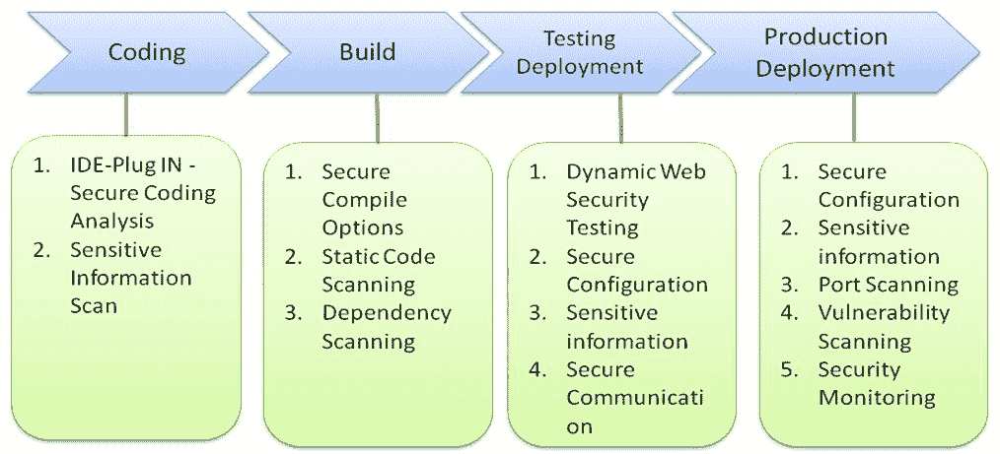
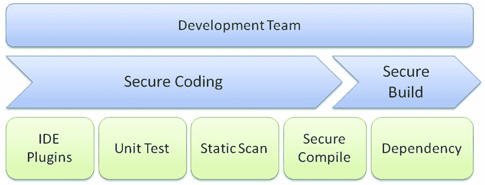
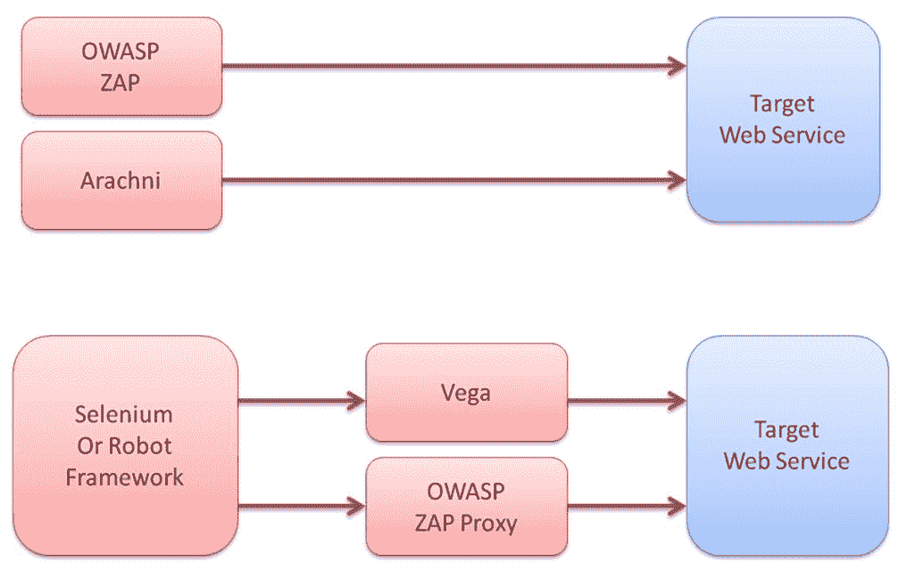

# CI 管道中的安全自动化

我们已经回顾了白盒测试技巧和安全测试工具集。本章将重点介绍开发阶段的安全实践，以及如何将 Jenkins 等工具集成到持续集成中。在开发阶段，我们探讨了使用 IDE 插件进行安全代码扫描的技术，并建议了一些静态代码分析工具。对于构建和包交付，还将介绍安全编译器配置和依赖漏洞检查。最后，本章还将讨论 Web 安全自动化测试方法和技巧。

本章将涵盖以下内容：

+   持续集成中的安全性

+   开发阶段的安全实践

+   主动/代理模式下的 Web 测试

+   Web 自动化测试技巧

+   Jenkins 中的安全自动化

# 持续集成中的安全性

开发团队的日常活动包括编码、编译/构建、测试和部署。我们的目标是将安全自动化实践融入到这些活动中。在编码阶段，开发团队可以使用 IDE 插件进行安全源代码分析。在构建阶段，我们扫描安全强化的编译选项、依赖组件的已知漏洞，以及整个项目的安全源代码。

一旦构建完成并安装到预发布环境中，将进行更全面的安全扫描，例如使用 OWASP ZAP 进行动态 Web 安全测试、基础设施配置安全性和安全通信协议。在生产部署阶段，也会定期进行安全扫描，并且更多关注于安全监控，而非源代码或动态 Web 安全测试。

以下图表展示了每个阶段的安全实践，即编码、构建、测试和生产部署：

# 开发阶段的安全实践

开发团队的安全实践包括安全编码和安全构建交付。对于安全编码，我们可以让 IDE 插件进行代码扫描，或者要求进行安全单元测试并运行整个项目的静态代码扫描。对于安全构建交付，我们需要确保编译器选项正确配置，并审查所有依赖组件的已知漏洞。以下图表展示了我们可以在开发阶段规划的整体安全实践。接下来的章节中，我们将介绍一些用于这些安全活动的开源安全工具和实践：

# 自动化代码审查的 IDE 插件

使用 IDE 插件进行自动化安全代码审查的主要优势是，这些工具可以在编码阶段提供修复的有用建议，类似于拼写检查器的工作方式。这将大大减少代码审查的工作量，并能发现黑盒测试无法检测的安全缺陷。缺点是，这种静态代码扫描可能会引入一些恼人的误报，开发团队可能忽视或忘记使用 IDE 插件进行静态安全代码分析。

以下表格展示了一些可以帮助开发人员检测安全和编码错误的开源 IDE 插件。这里只列出了开源工具，尽管也有许多优秀的商业工具可供选择。

推荐使用 DevSkim，不仅因为它支持多种语言，还因为它支持多种 IDE，如 VS、VS Code、Sublime Text 等。此外，编写 DevSkim 扫描规则也很简单，采用 JSON 格式。更多信息请参见 [`github.com/Microsoft/DevSkim/wiki/Sample-Rule`](https://github.com/Microsoft/DevSkim/wiki/Sample-Rule)：

| **工具** | **支持的编程语言** | **参考** |
| --- | --- | --- |
| FindSecBugs | Java |

+   [`find-sec-bugs.github.io/`](https://find-sec-bugs.github.io/)

|

| PMD | Java |
| --- | --- |

+   [`pmd.github.io/`](https://pmd.github.io/)

|

| DevSkim | 支持所有语言 |
| --- | --- |

+   [`github.com/Microsoft/DevSkim`](https://github.com/Microsoft/DevSkim)

|

虽然我们希望代码审查能够通过工具自动完成，但有时我们可能需要执行团队同侪代码审查，并且需要一个团队协作平台来评论或讨论代码质量。对于团队代码审查平台，推荐以下开源工具：

+   **Gerrit:** 它提供了一个基于 Web 的 UI 代码审查工具，适用于 GIT 源代码。[www.gerritcodereview.com](http://www.gerritcodereview.com)

+   **Phabricator:** Phabricator 是一个开源工具，集成了代码审查工具和缺陷跟踪功能。[www.phacility.com](http://www.phacility.com)

对于同侪代码审查实践，建议创建一个代码审查检查表，或者参考 OWASP 随机书或 OWASP SCP（安全编码实践）：

# 静态代码分析

静态代码扫描分析是在 CI 框架中（如 Jenkins 或 Travis）进行源代码级别安全检查的一种有效方式。开发团队可能不会完全应用 IDE 代码扫描插件来进行安全代码分析。在这种情况下，将静态代码分析集成到 CI 框架中有助于确保所有项目都进行安全代码扫描。换句话说，静态安全代码分析工具与 Jenkins 的集成是开发阶段的必要步骤。

以下表格列出了部分静态代码分析工具。你还可以参考第八章，*安全编码最佳实践*，以获取其他推荐工具：

| **工具** | **支持的编程语言** | **特点** |
| --- | --- | --- |
| Grep Rough Audit | 所有 | 这是一种简单的脚本，通过使用 GREP 和正则表达式来检测源代码中的安全漏洞，适用于常见的安全模式。 |
| Flawfinder | C/C+ | 这是一种简单的工具，用于扫描 C/C++ 源代码中的安全问题。 |
| Brakeman | Ruby on Rails | Brakeman 主要关注 Ruby 代码中的安全问题。 |
| SonarQube | 所有 | SonarQube 是一款源代码质量分析工具。 |
| GREP IT | 所有 | 这是一种 Linux shell 脚本，可以进行代码扫描。无需其他依赖项。 |
| NodeJsScan | NodeJS | 它主要用于扫描 NodeJS 中的安全问题。 |
| ScanJS | JavaScript | ScanJS 可以识别使用高风险的 JavaScript API，如 eval、execScript、document.write 等。 |
| Bandit | Python | 它扫描 Python 源代码中的安全问题。 |

# 安全编译器配置

安全编译器配置意味着你可以启用针对内存损坏问题的编译时防御，防止执行意外的攻击代码。这些缓解措施可能包括 RELRO、**地址空间布局随机化**（**ASLR**）、**不可执行**（**NX**）、栈金丝雀和**位置无关可执行文件**（**PIE**）。这些安全编译器配置应该在开发阶段完成。

以下表格显示了一些可用的缓解措施：

| **缓解措施** | **Visual Studio 编译器选项** |
| --- | --- |
| 栈随机化 | /DyNAMICBASE |
| 缓冲区溢出防护 | /GS |
| 不可执行（NX） | /NXCOMPAT |
| 异常处理器保护 | /SAFESEH |

以下表格显示了 GCC 和 G++ 编译器驱动程序的常见构建标志：

| **缓解措施** | **GCC 编译器和链接器标志** |
| --- | --- |
| 地址 | -fPIC |
| 不可执行栈 | -Wl, -z, noexecstack |
| GOT 保护 | -Wl, -z, relro |
| 栈保护 | -fstack-protector |
| ASLR | Echo 1 > /proc/sys/kernel/randomize_va_space |

以下工具可用于验证正确的安全编译器配置：

+   **CheckSEC for Linux**: [www.trapkit.de/tools/checksec.html](http://www.trapkit.de/tools/checksec.html)

+   **Microsoft BinScope**: [`www.microsoft.com/en-us/download/details.aspx?id=44995`](https://www.microsoft.com/en-us/download/details.aspx?id=44995)

安全编译器配置是缓冲区溢出安全缓解的低挂果实。这种安全实践常常被开发团队忽视。确保在编译时进行安全配置，并在测试阶段验证二进制包。

# 依赖项检查

第三方组件或依赖项中的已知漏洞被认为是 OWASP 十大使用已知漏洞组件名单的一部分。这些已知的漏洞组件应在开发早期阶段就进行识别。建议你不仅在开发阶段进行依赖组件的漏洞扫描，还应定期在生产阶段进行漏洞扫描。

以下工具可以帮助你扫描脆弱的组件：

| **工具** | **支持的语言** |
| --- | --- |
| OWASP 依赖性检查 | OWASP 依赖性检查扫描 Java、Ruby、PHP、JavaScript、Python 和 .NET 中的依赖性漏洞。 |
| Retire.JS  | Retire.JS 扫描脆弱的 JavaScript 库。 |
| Snyk | Snyk 扫描 JS、Ruby、Python 和 Java 的漏洞。 |

# 网站测试的主动/代理模式

动态网站测试工具，如 OWASP ZAP、Arachni、Wapiti 和 W3af，通常提供两种安全测试模式：主动模式和代理模式。主动模式意味着你启动测试工具，直接对 web 服务进行安全测试。测试者可以决定对目标 web 服务进行何种类型的安全测试（如 XSS 或 SQLi）。然而，这种测试的一个主要缺点是你可能会错过某些需要权限的网页，或者错过需要特定访问顺序的网页。以下图示展示了主动模式的工作方式：

主动模式

代理模式，也可以理解为 MITM（中间人攻击），意味着安全测试工具以代理的形式运行，拦截浏览器客户端和目标 web 服务之间的流量。在代理模式下，安全测试工具 OWASP ZAP 将基于拦截到的流量检测潜在的安全漏洞问题。

以 OWASP ZAP 为例。假设我们希望将 OWASP ZAP 以代理模式执行。这将需要以下配置：

1.  启动 OWASP ZAP 代理模式。

1.  将客户端代理配置为 OWASP ZAP 代理。

1.  在 OWASP ZAP 代理中安装 CA 证书。

代理模式对于项目团队而言效果最佳，尤其是在他们已设置了功能自动化（如 Selenium 或 Robot Framework）的情况下。Selenium 或 Robot Framework 将帮助引导 OWASP ZAP 穿越网页，特别是那些需要权限的页面：

代理模式

在实际操作中，建议你使用多种工具以两种模式执行网站安全测试。这是因为每个安全工具可能在安全攻击和检测引擎方面都有自己的优缺点。例如，OWASP ZAP 和 Arachni 可能在主动扫描和蜘蛛模式下运行。此外，你还可以使用 Selenium 自动化客户端引导 Vega 或 OWASP ZAP 访问需要身份验证的页面，并对指定的 web 服务进行更深入的模糊测试。请参阅以下图示了解测试场景：

# Web 自动化测试提示

只需安装并启动 OWASP ZAP。主动和被动扫描只能为我们提供公用 Web 服务的初步测试结果。以下表格包含一些建议的提示，以提高 Web 自动化测试工具（如 ZAP 或 Arachni）的测试效率和效果：

| **测试提示** | **描述** |
| --- | --- |

| 集成 | 要进行自动化集成，尝试了解 Web 安全工具提供以下内容：

+   无头执行模式

+   命令行界面

+   REST API

+   Jenkins 插件（只要提供了前述工具之一，这可能是可选的）

例如，OWASP ZAP（[`github.com/Grunny/zap-cli/`](https://github.com/Grunny/zap-cli/)）提供了 ZAP CLI 接口，这也有助于简化集成。 |

| 授权测试 | 测试每个 Web 服务的访客、用户和管理员权限，需要适当的预定义导航工作流。测试场景可能包括以下内容：

+   会话固定、重用、过期

+   用户、角色、访客、管理员权限

+   登录、登出和重新认证行为

安全测试有两种主要方法：

+   使用 Selenium 或 Robot Framework 进行身份验证，然后使用 OWASP ZAP 检测安全问题

+   在 OWASP ZAP 或 Arachni 中预配置需要身份验证的页面或 URL

|

| 扫描范围 | 动态 Web 测试可能需要很长时间。正确配置扫描范围，以包括或排除正在测试的 URL。仅在应用程序通过冒烟测试后，才进行完整扫描。可以安排完整扫描在夜间进行。 |
| --- | --- |

| API 模糊测试 | 网络服务可能提供多个 REST JSON 或 SOAP XML API。建议您获取完整的 API 列表和规范。对每个 API 的参数进行模糊测试。一旦完成，使用 OWASP ZAP 或 Arachni 的代理模式来拦截所有 API 调用。然后，调查这些 API 调用，以进一步使用有效载荷中的参数进行模糊测试。对于模糊安全有效载荷测试，请考虑将参数的值替换为 fuzzDB 中的以下数据：

+   [`github.com/fuzzdb-project/fuzzdb/`](https://github.com/fuzzdb-project/fuzzdb/)

+   [`github.com/minimaxir/big-list-of-naughty-strings/`](https://github.com/minimaxir/big-list-of-naughty-strings/)

Radamsa 可以用来自动生成模糊测试数据：

+   [`github.com/aoh/radamsa`](https://github.com/aoh/radamsa)

|

| 业务逻辑 | 某些 Web UI 工作流需要按顺序操作，例如购买商品、下单和支付。以下是一些帮助您处理这种安全测试的方法：

+   使用现有的功能性 Selenium 自动化 UI 测试，并在代理攻击模式下运行 OWASP ZAP 或 Arachni。

+   使用 OWASP ZAP 提供的脚本与 Selenium 集成。参考 Zap WebDriver（[https:/github.com/continuumsecurity/zap-webdriver](https://github.com/continuumsecurity/zap-webdriver)）作为示例。

+   应用 BDD 安全框架（[`github.com/continuumsecurity/bdd-security/`](https://github.com/continuumsecurity/bdd-security/)）。

+   手动操作网页以导航流程，并保存 ZAP 会话以进行进一步的安全扫描。

|

# Jenkins 中的安全自动化

在本节中，我们将讨论如何配置 Jenkins 以触发自动化测试，并介绍一些安全插件。

下表展示了如何配置命令行 ZAP 的示例，可以通过预定义的 URL 周期性地和远程触发：

| **步骤** | **配置步骤** |
| --- | --- |
| 新建项目 | 新建项目 &#124; 输入项目名称 &#124; *"安全测试"* &#124; 自由风格项目 &#124; 确定 |
| 一般 | 项目名称：*"安全测试"* |
| 构建触发器 | 自动化测试可以通过以下方式触发。构建触发器定义了任务如何触发。支持两种模式：一种是定时模式，另一种是通过 REST API 远程触发：                 定时构建：*45 9-17/2 * * 1-5*自动化测试也可以通过发送 HTTP 请求远程触发：                 远程触发构建： *ZAP*定义后，将成为可以远程触发自动化执行的 URL：`https://<JenkinsHost:8080>/job/Security Testing/build?token=ZAP` |
| Build | 构建 &#124; 添加构建步骤执行 Windows 批处理命令：`echo ---- 执行 OWASP ZAP 的主动扫描----``           zap cli   active-scan    http://targetWeb/``     echo ---- OWASP ZAP 主动扫描结束 ----` |

有一些开源安全扫描工具也提供 Jenkins 插件。在实际应用中，这些 Jenkins 插件是可选的。如果你有少量项目并希望在 Jenkins 仪表板中管理安全扫描状态，这些 Jenkins 插件将是不错的选择。然而，如果你有大量项目并进行各种类型的安全测试扫描，建议你建立自己的集成安全测试框架。详情请参考第十二章，*安全测试工具包*。下表列出了与软件安全评估相关的常见 Jenkins 插件：

| **Jenkins 安全插件** | **描述** |
| --- | --- |
| ZAP | ZAP 是一个动态 Web 扫描工具。 |
| Arachni Scanner | Arachni Scanner 是一个动态 Web 扫描工具。 |
| 依赖检查插件 | 依赖检查插件用于检测易受攻击的依赖组件。 |
| FindBugs | FindBugs 是一个用于 Java 的静态代码分析工具。 |
| SonarQube | SonarQube 是一个代码质量分析工具。 |
| 360 FireLine | 360 FireLine 是一个用于 Java 的静态代码扫描工具。 |
| HTML 发布插件 | HTML 发布插件生成 HTML 格式的测试结果。 |
| 日志解析插件 | 日志解析插件解析安全测试工具的测试结果，如检测到的 XSS 数量或错误数量。 |
| 静态分析收集器 | 静态分析收集器插件可以整合来自其他静态代码分析插件的结果，如 Checkstyle、Dry、FindBugs、PMD 和 Android Lin。 |

# 总结

本章中，我们学习了在编码、构建、测试和生产部署阶段持续集成周期中发生的安全实践。在开发阶段，我们进行安全代码扫描、安全编译检查，并且还对易受攻击的第三方组件进行审查。对于静态代码分析，我们还介绍了一些适用于不同编程语言的开源扫描工具。我们还学习了如何启用编译时防御机制来防止缓冲区溢出，如 ASLR 和 NX。

在网站安全测试中，我们介绍了主动和代理模式下的测试方法，并讨论了提高测试有效性的 Web 自动化测试技巧，涉及业务逻辑、API 模糊测试、扫描范围、授权和集成等方面。我们还介绍了 Jenkins 配置和 Jenkins 中的安全自动化插件，如 ZAP、Arachni、Dependency Check、FindBugs 和 SonarQube。在下一章，我们将学习关于事件响应的内容。

# 问题

1.  与安全编码相关的安全实践有哪些？

    1.  使用 IDE 插件进行安全扫描

    1.  安全单元测试

    1.  静态代码扫描

    1.  以上所有

1.  DevSkim 工具是做什么的？

    1.  逆向工程

    1.  它是一个用于静态代码扫描的 IDE 插件

    1.  网站安全扫描

    1.  网络安全

1.  防御内存溢出攻击使用了哪些技术？

    1.  堆栈随机化

    1.  不执行

    1.  异常处理程序保护

    1.  以上所有

1.  使用依赖检查工具的主要目的是什麽？

    1.  软件完整性

    1.  实施访问控制

    1.  扫描已知的漏洞

    1.  数据加密

1.  Radamsa 可以用于哪些安全测试？

    1.  API 模糊测试

    1.  完整性监控

    1.  动态分析

    1.  移动应用

# 进一步阅读

+   **GitHub 自动化测试资源**：[`github.com/atinfo/awesome-test-automation`](https://github.com/atinfo/awesome-test-automation)

+   **加固编译器和链接器标志**：[`developers.redhat.com/blog/2018/03/21/compiler-and-linker-flags-gcc/`](https://developers.redhat.com/blog/2018/03/21/compiler-and-linker-flags-gcc/)

+   **REST API 的自动化安全测试**：[`github.com/flipkart-incubator/Astra`](https://github.com/flipkart-incubator/Astra)
