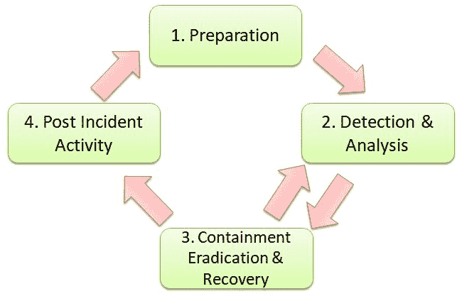
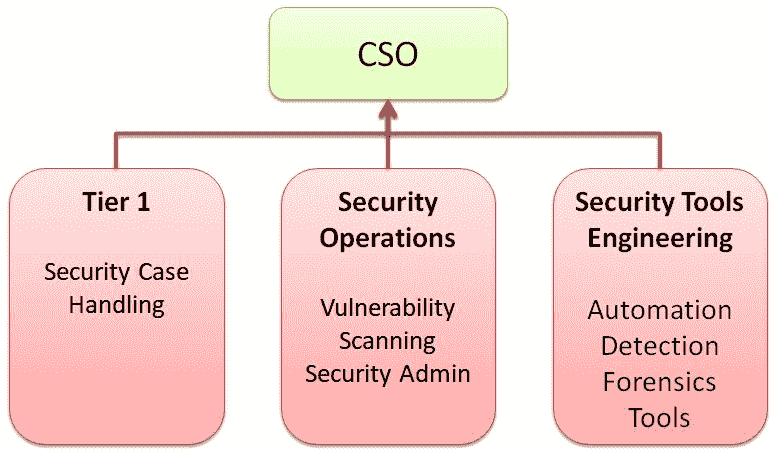

# 第十四章：事件响应

在前几章中，我们已经介绍了安全测试计划、白盒测试技巧、安全工具集和自动化。 从这一章开始，我们将讨论安全运营团队的事件响应。我们将主要讨论事件响应流程中各关键阶段的核心活动：准备、遏制、检测和事后分析。事件响应领域包括如何处理公开的 CVE 漏洞、如何应对白帽子或安全攻击、如何评估每个安全问题、反馈机制与开发团队的互动以及我们可能在事件响应中应用的工具或实践。本章将涵盖的主题如下：

+   安全事件响应流程

+   安全运营团队结构

+   事件取证技术

# 安全事件响应流程

建立安全事件响应流程不仅是大型企业的必需，小型企业也同样需要。网络安全法律或 GDPR 要求不仅要有安全事件处理流程，还要求向监管机构和关键利益相关者发送安全事件通知。完整的安全事件流程包括安全事件处理团队、人力资源、法务部门，以及外部监管机构。尽管有许多安全技术和工具可以帮助识别、保护、检测、响应和从威胁中恢复，但公关和公共沟通在非技术部分中扮演着至关重要的角色。我们将重点关注基于 NIST SP 800-62 在准备、检测、遏制和事后处理阶段的安全活动。

以下是与安全事件响应相关的一些行业推荐参考：

+   NIST SP 800-62 计算机安全事件处理指南 ([`csrc.nist.gov/publications/detail/sp/800-61/rev-2/final`](https://csrc.nist.gov/publications/detail/sp/800-61/rev-2/final))

+   SANS 事件处理员手册 ([`www.sans.org/reading-room/whitepapers/incident/incident-handlers-handbook-33901`](https://www.sans.org/reading-room/whitepapers/incident/incident-handlers-handbook-33901))

+   ENISA 云计算的好处、风险和信息安全建议 ([`resilience.enisa.europa.eu/cloud-security-and-resilience/publications/cloud-computing-benefits-risks-and-recommendations-for-information-security`](https://resilience.enisa.europa.eu/cloud-security-and-resilience/publications/cloud-computing-benefits-risks-and-recommendations-for-information-security))

+   MITRE 世界级网络安全运营中心的十大战略 ([`www.mitre.org/sites/default/files/publications/pr-13-1028-mitre-10-strategies-cyber-ops-center.pdf`](https://www.mitre.org/sites/default/files/publications/pr-13-1028-mitre-10-strategies-cyber-ops-center.pdf))

+   FIRST ([`www.first.org/education/FIRST_PSIRT_Service_Framework_v1.0`](https://www.first.org/education/FIRST_PSIRT_Service_Framework_v1.0))

NIST SP 800-62 将事件响应生命周期定义为四个阶段：准备、检测与分析、遏制清除与恢复，以及事件后活动。我们将在接下来的章节中介绍每个阶段的一些实用工具：

# 准备阶段

准备阶段是事件处理过程中最关键的部分。我们无法完全预测或避免任何安全事件，但可以做好充分的准备。准备阶段涵盖了所有所需的流程、分析工具、安全技术和团队资源，以预防和处理安全事件。准备不仅有助于预防安全事件，还能最大程度地减少发生安全事件时造成的损害。

以下是建议在事件响应准备阶段执行的一些安全实践：

+   事件处理沟通计划

+   事件分析硬件和软件工具（参考事件取证部分）

+   现有的网络图和基准线

+   预防控制措施，如风险评估、主机安全、网络安全、恶意软件保护、用户意识和培训（参考 CIS 安全控制）

+   蓝队与红队安全演习（参考下表）

+   白帽黑客或安全研究人员提交安全问题的赏金计划

建议定期进行内部攻击模拟，以测试现有终端和网络检测安全解决方案的有效性和弱点，例如杀毒软件、IPS、IDS 和防火墙。安全团队还可以分析现有的日志记录和警报功能以及响应时间。这类模拟攻击给安全团队提供了审查和优化现有安全框架的机会。

以下开源工具可以帮助生成内部攻击模拟而不影响业务操作。这些工具不会生成真实的攻击样本，而是模拟黑客行为或**高级持续性威胁**（**APT**）行为：

| **工具** | **APT 模拟** |
| --- | --- |
| DumpsterFire | DumpsterFire 工具包括多种模拟攻击场景，如账户攻击、文件下载、丢弃文件、命令执行和 Python 中的网页访问。它提供了一个用户友好的菜单，便于定制安全事件，即使是那些不懂 Python 的人也能使用。 |
| METTA | METTA 工具允许安全团队基于 MITRE ATT&CK 定制 APT 攻击的模拟。由 YAML 定义的模拟 APT 行为包括凭证访问、规避、发现、执行、数据外泄、横向移动、持久性和权限提升。 |
| 红队自动化（RTA） | 红队自动化工具是一组基于 ATT&CK 的 Python 和 PowerShell 脚本，能够模拟超过 50 种恶意行为。 |
| 原子红队（ART） | 原子红队工具提供 Windows、macOS 和 Linux shell 脚本，用于模拟 MITRE ATT&CK。 |
| APT 模拟器 | APT 模拟器工具是一组 Windows BAT 脚本，模拟 APT 行为。 |
| 网络飞行模拟器 | 网络飞行模拟器工具可以用于生成恶意网络流量，如 DNS 隧道、C2 通信、DGA 流量和端口扫描。 |

在处理安全事件时，团队可能会因专注于案件而忘记记录相关信息。一个事件跟踪工具可以帮助记录相关信息。开源工具 FIR（快速事件响应）是一个安全事件案件管理工具，可以帮助记录、跟踪和归档每个安全事件案件的所有发现。这些信息将有助于构建内部的安全事件处理知识库，并生成事后分析的事件报告（你可以在[`github.com/certsocietegenerale/FIR/`](https://github.com/certsocietegenerale/FIR/)找到此工具）。

# 检测与分析

识别安全事件的迹象需要部署各种安全解决方案和日志传感器。感染源包括 IDS/IPS、SIEM、防病毒、文件完整性监控、操作系统/网络日志以及已知的公共漏洞。整个企业安全控制的部署可参考 CIS 网络防御有效安全控制（你可以在[`www.cisecurity.org/controls/`](https://www.cisecurity.org/controls/boundary-defense/)找到相关信息）。

这些包括 20 项安全控制，以下表格总结了这些控制。每个安全控制中有许多商业解决方案，但表格中仅列出了开源解决方案：

| **网络安全控制** | **安全技术和开源工具示例** |
| --- | --- |
| CSC 1: 授权和未授权设备的清单 | 端点安全，资产管理 |
| CSC 2: 授权和未授权软件的清单 | 端点安全，资产管理 |
| CSC 3: 移动设备、笔记本电脑、工作站和服务器上的硬件和软件的安全配置 | CIS 安全基准，OpenSCAP。 |
| CSC 4: 持续漏洞评估与修复 | OpenVAS、Nmap、OWASP 依赖检查、OWASP 依赖追踪、vulscan |
| CSC 5: 管理权限的受控使用 | 强密码复杂度，审计根用户和管理员活动的日志 |
| CSC 6: 审计日志的维护、监控与分析 | Syslog、事件日志、SIEM、ELK、GrayLog、Security Onion、恶意流量检测 |
| CSC 7: 电子邮件与网页浏览器保护 | 邮件保护、反垃圾邮件、Web 应用防火墙 ModSecurity、电子邮件加密 Scramble、Linux 恶意软件检测 |
| CSC 8: 恶意软件防护 | 终端保护、杀毒软件、HIDS/HIPS、OSSEC、ClamAV |
| CSC 9: 网络端口、协议和服务的限制与控制 | Nmap、OpenSCAP |
| CSC 10: 数据恢复能力 | Bacula |
| CSC 11: 网络设备（如防火墙、路由器和交换机）的安全配置 | CIS 安全基准 |
| CSC 12: 边界防御 | 防火墙、IPS、蜜罐 Security Onion |
| CSC 13: 数据保护 | OSQuery、Data Vault |
| CSC 14: 基于需要知道的控制访问 | 数据分类、防火墙、VLAN、日志记录 |
| CSC 15: 无线访问控制 | VPN、SSL 证书、WAP2 |
| CSC 16: 账户监控与控制 | 日志分析工具 Fail2ban |
| CSC 17: 安全技能评估与适当的培训填补漏洞 | 安全培训与实验室资源 CybraryIT |
| CSC 18: 应用软件安全 | OWASP |
| CSC 19: 事件响应与管理 | NIST SP800-61 计算机安全事件处理指南、FIR（快速事件响应） |
| CSC 20: 渗透测试与红队演习 | 请参考我们在*准备*部分建议的一些开源工具 |

当收到安全事件案例时，安全团队应根据事件的影响进行优先级排序。NIST SP800-61《计算机安全事件处理指南》建议通过功能性影响、PII 信息影响和恢复能力工作量来量化影响级别：

+   功能性影响是指对业务功能的影响

+   PII 信息的影响是**敏感信息的机密性、完整性和可用性**（**CIA**）

+   恢复能力工作量是指从事件中恢复所需的时间和资源量

下表展示了每个安全事件警报级别的一些示例定义：

| **优先级** | **影响** | **响应** |
| --- | --- | --- |
| 高 | 功能性影响、信息泄漏或恢复能力工作量被归类为高。 | 需要立即人工响应。 |
| 中 | 功能性影响、信息泄漏或恢复能力工作量被归类为中等。 | 需要在 24 小时内响应。 |
| 低 | 功能性影响、信息泄漏和恢复能力工作量都被定义为低。 | 需要在常规任务中响应。 |
| 通知 | 没有直接与功能性影响或信息泄漏相关的重大迹象，但这可能是一个潜在的安全问题。 | 仅为通知。此内容可以作为季度威胁趋势分析的一部分。 |

# 隔离与恢复

隔离的短期目标是在完整解决方案准备好之前隔离感染的主机。另一方面，恢复的长期目标是寻找一种可以避免未来类似安全事件的安全控制，或者能够在检测到安全事件时执行自动恢复。

对于隔离，网络策略执行中已建立典型的网络或主机隔离标准。只要满足其中的任何标准，隔离措施可以包括阻止特定主机、重定向流量以应用最新的安全补丁，以及拒绝特定的通信流量或端口。

以下是常见的安全策略执行标准，这些标准会触发网络或主机隔离：

+   主机没有安装任何防病毒产品。

+   防病毒模式/引擎版本未更新。

+   主机上存在已知的漏洞组件。

+   在指定端口上存在可疑的通信流量。

+   在主机上检测到已知病毒。

+   有外发通信连接到已知的恶意 IP 或域。请参考以下资源：

    +   [`iplists.firehol.org/`](http://iplists.firehol.org/)

    +   [`www.spamhaus.org/drop/`](https://www.spamhaus.org/drop/)

    +   [`rules.emergingthreats.net/fwrules/emerging-Block-IPs.txt`](https://rules.emergingthreats.net/fwrules/emerging-Block-IPs.txt)

    +   [`check.torproject.org/exit-addresses`](https://check.torproject.org/exit-addresses)

在恢复方面，目标是将感染的应用程序或主机恢复到正常操作状态。恢复活动不仅包括恢复系统，还包括删除被破坏的文件、应用最新的补丁、保护通信端口、增加密码复杂度以及改进安全控制，如权限配置、HIDS、SELinux 和防火墙。

# 事件后活动

举行*经验教训*会议或事后分析报告可以帮助团队从事件中学习。经验教训会议的主要目标是寻找在安全事件响应过程中每个阶段的改进。此类会议往往在安全问题解决后被忽视。建议至少记录安全事件的过程，并将其纳入知识库。

对于一次经验总结会议，会议应集中讨论团队如何共同改进，避免类似问题在未来再次发生，而不是责怪某个人。事后会议的输入通常包括提议的安全控制变更、案件处理信息以及根本原因分析报告。期望团队能思考具体可以采取哪些行动来防止类似问题的发生。例如，可以加强特定的电子邮件钓鱼意识培训。可以优化 IDS 中的安全扫描规则，减少误报。可以通过自动化进行安全事件取证。已知漏洞的安装周期可以缩短。这些是会议的潜在输出，通常会在利益相关者之间达成共识，如安全、IT、开发、业务和法律团队。

期望的事后报告通常包括若干关键部分，回答关键问题，如发生了什么、影响、根本原因分析、短期和长期的缓解措施、事件时间线中的活动、应改进的地方以及应保留的内容。以下是一次事后总结会议的输出报告示例：

**问题概述**

其中一项服务被确认存在异常不可用情况。WebLogic 进程占用 100%的 CPU，日志显示有异常且可疑的出站 IP 连接。

**发生了什么以及影响**

业务功能影响：部分服务响应变慢，无法响应请求。运行的进程占用了 100%的 CPU 资源。未发现数据泄露风险。

**根本原因分析**

+   IT 识别到是 WebLogic 进程经常导致 CPU 使用率超过 80%。

+   安全团队检查 Linux 连接日志后，确认 WebLogic 进程与外部主机有出站连接，而这些主机与加密劫持相关（加密劫持是指通过攻击主机来挖掘加密货币）。

+   在安全团队查询 CVE 数据库后，问题可能与 CVE 2017-3248 有关。

**缓解措施和解决方案**

+   安全补丁准备之前的短期措施：应用防火墙规则，阻止与加密劫持服务器的出站通信流量，并阻止对受害主机的入站连接。

+   长期：

    +   应用 WebLogic 安全补丁。

    +   更新防病毒安全模式。

    +   优化基于主机的入侵检测规则，以应对高 CPU 占用进程和异常的出站连接行为。

**时间线中的活动**

第一天 1000: IT 服务监控识别到服务不可用。

第一天 1020: IT 识别到 WebLogic 进程占用 100%的 CPU，并收集了相关日志以供进一步分析。由于问题频繁发生并影响到服务可用性，案件也被上报给安全团队，检查是否为安全事件。

第一天 1040：安全团队完成了日志分析并识别出异常连接。

第一天 1145：IT 团队接到通知，决定断开与恶意 IP 的出站连接。

**应改进或保留的内容**

+   保留：IT 团队与安全团队之间的良好协作。

+   改进：自动化日志收集和分析工具。

+   改进：在安全补丁准备好之前，通过防火墙进行虚拟补丁处理。

+   改进：与威胁知识的网络日志关联，来自[`iplists.firehol.org/`](http://iplists.firehol.org/)。

# 安全事件响应平台（SIRP）

在处理安全事件时，会有大量信息需要处理和分析。理想的安全事件响应平台应能够做到以下几点：

+   接收来自不同来源的警报和安全事件（SIEM、IDS、电子邮件）

+   安全事件案例管理应允许安全分析师在事件处理生命周期中添加相关日志、IOC 或发现。

+   将其分析与外部威胁信息进行对比，例如 VirusTotal，以识别文件、哈希、域名或 IP 地址的恶意行为。

开源工具 TheHive 可以帮助你提供一个安全事件响应管理平台。TheHive 还可以与 MISP 配合使用，MISP 是一个威胁情报平台，用于共享和关联攻击指示符（表示目标攻击已经发生）和漏洞信息。更多信息请参考以下文档：

+   [`thehive-project.org/`](https://thehive-project.org/)

+   [`www.misp-project.org/index.html`](http://www.misp-project.org/index.html)

欲了解更多关于 TheHive、CorTex 和 MISP 如何集成以进行威胁事件响应的信息，请访问[`blog.thehive-project.org/2017/06/19/thehive-cortex-and-misp-how-they-all-fit-together/`](https://blog.thehive-project.org/2017/06/19/thehive-cortex-and-misp-how-they-all-fit-together/)。

# SOC 团队

**安全运营中心**（**SOC**），也称为**计算机事件响应团队**（**CIRT**），是处理和监控日常安全事件的安全团队。SOC 的组织结构可以包括现有 IT 团队的部分成员、外包团队或专门的安全团队。无论其结构如何，团队都有几个关键功能：

| **关键功能** | **描述** |
| --- | --- |
| 安全事件分析和取证（呼叫中心） | 该职能团队可能包括在 24/7 安全监控中心进行的一级案件处理。一级团队通常根据预定义的检查表或 SOP 来进行初步根本原因分析或缓解处理。 |

| 安全操作和管理 | 该职能团队涉及以下常规安全活动。这些是针对生产环境的定期安全检查活动： |

+   网络扫描（每周）

+   漏洞扫描（每周）

+   渗透测试（月度）

+   安全意识培训（每两个月一次）

+   安全日志趋势分析（月度）

+   安全管理和监控（每日）

+   补丁或安全签名更新（每日/每周）

|

| 安全工具工程 | 安全工程团队为安全呼叫中心或安全运营团队实施安全工具。安全工具可以是安全自动化、可疑行为检测器、取证分析工具、安全配置检查器、威胁情报集成、威胁签名创建等。 |
| --- | --- |

SOC 团队可以由 IT 呼叫中心的一部分或专门的安全团队组成，具体取决于整个组织的规模。典型的专门 SOC 团队结构如下图所示：

# 事件取证技术

组织进行事件取证的主要目标是回答以下问题：

+   主机是否被恶意程序感染？

+   主机是如何感染的？

+   如何改进以避免感染？

《NIST SP 800-86 数字取证与事件响应集成指南》定义了在受损计算机上执行数字取证的四个主要阶段：

+   **收集**：收集受损计算机的所有相关日志或网络活动日志

+   **检查**：提取并关联可能与可疑行为高度相关的信息

+   **分析**：分析所有信息以查明恶意感染的根本原因

+   **报告**：总结结果

取证技术要求事件响应团队具备进行分析的能力。在下表中，我们列出了一些能够执行半自动化取证的快速解决方案，包括收集、检查和分析：

| **类别** | **工具** | **目的和使用场景** |
| --- | --- | --- |
| 日志收集 | OSX Collector | Mac OS X 日志收集器是一个用于 macOS 的自动化取证证据收集工具。Python 脚本 osxcollector.py 执行所有收集任务。该工具会生成一个 JSON 文件，作为收集信息的总结。 |
| 日志收集 | IR Rescue | IR Rescue 是一个用于收集主机取证数据的 Windows 和 Linux 脚本。Windows 版本集成了 Sysinternals 和 NirSoft 的几个工具。 |
| 日志收集 | FastIR Collector | FastIR Collector（仅适用于 Linux）只需一个 Python 脚本即可收集 Linux 中的所有相关日志。对于 Windows 系统，需额外的模块和工具。更多信息请参见[`github.com/SekoiaLab/Fastir_Collector`](https://github.com/SekoiaLab/Fastir_Collector)。 |
| 恶意软件检测器 | Linux 恶意软件扫描器 | 以下链接提供免费的 Linux 恶意软件扫描器：CalmAV：它是一个适用于 Windows 的开源杀毒软件。Linux 恶意软件检测（LMD）：它是一个适用于 Linux 的开源杀毒软件。 |
| 可疑文件分析 | Cuckoo | Cuckoo 是一个自动化恶意软件分析系统。它可以分析 Windows、Linux、macOS 和 Android 平台下未知和可疑文件的动态运行时行为和静态行为。 |
| 客户端/服务器日志收集与分析 | GRR Rapid Response | 你可以使用 Google Remote Live forensics 进行事件响应。这需要在目标主机上安装 Python 代理以收集日志，并在 Python 服务器上进行分析。 |
| 客户端/服务器日志收集与分析 | OSQuery | OSQuery 工具的工作方式与 GRR 类似。关键区别在于 OSQuery 提供了一个 SQL 查询来进行端点分析。有关更多信息，你可以阅读以下链接的文档：[`osquery.io/`](https://osquery.io/)[`osquery.readthedocs.io/en/stable/deployment/anomaly-detection/`](https://osquery.readthedocs.io/en/stable/deployment/anomaly-detection/) |

# 总结

在本章中，我们讨论了安全事件响应过程，并分享了一些行业实践，如 NIST SP800-62、SANS Incident Handler Handbook 和 MITRE 的世界级网络安全运营中心十大策略。我们根据 NIST SP800-62 定义的阶段探讨了事件响应活动，这些阶段包括准备、检测与分析、控制与根除以及事后活动。

在准备阶段，我们介绍了一些用于红蓝队演练的模拟攻击工具。在检测阶段，我们建议应用 CIS Critical Security Controls for Effective Cyber Defense 来评估检测与分析能力。在控制阶段，我们介绍了一些控制安全策略。在事后阶段，我们学习了如何进行事后复盘，并查看了一个事件的事后复盘报告。为了将不同阶段和团队的信息连接起来，建议你使用一个 **安全事件响应平台** (**SIRP**)。

最后但同样重要的是，我们讨论了 SOC 组织及其应具备的关键职能。我们还查看了一些事件取证技术和工具。

在下一章中，我们将讨论安全监控。安全事件响应可能是一次性的安全案例处理活动，但安全监控将是一个持续的安全监控活动。

# 问题

1.  安全事件响应阶段的正确顺序是什么？

    1.  检测 -> 准备 -> 控制 -> 事后分析

    1.  控制 -> 检测 -> 准备 -> 事后分析

    1.  准备 -> 检测 -> 控制 -> 事后分析

    1.  准备 -> 控制 -> 检测 -> 事后分析

1.  什么最能描述一个奖励计划？

    1.  这是一个激励计划，鼓励安全研究人员提交安全问题

    1.  这是一个安全意识培训计划

    1.  这是一次内部的安全渗透演练

    1.  这是一个安全设计营

1.  攻击模拟的目的是什么？

    1.  测试终端检测的弱点

    1.  测试网络安全检测能力

    1.  测试安全系统的日志记录和警报能力

    1.  以上所有

1.  CIS 关键安全控制在有效的网络防御中定义了什么？

    1.  它定义了整个企业安全的 20 项安全控制

    1.  它定义了事件响应流程

    1.  它定义了安全编码实践

    1.  它定义了安全自动化实践

1.  ELK、Graylog 和 Syslogs 主要用于以下哪些安全控制？

    1.  审计日志的监控与分析

    1.  电子邮件和网页浏览器保护

    1.  恶意软件防御

    1.  数据恢复能力

1.  以下哪项不应用于量化影响级别？

    1.  功能影响

    1.  恶意软件检测能力

    1.  个人身份信息（PII）影响

    1.  可恢复性工作

1.  以下哪个是 SOC 团队不正确的角色/职责？

    1.  一级呼叫中心的主要目标是执行恶意软件分析

    1.  安全运营团队应定期执行网络扫描

    1.  安全工具工程团队负责安全工具的实施

    1.  安全日志分析应定期总结并分析

1.  "加密劫持"的正确描述是什么？

    1.  未经授权使用受损主机进行加密货币挖掘

    1.  未经授权加密受损主机

    1.  未经授权访问加密的信息

    1.  未经授权加密受损主机

# 进一步阅读

+   **NIST SP 800-62 计算机安全事件处理指南**: [`nvlpubs.nist.gov/nistpubs/specialpublications/nist.sp.800-61r2.pdf`](https://nvlpubs.nist.gov/nistpubs/specialpublications/nist.sp.800-61r2.pdf)

+   **ENISA 云计算的好处、风险及信息安全建议**: [`www.enisa.europa.eu/publications/cloud-computing-risk-assessment`](https://www.enisa.europa.eu/publications/cloud-computing-risk-assessment)

+   **计算机安全事件响应团队（CSIRTs）手册**: [`resources.sei.cmu.edu/library/asset-view.cfm?assetid=6305`](https://resources.sei.cmu.edu/library/asset-view.cfm?assetid=6305)

+   **SANS 安全检查单与逐步指南**: [`www.sans.org/score/checklists`](https://www.sans.org/score/checklists)

+   **优秀的事件响应**: [`github.com/meirwah/awesome-incident-response/`](https://github.com/meirwah/awesome-incident-response/)

+   **信息安全工具**: [`secure.dshield.org/tools/`](https://secure.dshield.org/tools/)

+   **组建事件响应团队**: [`www.auscert.org.au/publications/forming-incident-response-team`](https://www.auscert.org.au/publications/forming-incident-response-team)

+   **优秀的取证**: [`github.com/cugu/awesome-forensics/`](https://github.com/cugu/awesome-forensics/)

+   **优秀的事件响应**: [`github.com/meirwah/awesome-incident-response/`](https://github.com/meirwah/awesome-incident-response/)

+   **优秀的数字取证工具列表**: [`github.com/ivbeg/awesome-forensicstools/`](https://github.com/ivbeg/awesome-forensicstools/)

+   **优秀的恶意软件分析工具**: [`github.com/rshipp/awesome-malware-analysis/`](https://github.com/rshipp/awesome-malware-analysis/)

+   **事件响应剧本**: [www.incidentresponse.com/playbooks/](http://www.incidentresponse.com/playbooks/)

+   **SANS 事件处理员手册**: [`www.sans.org/reading-room/whitepapers/incident/incident-handlers-handbook-33901`](https://www.sans.org/reading-room/whitepapers/incident/incident-handlers-handbook-33901)

+   **事件响应流程**: [`response.pagerduty.com`](https://response.pagerduty.com)

+   **NIST 改善关键基础设施网络安全框架**: [`www.nist.gov/publications/framework-improving-critical-infrastructure-cybersecurity-version-11`](https://www.nist.gov/publications/framework-improving-critical-infrastructure-cybersecurity-version-11)

+   **微软 TechNet IT 安全事件响应**: [`technet.microsoft.com/en-us/library/cc700825.aspx`](https://technet.microsoft.com/en-us/library/cc700825.aspx)

+   **MITRE 的世界级网络安全操作中心十大战略**: [`www.mitre.org/sites/default/files/publications/pr-13-1028-mitre-10-strategies-cyber-ops-center.pdf`](https://www.mitre.org/sites/default/files/publications/pr-13-1028-mitre-10-strategies-cyber-ops-center.pdf)

+   **SaaS 初创公司安全 101**: [`github.com/forter/security-101-for-saas-startups/blob/english/security.md`](https://github.com/forter/security-101-for-saas-startups/blob/english/security.md)

+   **信息安全培训与实验室资源**: [`github.com/onlurking/awesome-infosec`](https://github.com/onlurking/awesome-infosec)

+   **vFeed - 关联漏洞和威胁情报数据库包装器**: [`github.com/toolswatch/vFeedhttps://vfeed.io/`](https://vfeed.io/)

+   **MITRE ATT&CK**: [`attack.mitre.org/wiki/Main_Page`](https://attack.mitre.org/wiki/Main_Page)

+   **红队自动化**: [`github.com/endgameinc/RAT`](https://github.com/endgameinc/RAT)

+   **原子红队**: [`github.com/redcanaryco/atomic-red-team`](https://github.com/redcanaryco/atomic-red-team)

+   **APT 模拟器**: [`github.com/NextronSystems/APTSimulator`](https://github.com/NextronSystems/APTSimulator)

+   **网络飞行模拟器**: [`github.com/alphasoc/flightsim`](https://github.com/alphasoc/flightsim)

+   **优秀的信息安全资源**: [`github.com/onlurking/awesome-infosec`](https://github.com/onlurking/awesome-infosec)

+   **NIST SP800-61 计算机安全事件处理指南**: [`csrc.nist.gov/publications/detail/sp/800-61/rev-2/final`](https://csrc.nist.gov/publications/detail/sp/800-61/rev-2/final)
