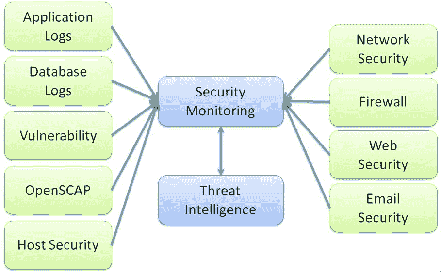

# 安全监控

事件响应的话题在上一章中已有讨论。在本章中，我们将介绍一些安全监控技术。本章的目标是准备我们的安全监控机制，以保护和防止我们的云服务受到攻击。为了做好准备，我们的安全监控程序应包括日志记录、监控框架、威胁情报和恶意程序的安全扫描。本章将涵盖以下内容：

+   日志策略

+   安全监控框架

+   信息来源

+   威胁情报工具集

+   安全扫描工具集

+   恶意软件行为匹配—YARA

# 日志策略

安全监控的一般目标是了解数据、网络、终端主机、网关、云服务、Web 服务、数据库、应用程序和安全配置的现有安全态势。此监控可以通过各种安全工具来实现，例如主机 IDS、网络 IDS/IPS、防病毒软件、防火墙，以及**安全信息和事件管理**（**SIEM**）。安全监控场景将决定应收集哪些日志，应该监控什么内容，以及威胁可视化的重点。

如果日志收集过于频繁，信息可能会变得过于庞大，占用过多的资源，如存储和网络流量。另一方面，如果收集的日志不够详细，安全专家可能无法识别潜在风险或进行安全事件的事后分析。

NIST SP 800-92《计算机安全日志管理指南》建议，日志收集配置应基于对系统的安全影响。建议日志收集和保留策略应基于数据的价值和业务影响。组织可以定义此类安全策略来管理整个日志基础设施。以下表格是一些日志策略的示例：

**NIST SP 800-92 的日志配置设置示例**：

| **类别** | **低影响** | **中等影响** | **高影响** |
| --- | --- | --- | --- |
| 日志数据保留时间（请注意，网络安全法可能会明确要求日志保留期限。此处的数字仅为示例。） | 一到两周 | 一到三个月 | 三到 12 个月 |
| 日志轮换频率 | 可选（如果执行，至少每周一次，或每 25 MB） | 每六到 24 小时一次，或每 2 到 5 MB | 每 15 到 60 分钟一次，或每 0.5 到 1.0 MB |
| 组织要求系统多频繁将日志数据传输到日志管理基础设施（如果有此政策） | 每 3 到 24 小时一次 | 每 15 到 60 分钟一次 | 至少每五分钟一次 |
| 日志数据需要多频繁地在本地分析（通过自动化或手动方式） | 每 1 到 7 天 | 每 12 到 24 小时 | 至少每天六次 |
| 是否需要对轮换日志进行完整性检查 | 可选 | 是 | 是 |
| 是否需要加密轮换日志 | 可选 | 可选 | 是 |
| 是否需要加密日志数据传输，或是否需要在单独的日志网络上执行传输 | 可选 | 是（如果可行） | 是 |

# 安全监控框架

一旦安全检测解决方案到位，就可以规划安全监控管理，执行安全事件的关联分析。安全监控框架的目的是不是取代现有的端点或网络安全解决方案，而是提供整个环境的安全态势、安全趋势和安全事件关联。一些先进的安全监控框架甚至可以应用机器学习进行安全事件关联，以识别异常。不要单纯地认为建立一个安全监控管理框架就能解决所有与安全监控相关的工作。构建一个完整的安全监控框架需要包括以下关键组件：

+   **日志收集器**：负责收集并转发所有日志给安全监控团队进行进一步分析。在生产环境中，日志收集的关注点是主机的性能影响和需要转发的日志数量。Syslog 是最常见的将日志发送到安全监控管理的方式。

+   **安全监控** **(SIEM)**：这为安全管理员提供整个环境的可视化安全概览。一个理想的 SIEM 甚至可以基于预定义规则进行自动化安全关联分析，识别异常和潜在风险。

+   **威胁情报**：威胁情报用于将收集到的内部安全日志与外部威胁信息进行关联，例如黑名单中的 IP、Tor 出口节点、已知恶意域名、用户代理、文件哈希和**妥协指标**（**IOC**）。

+   **威胁情报馈送**：这些构成了威胁数据库，包含由网络安全社区、安全供应商或客户提交的已知当前威胁信息。组织可以使用外部威胁情报馈送来修正内部安全事件，以识别是否存在任何可疑活动，例如内部主机连接到已知的网络犯罪 IP。

实际操作中，建议在部署和优化安全扫描解决方案（如主机 IDS/IPS 和网络安全）后，再构建威胁情报和安全监控。安全监控和威胁情报有助于您可视化并关联主机和网络段的安全事件，但这些安全监控技术仍依赖于主机和网络 IDS/IPS 检测及操作。

以下图示展示了安全监控的典型范围：



# 信息来源

各种日志源将帮助您在不同方面提供安全事件。以下是一些安全监控重点的常见建议：

| **信息来源** | **安全监控重点** |
| --- | --- |

| 应用日志 | 这些是应用程序生成的操作日志和错误日志。如果应用程序是 Web 服务，日志可能包含在 Apache 或 nginx 日志中：

+   监控用户活动，特别是涉及敏感数据访问的活动

+   监控用户配置文件的重大变化，例如登录 IP、异常终端设备、非浏览器连接客户端以及来自不同 IP 源的并发连接

+   监控管理员和服务账户的活动

+   监控登录失败和 Web 错误，如 401、404 和 501

|

| 主机安全、数据库日志 | 这些主要依赖于基于主机的 IDS/IPS 检测日志、操作系统和数据库日志：

+   用户的成功和失败认证

+   管理员访问和更改

+   未授权的登录失败

+   主要配置文件的更改，例如 mysql.cnf

+   添加了数据库账户

+   向特定主机传输大量数据

|

| 漏洞 | OpenVAS 或 NMAP 扫描的 CVE 漏洞、不安全的通信端口或协议，如 Telnet、SSH v1、SSL 和 FTP |
| --- | --- |
| OpenSCAP | 采用 OpenSCAP 扫描工具可以帮助您识别应用程序、操作系统、数据库和 Web 服务的不安全配置 |
| 网络安全、防火墙 | 依赖于网络 IDS/IPS 检测日志，以及负载均衡器、交换机和路由器的日志。有关 IPtables、Snort 和 Suricata 的更新防火墙规则，请参阅 EmergingThreats 网站。 |

| Web 安全 | 依赖于 Web 应用防火墙检测日志：

+   客户端 IP 来自黑名单中的 IP

+   与可疑客户端相关的用户代理

+   Web 日志中错误过多，例如 401、404 和 500

+   请参考 OWASP ModSecurity CRS，它包括了 Web 应用防火墙规则集。

|

| 邮件安全 | 回复邮件安全扫描和检测日志：

+   不寻常的邮件接收者或发送者

+   恶意附件文件

+   消息体中的恶意 URL

|

# 威胁情报工具集

威胁情报的目的是帮助组织为已知和未知的威胁做好准备。为了应对未知威胁，可以使用外部威胁源来识别现有环境中是否存在类似的威胁，同时也可以用于优化安全检测规则。例如，已知的网络犯罪 IP 或 Tor 出口 IP 可以用来在防火墙中阻止出站连接 IP 列表。

集成内部威胁日志信息和外部威胁源有助于结合已知和未知的威胁，并采取主动措施。整个威胁情报过程通常包括以下关键组件：

+   **日志收集器**：用于收集内部系统、应用程序和安全日志

+   **SIEM/可视化**：用于在一个仪表盘中可视化安全态势

+   **威胁情报平台**：用于关联内部和外部的威胁信息

+   **威胁情报源**：这是外部威胁数据库，如黑名单 IP、恶意哈希、可疑域名等

以下是一些开源工具，可以帮助你构建完整的威胁情报解决方案：

| **类别** | **开源安全工具** |
| --- | --- |
| 日志收集器/传感器 | **Syslog-NG**：Syslog-ng 是一个增强版日志守护进程，不仅能处理标准的 syslog 消息，还能处理非结构化数据。**Rsyslog**：Rsyslog 是一个**r**ocket-fast（极速）**sys**tem（系统）用于**log**（日志）处理的工具。**FileBeat**：Filebeat 提供了一种背压敏感协议，用于控制将数据发送到 Logstash 或 Elasticsearch 的流量。**LogStash**：Logstash 是一个数据处理管道，收集数据、转换数据并将其发送到 Elasticsearch。 |
| SIEM/可视化 | **Kibana**：Kibana 提供 Elasticsearch 数据的可视化展示。**ElasticSearch**：实时搜索、索引和分析数据。**AlienValut OSSIM**：这是 AlienValut 提供的开源 SIEM（安全信息和事件管理）解决方案。**Grafana**：提供一个快速的日志查询和可视化解决方案，无论数据存储在哪里。**GrayLog**：这是一个开源企业日志管理解决方案。 |
| 威胁情报平台 | **MISP - 开源威胁情报平台**：MISP 是一个威胁共享平台，可以搜索和关联 IoC（入侵指示器）、威胁情报源和漏洞信息。 |

| 威胁情报源 | **外部威胁情报源，提供黑名单 IP 列表和防火墙规则建议**：

+   [`rules.emergingthreats.net/fwrules/`](https://rules.emergingthreats.net/fwrules/)

+   [`www.spamhaus.org/drop/`](https://www.spamhaus.org/drop/)

+   [`rules.emergingthreats.net/fwrules/emerging-Block-IPs.txt`](https://rules.emergingthreats.net/fwrules/emerging-Block-IPs.txt)

+   [`check.torproject.org/exit-addresses`](https://check.torproject.org/exit-addresses)

+   [`iplists.firehol.org/`](http://iplists.firehol.org/)

|

# 安全扫描工具集

这里有一些可以执行安全监控、扫描和检测的开源工具。虽然您的组织可能已经部署了一些商业安全解决方案，但这些开源安全检测规则在优化现有的安全检测时，比如 IDS/IPS、防火墙和 Web 安全，可能是一个很好的参考。

您可能会发现以下规则有助于更新或改进现有的防火墙规则：

+   **Wazuh 主机 IDS 规则**：主机入侵防御规则。

+   **OSSEC 主机 IDS 规则**：主机入侵防御规则。

+   **ModSecurity WAF 规则**：Web 应用防火墙规则。

+   **Suricata 网络 IDS/IPS 规则**：基于网络的入侵防御防火墙规则。

+   **Snort 网络 IDS/IPS 规则**：基于网络的入侵防御防火墙规则。

该表列出了每个类别中的安全监控工具。

| **类别** | **开源安全监控工具** |
| --- | --- |
| 一体化安全扫描（主机、网络、可视化） | **Security Onion**: [`github.com/Security-Onion-Solutions`](https://github.com/Security-Onion-Solutions) 包含多个开源安全工具，如 Elasticsearch、Logstash、Kibana、Snort、Suricata、Bro、OSSEC、Sguil、Squert 和 NetworkMiner。 |
| 一体化主机 IDS、安全配置与可视化 | Wazuh 集成了 OSSEC（一个主机 IDS）、OpenSCAP（安全配置扫描器）和 Elastic Stack（威胁可视化）。 |
| 安全配置 | OpenSCAP 定义了操作系统、Web、数据库和应用程序的安全配置。 |
| 漏洞 | OpenVAS 和 OWASP 依赖是两款流行的开源漏洞扫描器。 |
| 杀毒软件 | CalmAV 是 Windows 的开源杀毒软件。LMD（Linux Malware Detect）是 Linux 版本的开源杀毒软件。 |
| 主机 IDS/IPS | OSSEC 和 Samhain 是两种需要考虑的开源主机 IDS/IPS 解决方案。 |
| Web 应用防火墙（WAF） | ModSecurity 是 OWASP 开源项目之一，是一个轻量级的 Web 应用防火墙。 |
| 网络 IDS/IPS | Snort 和 Suricata 是两款流行的开源网络 IDS/IPS 解决方案。这两种解决方案还提供经常更新的规则。 |

# 恶意软件行为匹配 – YARA

YARA ([`virustotal.github.io/yara/`](https://virustotal.github.io/yara/)) 是一个用于恶意软件检测的模式匹配瑞士军刀。YARA 规则由基于文本或二进制模式的恶意软件特征描述组成。YARA 可用于进行恶意软件检测，检测签名也可以轻松定义。YARA 扫描器/规则可以视为一种杀毒扫描器和签名。

例如，假设一台主机识别到可疑的 Webshell 活动，但杀毒软件没有检测到任何可疑活动。安全管理员可以使用 YARA 检测器和预定义的 YARA 规则扫描主机上的所有文件或扫描收集的日志。以下是一个 YARA 规则的示例，用于检测 Web shell：

```
rule  php_webshell : webshell
{
    meta:
        description = “This is a sample of a PHP webshell detection rule.”
    strings:
         $x1 = “eval(\\\x65\\x76\\x6C”
         $x2 = “Dim wshell, intReturn, strPresult”  fullword   ascii
    condition:
         filesize < 15KB and all of them
}
```

YARA 规则定义了 Web shell 的两个特征。当使用 YARA 规则扫描任何二进制文件时，如果文件大小小于 15 KB 且满足 `x1` 和 `x2` 中规定的标准，则 YARA 扫描器会识别出匹配项。

YARA 扫描器可以作为独立的命令行工具或作为 Python 插件执行。请参考 YARA 入门指南 *编译与安装 YARA*，了解如何在 Windows、Linux 和 macOS 上安装 YARA 扫描器。你可以在 [`yara.readthedocs.io/`](https://yara.readthedocs.io/) 上找到该指南。

最新的 YARA 规则——以及恶意软件、恶意邮件、Webshell、打包工具、文档、漏洞利用包、CVE 和加密学的签名和检测——可以在以下链接找到：

+   [`github.com/Yara-Rules/rules`](https://github.com/Yara-Rules/rules)

+   [`github.com/Neo23x0/signature-base`](https://github.com/Neo23x0/signature-base)

+   [`github.com/InQuest/awesome-yara`](https://github.com/InQuest/awesome-yara)

# 概要

在本章中，我们讨论了使用 NIST 800-92《计算机安全日志管理指南》来定义日志策略。我们还探讨了安全监控框架的关键组件，如日志收集器、SIEM 和威胁情报。安全监控框架需要信息日志来源。我们还讨论了信息来源，并阐明了我们在日志中寻找的内容。应用日志、主机安全日志、数据库日志、漏洞扫描结果、网络安全日志以及 Web 和电子邮件安全日志通常是安全监控的日志来源。

我们还介绍了构建自己内部威胁情报框架所需的工具集。我们将威胁情报框架应用于识别已知和未知的威胁。我们还分享了一些用于构建威胁情报框架的开源工具，如 MISP——一个开源威胁情报平台。工具大致分为三个关键类别——日志收集器、SIEM/可视化和威胁情报订阅。另一方面，也有一些开源安全扫描工具集可用，如 Security Onion、主机 IDS、漏洞扫描器、杀毒软件、WAF、网络安全，以及 YARA 的使用。

总结来说，安全监控依赖于安全扫描工具、通过 SIEM 从各个来源关联的日志，以及用于识别已知和未知威胁的威胁情报订阅。

# 问题

1.  以下哪项不是安全监控框架的一部分？

    1.  日志收集器

    1.  安全监控

    1.  威胁情报

    1.  加密

1.  哪些类型的日志有助于安全监控？

    1.  应用程序日志

    1.  主机安全日志

    1.  漏洞扫描结果

    1.  以上所有

1.  以下哪个事实与网络安全无直接关系？

    1.  客户端 IP 来自黑名单 IP

    1.  用户代理与可疑客户端相关

    1.  异常的邮件接收者或发件人

    1.  Web 日志中的错误过多，如 401、404、500

1.  以下哪种工具不是日志收集器/传感器？

    1.  Syslog

    1.  Kibana

    1.  FileBeat

    1.  LogStash

1.  Security Onion 用于什么？

    1.  它是一个一体化的安全扫描和监控工具（主机、网络、可视化）

    1.  它是一个漏洞扫描器

    1.  它是一个杀毒扫描器

    1.  它是一个 WAF（Web 应用程序防火墙）

1.  YARA 是什么？

    1.  它是一个加密模块

    1.  YARA 是一个用于恶意软件检测的模式匹配瑞士军刀

    1.  它是一个漏洞扫描器

    1.  它是一个自动化框架

# 进一步阅读

+   **SANS 持续监控—它是什么、为何需要以及如何使用**: [`www.sans.org/reading-room/whitepapers/analyst/continuous-monitoring-is-needed-35030`](https://www.sans.org/reading-room/whitepapers/analyst/continuous-monitoring-is-needed-35030)

+   **PCI DSS 第十一部分 - 定期测试安全系统和流程**: [`www.pcisecuritystandards.org/document_library?category=pcidss&document=pci_dss`](https://www.pcisecuritystandards.org/document_library?category=pcidss&document=pci_dss)

+   **计算机安全日志管理指南（SP 800-92）**: [`ws680.nist.gov/publication/get_pdf.cfm?pub_id=50881`](https://ws680.nist.gov/publication/get_pdf.cfm?pub_id=50881)

+   **NIST 800-137 信息安全持续监控**: [`nvlpubs.nist.gov/nistpubs/legacy/sp/nistspecialpublication800-137.pdf`](https://nvlpubs.nist.gov/nistpubs/legacy/sp/nistspecialpublication800-137.pdf)

+   **Loki - 简单的 IOC 和事件响应扫描器**: [`github.com/Neo23x0/Loki`](https://github.com/Neo23x0/Loki)

+   **恶意软件指标**: [`github.com/citizenlab/malware-indicators`](https://github.com/citizenlab/malware-indicators)

+   **OSINT 威胁源**: [`www.circl.lu/doc/misp/feed-osint/`](https://www.circl.lu/doc/misp/feed-osint/)

+   **SANS 如何有效使用威胁情报**: [`www.sans.org/reading-room/whitepapers/analyst/threat-intelligence-is-effectively-37282`](https://www.sans.org/reading-room/whitepapers/analyst/threat-intelligence-is-effectively-37282)

+   **NIST 800-150 网络威胁信息共享指南**: [`nvlpubs.nist.gov/nistpubs/specialpublications/nist.sp.800-150.pdf`](https://nvlpubs.nist.gov/nistpubs/specialpublications/nist.sp.800-150.pdf)
