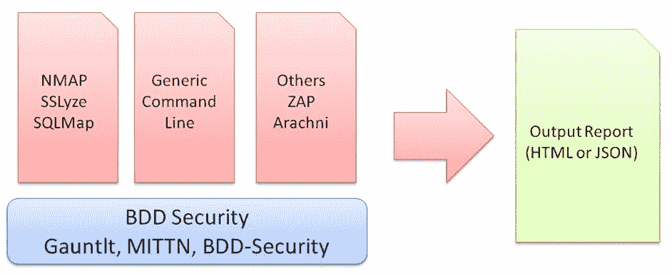
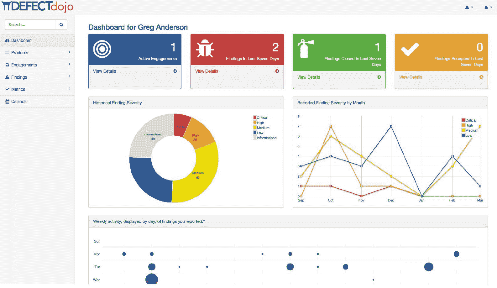

# 第十六章：新发布的安全评估

现在我们已经完成了安全监控的学习，本章将学习新发布的安全评估。云服务可能会有频繁的发布和更新。对于开发、运维和安全团队来说，在短时间内发布工作并在发布前完成最低限度的安全测试是一个挑战。本章将介绍每次发布的安全审查政策、建议的检查清单和测试工具。在测试集成方面，本章还将介绍 BDD 安全框架和其他集成安全测试框架。

本章节将涵盖以下主要内容：

+   安全审查政策

+   安全检查清单和工具

+   BDD 安全框架

+   汇总的测试结果

# 发布的安全审查政策

组织应为每次发布定义其自己的安全评估政策。对于重要或新发布的应用程序，毫无疑问需要进行全面的安全评估。然而，我们是否也需要对补丁发布进行同样的处理，特别是当它是一个时间敏感且对业务至关重要的发布时？清晰理解应用程序发布的范围和目标将有助于安全团队规划必要的安全评估范围。

下表展示了应用发布与安全评估范围之间关系的示例：

| **应用程序发布目标** | **安全评估范围** |
| --- | --- |
| 新版或重大应用发布 | 全面评估 |
| 第三方组件更新 | 基于第三方及其集成接口的评估 |
| 补丁发布 | 基于补丁范围的针对性评估 |
| 紧急发布 | 安全测试范围有限，以确保没有重大安全问题 |

当一个团队接收更多项目并且发布频率更高时，单一的安全团队可能无法处理所有项目的安全评估。因此，建议定义哪些安全评估应由产品开发团队完成，哪些应由安全团队完成。通常，安全团队将帮助准备安全检查清单、工具包和指南，供产品团队进行自我评估。有关安全检查清单和工具的更完整列表，请参考下一节。本表格展示了开发、安保和 DevOps 团队执行安全评估活动的示例：

| **安全审查阶段** | **示例关键安全实践** | **执行者** |
| --- | --- | --- |
| 自我评估 |

+   审查 OWASP ASVS 检查清单

+   审查 OWASP Top 10 检查清单

+   执行定义好的自动化安全工具，例如 ZAP、NMAP 和 SQLmap

+   修复重大安全问题

| 产品开发团队 |
| --- |
| 发布前 |

+   将自我评估测试结果和预发布包提交给安全团队

+   安全团队重点评估风险最高的模块

+   安全团队执行验收安全测试，不仅包括软件包，还包括整个系统的安全配置，如 Linux、MySQL 和 NginX

+   安全审查团队将执行手动和自动应用程序和网络安全测试，并将收到的审查结果发送给您（详见后续结果部分）

| 安全团队 |
| --- |

| 生产 | 定期执行以下安全扫描：

+   软件组件已知 CVE

+   安全配置

+   网络通信，例如端口和不安全协议

+   OWASP 十大安全问题

| 运维和安全团队 |
| --- |

# 安全检查清单和工具

我们讨论的安全检查清单范围主要是针对预生产部署版本。在部署到生产之前，DevOps 和安全团队会进行最终测试。在最佳情况下，这些定义的安全检查清单可以自动完成。这将帮助 DevOps 团队即使在部署到生产后也能定期进行安全检查。参考*进一步阅读*部分以获取每个工具的参考来源。以下表格显示正在检查的功能、安全测试方法和建议的安全测试工具：

| **安全类别** | **安全测试方法** | **建议的安全测试工具** |
| --- | --- | --- |
| 隐藏的通信端口或通道 |

+   确保没有隐藏的通信端口或后门

+   确保没有隐藏的硬编码秘密、密码或硬密钥

+   检查不必要的系统维护工具

+   对网络通信进行源代码审查，如与 Java 相关的 API `connect()`, `getPort()`, `getLocalPort()`, `Socket()`, `bind()`, `accept()`, `ServerSocket()`

+   禁止监听 `0.0.0.0`

| NMAPGrauditTruffleHogSnallygasterHpingmasscan |
| --- |
| 隐私信息 |

+   搜索源代码中的明文密码和密钥

+   搜索符合 GDPR 合规性的个人信息

+   个人信息可以由最终用户修改和删除

+   个人信息可以在规定期限内删除

| TruffleHogBlueflowerYARAPrivacyScoreSnallygaster |
| --- |
| 安全通信 |

+   SSH v2 取代 Telnet

+   SFTP 取代 FTP

+   TLS 1.2 取代 SSL TLS 1.1

| NMAPWireSharkSSLyzeSSL/TLS tester |
| --- |
| 第三方组件 |

+   CVE 检查

+   已知漏洞检查

+   隐藏的恶意代码或秘密

| OWASP 依赖检查 LMD（Linux 恶意软件检测）OpenVASNMAPCVEChecker |
| --- |
| 密码学 |

+   确保没有弱加密算法

+   确保公共 Web 界面上没有秘密文件

| GrauditSSLyzeSnallygaster |
| --- |

| 审计日志 | 确保运维和安全团队能够记录以下情景：

+   非查询操作，包括成功和失败的行为

+   非查询调度任务

+   执行管理任务的 API 访问或工具连接

| GREP |
| --- |

| DoS 攻击 | DoS 测试旨在确保应用程序失败是否如预期。DoS 场景可能涵盖以下内容：

+   TCP 同步洪水攻击

+   HTTP 慢速攻击

+   HTTP POST 洪水攻击

+   NTP DoS

+   SSL DoS

| PwnlorisSlowlorisSynfloodThc-sll-DoSWreckuestsntpDoS |
| --- |

| Web 安全 | 为了制定 Web 安全政策，你可以参考 OWASP 测试指南和 OWASP 十大漏洞：

+   注入攻击

+   身份验证

+   数据暴露

+   XXE

+   访问控制破坏

+   安全配置错误

+   XSS

+   不安全的反序列化

+   已知漏洞

+   日志记录和监控不足

| 参考 OWASP 测试指南 v4OWASP ZAPBurpSuiteArachni 扫描器 SQLMap |
| --- |
| 安全配置 | 确保应用程序、Web 服务、数据库和操作系统的配置是安全的。安全配置基于 CIS 安全基准和 OpenSCAP。 | OpenSCAPDocker Bench SecurityClair |
| 模糊测试 | 模糊测试的目的是生成动态测试数据作为输入，检查应用程序是否会意外失败。 | API FuzzerRadamsaAmerican Fuzzy lopFuzzDBWfuzz |
| 移动应用安全 | 参考 OWASP 移动应用安全测试指南，以获得一套良好的安全策略应用指南。 | 移动安全框架 |
| 常见问题 | 根据预期的历史数据列出最常见的安全问题。 | CWE/SANS Top 25 最危险的软件错误 |
| 安全合规 | 基于业务需求的安全合规也可以包含在内，如 GDPR 或 PCI DSS。 | 参考具体的安全合规要求 |

# BDD 安全框架

由于存在各种安全测试工具，分析每个测试工具生成的测试结果可能需要耗费时间。在简单查看安全测试结果时，可能难以判断执行了哪些安全测试用例。例如，NMAP 生成的安全测试报告可以被安全测试团队理解，但可能对 DevOps 团队不易理解。这些都是 BDD 安全框架能够解决的问题。采用 BDD 安全框架的目的是整合所有安全测试工具，并通过可读的用户故事语句来定义所有安全测试用例。

为了构建完整的自动化框架，建议先准备好安全测试工具，如 NMAP、SSLyze、SQLmap、ZAP 和 Arachni。当这些安全工具和实践尚未就绪时，不要尝试构建 BDD 安全自动化框架。

毕竟，BDD 安全框架用于整合所有安全工具和结果，并以定义的用户故事形式呈现，要求每个安全测试工具执行相关操作：

以下表格对比了开源 BDD 安全工具与其他选项。这些框架足够灵活，可以执行安全工具集成并提供汇总的测试结果。如果你正在寻找一个可以在 Windows 和 Linux 上执行的 BDD 框架，并且能够与其他工具集成，那么可以考虑使用 GAUNTLT。GAUNTLT 提供了*通用命令行*适配器，允许你执行任何命令行工具：

|  | **MITTN** | **GAUNTLT** | **BDD 安全** |
| --- | --- | --- | --- |
| 编程语言 | Python | Ruby | Java |
| BDD 框架 | Behave | Cucumber | CucumberSelenium |
| Windows/Unix | Unix | 两者 | 两者 |
| 默认插件 | BurpSuiteSSLyzeRadamsa | NMapSSLyzeSQLMapGarmr 通用命令行 | ZAPSSLyzeNessus |

# 汇总的测试结果

如果你的安全团队使用各种安全工具进行安全测试，其中一个挑战就是如何汇总所有的输出结果。我们之前提到的 BDD 框架就是其中的一个解决方案。然而，如果你不打算构建另一个 BDD 框架，而只想汇总所有的测试输出，那么 OWASP DefectDojo 可能是你的解决方案（更多信息请见 [`github.com/DefectDojo/django-DefectDojo`](https://github.com/DefectDojo/django-DefectDojo)）。

使用 DefectDojo 来汇总所有安全测试工具输出的主要优势是能够将结果展示在一个仪表盘上，并附带相关的度量，如下图所示：

来源: [`github.com/DefectDojo/django-DefectDojo`](https://github.com/DefectDojo/django-DefectDojo)

以下表格展示了 DefectDojo 可以导入的开源安全工具输出格式：

| **开源安全工具** | **输出格式** |
| --- | --- |
| **Arachni Scanner**: [`www.arachni-scanner.com/`](http://www.arachni-scanner.com/) | JSON |
| **Bandit**: [`github.com/PyCQA/bandit`](https://github.com/PyCQA/bandit) | JSON |
| **Burp**: [`portswigger.net/burp`](https://portswigger.net/burp) | XML |
| **Dependency Check**: [`www.owasp.org/index.php/OWASP_Dependency_Check`](https://www.owasp.org/index.php/OWASP_Dependency_Check) | XML |
| **Nikto**: [`github.com/sullo/nikto`](https://github.com/sullo/nikto) | XML |
| **NMAP**: [`nmap.org/`](https://nmap.org/) | XML |
| **OpenVAS**: [`www.openvas.org/`](http://www.openvas.org/) | CSV |
| **Retire.JS**: [`retirejs.github.io/retire.js/`](https://retirejs.github.io/retire.js/) | JSON |
| **ssllabs-scan**: [`github.com/ssllabs/ssllabs-scan`](https://github.com/ssllabs/ssllabs-scan) | JSON |
| **Trufflehog**: [`github.com/dxa4481/truffleHog`](https://github.com/dxa4481/truffleHog) | JSON |
| **Visual Code Grepper (VCG)**: [`github.com/nccgroup/VCG`](https://github.com/nccgroup/VCG) | CSV 或 XML |
| **ZAP**: [`www.owasp.org/index.php/OWASP_Zed_Attack_Proxy_Project`](https://www.owasp.org/index.php/OWASP_Zed_Attack_Proxy_Project) | XML |
| **通用发现导入** | CSV |

# 总结

在本章中，我们讨论了如何为每次发布建立安全审查政策。我们了解到，推荐将安全评估的范围基于应用发布目标。例如，新的重大应用发布应该进行全面的安全评估；而第三方组件更新发布可能只关注集成接口，而不是全范围评估。此外，安全审查可以在不同阶段进行，例如产品开发团队的自我评估、安全团队的发布前评估以及运维团队的产品安全评估。

还讨论了预生产部署发布的安全检查清单和相关的测试工具。安全检查清单的关键领域包括隐藏的通信接口、隐私信息、安全通信、第三方组件、加密、审计日志、DoS 攻击、Web 安全、配置、模糊测试以及最近的主要问题列表。

为了将所有的测试案例与不同的工具集成，推荐使用 BDD 安全框架。目前有三个开源 BDD 安全框架——MITTN、GAUNTLT 和 BDD-Security。如果没有使用 BDD 安全框架，建议使用 OWASP DefectDojo，它可以帮助整合各种安全测试工具的输出，并将结果呈现于一个仪表盘中。

总结来说，过程（安全发布政策、检查清单和测试策略）、技术（安全测试工具和框架）以及团队（开发、运维和安全团队）的参与是确保每次发布安全的关键。

# 问题

1.  哪项安全评估适用于新的或重大应用发布？

    1.  完全评估

    1.  基于补丁范围的评估

    1.  基于第三方和集成接口的评估

    1.  安全测试范围限制为确保没有重大安全问题

1.  以下哪项不是产品开发团队应进行的自我评估活动？

    1.  查看 OWASP ASVS 检查清单

    1.  安全意识培训计划

    1.  执行已定义的自动化安全工具，例如 ZAP、NMAP 和 SQLmap

    1.  修复重大安全问题

1.  以下哪项不是用于检查隐藏通信接口的安全测试方法？

    1.  禁止监听 0.0.0.0

    1.  寻找隐藏的硬编码机密、密码或硬密钥

    1.  寻找个人信息

    1.  不必要的系统维护工具

1.  以下哪种通信协议是不安全的？

    1.  SSH v2

    1.  SFTP

    1.  TLS 1.2

    1.  Telnet

1.  以下哪项测试不是 DoS 测试？

    1.  TCP 同步泛洪攻击

    1.  HTTP 慢速攻击

    1.  HTTP POST 泛洪攻击

    1.  CVE 检查

# 进一步阅读

+   **SAS 云安全框架审计方法**: [`www.sans.org/reading-room/whitepapers/cloud/cloud-security-framework-audit-methods-36922`](https://www.sans.org/reading-room/whitepapers/cloud/cloud-security-framework-audit-methods-36922)

+   **Web 应用程序技术安全检查清单**: [`software-security.sans.org/resources/swat`](https://software-security.sans.org/resources/swat)

+   **应用服务器安全需求指南**: [`www.stigviewer.com/stig/application_server_security_requirements_guide/2018-01-08/`](https://www.stigviewer.com/stig/application_server_security_requirements_guide/2018-01-08/)

+   **Mozilla 发布检查清单**: [`wiki.mozilla.org/Releases/Checklist`](https://wiki.mozilla.org/Releases/Checklist)

+   **SANS 安全政策**: [`www.sans.org/security-resources/policies/#template`](https://www.sans.org/security-resources/policies/#template)

+   **CWE/SANS 前 25 大最危险软件错误**: [`cwe.mitre.org/top25/`](http://cwe.mitre.org/top25/)
