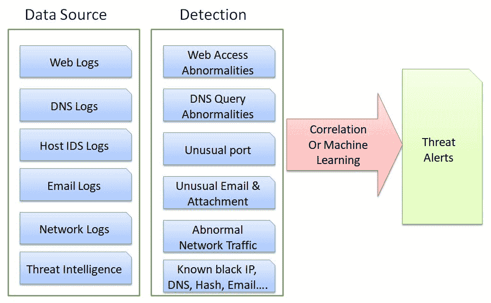
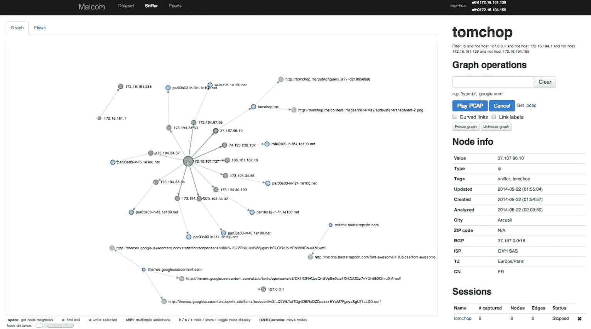
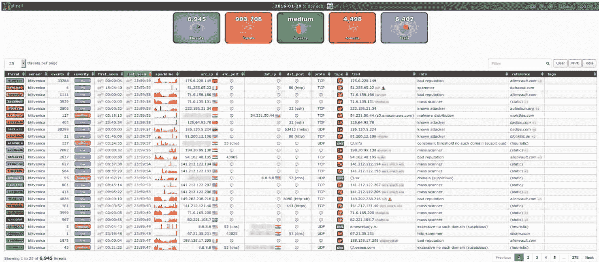
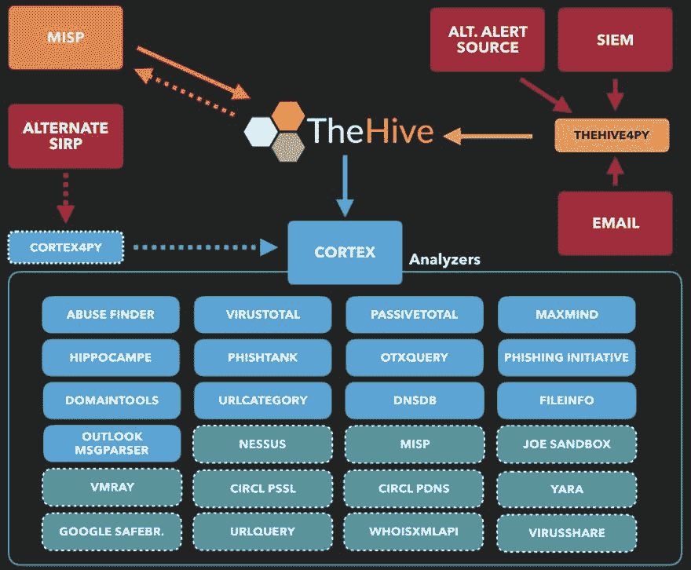
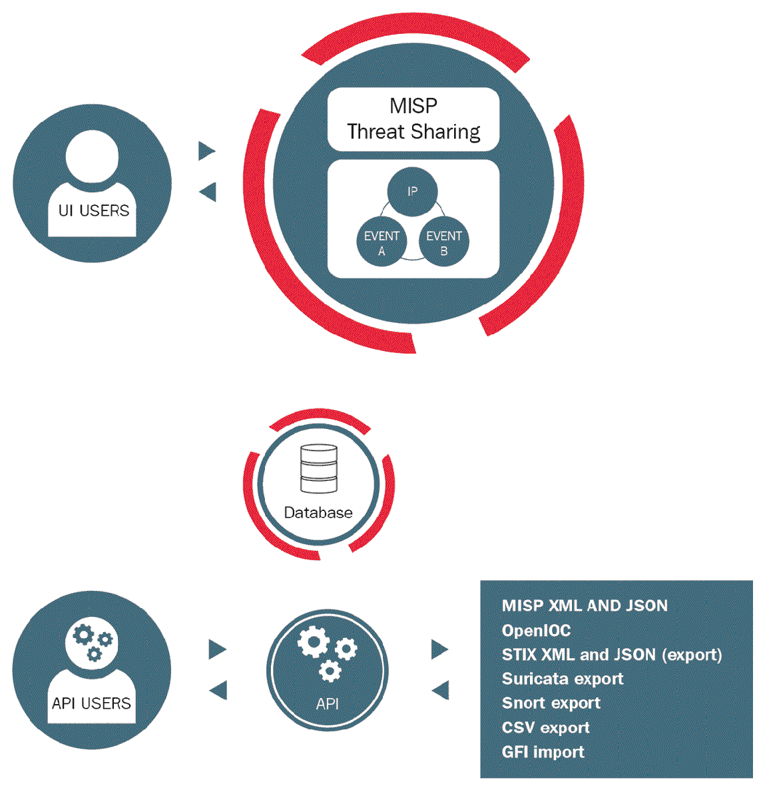
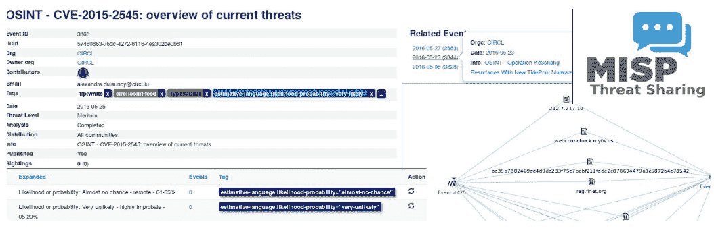
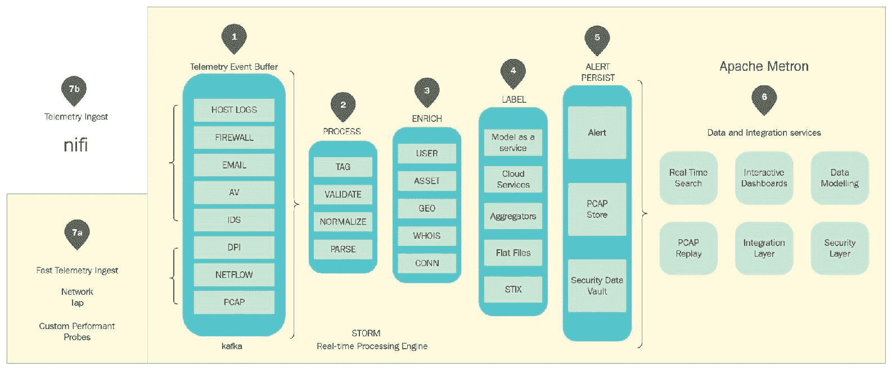

# 第十七章：威胁检查与情报

在上一章中，我们讨论了每次发布的安全评估。在本章中，我们将介绍威胁检查与情报。本章的重点是如何通过各种日志关联来识别和防范已知和未知的安全威胁，如后门和注入攻击。我们将介绍所需的日志、如何连接这些日志以及攻击的潜在症状。还将介绍一些开源的威胁检测技术。最后，我们将介绍如何构建自己的内部威胁情报系统。

本章将涵盖以下主题：

+   未知威胁检测

+   受损指标

+   使用大数据框架进行安全分析

# 未知威胁检测

威胁态势处于不断变化的状态，随着新兴的、复杂的技术不断出现。与应对动态威胁态势相关的安全防护投资也在不断增加。安全防护正在从已知威胁检测转向早期防范未知威胁。大数据框架、机器学习和威胁情报是帮助实现未知威胁检测的技术。异常事件的关联分析是检测潜在未知威胁的关键。

以下图表展示了不同数据源之间关联或机器学习的概念：

网络流量分析的目标是识别异常的内部主机流量通信。网络流量分析面临的挑战是数据量可能非常庞大。此外，为了能够识别异常，网络管理员需要进行网络流量分析，例如定义网络通信白名单或网络流量基准线。尽管大数据和机器学习在分析方面可能有所帮助，但仍然需要 IT 网络管理员定义正常和异常网络流量的分类规则。

以下是一些典型的异常网络流量示例：

| **异常网络流量** | **潜在威胁** |
| --- | --- |
| 端口/主机扫描 | 端口或主机扫描行为意味着某个主机可能已被恶意软件感染，且恶意软件正在寻找网络上的漏洞、其他服务或主机。 |
| 从同一主机发出的大量 DNS 请求 | 这是 **命令与控制**（**C&C**）恶意软件的一个症状，通过 DNS 协议建立受感染主机与 C&C 服务器之间的通信。 |
| 从同一主机发出的大量 HTTP 请求 | 这是 C&C 的一个症状，通过 HTTP 协议建立受感染主机与 C&C 服务器之间的通信。 |
| 每天在相同时间段内，周期性地发出相同大小的请求 | 这是 C&C 恶意软件的症状，表明受感染主机与 C&C 服务器之间建立了通信。 |
| 向外部网站或 DNS 发送流量，这些网站或 DNS 被威胁情报源列为已知威胁 | 用户可能通过社交工程被欺骗连接到外部已知威胁网站，或者 C&C 连接成功建立。 |

为了可视化网络威胁状态，推荐两种开源工具：Malcom 和 Maltrail（恶意流量检测系统）。Malcom 可以展示主机通信关系图，帮助我们了解是否有任何内部主机连接到外部可疑的 C&C 服务器或已知的恶意网站。

来源: [`github.com/tomchop/malcom#what-is-malcom`](https://github.com/tomchop/malcom#what-is-malcom)

另一种是恶意流量检测系统（Maltrail），它将外部威胁情报源进行关联，以识别已知恶意域名、可疑 URL、IP 或用户代理头：

来源: [`github.com/stamparm/maltrail`](https://github.com/stamparm/maltrail)

# 妥协指标

对主机进行可疑行为分析也是一项重大挑战，因为日志的可用性问题。例如，动态运行时信息可能未记录在文件中，用于放置可疑文件的原始进程也可能未被记录。因此，建议始终安装主机 IDS/IPS，如 OSSEC（开源 HIDS 安全）或主机杀毒软件，作为抵御恶意软件的第一道防线。一旦安装了主机 IDS/IPS 或杀毒软件，威胁情报和大数据分析可以作为补充，帮助我们了解整体主机的安全态势，以及现有主机环境中的已知**妥协指标**（**IoCs**）。

根据严重程度，以下是可能表明主机已被攻破的关键行为：

| **异常主机行为** | **潜在威胁** |
| --- | --- |
| 多个受损主机向外部主机的数据通信 | 受损主机正向外部 C&C 服务器发送数据。 |
| 主机连接到外部已知 APT IP 地址或 URL，并/或下载已知恶意文件 | 主机显示出来自 APT 或恶意软件攻击的妥协迹象。 |
| 多次失败的登录尝试 | 内部受损的主机正试图登录以访问关键信息。 |
| 包含危险 URL 或恶意文件的电子邮件 | 攻击者可能使用社交工程技术通过电子邮件进行针对性攻击。将发送邮件的发件人加入观察列表。 |
| 进程/服务/程序启动时出现罕见和异常文件名 | 恶意软件会安装自己以确保即使重启后仍能继续运行。恶意软件实现持久性的一种常见方式如下：对于 Windows 系统，建议使用**AutoRuns**检查主机是否被可疑恶意软件感染。[`docs.microsoft.com/en-us/sysinternals/downloads/autoruns`](https://docs.microsoft.com/en-us/sysinternals/downloads/autoruns) |

| 异常事件和审计日志警报 | 以下系统事件或审计日志可能需要进一步分析：

+   账户锁定

+   用户被添加到特权组

+   用户账户登录失败

+   应用程序错误

+   Windows 错误报告

+   蓝屏死机（BSOD）

+   事件日志已被清除

+   审计日志已被清除

+   防火墙规则更改

|

网页访问分析同样至关重要，因为大多数互联网连接都是基于 HTTP 协议的。网页访问主要有两种情况。一种是内部主机连接外部网站，另一种是内部或外部主机连接托管的 Web 服务。下表列出了网页访问分析的一些常见技术和工具：

| **网页访问分析** | **检测技术** |
| --- | --- |

| 外部来源客户端 IP | IP 地址来源分析有助于识别以下内容：

+   已知的恶意 IP 或 TOR 出口节点

+   异常地理位置变动

+   来自不同地理位置的并发连接

MaxMind GeoIP2 数据库可以用于将 IP 地址转换为地理位置：[`dev.maxmind.com/geoip/geoip2/geolite2/#Downloads`](https://dev.maxmind.com/geoip/geoip2/geolite2/#Downloads) |

| 客户端指纹（操作系统、浏览器、用户代理、设备等） | 客户端指纹可以用来识别是否存在异常客户端或非浏览器连接。开源的 ClientJS 是一个纯 JavaScript 工具，可以用来收集客户端指纹信息。Salesforce 提供的 JA3 通过 SSL/TLS 连接分析来识别恶意客户端。**ClientJS**: [`clientjs.org/`](https://clientjs.org/) **JA3**: [`github.com/salesforce/ja3`](https://github.com/salesforce/ja3) |
| --- | --- |
| 网站声誉 | 当存在外部网站的出站连接时，我们可能会检查该目标网站的威胁声誉。这可以通过 Web 应用防火墙或 Web 网关安全解决方案来完成。[`www.virustotal.com/`](https://www.virustotal.com/) |
| **域名生成算法**（**DGAs**）生成的随机域名 | C&C 服务器的域名可以通过 DGAs 生成。DGA 域名的主要特征包括高熵、高辅音数量和域名长度较长。根据这些指标，我们可以分析该域名是否由 DGAs 生成，并可能是一个潜在的 C&C 服务器。**DGA 检测器**：[`github.com/exp0se/dga_detector/`](https://github.com/exp0se/dga_detector/)此外，为了减少误报，我们还可以使用 Alexa 的前百万个网站作为网站白名单。参见[`s3.amazonaws.com/alexa-static/top-1m.csv.zip`](https://s3.amazonaws.com/alexa-static/top-1m.csv.zip) |
| 可疑文件下载 | Cuckoo 沙箱可疑文件分析：[`cuckoosandbox.org/`](https://cuckoosandbox.org/) |

| DNS 查询 | 在 DNS 查询分析中，以下是一些妥协的关键指标：

+   向未经授权的 DNS 服务器发送 DNS 查询。

+   不匹配的 DNS 响应可能是 DNS 欺骗的一个指标。

+   客户端连接到多个 DNS 服务器。

+   超过 150 字符的长 DNS 查询，是 DNS 隧道的一个指标。

+   高熵的域名。这是 DNS 隧道或 C&C 服务器的一个指标。

|

# 使用大数据框架进行安全分析

在讨论了一些常见的未知潜在威胁检测技术之后，我们将介绍一些开源框架，用于结合威胁情报和大数据技术进行安全分析。如果你打算建立一个能够执行以下操作的安全日志分析框架，可以考虑将这些开源解决方案作为基础：

+   机器学习和与 IoCs 的关联

+   涉及外部威胁情报数据源的分析

+   数据增强，如 GeoIP 信息

+   可视化和查询 IoCs 之间的关系

| **项目** | **主要特征** |
| --- | --- |
| TheHive 项目 | TheHive 提供威胁事件响应案例管理，允许安全分析员标记 IOCs。Cortex 可以使用诸如 VirtusTotal、MaxMind 和 DomainTools 等威胁情报服务进行分析。支持超过 80 个威胁情报服务。Hippocampe 通过 REST API 或 Web UI 提供查询接口：[`thehive-project.org/`](https://thehive-project.org/) |
| MISP | 这主要是一个用于共享 IoCs 和恶意软件指标的威胁情报平台。其关联引擎帮助识别恶意软件属性和指标之间的关系：[`www.misp-project.org/`](https://www.misp-project.org/documentation/)MISP 提供超过 40 个威胁情报数据源。参见[`www.misp-project.org/feeds/.`](https://www.misp-project.org/feeds/) |

| Apache Metron | Apache Metron 是一个 SIEM（威胁情报、安全数据解析器、警报和仪表板），同时也是基于 Hadoop 大数据框架的安全分析（异常检测和机器学习）框架：[`metron.apache.org/`](https://metron.apache.org/)。构建大数据框架时常用的技术组件包括以下内容：

+   Apache Flume

+   Apache Kafka

+   Apache Storm 或 Spark

+   Apache Hadoop

+   Apache Hive

+   Apache Hbase

+   Elasticsearch

+   MySQL

|

这些开源解决方案可以彼此协同工作。例如，TheHive 可以作为安全运营中心，管理包含 IoC 信息的安全事件案例，并将 TheHive 与 MISP 集成，以查询外部威胁情报源。此外，Metron 可以利用机器学习对日志数据进行丰富和分析，以识别异常情况。

此外，还有一些基于**Elasticsearch、Logstash、Kibana**（**ELK**）的开源分析框架。请参考以下列表：

+   **响应操作收集工具包（ROCK）** **NSM**：[`rocknsm.io/`](http://rocknsm.io/)

+   **具有先进分析能力的狩猎 Elasticsearch、Logstash、Kibana（ELK）**：[`github.com/Cyb3rWard0g/HELK`](https://github.com/Cyb3rWard0g/HELK)

+   **网络安全分析平台与检查系统（CAPES）**：[`capesstack.io/`](http://capesstack.io/)

# TheHive

TheHive 是一个安全事件响应平台，集成了**恶意软件信息共享平台**（**MISP**）。Cortex 可以通过外部威胁分析服务，如 VirusTotal、DomainTools 和 MaxMind，帮助分析可观察数据。Hippocampe 提供 REST API 或 Web UI，帮助用户执行分析报告并进行查询。

以下图表展示了 TheHive、Cortex、SIEM 以及 MISP 之间的协作：

# MISP – 开源威胁情报平台

MISP 是一个威胁情报平台，可以与威胁属性、IOC 和指标进行关联。MISP 还可以基于观察到的 IOCs 生成 Snort/Suricata IDS 规则、STIX 和 OpenIOC 检测规则。

以下图表引用了 MISP（恶意软件信息共享平台）：

以下图表展示了在 MISP 中识别的威胁及其威胁关系图。

来源：http://www.misp-project.org/features.html

除了 MISP，你还可以参考开源的**你的日常威胁情报**（**YETI**）平台解决方案，它也提供了类似的威胁情报平台。请参考[`yeti-platform.github.io/.`](https://yeti-platform.github.io/)

# Apache Metron

Apache Metron 是一个网络安全应用框架，可以执行大数据分析以识别异常。该框架提供以下关键特性：

+   对数据源进行处理、丰富和标注，以用于安全分析、搜索和查询。

+   使用机器学习算法进行异常检测

+   类似 SIEM 的功能（警报、威胁情报框架、数据源采集代理）

+   一个可插拔的框架，支持各种数据源，并可以为新数据源添加解析器

请参阅以下 Apache Metron 图示：

# 总结

在这一章中，我们讨论了涉及识别网络流量和主机行为异常的未知威胁检测技术。为了识别和可视化网络流量中的潜在威胁，我们介绍了两个开源工具——Malcom 和 Maltrail。Malcom 帮助绘制连接关系图，并能识别潜在的 C&C 服务器连接。

关于主机行为，我们解释了 IOCs，并讨论了一些潜在威胁的异常主机行为。我们还讨论了网页访问日志分析的不同方面，包括外部来源的客户端 IP、客户端指纹、网站信誉、DGA 和 DNS 查询。

我们还为希望建立内部安全分析大数据框架的组织建议了一些开源框架。TheHive 和 MISP 可以协作进行威胁分析。Apache Metron 提供基于 Hadoop 大数据框架的安全分析。

在下一章中，我们将讨论商业欺诈和服务滥用。

# 问题

1.  检测同一主机发送大量外向 DNS 请求的目的是什么？

    1.  这是勒索软件的一个指示器

    1.  这是一种端口扫描行为

    1.  这是 C&C 连接的一个指示器

    1.  这是一种正常行为

1.  IOC 代表什么？

    1.  妥协指示器

    1.  妥协信息

    1.  计算机检查

    1.  计算机注入

1.  以下哪些可以是事件日志中潜在攻击的指示器？

    1.  蓝屏死机（BSOD）

    1.  事件日志已被清除

    1.  一个失败的用户账户登录

    1.  上述所有

1.  为了进行网页日志分析，为什么我们要分析外部源客户端 IP？

    1.  用于识别是否为已知恶意 IP 或 TOR 退出节点

    1.  用于识别是否在短时间内存在异常的地理位置变化

    1.  用于识别来自不同地理位置的并发连接

    1.  上述所有

1.  DGA 代表什么？

    1.  域名生成算法

    1.  数据生成算法

    1.  非正规化生成算法

    1.  重复生成算法

1.  为什么我们能够检测到由 DGA 生成的域名？

    1.  这是一种下载恶意软件

    1.  这是 C&C 服务器的一个指示器

    1.  这是勒索软件的一个指示器

    1.  这是暴力破解攻击的一个指示器

# 深入阅读

+   **Windows 安全日志事件**：[`www.ultimatewindowssecurity.com/securitylog/encyclopedia/default.aspx`](https://www.ultimatewindowssecurity.com/securitylog/encyclopedia/default.aspx)

+   **SANS 检测 DNS 隧道**：[`www.sans.org/readning-room/whitepapers/dns/detecting-dns-tunneling-34152`](https://www.sans.org/readning-room/whitepapers/dns/detecting-dns-tunneling-34152)

+   **SANS – 一种实用的大数据杀链框架**: [`www.sans.org/reading-room/whitepapers/warfare/practical-big-data-kill-chain-framework-35487`](https://www.sans.org/reading-room/whitepapers/warfare/practical-big-data-kill-chain-framework-35487)

+   **你日常的威胁情报**: [`yeti-platform.github.io/`](https://yeti-platform.github.io/)

+   **恶意软件信息共享平台 (MISP)**: [`www.circl.lu/doc/misp/`](https://www.circl.lu/doc/misp/)

+   **MISP GDPR 合规性**: [`www.misp-project.org/compliance/gdpr/information_sharing_and_cooperation_gdpr.html`](http://www.misp-project.org/compliance/gdpr/information_sharing_and_cooperation_gdpr.html)

+   **Apache Metron 架构**: [`cwiki.apache.org/confluence/display/METRON/Metron+Architecture`](https://cwiki.apache.org/confluence/display/METRON/Metron+Architecture)

+   **网络威胁情报和信息共享**: [`www.nist.gov/publications/cyber-threat-intelligence-and-information-sharing`](https://www.nist.gov/publications/cyber-threat-intelligence-and-information-sharing)

+   **网络威胁信息共享指南**: [`nvlpubs.nist.gov/nistpubs/specialpublications/nist.sp.800-150.pdf`](https://nvlpubs.nist.gov/nistpubs/specialpublications/nist.sp.800-150.pdf)

+   **威胁情报：它是什么，以及如何有效地使用它**: [`www.sans.org/reading-room/whitepapers/analyst/threat-intelligence-is-effectively-37282`](https://www.sans.org/reading-room/whitepapers/analyst/threat-intelligence-is-effectively-37282)

+   **NIST SP 800-92 计算机安全日志管理指南**: [`csrc.nist.gov/publications/detail/sp/800-92/final`](https://csrc.nist.gov/publications/detail/sp/800-92/final)

+   **SANS 2018 网络威胁情报调查**: [`www.sans.org/reading-room/whitepapers/threats/cti-security-operations-2018-cyber-threat-intelligence-survey-38285`](https://www.sans.org/reading-room/whitepapers/threats/cti-security-operations-2018-cyber-threat-intelligence-survey-38285)

+   **ROCK (响应操作收集工具包) NSM**: [`rocknsm.io/`](http://rocknsm.io/)

+   **具有高级分析能力的 Hunting Elasticsearch、Logstash、Kibana (ELK)**: [`github.com/Cyb3rWard0g/HELK`](https://github.com/Cyb3rWard0g/HELK)

+   **网络分析平台和检查系统 (CAPES)**: [`capesstack.io/`](http://capesstack.io/)
