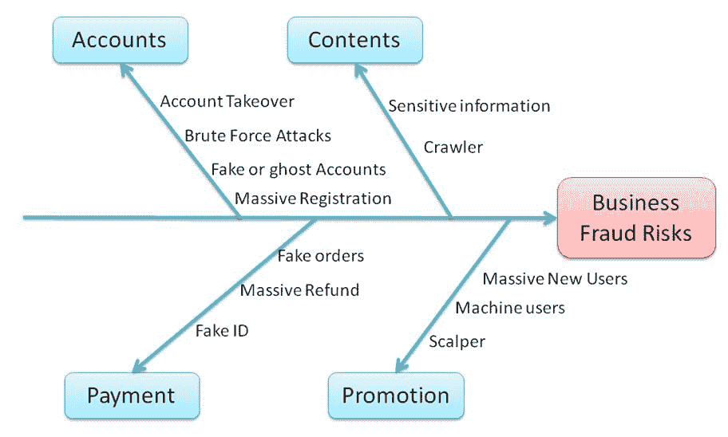
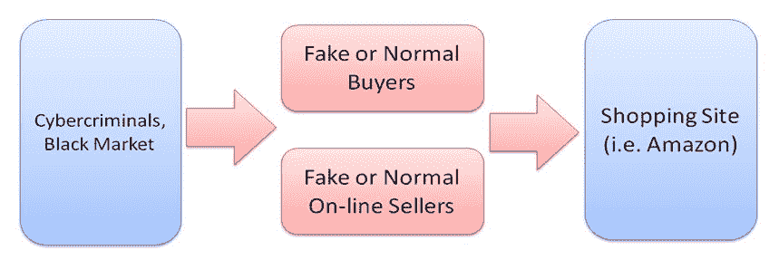
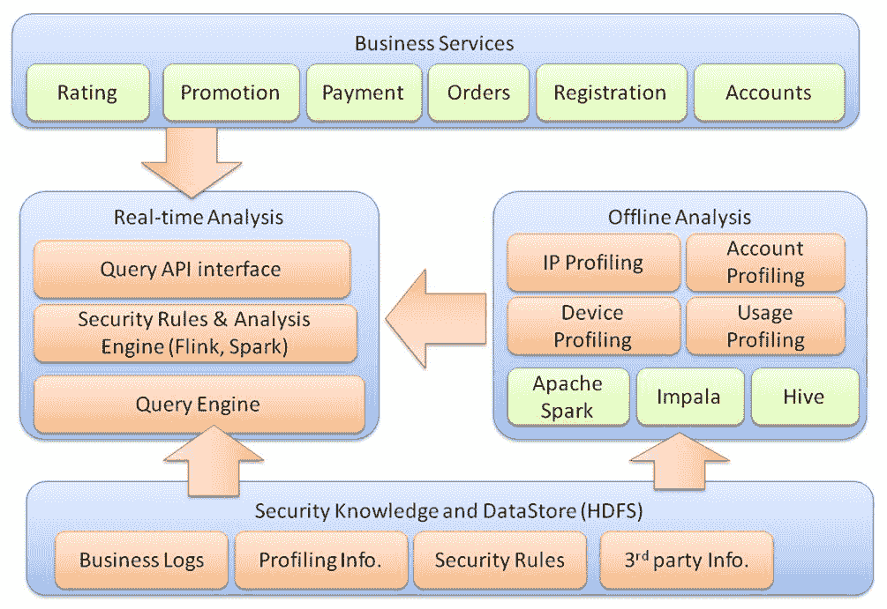

# 商业欺诈和服务滥用

上一章讨论了威胁检查和情报。在本章中，我们将探讨商业欺诈和服务滥用。云服务带来了新的安全风险，例如交易欺诈、账户滥用和促销代码滥用。这些在线欺诈和滥用可能导致财务损失或收益，这取决于你站在哪一方。

因此，本章的目标是提供如何检测这些行为的指南和规则。我们还将讨论构建服务滥用预防或在线欺诈检测系统所需的典型技术框架和技术方法。

在本章中，我们将涵盖以下主题：

+   商业欺诈和滥用场景

+   商业风险检测框架

+   PCI DSS 合规性

# 商业欺诈和滥用

我们已经讨论了许多与防御或检测恶意活动相关的安全技术。另一方面，在线黑市也在寻找不同的机会，从而利用毫无防备的用户和电子商务网站服务牟取利益。这些网络犯罪活动正在利用商业交易的漏洞，借此获取经济利益。

以下是一些与在线黑市相关的常见活动：

| **商业场景** | **网络犯罪活动** |
| --- | --- |

| 为了促进新用户注册，电子商务网站可能会提供$10 的优惠券或某些折扣 | **账户作弊**：

+   网络犯罪分子可能注册大量账户以获得优惠券和折扣，然后将这些优惠券转售。

|

| 购物网站可能会出售数量有限的特版商品 | **黄牛**：

+   网络犯罪分子可能注册大量账户购买商品，并以更高价格转售

|

| 购物搜索查询结果按照在线卖家的评分和销量排序 | **非真实订单**：

+   在线卖家可能与网络犯罪分子达成协议，操控大量非真实订单和评分，以便在查询结果的排名中位列前茅

|

| 购物网站账户通常通过电子邮件、电话号码和身份证注册 | **账户接管**：

+   网络犯罪分子冒充真实用户，获取账户控制权并进行未经授权的交易

+   此外，网络犯罪分子可能会对账户进行暴力破解攻击，并使用不同的电子邮件地址或电话号码重新注册，从而获得经济利益

|

以下图表概述了在账户、内容、支付和促销方面的商业欺诈风险：

你可能会想，限时出售限量版商品是否一件好事。毕竟，它吸引了公众的注意，而且并不违法。然而，**黄牛党**行为同样适用于在线商务交易。在线**黄牛党**行为可能在法律眼中占据灰色地带，但它确实破坏了商业的初衷。最终，随着这种行为的大规模蔓延，所有在线业务都会受到影响。

# 商业风险检测框架

构建商业风险框架的关键目标是识别交易是否真实，这意味着正常的用户或卖家遵循正常的商业规则，以便在电子商务平台上进行交易。另一方面，商业风险框架能够检测交易、账户或卖家是否可疑，是否受到网络犯罪分子的控制。网络犯罪分子与购物网站之间的关键关系如下图所示：

商业欺诈和滥用检测框架需要与在线业务紧密集成；特别是，安全政策必须理解商业物流规则。此外，框架必须能够检索关键的商业活动日志，包括登录、注册、用户行为、密码重置、支付和购买操作。

并非所有在线业务功能都需要实时欺诈检测。用户账户注册、促销、订单、支付和商业交易是需要风险管理的关键功能。当这些在线服务接收到来自客户的请求时，商业服务将查询实时欺诈检测服务，以决定是否继续交易。实时欺诈检测服务根据预定义的安全规则、离线分析以及其他支持信息来决定商业风险。

离线分析的关键目标是构建用户行为分析档案，帮助识别客户是否为正常用户，还是由网络犯罪分子控制的用户。为了识别客户是否为网络犯罪分子，必须获取多项信息。

假设我们有一个场景：一个用户通过**Jimmy**账户登录。我们如何识别这个人是否真的就是 Jimmy，还是有人盗用了 Jimmy 的账户？

为了回答这个问题，我们将研究 IP、账户、设备和使用情况的分析。分析的查询结果如下表所示。

案例 1 代表了正常用户行为，因为它说明了 Jimmy 在同一城市使用一台设备进行了 20 次登录。

然而，案例 2 绝对需要进一步调查，因为高度怀疑背后是网络犯罪分子。此案例表明，Jimmy 在 10 个不同的城市使用 10 台不同的设备进行了 20 次登录：

| **案例** | **账户** | **登录操作次数** | **设备概况** | **GeoIP** |
| --- | --- | --- | --- | --- |
| 1 | 吉米 | 20 | 1 | 同一城市 |
| 2 | 吉米 | 10 | 10 | 10 个不同的城市 |

典型的商业欺诈检测框架如下图所示：

| **概况** | **描述** |
| --- | --- |

| IP 概况 | IP 概况旨在识别账户和设备的 IP 行为。IP 概况包括以下属性：

+   地理位置

+   VPN、代理、网关或 TOR（这些 IP 地址将要求用户进行进一步验证）

+   已知的黑名单 IP 地址

|

| 设备指纹 | 设备指纹是与远程客户端设备或浏览器相关的信息，目的是进行身份识别。我们使用设备指纹来判断远程连接的设备是否是用户/账户通常使用的设备。例如，同一个账户每天用不同的手机登录电子商务服务，显然是异常的表现。以下是一些常见的设备指纹：

+   机器类型、CPU、虚拟化

+   操作系统版本、软件插件、字体

+   同一设备指纹的并发连接

+   同一天同一设备的地理位置

+   同一设备指纹被多个不同账户使用

+   同一用户账户使用的多个不同设备指纹

|

| 机器与人类行为 | 行为分析的目标是识别请求源是否被恶意程序操控或是真实的人类：

+   键盘使用情况

+   鼠标移动

+   用户代理；HTTPS 指纹

|

| 账户概况 | 以下属性与账户相关。如果其中一个属性（如电子邮件地址）被识别为可疑，那么与该电子邮件相关的所有其他账户也很可能是可疑的。因此，我们将基于以下信息构建一个可疑监控列表：

+   电子邮件地址

+   收货地址

+   银行账户号码

+   电话号码

+   社交网络好友

+   支付

|

| 使用概况 | 基于历史使用情况，我们还可以识别是否为正常用户，或者只是一个试图滥用服务或商业推广代码的临时用户：

+   页面访问历史

+   与卖家的历史通讯

+   购买历史和习惯

|

构建概况的目的是根据历史使用或统计数据建立正常和常见行为的基础。概况的离线分析可以包括 IP 概况、设备指纹、机器行为、账户和使用情况。利用这些用户概况数据，我们将能够判断一个用户是否被黑客攻击或可能被网络犯罪分子操控。

此外，我们还可以分析页面访问行为，以识别是否为机器买家或真实人类买家。只需注意，网络犯罪分子也在尝试让机器行为更接近人类行为，以避开这些检测规则。这些行为可能是一个指标参考，但不能作为判断是否为机器买家的唯一证据。以下是正常用户和机器用户之间的一些关键差异：

| **正常人类买家** | **机器买家** |
| --- | --- |
| 通过关键词搜索查找产品 | 无搜索行为，直接定位到特定产品页面，跳过首页 |
| 查找相似产品进行某种比较 | 只关注促销中的特定产品 |
| 每个产品的浏览时间可能超过 20 秒 | 少于三秒 |
| 真实用户可能与卖家有过沟通历史 | 机器买家账户没有沟通历史 |
| 真实用户可能有购买过的产品的评分反馈历史 | 无评分反馈历史 |

截至写作时（2018 年），仍然没有一个完整的开源框架来整体检测欺诈风险，尽管已有用于执行设备指纹和威胁情报服务来识别黑名单 IP 的模块。建立一个完整的欺诈风险管理框架对于小型或中型企业来说可能是一个挑战。

以下是一些可考虑的缓解和安全措施：

| **欺诈缓解** | **描述** |
| --- | --- |
| PCI 合规性 | 在线零售商的最低要求是符合 PCI 标准。确保相关第三方供应商和支付网关符合 PCI 标准。 |

| 定义阈值 | 这是减少欺诈风险中最容易实施的措施。常见的限制使用的阈值包括以下几种：

+   登录失败次数超过一定次数后账户锁定一段时间

+   限制每个设备/账户的优惠券使用次数

+   限制每个设备/账户/日的交易次数

正确定义阈值将需要从历史数据中获取一些统计信息。 |

| 双因素重新认证 | 要求用户对关键操作如支付进行重新认证。 |
| --- | --- |
| CAPTCHA | 使用 CAPTCHA 来区分人类和机器人软件程序。 |
| 电话认证 | 向手机号码发送认证代码以完成购买操作。这也是双因素认证的第一步，因为它证明用户拥有该手机。 |

| GeoIP 或 IP 声誉 | 查找客户源 IP 地址的地理位置，因为 IP 地址可能很难伪造。检查以下内容：

+   IP 地址是否在黑名单中

+   GeoIP 是否出现在全球异常位置

|

# PCI DSS 合规性

PCI **数据安全标准**（**DSS**）被视为必须遵守的标准，是处理信用卡信息或在线支付操作的组织的最低安全要求。共有 12 项安全要求，此外还包括针对共享托管提供商和 TLS 的两个额外要求：

+   **要求 1**：安装并维护防火墙配置，以保护持卡人数据

+   **要求 2**：不要使用供应商提供的默认系统密码和其他安全参数

+   **要求 3**：保护存储的持卡人数据

+   **要求 4**：加密跨开放公共网络传输的持卡人数据

+   **要求 5**：使用并定期更新防病毒软件或程序

+   **要求 6**：开发并维护安全的系统和应用程序

+   **要求 7**：根据需要了解的原则，限制企业对持卡人数据的访问

+   **要求 8**：为每个有计算机访问权限的人分配唯一的 ID

+   **要求 9**：限制对持卡人数据的物理访问

+   **要求 10**：跟踪并监控所有对网络资源和持卡人数据的访问

+   **要求 11**：定期测试安全系统和流程

+   **要求 12**：制定一项针对所有人员的信息安全政策

+   **附录 A1**：针对共享托管提供商的附加 PCI DSS 要求

+   **附录 A2**：针对使用 SSL/早期 TLS 的实体的附加 PCI DSS 要求

在实施 PCI DSS 合规性时，PCI DSS 建议采用**优先级方法**，并为 12 个安全要求及其子要求设定了六个里程碑。以下是六个里程碑的关键概念：

1.  如果不需要，避免存储敏感信息

1.  保护系统和网络，并准备好响应系统漏洞

1.  安全支付卡应用程序

1.  监控并控制对系统的访问

1.  保护存储的持卡人数据

1.  完成剩余的合规性工作，确保所有控制措施到位

以下是关键类别的映射；请参阅参考资料以了解每个里程碑中的详细子要求：

|  | **PCI DSS 安全要求** |
| --- | --- |
| 如果不需要，避免存储敏感信息 |

+   **要求 1**：安装并维护防火墙配置，以保护持卡人数据

+   **要求 3**：保护存储的持卡人数据

+   **要求 9**：限制对持卡人数据的物理访问

+   **要求 12**：制定一项针对所有人员的信息安全政策

|

| 保护系统和网络，并准备好响应系统漏洞 |
| --- |

+   **要求 1**：安装并维护防火墙配置，以保护持卡人数据

+   **要求 2**：不要使用供应商提供的默认系统密码和其他安全参数

+   **要求 4**：加密跨开放公共网络传输的持卡人数据

+   **要求 5**：使用并定期更新防病毒软件或程序

+   **要求 8**：为每个有计算机访问权限的人分配唯一的 ID

+   **要求 9**：限制对持卡人数据的物理访问

+   **要求 11**：定期测试安全系统和流程

+   **要求 12**：维护一个涉及所有人员信息安全的政策

|

| 安全支付卡应用 |
| --- |

+   **要求 2**：不要使用供应商提供的默认系统密码和其他安全参数

+   **要求 6**：开发和维护安全的系统和应用程序

|

| 监控并控制对您系统的访问 |
| --- |

+   **要求 7**：根据需要访问原则限制企业对持卡人数据的访问

+   **要求 8**：为每个有计算机访问权限的人分配唯一的 ID

+   **要求 10**：跟踪和监控所有对网络资源和持卡人数据的访问

+   **要求 11**：定期测试安全系统和流程

|

| 保护存储的持卡人数据 |
| --- |

+   **要求 3**：保护存储的持卡人数据

+   **要求 9**：限制对持卡人数据的物理访问

|

| 完成剩余的合规工作，并确保所有控制措施到位 |
| --- |

+   **要求 1**：安装并维护防火墙配置，以保护持卡人数据

+   **要求 6**：开发和维护安全的系统和应用程序

+   **要求 12**：维护一个涉及所有人员信息安全的政策

|

PCI DSS 优先级方法参考源：

+   [`www.pcisecuritystandards.org/documents/Prioritized_Approach_v3.xlsx`](https://www.pcisecuritystandards.org/documents/Prioritized_Approach_v3.xlsx)

+   [`www.pcisecuritystandards.org/documents/Prioritized-Approach-for-PCI_DSS-v3_2.pdf`](https://www.pcisecuritystandards.org/documents/Prioritized-Approach-for-PCI_DSS-v3_2.pdf)

# 总结

在本章中，我们讨论了一些典型的商业欺诈和滥用案例，包括账户作弊、在线倒卖、非真实订单和账户接管。商业欺诈风险的主要类别包括账户、内容、支付和推广。

我们建议了一些检测规则和典型框架，用于构建自己的业务风险检测服务。为了识别正常和异常的用户行为，我们需要构建一个用户档案。档案构建的方面包括 IP 档案、设备指纹、机器行为、账户和使用情况。

除了检测，我们还探讨了一些缓解措施，例如 PCI 合规性、阈值、二次验证（2FA）、验证码（CAPTCHA）、GeoIP 和 IP 声誉。最后，但绝不是最不重要的，列出了 PCI DSS 合规性的优先方法。PCI DSS 合规性被视为任何信用卡数据处理或电子商务服务的最低安全要求。

在下一章中，我们将重点讨论隐私和 GDPR 合规案例的安全要求。

# 问题

1.  什么是账户接管？

    1.  在线卖家可能与网络犯罪分子达成协议，操控大量非真实订单

    1.  计算机犯罪者冒充真实用户，获取账户控制权，进行未经授权的交易

    1.  网络犯罪分子可能注册大量账户以购买商品

    1.  网络犯罪分子可能注册大量账户以获取优惠券和折扣

1.  账户可能与哪些商业风险和欺诈相关？

    1.  账户接管

    1.  暴力破解攻击

    1.  大规模注册

    1.  以上所有

1.  以下哪个与促销滥用无关？

    1.  大量新用户

    1.  机器用户

    1.  爬虫

    1.  黄牛党

1.  在进行潜在商业滥用风险检测时，分析的关键特征是什么？

    1.  IP

    1.  账户使用情况

    1.  设备指纹

    1.  以上所有

1.  以下哪个不包含在 IP 分析中？

    1.  地理位置

    1.  CPU 类型

    1.  已知的黑名单 IP 地址

    1.  TOR 出口节点

1.  以下哪个可以用于设备指纹识别？

    1.  CPU 类型

    1.  操作系统版本

    1.  软件插件

    1.  以上所有

1.  识别机器行为的关键特征是什么？

    1.  跳过登录页面

    1.  每个产品的浏览时间非常短

    1.  没有通信历史

    1.  以上所有

# 进一步阅读

+   **报告与互联网相关的犯罪**: [`www.justice.gov/criminal-ccips/reporting-computer-internet-related-or-intellectual-property-crime`](https://www.justice.gov/criminal-ccips/reporting-computer-internet-related-or-intellectual-property-crime)

+   **欧洲网络犯罪中心**: [`www.europol.europa.eu/about-europol/european-cybercrime-centre-ec3`](https://www.europol.europa.eu/about-europol/european-cybercrime-centre-ec3)

+   **国际刑警**: [`www.interpol.int/Crime-areas/Cybercrime/Cybercrime`](https://www.interpol.int/Crime-areas/Cybercrime/Cybercrime)

+   **网络犯罪响应机构**: [`www.ccra.agency`](https://www.ccra.agency)

+   **TLS 指纹**: [`github.com/LeeBrotherston/tls-fingerprinting`](https://github.com/LeeBrotherston/tls-fingerprinting)

+   **Fingerprintjs2**: [`github.com/Valve/fingerprintjs2`](https://github.com/Valve/fingerprintjs2)

+   **JA3**: [`github.com/salesforce/ja3`](https://github.com/salesforce/ja3)

+   **所有网络犯罪 IP 数据源由 FireHOL 提供**: [`iplists.firehol.org/`](http://iplists.firehol.org/)

+   **PCI 安全性** **文档库**: [`www.pcisecuritystandards.org/document_library`](https://www.pcisecuritystandards.org/document_library)
