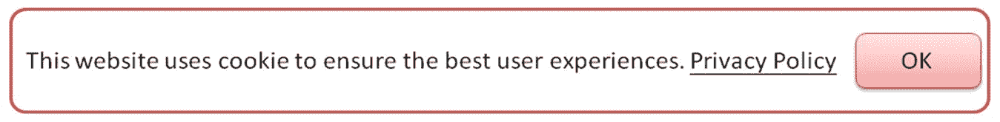

# GDPR 合规性案例研究

在前一章中，我们探讨了商业欺诈和服务滥用问题。在本章中，我们将深入讨论 GDPR 的案例研究。**通用数据保护条例**（**GDPR**）已设定了实施日期：2018 年 5 月 25 日。任何在此日期之前未遵守数据保护规则的组织，可能会面临重罚。本章将以 GDPR 合规性为案例，应用于软件开发。我们将讨论 GDPR 软件安全要求，并提出即将发布的版本中应包含的内容。我们还将探讨一些实际的案例研究，例如个人数据发现、数据匿名化、Cookie 同意、数据遮蔽实施以及网站隐私状态。

本章将涵盖以下主题：

+   GDPR 安全要求

+   案例研究

# GDPR 安全要求

GDPR 共有 11 章。为了将 GDPR 纳入产品开发考虑，第一至第四章与产品需求规划最为相关。下图展示了所有 GDPR 章节，其中括号中的数字表示该章节中的条款数量。

我们来看一下：

| **隐私权** | **详细描述** |
| --- | --- |

| 隐私通知（数据控制者）| 产品应提供隐私通知。隐私通知的内容应包括以下内容：

+   如何收集和使用个人数据

+   如何使用 Cookies

+   如何保护个人数据。

+   如何管理个人数据

+   如何保护儿童的个人数据

+   第三方服务

+   个人数据的国际传输

|

| 处理的合法性（全部） | 任何在用户未同意的情况下，后台收集个人数据的接口都是禁止的。例如，未获得用户同意上传故障排除日志，或在后台发送手机 IMEI。 |
| --- | --- |
| 数据最小化（全部） |

+   产品必须确保不收集与产品功能无关的数据。

+   数据遮蔽（匿名化或伪匿名化）必须应用于个人数据。伪匿名化允许重新识别，但匿名化则不能重新识别。

以下个人数据应考虑进行匿名化处理：

+   姓名（姓氏和名字）

+   邮政地址、电话号码

+   身份证件（信用卡号、社会安全号）

|

| 同意（数据控制者） |
| --- |

+   在数据收集之前，产品必须向数据主体提供同意或不同意的选项。

+   对于数据收集同意选项，禁止默认值为同意。

+   同意授权的操作必须被记录。

+   任何个人数据处理的进一步变化应获得另一个用户的同意。

|

| 反对数据处理的权利（数据控制者） |
| --- |

+   产品必须提供选项，让用户可以停止用于任何直接营销目的的数据处理。

+   产品必须提供选项，让用户可以随时删除自己的个人数据。

+   一旦用户决定从数据处理流程中移除，若相关个人数据仍然按法律要求保留，则个人数据的保留期限应可配置。

|

| 数据主体权利（更正、访问、知情） |
| --- |

+   产品应提供接口，允许用户添加、更新和删除自己的个人数据。

+   如果产品需要连接互联网，必须告知并获得用户同意。

+   任何软件更新或应用程序的安装也必须获得用户的同意。

+   用于改善用户体验的反馈信息也必须征得用户的同意。

+   在发送故障排除日志之前，必须征得用户的同意。

+   个人数据应采取适当的安全控制措施，如访问控制和加密。

|

| 数据可携带权 |
| --- |

+   产品必须提供数据导出功能。数据导出格式可以是机器可读的格式，如 XML、CSV 或 JSON。

|

| 数据传输 |
| --- |

+   数据通信应通过安全的通道进行。

+   如果个人数据需要传输给第三方，必须征得用户的同意。

+   未经用户同意，不得将数据传输到**欧洲经济区**（**EEA**）以外。

|

| 被遗忘权 |
| --- |

+   一旦数据处理的目标完成，相关数据应被删除或匿名化，尤其是临时数据。

+   一旦用户决定撤销用户账户，相关的个人数据也应该能够自动删除。

+   产品应提供数据删除机制。

|

根据这些隐私权，GDPR 对产品和服务的安全要求可以总结在以下表格中。我们一起来看看。

实际上，以下是产品设计中常见的一些问题。我们来看看这个表格：

| **常见的产品设计问题** | **GDPR 合规性预期行为** |
| --- | --- |
| 该产品在用户撤销账户后不会删除相关的个人数据。 | 提供数据删除机制 |
| 该产品没有提供用户导出个人数据的接口。 | 提供将数据导出为 CSV 或 XML 格式的机制 |
| 用户同意的默认值始终为同意。 | 用户同意页面不应默认选择“同意” |
| 用户无法选择停止进一步的用于营销目的的数据处理。 | 提供用户选择不参与营销分析的选项 |
| 上传包含个人信息的故障排除日志未进行匿名化处理，且没有获得用户同意。 | 征得用户同意，并对所有故障排除日志进行匿名化处理 |
| 该产品没有提供用户更新或编辑个人信息的接口。 | 提供用户编辑或更新个人信息的接口 |

此外，以下是推荐的 GDPR 自评估检查清单。在线评估报告还提供了改善数据保护和 GDPR 合规性的实际建议措施。请查看以下表格：

| **自评估检查清单类别** | **描述** |
| --- | --- |

| 控制者的数据保护自评估 | 这是一份在线自评估检查清单。评估结束时，将提供一份带有总体评分、指导意见和建议措施的报告。评估主要涵盖以下四个方面：

+   合法性、公平性和透明度

+   个人的权利

+   责任和治理

+   数据安全、国际转移和泄露

根据 GDPR 第 4 条，“控制者”是指单独或与他人共同确定处理个人数据的目的和方式的自然人或法人、公共机关、机构或其他组织；|

| 处理者的数据保护自评估 | 根据 GDPR 第 4 条，“处理者”是指代表控制者处理个人数据的自然人或法人、公共机关、机构或其他组织。该评估涵盖以下方面：

+   文档

+   责任和治理

+   个人权利

+   数据安全

对于 GDPR 合规性，数据处理者的安全要求可能低于数据控制者。

| 信息安全 | 信息安全评估包括以下内容：

+   管理和组织信息安全

+   员工和信息安全意识

+   物理安全

+   计算机和网络安全

+   个人数据泄露管理

|

| 直销 | 评估是检查用于直销活动（如电话、电子邮件、邮寄、传真）中的个人数据处理。 |
| --- | --- |

| 记录管理 | 记录管理检查清单包括以下四个主要领域：

+   管理和组织记录管理

+   记录创建和维护

+   跟踪和异地存储

+   记录访问

|

| 数据共享和主体访问 | 它评估以下领域的数据共享政策：

+   数据共享治理

+   数据共享记录

+   隐私信息

+   安全措施

+   个人数据处理请求

|

| GDPR 合规性检查清单 | GDPR 检查清单评估以下方面的一般安全要求：

+   你的数据

+   责任与管理

+   新的权利

+   同意

+   跟进

+   特殊情况

|

# 案例研究

在本节中，我们将讨论 GDPR 实施中的实际案例，并提供建议的解决方案或开源工具。这些案例涵盖数据发现、数据库匿名化、Cookie 同意、数据掩码和网站隐私等内容。这些都是与 GDPR 合规性直接相关的典型实际场景。

# 案例 1 – 个人数据发现

公司 A 已经运营了多个服务和数据库，并且有许多遗留的应用程序。数据库和 IT 管理员希望进行**个人身份信息**（**PII**）扫描，以全面了解所有个人数据的分布情况。在这种情况下，公司 A 需要一个**PII 发现工具**，该工具能够定义 PII 数据类型，并能够搜索各种类型的文件和数据库。请看这个图：

对于开源工具，推荐使用 RedataSense 数据发现工具，因为它支持多个数据库，并且可以通过字典和正则表达式识别个人数据。以下是敏感数据发现工具的参考来源：[`github.com/redglue/redsense`](https://github.com/redglue/redsense)。

此外，还建议定期搜索高度敏感和机密信息，如 API 密钥、加密密码、哈希值等。这些值的共同特征是高熵，尽管一些密码可能仍以明文配置，或使用没有加密的默认值。以下工具推荐定期使用，以扫描和识别秘密信息的存储。DumpsterDiver 是一个 Python 脚本，可以在本地文件中搜索秘密，而 TruffleHog 主要用于扫描 Git 仓库中的秘密。

要了解更多关于这些工具的信息，请访问以下网址：

+   DumpsterDiver：这是一个 Python 脚本，可以在本地文件中搜索秘密，具体内容可以在这里找到：[`github.com/securing/DumpsterDiver`](https://github.com/securing/DumpsterDiver)

+   TruffleHog：它扫描 Git 仓库中的秘密，具体内容可以在这里找到：[`github.com/dxa4481/truffleHog`](https://github.com/dxa4481/truffleHog)

# 案例 2 - 数据库匿名化

在开发和测试过程中，禁止开发团队访问生产数据库进行任何测试或评估，因为这样可能会导致意外泄露和侵犯隐私的风险。然而，另一方面，生产数据对于开发团队的性能、安全性和开发评估可能是有帮助的。因此，开发一个能够生成充满匿名数据的数据库的数据库匿名化工具变得非常重要。

数据库匿名化工具的数据流如下面的图所示。虽然该工具在技术上可以将生产数据库转换为匿名数据库，但强烈建议仅基于数据库架构（空数据库）来生成匿名数据。这是因为将生产数据库的数据转换过来可能会遗漏一些需要匿名化的与个人数据相关的列。生成数据的工具应该保持与生产数据相似的格式。请看这个图：

下表总结了数据匿名化工具及其适用场景。

| **数据匿名化工具** | **关键应用场景** |
| --- | --- |
| 数据匿名化([`github.com/dataanon/data-anon`](https://github.com/dataanon/data-anon)) | 这是一个 Java 库，能够帮助生成匿名化数据。可以定义多种匿名化策略，如随机邮箱、随机名字、随机整数、随机字符串等。 |
| 数据防御、数据发现和匿名化工具包[(](https://github.com/armenak/DataDefender)[`github.com/armenak/DataDefender`](https://github.com/armenak/DataDefender)[)](https://github.com/armenak/DataDefender) | 它支持多个主流数据库，如 MS SQL Server、MySQL 和 Oracle。数据匿名化工具可以根据预定义的规则生成匿名化数据。 |
| ARX 数据匿名化工具([`arx.deidentifier.org/`](https://arx.deidentifier.org/)) | ARX 可以灵活地定义转换规则并将数据导出为匿名化数据集。 |
| 数据库匿名化工具 [`github.com/Divanteltd/anonymizer`](https://github.com/Divanteltd/anonymizer) | 它可以与现有数据库一起工作，以进行匿名化、截断和清空表格。它也可以与 JSON 编码数据一起进行匿名化处理。 |
| 数据匿名化 [`sunitparehk.github.io/data-anonymization/`](https://sunitparehk.github.io/data-anonymization/) | 这是一个 Ruby 数据匿名化库，用于构建 MySQL 匿名化数据转储。 |

# 案例 3 – Cookie 同意

为了符合 GDPR，任何用于唯一识别个人或设备的 Cookie 应被视为个人数据。（根据《通用数据保护条例第 30 条》）。请考虑以下原始引用：

*“**自然人可能会与其设备、应用程序、工具和协议提供的在线标识符相关联，**如互联网协议地址、Cookie 标识符**或其他标识符，如射频识别标签。这可能留下痕迹，特别是在与唯一标识符和服务器接收的其他* *信息* *结合时，可能被用来创建自然人的个人资料并识别他们。”*

因此，根据 GDPR，网站开发需要一个通用的 Cookie 同意政策和框架。传统的做法是*通过访问此网站，您必须接受 Cookie*，或者在用户首次进入页面时立即加载 Cookie，或使用第三方 Cookie（例如 Google Analytics），如果没有用户的同意，这可能不符合 GDPR。为了确保符合 GDPR，必须考虑一些 Cookie 同意方法。请务必咨询法律建议，以确定哪些方法最适合您的在线服务。

通常，有两种主要的 cookie 同意通知方式。软性选择加入的 cookie 同意方式是在访问者首次访问网站时默认显示带有“OK”按钮和隐私政策链接的通知。30 天后该通知会再次显示。直到用户点击其他链接或接受 cookie，首次登陆页面不会加载任何 cookie 行为。请看这个截图：

另一种方法是显示带有“OK”按钮和“Cookie 设置”的 cookie 同意横幅，其中包括隐私政策以及基于特定服务的 cookie 退出选项，以过滤 cookie。以下快照展示了 cookie 同意行为的概念。请查看此截图：

该截图显示了 cookie 设置：

请参阅后续章节了解一些开源的 GDPR cookie 同意实现。

# 案例 4 – 数据掩码库的实现

对于开发团队，涉及个人信息处理的服务实现将需要数据掩码 API，用于对个人数据进行匿名化。常见的数据掩码应用场景包括数据导出、基于访问角色的报告或查询结果、故障排除日志、第三方组件之间的通信以及生产数据库的导出。请查看此图：

以下是一些常见的基于编程语言的数据掩码 API：

+   数据掩码（JavaScript 库）：[`github.com/scokmen/data-mask`](https://github.com/scokmen/data-mask)

+   氯化物查找器（Java 库）：[`github.com/dataApps/chlorine-finder`](https://github.com/dataApps/chlorine-finder)

+   CommonRegex（Python 库）：[`github.com/madisonmay/CommonRegex`](https://github.com/madisonmay/CommonRegex)

+   ARX 数据匿名化工具（Python 库）：[`arx.deidentifier.org/`](https://arx.deidentifier.org/)

# 案例 5 – 评估网站隐私状态

网站隐私扫描工具用于运营或安全团队，他们希望了解网站服务中所有第三方 cookie 的行为。很可能，某个嵌入的第三方服务可能具有网站管理员未意识到的 cookie 行为。因此，拥有一个在线隐私扫描器定期扫描所有 cookie 来源，以确保符合 GDPR 也是至关重要的。请查看此图：

以下是推荐的隐私扫描工具，它们不仅能扫描 cookie 跟踪行为，还能扫描 TLS 和 HTTP 安全头部的采用情况：

+   隐私评分：[`privacyscore.org/`](https://privacyscore.org/)

+   隐私友好检查：[`webbkoll.dataskydd.net/en/`](https://webbkoll.dataskydd.net/en/)

# 总结

本章讨论了产品和服务在 GDPR 合规性方面的安全要求。通常，这些安全要求涵盖了隐私通知、数据处理的合法性、数据最小化、同意、反对数据处理的权利、数据主体的权利、数据可携带权、数据传输和被遗忘权。

我们还阐述了一些常见的产品设计问题。例如，产品未提供用户编辑或导出自己个人数据的界面。用户同意的默认值总是“同意”。此外，我们还分享了 GDPR 数据保护的自我评估清单。

还讨论了五个实际的 GDPR 案例研究，描述了问题、建议的行动以及可使用的开源工具。这些案例涵盖了数据发现、数据库匿名化、Cookie 同意、数据掩码和网站隐私。

在接下来的最后几章中，我们将总结 DevOps 安全方面的挑战和常见问题，讨论如安全管理、开发、测试和安全监控团队等角色。

# 问题

1.  以下哪一项应包含在隐私通知中？

    1.  如何保护个人数据

    1.  如何管理您的个人数据

    1.  如何保护儿童的个人数据

    1.  上述所有内容

1.  什么是“数据最小化”？

    1.  保持数据尽可能小

    1.  产品必须确保不收集与产品功能无关的数据

    1.  压缩个人数据

    1.  加密个人数据

1.  以下哪一项关于数据同意的规则是不正确的？

    1.  产品必须在数据收集后提供“同意”或“不同意”选项给数据主体

    1.  对于数据收集同意选项，不允许默认值为“同意”

    1.  同意授权的行为必须被记录

    1.  任何个人数据处理的进一步变更应获得用户的再次同意

1.  以下哪一项是 GDPR 合规的预期行为？

    1.  如果用户撤销账户，产品不会删除相关的个人数据

    1.  用户同意的默认值总是“同意”

    1.  提供数据导出机制至 CSV 或 XML 格式

    1.  产品没有提供用户更新或编辑自己个人信息的界面

1.  以下哪一项可能需要数据匿名化？

    1.  电子邮件

    1.  名字

    1.  年龄

    1.  上述所有内容

# 深入阅读

请访问以下网址以获取更多信息：

+   **NIST SP 800-122 保护个人可识别信息（PII）机密性的指南**：[`csrc.nist.gov/publications/detail/sp/800-122/final`](https://csrc.nist.gov/publications/detail/sp/800-122/final)

+   **GDPR 欧盟**：[`www.gdpreu.org/`](https://www.gdpreu.org/)

+   **CSA GDPR 合规行为规范**：

    [`cloudsecurityalliance.org/media/press-releases/cloud-security-alliance-issues-code-of-conduct-self-assessment-and-certification-tools-for-gdpr-compliance/`](https://cloudsecurityalliance.org/media/press-releases/cloud-security-alliance-issues-code-of-conduct-self-assessment-and-certification-tools-for-gdpr-compliance/)

+   **Cookie 同意：** [`github.com/insites/cookieconsent`](https://github.com/insites/cookieconsent)

+   **数据控制者数据保护自评估：** [`ico.org.uk/for-organisations/resources-and-support/data-protection-self-assessment/controllers-checklist/`](https://ico.org.uk/for-organisations/resources-and-support/data-protection-self-assessment/controllers-checklist/)

+   **数据处理者数据保护自评估：** [`ico.org.uk/for-organisations/resources-and-support/data-protection-self-assessment/processors-checklist/`](https://ico.org.uk/for-organisations/resources-and-support/data-protection-self-assessment/processors-checklist/)

+   **信息安全数据保护自评估：** [`ico.org.uk/for-organisations/resources-and-support/data-protection-self-assessment/information-security-checklist`](https://ico.org.uk/for-organisations/resources-and-support/data-protection-self-assessment/information-security-checklist)

+   **直接营销数据保护自评估：** [`ico.org.uk/for-organisations/resources-and-support/data-protection-self-assessment/direct-marketing-checklist`](https://ico.org.uk/for-organisations/resources-and-support/data-protection-self-assessment/direct-marketing-checklist)

+   **记录管理数据保护自评估：** [`ico.org.uk/for-organisations/resources-and-support/data-protection-self-assessment/records-managment-checklist`](https://ico.org.uk/for-organisations/resources-and-support/data-protection-self-assessment/records-managment-checklist)

+   **数据共享与主体访问数据保护自评估：** [`ico.org.uk/for-organisations/resources-and-support/data-protection-self-assessment/data-sharing-and-subject-access-checklist/`](https://ico.org.uk/for-organisations/resources-and-support/data-protection-self-assessment/data-sharing-and-subject-access-checklist/)
