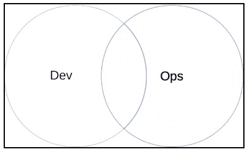

# 第一章：什么是 DevOps，为什么你应该关心？

**DevOps** 可以看作是成功且成熟的**敏捷**（Agile）方法论的延伸。将运维纳入其中有助于从持续（敏捷）开发到集成再到部署的进步，但更重要的是，它有助于构建一个更好的工作环境，一个具有更强团队间合作关系的环境。

如果我只能用一个词来描述 DevOps，那就是“合作”。**开发（Dev）**和**运维（Ops）**阵营都愿意真正合作，这是其哲学的基础，也是最重要的方面。

DevOps 出现在以下图表中的交汇点：

本章将涵盖以下主题：

+   什么是 DevOps？

+   在采纳 DevOps 之前你应该问自己的问题

# 什么是 DevOps？

所以，让我们来探讨一下 DevOps 环境的一些基本特征。

接下来是一些普遍接受的定义，通常混合着个人意见——你已经被提醒了。

## 共同目标

将努力方向对准提高系统性能与稳定性、减少部署时间或提升产品整体质量，将使客户更满意，工程师们也会更自豪。

目标需要反复重复、澄清和简化，直到每个人都完全理解、提出反对意见，并最终达成共识。

DevOps 将焦点从个人利益转向共同目标。它将赞扬更多地放在团队成就上，而不是个人；*KPI*和*本月员工*之类的活动也许就不那么重要了。

让人们看到超越自己工位的小环境的大图景。相信他们。

## 共享知识（无孤岛）

你很可能已经听说过关于臭名昭著的组织孤岛的故事，或者读过相关书籍。

在最坏的情况下，可能会出现一个拒绝放手的人，他们往往成为开发生命周期中的主要瓶颈。他们可能非常占有欲强，守护着自己在某一领域中的专属知识，可能（我推测）是因为这让他们感到重要，进一步迎合了他们的自我。

另一方面，也有一些人由于不幸的情况而陷入孤岛。我对那些孤身一人支持遗留系统的工程师们深感敬意。

幸运的是，DevOps 通过像**跨职能团队**和**全栈工程师**这样的概念，模糊了这些专业领域的界限。这里需要注意的是，这并不意味着可以通过期望人们在每个领域都成为技术高手来削减成本（这在现实中相当于在平均水平之上）。但就像 Venn 图中的交集一样，它是**开发（Dev）**和**运维（Ops）**技能集合之间的交汇点。

通过鼓励知识共享，避免了信息孤岛。同行评审、演示站立会议或共享文档是确保没有任务或知识被局限于特定人的几种方式。你甚至可以采用**结对编程**。这似乎有点重，但显然是有效的！

## 信任与共享责任

是否应该给予开发人员生产环境访问权限？

维持严格的基于角色的权限管理是有充分理由的，其中之一是安全性，另一个是完整性。只要我们保持开发人员的刻板印象——他们习惯于在**devlocal**环境中工作；对他们来说，诸如**受密码保护的**SSH 密钥，或者不手动编辑所有文件等概念，常常被忽略。

在 DevOps 时代，情况已经不再如此。共享知识和责任意味着运维工程师可以依赖他们的开发同事，在关键的生产环境中遵循相同的行为准则。

开发和运维团队可以使用相同的工具和环境。部署不再是运维团队的特殊任务，也不再需要提前安排日期。

在一个拥有这种知识共享习惯的团队中，作为运维工程师的我可以对我的开发同事能够执行我的任务充满信心，反之亦然。

开发人员参与**值班**轮班，支持他们所开发的软件。

这不应被视为一种额外负担，而应视为信任的象征和增加协作的机会。现在没有人再*把代码扔到墙那边*了。责任感和自主性激励人们做出超出预期的贡献。

## 尊重

随着我们花更多时间相互交流面对的挑战和试图解决的问题，我们之间的相互尊重也在不断增加。

这表现在开发人员在软件开发过程的早期就寻求运维团队的意见，或是运维工具的构建是为了满足开发人员的需求。

|   | *像开发人员一样思考的运维人员，像运维人员一样思考的开发人员* |   |
| --- | --- | --- |
|   | --*John Allspaw 和 Paul Hammond，《Velocity》* |

DevOps 环境建立在这种尊重之上。这是一个每个意见都很重要的地方，在这里，人们可以并且确实会公开质疑决策，以求得问题的最佳解决方案。这是一个强有力的标志，表明个人对我之前提到的共同目标的承诺。

## 自动化

从 A. Maslow 的*动机理论*中得出一个过于简化的结论：当你饥饿时，你不太可能去考虑诗歌。换句话说，一个满足基本需求的团队会在解决基本问题。

自动化日常且单调的任务使工程师能够集中精力处理更复杂、更有价值的工作。此外，人们会感到无聊，开始偷工减料，犯错——而计算机则不太容易犯错。

## 可重现的基础设施

将基础设施描述为代码具有以下优势：

+   它可以通过版本控制进行管理。

+   它可以轻松地与他人共享，以供重用或复制。

+   它充当了一个非常有用的日记，记录了你做了什么以及你是如何做的。

+   配置云环境变得非常简单（例如，通过 Terraform 或 CloudFormation）。

+   它使现代配置管理成为可能

无论如何，我怀疑任何管理超过 10 台服务器的人，已经以某种方式在对基础设施进行编码了。

## 指标与监控

|   | *测量一切！* |   |
| --- | --- | --- |
|   | --*实际的 DevOps 口号* |

存储变得便宜。培养收集大量度量数据的习惯，并使这些数据在你的组织中容易访问。工程师们对其基础设施和应用程序性能的可见性越高，在关键情况下做出的决策就越得当。

图表能够传达大量信息，在大屏幕上看起来相当酷，而且人类的大脑在识别模式方面表现出色。

指标数据的另一个重要作用是在性能优化中。

|   | *加速程序的最棘手部分不是做这件事，而是决定是否值得做这件事...问题的一部分在于，优化很难做好。令人害怕的是，它很容易变成迷信仪式和合理化的过程。* |   |
| --- | --- | --- |
|   | --*成熟的优化，Carlos Bueno* |

为了避免陷入确认偏误，你需要在尝试任何优化之前和之后使用客观的方法来评估你的系统。使用这些指标；（有效的）数据是很难被反驳的。

在有效性问题上，请定期校准你的仪器，进行合理性检查输出，并确保你认为展示的内容是同事们认为看到的内容（参考：[`mars.jpl.nasa.gov/msp98/news/mco990930.html`](https://mars.jpl.nasa.gov/msp98/news/mco990930.html)）。

## 持续集成、交付和部署

**观察**、**定位**、**决策**和**行动**（**OODA**）循环是由 J·博伊德上校提出的概念，展示了一个人在不断变化的环境中适应能力的价值。

面对无情（而且富有成效）的竞争，组织应该能够迅速应对动态市场条件。

这可能通过老式的柯达和 Netflix 故事来最好地说明。前者在曾经获得巨大成功后，被认为未能适应其行业的新趋势，导致品牌逐渐消失。相比之下，Netflix 不断巧妙地调整他们的产品以适应我们消费数字内容的新方式。他们彻底改变了他们的基础设施，分享了一些聪明的新做法，甚至是一些有争议的实践，再加上一堆出色的软件。像 Netflix 一样。

持续集成与交付本质上就是 OODA 的实践。团队不断集成相对较小的代码更改，更频繁地交付版本，从而能更快地从用户那里获得反馈。这种反馈类型对组织在动态变化的市场中作出及时反应至关重要。

然而，以上并不意味着我们应该成为*发布英雄*，将一切仓促推向*生产环境*，每周两次点燃它。*CI/CD*框架依然意味着通常的严格代码审查和测试流程，不论你部署得多频繁。尽管代码审查和测试通常需要更少的时间和精力，因为部署频率越高，代码变动通常越小。

## 拥抱失败

自然地，更多的实验可能会增加错误的概率。

我怀疑这一事实对任何人都不构成惊讶；然而，可能让你感到惊讶的是，接受失败的另一个积极角度的建议。

回想一下前一节中的视频极客们。他们可不是轻松地度过所有这些变化的，没有一点代价。此处我就不引用爱迪生的名言了；然而，试错确实是科学方法的一种有效形式，而 DevOps 流程为那些愿意同意这一点的人提供了极大的助力。

换句话说，组织应该鼓励人们不断挑战并改善当前的现状，同时也要允许他们公开讨论发生错误时的经历。

但是，处理实验失败可能是这段故事中比日常操作中冷酷、严苛的现实更浪漫的一面。

系统会失败。我希望我们大多数人都已经接受了这一事实，并接受它引发的思维链条：

+   我们并不总是知道自己认为知道的那么多：

    |   | *“对结果的了解使得事情似乎应该更明显地呈现给当时的实践者，然而这并非实际情况……**在事故发生后，实践者的行为可能会被视为错误或违反规定，但这些评估在很大程度上受到事后诸葛亮的偏见，忽视了其他推动因素……”* |   |
    | --- | --- | --- |
    |   | --*复杂系统如何失败，R.I.库克* |

    *向上攀登!* 或者说，在我们长期追求社会主导地位的过程中，我们似乎已经形成了这样一个便捷的信念：事件发生后，我们不仅能准确知道它发生了什么、怎么发生的，还能知道为什么会发生。这种奇特的现象已经在 D.卡尼曼的《思考，快与慢》中得到了很好的解释；我只是想补充一点，确实经常听到一些过于自信的人，他们根据自己看似合理的故事线，指责同事。

    事情的真相是：我们当时不在现场。而将我们现在知道的细节与当时已知的事实区分开来并不容易。

+   指责毫无价值：

    我们社区中的 Etsy 及类似平台分享了足够多的观察结果，表明将负面强化作为减少人为错误的策略并不是最优选择。

    采用 DevOps 后，我们接受人们通常每天上班时的目标是尽最大努力工作，并为组织的利益着想。在停机发生后，我们的分析从假设操作员在当时的情境和信息基础上做出了最好的决策开始。我们关注可能导致他们做出决策的因素、他们的思考过程、事件的流动，以及这些是否能得到改进。

+   韧性是可以积累的：

    *“使我们不死的……”*mithridatism*或纳西姆·塔勒布的**反脆弱**概念都在表达这样一个观点：我们在遇到负面经历时变得更擅长应对，而且更重要的是，我们应该时不时地去主动寻找这些经历。

    我们可以训练自己和我们的系统，更快速地从错误中恢复，甚至在错误发生时依然能够继续运行。实现这一目标的一种方式是通过有控制的（并且随着实践，变得不那么控制）停机。

    有了合适的监控和审计工具，每一次异常活动都能让我们更深入地了解我们的应用程序和基础设施。

现在，我已将通过 DevOps 实现更好生活的秘密传授给你，亲爱的读者，接下来我们来关注本章标题的后半部分。

# 你在乎吗？

我看不出有什么理由不这样做。从 DevOps 概念诞生至今已过去七年左右，关于其有效性的证据也在稳步增长。以备受尊敬的敏捷框架为基础，更加增强了其可信度，也许能帮助解释其成功的很大一部分原因。

这并不是说没有需要考虑的事项。你内心的批判性思维者，在开始这种文化政变之前，肯定会问上几个问题。

## 现在是时候了吗？

你刚刚完成了精益或敏捷开发的实施吗？团队里还有其他变化吗？现在是时候再一次呼吁变革了吗？

改变我们的习惯会让我们感到不安；需要一段时间来调整。你的坚持是值得赞扬的，追求 DevOps 作为团队协作的新阶段往往是正确的选择。

不必完全放弃；或许可以暂时搁置一下。

## 它会有效吗？

环顾四周。那些面孔，那些不同的个性，你能想象他们一起唱《Kumbaya》吗？也许能，也许不能，或者还不能。

请不要通过电子邮件发送匿名员工调查。把大家聚在一起，展示你的 DevOps 宣传，并观察他们的反应。

你将需要每个人完全理解这些概念，承认挑战，并接受为此付出的牺牲。不能有任何例外，也不能有模糊不清之处。

所有这些都需要极大的文化变革，团队应对此做好准备。

## 这值得吗？

改变当前思维方式需要什么？你需要制造多大的扰动？你预期会有多大的反响？

虽然我并不是建议将此作为容忍现状的借口，但我恳请你保持一种务实的态度看待当前的情况。

你的组织类型可能更适合逐步演变的过程，而不是一次彻底的革命。

## 你需要它吗？

你如何评估你目前的流程？你会说你的跨团队沟通令人满意吗？你是否经常达成业务期望？你是否已经自动化了大部分工作流程？

听起来你目前做得很好；你可能已经在团队中有一些 DevOps 实践，只是没有意识到而已。关键是，如果你能将资源集中在其他地方进行优化，解决其他更紧迫的问题，可能会更有效。

既然你已经了解了 DevOps 背后思想的另一种诠释，如果你觉得这些观点与你的思维方式相符，并且最后几个问题没有引发任何疑虑，那么我们可以安全地过渡到更具技术性的主题，将原则付诸实践。

# 总结

首先，我们探讨了 DevOps 哲学中包含的主要理念，接着提出了一些问题，旨在帮助你在组织内采纳 DevOps 时构建一个更客观的视角。

我们已经看到，DevOps 是一些老旧且经过验证的敏捷概念与其他较新发展出的理念的有效结合，它教会我们如何建立更好的团队，写出更好的软件，获得更快的成果，并在一个鼓励实验而不妥协稳定性的环境中轻松合作。

既然我们已经覆盖了理论内容，接下来的章节将引导我们进入 DevOps 的实际应用。我们将从在云端部署基础设施作为代码的示例开始。
