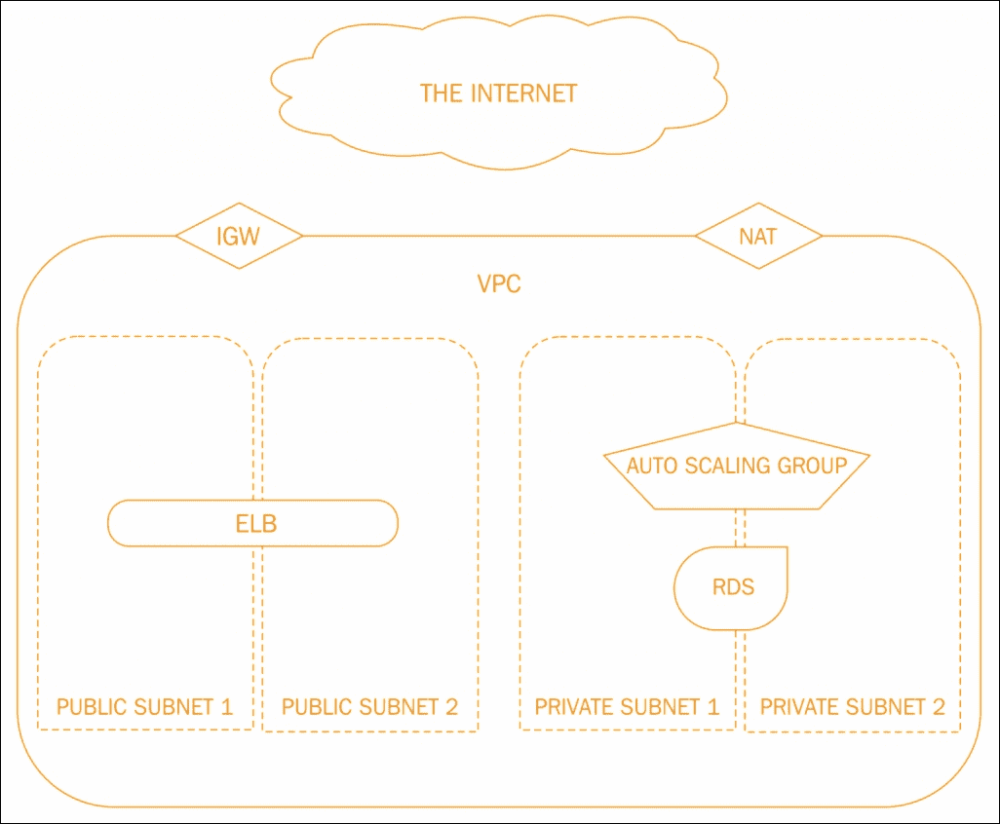
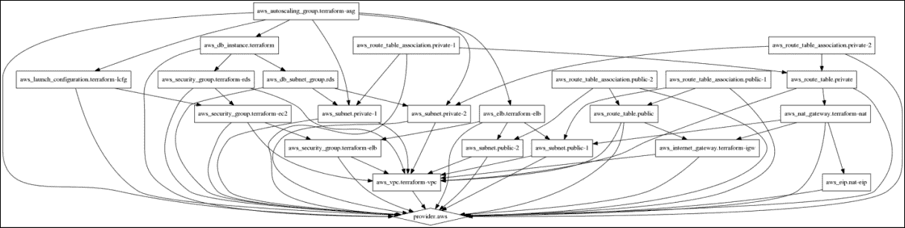
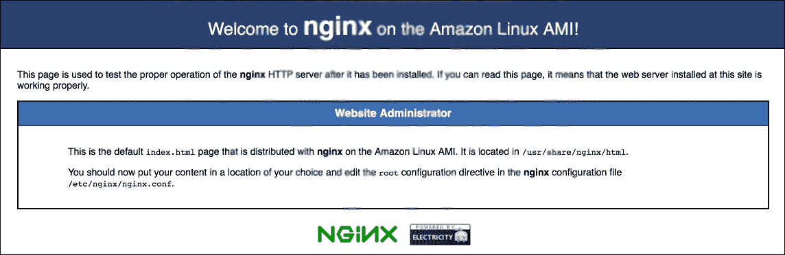
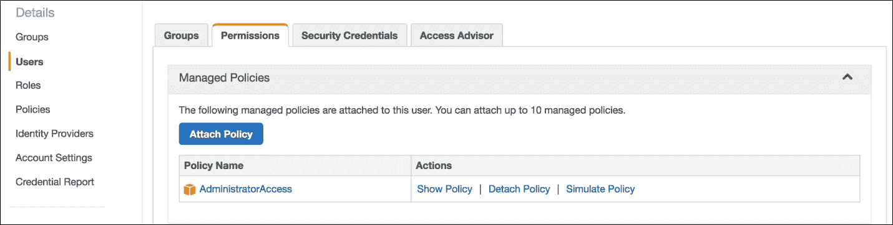
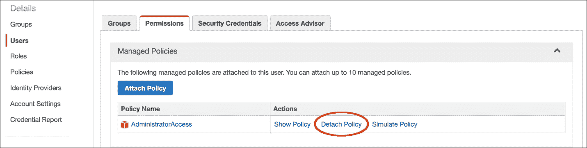

# 第二章 开始将基础设施视为代码

诸位，举起你们的手，程序化基础设施来了！

也许**基础设施即代码**（**IaC**）并不是一个全新的概念，因为配置管理已经存在了很长时间。然而，将服务器、存储和网络基础设施及其关系编写成代码的做法，是云计算崛起后才出现的相对较新的趋势。不过，让我们先放下配置管理，集中注意力在 IaC 的第二个方面。

你应该记得上一章中存储所有内容为代码的一些好处：

+   代码可以保持版本控制

+   代码可以轻松共享和协作

+   代码即文档

+   代码是可复现的

最后一点对我个人来说是一个巨大的收获。自动化资源配置帮助将部署一个功能齐全的云环境的时间从四小时减少到一个小时，并且将人为错误的发生率降到了几乎为零（不能让一个人负责输入字段）。

当团队开始并行使用多个环境并且需要随时启动或停止这些环境时，能够快速配置资源成为一个显著的优势。在这一章节中，我们将详细探讨如何用代码描述并在 AWS 上部署这样的一个环境，并尽量减少手动操作。

为了在云中实现 IaC，我们将关注两个工具或服务：**Terraform**和**CloudFormation**。

我们将通过以下示例进行讲解：

+   配置工具

+   编写 IaC 模板

+   部署模板

+   部署模板的后续变更

+   删除模板并移除已配置的基础设施

在这些示例中，假设我们的应用程序需要一个**虚拟私有云**（**VPC**），它托管一个**关系型数据库服务**（**RDS**）后端和若干个在**弹性负载均衡器**（**ELB**）后面的**弹性计算云**（**EC2**）实例。我们将大多数组件置于**网络地址转换**（**NAT**）背后，只允许负载均衡器可以从外部访问。

# 使用 Terraform 实现基础设施即代码（IaC）

部署 AWS 基础设施的工具之一是 HashiCorp 的 Terraform（[`www.terraform.io`](https://www.terraform.io)）。HashiCorp 是那个给我们带来 Vagrant、Packer 和 Consul 的天才团队。如果你还没看过他们的网站，我推荐你去看看。

使用**Terraform**（**TF**），我们可以编写一个模板来描述一个环境，进行*模拟运行*查看即将发生的事情以及是否符合预期，部署模板，并在必要时进行任何后期调整——这一切都无需离开终端。

## 配置

首先，你需要在你的机器上安装一份 TF（[`www.terraform.io/downloads.html`](https://www.terraform.io/downloads.html)），并确保它能在 CLI 中使用。你应该能够查询到当前安装的版本，在我这里是 0.6.15：

```
$ terraform --version
Terraform v0.6.15

```

由于 TF 使用 AWS API，它需要一组认证密钥以及一定的 AWS 账户访问权限。为了部署本章中的示例，您可以创建一个新的 **身份** **和** **访问管理**（**IAM**）用户，并授予以下权限：

```
    "autoscaling:CreateAutoScalingGroup",
    "autoscaling:CreateLaunchConfiguration",
    "autoscaling:DeleteLaunchConfiguration",
    "autoscaling:Describe*",
    "autoscaling:UpdateAutoScalingGroup",
    "ec2:AllocateAddress",
    "ec2:AssociateAddress",
    "ec2:AssociateRouteTable",
    "ec2:AttachInternetGateway",
    "ec2:AuthorizeSecurityGroupEgress",
    "ec2:AuthorizeSecurityGroupIngress",
    "ec2:CreateInternetGateway",
    "ec2:CreateNatGateway",
    "ec2:CreateRoute",
    "ec2:CreateRouteTable",
    "ec2:CreateSecurityGroup",
    "ec2:CreateSubnet",
    "ec2:CreateTags",
    "ec2:CreateVpc",
    "ec2:Describe*",
    "ec2:ModifySubnetAttribute",
    "ec2:RevokeSecurityGroupEgress",
    "elasticloadbalancing:AddTags",
    "elasticloadbalancing:ApplySecurityGroupsToLoadBalancer",
    "elasticloadbalancing:AttachLoadBalancerToSubnets",
    "elasticloadbalancing:CreateLoadBalancer",
    "elasticloadbalancing:CreateLoadBalancerListeners",
    "elasticloadbalancing:Describe*",
    "elasticloadbalancing:ModifyLoadBalancerAttributes",
    "rds:CreateDBInstance",
    "rds:CreateDBSubnetGroup",
    "rds:Describe*"

```

### 注意

请参阅此文件以获取更多信息：[`github.com/PacktPublishing/Implementing-DevOps-on-AWS/blob/master/5585_02_CodeFiles/Terraform/iam_user_policy.json`](https://github.com/PacktPublishing/Implementing-DevOps-on-AWS/blob/master/5585_02_CodeFiles/Terraform/iam_user_policy.json)。

使 IAM 用户的凭证可供 TF 使用的一种方法是通过导出以下环境变量：

```
$ export AWS_ACCESS_KEY_ID='user_access_key'
$ export AWS_SECRET_ACCESS_KEY='user_secret_access_key'

```

这应该足以让我们开始了。

### 注意

**下载示例代码**

下载代码包的详细步骤已在本书的前言中提到。

本书的代码包也托管在 GitHub 上：[`github.com/PacktPublishing/Implementing-DevOps-on-AWS`](https://github.com/PacktPublishing/Implementing-DevOps-on-AWS)。我们还有来自我们丰富书籍和视频目录的其他代码包，可以在：[`github.com/PacktPublishing/`](https://github.com/PacktPublishing/) 中查看。快去看看吧！

## 模板设计

在我们开始编码之前，这里有一些规则：

+   您可以选择将 TF 模板编写为一个大的文件，或多个小文件的组合

+   模板可以用纯 JSON 或 TF 自有格式编写

+   TF 会在给定的文件夹中查找扩展名为 `.tf` 或 `.tf.json` 的文件，并按字母顺序加载它们。

+   TF 模板是声明式的，因此资源在模板中出现的顺序不会影响执行流程

TF 模板通常由三部分组成：*资源*、*变量* 和 *输出*。如前所述，如何排列这些部分是个人偏好问题；然而，为了更好的可读性，我建议我们使用 TF 格式，并将每个部分写入单独的文件中。此外，尽管文件扩展名很重要，文件名则由你决定。

### 资源

从某种程度上讲，这个文件包含了模板的主要部分，因为资源代表了最终被配置的实际组件。例如，我们将使用 VPC Terraform 资源、RDS、ELB 以及其他几个资源来配置大致如下所示的内容：



由于模板元素可以按任何顺序编写，TF 通过检查它找到的任何引用来确定执行流程（例如，VPC 应该在 ELB 被创建之前存在，ELB 被认为属于它）。另外，也可以使用显式的流程控制属性，例如 `depends_on`，正如我们稍后会看到的那样。

为了了解更多信息，让我们浏览一下 `resources.tf` 文件的内容。

### 注意

请参考：[`github.com/PacktPublishing/Implementing-DevOps-on-AWS/blob/master/5585_02_CodeFiles/Terraform/resources.tf`](https://github.com/PacktPublishing/Implementing-DevOps-on-AWS/blob/master/5585_02_CodeFiles/Terraform/resources.tf)。

首先，我们告诉 Terraform 使用哪个提供程序来部署我们的基础设施：

```
# Set a Provider 
  provider "aws"  
{ 
  region = "${var.aws-region}" 
} 

```

你会注意到没有指定凭证，因为我们之前已经将它们设置为环境变量。

现在我们可以添加 VPC 及其网络组件：

```
# Create a VPC 
  resource "aws_vpc" "terraform-vpc"  
{ 
  cidr_block = "${var.vpc-cidr}" 

  tags  
  { 
    Name = "${var.vpc-name}" 
  } 
} 

# Create an Internet Gateway 
  resource "aws_internet_gateway" "terraform-igw"  
{ 
  vpc_id = "${aws_vpc.terraform-vpc.id}" 
} 

# Create NAT 
  resource "aws_eip" "nat-eip"  
{ 
  vpc = true 
} 

```

到目前为止，我们已经声明了 VPC、其互联网和 NAT 网关，以及一组具有匹配路由表的公有和私有子网。

如果我们逐行查看一些资源块，它有助于澄清语法：

```
resource "aws_subnet" "public-1" { 

```

第一个参数是资源的类型，后面跟着一个任意的名称：

```
vpc_id = "${aws_vpc.terraform-vpc.id}" 

```

名为`public-1`的`aws_subnet`资源具有一个`vpc_id`属性，它引用了名为`terraform-vpc`的另一个`aws_vpc`资源的`id`属性。对其他资源的这种引用隐式地定义了执行流程，也就是说，VPC 必须先存在，才能创建子网：

```
cidr_block = "${cidrsubnet(var.vpc-cidr, 8, 1)}" 

```

我们稍后会更多地讨论变量，但格式是`var.var_name`，如这里所示。

在这里，我们使用`cidrsubnet`函数和`vpc-cidr`变量，它返回一个`cidr_block`，将分配给`public-1`子网。有关此函数和其他有用函数的详细信息，请参阅 TF 文档。

接下来，我们将 RDS 添加到 VPC 中：

```
resource "aws_db_instance" "terraform" { 
identifier = "${var.rds-identifier}" 
allocated_storage = "${var.rds-storage-size}" 
storage_type= "${var.rds-storage-type}" 
engine = "${var.rds-engine}" 
engine_version = "${var.rds-engine-version}" 
instance_class = "${var.rds-instance-class}" 
username = "${var.rds-username}" 
password = "${var.rds-password}" 
port = "${var.rds-port}" 
vpc_security_group_ids = ["${aws_security_group.terraform-rds.id}"] 
db_subnet_group_name = "${aws_db_subnet_group.rds.id}" 
} 

```

在这里，我们主要看到对变量的引用，并且有一些对其他资源的调用。

在 RDS 之后是一个 ELB：

```
resource "aws_elb" "terraform-elb"  
{ 
  name = "terraform-elb" 
  security_groups = ["${aws_security_group.terraform-elb.id}"] 
  subnets = ["${aws_subnet.public-1.id}", 
"${aws_subnet.public-2.id}"] 

listener  
  { 
   instance_port = 80 
   instance_protocol = "http" 
   lb_port = 80 
   lb_protocol = "http" 
  } 

tags  
  { 
   Name = "terraform-elb" 
  } 
    } 

```

最后，我们定义了 EC2 自动扩展组和相关资源，如启动配置。

对于启动配置，我们定义了要使用的 AMI 和实例类型，SSH 密钥对的名称，EC2 安全组以及用于引导实例的 UserData：

```
resource "aws_launch_configuration" "terraform-lcfg" { 
image_id = "${var.autoscaling-group-image-id}" 
instance_type = "${var.autoscaling-group-instance-type}" 
key_name = "${var.autoscaling-group-key-name}" 
security_groups = ["${aws_security_group.terraform-ec2.id}"] 
user_data = "#!/bin/bash \n set -euf -o pipefail \n exec 1> >(logger -s -t $(basename $0)) 2>&1 \n yum -y install nginx; chkconfig nginx on; service nginx start" 

lifecycle { 
create_before_destroy = true 
} 

```

自动扩展组接收启动配置的 ID、VPC 子网列表、实例的最小/最大数量以及附加到已配置实例的 ELB 名称：

```
} 
resource "aws_autoscaling_group" "terraform-asg" { 
name = "terraform" 
launch_configuration = "${aws_launch_configuration.terraform-lcfg.id}" 
vpc_zone_identifier = ["${aws_subnet.private-1.id}", "${aws_subnet.private-2.id}"] 
min_size = "${var.autoscaling-group-minsize}" 
max_size = "${var.autoscaling-group-maxsize}" 
load_balancers = ["${aws_elb.terraform-elb.name}"] 
depends_on = ["aws_db_instance.terraform"] 
tag { 
key = "Name" 
value = "terraform" 
propagate_at_launch = true 
} 
} 

```

前面的`user_data`shell 脚本将在 EC2 节点上安装并启动 NGINX。

### 变量

我们充分利用变量来定义我们的资源，使模板尽可能可重用。现在，让我们看看`variables.tf`，进一步研究这些变量。

与资源列表类似，我们从 VPC 开始：

### 注意

请参考：[`github.com/PacktPublishing/Implementing-DevOps-on-AWS/blob/master/5585_02_CodeFiles/Terraform/variables.tf`](https://github.com/PacktPublishing/Implementing-DevOps-on-AWS/blob/master/5585_02_CodeFiles/Terraform/variables.tf)。

```
variable "aws-region" { 
type = "string" 
description = "AWS region" 
} 
variable "aws-availability-zones" { 
type = "string" 
description = "AWS zones" 
} 
variable "vpc-cidr" { 
type = "string" 
description = "VPC CIDR" 
} 
variable "vpc-name" { 
type = "string" 
description = "VPC name" 
} 

```

语法如下：

```
variable "variable_name" {  
variable properties  
} 

```

`variable_name`是任意的，但需要与模板中其他部分引用的相关`var.var_name`匹配。例如，`aws-region`变量将满足我们在描述`provider aws resource`区域时使用的`${var.aws-region}`引用。

我们大多数时候会使用 `string` 类型变量，但还有另一种有用的类型叫做 **map**，它可以存储查找表。Map 查询的方式类似于在哈希/字典中查找值（请参见：[`www.terraform.io/docs/configuration/variables.html`](https://www.terraform.io/docs/configuration/variables.html)）。

接下来是 RDS：

```
variable "rds-identifier" { 
type = "string" 
description = "RDS instance identifier" 
}   
variable "rds-storage-size" { 
type = "string" 
description = "Storage size in GB" 
} 
variable "rds-storage-type" { 
type = "string" 
description = "Storage type" 
} 
variable "rds-engine" { 
type = "string" 
description = "RDS type" 
} 
variable "rds-engine-version" { 
type = "string" 
description = "RDS version" 
} 
variable "rds-instance-class" { 
type = "string" 
description = "RDS instance class" 
} 
variable "rds-username" { 
type = "string" 
description = "RDS username" 
} 
variable "rds-password" { 
type = "string" 
description = "RDS password" 
} 
variable "rds-port" { 
type = "string" 
description = "RDS port number" 
} 

```

最后，我们添加与 EC2 相关的变量：

```
variable "autoscaling-group-minsize" { 
type = "string" 
description = "Min size of the ASG" 
} 
variable "autoscaling-group-maxsize" { 
type = "string" 
description = "Max size of the ASG" 
} 
variable "autoscaling-group-image-id" { 
type="string" 
description = "EC2 AMI identifier" 
} 
variable "autoscaling-group-instance-type" { 
type = "string" 
description = "EC2 instance type" 
} 
variable "autoscaling-group-key-name" { 
type = "string" 
description = "EC2 ssh key name" 
} 

```

现在我们已经在 `variables.tf` 中定义了所有变量的类型和描述，但尚未分配值。

TF 在这方面非常灵活。我们可以采用以下任何方式：

+   在 `variables.tf` 中直接分配（默认）值：

+   变量 "`aws-region`" { `type = "string"``description = "AWS 区域"``default = 'us-east-1'` }

+   不为变量分配值，这样 TF 会在运行时提示输入值

+   `*` 直接向 TF 命令传递 `-var 'key=value'` 参数，如下所示：

```
-var 'aws-region=us-east-1' 

```

+   将 `key=value` 键值对存储在文件中

+   使用以 `TF_VAR` 为前缀的环境变量，例如 `TF_VAR_aws-region`

使用 `key=value` 键值对文件在团队内非常方便，因为每个工程师可以拥有一个私人副本（排除在版本控制之外）。如果文件名为 `terraform.tfvars`，TF 会自动读取它；另外，也可以在命令行上使用 `-var-file` 来指定不同的源文件。

以下是我们示例 `terraform.tfvars` 文件的内容：

### 注意

请参考：[`github.com/PacktPublishing/Implementing-DevOps-on-AWS/blob/master/5585_02_CodeFiles/Terraform/terraform.tfvars`](https://github.com/PacktPublishing/Implementing-DevOps-on-AWS/blob/master/5585_02_CodeFiles/Terraform/terraform.tfvars)。

```
autoscaling-group-image-id = "ami-08111162" 
autoscaling-group-instance-type = "t2.nano" 
autoscaling-group-key-name = "terraform" 
autoscaling-group-maxsize = "1" 
autoscaling-group-minsize = "1" 
aws-availability-zones = "us-east-1b,us-east-1c" 
aws-region = "us-east-1" 
rds-engine = "postgres" 
rds-engine-version = "9.5.2" 
rds-identifier = "terraform-rds" 
rds-instance-class = "db.t2.micro" 
rds-port = "5432" 
rds-storage-size = "5" 
rds-storage-type = "gp2" 
rds-username = "dbroot" 
rds-password = "donotusethispassword" 
vpc-cidr = "10.0.0.0/16" 
vpc-name = "Terraform" 

```

一个值得注意的点是 `aws-availability-zones`，因为它包含多个值，我们通过元素和拆分函数与之进行交互，如在 `resources.tf` 中所示。

### 输出

我们模板中的第三部分，主要是提供信息的部分，包含 TF 输出。这些输出允许在测试、部署或模板部署后将选定的值返回给用户。这个概念类似于在 shell 脚本中常用的 `echo` 语句，用于在执行过程中显示有用的信息。

让我们通过创建一个 `outputs.tf` 文件来向模板中添加输出：

### 注意

请参考：[`github.com/PacktPublishing/Implementing-DevOps-on-AWS/blob/master/5585_02_CodeFiles/Terraform/outputs.tf`](https://github.com/PacktPublishing/Implementing-DevOps-on-AWS/blob/master/5585_02_CodeFiles/Terraform/outputs.tf)。

```
output "VPC ID" { 
value = "${aws_vpc.terraform-vpc.id}" 
} 

output "NAT EIP" { 
value = "${aws_nat_gateway.terraform-nat.public_ip}" 
} 

output "ELB URI" { 
value = "${aws_elb.terraform-elb.dns_name}" 
} 
output "RDS Endpoint" { 
value = "${aws_db_instance.terraform.endpoint}" 
} 

```

要配置输出，您只需引用给定资源及其属性。如前面的代码所示，我们选择了 VPC 的 ID、NAT 网关的弹性 IP 地址、ELB 的 DNS 名称和 RDS 实例的端点地址。

本节完成了本示例中的模板。现在，您应该在模板文件夹中有四个文件：`resources.tf`、`variables.tf`、`terraform.tfvars` 和 `outputs.tf`。

## 操作

我们将检查五个主要的 TF 操作：

+   验证模板

+   测试（干运行）

+   初始部署

+   更新部署

+   删除一个部署

### 注意

在以下命令行示例中，Terraform 在包含模板文件的文件夹中运行。

### 验证

在进一步操作之前，应使用 `terraform validate` 命令进行基本的语法检查。在 `resources.tf` 中重命名一个变量后，validate 会返回一个 `unknown variable` 错误：

```
$ terraform validate
Error validating: 1 error(s) occurred:
* provider config 'aws': unknown variable referenced: 'aws-region-1'. define it with 'variable' blocks

```

一旦变量名被修正，重新运行`validate`命令将不会输出任何内容，这意味着验证已通过。

### 干运行

下一步是执行一个测试/干运行，使用 `terraform plan`，它显示了实际部署过程中会发生的情况。该命令返回一个带有颜色编码的资源及其属性列表，或更准确地说，如下所示：

```
$ terraform plan
Resources are shown in alphabetical order for quick scanning. Green resources will be created (or destroyed and then created if an existing resource exists), yellow resources are being changed in-place, and red resources will be destroyed.

```

要真实地了解将要部署的基础设施的样子，你可以使用 `terraform graph`：

```
$ terraform graph > my_graph.dot

```

DOT 文件可以通过 **Graphviz** 开源软件进行操作（请参见 [`www.graphviz.org`](http://www.graphviz.org)）或许多在线读取器/转换器。以下图示是一个较大图表的一部分，表示我们之前设计的模板：



Terraform 图表

### 部署

如果你对计划和图表满意，模板现在可以通过 `terraform apply` 部署：

```
$ terraform apply
aws_eip.nat-eip: Creating...
allocation_id: "" => "<computed>"
association_id: "" => "<computed>"
domain: "" => "<computed>"
instance: "" => "<computed>"
network_interface: "" => "<computed>"
private_ip: "" => "<computed>"
public_ip: "" => "<computed>"
vpc: "" => "1"
aws_vpc.terraform-vpc: Creating...
cidr_block: "" => "10.0.0.0/16"
default_network_acl_id: "" => "<computed>"
default_security_group_id: "" => "<computed>"
dhcp_options_id: "" => "<computed>"
enable_classiclink: "" => "<computed>"
enable_dns_hostnames: "" => "<computed>"
Apply complete! Resources: 22 added, 0 changed, 0 destroyed.

```

你的基础设施状态已保存到以下路径。这个状态对于修改和销毁你的基础设施是必需的，因此请妥善保管它。要查看完整的状态，请使用 `terraform show` 命令。

```
State path: terraform.tfstate
Outputs:
ELB URI = terraform-elb-xxxxxx.us-east-1.elb.amazonaws.com
NAT EIP = x.x.x.x
RDS Endpoint = terraform-rds.xxxxxx.us-east-1.rds.amazonaws.com:5432
VPC ID = vpc-xxxxxx

```

在成功部署结束时，你会看到之前配置的`Outputs`以及关于另一个重要部分*TF - 状态文件*的信息（请参见 [`www.terraform.io/docs/state/`](https://www.terraform.io/docs/state/)）：

TF 存储的是上次运行 TF 时管理的基础设施的状态。默认情况下，这个状态存储在一个名为`terraform.tfstate`的本地文件中，但它也可以远程存储，这在团队环境中效果更佳。

TF 使用此本地状态来创建计划并对你的基础设施进行更改。在任何操作之前，TF 会执行刷新，以用实际基础设施更新状态。

从某种意义上讲，`state` 文件包含了你基础设施的快照，并用于在模板被修改时计算任何更改。通常，你会将 `terraform.tfstate` 文件与模板一起纳入版本控制。然而，在团队环境中，如果遇到过多的合并冲突，你可以选择将 `state` 文件存储在如 S3 这样的替代位置（请参见：[`www.terraform.io/docs/state/remote/index.html`](https://www.terraform.io/docs/state/remote/index.html)）。

让 EC2 节点完全初始化几分钟，然后尝试从前面的 `Outputs` 中加载 ELB URI 到浏览器中。你应该会看到 **nginx**，如下图所示：



### 更新

根据墨菲定律，一旦我们部署了一个模板，就会需要对其进行更改。幸运的是，所需的仅仅是更新并重新部署该模板。

假设我们需要向 ELB 安全组添加一个新规则（加粗部分显示）：

1.  更新`resources.tf`中的`"aws_security_group" "terraform-elb"`资源块：

    ```
        resource "aws_security_group" "terraform-elb" {
        name = "terraform-elb"
        description = "ELB security group"
        vpc_id = "${aws_vpc.terraform-vpc.id}"

        ingress {
        from_port = "80"
        to_port = "80"
        protocol = "tcp"
        cidr_blocks = ["0.0.0.0/0"]
        }

        ingress {
        from_port = "443"
        to_port = "443"
        protocol = "tcp"
        cidr_blocks = ["0.0.0.0/0"]
        }

        egress {
        from_port = 0
        to_port = 0
        protocol = "-1"
        cidr_blocks = ["0.0.0.0/0"]
        }

        }

    ```

1.  验证即将更改的内容：

    ```
    $ terraform plan
    ...
    ~ aws_security_group.terraform-elb
    ingress.#: "1" => "2"
    ingress.2214680975.cidr_blocks.#: "1" => "1"
    ingress.2214680975.cidr_blocks.0: "0.0.0.0/0" => "0.0.0.0/0"
    ingress.2214680975.from_port: "80" => "80"
    ingress.2214680975.protocol: "tcp" => "tcp"
    ingress.2214680975.security_groups.#: "0" => "0"
    ingress.2214680975.self: "0" => "0"
    ingress.2214680975.to_port: "80" => "80"
    ingress.2617001939.cidr_blocks.#: "0" => "1"
    ingress.2617001939.cidr_blocks.0: "" => "0.0.0.0/0"
    ingress.2617001939.from_port: "" => "443"
    ingress.2617001939.protocol: "" => "tcp"
    ingress.2617001939.security_groups.#: "0" => "0"
    ingress.2617001939.self: "" => "0"
    ingress.2617001939.to_port: "" => "443"
    Plan: 0 to add, 1 to change, 0 to destroy.

    ```

1.  部署更改：

    ```
    $ terraform apply
    ...
    aws_security_group.terraform-elb: Modifying...
    ingress.#: "1" => "2"
    ingress.2214680975.cidr_blocks.#: "1" => "1"
    ingress.2214680975.cidr_blocks.0: "0.0.0.0/0" => "0.0.0.0/0"
    ingress.2214680975.from_port: "80" => "80"
    ingress.2214680975.protocol: "tcp" => "tcp"
    ingress.2214680975.security_groups.#: "0" => "0"
    ingress.2214680975.self: "0" => "0"
    ingress.2214680975.to_port: "80" => "80"
    ingress.2617001939.cidr_blocks.#: "0" => "1"
    ingress.2617001939.cidr_blocks.0: "" => "0.0.0.0/0"
    ingress.2617001939.from_port: "" => "443"
    ingress.2617001939.protocol: "" => "tcp"
    ingress.2617001939.security_groups.#: "0" => "0"
    ingress.2617001939.self: "" => "0"
    ingress.2617001939.to_port: "" => "443"
    aws_security_group.terraform-elb: Modifications complete
    ...
    Apply complete! Resources: 0 added, 1 changed, 0 destroyed.

    ```

    ### 注意

    一些更新操作可能是破坏性的（请参见[`docs.aws.amazon.com/AWSCloudFormation/latest/UserGuide/using-cfn-updating-stacks-update-behaviors.html`](http://docs.aws.amazon.com/AWSCloudFormation/latest/UserGuide/using-cfn-updating-stacks-update-behaviors.html)）。你应该始终查看 CloudFormation 文档，了解你计划修改的资源是否会导致中断。TF 通过`prevent_destroy`生命周期属性提供了一些保护（请参见[`www.terraform.io/docs/configuration/resources.html#prevent_destroy`](https://www.terraform.io/docs/configuration/resources.html#prevent_destroy)）。

### 移除

这是一个友好的提醒：完成实验后，务必移除 AWS 资源，以避免产生意外费用。

在执行任何`delete`操作之前，我们需要授予之前在本章开始时创建的(`terraform`) IAM 用户相关权限。作为快捷方式，你可以通过 AWS 控制台临时将**AdministratorAccess**托管策略附加到该用户，如下图所示：



为了移除我们在本示例中创建的 VPC 及其所有相关资源，我们将使用`terraform destroy`：

```
$ terraform destroy
Do you really want to destroy?
Terraform will delete all your managed infrastructure.
There is no undo. Only 'yes' will be accepted to confirm.
Enter a value: yes

```

`Terraform`会请求确认后继续销毁资源，最终显示如下：

```
Apply complete! Resources: 0 added, 0 changed, 22 destroyed.

```

接下来，我们通过卸载**AdministratorAccess**托管策略来移除之前授予 IAM 用户的临时管理员访问权限，如下图所示：



然后，验证 VPC 是否已在 AWS 控制台中消失。

# 使用 CloudFormation 进行基础设施即代码（IaC）

**CloudFormation**是 AWS 提供的一项基础设施即代码（IaC）服务。和之前一样，我们将通过包含参数（变量）、资源和输出的模板来描述我们的基础设施。

CloudFormation 将每个部署的模板称为**Stack**。可以通过 AWS 控制台、CLI 或 API 创建、列出、更新和删除 Stack。在小型设置中，你可能会单独部署每个 Stack，但随着架构变得更复杂，你可以开始嵌套 Stack。你将有一个顶级或父级 Stack（模板），它调用多个子 Stack。嵌套 Stack 允许你在它们之间传递变量，并且当然能节省你单独部署每个 Stack 的时间。

## 配置

CloudFormation 通过 AWS 控制台提供 GUI 界面；然而，我们将重点关注 AWS CLI，因为它更适合未来的自动化任务。

根据你使用的操作系统，你可以从 [`aws.amazon.com/cli/`](https://aws.amazon.com/cli/) 下载安装程序，或者使用 Python PIP：

```
$ pip install awscli
$ aws --version
aws-cli/1.10.34 ...

```

我们将需要一组 API 密钥，因此让我们创建一个名为 `cloudformation` 的新 IAM 用户，并赋予以下权限：

```
    "cloudformation:CancelUpdateStack",
    "cloudformation:ContinueUpdateRollback",
    "cloudformation:Create*",
    "cloudformation:Describe*",
    "cloudformation:EstimateTemplateCost",
    "cloudformation:ExecuteChangeSet",
    "cloudformation:Get*",
    "cloudformation:List*",
    "cloudformation:PreviewStackUpdate",
    "cloudformation:SetStackPolicy",
    "cloudformation:SignalResource",
    "cloudformation:UpdateStack",
    "cloudformation:ValidateTemplate",
    "autoscaling:CreateAutoScalingGroup",
    "autoscaling:CreateLaunchConfiguration",
    "autoscaling:DeleteLaunchConfiguration",
    "autoscaling:Describe*",
    "autoscaling:UpdateAutoScalingGroup",
    "ec2:AllocateAddress",
    "ec2:AssociateAddress",
    "ec2:AssociateRouteTable",
    "ec2:AttachInternetGateway",
    "ec2:AuthorizeSecurityGroupEgress",
    "ec2:AuthorizeSecurityGroupIngress",
    "ec2:CreateInternetGateway",
    "ec2:CreateNatGateway",
    "ec2:CreateRoute",
    "ec2:CreateRouteTable",
    "ec2:CreateSecurityGroup",
    "ec2:CreateSubnet",
    "ec2:CreateTags",
    "ec2:CreateVpc",
    "ec2:Describe*",
    "ec2:Modify*",
    "ec2:RevokeSecurityGroupEgress",
    "elasticloadbalancing:CreateLoadBalancer",
    "elasticloadbalancing:CreateLoadBalancerListeners",
    "elasticloadbalancing:Describe*",
    "elasticloadbalancing:ModifyLoadBalancerAttributes",
    "elasticloadbalancing:SetLoadBalancerPoliciesOfListener",
    "rds:CreateDBInstance",
    "rds:CreateDBSubnetGroup",
    "rds:Describe*"

```

### 注意

请参阅：[`github.com/PacktPublishing/Implementing-DevOps-on-AWS/blob/master/5585_02_CodeFiles/CloudFormation/iam_user_policy.json`](https://github.com/PacktPublishing/Implementing-DevOps-on-AWS/blob/master/5585_02_CodeFiles/CloudFormation/iam_user_policy.json)。

你可以选择使用 `aws configure`，它会提示你输入 API 凭证，或者如果你不想永久存储它们，你也可以使用环境变量：

```
$ export AWS_ACCESS_KEY_ID='user_access_key'
$ export AWS_SECRET_ACCESS_KEY='user_secret_access_key'

```

CloudFormation 模板不会存储任何 AWS 区域信息，因此为了避免每次在命令行中指定，可以将其导出：

```
$ export AWS_DEFAULT_REGION='us-east-1'

```

配置好这些环境变量后，`awscli` 应该可以开始使用了。

## 模板设计

CloudFormation 模板是用 JSON 编写的，通常至少包含三个部分（顺序无关）：参数、资源和输出。

不幸的是，无法将这些参数存储到单独的文件中（参数值除外），因此在这个例子中，我们将使用一个名为`main.json`的单一模板文件。

模板可以在本地使用，也可以从远程位置导入（S3 存储桶是常见的选择）。

### 参数

参数通过允许我们传递变量（例如实例类型、AMI ID、SSH 密钥对名称等）为我们的堆栈增加了灵活性和可移植性，这些值最好不要硬编码。

每个参数都有一个任意的逻辑名称（字母数字，模板中唯一）、描述、类型和一个可选的默认值。可用的类型包括 `String`、`Number`、`CommaDelimitedList`，以及一些特定于 AWS 的特殊类型，例如 `AWS::EC2::KeyPair::KeyName`，如前面的代码所示。

后者对于验证很有用，因为 CloudFormation 会检查给定名称的密钥对是否确实存在于你的 AWS 账户中。

参数还可以具有诸如 `AllowedValues`、`Min/MaxLength`、`Min/MaxValue`、`NoEcho` 等属性（请参阅 [`docs.aws.amazon.com/AWSCloudFormation/latest/UserGuide/parameters-section-structure.html`](http://docs.aws.amazon.com/AWSCloudFormation/latest/UserGuide/parameters-section-structure.html)）。

每个模板的参数限制为 60 个。

让我们来检查一下模板顶部的参数：

### 注意

请参阅：[`github.com/PacktPublishing/Implementing-DevOps-on-AWS/blob/master/5585_02_CodeFiles/CloudFormation/main.json`](https://github.com/PacktPublishing/Implementing-DevOps-on-AWS/blob/master/5585_02_CodeFiles/CloudFormation/main.json)。

```
"Parameters" : { 
"vpcCidr" : { 
"Description" : "VPC CIDR", 
"Type" : "String" 
}, 
"vpcName" : { 
"Description" : "VPC name", 
"Type" : "String" 
}, 
"awsAvailabilityZones" : { 
"Description" : "List of AZs", 
"Type" : "CommaDelimitedList" 
}, 
"publicCidr" : { 
"Description" : "List of public subnet CIDRs", 
"Type" : "CommaDelimitedList" 
},... 
"rdsInstanceClass" : { 
"Description" : "RDS instance class", 
"Type" : "String", 
"AllowedValues" : ["db.t2.micro", "db.t2.small", "db.t2.medium"] 
}, 
"rdsUsername" : { 
"Description" : "RDS username", 
"Type" : "String" 
}, 
"rdsPassword" : { 
"Description" : "RDS password", 
"Type" : "String", 
"NoEcho" : "true" 
}, 
... 
"autoscalingGroupKeyname" : { 
"Description" : "EC2 ssh key name", 
"Type" : "AWS::EC2::KeyPair::KeyName" 
}, 
"autoscalingGroupImageId" : { 
"Description" : "EC2 AMI ID", 
"Type" : "AWS::EC2::Image::Id" 
} 
} 

```

我们使用了以下内容：

+   `CommaDelimitedList`，我们稍后会通过一个特殊的函数方便地查询它

+   使用 `AllowedValues` 和 `MinValue` 来强制执行约束

+   `NoEcho` 用于密码或其他敏感数据

+   一些 AWS 特定的类型用于进一步验证输入

你会注意到，前面的参数没有被赋予任何值。

为了维护可重用的模板，我们将值存储在一个单独的文件中（`parameters.json`）：

### 注意

请参考：[`github.com/PacktPublishing/Implementing-DevOps-on-AWS/blob/master/5585_02_CodeFiles/CloudFormation/parameters.json`](https://github.com/PacktPublishing/Implementing-DevOps-on-AWS/blob/master/5585_02_CodeFiles/CloudFormation/parameters.json)。

```
[ 
{ 
"ParameterKey": "vpcCidr", 
"ParameterValue": "10.0.0.0/16" 
}, 
{ 
"ParameterKey": "vpcName", 
"ParameterValue": "CloudFormation" 
}, 
{ 
"ParameterKey": "awsAvailabilityZones", 
"ParameterValue": "us-east-1b,us-east-1c"  
}, 
{ 
"ParameterKey": "publicCidr", 
"ParameterValue": "10.0.1.0/24,10.0.3.0/24" 
}, 
{ 
"ParameterKey": "privateCidr", 
"ParameterValue": "10.0.2.0/24,10.0.4.0/24" 
}, 
{ 
"ParameterKey": "rdsIdentifier", 
"ParameterValue": "cloudformation" 
}, 
{ 
"ParameterKey": "rdsStorageSize", 
"ParameterValue": "5" 
}, 
{ 
"ParameterKey": "rdsStorageType", 
"ParameterValue": "gp2" 
}, 
{ 
"ParameterKey": "rdsEngine", 
"ParameterValue": "postgres" 
},... 

```

### 资源

你已经熟悉资源的概念，以及它们如何用于描述不同的基础设施组件。

无论资源在模板中的出现顺序如何，CloudFormation 都会遵循其内部逻辑来决定这些资源的配置顺序。

声明资源的语法如下：

```
"Logical ID" : { 
"Type" : "", 
"Properties" : {} 
} 

```

ID 需要是字母数字组合，并且在模板内是唯一的。

CloudFormation 资源类型及其属性的列表可以在这里找到：[`docs.aws.amazon.com/AWSCloudFormation/latest/UserGuide/aws-template-resource-type-ref.html`](http://docs.aws.amazon.com/AWSCloudFormation/latest/UserGuide/aws-template-resource-type-ref.html)

一个模板中最多可以有 200 个资源。达到该限制后，你需要将模板拆分成更小的模板，并可能需要考虑使用嵌套堆栈。

回到我们的例子，按照传统，我们首先创建一个 VPC 及其支持元素，如子网、互联网网关和 NAT 网关：

### 注意

请参考：[`github.com/PacktPublishing/Implementing-DevOps-on-AWS/blob/master/5585_02_CodeFiles/CloudFormation/main.json`](https://github.com/PacktPublishing/Implementing-DevOps-on-AWS/blob/master/5585_02_CodeFiles/CloudFormation/main.json)。

```
"Resources" : { 
"vpc" : { 
"Type" : "AWS::EC2::VPC",   
"Properties" : { 
"CidrBlock" : { "Ref" : "vpcCidr" }, 
"EnableDnsSupport" : "true", 
"EnableDnsHostnames" : "true", 
"Tags" : [ { "Key" : "Name", "Value" : { "Ref" : "vpcName" } } ] 
} 
}, 
"publicSubnet1" : { 
"Type" : "AWS::EC2::Subnet", 
"Properties" : { 
"AvailabilityZone" : { "Fn::Select" : [ "0", {"Ref" : "awsAvailabilityZones"} ] }, 
"CidrBlock" : { "Fn::Select" : [ "0", {"Ref" : "publicCidr"} ] }, 
"MapPublicIpOnLaunch" : "true", 
"Tags" : [ { "Key" : "Name", "Value" : "Public" } ], 
"VpcId" : { "Ref" : "vpc" } 
} 
}, 
... 
"internetGateway" : { 
"Type" : "AWS::EC2::InternetGateway", 
"Properties" : { 
"Tags" : [ { "Key" : "Name", "Value" : { "Fn::Join" : [ " - ", [ { "Ref" : "vpcName" }, "IGW" ] ] } } ] 
} 
}, 
"internetGatewayAttachment" : { 
"Type" : "AWS::EC2::VPCGatewayAttachment", 
"Properties" : { 
"InternetGatewayId" : { "Ref" : "internetGateway" }, 
"VpcId" : { "Ref" : "vpc" } 
} 
}, 
"natEip" : { 
"Type" : "AWS::EC2::EIP", 
"Properties" : { 
"Domain" : "vpc" 
} 
}, 
"natGateway" : { 
"Type" : "AWS::EC2::NatGateway", 
"Properties" : { 
"AllocationId" : { "Fn::GetAtt" : ["natEip", "AllocationId"]}, 
"SubnetId" : { "Ref" : "publicSubnet1" } 
}, 
"DependsOn" : "internetGatewayAttachment" 
}, 

```

请注意，前面代码中使用的一些`CloudFormation`函数：

+   `"Fn::Select"`在`"CidrBlock" : { "Fn::Select" : [ "0", {"Ref" : "publicCidr"} ] }`中使用，允许我们查询之前设置的`CommaDelimitedList`类型的参数。

+   `"Fn::Join"`，用于连接字符串

+   `"Fn::GetAtt"`，用于获取资源属性

此外，`natGateway`资源的`DependsOn`属性允许我们对执行顺序设置明确的条件。在这种情况下，我们声明互联网网关资源需要准备好（已附加到 VPC）后，才会配置 NAT 网关。

在创建 VPC 之后，我们添加 RDS：

```
    "rdsInstance" : {
    "Type" : "AWS::RDS::DBInstance",
    "Properties" : {
    "DBInstanceIdentifier" : { "Ref" : "rdsIdentifier" },
    "DBInstanceClass" : { "Ref" : "rdsInstanceClass" },
    "DBSubnetGroupName" : { "Ref" : "rdsSubnetGroup" },
    "Engine" : { "Ref" : "rdsEngine" },
    "EngineVersion" : { "Ref" : "rdsEngineVersion" },
    "MasterUserPassword" : { "Ref" : "rdsPassword" },
    "MasterUsername" : { "Ref" : "rdsUsername" },
    "StorageType" : { "Ref" : "rdsStorageType" },
    "AllocatedStorage" : { "Ref" : "rdsStorageSize" },
    "VPCSecurityGroups" : [ { "Ref" : "rdsSecurityGroup" } ],
    "Tags" : [ { "Key" : "Name", "Value" : { "Ref" : "rdsIdentifier" } } ]
    }}

```

然后添加 ELB：

```
    ...
    "elbInstance" : {
    "Type" : "AWS::ElasticLoadBalancing::LoadBalancer",
    "Properties" : {
    "LoadBalancerName" : "cloudformation-elb",
    "Listeners" : [ { "InstancePort" : "80", "InstanceProtocol" : "HTTP", "LoadBalancerPort" : "80", "Protocol" : "HTTP" } ],
    "SecurityGroups" : [ { "Ref" : "elbSecurityGroup" } ],
    "Subnets" : [ { "Ref" : "publicSubnet1" }, { "Ref" : "publicSubnet2" } ],
    "Tags" : [ { "Key" : "Name", "Value" : "cloudformation-elb" } ]
    }
    }

```

然后添加 EC2 资源：

```
    ...
    "launchConfiguration" : {
    "Type" : "AWS::AutoScaling::LaunchConfiguration",
    "Properties" : {
    "ImageId" : { "Ref": "autoscalingGroupImageId" },
    "InstanceType" : { "Ref" : "autoscalingGroupInstanceType" },
    "KeyName" : { "Ref" : "autoscalingGroupKeyname" },
    "SecurityGroups" : [ { "Ref" : "ec2SecurityGroup" } ]

```

我们仍然使用`UserData`脚本来安装 NGINX 包；然而，这次展示的方式略有不同。`CloudFormation`将使用换行符作为分隔符连接这些行，然后将结果编码为`Base64`格式：

```
    "UserData" : {
    "Fn::Base64" : {
    "Fn::Join" : [
    "\n",
    [
    "#!/bin/bash",
    "set -euf -o pipefail",
    "exec 1> >(logger -s -t $(basename $0)) 2>&1",
    "yum -y install nginx; chkconfig nginx on; service nginx start"
    ]
    ]
    }
    }
    }
    }

```

我们使用`DependsOn`确保 RDS 实例在`autoScalingGroup`之前创建：

```
"autoScalingGroup" : { 
"Type" : "AWS::AutoScaling::AutoScalingGroup", 
"Properties" : { 
"LaunchConfigurationName" : { "Ref" : "launchConfiguration" }, 
"DesiredCapacity" : "1", 
"MinSize" : "1", 
"MaxSize" : "1", 
"LoadBalancerNames" : [ { "Ref" : "elbInstance" } ], 
"VPCZoneIdentifier" : [ { "Ref" : "privateSubnet1" }, { "Ref" : "privateSubnet2" } ], 
"Tags" : [ { "Key" : "Name", "Value" : "cloudformation-asg", "PropagateAtLaunch" : "true" } ] 
},  
"DependsOn" : "rdsInstance" 
} 

```

### 输出

同样，我们将使用这些输出，突出显示成功部署后某些资源属性。然而，`Outputs`的另一个重要特点是，它们可以作为其他模板（堆栈）的输入参数。这在嵌套堆栈中非常有用。

### 注意

一旦声明，`Outputs`就不能单独更新。你需要修改至少一个资源，才能触发`Output`的更新。

我们将`VPC ID`、`NAT IP`地址和`ELB DNS`名称作为`Outputs`添加：

### 注意

请参见：[`github.com/PacktPublishing/Implementing-DevOps-on-AWS/blob/master/5585_02_CodeFiles/CloudFormation/main.json`](https://github.com/PacktPublishing/Implementing-DevOps-on-AWS/blob/master/5585_02_CodeFiles/CloudFormation/main.json)。

```
"Outputs" : { 
"vpcId" : { 
"Description" : "VPC ID", 
"Value" : { "Ref" : "vpc" } 
}, 
"natEip" : { 
"Description" : "NAT IP address", 
"Value" : { "Ref" : "natEip" } 
}, 
"elbDns" : { 
"Description" : "ELB DNS", 
"Value" : { "Fn::GetAtt" : [ "elbInstance", "DNSName" ] } 
} 
} 

```

目前，一个模板最多可以有 60 个`Outputs`。

## 操作

如果你一直在跟随教程，你现在应该在当前文件夹中有一个`main.json`和一个`parameters.json`。是时候开始使用它们了，接下来我们将进行一些操作：

+   验证模板

+   部署一个堆栈

+   更新堆栈

+   删除一个堆栈

### 模板验证

首先，我们使用`validate-template`对 JSON 模板进行基本检查：

```
$ aws cloudformation validate-template --template-body file://main.json
{
"Description": "Provisions EC2, ELB, ASG and RDS resources",
"Parameters": [
{
"NoEcho": false,
"Description": "EC2 AMI ID",
"ParameterKey": "autoscalingGroupImageId"
}

```

如果没有错误，CLI 将返回解析后的模板。请注意，我们也可以使用`--template-url`指向一个远程位置，而不是`-template-body`。

### 部署堆栈

要部署我们的模板（堆栈），我们将使用`create-stack`。它需要一个任意名称、模板的位置以及包含参数值的文件：

```
$ aws cloudformation create-stack --stack-name cfn-test --template-body 
      file://main.json --parameters file://parameters.json
{
"StackId": "arn:aws:cloudformation:us-east-1:xxxxxx:stack/cfn-test/xxxxxx"
}

```

CloudFormation 开始创建堆栈，此时没有进一步的输出返回。要获取 CLI 上的进度信息，请使用`describe-stacks`：

```
$ aws cloudformation describe-stacks --stack-name cfn-test 
{ 
"Stacks": [ 
{ 
"StackId": "arn:aws:cloudformation:us-east-xxxxxx:stack/cfn-test/xxxxxx" 
... 
"CreationTime": "2016-05-29T20:07:17.813Z", 
"StackName": "cfn-test", 
"NotificationARNs": [], 
"StackStatus": "CREATE_IN_PROGRESS", 
"DisableRollback": false 
} 
] 
} 

```

若想获取更多详细信息，请使用`describe-stack-events`。

几分钟后（基于我们的小模板），`StackStatus`从`CREATE_IN_PROGRESS`变为`CREATE_COMPLETE`，并返回我们请求的`Outputs`：

```
$ aws cloudformation describe-stacks --stack-name cfn-test
"Outputs": [
{
"Description": "VPC ID",
"OutputKey": "vpcId",
"OutputValue": "vpc-xxxxxx"
},
{
"Description": "NAT IP address",
"OutputKey": "natEip",
"OutputValue": "x.x.x.x"
},
{
"Description": "ELB DNS",
"OutputKey": "elbDns",
"OutputValue": "cloudformation-elb-xxxxxx.us-east-1.elb.amazonaws.com"
}
],
"CreationTime": "2016-05-29T20:07:17.813Z",
"StackName": "cfn-test",
"NotificationARNs": [],
"StackStatus": "CREATE_COMPLETE",
"DisableRollback": false

```

此时，`elbDNS` URL 应该返回 nginx 欢迎页面，如下所示：


如果没有返回，可能需要等待更多时间，直到 EC2 节点完全初始化。

### 更新堆栈

`CloudFormation`提供了两种更新已部署堆栈的方法。

### 注意

一些更新操作可能是破坏性的（请参阅[`docs.aws.amazon.com/AWSCloudFormation/latest/UserGuide/using-cfn-updating-stacks-update-behaviors.html`](http://docs.aws.amazon.com/AWSCloudFormation/latest/UserGuide/using-cfn-updating-stacks-update-behaviors.html)）。你应该始终检查你计划修改的资源的`CloudFormation`文档，看看更改是否会导致任何中断。

如果你希望快速部署一个小的变更，你只需要修改模板文件并直接使用`update-stack`进行部署：

```
$ aws cloudformation update-stack --stack-name cfn-test 
      --template-body file://main.json 
      --parameters file://parameters.json

```

否则，好的做法是使用`Change Sets`预览堆栈的更改，然后再进行部署。例如，我们可以像之前那样更新 ELB 安全组中的规则：

1.  修改`main.json`模板（向`elbSecurityGroup`添加另一个规则）：

    ```
        "elbSecurityGroup" : {
        "Type" : "AWS::EC2::SecurityGroup",
        "Properties" : {
        "SecurityGroupIngress" : [ { "ToPort" : "80", "FromPort" : "80", 
        "IpProtocol" : "tcp", "CidrIp" : "0.0.0.0/0" },

          { "ToPort" : "443", "FromPort" : "443", "IpProtocol" : 
            "tcp", "CidrIp" : "0.0.0.0/0" } ]

    ```

1.  创建变更集`:` 

    ```
    $ aws cloudformation create-change-set 
          --change-set-name updatingElbSecGroup 
          --stack-name cfn-test --template-body file://main.json 
          --parameters file://parameters.json

    ```

1.  预览变更集：

    ```
    $ aws cloudformation describe-change-set 
          --change-set-name updatingSecGroup 
          --stack-name cfn-test

    ```

1.  执行变更集：

    ```
    $ aws cloudformation execute-change-set --change-set-name 
          updatingSecGroup --stack-name cfn-test

    ```

    ### 提示

    无论是通过变更集还是直接更新，如果您仅仅是在修改参数值（`parameters.json`），则可以跳过重新上传模板（`main.json`），使用`--use-previous-template`。

### 删除堆栈

为了清理我们的实验，我们需要向 CloudFormation IAM 用户授予临时管理员权限（与之前 TF 部分相同的程序）；运行`delete-stack`：

```
$ aws cloudformation delete-stack --stack-name cfn-test

```

然后撤销管理员权限。

# 总结

在这一章中，我们讨论了基础设施即代码的重要性和实用性，以及如何使用`Terraform`或 AWS`CloudFormation`实现这一点。

我们检查了 TF 和 CF 模板的结构和各个组成部分，然后通过 CLI 实践将其部署到 AWS。我相信我们通过的示例展示了将基础设施作为代码进行部署的好处和立竿见影的收益。

然而，到目前为止，我们只完成了一半的工作。随着配置阶段的完成，您自然会希望开始配置您的基础设施，这就是我们将在下一章关于*配置管理*中做的事情。
