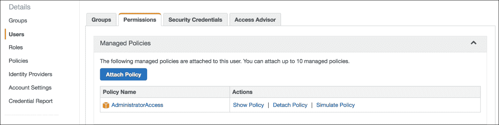

# 第三章：将你的基础设施纳入配置管理

正如上一章结尾所暗示的那样，在我们能够宣称完全实现基础设施即代码（IaC）之前，还需要做一些工作。

第一步是将我们基础设施的硬件部分描述成代码；现在是时候关注它的软件或配置部分了。

假设我们已经配置了几个 EC2 节点，并希望在它们上安装某些软件包，并更新相关的配置文件。在**配置管理**（**CM**）工具流行之前，这类任务通常是由工程师手动执行的，工程师要么按照检查清单操作，要么运行一系列 Shell 脚本，或者两者兼而有之。正如你所想象的那样，这种方法扩展性较差，因为通常意味着一个工程师一次设置一台服务器。

此外，检查清单或脚本：

+   当涉及到配置主机以及在其上运行的完整应用程序栈时，编写脚本是非常困难的。

+   通常是针对特定主机或应用程序的，且不具备很好的可移植性。

+   越是远离最初编写它们的人，理解起来就越困难。

+   构建脚本通常只会在主机配置时执行一次，因此配置会从那时起开始漂移。

幸运的是，现在很少有人使用这些，因为配置管理已经成为一种常见做法。让我们来看一下它的一些好处：

+   CM 使我们能够一次性声明机器的期望状态，然后根据需要反复重现该状态。

+   强大的抽象层处理了环境、硬件和操作系统类型等具体细节，使我们能够编写可重用的 CM 代码。

+   声明的机器状态代码易于阅读、理解和协作。

+   CM 部署可以同时在数十台、数百台或数千台机器上执行。

在 DevOps 时代，有许多 CM 工具可以选择。你可能已经听说过 Puppet、Chef、Ansible、OpsWorks，或者我们将要使用的**SaltStack**（**Salt Open 项目**）。

这些都是成熟且复杂的 CM 解决方案，背后有活跃的社区支持。我很难证明有任何一个比其他的更好，因为它们都能很好地完成工作，各有自己的优缺点。所以，最终选择使用哪一个，通常取决于个人偏好。

无论你最终使用哪个工具，我想强调两点的重要性：命名规范和代码重用性。

在编写代码时遵循命名约定显然是一个优势，因为它能保证其他人理解你的工作时所需的努力更少。然而，除了编写代码，CM 还涉及到对节点执行代码，而这时命名变得尤为重要。想象一下你有四台服务器：**leonardo**、**donatello**、**michelangelo** 和 **raphael**。其中两台是前端层，两台是后端层，于是你坐下来分别为它们编写配置管理清单：*webserver-node* 和 *database-node*。到目前为止，一切都很好，考虑到主机数量，你可以启动你的 CM 工具，并轻松地告诉它在每台机器上运行相应的清单。

现在，想象一下 50 台，然后是 100 台主机，采用类似的扁平命名模式，你就会开始看到问题。当你的基础设施的规模和复杂性增加时，你将需要一种能够自然形成层次结构的主机命名约定。像 *webserver-{0..10}*、*db-{0..5}* 和 *cache-{0..5}* 这样的主机名可以进一步分组为前端和后端，然后以结构化、层次化的方式表示。基于角色或其他属性对节点进行分组的这种方式，在应用配置管理时极为有用。

在开始编写 CM 代码（清单）时，你应该已经开始考虑代码的重用性。你会发现，一般有两种方式来处理这个任务。你可以写一个大型的，例如，包含设置防火墙、一些 CLI 工具、NGINX 和 PHP 的 web 服务器部分，或者你可以将其拆分为更小的部分，比如 iptables、utils、NGINX、PHP 等等。

在我看来，后者的设计在编写清单时增加了一些开销，但重用性的好处是相当可观的。与其为每种服务器类型编写一大堆特定的声明，不如维护一组通用的小声明，并从中挑选出适合当前机器的部分。

举个例子：

```
manifests: everything_a_websrv_needs, everything_for_a_db, cache_main 
nodes: web01, db01, cache01 
CM_execution: web01=(everything_a_websrv_needs), db01=(everything_for_a_db), cache01=(cache_main) 

```

或者更好的方法是：

```
manifests: iptables, utils, nginx, postgresql, redis, php 
nodes: web01, db01, cache01 
CM_execution: web01=(iptables,utils,nginx,php), db01=(iptables,utils,postgresql), cache01=(iptables,utils,redis) 

```

# SaltStack 入门

**SaltStack**（见 [`saltstack.com/`](https://saltstack.com/)），首次发布于 2011 年，是一个自动化套件，提供配置管理以及标准的和/或事件驱动的编排。它通常在主从架构中使用，其中主节点提供跨计算资源的集中控制。得益于用于盐主与从节点之间通信的快速且轻量级的消息总线（**ZeroMQ**），它以其速度和可扩展性而著称。它也可以以无代理的方式使用，在这种方式下，从节点通过 SSH 被控制，这与 Ansible 的操作方式类似。

SaltStack 是用 Python 编写的，且易于扩展。你可以为其编写自己的模块，将长期运行的进程附加到它的事件总线上，并在不寻常的地方注入原始的 Python 代码。

主从模型非常强大，提供了很多灵活性，如果你需要管理的不仅仅是几个开发节点，并且想充分利用 SaltStack 的所有功能，这是推荐的方式。

### 注意

关于如何启动和运行 salt-master 的更多信息可以在这里找到：[`docs.saltstack.com/en/latest/topics/configuration/index.html`](https://docs.saltstack.com/en/latest/topics/configuration/index.html)

在我们的案例中，我们将探索使用 SaltStack 进行配置管理的强大功能，使用独立模式或无主模式。我们将复用上一章中的部分 Terraform 模板，启动一组 EC2 资源，启动一个 SaltStack minion，并让它自行配置，以便提供 Web 应用程序服务。

如果一切顺利，我们最终应该能够在负载均衡器（EC2 ELB）后面配置一个完全设置好的 Web 服务器（EC2 节点）。

这里是我们的任务列表：

1.  准备我们的 SaltStack 开发环境。

1.  编写我们希望 SaltStack 应用到节点的配置。

1.  编写描述我们基础设施的 Terraform 模板。

1.  通过 Terraform 部署基础设施，并让 SaltStack 配置它。

## 准备

SaltStack 配置管理通过以下主要组件进行：

+   **States** 是描述机器期望状态的文件。在这里，我们编写安装包、修改文件、更新权限等操作的指令。

+   **Pillars** 是我们定义变量的文件，帮助让 States 更加便捷和灵活。

+   **Grains** 是在 minion 主机上收集的信息。这些信息包括操作系统、环境、硬件平台等详细信息。

+   **Salt 文件服务器** 存储任何可能在 States 中引用的文件、脚本或其他工件。

+   Salt Top 文件用于将 States 和/或 Pillars 映射到 minions。

在主从模式下，除了 Grains 以外，所有这些组件都将由 salt-master 托管，并提供给 minions（其他后端也受到支持）。

我们计划以无主模式运行 Salt，这意味着我们需要一种方式将任何 States、Pillars 和相关文件从本地环境传输到 minion。Git？好主意。我们将在本地编写所有 Salt 代码，将其推送到 Git 仓库，然后在每个 minion 启动时将其检出。

关于选择 Git 托管解决方案，Github 或 Bitbucket 都是非常优秀的服务，但让我们的 minion EC2 节点访问这些服务需要一些密钥管理。相比之下，**CodeCommit**（AWS 的 Git 解决方案）通过 IAM 角色与 EC2 实例的集成更为顺畅。

让我们首先创建一个新的 IAM 用户和一个 CodeCommit Git 仓库。我们将使用用户的访问密钥来创建仓库，并使用 SSH 密钥克隆并与之工作：

1.  在 AWS 控制台中，创建一个 IAM 用户（记下生成的访问密钥），并将**AWSCodeCommitFullAccess**内置/ **托管** IAM 策略附加到它，如下图所示：

1.  在同一页面上，切换到**安全凭证**选项卡，并点击**上传 SSH 公钥**，如下面的截图所示：

1.  配置`awscli`：

    ```
    $ export AWS_ACCESS_KEY_ID='AKIAHNPFB9EXAMPLEKEY'
    $ export AWS_SECRET_ACCESS_KEY=
         'rLdrfHJvfJUHY/B7GRFTY/VYSRwezaEXAMPLEKEY'
    $ export AWS_DEFAULT_REGION='us-east-1'

    ```

1.  创建一个仓库：

    ```
    $ aws codecommit create-repository --repository-name salt 
          --repository-description "SaltStack repo"
    {
    "repositoryMetadata": {
    "repositoryName": "salt",
    "cloneUrlSsh": "ssh://git-codecommit.us-
         east-1.amazonaws.com/v1/repos/salt",
    "lastModifiedDate": 1465728037.589,
    "repositoryDescription": "SaltStack repo",
    "cloneUrlHttp": 
        "https://git-codecommit.us-east-1.amazonaws.com/v1/repos/salt",
    "creationDate": 1465728037.589,
    "repositoryId": "d0628373-d9a8-44ab-942a-xxxxxx",
    "Arn": "arn:aws:codecommit:us-east-1:xxxxxx:salt",
    "accountId": "xxxxxx"
    }
    }

    ```

1.  在本地克隆新仓库：

    ```
    $ git clone ssh://SSH_KEY_ID@git-codecommit.us-
         east-1.amazonaws.com/v1/repos/salt
    Cloning into 'salt'...
    warning: You appear to have cloned an empty repository.
    Checking connectivity... done.

    ```

在这里，`SSH_KEY_ID`是我们在步骤 2 上传公钥后看到的那个。

### 注意

有关连接到 CodeCommit 的更多选项，请参见[`docs.aws.amazon.com/codecommit/latest/userguide/setting-up.html`](http://docs.aws.amazon.com/codecommit/latest/userguide/setting-up.html)

我们准备开始填充我们空的、新的 Salt 仓库。

# 编写配置管理代码

为了让 SaltStack 帮助我们将节点配置为 Web 服务器，我们需要告诉它这些应该是什么样的。在配置管理术语中，我们需要描述机器的期望状态。

在我们的示例中，我们将使用 SaltStack 状态、Pillars、Grains 和 Top 文件的组合来描述以下过程：

+   创建 Linux 用户帐户

+   安装服务（NGINX 和 PHP-FPM）

+   配置和运行已安装的服务

## 状态

一个状态包含一组我们希望应用于 EC2 从节点的指令。我们将在从节点上使用`/srv/salt/states`作为 Salt 状态树的根目录。状态可以以单个文件的形式存储在其中，例如`/srv/salt/states/mystate.sls`，或者组织成文件夹，如`/srv/salt/states/mystate/init.sls`。稍后，当我们请求执行`mystate`时，Salt 将查找状态树根目录中的`state_name.sls`或`state_name/init.sls`。我觉得第二种方式更整洁，因为它允许将其他与状态相关的文件保存在相关的文件夹中。

我们从管理 Linux 用户帐户的状态开始配置我们的 Web 服务器节点。在我们的 Salt Git 仓库中，我们创建`states/users/init.sls`：

### 注意

请参阅：[`github.com/PacktPublishing/Implementing-DevOps-on-AWS/tree/master/5585_03_CodeFiles/CodeCommit/salt/states/users`](https://github.com/PacktPublishing/Implementing-DevOps-on-AWS/tree/master/5585_03_CodeFiles/CodeCommit/salt/states/users)。

```
    veselin:
      user.present:
        - fullname: Veselin Kantsev
        - uid: {{ salt'pillar.get' }}
        - password: {{ salt'pillar.get' }}
        - groups:
          - wheel

    ssh_auth.present:
      - user: veselin
      - source: salt://users/files/veselin.pub
      - require:
        - user: veselin

    sudoers:
      file.managed:
        - name: /etc/sudoers.d/wheel
        - contents: '%wheel ALL=(ALL) ALL'

```

我们将使用 YAML 编写大多数 Salt 配置。你会注意到在前一部分使用了三种不同的状态模块：

+   `user.present`：此模块确保指定的用户帐户在系统上存在，或在必要时创建该帐户

+   `ssh_auth.present`：用于管理用户 SSH `authorized_keys`文件的模块

+   `file.managed`：用于创建/修改文件的模块

### 注意

SaltStack 的状态模块提供了丰富的功能。有关每个模块的详细信息，请参见[`docs.saltstack.com/en/latest/ref/states/all/`](https://docs.saltstack.com/en/latest/ref/states/all/)

为了避免在`user.present`下硬编码某些值，我们利用了 SaltStack 的 Pillars 系统。我们稍后会查看一个 pillar 文件，但现在只需注意在我们的状态中引用 pillar 值的语法。

这里还有另外两个要点值得关注：我们密钥文件的来源和`require`属性。在这个例子中，`salt://`格式的源地址指向 Salt 文件服务器，默认情况下从状态树中提供文件（有关支持的后端，请参见 [`docs.saltstack.com/en/latest/ref/file_server/`](https://docs.saltstack.com/en/latest/ref/file_server/)）。`require`语句强制执行执行顺序，确保在尝试为其创建`authorized_keys`文件之前，用户帐户已经存在。

### 注意

SaltStack 遵循一种命令式执行模型，直到强制执行自定义顺序时，才会调用声明式模式（见 [`docs.saltstack.com/en/latest/ref/states/ordering.html`](https://docs.saltstack.com/en/latest/ref/states/ordering.html)）。

得益于 YAML 的可读性，人们可以轻松地看出这里发生了什么：

1.  我们创建一个新的 Linux 用户。

1.  我们应用所需的属性（uid、密码、组等）。

1.  我们为其部署一个 SSH `authorized_keys`文件。

1.  我们为用户所在的 wheel 组启用`sudo`。

或许你可以尝试*编辑这个状态*并为自己*添加一个用户*？这在我们部署之后会很有用。

我们现在将继续进行 NGINX 的安装，通过`states/nginx/init.sls`。

### 注意

请参阅：[`github.com/PacktPublishing/Implementing-DevOps-on-AWS/tree/master/5585_03_CodeFiles/CodeCommit/salt/states/nginx`](https://github.com/PacktPublishing/Implementing-DevOps-on-AWS/tree/master/5585_03_CodeFiles/CodeCommit/salt/states/nginx)。

我们使用`pkg.installed`模块安装 NGINX：

`pkg.installed: []`

设置服务在启动时启动（`enable: True`），在可能的情况下启用重新加载而不是重新启动（`reload: True`），确保在运行服务（`service.running:`）之前安装了 NGINX 软件包（`require:`）。

```
    nginx:
      service.running:
        - enable: True
        - reload: True
        - require:
          - pkg: nginx

```

然后放置一个`config`文件（`file.managed:`），确保服务等待这个文件的存在（`require_in:`），并在每次文件更新时重新加载（`watch_in:`）：

```
    /etc/nginx/conf.d/default.conf:
      file.managed:
        - source: salt://nginx/files/default.conf
        - require:
          - pkg: nginx
        - require_in:
          - service: nginx
        - watch_in:
          - service: nginx

```

请注意`require`/`require_in`和`watch`/`watch_in`的配对。每对中每个要求与其`_in`对应物的区别在于它们作用的方向。

例如：

```
    nginx:
      service.running:
        - watch:
          - file: nginx_config
    nginx_config:
      file.managed:
        - name: /etc/nginx/nginx.conf
        - source: salt://...

```

与以下效果相同：

```
    nginx:
      service.running: []
      nginx_config:
      file.managed:
        - name: /etc/nginx/nginx.conf
        - source: salt://...
          - watch_in:
            - service: nginx

```

在这两种情况下，NGINX 服务会在`config`文件更改时重新启动；然而，你可以看到第二种格式在你离开服务块（例如在不同的文件中）时可能会变得非常有用，正如我们将在下一个状态中看到的那样。

添加一些 PHP（`states/php-fpm/init.sls`）：

### 注意

请参阅：[`github.com/PacktPublishing/Implementing-DevOps-on-AWS/tree/master/5585_03_CodeFiles/CodeCommit/salt/states/php-fpm`](https://github.com/PacktPublishing/Implementing-DevOps-on-AWS/tree/master/5585_03_CodeFiles/CodeCommit/salt/states/php-fpm)。

```
    include:
      - nginx

    php-fpm:
      pkg.installed:
        - name: php-fpm
        - require:
          - pkg: nginx

    service.running:
      - name: php-fpm
      - enable: True
      - reload: True
      - require_in:
        - service: nginx...

```

在这里，您可以更好地看到 `_in` 必要条件的有用性。当我们在顶部包含 `nginx` state 后，`require_in` 会确保 `nginx` 在 `php-fpm` 启动之前不会启动。

配置好 NGINX 和 PHP-FPM 后，我们来添加一个简单的测试页面（`states/phptest/init.sls`）。

### 注意

请参阅：[`github.com/PacktPublishing/Implementing-DevOps-on-AWS/tree/master/5585_03_CodeFiles/CodeCommit/salt/states/phptest`](https://github.com/PacktPublishing/Implementing-DevOps-on-AWS/tree/master/5585_03_CodeFiles/CodeCommit/salt/states/phptest)。

我们设置了一些从 Grains 中提取的变量（稍后会详细介绍）：

```
 
 
 
 
 
 
 

```

然后我们部署测试页面并直接向其中添加 `contents`：

```
phptest: 
  file.managed: 
    - name: /var/www/html/index.php 
    - makedirs: True 
    - contents: | 
        <?php 
          echo '<p style="text-align:center;color:red">  
          Hello from {{ grains_ipv4 }}/{{ public_ipv4 }} running PHP ' . 
          phpversion() . ' on {{ grains_os }} {{ grains_osmajorrelease }}.  
          <br> I come with {{ grains_num_cpus }} x {{ grains_cpu_model }}  
          and {{ grains_mem_total }} MB of memory. </p>'; 
          phpinfo(INFO_LICENSE); 
        ?> 

```

我们将在部署后使用此页面检查 NGINX 和 PHP-FPM 是否正常运行。

## Pillars

现在让我们来看一下 Salt 存储变量的主要机制——Pillars。它们是：

+   类似树状的数据结构

+   在 salt-master 上定义/渲染，除非在无主模式下运行，此时它们存在于 minion 上

+   用于在中央位置存储变量，以便 minions 共享（除非它们是无主模式的）

+   有助于保持 States 的可移植性

+   适用于敏感数据（它们也可以进行 GPG 加密；请参见 [`docs.saltstack.com/en/latest/ref/renderers/all/salt.renderers.gpg.html`](https://docs.saltstack.com/en/latest/ref/renderers/all/salt.renderers.gpg.html)）

我们将在 minion 上使用 `/srv/salt/pillars` 作为 Pillar 树的根目录。让我们回到 `users` state，查看以下几行：

```
- uid: {{ salt'pillar.get' }} 
- password: {{ salt'pillar.get' }} 

```

`uid` 和 `password` 属性设置为从名为 `users` 的 pillar 中获取。如果我们检查我们的 Pillar 树，将会找到一个 `/srv/salt/pillars/users.sls` 文件，其中包含：

```
users: 
  veselin: 
    uid: 5001 
    password: '$1$wZ0gQOOo$HEN/gDGS85dEZM7QZVlFz/' 

```

现在可以轻松看到 `users:veselin:password` 在 state 文件中的引用是如何与该 pillar 结构匹配的。

### 注意

有关 pillar 使用的更多详细信息和示例，请参见：[`docs.saltstack.com/en/latest/topics/tutorials/pillar.html`](https://docs.saltstack.com/en/latest/topics/tutorials/pillar.html)

## Grains

与 Pillars 不同，Grains 被认为是静态数据：

+   它们在 minion 端生成，且不会在不同的 minions 之间共享

+   它们包含关于 minion 本身的事实

+   典型示例有 CPU、操作系统、网络接口、内存和内核

+   可以为一个 minion 添加自定义 Grains

我们已经在前面的测试页面（`states/phptest/init.sls`）中很好地使用了 Grains，获取了包括 CPU、内存、网络和操作系统等各种主机详细信息。使用这些数据的另一种方式是在处理多操作系统环境时。我们来看下面的示例：

```
pkg.installed: 
   
    - name: httpd...  
   
    - name: apache2 
  ... 
   

```

如您所见，Grains 与 Pillars 类似，帮助使我们的 States 更加灵活。

## Top 文件

我们现在已经准备好了 States，甚至支持了一些 Pillars，并且理想情况下希望将所有这些应用到主机上，以便进行配置并准备好使用。

在 SaltStack 中，Top 文件提供了 States/Pillars 和它们应该应用的守卫之间的映射关系。我们在状态树和支柱树的根目录中都有一个 Top 文件（`top.sls`）。我们碰巧只有一个环境（base），但我们可以轻松地添加更多（*dev*、*qa*、*prod*）。每个环境都可以有独立的状态和支柱树，以及独立的 Top 文件，这些文件会在运行时编译成一个文件。

### 注意

更多关于多环境设置的信息，请参见 [`docs.saltstack.com/en/latest/ref/states/top.html`](https://docs.saltstack.com/en/latest/ref/states/top.html)。

让我们看看一个 `top.sls` 示例：

```
base: 
  '*': 
    - core_utils 
    - monitoring_client 
      - log_forwarder
  'webserver-*':
    - nginx
    - php-fpm
  'dbserver-*': 
    - pgsql_server 
    - pgbouncer 

```

我们声明在我们的基本（默认）环境中：

+   所有守卫应该安装核心工具集、监控和日志转发代理。

+   匹配 `webserver-*` 的守卫，将获得 `nginx` 和 `php-fpm` 状态（除了之前的三个）。

+   数据库节点应用：三个常见的节点加上 `pgsql_server` 和 `pgbouncer`

当你包含 Pillars、Grains 或这些的混合时，守卫的目标定位变得更加有趣（请参见 [`docs.saltstack.com/en/latest/ref/states/top.html#advanced-minion-targeting`](https://docs.saltstack.com/en/latest/ref/states/top.html#advanced-minion-targeting)）。

通过指定这样的状态/支柱与守卫的关联，从安全角度来看，我们也创建了一个有用的隔离。假设我们的 Pillars 包含敏感数据，那么我们可以通过这种方式限制可以访问这些数据的守卫群体。

回到我们的 Salt 仓库，我们发现有两个 `top.sls` 文件：

+   `salt/states/top.sls`：

```
base: 
  '*': 
    - users 
    - nginx 
    - php-fpm 
    - phptest 

```

+   `salt/pillars/top.sls`：

```
base: 
  '*': 
    - users 

```

我们可以允许自己使用 `*` 作为目标，因为我们在无主模式下运行，实际上我们所有的 States/Pillars 都是针对本地守卫的。

我们通过在守卫配置文件（`/etc/salt/minion.d/masterless.conf`）中设置几个选项来启用此模式。

### 注意

请参考：[`github.com/PacktPublishing/Implementing-DevOps-on-AWS/blob/master/5585_03_CodeFiles/CodeCommit/salt/minion.d/masterless.conf`](https://github.com/PacktPublishing/Implementing-DevOps-on-AWS/blob/master/5585_03_CodeFiles/CodeCommit/salt/minion.d/masterless.conf)。

这些有效地告诉盐守卫进程，Salt 文件服务器、状态树和支柱树都位于本地文件系统中。稍后你将看到如何通过 UserData 部署此配置文件。

### 注意

更多关于运行无主模式的信息，请访问：[`docs.saltstack.com/en/latest/topics/tutorials/standalone_minion.html`](https://docs.saltstack.com/en/latest/topics/tutorials/standalone_minion.html)

这结束了我们的 SaltStack 内部工作会议。当你更熟悉后，你可能想深入了解 Salt 引擎、Beacons、自定义模块和/或 Salt 配方。这些只是项目中不断添加的“忍者”功能的一部分。

在这一阶段，我们已经知道如何使用 Terraform 来部署，现在使用 SaltStack 来进行配置。

# 在配置管理下启动节点（端到端 IaC）

不再耽搁，让我们重新部署旧的 VPC，并在其中配置一个配置管理的 web 服务。

Terraform 将创建 VPC、ELB 和 EC2 节点，然后通过 EC2 UserData 引导 SaltStack 工作流。自然地，我们力求复用尽可能多的代码；然而，我们的下一次部署需要对 TF 模板进行一些修改。

### 注意

请参阅：[`github.com/PacktPublishing/Implementing-DevOps-on-AWS/tree/master/5585_03_CodeFiles/Terraform`](https://github.com/PacktPublishing/Implementing-DevOps-on-AWS/tree/master/5585_03_CodeFiles/Terraform)。

`resources.tf`：

+   这次我们不需要私有子网/路由表、NAT，也不需要 RDS 资源，因此我们已将这些内容移除，使得部署速度稍微加快了一些。

+   我们将使用 IAM 角色授予 EC2 节点访问 CodeCommit 仓库的权限。

    +   我们已声明了角色：

        ```
        resource "aws_iam_role" "terraform-role" {
        name = "terraform-role"path = "/"...

        ```

    +   我们已为该角色添加并关联了一个策略（授予对 CodeCommit 的读取权限）：

        ```
        resource "aws_iam_role_policy" "terraform-policy" {
        name = "terraform-policy"
        role = "${aws_iam_role.terraform-role.id}"...

        ```

    +   我们已为该角色创建并关联了实例配置文件：

        ```
        resource "aws_iam_instance_profile" "terraform-profile" {
        name = "terraform-profile"
        roles = ["${aws_iam_role.terraform-role.name}"]
        ...

        ```

    +   我们已更新 Auto Scaling 启动配置，加入了实例配置文件 ID：

        ```
        resource "aws_launch_configuration" "terraform-lcfg"   
                     {...iam_instance_profile = 
                     "${aws_iam_instance_profile.terraform-profile.id}"
                      ...

        ```

+   我们已更新了 UserData 脚本，加入了部分 SaltStack 引导指令，用于安装 Git 和 SaltStack，检出并部署我们的 Salt 代码，最后运行 Salt：

    ```
       user_data = <<EOF 
       #!/bin/bash 
       set -euf -o pipefail 
       exec 1> >(logger -s -t $(basename $0)) 2>&1 
       # Install Git and set CodeComit connection settings 
       # (required for access via IAM roles) 
       yum -y install git 
       git config --system credential.helper 
       '!aws codecommit credential-helper $@' 
       git config --system credential.UseHttpPath true 
       # Clone the Salt repository 
       git clone https://git-codecommit.us-east-1.amazonaws.com/v1/repos/
       salt/srv/salt; chmod 700 /srv/salt 
       # Install SaltStack 
       yum -y install https://repo.saltstack.com/yum/amazon/
       salt-amzn-repo-latest-1.ami.noarch.rpm 
       yum clean expire-cache; yum -y install salt-minion; 
       chkconfig salt-minion off 
       # Put custom minion config in place (for enabling masterless mode) 
       cp -r /srv/salt/minion.d /etc/salt/ 
       # Trigger a full Salt run 
       salt-call state.apply 
       EOF 
       We have moved our EC2 node (the Auto Scaling group) 
       to a public subnet and allowed incoming SSH traffic 
       so that we can connect and play with Salt on it: 
       resource "aws_security_group" "terraform-ec2" {ingress { 
       from_port = "22" 
       to_port = "22" 
       ...resource "aws_autoscaling_group" "terraform-asg" { 
       ... 
       vpc_zone_identifier = ["${aws_subnet.public-1.id}",
       ... 

    ```

`variables.tf`：

我们已移除所有与 RDS 相关的变量。

`outputs.tf`：

我们已移除与 RDS 和 NAT 相关的输出。

`iam_user_policy.json`：

这份文档很快会派上用场，因为我们需要为部署创建一个新用户。我们已移除 RDS 权限，并从中添加了 IAM 权限。

我们现在准备好进行部署了。飞行前检查：

+   更新了 Terraform 模板

    ### 注意

    请参阅：[`github.com/PacktPublishing/Implementing-DevOps-on-AWS/tree/master/5585_03_CodeFiles/Terraform`](https://github.com/PacktPublishing/Implementing-DevOps-on-AWS/tree/master/5585_03_CodeFiles/Terraform)）这些文件已在我们指定的 terraform 文件夹中本地保存。

+   根据 `iam_user_policy.json` 中的新权限集，创建/更新了我们的 Terraform IAM 账户。

+   确保我们拥有 `terraform ec2 keypair` 的副本（以后用于 SSH 登录）

+   我们的所有 SaltStack 代码已推送到 Salt CodeCommit 仓库中（请参阅：[`git-codecommit.us-east-1.amazonaws.com/v1/repos/salt`](https://git-codecommit.us-east-1.amazonaws.com/v1/repos/salt)）

让我们导出凭据并启动 Terraform：

```
$ export AWS_ACCESS_KEY_ID='user_access_key'
$ export AWS_SECRET_ACCESS_KEY='user_secret_access_key'
$ export AWS_DEFAULT_REGION='us-east-1'$ cd Terraform/$ terraform validate
$ terraform plan...Plan: 15 to add, 0 to change, 0 to destroy.
$ terraform apply...Outputs:
ELB URI = terraform-elb-xxxxxx.us-east-1.elb.amazonaws.com
VPC ID = vpc-xxxxxx

```

请等待 3-5 分钟，直到输出的 `t2.nano` 实例就绪，然后从以下输出的 ELB URI 进行访问：


胜利！

尝试在 `terraform.tfvars` 中增加 *autoscaling-group-minsize* 和 *autoscaling-group-maxsize* 的值，然后重新应用模板。刷新页面后，你应该能看到不同的 IP 地址。

根据前面的测试页面，我们可以合理地相信 Salt 已经成功地引导并应用了我们的 States 配置。

然而，我们确实启用了 SSH 访问，以便能更进一步地实验 Salt，所以让我们开始吧。

我们在测试页面上看到了节点的公共 IP。您可以使用`terraform ec2 keypair`或者默认的`ec2-user` Linux 账户通过 SSH 登录，或者如果您之前在`users/init.sls`状态中为自己创建了一个账户，现在也可以使用它。

一旦连接，我们可以使用`salt-call`命令（以 root 身份）与 Salt 进行本地交互：

+   那么，Pillars 呢：

```
# salt-call pillar.items

```

+   或者让我们看看有什么 Grains 可用：

```
# salt-call grains.items

```

+   运行单独的 States：

```
# salt-call state.apply nginx

```

+   或执行完整的运行，即根据 Top 文件执行所有分配的 States：

```
# salt-call state.apply

```

在尝试了一段时间的新部署后，我猜您会想尝试添加或更改 States/Pillars 或 Salt 代码的其他部分。根据我们之前商定的 IaC 规则，我们做的每个更改都需要通过 Git，但让我们检查一下之后部署这些更改的选项：

+   将更改拉取到每个 minion 并运行`salt-call`

+   配置新的 minions，拉取最新的代码

+   通过 Salt-master 推送更改

很容易看出，第一种选项在我们用于测试的几个节点上会有效，但在大规模使用时很快就会变得难以管理。

每次部署时配置新的 minions 是一个有效的选项，如果更倾向于使用无主 Salt 设置；然而，您需要考虑您环境中部署的频率以及替换 EC2 节点的相关成本。这里值得一提的一个好处是蓝绿部署。通过配置新的 minions 来服务您的代码更改，您可以保留旧的 minions 一段时间，这样可以逐步切换流量，并在需要时安全地回滚。

拥有一个 Salt-master 是我推荐的任何非开发环境的方式。Salt 代码保存在其中，因此您所做的任何 Git 更改，只需要拉取一次。然后，您可以通过 Salt-master 部署已更改的 States/Pillars 到您想要的 minions。您仍然可以对重大版本使用蓝绿部署，或者如果只是一个小的安全修复或可能需要立即传递给所有 minions 的关键更改，您也可以直接部署到当前的 minions。

Salt-master 的另一个强大功能是协调，具体来说是远程执行。通过将所有的 minion 连接到它，salt-master 成为一个指挥中心，从中你可以或多或少地完全控制它们。

在 minions 上执行命令是通过模块完成的，从通用的`cmd.run`模块（本质上允许您运行任意的 shell 命令）到更专业的模块，如`nginx`、`postfix`、`selinux`或`zfs`。正如您在这里看到的，模块列表相当长：[`docs.saltstack.com/en/latest/ref/modules/all/index.html`](https://docs.saltstack.com/en/latest/ref/modules/all/index.html)。

如果你记得之前关于主机名和命名约定的部分，你会更能体会到它们的价值。在此，能够执行如下命令非常方便：

```
salt 'webserver-*' nginx.status  
salt 'db-*' postgres.db_list 

```

你还可以使用 Pillars 和/或 Grains 给你的主机添加标签，以便你可以根据位置、角色、部门或类似的条件进一步将它们分组。

简而言之，以下是 masterless 和 salt-master 布局的一些关键点：

| **Salt Master** | **Masterless** |
| --- | --- |

|

+   一个强大的集中式控制平台（必须得到充分安全保护），允许快速并行地访问庞大的 minions 网络

+   高级功能，如 Salt 引擎、Runners、Beacons、反应器系统

+   API 访问

|

+   无需维护 salt-master 节点

+   没有一个节点提供对其他所有节点的完全访问权限，从某种意义上来说，这更安全

+   更简便的 Salt 操作

+   在初始的 Salt 执行后，minions 可以被视为不可变的

|

对于许多 *FOR LOOP 大师* 来说，像 Salt 这样的并行执行工具非常有吸引力。它允许你以大规模迅速访问节点，无论你是想查询它们的运行时间、重新加载服务，还是在发生威胁警报时通过停止集群中的 sshd 来做出反应。

### 注意

在你离开之前，请记得删除前面示例中使用的任何 AWS 资源（VPC、ELB、EC2、IAM、CodeCommit 等），以避免产生意外费用。

# 总结

在本章中，我们研究了 *基础设施即代码* 的第二部分，即 **配置管理**。

我们了解了 CM 解决方案 SaltStack 的几个不同组件：States、Pillars、Grains 和 Top File。我们学习了如何使用它们以及如何为它们编写代码。

然后，我们将之前使用 Terraform 部署基础设施的知识与使用 SaltStack 配置基础设施的知识结合起来，最终完成了我们的第一次端到端 IaC 部署。

接下来，我们将深入探讨 *持续集成*：它是什么，如何在 AWS 上设置 *CI* 管道。
