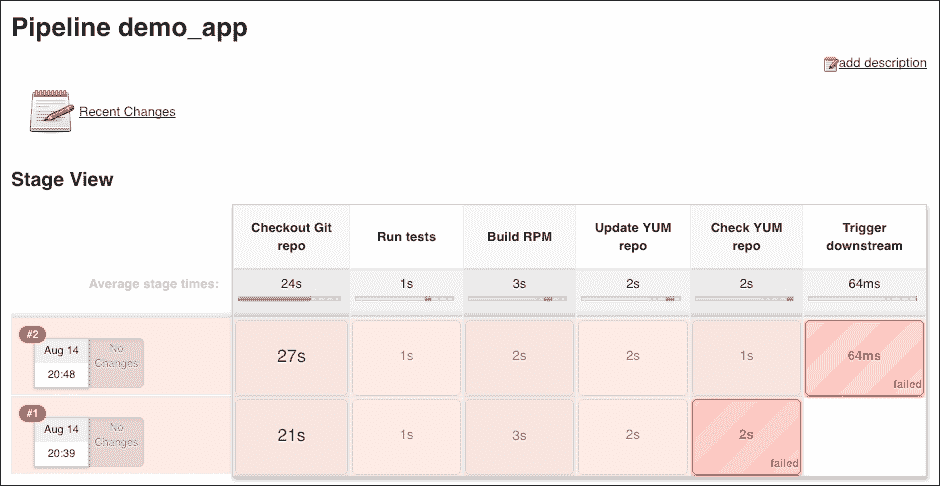

# 第五章：通过持续交付随时准备部署

多亏了我们在上一章中检查的持续集成设置，我们现在可以从源代码中持续生成可部署的工件。

我们的下一个目标是将流水线从持续集成升级为**集成**加**交付**的流水线。为了说明，我们处于一个三阶段的工作流中：


也就是说，在成功的集成运行之后，我们触发交付阶段，执行以下操作：

+   启动一个普通的 EC2 实例

+   应用配置管理：

    +   安装我们生成的`demo-app` RPM

    +   安装其他必要的软件包，将其转化为 web 服务器

+   测试应用的配置（使用**Serverspec**）

+   从配置好的实例生成 AMI（使用**Packer**）

+   从生成的 AMI 启动 EC2 实例

+   对新 EC2 实例运行额外的测试

该流水线将确保应用的 RPM 正确安装，配置管理按预期应用，我们的新 AMI 工件符合目标。最后，我们应该得到一个闪亮的、预先配置好的、生产就绪的 AMI，其中包含我们的`demo-app` web 服务器。

为了完成这些任务，我们将引入两种新工具——Packer 和 Serverspec（详细信息将在后续章节介绍）。

由于我们是在此基础上构建的，我们将能够重用到目前为止的大部分工作。如同之前一样，我们将从准备代码、将其部署到 AWS 并配置 Jenkins Pipeline 开始。

如果你在上一章保持了 AWS 环境运行，可以跳过部分以下步骤。虽然我认为从头开始可能更好，以避免任何混淆。

# 准备 Terraform 模板

除了我们为 Jenkins 所需的常规 VPC、IGW 和子网外，我们还将为 `demo-app` web 服务器场景部署 NAT 和 ELB。

## 资源

### 注意事项

请参考[`github.com/PacktPublishing/Implementing-DevOps-on-AWS/blob/master/5585_05_CodeFiles/Terraform/resources.tf`](https://github.com/PacktPublishing/Implementing-DevOps-on-AWS/blob/master/5585_05_CodeFiles/Terraform/resources.tf)。

我们从 VPC、IGW 和 NAT 开始：

```
resource "aws_vpc" "terraform-vpc" { 
  cidr_block = "${var.vpc-cidr}" 
... 

resource "aws_internet_gateway" "terraform-igw" { 
  vpc_id = "${aws_vpc.terraform-vpc.id}" 
} 

resource "aws_eip" "nat-eip" { 
  vpc = true 
} 

resource "aws_nat_gateway" "terraform-nat" { 
  allocation_id = "${aws_eip.nat-eip.id}" 
  subnet_id = "${aws_subnet.public-1.id}" 
  depends_on = ["aws_internet_gateway.terraform-igw"] 
... 

```

我们为 Jenkins 和 ELB 添加一个`public`子网，并为 EC2 web 服务器添加一个`private`子网：

```
resource "aws_route_table" "public" { 
  vpc_id = "${aws_vpc.terraform-vpc.id}" 
... 
resource "aws_route_table" "private" { 
  vpc_id = "${aws_vpc.terraform-vpc.id}" 
... 

```

接下来是 IAM。我们需要为 Jenkins 创建一个角色：

```
resource "aws_iam_role" "jenkins" { 
    name = "jenkins" 
    path = "/" 
    assume_role_policy = <<EOF 
{ 

```

另一个用于`demo-app` web 服务器的配置：

```
resource "aws_iam_role" "demo-app" { 
    name = "demo-app" 
    path = "/" 
    assume_role_policy = <<EOF 
{ 

```

它们将共享一个公共策略，允许它们访问 CodeCommit（我们将基础设施和应用代码保存在这里）和 S3（我们存储 RPM 工件的地方）：

```
resource "aws_iam_policy" "common" { 
    name = "common" 
    path = "/" 
    policy = <<EOF 
{ 
    "Version": "2012-10-17", 
    "Statement": [ 
       { 
            "Effect": "Allow", 
            "Action": [ 
                "codecommit:Get*", 
                "codecommit:GitPull", 
                "codecommit:List*" 
            ], 
            "Resource": "*" 
       }, 
       { 
            "Effect": "Allow", 
            "NotAction": [ 
                "s3:DeleteBucket" 
            ], 
            "Resource": "*" 
... 

```

新加入的 Packer 将需要一个单独的策略，以允许操作 EC2 资源。我们将使用它来启动/停止/终止实例并创建 AMI：

```
resource "aws_iam_policy" "jenkins" { 
    name = "jenkins" 
    path = "/" 
    policy = <<EOF 
{ 
    "Version": "2012-10-17", 
    "Statement": [ 
       { 
         "Effect": "Allow", 
         "Action": [ 
           "ec2:AttachVolume", 
           "ec2:CreateVolume", 
           "ec2:DeleteVolume", 
           "ec2:CreateKeypair", 
           "ec2:DeleteKeypair", 
           "ec2:DescribeSubnets" 
... 
         "Resource": "*", 
       }, 
       { 
         "Effect": "Allow", 
         "Action": "iam:PassRole", 
         "Resource": ["${aws_iam_role.demo-app.arn}"] 
... 

```

需要允许 `PassRole` 是一个 IAM 安全功能，有助于防止用户/服务授予自己超出应有权限的操作（参见：[`blogs.aws.amazon.com/security/post/Tx3M0IFB5XBOCQX/Granting-Permission-to-Launch-EC2-Instances-with-IAM-Roles-PassRole-Permission`](https://blogs.aws.amazon.com/security/post/Tx3M0IFB5XBOCQX/Granting-Permission-to-Launch-EC2-Instances-with-IAM-Roles-PassRole-Permission)）。

我们需要为 ELB 创建一个安全组，接受来自全球的 HTTP 流量：

```
resource "aws_security_group" "demo-app-elb" { 
  name = "demo-app-elb" 
  description = "ELB security group" 
  vpc_id = "${aws_vpc.terraform-vpc.id}" 

  ingress { 
    from_port = "80" 
    to_port = "80" 
    protocol = "tcp" 
    cidr_blocks = ["0.0.0.0/0"] 
... 

```

然后是 ELB 本身：

```
resource "aws_elb" "demo-app-elb" { 
  name = "demo-app-elb" 
  security_groups = ["${aws_security_group.demo-app-elb.id}"] 
  subnets = ["${aws_subnet.public-1.id}"] 

  listener { 
    instance_port = 80 
    instance_protocol = "http" 
    lb_port = 80 
    lb_protocol = "http" 
... 

```

我们为 Jenkins 创建了一个安全组，允许来自任何地方的 SSH 和 HTTP/S 流量：

```
resource "aws_security_group" "jenkins" { 
  name = "jenkins" 
  description = "ec2 instance security group" 
  vpc_id = "${aws_vpc.terraform-vpc.id}" 

ingress { 
    from_port = "80" 
    to_port = "80" 
    protocol = "tcp" 
    cidr_blocks = ["0.0.0.0/0"] 
  } 

  ingress { 
    from_port = "443" 
    to_port = "443" 
    protocol = "tcp" 
    cidr_blocks = ["0.0.0.0/0"] 
... 

```

接下来的部分是针对 Web 服务器，接受来自 ELB 的 HTTP 请求以及来自 Jenkins 的 SSH 请求：

```
resource "aws_security_group" "demo-app" { 
  name = "demo-app" 
  description = "ec2 instance security group" 
  vpc_id = "${aws_vpc.terraform-vpc.id}" 

  ingress { 
    from_port = "80" 
    to_port = "80" 
    protocol = "tcp" 
    security_groups = ["${aws_security_group.demo-app-elb.id}"] 
  } 

  ingress { 
    from_port = "22" 
    to_port = "22" 
    protocol = "tcp" 
    security_groups = ["${aws_security_group.jenkins.id}"] 
... 

```

为了启动 Jenkins 节点，我们需要使用以前的用户数据，并做一个重要的修改：

```
resource "aws_instance" "jenkins" { 
... 
    user_data = <<EOF 
... 
# Install SaltStack 
yum -y install https://repo.saltstack.com/yum/amazon/salt-amzn-repo-latest-1.ami.noarch.rpm 
yum clean expire-cache; yum -y install salt-minion; chkconfig salt-minion off 
# Put custom minion config in place (for enabling masterless mode) 
cp -r /srv/salt/minion.d /etc/salt/ 
echo -e 'grains:\n roles:\n  - jenkins' > /etc/salt/minion.d/grains.conf 
... 

```

你会注意到，在我们安装 SaltStack 并配置好无主从节点（masterless minion）后，我们还添加了一个自定义的 Grains 文件。它包含的角色列表将帮助我们稍后分配 Salt States（因为我们现在将有两种不同类型的主机在配置管理下：`jenkins` 和我们的 `demo-app` Web 服务器）。

## 变量

### 注意

请参考 [`github.com/PacktPublishing/Implementing-DevOps-on-AWS/blob/master/5585_05_CodeFiles/Terraform/variables.tf`](https://github.com/PacktPublishing/Implementing-DevOps-on-AWS/blob/master/5585_05_CodeFiles/Terraform/variables.tf)。

与 第四章 相同，*通过持续集成加速构建、测试和发布*，我们只设置了几个与 VPC 和 EC2（Jenkins）相关的变量。

## 变量（值）

### 注意

请参考 [`github.com/PacktPublishing/Implementing-DevOps-on-AWS/blob/master/5585_05_CodeFiles/Terraform/terraform.tfvars`](https://github.com/PacktPublishing/Implementing-DevOps-on-AWS/blob/master/5585_05_CodeFiles/Terraform/terraform.tfvars)。

和我们之前的部署一样，我们指定了 VPC 和 Jenkins 变量的值。

## 输出

### 注意

请参考 [`github.com/PacktPublishing/Implementing-DevOps-on-AWS/blob/master/5585_05_CodeFiles/Terraform/outputs.tf`](https://github.com/PacktPublishing/Implementing-DevOps-on-AWS/blob/master/5585_05_CodeFiles/Terraform/outputs.tf)。

一些新的 `outputs` 反映了额外的 `resources`。ELB 端点和我们私有子网的 ID 以及 `demo-app` 安全组：

```
output "ELB URI" { 
  value = "${aws_elb.demo-app-elb.dns_name}" 
} 
output "Private subnet ID" { 
  value = "${aws_subnet.private-1.id}" 
} 
output "Demo-app secgroup" { 
  value = "${aws_security_group.demo-app.id}"  
} 

```

这当然不是一个详尽无遗的列表，如果以后需要更多的信息，我们可以随时通过 `terraform show` 命令检索到我们部署的基础设施的详细描述。

# 准备 Salt 代码

我们将使用 SaltStack 在 Jenkins 和 `demo-app` Web 服务器节点上应用配置管理。我们将使用 Grains 来定义哪些 States/Pillars 应用于哪些主机。让我们来看看代码：

## 状态

### 注意

请参考 [`github.com/PacktPublishing/Implementing-DevOps-on-AWS/tree/master/5585_05_CodeFiles/CodeCommit/salt/states`](https://github.com/PacktPublishing/Implementing-DevOps-on-AWS/tree/master/5585_05_CodeFiles/CodeCommit/salt/states)。

### top.sls

`top` 文件告诉我们，某些状态是所有主机/角色之间共享的，而其他状态则根据角色分配：

```
base: 
  '*': 
    - users 
    - yum-s3 

  'roles:jenkins': 
    - match: grain 
    - jenkins 
    - nginx.jenkins 
    - docker 
    - packer 

  'roles:demo-app': 
    - match: grain 
    - php-fpm 
    - nginx.demo-app 
    - demo-app 

```

你已经熟悉了用户和 `yum-s3` States。现在是时候为自己添加一个帐户和 SSH 密钥了。

### jenkins

我们安装与之前相同的服务，并增加了一些额外的工具：

```
jenkins_prereq: 
  pkg.installed: 
    - pkgs: 
... 
      - jq 
      - httpd-tools 
... 

```

我们将使用 `jq` 来解析 JSON 输出，并使用来自 `httpd-tools` 包的 `ab` 进行基本的 HTTP 负载测试。

### nginx

这一次我们将 NGINX 状态分成三部分：

**init.sls**

这将安装主要的包并设置服务守护进程：

```
nginx: 
  pkg.installed: [] 

  service.running: 
    - enable: True 
    - reload: True 
    - require: 
      - pkg: nginx 

```

**jenkins.sls**

这将部署 NGINX 配置和为 Jenkins 服务所需的相关文件：

```
include: 
  - nginx 

/etc/nginx/conf.d/jenkins.conf: 
  file.managed: 
    - source: salt://nginx/files/jenkins.conf 
... 

```

**demo-app.sls**

这将部署 NGINX 配置和为 `demo-app` Web 服务器所需的相关文件：

```
include: 
  - nginx 

/etc/nginx/conf.d/demo-app.conf: 
  file.managed: 
    - source: salt://nginx/files/demo-app.conf 

```

在这两种情况下，我们都包含了 `init.sls`，也就是 NGINX，它提供了共享功能，Docker 保持不变，而 Packer 是一个新的新增功能，我们很快就可以开始使用：

```
packer: 
  archive.extracted: 
    - name: /opt/ 
    - source: 'https://releases.hashicorp.com/packer/0.10.1/packer_0.10.1_linux_amd64.zip' 
    - source_hash: md5=3a54499fdf753e7e7c682f5d704f684f 
    - archive_format: zip 
    - if_missing: /opt/packer 

  cmd.wait: 
    - name: 'chmod +x /opt/packer' 
    - watch: 
      - archive: packer 

```

archive 模块方便地为我们下载并解压了 Packer 的 zip 文件。之后，我们通过 `cmd.wait` 确保二进制文件是可执行的，`cmd.wait` 在包更改时触发（即监视 archive）。

**php-fpm**

我们需要 PHP 才能提供我们的 PHP `application`（`demo-app`）：

```
include: 
  - nginx 

php-fpm: 
  pkg.installed: 
    - name: php-fpm 
    - require: 
      - pkg: nginx 

  service.running: 
    - name: php-fpm 
    - enable: True 
    - reload: True 
    - require_in: 
      - service: nginx 
... 

```

最后是 `demo-app` 状态，它安装了一个选定版本的应用程序 `rpm`。我们稍后会讨论如何填充 `/tmp/APP_VERSION`：

```
 

include: 
  - nginx 

demo-app: 
  pkg.installed: 
    - name: demo-app 
    - version: {{ APP_VERSION }} 
    - require_in: 
      - service: nginx 

```

## Pillars

### 注意

请参考 [`github.com/PacktPublishing/Implementing-DevOps-on-AWS/tree/master/5585_05_CodeFiles/CodeCommit/salt/pillars`](https://github.com/PacktPublishing/Implementing-DevOps-on-AWS/tree/master/5585_05_CodeFiles/CodeCommit/salt/pillars)。

我们将重用上一章中的 `nginx` 和 `users` Pillars。

## Minion 配置

### 注意

请参考 [`github.com/PacktPublishing/Implementing-DevOps-on-AWS/tree/master/5585_05_CodeFiles/CodeCommit/salt/minion.d`](https://github.com/PacktPublishing/Implementing-DevOps-on-AWS/tree/master/5585_05_CodeFiles/CodeCommit/salt/minion.d)。

虽然 `masterless.conf` 保持不变，但我们正在通过 UserData 为 Jenkins 设置一个自定义角色的 Grain，并通过配置文件为 `demo-app` Web 服务器设置（稍后在章节中讨论）。

# 准备 Jenkins 代码

在我们继续进行 Jenkins 配置之前，允许我介绍两个新的助手——Packer 和 Serverspec。

## Packer

### 注意

请参考 [`github.com/PacktPublishing/Implementing-DevOps-on-AWS/tree/master/5585_05_CodeFiles/CodeCommit/demo-app-cdelivery/packer`](https://github.com/PacktPublishing/Implementing-DevOps-on-AWS/tree/master/5585_05_CodeFiles/CodeCommit/demo-app-cdelivery/packer)。

如所描述：

|   | *“Packer 是一个用于从单一源配置创建多个平台的机器和容器镜像的工具。”* |   |
| --- | --- | --- |
|   | --*https://www.packer.io* |

本质上，Packer 将为我们“打包”内容。我们将向它提供一个模板，基于该模板，它将启动一个 EC2 实例，执行请求的任务（通过 SSH），然后从中创建一个 AMI。Packer 可以与多个平台（如 AWS、GCE、OpenStack 等）进行交互，通过本地 shell、远程（SSH）、Salt、Ansible、Chef 等工具来配置资源。作为 HashiCorp 的产品，Packer 使用的模板系统与 Terraform 类似，这并不令人惊讶。

### demo-app.json

在这里，我们定义了要配置的内容及其配置方式。首先，我们设置了我们的 `variables`：

```
  "variables": { 
    "srcAmiId": null, 
    "amiName": null, 
    "sshUser": null, 
    "instanceProfile": null, 
    "subnetId": null, 
    "vpcId": null, 
    "userDataFile": null, 
    "appVersion": null 
  } 
... 

```

我们已经将实际的值导出到一个 `variables` 文件中（稍后会提到）。在此将某个值设置为 null，将使其变为必填项。我们还可以在此处固定值或使用环境变量（参考 [`www.packer.io/docs/templates/user-variables.html`](https://www.packer.io/docs/templates/user-variables.html)）。定义后，你可以通过以下语法引用变量：``{{user `srcAmiId`}}``。

接下来的部分列出了 `builders`，在我们的情况下是 AWS EC2：

```
  "builders": [{ 
    "type": "amazon-ebs", 
    "region": "us-east-1", 
    "source_ami": "{{user `srcAmiId`}}", 
    "instance_type": "t2.nano", 
    "ssh_username": "{{user `sshUser`}}", 
    "ami_name": "{{user `amiName`}}-{{timestamp}}", 
    "iam_instance_profile": "{{user `instanceProfile`}}", 
    "subnet_id": "{{user `subnetId`}}", 
    "vpc_id": "{{user `vpcId`}}", 
    "user_data_file": "{{user `userDataFile`}}", 
    "run_tags": { 
      "Name": "Packer ({{user `amiName`}}-{{timestamp}})", 
      "CreatedBy": "Jenkins" 
      }, 
    "tags": { 
      "Name": "{{user `amiName`}}-{{timestamp}}", 
      "CreatedBy": "Jenkins" 
      } 
  }] 

```

我们要求在 US-East-1 区域创建一个基于 EBS 的 nano 实例。该实例将通过 UserData 引导（稍后在文中介绍），并标记为 `"CreatedBy": "Jenkins"`。

自然地，在启动实例后，我们希望对其进行配置：

```
"provisioners": [ 
    { 
      "type": "shell", 
      "inline": [  
        "echo 'Waiting for the instance to fully boot up...'", 
        "sleep 30" , 
        "echo "Setting APP_VERSION to {{user `appVersion`}}"", 
        "echo "{{user `appVersion`}}" > /tmp/APP_VERSION" 
        ] 
    } 

```

在这里，我们的第一个 `provisioners` 是一个通过 SSH 由 Packer 执行的 shell 命令（参考 [`www.packer.io/docs/provisioners/shell.html`](https://www.packer.io/docs/provisioners/shell.html)）。它会暂停 30 秒，以便节点完成启动过程，然后创建 Salt `php-fpm` State 所需的 `APP_VERSION` 文件。

接下来，我们运行 SaltStack：

```
{ 
      "type": "salt-masterless", 
      "skip_bootstrap": true, 
      "local_state_tree": "salt/states", 
      "local_pillar_roots": "salt/pillars" 
} 

```

Packer 已经知道如何通过 salt-masterless `provisioner` 运行 Salt。它只需要 States 和 Pillars 的来源（参考： [`www.packer.io/docs/provisioners/salt-masterless.html`](https://www.packer.io/docs/provisioners/salt-masterless.html)）。我们定义了 `salt/` 的相对路径，该路径是一个已检出的 Git 仓库的一部分（见 `demo-app-cdelivery`）。我们选择通过 UserData 安装 Salt，因此设置了 `skip_bootstrap: true`。

我们稍后会介绍 Serverspec，但这就是我们如何运行它的方式：

```
{ 
      "type": "file", 
      "source": "serverspec", 
      "destination": "/tmp/" 
}, 
{ 
      "type": "shell", 
      "inline": [  
        "echo 'Installing Serverspec tests...'", 
        "sudo gem install --no-document rake serverspec", 
        "echo 'Running Serverspec tests...'", 
        "cd /tmp/serverspec && sudo /usr/local/bin/rake spec" 
  ] 
} 

```

`provisioners` 文件用于在远程实例和 Packer 之间传输数据（参考 [`www.packer.io/docs/provisioners/file.html`](https://www.packer.io/docs/provisioners/file.html)）。我们将本地的 `"serverspec/"` 文件夹（其中包含我们的 Serverspec 测试）推送到远程的`"/tmp"`目录。然后，运行一些 shell 命令来安装 Serverspec Ruby gem 并执行测试。

### demo-app_vars.json

我们之前定义的变量值（另外，你也可以将其设置为一组`-var 'key=value'`命令行参数）：

```
{  
  "srcAmiId": "ami-6869aa05", 
  "amiName": "demo-app", 
  "sshUser": "ec2-user", 
  "instanceProfile": "demo-app", 
  "subnetId": "subnet-4d1c2467", 
  "vpcId": "vpc-bd6f0bda", 
  "userDataFile": "packer/demo-app_userdata.sh" 
} 

```

### demo-app_userdata.sh

用于引导测试实例的 EC2 UserData：

```
#!/bin/bash 

set -euf -o pipefail 
exec 1> >(logger -s -t $(basename $0)) 2>&1 

# Install SaltStack 
yum -y install https://repo.saltstack.com/yum/amazon/salt-amzn-repo-latest-1.ami.noarch.rpm 
yum clean expire-cache; yum -y install salt-minion; chkconfig salt-minion off 

# Put custom grains in place 
echo -e 'grains:\n roles:\n  - demo-app' > /etc/salt/minion.d/grains.conf 

```

与我们为 Jenkins 使用的类似。它安装了 SaltStack 并设置了角色 Grain。

## Serverspec

### 注意

请参考 [`github.com/PacktPublishing/Implementing-DevOps-on-AWS/tree/master/5585_05_CodeFiles/CodeCommit/demo-app-cdelivery/serverspec`](https://github.com/PacktPublishing/Implementing-DevOps-on-AWS/tree/master/5585_05_CodeFiles/CodeCommit/demo-app-cdelivery/serverspec)。

直接从首页开始：

|   | *“适用于通过 CFEngine、Puppet、Ansible、Itamae 或其他任何方式配置的服务器的 RSpec 测试。通过 Serverspec，您可以编写 RSpec 测试来检查您的服务器是否正确配置。Serverspec 通过本地执行命令、通过 SSH、WinRM、Docker API 等方式测试服务器的实际状态。所以您无需在服务器上安装任何代理软件，并且可以使用任何配置管理工具，Puppet、Ansible、CFEngine、Itamae 等等。但 Serverspec 的真正目标是帮助重构基础设施代码。”* |   |
| --- | --- | --- |
|   | --*http://serverspec.org* |

我们将使用 Serverspec 来验证在完成所有其他配置任务后 EC2 实例的最终状态。这有助于验证任何非配置管理的更改是否生效（例如，shell 命令），并确保配置管理已正确应用（例如，状态中没有竞争条件/重叠/冲突）。这确实会引入一些额外开销，有些人可能会质疑除了 SaltStack 执行外是否还需要它，因此这仍然是个人偏好。我将其视为第二层验证或安全网。

在 `serverspec/` 文件夹下的内容是通过运行 `serverspec-init` 创建的（请参考 [`serverspec.org`](http://serverspec.org)），选择 UNIX，然后选择 SSH。我们将示例的 `spec.rb` 文件替换为自己的：

### spec/localhost/demo-app_spec.rb

```
require 'spec_helper' 

versionFile = open('/tmp/APP_VERSION') 
appVersion = versionFile.read.chomp 

describe package("demo-app-#{appVersion}") do 
  it { should be_installed } 
end 

describe service('php-fpm') do 
  it { should be_enabled } 
  it { should be_running } 
end 

describe service('nginx') do 
  it { should be_enabled } 
  it { should be_running } 
end 

describe user('veselin') do 
  it { should exist } 
  it { should have_authorized_key 'ssh-rsa ...' } 
end 

```

Serverspec 对支持的资源类型执行测试（请参考 [`serverspec.org/resource_types.html`](http://serverspec.org/resource_types.html)）。

在前面的简短示例中，我们断言：

+   我们的 `demo-app` 包的特定版本已被安装

+   PHP-FPM 和 NGINX 正在运行并在启动时启用

+   给定用户的 SSH `authorized_keys` 文件包含预期内容

我们可以从包含文件夹运行 Serverspec 测试，方法如下：

```
cd /tmp/serverspec && sudo /usr/local/bin/rake spec

```

它将解析所有以 `_spec.rb` 结尾的文件。我们仅使用 `sudo`，因为在这种情况下，我们尝试读取一个私密文件（`authorized_keys`）。

回到 Jenkins。我们已经熟悉 `Jenkinsfile` 的概念（如我们的集成作业中使用的）。在这个示例中，我们将使用相同的方法添加第二个（交付）管道。

让我们来检查这两个管道作业。

## demo-app

### 注意

请参考[`github.com/PacktPublishing/Implementing-DevOps-on-AWS/blob/master/5585_05_CodeFiles/CodeCommit/demo-app/Jenkinsfile`](https://github.com/PacktPublishing/Implementing-DevOps-on-AWS/blob/master/5585_05_CodeFiles/CodeCommit/demo-app/Jenkinsfile)。

这是我们旧的集成作业，下载应用代码，针对它运行测试，生成 RPM 包并将包上传到 YUM 仓库。我们将为这个过程添加一个新阶段：

```
stage "Trigger downstream" 
    build job: "demo-app-cdelivery", 
    parameters: [[$class: "StringParameterValue", name: "APP_VERSION", value: 
    "${gitHash}-1"]], wait: false 

```

最后阶段触发了我们的下一个作业，即 Delivery 流水线，并将`APP_VERSION`参数传递给它。

该参数的值是`gitHash`，我们一直用它作为`demo-app RPM 包`的版本字符串。

你看到的`gitHash`后面附加的`-1`表示 rpm 的次版本号，你现在可以放心忽略它。

将`wait`设置为`false`意味着我们不希望保持当前作业运行，等待随后触发的作业完成。

## demo-app-cdelivery

### 注意

请参考[`github.com/PacktPublishing/Implementing-DevOps-on-AWS/blob/master/5585_05_CodeFiles/CodeCommit/demo-app-cdelivery/Jenkinsfile`](https://github.com/PacktPublishing/Implementing-DevOps-on-AWS/blob/master/5585_05_CodeFiles/CodeCommit/demo-app-cdelivery/Jenkinsfile)。

现在进入有趣的部分。Delivery 作业已传递`APP_VERSION`并准备启动，让我们按照`Jenkinsfile`中描述的流程进行操作。

我们从清理工作区开始，检出`demo-app-cdelivery`仓库，然后在其上添加 SaltStack 代码。我们需要这两个代码库，以便启动一个实例并配置它作为 Web 服务器：

```
#!groovy 

node { 

  step([$class: 'WsCleanup']) 

  stage "Checkout Git repo" 
    checkout scm 

  stage "Checkout additional repos" 
    dir("salt") { 
      git "https://git-codecommit.us-east-1.amazonaws.com/v1/repos/salt" 
    } 

```

之后，我们准备运行 Packer：

```
stage "Run Packer" 
    sh "/opt/packer validate -var="appVersion=$APP_VERSION" -var-file=packer/demo-app_vars.json packer/demo-app.json" 
    sh "/opt/packer build -machine-readable -var="appVersion=$APP_VERSION" -var-file=packer/demo-app_vars.json packer/demo-app.json | tee packer/packer.log" 

```

首先，我们验证模板，然后执行，要求输出机器可读的结果。Packer 将启动一个实例，通过 SSH 连接，应用所有相关的 Salt States，运行 Serverspec 测试，并生成一个 AMI，这个 AMI 本质上是一个已经安装了`demo-app`及其所有前置条件的 Web 服务器。

然后，我们继续启动第二个 EC2 实例；这次使用我们刚刚创建的 AMI：

```
stage "Deploy AMI" 
    def amiId = sh returnStdout: true, script:"tail -n1 packer/packer.log | awk '{printf \$NF}'" 
    def ec2Keypair = "terraform" 
    def secGroup = "sg-2708ef5d" 
    def instanceType = "t2.nano" 
    def subnetId = "subnet-4d1c2467" 
    def instanceProfile = "demo-app" 
    echo "Launching an instance from ${amiId}" 
    sh "aws ec2 run-instances \ 
        --region us-east-1 \ 
        --image-id ${amiId} \ 
        --key-name ${ec2Keypair} \ 
        --security-group-ids ${secGroup} \ 
        --instance-type ${instanceType} \ 
        --subnet-id ${subnetId} \ 
        --iam-instance-profile Name=${instanceProfile} \ 
        | tee .ec2_run-instances.log \ 
       " 
    def instanceId = sh returnStdout: true, script: "printf \$(jq .Instances[0].InstanceId < .ec2_run-instances.log)" 

```

顶部看到的变量是我们从 Terraform 获取的（`terraform show`）。

我们使用`aws cli`在私有 VPC 子网内启动实例，附加`demo-app`安全组、Terraform 密钥和`demo-app`实例配置文件。你会注意到，这里不需要传递任何 EC2 凭证，因为 Jenkins 已经通过我们之前分配给它的 IAM 角色获得授权。

接下来，我们通过解析`aws cli`的 JSON 输出并使用`jq`来获取`instanceId`（参考[`stedolan.github.io/jq`](https://stedolan.github.io/jq)）。

在我们启动实例之后，我们为其设置标签，注册到 ELB，并循环直到其 ELB 状态变为`InService`：

```
sh "aws ec2 create-tags --resources ${instanceId} \ 
        --region us-east-1 \ 
        --tags Key=Name,Value="Jenkins (demo-app-$APP_VERSION)" 
        Key=CreatedBy,Value=Jenkins \ \ 
       " 

    echo "Registering with ELB" 
    def elbId = "demo-app-elb" 
    sh "aws elb register-instances-with-load-balancer \ 
        --region us-east-1 \ 
        --load-balancer-name ${elbId} \ 
        --instances ${instanceId} \ 
       " 

    echo "Waiting for the instance to come into service" 
    sh "while [ "x\$(aws elb describe-instance-health --region us-east-1 --load-
    balancer-name ${elbId} --instances ${instanceId} | 
    jq .InstanceStates[].State | tr -d '"')" != "xInService" ]; do : ; sleep 60; 
    done" 

```

现在节点已经准备好服务，我们可以使用 AB 工具启动我们即兴设计的负载测试：

```
  stage "Run AB test" 
    def elbUri = "http://demo-app-elb-1931064195.us-east-1.elb.amazonaws.com/"   
    sh "ab -c5 -n1000 -d -S ${elbUri} | tee .ab.log" 
    def non2xx = sh returnStdout: true, script:"set -o pipefail;(grep 'Non-2xx' .ab.log | awk '{printf \$NF}') || (printf 0)" 
    def writeErr = sh returnStdout: true, script:"grep 'Write errors' .ab.log | awk '{printf \$NF}'" 
    def failedReqs = sh returnStdout: true, script:"grep 'Failed requests' .ab.log | awk '{printf \$NF}'" 
    def rps = sh returnStdout: true, script:"grep 'Requests per second' .ab.log | awk '{printf \$4}' | awk -F. '{printf \$1}'" 
    def docLen = sh returnStdout: true, script:"grep 'Document Length' .ab.log | awk '{printf \$3}'" 

    echo "Non2xx=${non2xx}, WriteErrors=${writeErr}, FailedReqs=${failedReqs}, ReqsPerSec=${rps}, DocLength=${docLen}" 
    sh "if [ ${non2xx} -gt 10 ] || [ ${writeErr} -gt 10 ] || [ ${failedReqs} -gt 10 ] || [ ${rps} -lt 1000 ] || [ ${docLen} -lt 10 ]; then \ 
          echo "ERR: AB test failed" | tee -a .error.log; \ 
        fi \ 
       " 

```

在 AB 测试结束时，各种报告的指标将与预设的阈值进行比较并记录。

不再需要 EC2 实例，因此可以终止：

```
 stage "Terminate test instance" 
    sh "aws ec2 terminate-instances --region us-east-1 --instance-ids ${instanceId}" 

```

在最后阶段，任务的退出代码由 AB 测试结果决定：

```
  stage "Verify test results" 
    sh "if [ -s '.error.log' ]; then \ 
          cat '.error.log'; \ 
          :> '.error.log'; \ 
          exit 100; \ 
        else \ 
          echo 'Tests OK'; \ 
        fi \ 
       " 

```

# 准备 CodeCommit 仓库

理想情况下，我们会将所有前述代码放入版本控制中，因此我们需要创建一些仓库。我们需要一个具有足够权限的 IAM 用户来执行此操作：

### 注意

请参阅 [`github.com/PacktPublishing/Implementing-DevOps-on-AWS/blob/master/5585_05_CodeFiles/CodeCommit/demo-app-cdelivery/Jenkinsfile`](https://github.com/PacktPublishing/Implementing-DevOps-on-AWS/blob/master/5585_05_CodeFiles/CodeCommit/demo-app-cdelivery/Jenkinsfile)。

```
{ 
    "Version": "2012-10-17", 
    "Statement": [ 
      { 
          "Effect": "Allow", 
          "NotAction": [ 
              "codecommit:DeleteRepository" 
          ], 
          "Resource": "*" 
      }, 
      { 
          "Effect": "Allow", 
          "NotAction": [ 
              "s3:DeleteBucket" 
          ], 
          "Resource": "*" 
      }, 
      { 
          "Sid": "Stmt1461764665000", 
          "Effect": "Allow", 
          "Action": [ 
              "ec2:AllocateAddress", 
              "ec2:AssociateAddress", 
... 

```

我们创建一个具有前述策略的 `terraform` IAM 用户，授予我们执行 CodeCommit 任务的权限，并且稍后也能进行 Terraform 部署（记得写下 API 密钥）。

请参阅上一章了解如何导出 API 密钥并创建三个 CodeCommit 仓库：`salt`、`demo-app` 和 `demo-app-cdelivery`。

你需要在本地克隆仓库，并分别用我们之前准备的代码填充每个仓库（参见：[`github.com/PacktPublishing/Implementing-DevOps-on-AWS/tree/master/5585_05_CodeFiles/CodeCommit`](https://github.com/PacktPublishing/Implementing-DevOps-on-AWS/tree/master/5585_05_CodeFiles/CodeCommit)）。

# 部署 Terraform 模板

创建一个 `terraform` EC2 密钥对，然后在 Terraform 模板文件夹中运行 terraform plan、terraform validate，最后运行 terraform apply（如果需要，请参考上一章了解如何执行这些操作）。

# 初始化 Jenkins

一旦 Terraform 完成部署，你将获得 Jenkins EIP 值输出。对其进行主机名查找并在浏览器中加载得到的地址。你应该能看到**入门**页面（截图和说明见上一章）：

+   解锁 Jenkins

+   安装推荐的插件

+   创建管理员用户

# 配置 Jenkins 任务

在重新创建持续集成管道任务之前，我们需要一个用于 YUM 仓库的 S3 存储桶。创建一个存储桶（除非你保留了旧的存储桶），然后相应更新 `demo-app/Jenkinsfile` 脚本，提交并推送 Git 更改到上游。

## demo-app 管道

请参阅上一章的*设置管道*步骤，创建持续集成任务。这次我们称之为 `demo-app`。脚本路径保持不变（[`git-codecommit.us-east-1.amazonaws.com/v1/repos/demo-app`](https://git-codecommit.us-east-1.amazonaws.com/v1/repos/demo-app)）。

你现在应该有这个：


由于我们还没有配置 YUM 仓库，管道将会失败：


第一个作业运行已经将代码库内容上传到 S3。现在，我们需要更新`salt/states/yum-s3/files/s3.repo`文件，加入 S3 URL，并将仓库设置为`enabled`。提交并推送 Salt 更改到 Git 仓库，然后在 Jenkins 节点上拉取并应用这些更改。

随后的管道运行让我们更进一步：



这次的失败是因为我们的下游作业尚未准备好。我们接下来修复这个问题。

## demo-app-cdelivery 管道

从 Jenkins 的仪表盘中，我们选择**新建项目**：


我们将其称为`demo-app-cdelivery`：


这个作业将由另一个作业触发，因此无需轮询 SCM。此外，我们将一个参数传递到这个管道中：


最后，我们设置了`Jenkinsfile`的位置（[`git-codecommit.us-east-1.amazonaws.com/v1/repos/demo-app-cdelivery`](https://git-codecommit.us-east-1.amazonaws.com/v1/repos/demo-app-cdelivery)）：


你还记得我们在 Packer 的`variables`文件中指定的 VPC 详情，以及在这个管道中的`Jenkinsfile`吗？我们需要将它们设置为匹配当前的 VPC：

+   更新`packer/demo-app_vars.json`中的变量

    +   `srcAmiId`可以是最新的 AmazonLinux AMI

    +   `subnetId`是私有子网的 ID

    +   `vpcId`

+   更新`demo-app-cdelivery/Jenkinsfile`：

    +   在**部署 AMI**阶段：

        +   `secGroup`是`demo-app`安全组的 ID

        +   `subnetId`是前面提到的私有 VPC 子网的 ID

    +   在**运行 AB 测试**阶段

        +   `elbUri`是`demo-app-elb` ELB 的端点地址

+   提交并推送你的更改。

在这里，我们准备好了两个管道，准备开始执行：


让我们通过更改`demo-app/src/index.php`中的`$full_name`来触发`demo-app`运行。你应该会在检测到 Git 更改后看到它运行。运行结束时，它应该会触发下游的`demo-app-cdelivery`管道，再过大约 10 分钟，你应该能看到一个全新的`demo-app AMI`等待你（查看 AWS 控制台）。

### 注意

请记得删除示例中使用的任何 AWS 资源（VPC、EC2、S3、IAM、CodeCommit 等），以避免不必要的费用。

# 概要

在本章中，我们扩展了 Jenkins 管道，以便在 VPC 环境中的 EC2 实例上部署和测试我们的应用程序工件。你学会了如何使用 Packer 模板化实例的配置，并且如何使用 Serverspec 进行额外的基础设施验证。

在下一章中，我们将通过添加持续部署元素来完成 Jenkins 管道的设置。我们将探讨如何将交付阶段创建的 AMI 部署到生产环境中。
