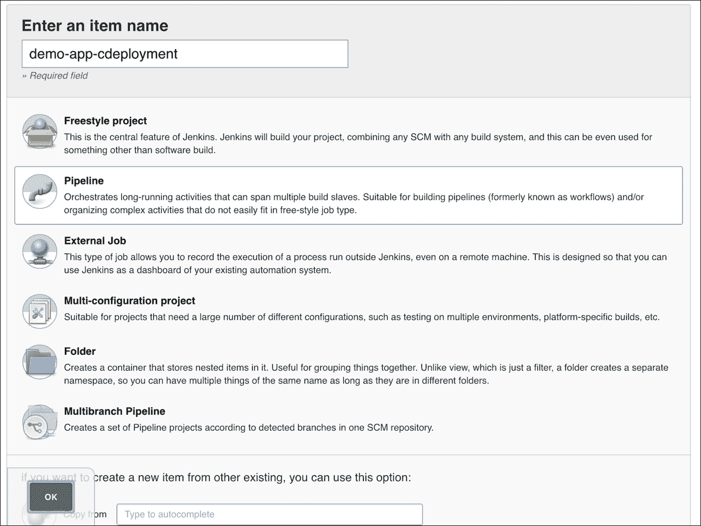

# 第六章：持续部署 - 完全自动化工作流

欢迎来到 CI 流程的最后阶段——**持续部署**。

我们现在准备好将我们在持续交付步骤中生成的 AMI 部署到生产环境。

对于这个过程，我们将使用**蓝绿部署**方法。我们的生产环境将由 ELB 和两个自动扩展组（蓝色组和绿色组）组成：


如果我们假设蓝色组包含当前的生产节点，那么在部署时，我们会执行以下操作：

1.  将 ELB 附加到绿色组

1.  使用新的 AMI 扩展绿色组

1.  检查错误

1.  缩小蓝色组的规模，将流量有效地转移到新 AMI 实例上

由于我们是在现有的 CI 流水线基础上进行构建，因此我们只需要对上一章的代码进行一些小的修改。我们需要添加几个额外的 Terraform 资源；让我们来看看这些资源。

# Terraform 代码 (resources.tf)

### 注意

请参考：[`github.com/PacktPublishing/Implementing-DevOps-on-AWS/blob/master/5585_06_CodeFiles/Terraform/resources.tf`](https://github.com/PacktPublishing/Implementing-DevOps-on-AWS/blob/master/5585_06_CodeFiles/Terraform/resources.tf)。

我们添加了第二个公共子网和一个匹配的私有子网，以便能够将生产实例分布到多个可用区。

`aws_subnet` 资源创建一个名为 `public-2` 的子网。它需要一些属性，如 VPC ID、CIDR 块和可用区（AZ），这些值我们从变量中获取。为了计算 CIDR 和 AZ 值，我们使用 Terraform 的插值函数（参考：[`www.terraform.io/docs/configuration/interpolation.html`](https://www.terraform.io/docs/configuration/interpolation.html)）：

```
resource "aws_subnet" "public-2" { 
  vpc_id = "${aws_vpc.terraform-vpc.id}" 
  cidr_block = "${cidrsubnet(var.vpc-cidr, 8, 3)}" 
  availability_zone = "${element(split(",",var.aws-availability-zones), count.index + 1)}" 
  map_public_ip_on_launch = true 

  tags { 
    Name = "Public" 
  } 
} 

```

接下来，我们将新创建的子网与路由表关联：

```
resource "aws_route_table_association" "public-2" { 
  subnet_id = "${aws_subnet.public-2.id}" 
  route_table_id = "${aws_route_table.public.id}" 
} 

```

然后对`Private`子网重复此操作：

```

resource "aws_subnet" "private-2" { 
  vpc_id = "${aws_vpc.terraform-vpc.id}" 
  cidr_block = "${cidrsubnet(var.vpc-cidr, 8, 4)}" 
  availability_zone = "${element(split(",",var.aws-availability-zones), count.index +1)}" 
  map_public_ip_on_launch = false 

  tags { 
    Name = "Private" 
  } 
} 

resource "aws_route_table_association" "private-2" { 
  subnet_id = "${aws_subnet.private-2.id}" 
  route_table_id = "${aws_route_table.private.id}" 
} 

```

在这个 VPC 中，我们最终会得到子网 1 和 3 为公共子网，子网 2 和 4 为私有子网。

下一步是添加生产 ELB 和为其配置的安全组：

```
resource "aws_security_group" "demo-app-elb-prod" { 
  name = "demo-app-elb-prod" 
  description = "ELB security group" 
  vpc_id = "${aws_vpc.terraform-vpc.id}" 

  ingress { 
    from_port = "80" 
    to_port = "80" 
    protocol = "tcp" 
    cidr_blocks = ["0.0.0.0/0"] 
  } 

```

注意协议值`"-1"`，表示“所有”：

```
  egress { 
    from_port = 0 
    to_port = 0 
    protocol = "-1" 
    cidr_blocks = ["0.0.0.0/0"] 
  } 

} 

resource "aws_elb" "demo-app-elb-prod" { 
  name = "demo-app-elb-prod" 
  security_groups = ["${aws_security_group.demo-app-elb-prod.id}"] 
  subnets = ["${aws_subnet.public-1.id}", "${aws_subnet.public-2.id}"] 
  cross_zone_load_balancing = true 
  connection_draining = true 
  connection_draining_timeout = 30 

  listener { 
    instance_port = 80 
    instance_protocol = "http" 
    lb_port = 80 
    lb_protocol = "http" 
  } 

  tags { 
    Name = "demo-app-elb-prod" 
  } 
} 

```

让我们还更新`demo-app`安全组的入站规则，以允许来自 ELB 的流量。为了更直观地展示，下面是我们之前的图示，并加上了更多标签：


代码如下：

```
resource "aws_security_group" "demo-app" { 
  name = "demo-app" 
  description = "ec2 instance security group" 
  vpc_id = "${aws_vpc.terraform-vpc.id}" 

  ingress { 
    from_port = "80" 
    to_port = "80" 
    protocol = "tcp" 
    security_groups = ["${aws_security_group.demo-app-elb.id}", "${aws_security_group.demo-app-elb-prod.id}"] 
  }  

```

然后我们引入我们的蓝绿**自动扩展组**（**ASG**）和一个临时启动配置：

```
resource "aws_launch_configuration" "demo-app-lcfg" { 
    name = "placeholder_launch_config" 
    image_id = "${var.jenkins-ami-id}" 
    instance_type = "${var.jenkins-instance-type}" 
    iam_instance_profile = "${aws_iam_instance_profile.demo-app.id}" 
    security_groups = ["${aws_security_group.demo-app.id}"] 
} 

resource "aws_autoscaling_group" "demo-app-blue" { 
  name = "demo-app-blue" 
  launch_configuration = "${aws_launch_configuration.demo-app-lcfg.id}" 
  vpc_zone_identifier = ["${aws_subnet.private-1.id}", "${aws_subnet.private-2.id}"] 
  min_size = 0 
  max_size = 0 

  tag { 
    key = "ASG" 
    value = "demo-app-blue" 
    propagate_at_launch = true 
  } 
} 

resource "aws_autoscaling_group" "demo-app-green" { 
  name = "demo-app-green" 
  launch_configuration = "${aws_launch_configuration.demo-app-lcfg.id}" 
  vpc_zone_identifier = ["${aws_subnet.private-1.id}", "${aws_subnet.private-2.id}"] 
  min_size = 0 
  max_size = 0 

  tag { 
    key = "ASG" 
    value = "demo-app-green" 
    propagate_at_launch = true 
  } 
} 

```

这里的启动配置实际上只是一个占位符，以便我们可以定义自动扩展组（这也是为什么我们重复使用 Jenkins 变量）。稍后，我们将创建一个新的真实启动配置，用于作为流水线的一部分服务`demo-app`。

## outputs.tf

### 注意

请参考：[`github.com/PacktPublishing/Implementing-DevOps-on-AWS/blob/master/5585_06_CodeFiles/Terraform/outputs.tf`](https://github.com/PacktPublishing/Implementing-DevOps-on-AWS/blob/master/5585_06_CodeFiles/Terraform/outputs.tf)。

对输出做了一些小的添加，以便给我们生产环境 ELB 端点：

```
output "ELB URI PROD" { 
  value = "${aws_elb.demo-app-elb-prod.dns_name}" 
} 

```

### 部署

现在是练习时间。使用之前提到的模板和来自[`github.com/PacktPublishing/Implementing-DevOps-on-AWS/tree/master/5585_06_CodeFiles`](https://github.com/PacktPublishing/Implementing-DevOps-on-AWS/tree/master/5585_06_CodeFiles)的其余熟悉代码，再加上你的先前经验，你应该能够创建一个 VPC 并启动一个 Jenkins 实例，配置两个流水线，正如我们在持续交付章节中所做的那样。别忘了更新任何与部署相关的细节，如下所示：

+   `salt:states:users:files`中的 SSH 公钥

+   `serverspec`测试规范中的授权密钥

+   `salt:states:yum-s3:files:s3.repo`中的 S3 URI

+   `demo-app/Jenkinsfile`中的 S3 桶名称

+   `packer:demo-app_vars.json`中的变量

+   `demo-app-cdelivery/Jenkinsfile`中的变量

我建议你禁用**demo-app**任务中的 SCM 轮询，这样在所有下游任务配置完之前，我们不会触发运行。

假设一切顺利，我们回到之前的状态：


# Jenkins 流水线

之前我们已经将集成和交付流水线串联起来，获取代码并生成 AMI 工件。我们的下一个任务是设计一个第三个流水线，将 AMI 部署到生产环境中。

在我们可以在 Jenkins 中创建新任务之前，我们需要通过 Git 使其代码可用：

### 注意

请参考：[`github.com/PacktPublishing/Implementing-DevOps-on-AWS/tree/master/5585_06_CodeFiles/CodeCommit/demo-app-cdeployment`](https://github.com/PacktPublishing/Implementing-DevOps-on-AWS/tree/master/5585_06_CodeFiles/CodeCommit/demo-app-cdeployment)。

我们稍后将详细检查文件，目前请先创建并填充一个名为`demo-app-cdeployment`的 CodeCommit 仓库。与我们其他仓库类似，新仓库的 URL 将是[`git-codecommit.us-east-1.amazonaws.com/v1/repos/demo-app-cdeployment`](https://git-codecommit.us-east-1.amazonaws.com/v1/repos/demo-app-cdeployment)。

有了这些信息，我们继续创建流水线：



它将需要一个`AMI ID`参数（从交付任务传递过来）：


然后，当然，还需要`Jenkinsfile`的位置（[`git-codecommit.us-east-1.amazonaws.com/v1/repos/demo-app-cdeployment`](https://git-codecommit.us-east-1.amazonaws.com/v1/repos/demo-app-cdeployment)）：


有了最后的任务，我们的 Jenkins 仪表板看起来是这样的：


## 持续部署流水线

回到代码，如之前所承诺：

### 注意

请参考 [`github.com/PacktPublishing/Implementing-DevOps-on-AWS/blob/master/5585_06_CodeFiles/CodeCommit/demo-app-cdeployment/Jenkinsfile`](https://github.com/PacktPublishing/Implementing-DevOps-on-AWS/blob/master/5585_06_CodeFiles/CodeCommit/demo-app-cdeployment/Jenkinsfile)。

我们的 Jenkinsfile 非常简单：

```
#!groovy 

node { 

  step([$class: 'WsCleanup']) 

  stage "Checkout Git repo" { 
    checkout scm 
  } 

  stage "Deploy AMI" { 
   sh returnStdout: false, script: "bash ./cdeployment.sh ${AMI_ID}" 
  } 

} 

```

我们只需要检查关联的代码库并执行一个 shell 脚本。自然，我们本可以用 Groovy 编写整个任务，但我个人更习惯于使用 Bash，因此最终使用了 `cdeployment.sh`。

我们在本章开头简要描述了部署任务。一般来说，我们将从两个独立的实例集群中提供应用程序代码，并在它们之间切换流量。我们将使用功能强大且用户友好的 AWS CLI 执行大部分操作，并使用 Bash 处理任何输入/输出数据。

让我们深入了解脚本的更多细节。

### cdeployment.sh

### 注意

请参考 [`github.com/PacktPublishing/Implementing-DevOps-on-AWS/blob/master/5585_06_CodeFiles/CodeCommit/demo-app-cdeployment/cdeployment.sh`](https://github.com/PacktPublishing/Implementing-DevOps-on-AWS/blob/master/5585_06_CodeFiles/CodeCommit/demo-app-cdeployment/cdeployment.sh)。

在顶部，我们定义了 Auto Scaling Groups 的名称、生产环境的 ELB 以及我们将使用的 AMI ID（从上游管道传递过来）：

```
#!/bin/bash 
set -ef -o pipefail 

blueGroup="demo-app-blue" 
greenGroup="demo-app-green" 
elbName="demo-app-elb-prod" 
AMI_ID=${1} 

```

一些辅助函数：

```
function techo() {  
  echo "[$(date +%s)] " ${1} 
} 

function Err() { 
  techo "ERR: ${1}" 
  exit 100 
} 

```

即，`techo`（带时间戳的回显）以便输出更多信息，以及当我们遇到问题时的 `ERR`。

如果我们需要中止部署并将基础设施恢复到原始状态，我们将使用此方法：

```
function rollback() { 
  techo "Metrics check failed, rolling back" 
  aws autoscaling update-auto-scaling-group --auto-scaling-group-name ${newActiveGroup} \ 
  --min-size 0 
  techo "Instances ${1} entering standby in group ${newActiveGroup}" 
  aws autoscaling enter-standby --should-decrement-desired-capacity \ 
    --auto-scaling-group-name ${newActiveGroup} --instance-ids ${1} 
  techo "Detaching ${elbName} from ${newActiveGroup}" 
  aws autoscaling detach-load-balancers --auto-scaling-group-name ${newActiveGroup} \ 
    --load-balancer-names ${elbName} 
  Err "Deployment rolled back. Please check instances in StandBy." 
} 

```

在我们的案例中，如果我们检测到某些指标的错误计数增加，我们将中止部署。我们会将新部署的实例设置为 **Standby** 模式，然后将 ELB 从指定的 Auto Scaling Group 中分离。

每次我们启动新的实例时，都应该暂停，允许它们完全初始化，然后验证它们到目前为止所做的工作，下面的 `wait_for_instances()` 函数将帮助我们完成此任务。

等待预期数量的实例启动：

```
techo ">>> Waiting for instances to launch" 
asgInstances=() 

while [ ${#asgInstances[*]} -ne ${1} ];do 
  sleep 10 
  asgInstances=($(aws autoscaling describe-auto-scaling-groups \ 
    --auto-scaling-group-name ${newActiveGroup} | jq .AutoScalingGroups[0].Instances[].InstanceId | tr -d '"' )) 
  techo "Launched ${#asgInstances[*]} out of ${1}" 
done 

```

等待它们变为可用：

```
techo ">>> Waiting for instances to become available" 
asgInstancesReady=0 
iterList=(${asgInstances[*]}) 

while [ ${asgInstancesReady} -ne ${#asgInstances[*]} ];do 
  sleep 10 
  for i in ${iterList[*]};do 
    asgInstanceState=$(aws autoscaling describe-auto-scaling-instances \ 
      --instance-ids ${i} | jq .AutoScalingInstances[0].LifecycleState | tr -d '"') 

    if [[ ${asgInstanceState} == "InService" ]];then 
      asgInstancesReady="$((asgInstancesReady+1))" 
      iterList=(${asgInstances[*]/${i}/}) 
    fi 
  done 
  techo "Available ${asgInstancesReady} out of ${#asgInstances[*]}" 
done 

```

让 ELB 将其声明为 `InService`：

```
techo ">>> Waiting for ELB instances to become InService" 
elbInstancesReady=0 
iterList=(${asgInstances[*]}) 

while [ ${elbInstancesReady} -ne ${#asgInstances[*]} ];do 
  sleep 10 
  for i in ${iterList[*]};do 
    elbInstanceState=$(aws elb describe-instance-health \ 
      --load-balancer-name ${elbName} --instances ${i} | jq .InstanceStates[].State | tr -d '"') 

    if [[ ${elbInstanceState} == "InService" ]];then 
      elbInstancesReady=$((elbInstancesReady+1)) 
      iterList=(${asgInstances[*]/${i}/}) 
    fi 
  done 
  techo "InService ${elbInstancesReady} out of ${#asgInstances[*]}"  
done 

```

接下来，由于我们知道将要使用的区域，我们提前设置它，以避免在每个 AWS CLI 命令中都需要附加区域：

```
export AWS_DEFAULT_REGION="us-east-1" 

```

在进一步操作之前，我们确保有一个有效的 `AMI ID` 可供使用：

```
[[ ${AMI_ID} = ami-* ]] || Err "AMI ID ${AMI_ID} is invalid" 

```

我们将使用两个 Auto Scaling Groups 和一个 ELB，我们检查每个组的属性并提取 ELB 名称：

```
blueElb=$(aws autoscaling describe-auto-scaling-groups --auto-scaling-group-names ${blueGroup} | \ 
  jq .AutoScalingGroups[0].LoadBalancerNames[0] | tr -d '"') 
greenElb=$(aws autoscaling describe-auto-scaling-groups --auto-scaling-group-names ${greenGroup} | \ 
  jq .AutoScalingGroups[0].LoadBalancerNames[0] | tr -d '"') 

```

接下来，我们确保只有一个组与生产环境 ELB 关联：

```
[[ "${blueElb}" != "${greenElb}" ]] || Err "Identical ELB value for both groups" 

if [[ "${blueElb}" == "${elbName}" ]]; then 
  activeGroup=${blueGroup} 
  newActiveGroup=${greenGroup} 
elif [[ "${greenElb}" == "${elbName}" ]]; then 
  activeGroup=${greenGroup} 
  newActiveGroup=${blueGroup} 
fi 

[ -n "${activeGroup}" ] || Err "Missing activeGroup" 
[ -n "${newActiveGroup}" ] || Err "Missing newActiveGroup" 

techo "Active group: ${activeGroup}" 
techo "New active group: ${newActiveGroup}" 

```

此时，我们已经确定了当前处理流量的两个组中的哪个（`Active`）以及哪个将接管它（`newActive`）。

理想情况下，在我们部署任何实例之前，`newActive` 应为空：

```
asgInstances=($(aws autoscaling describe-auto-scaling-groups \ 
    --auto-scaling-group-name ${newActiveGroup} | jq .AutoScalingGroups[0].Instances[].InstanceId | tr -d '"' )) 
[ ${#asgInstances[*]} -eq 0 ] || Err "Found instances attached to ${newActiveGroup}!" 

```

如果是这样，我们可以继续获取 `Active` 组的一些统计信息：

```
activeDesired=$(aws autoscaling describe-auto-scaling-groups \ 
  --auto-scaling-group-name ${activeGroup} | jq .AutoScalingGroups[0].DesiredCapacity) 
activeMin=$(aws autoscaling describe-auto-scaling-groups \ 
  --auto-scaling-group-name ${activeGroup} | jq .AutoScalingGroups[0].MinSize) 
activeMax=$(aws autoscaling describe-auto-scaling-groups \ 
  --auto-scaling-group-name ${activeGroup} | jq .AutoScalingGroups[0].MaxSize) 
scaleStep=$(( (30 * ${activeDesired}) /100 )) 

```

`Desired`/`Min`/`Max`是标准的自动扩展值，我们最终会将它们转移到`newActive`组。`scaleStep`在这种情况下是服务中实例的 30%，这是我们希望在部署过程中引入的初始实例数量（允许它们接收实时流量）。

如果我们的`Active`组为空，那就非常奇怪；如果它的数量较少，我们应该将`scaleStep`四舍五入到至少 1：

```
[ ${activeDesired} -gt 0 ] || Err "Active group ${activeGroup} is set to 0 instances!" 

[ ${scaleStep} -gt 0 ] || scaleStep=1 

```

这些是先决条件；现在让我们开始部署，通过逐步扩展`newActive`组。

我们需要一个启动配置。要创建一个，我们可以自己传递所有需要的参数，或者通过提供`Active`组中的一个示例实例，让 EC2 自动复制大部分参数：

```
activeInstance=$(aws autoscaling describe-auto-scaling-groups \ 
  --auto-scaling-group-name ${activeGroup} | jq .AutoScalingGroups[0].Instances[0].InstanceId | tr -d '"') 

[[ ${activeInstance} = i-* ]] || Err "activeInstance ${activeInstance} is invalid" 

launchConf="demo-app-${AMI_ID}-$(date +%s)"  

aws autoscaling create-launch-configuration --launch-configuration-name ${launchConf} \ 
  --image-id ${AMI_ID} --instance-id ${activeInstance} 

```

如下所示，将新创建的启动配置附加到该组：

```
techo ">>> Attaching ${launchConf} to ${newActiveGroup}" 
aws autoscaling update-auto-scaling-group --auto-scaling-group-name ${newActiveGroup} \ 
  --launch-configuration-name ${launchConf} 

```

如下所示添加 ELB：

```
techo ">>> Attaching ${elbName} to ${newActiveGroup}" 
aws autoscaling attach-load-balancers --auto-scaling-group-name ${newActiveGroup} \ 
  --load-balancer-names ${elbName} 

```

按如下方式开始扩展：

```
techo ">>> Increasing ${newActiveGroup} capacity (min/max/desired) to ${scaleStep}" 
aws autoscaling update-auto-scaling-group --auto-scaling-group-name ${newActiveGroup} \ 
  --min-size ${scaleStep} --max-size ${scaleStep} --desired-capacity ${scaleStep} 

```

等待片刻，直到实例启动：

```
wait_for_instances ${scaleStep} 

```

我们的初始实例组现在应该已经部署，附加到生产 ELB，并开始服务流量。在我们启动更多新的 AMI 副本之前，我们应该检查到目前为止是否没有造成任何问题。为此，我们可以暂停部署几分钟，并检查一些指标，例如非 200 响应的数量、异常情况或每秒请求数。为了简单起见，在这个示例中，我们假设这已经完成；在现实生活中，你会查询你的监控系统，或者可能拉取 CloudWatch ELB/EC2 统计数据的样本。

如果没有检测到任何异常，我们进一步扩展`newActive`组，以匹配`Active`组的大小：

```
techo ">>> Checking error metrics" 
sleep 5 
doRollback=false 
${doRollback} && rollback "${asgInstances[*]}" 

techo ">>> Matching ${newActiveGroup} capacity (min/max/desired) to that of ${activeGroup}" 
aws autoscaling update-auto-scaling-group --auto-scaling-group-name ${newActiveGroup} \ 
  --min-size ${activeMin} --max-size ${activeMax} --desired-capacity ${activeDesired} 

```

正如你所预期的，还需要做一次检查：

```
wait_for_instances ${activeDesired} 

```

这一次，我们可以模拟一个问题并触发回滚：

```
techo ">>> Checking error metrics" 
sleep 5 
doRollback=true 
${doRollback} && rollback "${asgInstances[*]}"
```

`rollback`功能应该会处理剩下的部分。如果我们将`doRollback`设置为`false`，我们的部署将按计划继续，并通过缩小`Active`组，将流量完全转移到`newActive`组：

```
techo ">>> Reducing ${activeGroup} size to 0" 
aws autoscaling update-auto-scaling-group --auto-scaling-group-name ${activeGroup} \ 
  --min-size 0 --max-size 0 --desired-capacity 0 

```

然后将 ELB 从其中移除：

```
techo ">>> Detaching ${elbName} from ${activeGroup}" 
aws autoscaling detach-load-balancers --auto-scaling-group-name ${activeGroup} \ 
  --load-balancer-names ${elbName} 

```

现在，让我们看看我们的脚本如何运行。首先，我们应该通过手动扩展一个组（比如蓝色组）来模拟一个`Active`组，并将生产 ELB 附加到该组：


稍等片刻，你应该能看到三个实例和蓝色的 ELB：


现在，让我们重新启用`demo-app`作业的 SCM 轮询，并通过推送代码更改到其 CodeCommit 仓库来触发一个运行。你应该能看到管道在运行，并沿途调用下游的两个管道。

如果你选择模拟一个指标问题并导致回滚，那么已部署的实例应该进入**Standby**模式：


在这种情况下，`rollback`是在一个实例初次部署后触发的（`scaleStep=1`）。理论上，下一步应该是检查该实例，寻找可能导致错误指标的原因。

如果实例被认为是健康的，那么我们需要通过将实例投入使用，进一步扩展该组，然后缩小另一个组来手动完成部署（本质上完成 `cdeployment` 脚本中的剩余步骤）。

否则，实例可以投入使用，然后将组缩减为零，使基础设施恢复到其原始状态，蓝色组保持为 `Active`。

如果你选择不进行任何回滚，部署应该按计划进行，最终绿色组会接管蓝色组，表示部署成功：


此时，如果你在浏览器中加载 ELB URI，你应该会收到来自我们新部署的 AMI 提供的 `demo-app` 的响应。

恭喜！

# 总结

在本章中，我们通过添加部署组件完成了我们的 Jenkins CI 解决方案。我们广泛使用了 AWS CLI 来编排蓝绿部署过程。生成的流水线或此类集合使我们能够持续集成应用程序的代码更改，并构建包含这些更改的 AMI，之后在通过某些测试并满足标准后，将其部署到指定的环境中。

下一章将带我们进入一个新方向，介绍监控、指标和日志收集的主题。我们将看看一些工具，帮助我们随时了解基础设施的状态，直观地呈现性能，并对问题作出反应。
