# 第七章：指标、日志收集和监控


就是这样。本章本来可以在这里结束，但为了那些希望更详细了解的朋友们，我将继续进行下去。

许多 DevOps 实践围绕着能够随时回顾和应对基础设施状态的理念——如果您需要的话。

这并不是说每当主机上的日期发生变化时都设置电子邮件通知，而是提供一系列合理、可用的事件数据流，使得操作员能够在压力和/或不确定的情况下做出合理的决策。

如果您一直在关注生活，您会注意到许多智者提到过*平衡，黄金中庸*。

您应该目标是以一种方式配置您的监控系统，以便能够及时接收到潜在重要事件的通知。这些通知应该以一种难以忽视的格式到达，并且提供足够的细节，让操作员能够做出合理的判断，了解发生了什么。

与此同时，所述监控系统必须尽量减少告警疲劳（如这篇简洁的 Datadog 文章所概述：[`www.datadoghq.com/blog/monitoring-101-alerting`](https://www.datadoghq.com/blog/monitoring-101-alerting)）。

不幸的是，找到适合您情况（您的基础设施以及负责维护它的人们）的中间地带是一个冒险，您必须独自去完成。然而，我们可以一起花一些时间讨论一些工具，这些工具可以使这一过程更加愉快！

检查清单很复杂，所以这是其中之一：

+   **集中日志记录**：

    +   使用**Logstash**和**Elasticsearch**进行日志的摄取和存储

    +   使用 Elasticsearch 的**Filebeat**收集日志

    +   使用**Kibana**可视化日志

+   **指标**：

    +   使用**Prometheus**摄取和存储指标

    +   使用**Telegraf**收集操作系统和应用程序的指标

    +   使用**Grafana**可视化指标

+   **监控**：

    +   使用**Prometheus**进行告警

    +   使用**Prometheus**和**Jenkins**进行自我修复

自然，我们需要一些主机来作为前面所有检查清单的“游乐场”。在之前的章节中，我们已经充分练习了在 AWS 上部署 VPC EC2 实例，因此我在此行使委托权，并假设以下内容的存在：

+   一个带有 IGW、NAT 网关、2 个私有子网和 2 个公共子网的 VPC

+   2 个独立的、原生的 Amazon Linux EC2 实例（比如`t2.small`），位于公共子网内

+   1 个自动伸缩组（`t2.nano`）位于私有子网内

+   1 个面向互联网的 ELB，将 HTTP 流量传递到自动伸缩组

# 集中日志记录

自古以来，人类就努力将有限的注意力集中在生活中真正重要的事情上，并尽量不费力地找到它——如果可能的话。因此，我们从复制日志文件开始，进化到了集中式 (r)syslog，今天（我们从错误中学习）我们拥有了 Logstash 和 Elasticsearch。

|   | *Elasticsearch 是一个分布式的开源搜索和分析引擎，旨在实现水平扩展性、可靠性和易于管理。它通过一个复杂的、开发者友好的查询语言结合了搜索速度和分析能力，涵盖了结构化、非结构化和时间序列数据。**Logstash 是一个灵活的开源数据收集、增强和传输管道。Logstash 提供了与常见基础设施的连接器，便于集成，旨在高效处理越来越多的日志、事件和非结构化数据源，并将其分发到包括 Elasticsearch 在内的多种输出中。* |   |
| --- | --- | --- |
|   | --[`www.elastic.co/products`](https://www.elastic.co/products) |

## 使用 Logstash 和 Elasticsearch 获取和存储日志

我们将使用 Logstash 接收、处理并将日志事件存储到 Elasticsearch 中。

本章中的演示目的，我们将在主机上手动安装和配置服务。实验完成后，当然应该使用配置管理工具来代替（眨眼）。

我们首先在一台独立的 EC2 实例上安装这两个服务（我们将其称为 ELK）：

```
# yum -y install https://download.elastic.co/elasticsearch/release/org/elasticsearch/distribution/rpm/elasticsearch/2.4.1/elasticsearch-2.4.1.rpm https://download.elastic.co/logstash/logstash/packages/centos/logstash-2.4.0.noarch.rpm

```

编辑 `/etc/elasticsearch/elasticsearch.yml`：

### 注意

请参考：[`github.com/PacktPublishing/Implementing-DevOps-on-AWS/blob/master/5585_07_CodeFiles/elk/etc/elasticsearch/elasticsearch.yml`](https://github.com/PacktPublishing/Implementing-DevOps-on-AWS/blob/master/5585_07_CodeFiles/elk/etc/elasticsearch/elasticsearch.yml)

```
cluster.name: wonga-bonga 
index.number_of_shards: 1 
index.number_of_replicas: 0 
index : 
  refresh_interval: 5s 

```

为 Elasticsearch 集群选择一个唯一的名称非常重要，以确保节点不会意外地加入其他人的集群（如果您的局域网上有的话）。对于开发环境，我们只需要一个分片且没有副本。为了提高效率，我们设置 Elasticsearch 索引的刷新率为 5 秒。

创建一个 Logstash `patterns` 文件夹：

```
# mkdir /opt/logstash/patterns

```

创建一个示例 NGINX 模式 `/opt/logstash/patterns/nginx`（参考：[`www.digitalocean.com/community/tutorials/adding-logstash-filters-to-improve-centralized-logging`](https://www.digitalocean.com/community/tutorials/adding-logstash-filters-to-improve-centralized-logging)）：

### 注意

请参考：[`github.com/PacktPublishing/Implementing-DevOps-on-AWS/blob/master/5585_07_CodeFiles/elk/opt/logstash/patterns/nginx`](https://github.com/PacktPublishing/Implementing-DevOps-on-AWS/blob/master/5585_07_CodeFiles/elk/opt/logstash/patterns/nginx)

```
NGUSERNAME [a-zA-Z\.\@\-\+_%]+ 
NGUSER %{NGUSERNAME} 
NGINXACCESS %{IPORHOST:clientip} %{NGUSER:ident} %{NGUSER:auth} \[%{HTTPDATE:timestamp}\] "%{WORD:verb} %{URIPATHPARAM:request} HTTP/%{NUMBER:httpversion}" %{NUMBER:response} (?:%{NUMBER:bytes}|-) (?:"(?:%{URI:referrer}|-)"|%{QS:referrer}) %{QS:agent} 

```

创建 `/etc/logstash/conf.d/main.conf`：

### 注意

请参考：[`github.com/PacktPublishing/Implementing-DevOps-on-AWS/blob/master/5585_07_CodeFiles/elk/etc/logstash/conf.d/main.conf`](https://github.com/PacktPublishing/Implementing-DevOps-on-AWS/blob/master/5585_07_CodeFiles/elk/etc/logstash/conf.d/main.conf)

```
input { 
  beats { 
    port => 5044 
  } 
} 

filter { 
  if [type] == "nginx-access" { 
    grok { 
      match => { "message" => "%{NGINXACCESS}" } 
    } 
  } 
} 

output { 
  elasticsearch { 
    hosts => "localhost:9200" 
    manage_template => false 
    index => "%{[@metadata][beat]}-%{+YYYY.MM.dd}" 
    document_type => "%{[@metadata][type]}" 
  } 
} 

```

Logstash 允许我们配置一个或多个监听器（输入），以接收数据，配置过滤器帮助我们处理数据，并设置输出，指定处理后数据应转发到哪里。

我们期望 Elasticsearch Filebeat 通过 `TCP: 5044` 传送日志。如果日志事件的类型是 `nginx-access`，我们会根据 `NGINXACCESS` 模式对其进行修改，然后将其通过 `TCP: 9200` 发送到本地主机的 Elasticsearch 进行存储。

最后，让我们启动服务：

```
# service elasticsearch start
# service logstash start

```

## 使用 Elasticsearch Filebeat 收集日志

我们已经搭建好系统；接下来让我们推送一些来自 ELK 节点的数据。

我们将使用 Filebeat 收集本地感兴趣的日志，并将其转发到 Logstash（顺便说一下，这也是本地的）：

|   | *Filebeat 是一个日志数据传输工具。它作为代理安装在服务器上，监控日志目录或特定日志文件，跟踪文件并将其转发到 Elasticsearch 或 Logstash 进行索引。* |   |
| --- | --- | --- |
|   | --*https://www.elastic.co/guide/en/beats/filebeat/current/filebeat-overview.html* |

安装：

```
# yum -y install https://download.elastic.co/beats/filebeat/filebeat-1.3.1-x86_64.rpm

```

虽然提供了直接发送到 Elasticsearch 的功能，但我们计划使用 Logstash，因此我们需要在`/etc/filebeat/filebeat.yml`中禁用 Elasticsearch 输出，并启用 Logstash 输出。

### 注意

请参考：[`github.com/PacktPublishing/Implementing-DevOps-on-AWS/blob/master/5585_07_CodeFiles/elk/etc/filebeat/filebeat.yml`](https://github.com/PacktPublishing/Implementing-DevOps-on-AWS/blob/master/5585_07_CodeFiles/elk/etc/filebeat/filebeat.yml)

```
output: 
  #elasticsearch: 
  #  hosts: ["localhost:9200"] 
  logstash: 
    hosts: ["localhost:5044"] 

```

我们还可以列出更多要收集的日志文件：

```
filebeat: 
  prospectors: 
    - 
      paths: 
     - /var/log/*.log 
        - /var/log/messages 
        - /var/log/secure 

```

然后启动服务：

```
# service filebeat start

```

很有趣，但让我们再启动一些 EC2 实例，享受更多乐趣！

我们将使用之前提到的自动扩展组。我们将在每个实例上安装 Filebeat，并配置它将选定的日志转发到我们的 Logstash 节点。

首先，确保 Logstash 实例的安全组允许来自自动扩展组的入站连接（`TCP: 5044`）。

接下来，我们使用 EC2 用户数据脚本将 Filebeat 二进制文件和配置引导到自动扩展组中的每个 EC2 实例上（我们将其称为 Web 服务器）：

### 注意

请参考：[`github.com/PacktPublishing/Implementing-DevOps-on-AWS/blob/master/5585_07_CodeFiles/webserver/user_data.sh`](https://github.com/PacktPublishing/Implementing-DevOps-on-AWS/blob/master/5585_07_CodeFiles/webserver/user_data.sh)

```
#!/bin/bash 

yum -y install https://download.elastic.co/beats/filebeat/filebeat-1.3.1-x86_64.rpm 
yum -y install nginx 

cat << EOF > /etc/filebeat/filebeat.yml 
filebeat: 
  prospectors: 
    - 
      paths: 
        - /var/log/*.log 
        - /var/log/messages 
        - /var/log/secure 
    - 
      paths: 
        - /var/log/nginx/access.log 
      document_type: nginx-access 
  registry_file: /var/lib/filebeat/registry 
output: 
  logstash: 
    hosts: ["10.0.1.132:5044"] 
EOF 

service nginx start 
service filebeat start 

```

配置好后，继续扩展该组。新的 Web 服务器实例应立即开始流式传输日志。

## 使用 Kibana 可视化日志

我们已将日志收集到 Filebeat，并存储在 Elasticsearch 中，那我们来浏览这些日志吧？

Kibana，准时到达：

|   | *Kibana 是一个开源的分析和可视化平台，旨在与 Elasticsearch 配合使用。你可以使用 Kibana 搜索、查看和交互 Elasticsearch 索引中的数据。你可以轻松地执行高级数据分析，并在各种图表、表格和地图中可视化数据。* |   |
| --- | --- | --- |
|   | --*https://www.elastic.co/guide/en/kibana/current/introduction.html* |

安装包：

```
# yum -y install https://download.elastic.co/kibana/kibana/kibana-4.6.1-x86_64.rpm

```

启动服务：

```
# service kibana start

```

默认端口是 `TCP:5601`，如果在相关的安全组中允许，你应该能够看到 Kibana 仪表板：

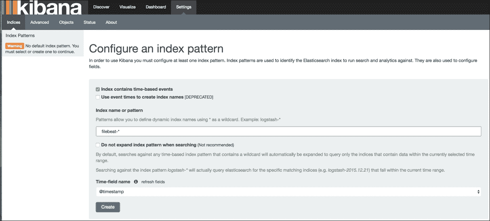

将 **索引模式** 设置为 **filebeat-*** 然后点击 **创建**。

Kibana 现在已经准备好显示我们的 Filebeat 数据。切换到 **发现** 标签页查看最近的事件列表：

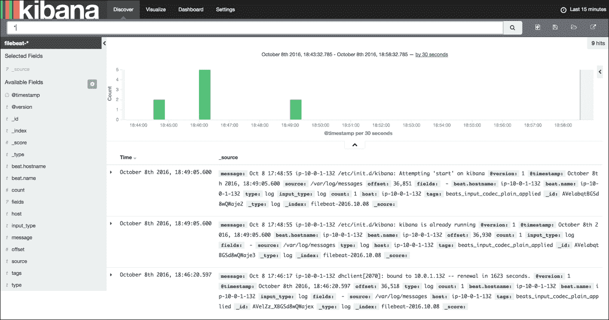

除了标准的 **Syslog** 消息外，你还会注意到一些 **NGINX 访问日志** 条目，字段根据我们之前指定的过滤条件进行了填充：

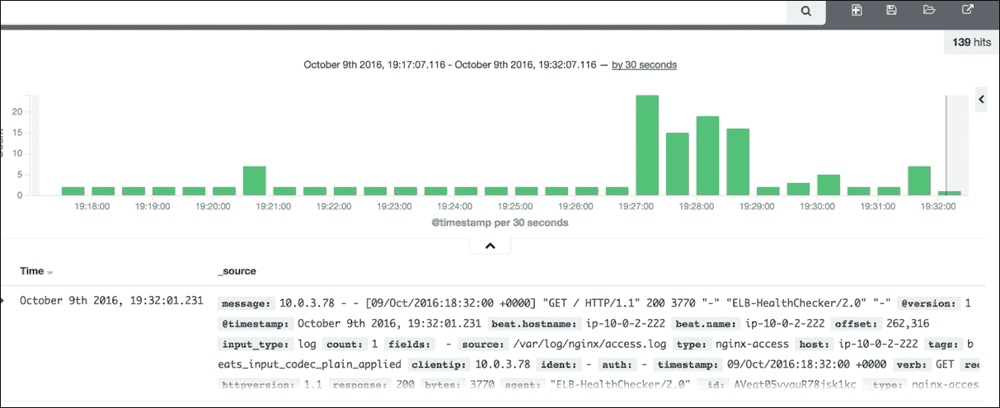

日志：完成。那么，关于一些度量呢？

# 度量

为了获取、存储和警报我们的度量，我们将探索另一个非常流行的开源项目，名为 Prometheus：

|   | *Prometheus 是一个开源的系统监控和警报工具包，最初在 SoundCloud 开发。**Prometheus 的主要特点包括：**- 多维数据模型（通过指标名称和键/值对标识时间序列）**- 一个灵活的查询语言来利用这种维度**- 无需分布式存储；单个服务器节点是自治的**- 通过 HTTP 拉取模型进行时间序列采集**- 通过中间网关支持推送时间序列**- 通过服务发现或静态配置发现目标**- 支持多种图形和仪表板模式* |   |
| --- | --- | --- |
|   | --*https://prometheus.io/docs/introduction/overview/emphasis>* |

尽管它是一个几乎涵盖所有功能的系统，但该项目仍然遵循流行的 UNIX 模块化开发哲学。Prometheus 由多个组件组成，每个组件提供特定功能：

|   | *- 主要的 Prometheus 服务器，用于抓取和存储时间序列数据**- 用于仪表化应用代码的客户端库**- 支持短生命周期作业的推送网关**- 基于 Rails/SQL 的 GUI 仪表板构建器**- 特殊用途的导出器（如 HAProxy、StatsD、Ganglia 等）**- 一个（实验性的）告警管理器**- 命令行查询工具* |   |
| --- | --- | --- |
|   | --*https://prometheus.io/docs/introduction/overview/* |

## 使用 Prometheus 获取和存储度量

我们的第二个 EC2 实例将会托管 Prometheus 服务和 Jenkins（稍后会介绍），因此一个合适的名称可以是 promjenkins。

首先，下载并解压 Prometheus 和 Alertmanager 到 `/opt/prometheus/server` 和 `/opt/prometheus/alertmanager`（参考：[`prometheus.io/download`](https://prometheus.io/download)）。

我们为 Alertmanager 创建一个基本的配置文件，存放在 `/opt/prometheus/alertmanager/alertmanager.yml`（根据需要替换电子邮件地址）：

### 注意

请参考：[`github.com/PacktPublishing/Implementing-DevOps-on-AWS/blob/master/5585_07_CodeFiles/promjenkins/opt/prometheus/alertmanager/alertmanager.yml`](https://github.com/PacktPublishing/Implementing-DevOps-on-AWS/blob/master/5585_07_CodeFiles/promjenkins/opt/prometheus/alertmanager/alertmanager.yml)

```
global: 
  smtp_smarthost: 'localhost:25' 
  smtp_from: 'alertmanager@example.org' 

route: 
  group_by: ['alertname', 'cluster', 'service'] 
  group_wait: 30s 
  group_interval: 5m 
  repeat_interval: 1h  
  receiver: team-X-mails 

receivers: 
- name: 'team-X-mails' 
  e-mail_configs: 
  - to: 'team-X+alerts@example.org' 
    require_tls: false 

```

这将简单地通过电子邮件发送警报通知。

启动服务：

```
# cd /opt/prometheus/alertmanager
# (./alertmanager 2>&1 | logger -t prometheus_alertmanager)&

```

确保默认的 `TCP:9093` 已被允许，然后你应该能够访问 `http://$public_IP_of_promjenkins_node:9093/#/status` 仪表盘：

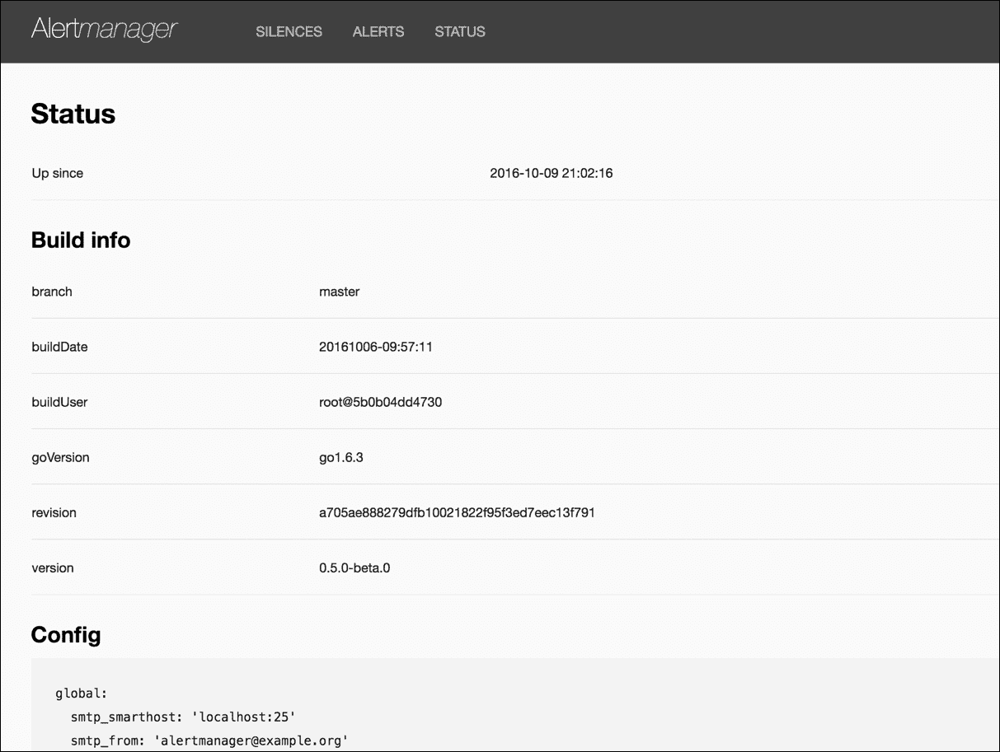

返回到 Prometheus 服务器，默认的 `/opt/prometheus/server/prometheus.yml` 目前就足够了。我们可以启动该服务：

```
# cd /opt/prometheus/server
# (./prometheus -alertmanager.url=http://localhost:9093 2>&1 | logger -t prometheus_server)

```

打开 `TCP:9090`，然后尝试 `http://$public_IP_of_promjenkins_node:9090/status`：

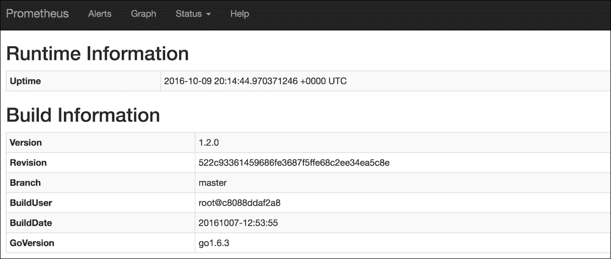

我们已经准备好开始添加要监控的主机。也就是说，添加 Prometheus 要拉取的目标。

Prometheus 提供了多种定义目标的方式。最适合我们案例的是 `ec2_sd_config`（参考：[`prometheus.io/docs/operating/configuration/#<ec2_sd_config>`](https://prometheus.io/docs/operating/configuration/#<ec2_sd_config>)）。我们所需要做的就是提供一组具有只读 EC2 访问权限的 API 密钥（**AmazonEC2ReadOnlyAccess** IAM 策略），然后 Prometheus 将为我们执行主机发现（参考：[`www.robustperception.io/automatically-monitoring-ec2-instances`](https://www.robustperception.io/automatically-monitoring-ec2-instances)）。

我们将 `ec2_sd_config` 配置追加到：`/opt/prometheus/server/prometheus.yml`：

### 注意

请参考：[`github.com/PacktPublishing/Implementing-DevOps-on-AWS/blob/master/5585_07_CodeFiles/promjenkins/opt/prometheus/server/prometheus.yml`](https://github.com/PacktPublishing/Implementing-DevOps-on-AWS/blob/master/5585_07_CodeFiles/promjenkins/opt/prometheus/server/prometheus.yml)

```
  - job_name: 'ec2' 
    ec2_sd_configs: 
      - region: 'us-east-1' 
        access_key: 'xxxx' 
        secret_key: 'xxxx' 
        port: 9126 
    relabel_configs: 
      - source_labels: [__meta_ec2_tag_Name] 
        regex: ^webserver 
        action: keep 

```

我们只关注位于 `us-east-1` 区域，并且名称符合 `^webserver` 正则表达式的实例。

现在让我们将其中一些实例上线。

## 使用 Telegraf 收集操作系统和应用程序的度量数据

我们将在 Prometheus 中使用拉取方式进行度量数据收集。这意味着我们的客户端（目标）将暴露它们的度量数据，供 Prometheus 拉取。

为了暴露操作系统度量数据，我们将部署 InfluxData 的 Telegraf（参考：[`github.com/influxdata/telegraf`](https://github.com/influxdata/telegraf)）。

它提供了一套丰富的插件，能够提供大量度量。如果你需要更多的度量，可以选择自己编写插件（使用 Go）或使用 `exec` 插件，它本质上会尝试启动你指定的任何类型的脚本。

至于应用程序度量，我们有两个（至少）选择：

+   在应用程序中构建一个度量 API 端点

+   让应用程序将度量数据提交给外部守护进程（以 StatsD 为例）

顺便提一下，Telegraf 内置了一个 StatsD 监听器，因此如果你的应用程序已经有 StatsD 插桩，你应该能够直接将其指向 Telegraf。

继 ELK 示例之后，我们将扩展 EC2 用户数据脚本，以便在自动扩展组实例上安装 Telegraf。

### 注意

请参考：[`github.com/PacktPublishing/Implementing-DevOps-on-AWS/blob/master/5585_07_CodeFiles/webserver/user_data.sh`](https://github.com/PacktPublishing/Implementing-DevOps-on-AWS/blob/master/5585_07_CodeFiles/webserver/user_data.sh)

我们附加：

```
yum -y install https://dl.influxdata.com/telegraf/releases/telegraf-1.0.1.x86_64.rpm 

cat << EOF > /etc/telegraf/telegraf.conf 
[global_tags] 
[agent] 
  interval = "10s" 
  round_interval = true 
  metric_batch_size = 1000 
  metric_buffer_limit = 10000 
  collection_jitter = "0s" 
  flush_interval = "10s" 
  flush_jitter = "0s" 
  precision = "" 
  debug = false 
  quiet = false 
  hostname = "" 
  omit_hostname = false 
[[outputs.prometheus_client]] 
  listen = ":9126" 
[[inputs.cpu]] 
  percpu = true 
  totalcpu = true 
  fielddrop = ["time_*"] 
[[inputs.disk]] 
  ignore_fs = ["tmpfs", "devtmpfs"] 
[[inputs.diskio]] 
[[inputs.kernel]] 
[[inputs.mem]] 
[[inputs.processes]] 
[[inputs.swap]] 
[[inputs.system]] 
EOF 

service telegraf start 

```

这里最重要的是 `outputs.prometheus_client`，它将 Telegraf 转换为 Prometheus 抓取目标。如果你希望在此测试中启用更多度量，请务必检查默认配置文件（参考：[`github.com/influxdata/telegraf/blob/master/etc/telegraf.conf`](https://github.com/influxdata/telegraf/blob/master/etc/telegraf.conf)）

接下来，检查 TCP: `9126` 是否被允许进入自动扩展组安全组，然后启动几个节点。几秒钟后，你应该能在目标仪表板中看到任何匹配的实例（参考：`http://$ public_IP_of_promjenkins_node:9090/targets`）：

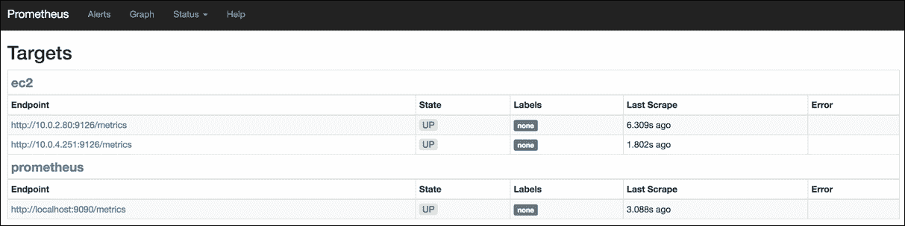

我们在先前配置的**ec2**抓取任务下看到了新主机。

## 使用 Grafana 可视化度量

的确，Prometheus 完全能够可视化我们现在从目标收集的数据，如下所示：

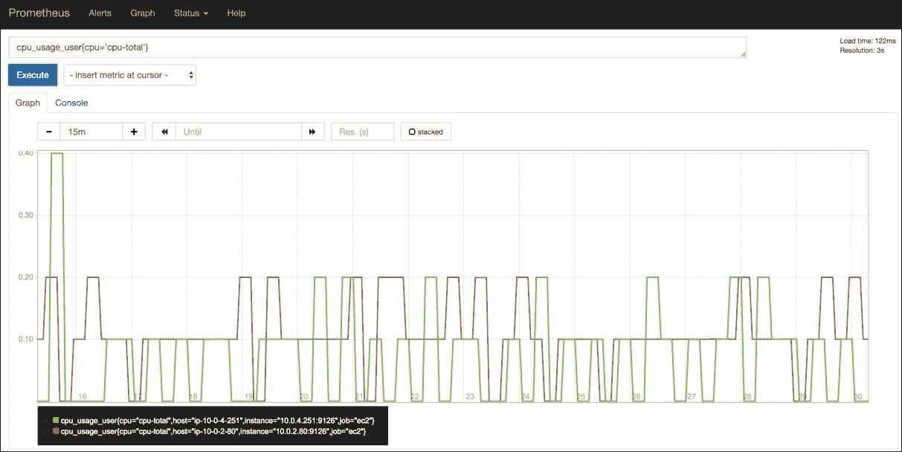

事实上，这就是推荐的做法，适用于你可能想要执行的任何临时查询。

如果你对仪表板有兴趣的话，你一定会非常欣赏 *Grafana - 第八大奇迹*（参考：[`grafana.org`](http://grafana.org)）

查看这个网址以了解这个工具的使用感受：http://play.grafana.org

我的意思是，你知道多少个项目有 *play* URL 吗？！

1.  所以，是的，Grafana，让我们在 promjenkins 节点上安装该服务：

    ```
    # yum -y install https://grafanarel.s3.amazonaws.com/builds/
            grafana-3.1.1-1470047149.x86_64.rpm
    # service grafana-server start

    ```

    默认的 Grafana 端口是 TCP:`3000`，认证为 `admin:admin`。更新相关安全组后，我们应该能看到以下页面：`http://$ public_IP_of_promjenkins_node:3000`：

    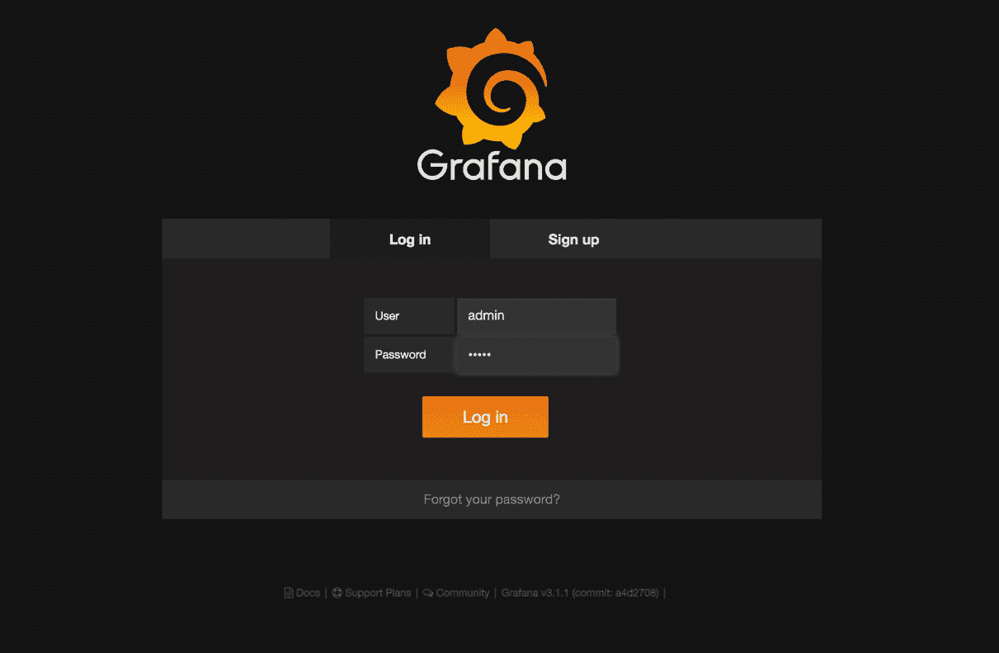

1.  登录后，首先我们需要为我们的**仪表板**创建一个**数据源**：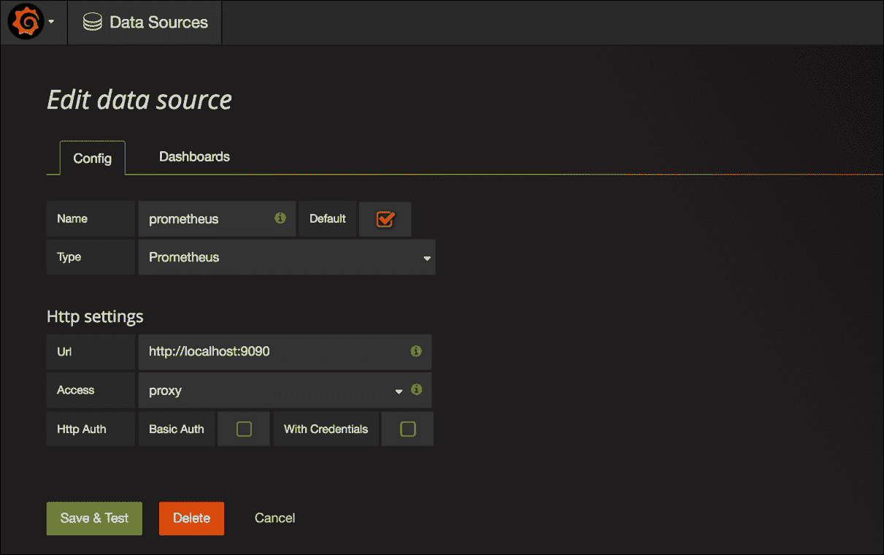

1.  在首页，选择创建一个新仪表板，然后使用左侧的绿色按钮 **添加面板**，接着选择 **图表**：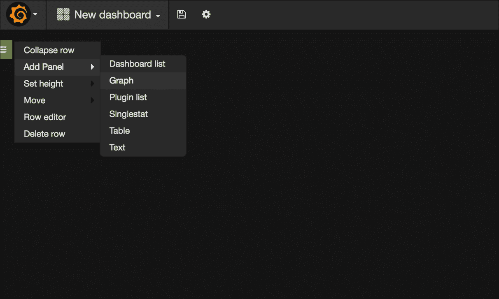

1.  然后，添加一个基本的 CPU 使用率图表如下所示：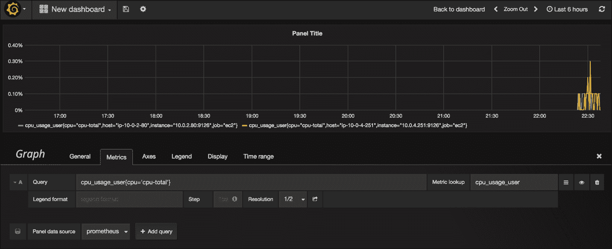

    此时，我鼓励你浏览 [`docs.grafana.org`](http://docs.grafana.org) 以了解更多有关模板、动态仪表板、访问控制、标签、脚本、播放列表等方面的信息。

# 监控

我们的指标已经流入 Prometheus。我们也有了一种探索和可视化它们的方法。下一步可能是配置某种告警，这样我们就能向其他人展示我们正在进行实际工作。

## 使用 Prometheus 进行告警

|   | *告警概述**Prometheus 的告警功能分为两个部分。Prometheus 服务器中的告警规则将告警发送到 Alertmanager。Alertmanager 然后管理这些告警，包括静默、抑制、聚合和通过电子邮件、PagerDuty 和 HipChat 等方式发送通知。**设置告警和通知的主要步骤是：**- 设置并配置 Alertmanager**- 配置 Prometheus 以通过 --alertmanager.url 标志与 Alertmanager 通信**- 在 Prometheus 中创建告警规则* |   |
| --- | --- | --- |
|   | --*https://prometheus.io/docs/alerting/overview/* |

让我们将其分解：

我们已经在 `/opt/prometheus/alertmanager/alertmanager.yml` 中以一些最小配置运行了 Alertmanager。

由于我们传递了 `-alertmanager.url=http://localhost:9093` 标志，我们的 Prometheus 实例已经意识到了这一点。

剩下的就是创建告警规则。我们将这些存储在 `rules/` 文件夹中：

```
# mkdir /opt/prometheus/server/rules

```

我们需要告诉 Prometheus 这个位置，因此我们需要在 `prometheus.yml` 中添加一个 `rule_files` 部分：

### 注意

请参考：[`github.com/PacktPublishing/Implementing-DevOps-on-AWS/blob/master/5585_07_CodeFiles/promjenkins/opt/prometheus/server/prometheus.yml`](https://github.com/PacktPublishing/Implementing-DevOps-on-AWS/blob/master/5585_07_CodeFiles/promjenkins/opt/prometheus/server/prometheus.yml)

```
rule_files: 
  - "rules/*.rules" 

```

这样我们可以存储单独的规则文件，也许可以根据它们包含的规则类型来区分？

作为示例，让我们设置一个保活和磁盘使用告警：

### 注意

请参考：[`github.com/PacktPublishing/Implementing-DevOps-on-AWS/tree/master/5585_07_CodeFiles/promjenkins/opt/prometheus/server/rules`](https://github.com/PacktPublishing/Implementing-DevOps-on-AWS/tree/master/5585_07_CodeFiles/promjenkins/opt/prometheus/server/rules)

`/opt/prometheus/server/rules/keepalive.rules`：

```
ALERT Keepalive 
  IF up == 0 
  FOR 1m 
  ANNOTATIONS { 
    summary = "Instance {{$labels.instance}} down", 
    description = "{{$labels.instance}} of job {{$labels.job}} has been down for more than 1 minute." 
  } 

```

`/opt/prometheus/server/rules/disk.rules`：

```
ALERT High_disk_space_usage 
  IF disk_used_percent > 20 
  FOR 1m 
  ANNOTATIONS { 
    summary = "High disk space usage on {{ $labels.instance }}", 
    description = "{{ $labels.instance }} has a disk_used value of {{ $value }}% on {{ $labels.path }})", 
  } 

```

正如你所注意到的，我们在 `FOR 1m` 和 `>20` 上显得不耐烦，这意味着在检测到告警后仅经过 60 秒，且告警阈值只有 20% 的空间使用。

在更实际的场景中，我们应等待更长时间，以过滤掉任何瞬态问题，并使用严重性来区分关键警报和警告（参考：[`github.com/prometheus/alertmanager`](https://github.com/prometheus/alertmanager)）。

重新加载 Prometheus 并应用新规则。现在，假设其中一个 Web 服务器节点出现故障：

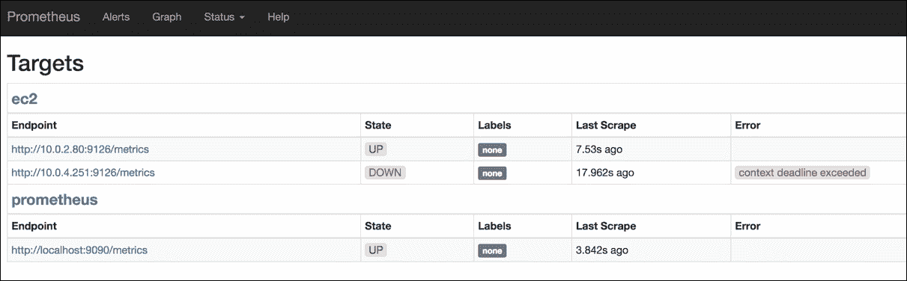

切换到**警报**标签页，我们看到：

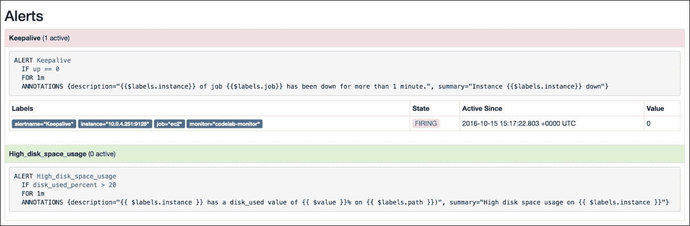

在 Alertmanager 中，分别为：(`http://$ public_IP_of_promjenkins_node:9093/#/alerts`)：

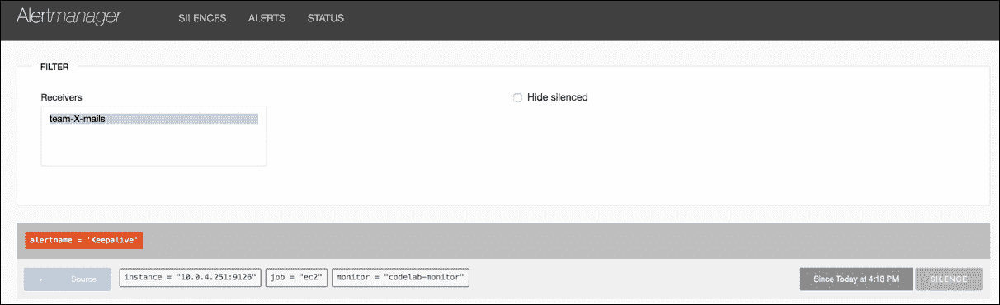

此时，应该已经发送了电子邮件通知。

## 使用 Prometheus 和 Jenkins 的自我修复

每个运维人员的梦想是一个能够自我照看的生态系统。

想象一下，如果我们生活在一个环境中，不是接收到要求采取行动的警报，而是接收到仅仅是通知或我们已采取的行动的报告，会是怎样的？

例如，不再是“CRITICAL: 服务 X 未响应，请检查。”，而是“INFO: 服务 X 在 nn:nn:nn 时未响应，并在 nn:nn:nn 时经过 N 秒后重启。”

从技术上讲，如果我们为今天使用的工具提供足够的上下文，那么实现这一点应该不会太困难。在相同条件下，解决方案通常以相同方式解决警报，这些警报应被视为自动化的主要候选项。

为了演示，我们假设我们继承了这个旧的、不再支持的应用程序。总体来说是个不错的应用，但它没有整理自己的习惯，因此偶尔会填满其`tmp`目录。

假设一下，虽然我们并不特别喜欢每天在随机的时间连接到这个应用的服务器去删除`tmp`文件，但我们的朋友——Jenkins 先生，完全不介意。

方便的是，Jenkins 允许通过相关的`JOB_URL`触发任务，同时 Prometheus 支持 Webhook 调用作为警报通知的方法。

计划如下：

1.  每当触发`disk_space`警报时，Prometheus 将调用 Webhook 并传递警报详细信息作为参数给 Jenkins。

1.  Jenkins 将使用这些参数来决定连接哪个主机，并清理应用程序的`tmp`目录。

我们需要：

1.  创建一个参数化的 Jenkins 任务，可以通过远程触发。

1.  允许 Jenkins 通过`ssh`连接到应用程序的主机。

1.  在 Prometheus 中设置一个 Webhook 接收器，当某个警报触发时调用 Jenkins 任务。

首先在`promjenkins`节点上快速安装 Jenkins：

```
# yum install http://mirrors.jenkins-ci.org/redhat-stable/
      jenkins-2.7.1-1.1.noarch.rpm
# service jenkins start

```

`TCP: 8080`需要开放，然后你应该能够通过`http://$public_IP_of_promjenkins_node:8080`访问 Jenkins 服务。

在**管理 Jenkins** | **管理用户**中为 Prometheus 创建一个账户：

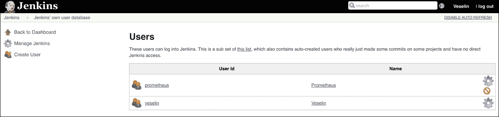

然后，在**管理 Jenkins** | **配置全局安全**下，选择 Jenkins 自有的用户数据库和**基于矩阵的安全**，然后添加两个账户。

### 提示

如果您发现这会导致在向 Jenkins 发出 `curl` 请求时出现问题，请取消选中**防止跨站请求伪造攻击**。

授予自己**总体管理权限**和**Prometheus 总体读取权限**，以及**任务构建/读取权限**：

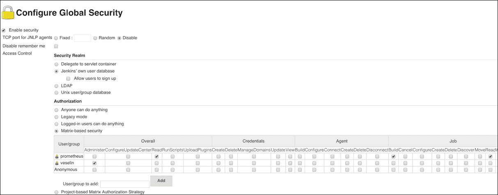

为了能够 SSH 进入应用程序（Web 服务器）节点，我们需要为 Jenkins 用户生成一个密钥：

```
# su - -s /bin/bash jenkins
$ ssh-keygen -trsa -b4096
Generating public/private rsa key pair.
Enter file in which to save the key (/var/lib/jenkins/.ssh/id_rsa): 
Created directory '/var/lib/jenkins/.ssh'
...

```

在这里，我们创建一个 Jenkins 用户的 SSH 配置文件（`~/.ssh/config`），内容为：

```
Host 10.0.* 
   StrictHostKeyChecking no 
   UserKnownHostsFile=/dev/null 
   User ec2-user 

```

这是为了允许我们的非交互式任务首次通过 SSH 连接到实例。

我们还需要将生成的公钥添加到自动扩展组的用户数据中，这样它就会出现在我们的 Web 服务器实例上。我们将使用标准的（Amzn-Linux）ec2-user 账户进行连接：

### 注意

请参考：[`github.com/PacktPublishing/Implementing-DevOps-on-AWS/blob/master/5585_07_CodeFiles/webserver/user_data.sh`](https://github.com/PacktPublishing/Implementing-DevOps-on-AWS/blob/master/5585_07_CodeFiles/webserver/user_data.sh)

```
... 
# Add Jenkins's key 
cat << EOF >> /home/ec2-user/.ssh/authorized_keys 
{{JENKINS_PUB_KEY_GOES_HERE}} 
EOF 

```

现在，让我们使用一些参数创建 Jenkins 任务（自由风格项目）：

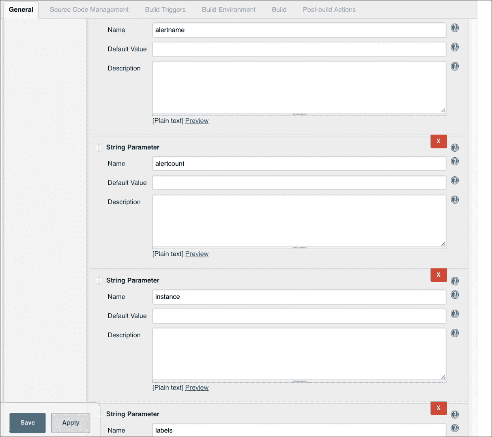

我们稍后会讨论这四个参数（`alertname`，`alertcount`，`instance`，`labels`）。在**构建**部分，选择**执行 Shell**并输入`exit 0`作为占位符，直到我们准备好进一步配置该任务。**保存**并让我们回到 Prometheus。

正如我们之前提到的，我们将使用 webhook 接收器来触发 Jenkins 任务。虽然接收器允许我们设置要调用的 URL，但似乎不允许包含任何参数。为此，我们将使用一个名为**prometheus-am-executor**的小型帮助程序应用程序（参考：[`github.com/imgix/prometheus-am-executor`](https://github.com/imgix/prometheus-am-executor)）。

执行程序位于 Alertmanager 和任意可执行文件之间。它接收来自 Alertmanager 的 webhook 调用并运行该可执行文件，将警报变量列表传递给它。在我们的案例中，我们将执行一个 Shell 脚本，该脚本处理这些变量并构建一个 Jenkins 期望的`curl`调用格式。

让我们在安装 Prometheus 和 Alertmanager 时同时安装帮助程序应用程序：

```
# yum -y install golang
# mkdir /opt/prometheus/executor && export GOPATH=$_
# go get github.com/imgix/prometheus-am-executor

```

成功后，您应该会在`/opt/prometheus/executor/bin`目录中找到一个二进制文件。现在提到的脚本（可执行文件）是：

### 注意

请参考：[`github.com/PacktPublishing/Implementing-DevOps-on-AWS/blob/master/5585_07_CodeFiles/promjenkins/opt/prometheus/executor/executor.sh`](https://github.com/PacktPublishing/Implementing-DevOps-on-AWS/blob/master/5585_07_CodeFiles/promjenkins/opt/prometheus/executor/executor.sh)

```
#!/bin/bash 

if [[ "$AMX_STATUS" != "firing" ]]; then 
  exit 0 
fi 

main() { 
  for i in $(seq 1 "$AMX_ALERT_LEN"); do 
    ALERT_NAME=AMX_ALERT_${i}_LABEL_alertname 
    INSTANCE=AMX_ALERT_${i}_LABEL_instance 
    LABELS=$(set|egrep "^AMX_ALERT_${i}_LABEL_"|tr '\n' ' '|base64 -w0) 
    PAYLOAD="{'parameter': [{'name':'alertcount', 'value':'${i}'}, {'name':'alertname', 'value':'${!ALERT_NAME}'}, {'name':'instance', 'value':'${!INSTANCE}'}, {'name':'labels', 'value':'${LABELS}'}]}" 
    curl -s -X POST http://localhost:8080/job/prometheus_webhook/build --user 'prometheus:password' --data-urlencode json="${PAYLOAD}" 
  done 
  wait 
} 

main "$@" 

```

本质上，我们正在构建一个 HTTP 调用，访问我们 Jenkins 作业的 URL `http://localhost:8080/job/prometheus_webhook/build`，并传递 `alertcount`、`alertname`、`instance` 和 `labels` 参数。所有值都来自 prometheus-am-executor 暴露的 AMX 环境变量（参考：[`github.com/imgix/prometheus-am-executor`](https://github.com/imgix/prometheus-am-executor)）。

现在我们需要重新配置 Alertmanager 来使用 Webhook：

### 注意

请参考：[`github.com/PacktPublishing/Implementing-DevOps-on-AWS/blob/master/5585_07_CodeFiles/promjenkins/opt/prometheus/alertmanager/alertmanager.yml`](https://github.com/PacktPublishing/Implementing-DevOps-on-AWS/blob/master/5585_07_CodeFiles/promjenkins/opt/prometheus/alertmanager/alertmanager.yml)

```
global: 
  smtp_smarthost: 'localhost:25' 
  smtp_from: 'alertmanager@example.org' 

route: 
  group_by: ['alertname', 'cluster', 'service'] 
  group_wait: 10s 
  group_interval: 30s 
  repeat_interval: 1m 
  receiver: team-X-mails 

  routes: 
  - receiver: 'jenkins-webhook' 
    match: 
      alertname: "High_disk_space_usage" 

receivers: 
- name: 'team-X-mails' 
  e-mail_configs: 
  - to: 'veselin+testprom@kantsev.com' 
    require_tls: false 
    send_resolved: true 

- name: 'jenkins-webhook' 
  webhook_configs: 
  - url: http://localhost:8888 

```

因此，我们添加了一个新的子路由，匹配 `alertname`：`High_disk_space_usage` 并使用 `jenkins-webhook` 接收器。

重新加载 Alertmanager 并开始执行器。假设 `executor.sh` 文件已放置在 `/opt/prometheus/executor` 路径下：

```
# cd /opt/prometheus/executor
# ./bin/prometheus-am-executor -l ':8888' ./executor.sh
2016/10/16 17:57:36 Listening on :8888 and running [./executor.sh]

```

我们已经启动了执行器（端口 `8888`），并准备好接受来自 Alertmanager 的请求。

在触发任何测试警报之前，让我们回到 Jenkins 作业。你现在已经熟悉了它所期望的参数，以及通过 `webhook` | `executor` | `jenkins` 设置传递的参数，因此我们可以用以下 Shell 脚本替换占位符 **Build** 步骤的内容：

```
echo "alertname: ${alertname}" 
echo "alertcount: ${alertcount}" 
echo "instance: ${instance}" 

export $(echo ${labels}|base64 -d) 

NODE=$(echo ${instance}|cut -d: -f1) 
LABEL_DIR=AMX_ALERT_${alertcount}_LABEL_path 
APP_DIR='/opt/myapp/tmp' 

if [ ${!LABEL_DIR} == ${APP_DIR} ];then 
ssh ${NODE} "sudo rm -f ${APP_DIR}/*.tmp"
fi 

```

为了测试这一切，我们需要 SSH 进入 Prometheus 正在监控的其中一个 ASG（Web 服务器）实例，并设置一个临时的假应用文件夹，如下所示：

```
# dd if=/dev/zero of=/tmp/dd.out bs=1M count=256
# mkfs.ext4 /tmp/dd.out
# mkdir -p /opt/myapp/tmp
# mount -oloop /tmp/dd.out /opt/myapp/tmp/

```

这应该会为我们提供一个小的文件系统来进行操作。接下来，我们填满它：

```
# dd if=/dev/zero of=/opt/myapp/tmp/dd.tmp bs=1M count=196

```

这已经超过了我们在 `High_disk_space_usage` 中设置的 20%，应该会触发警报。然后，执行器应该调用 Jenkins 并运行我们的作业：

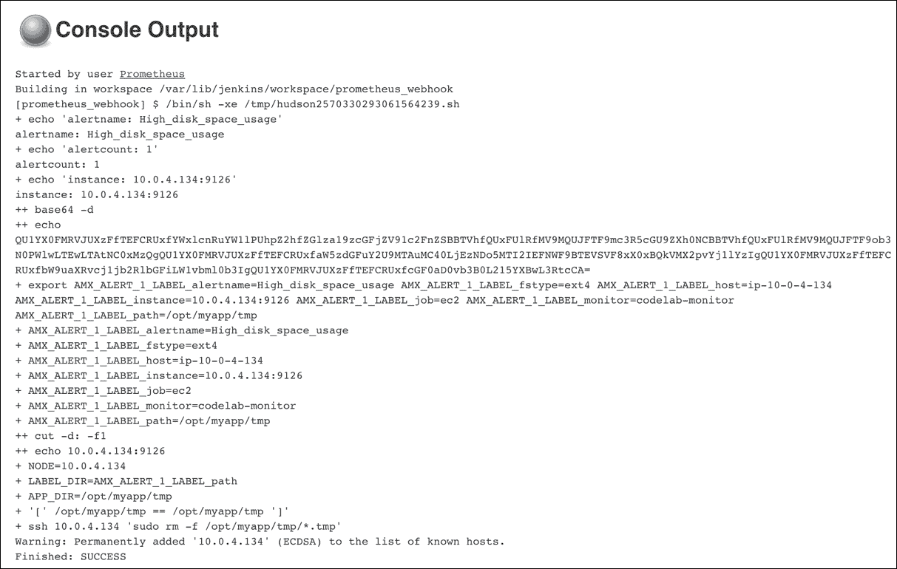

我们可以看到 Jenkins 通过 SSH 连接到受影响的实例，然后清理我们的假应用 `tmp` 目录。

需要注意的是，尽管在本示例中我们允许使用 root 权限，但在其他情况下，你应该确保 Jenkins 能以非特权用户的身份处理给定的 `tmp` 目录，或者如果必须使用 `sudo`，则应限制可用的命令和命令行参数。

# 总结

在这一章中，我们介绍了如何使用 Logstash 和 Elasticsearch 集中管理日志，并在 Kibana 中浏览这些日志。我们借助 Prometheus、Telegraf 和 Grafana 配置了指标收集和可视化。最后，我们通过 Prometheus 添加了监控并使用 Jenkins 实现自我修复。

下一章将带我们进入优化的领域。我们将讨论成本考虑和基于需求的扩展方法。
