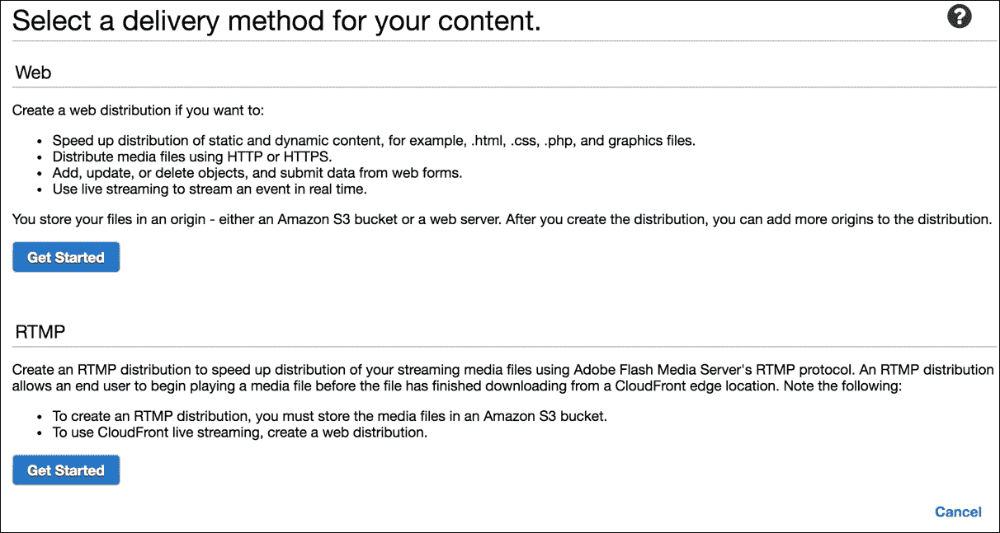

# 第八章 优化规模和成本

在优化方面，我们将从顶部开始，也就是说从设计阶段开始。

想象一遍又一遍地审视你的架构计划，直到你和你的同事们都确信，这是在当前信息条件下你能做到的最好的。现在想象一下，除非你有一个非常特殊的用例，否则其他人已经进行了类似的迭代，并慷慨地分享了结果。

回到现实中，幸运的是，我们并不远离。确实存在一个 AWS 的集体知识库，以博客文章、案例研究和白皮书的形式向任何开始他们的第一个云部署的人提供。

我们将从这些知识的精华样本开始，并将其应用于一个常见的架构示例中，试图在保持成本效益的同时实现最大的可伸缩性。

这个例子将是一个典型的前端（NGINX 节点）、后端（数据库集群）和 VPC 内的存储层部署：

尽管从技术上讲，我们整个部署都在互联网上，但上面的视觉分隔是为了强调 VPC 的网络隔离属性。

# 架构考虑

现在让我们逐个组件地检查这个部署，从 VPC 本身开始。

## VPC

我假设如果你仍然持有这本书，你可能已经接受了 VPC 的方式。

### CIDR

你预计会有多少个 VPC？它们会连接（VPC 对等连接）还是会在其他网络中进行桥接（VPN）？

这些问题的答案在选择 VPC 的 CIDR 时起到了作用。作为一个通则，建议避免常见的（家庭路由器）网络地址，如`192.168.1.0`或`10.0.0.0`。

如果你有多个 VPC，即使你没有立即需要将它们对等，也要跟踪和分配不同的 CIDR。

考虑一个 CIDR，它将允许足够大的子网以便在最小碎片化的情况下扩展实例（子网数量）。

### 子网和可用区

**可用区**（**AZs**）是我们如何为部署增加弹性的方式，因此我们应该至少有两个这样的区域。在某些配置中，例如需要集群仲裁的情况下，比如**ZooKeeper**，可能需要使用三个区域。在这种情况下，建议将仲裁成员放在不同的区域以更好地处理网络分区。为了适应这一点并保持费用低廉，我们可以在三个区域创建子网，在所有三个区域部署仲裁集群，并在其中的两个区域中部署其他组件（比如**NGINX**主机）。

让我们举一个例子，在这个例子中，我们在 VPC 中有一个 Zookeeper 和一个 Web 服务器（NGINX）组件。我们决定使用三个 AZ 并维护两组子网：**公共**和**私有**。前者通过 IGW 进行路由，后者通过 NAT：

在这里，我们有跨越所有三个可用区（AZs）和公共子网的 ELB。在私有子网空间中，我们有两个 Web 服务器和三个 ZooKeeper 节点的集群，这为我们提供了在最优成本下的良好弹性平衡。

### VPC 限制

AWS 对每个账户强制实施某些初始限制，当你的环境开始扩展时，这些限制可能会让你感到意外。需要检查的重要限制有：**实例**、**EBS** 和 **网络** 限制，这些可以在 **EC2 控制台**中找到：

在请求扩展时，选择一个足够高的数字以提供扩展缓冲，但不要选择过高的数字，因为毕竟，限制是为了防止意外或错误的过度配置。

# 前端层

设置好子网后，我们可以开始考虑我们的 VPC 内的居民。

前端或应用层由我们的自动扩展组构成，第一个我们将面临的决定是选择 EC2 实例类型。

前端应用的配置将很大程度上决定选择内存优化型、计算优化型或存储优化型实例。借助来自同事（在内部应用的情况下）的帮助和合适的性能测试工具（或服务），你应该能够确定该应用程序主要使用哪种系统资源。

假设我们选择了**C4 计算优化型**实例类，这是 AWS 推荐用于 Web 服务器的实例。下一个问题是——选择什么大小？

一种猜测方法是：取我们希望能够支持的每秒请求的平均数量，部署我们能够承受的最小实例数量（为了弹性，至少选择两个实例），并选择该类中最小的实例大小，然后进行负载测试。理想情况下，两个节点的平均利用率应该保持在 50% 以下，以便应对流量激增和故障事件，其中剩余的主机会承担所有负载。如果结果远低于这个标准，那么我们应该寻找一个不同的类，选择更小的实例类型，以获得更好的性价比。否则，我们将继续增加 C4 实例的大小。

接下来是自动扩展的问题。我们已经选择了合适的类和实例大小，现在需要设置扩展阈值。首先，如果你幸运地拥有可预测的负载，那么使用**定时操作**，你的问题就可以解决了：

你可以简单地告诉 AWS 在 *X* 点钟时扩展我，再在 *Y* 点钟时缩减。其他人则需要设置警报和阈值。

我们已经决定，50%的平均利用率（假设是 CPU）是我们的上限，到那时我们应该已经开始扩展。否则，如果我们的两个节点中的一个发生故障，在这个速率下，另一个节点将不得不以最大容量工作。举个例子，**CloudWatch**告警可以设置为超过 40%的平均 CPU 使用率持续五分钟，触发自动扩展组的动作，将组的大小增加 50%（即一个实例）。

### 提示

为了防止不必要的扩展事件，调整**冷却时间**的值非常重要。它应该反映出新启动的实例完全投入操作并开始影响**CloudWatch**指标所需的预期时间。

为了更精细地控制自动扩展如何响应告警，我们可以使用步进扩展（参考：[`docs.aws.amazon.com/autoscaling/latest/userguide/as-scale-based-on-demand.html`](http://docs.aws.amazon.com/autoscaling/latest/userguide/as-scale-based-on-demand.html)）。**步进调整**根据阈值突破的严重程度，允许有不同的响应。例如，如果负载从 40%增加到 50%，则仅扩展一个实例；但如果负载从 40%跃升到 70%，则直接扩展到两个或更多实例。

### 提示

使用步进扩展时，**冷却时间**是通过**实例预热**选项设置的。

虽然我们希望快速扩展以防止任何服务中断，但缩减应该及时进行以节省按小时计费的费用，但又不能过早进行，以免导致扩展循环。

**CloudWatch**用于缩减的告警应持续的时间应远长于我们之前观察到的五分钟。而且，扩展和缩减的阈值之间的间隔应足够宽，以避免实例启动后很快被终止。

EC2 实例利用率只是触发器的一个例子；还可以考虑 ELB 指标，如总请求数、非 2XX 响应或响应延迟。如果选择使用其中任何一种，请确保您的缩减告警能够响应**INSUFFICIENT_DATA**状态，这种状态通常出现在没有流量的时期（例如，深夜）。

# 后端层

在应用程序背后，我们很可能会发现某种类型的数据库集群。以这个例子为例，我们选择了 RDS（MySQL/PostgreSQL）。然而，扩展和弹性设计可以轻松地转化为适用于 EC2 实例上的自定义数据库集群。

从高可用性的角度出发，对于 RDS 来说，相关功能称为**多可用区（Multi-AZ）**部署。这为我们提供了一个主 RDS 实例以及一个热备份**备用**副本作为故障转移解决方案。不幸的是，备用副本无法用于其他用途，也就是说，我们不能让它服务于只读查询等。

我们 VPC 中的多可用区设置看起来是这样的：

在**PRIMARY**发生故障时，RDS 会自动切换到**STANDBY**，并在此过程中更新相关的 DNS 记录。根据文档，典型的故障切换大约需要一到两分钟。

触发因素包括主节点不可用（因此 AWS 健康检查失败）、完整的 AZ 故障，或用户中断，如 RDS 实例重启。

到目前为止，使用 Multi-AZ，我们拥有一个相对弹性强的设置，但可能不是非常可扩展。在忙碌的环境中，通常会为写入操作分配一个主 DB 节点，而读取操作则从副本中进行。便宜的选择是向当前配置中添加一个副本：

在这里，我们将数据写入**PRIMARY**并从**REPLICA**读取，或者对于读密集型应用程序，读取可以同时从两者进行。

如果我们的预算允许，我们可以进一步提升，并在我们部署前端/应用节点的两个子网中提供一个**REPLICA**：

跨 AWS 区域的延迟已经非常低，但通过这种每区域的 RDS 分布，我们可以进一步降低延迟。所有主机都会写入**PRIMARY**，但是它们可以在读取时优先选择本地（同一区域）的**REPLICA**。

既然我们正在大手笔花费，额外的 RDS 性能提升可以通过预配置的 IOPS 来实现。如果你运行的是重负载并且需要高 RDS 存储 I/O，这一点值得考虑。

尽管是间接的，缓存也是一种非常有效的方式，通过减轻负载来提高 RDS 的可扩展性。

这里流行的软件选择包括**Memcached**和**Redis**。它们都可以轻松在本地设置（在每个应用主机上）。如果你希望利用共享缓存，可以在 EC2 上运行集群，或者使用 AWS 托管的 ElastiCache 服务。使用后者，我们可以再次拥有**Multi-AZ**配置，并且配备多个副本以提高弹性和降低延迟：

你会注意到，故障切换场景与 RDS 不同，因为没有备用实例。在**PRIMARY**发生故障时，**ELASTICACHE**会提升最新的**REPLICA**。

### 提示

注意，升级后，**PRIMARY**端点保持不变，但升级后的副本地址会发生变化。

# 对象存储层

为了实现轻松的可扩展性，我们必须在可能的情况下重点构建无状态应用程序。不在应用节点上保持状态意味着将任何有价值的数据存储在其他地方。一个经典的例子是**WordPress**，其中用户上传的文件通常保存在本地，这使得横向扩展这种设置变得困难。

虽然可以通过使用**弹性文件系统**（**EFS**）在 EC2 实例之间共享文件系统，但为了提高可靠性和可扩展性，我们最好使用像**AWS S3**这样的对象存储解决方案。

可以公平地说，访问 S3 对象并不像使用 EFS 卷那样简单，但 AWS 工具和 SDK 大大降低了门槛。为了便于实验，你可以从 S3 CLI 开始。最终，你会希望在应用程序中集成 S3 功能，可以使用以下其中之一：

+   Java/.NET/PHP/Python/Ruby 或其他 SDK（参考：[`aws.amazon.com/tools/`](https://aws.amazon.com/tools/)）

+   REST API (参考：[`docs.aws.amazon.com/AmazonS3/latest/dev/RESTAPI.html`](http://docs.aws.amazon.com/AmazonS3/latest/dev/RESTAPI.html))

在之前的章节中，我们探讨了 IAM 角色作为一种方便的方式，将 S3 存储桶的访问权限授予 EC2 实例。我们还可以通过使用 VPC 端点来增强实例与 S3 之间的连接：

|   | *VPC 端点使你能够在 VPC 和其他 AWS 服务之间创建私有连接，无需通过 Internet、NAT 设备、VPN 连接或 AWS Direct Connect。端点是虚拟设备。它们是横向扩展、冗余且高度可用的 VPC 组件，允许你的 VPC 实例与 AWS 服务之间进行通信，同时不会对网络流量带来可用性风险或带宽限制。* |   |
| --- | --- | --- |
|   | --[`docs.aws.amazon.com/AmazonVPC/latest/UserGuide/vpc-endpoints.html`](http://docs.aws.amazon.com/AmazonVPC/latest/UserGuide/vpc-endpoints.html) |

如果你的客户端位于不同的地理位置并且向你的存储桶上传内容，则可以使用 S3 传输加速（参考：[`docs.aws.amazon.com/AmazonS3/latest/dev/transfer-acceleration.html`](http://docs.aws.amazon.com/AmazonS3/latest/dev/transfer-acceleration.html)）来提升他们的体验。只需在存储桶的设置页面点击**启用**即可：

我们现在已经覆盖了速度改进；可扩展性是 S3 服务本身内置的，对于成本优化，我们有不同的存储类别。

S3 目前支持四种类型（类别）的存储。最昂贵且最耐用的是**标准类**，也是默认存储类型。接下来是**低频访问类（Standard_IA）**，价格较便宜，但需要注意的是，它确实是为较少访问的对象设计的，否则与之相关的检索成本会非常高。接下来是**减少冗余类**，尽管名字有些吓人，但它的耐用性依然相当高，达到了 99.99%。最后是**冰川存储类**，它类似于磁带备份，意味着对象会被归档，并且有 3-5 小时的检索时间（紧急检索可在 1-5 分钟内完成，但会有更高的费用）。

你可以在上传时指定对象的存储类（冰川存储类除外），或者通过 AWS 控制台、CLI 或 SDK 后续更改存储类。归档到冰川存储类是通过存储桶生命周期策略（存储桶设置页面）来完成的：

我们需要添加一条新规则，描述在什么条件下对象会被归档：

顺便提一下，生命周期规则也可以帮助您清理旧文件。

## 负载均衡层

在过去的*疯狂时代*，人们曾通过公共 IP 和 DNS 轮询来搭建 Web 服务器，但如今负载均衡器已经取而代之。

我们将研究 AWS ELB 服务，但这绝不是唯一的可选方案。实际上，如果您的使用场景对延迟非常敏感，或者您观察到频繁且短暂的流量激增，您可能希望考虑使用 NGINX 或 HAProxy 来部署自己的 EC2 负载均衡节点集群。

ELB 服务按每小时固定费用加带宽费用计费，因此我们可能无法通过减少费用来节省成本，但我们可以探索提高性能的方法。

## 跨区域负载均衡

在正常情况下，Classic ELB 会将其节点部署在我们的后台（应用程序）实例所在的区域，并根据这些区域转发流量。也就是说，区域**A**中的 ELB 节点将与同一区域的后台实例通信，区域**B**也适用相同的原则：

这样做是合理的，因为它可以确保最低的延迟，但有几点需要注意：

+   为了获得最佳负载分布，每个区域中应保持相等数量的后台节点。

+   客户端缓存 ELB 节点的 IP 地址将始终保持与相应后台实例的连接

为了改善这种情况，虽然会带来一些（最小的）延迟增加，我们可以在 Classic ELB 的属性中启用**跨区域负载均衡**：

这将改变流量分配策略，使得对特定 ELB 节点的请求将均匀分布到所有已注册（状态：InService）后台实例上，从而将我们之前的示意图更改为如下：

每个区域中后台节点数量不均将不再影响负载均衡，外部方也无法仅针对单个 ELB 实例进行攻击。

## ELB 预热

ELB 服务的一个重要方面是它在一组特定类型的 EC2 实例上运行，这与我们的后台节点非常相似。考虑到这一点，ELB 会根据需求进行扩展，这一点与我们的自动扩展组类似，因此不会让人感到意外。

当传入流量波动在一定范围内时，这一方案效果很好，因为 ELB 可以吸收流量，或者流量逐渐增加，为 ELB 扩展和适应提供足够的时间。然而，剧烈的流量激增可能会导致 ELB 丢失连接，如果流量大到一定程度的话。

这种情况可以通过一种叫做**预热**的技术来防止，实际上就是在预期流量高峰前扩展 ELB。目前这不是用户端可以执行的操作，这意味着你需要联系 AWS 支持来提交 ELB 预热请求。

## CDN 层

**CloudFront**或 AWS 的 CDN 解决方案是另一种提高 ELB 和 S3 服务性能的方法。如果你不熟悉 CDN 网络，一般来说，它们为不同地理位置的客户端提供更快的访问速度。此外，CDN 还会缓存数据，以便后续请求无需到达你的服务器（也叫**源**），从而大大减轻负载。

因此，假设我们的 VPC 部署在美国，如果我们在 ELB 和/或 S3 存储桶前设置**CloudFront 分发**，那么来自欧洲等地的客户端请求会被路由到最近的*欧洲 CloudFront 节点*，该节点会根据需要提供缓存响应或通过 AWS 内部高速网络从 ELB/S3 获取请求的数据。

要设置一个基本的**Web 分发**，我们可以使用**CloudFront 仪表盘**：

一旦我们**开始使用**，第二页会展示分发的属性：

方便的是，同一 AWS 账户中的资源会被建议。源是 CloudFront 需要连接的数据源，例如，位于我们应用程序前面的 ELB。在**备用域名**字段中，我们将输入我们的网站地址（比如`www.example.org`），其余设置目前可以保留默认值。

当分发变为活动状态后，剩下的工作就是更新指向 ELB 的`www.example.org`的 DNS 记录，将其改为指向分发地址。

## Spot 实例

我们的最后一点是利用**Spot**实例进一步节省 EC2 成本。Spot 实例代表了 EC2 平台上未使用的资源，用户可以随时竞标。一旦用户成功竞标并分配到 EC2 实例，只要当前的 Spot 价格低于他们的出价，该实例就会持续存在，否则它会被终止（实例元数据中会提供通知，参考：[`docs.aws.amazon.com/AWSEC2/latest/UserGuide/spot-interruptions.html`](http://docs.aws.amazon.com/AWSEC2/latest/UserGuide/spot-interruptions.html)）。

这些条件使得 Spot 实例非常适合于工作流，其中任务开始时间灵活，且如果实例终止，可以安全地恢复任务。例如，可以在 Spot 实例上运行短期的 Jenkins 作业（甚至有插件支持），或者用它来运行执行一系列小任务的工作流，这些任务会定期将状态保存到 S3/RDS。

## AWS 计算器

最后，这是一款简单却实用的工具，可以帮助你了解计划部署的成本：[`calculator.s3.amazonaws.com/index.html`](http://calculator.s3.amazonaws.com/index.html)（记得取消勾选页面顶部的**FREE USAGE TIER**选项）。

如果你正试图比较本地部署与云计算的成本，那么以下内容可能对你有帮助：[`aws.amazon.com/tco-calculator/`](https://aws.amazon.com/tco-calculator/)。

# 总结

在这一章中，我们研究了优化 AWS 部署的可扩展性和运行成本的不同方法。

我们从基础的 VPC 及其核心属性开始，包括 CIDR、子网以及如何规划增长。我们讨论了提高前端、后端、存储和负载均衡组件性能的方法。接着，我们探讨了 AWS Spot 实例，作为执行低优先级批处理任务的一种非常高效的成本解决方案。

在下一章中，我们将进入安全领域，探讨如何更好地加强 AWS 环境的安全性。
