# 第九章：保护您的 AWS 环境

安全性无疑是*云计算——你应该做吗？*辩论中的一个热门话题。

一方面，我们有*我的硬件就是我的城堡*这群人，他们觉得将计算环境委托给某个抽象实体——这个实体告诉你你随时拥有*X*台机器的计算能力，但你既看不见也摸不着，甚至连你的数据也无法掌控——是一件非常不自然的事情。

另一方面，我们有那些根本不介意云这一神秘概念的人。他们的主要兴趣在于以合理的成本即时获取几乎无限的计算资源。不幸的是，他们有时可能过于集中于快速完成工作，而忽视了前一群人提出的一些有效且健康的关注点。

然后是中间地带——那些意识到在迁移到云端时必须接受的牺牲，以及为弥补这些牺牲而采取的各种解决方案的人。也就是说，通过精心设计的应用程序和仔细规划的架构，您的环境可以保持足够的安全性，无论底层托管平台是什么类型。

我们将研究这些解决方案和实践中的一些，以尝试提高我们的 AWS 环境的安全性。

我们将涵盖：

+   使用 IAM 管理访问

+   VPC 安全性

+   EC2 安全性

+   安全审计

让我们开始吧。

# 使用 IAM 管理访问

> *AWS 身份和访问管理（IAM）是一个网络服务，帮助您安全地控制用户对 AWS 资源的访问。您使用 IAM 来控制谁可以使用您的 AWS 资源（身份验证），以及他们可以使用哪些资源和以何种方式使用（授权）。*
> 
> *参考：[`docs.aws.amazon.com/IAM/latest/UserGuide/introduction.html`](http://docs.aws.amazon.com/IAM/latest/UserGuide/introduction.html)*

我们将使用 IAM 来管理访问（无论是用户还是应用程序）到我们 AWS 账户下的服务。

## 保护根账户

当一个新的 AWS 账户被创建时，它会包含一个用户（账户所有者），也称为**根登录**。这个强大的用户拥有所有权限，包括终止 AWS 账户的选项。因此，通常建议仅将根登录用于高层账户管理，而日常操作则通过 IAM 用户账户进行。

我们将遵循这个建议，因此我们在注册 AWS 账户后做的第一件事就是以**根用户**登录，禁用任何不必要的身份验证机制，并创建一个权限较低的 IAM 用户账户。

让我们浏览到 AWS 控制台（参考：[`console.aws.amazon.com/console/home`](https://console.aws.amazon.com/console/home)）：

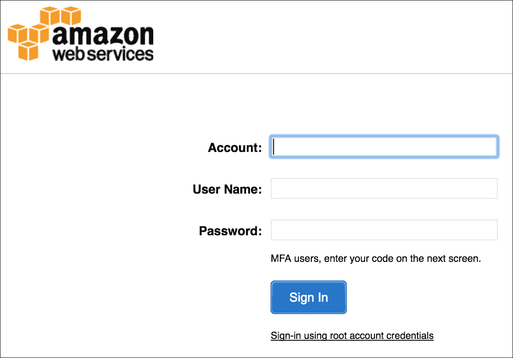

注意到**登录**按钮下方的小字。这是我们需要点击的链接，用于访问根账户，它会带我们到一个稍微不同的登录页面，如下截图所示：

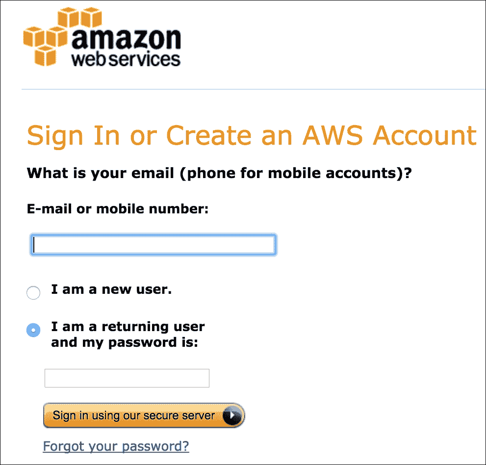

在这里，使用你的主要 Amazon 凭证；你应该能看到熟悉的控制台页面。点击右上角的名字：

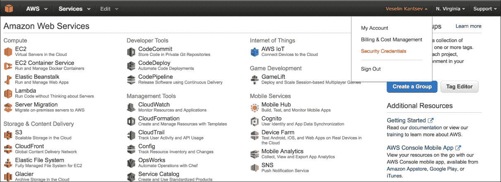

选择**安全凭证**将带我们到根账户的安全选项：

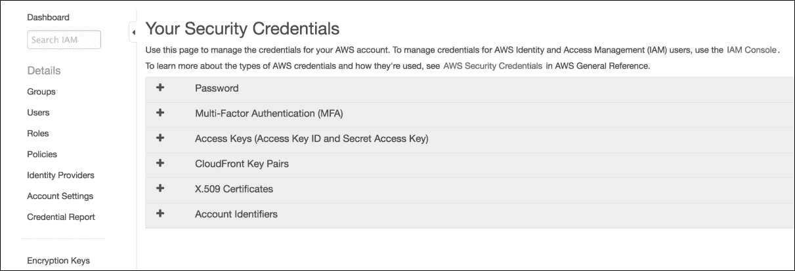

启用**多因素认证 (MFA)**；事实上没有理由不启用它。你可以购买硬件令牌设备，或者直接使用手机上的应用程序，如**Google Authenticator**。

删除**访问密钥**下的密钥。这些密钥用于 API 访问，而你在账户管理任务中很可能不需要它们。

接下来，点击左侧的**账户设置**链接，更新当前的密码策略。现如今有很多密码管理工具，选择一个复杂的密码并定期更改已不再是麻烦，所以尽情设置吧：

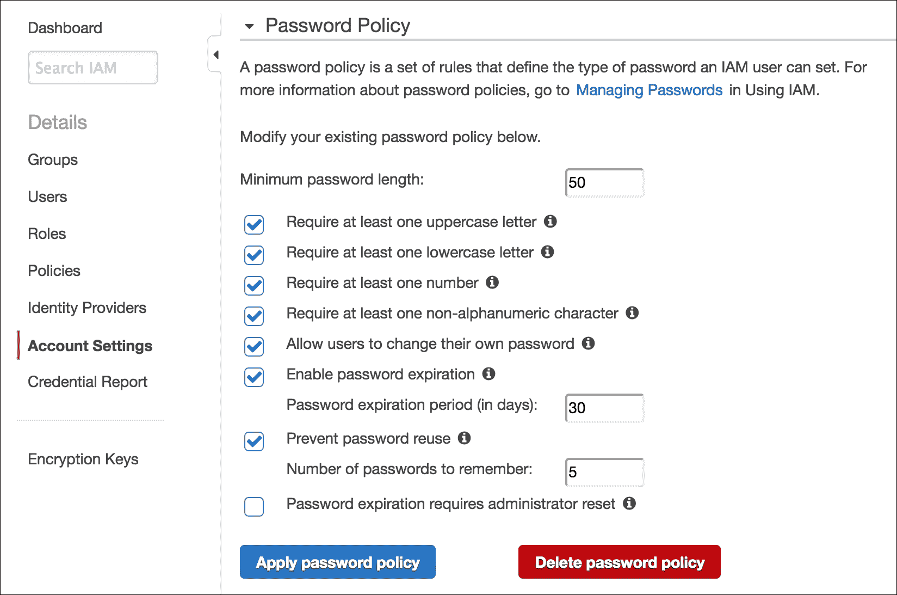

在同一页面上，我们可以禁用任何不打算使用的区域：

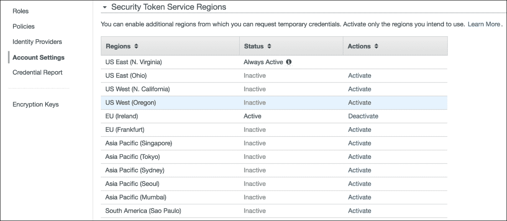

现在我们继续创建用于日常 AWS 使用的 IAM 账户。我们将用户组织成不同的组。首先，我们创建一个具有管理员权限的用户组，之后可以利用该组管理 AWS 账户的几乎所有方面。

在左侧选择**用户组**，创建一个新组并赋予其管理员权限。然后在**用户**下创建一个账户，并将其添加到该组。

在创建用户过程中，你会有机会创建 API 访问密钥（你也可以稍后创建），如果你计划使用 AWS CLI 或一般的程序访问，这些密钥会很有用。创建后，选择该用户并切换到**安全凭证**选项卡：

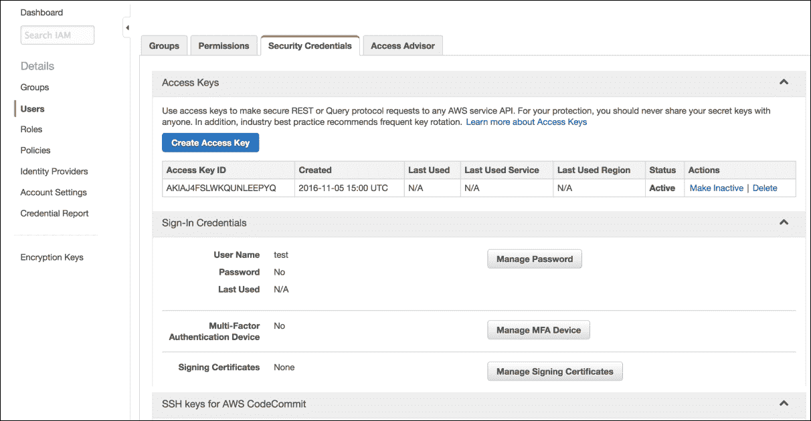

在这里，你可以选择创建**访问密钥**对，如果你之前没有创建的话，还可以设置用于 AWS 控制台的密码。如前所述，你应该借此机会启用**MFA**（进一步了解，请查看[`docs.aws.amazon.com/IAM/latest/UserGuide/id_credentials_mfa_configure-api-require.html`](http://docs.aws.amazon.com/IAM/latest/UserGuide/id_credentials_mfa_configure-api-require.html)）。如果你计划通过 SSH 使用 CodeCommit 服务，这里是上传公钥的地方。

就是这样，从现在开始，你可以使用刚刚创建的 IAM 账户的用户名和密码登录 AWS 控制台，根账户则保留给特殊场合使用。

对于那些可能已经维护外部用户数据库的人，顺便提一下，有一些方法可以使用**联邦身份认证**将其集成。

### 注意

欲了解更多详细信息，请参考以下链接：[`aws.amazon.com/iam/details/manage-federation`](https://aws.amazon.com/iam/details/manage-federation) [`docs.aws.amazon.com/IAM/latest/UserGuide/id_roles_providers.html`](http://docs.aws.amazon.com/IAM/latest/UserGuide/id_roles_providers.html)

# VPC 安全性

如果您已经在 VPC 中部署了资源，那么您已经朝着正确的方向前进。在这里，我们主要关注网络安全以及 VPC 提供的增强安全性的工具或功能。

## 安全组

这些代表了我们在 AWS 文档中所说的第一层防护。**安全组**（**SG**）通常分配给 EC2 实例，提供一种有状态的防火墙，只支持允许规则。

它们非常灵活，一个 EC 实例可以有多个这样的组。规则可以基于主机 IP 地址、CIDR 或甚至其他安全组，例如，允许从组 ID `sg-12345` 进入的 `HTTP:80` 流量。

通常，在 VPC 内，我们会根据角色创建安全组，例如 **web 服务器**、**数据库**、**缓存**。同一组件的实例将被分配相应的安全组，从而调控平台不同组件之间的流量。

### 提示

常常会有冲动基于 VPC 的 CIDR 地址来允许流量，认为 VPC 是一个相对孤立的环境。尽量避免这种做法，并限制对真正需要访问的组件的权限。

数据库安全组应允许来自/到 web 服务器安全组的流量，但可能不允许来自缓存安全组的流量。

## 网络 ACL

第二层防护形式是网络 ACL。

ACL（访问控制列表）是无状态的，它们应用于实例所在的底层子网，规则的评估依据优先级，就像传统的防火墙一样。作为额外功能，您还可以设置拒绝策略。

### 提示

网络 ACL 位于 VPC 的边缘，因此在流量到达任何安全组之前会先进行评估。这个特性加上设置拒绝规则的能力，使得它们非常适合应对潜在的 DDOS 威胁。

总的来说，流量管理的两种方式在我们的 VPC 安全设计中各有其作用。ACL 应该存储一组较为广泛且不常变化的规则，并由灵活的安全组进行细粒度控制。

## VPN 网关

如果您正在使用 VPC 作为本地基础设施的扩展，那么将这两者更紧密地连接起来会非常有意义。

您可以选择创建一个安全的 VPN 通道，而不是通过安全组或 ACL 限制外部访问，从而受益于隐式加密。

您可以通过硬件或软件 VPN 解决方案将 VPC 连接到您的办公室网络（参考：[`docs.aws.amazon.com/AmazonVPC/latest/UserGuide/vpn-connections.html`](http://docs.aws.amazon.com/AmazonVPC/latest/UserGuide/vpn-connections.html)）。

对于更为苛刻的使用案例，可以通过 AWS Direct Connect 服务（参考: [`docs.aws.amazon.com/directconnect/latest/UserGuide/Welcome.html`](http://docs.aws.amazon.com/directconnect/latest/UserGuide/Welcome.html)）将 VPN 流量通过高速直接连接传输到 AWS。

## VPC 对等连接

在类似的情况下，如果你不是使用办公网络，而是有另一个需要与主 VPC 通信的 VPC，你可以使用 VPC 对等连接：

> *VPC 对等连接是两个 VPC 之间的网络连接，允许你使用私有 IP 地址在它们之间路由流量。任一 VPC 中的实例都可以像在同一网络中一样相互通信。你可以在自己的 VPC 之间创建 VPC 对等连接，也可以在单一地区内与另一个 AWS 账户中的 VPC 创建对等连接。*
> 
> *AWS 使用现有的 VPC 基础设施来创建 VPC 对等连接；这既不是网关，也不是 VPN 连接，并且不依赖于独立的物理硬件。通信没有单点故障，也没有带宽瓶颈。*
> 
> *参考: [`docs.aws.amazon.com/AmazonVPC/latest/PeeringGuide/vpc-peering-overview.html`](http://docs.aws.amazon.com/AmazonVPC/latest/PeeringGuide/vpc-peering-overview.html)*

你的 VPC 将能够直接通信（在同一地区内），因此你不需要暴露任何不需要显式暴露的服务。此外，你可以方便地继续使用私有地址进行通信。

# EC2 安全性

更深入地探讨我们的 VPC，我们现在将关注增强 EC2 实例安全性的方式。

## IAM 角色

**IAM EC2 角色**是推荐的方式来授予你的应用程序访问 AWS 服务的权限。

举个例子，假设我们在 Web 服务器 EC2 实例上运行一个 Web 应用，并且该应用需要能够将资源上传到 S3。

一种快速满足此要求的方式是创建一组 IAM 访问密钥，并将其硬编码到应用程序或其配置中。然而，这意味着从那时起，除非我们执行应用程序/配置部署，否则可能不容易更新这些密钥。此外，由于某些原因，我们可能会将同一组密钥与其他应用程序重复使用。

安全性隐患是显而易见的：重用密钥会增加暴露的风险，如果这些密钥被泄露，而硬编码密钥则大大增加了我们的响应时间（更难旋转这些密钥）。

上述方法的替代方案是使用角色。我们可以创建一个 EC2 角色，授予其对 S3 存储桶的写访问权限，并将其分配给 Web 服务器 EC2 实例。实例启动后，它将获得临时凭证，可以在其元数据中找到，并且这些凭证会定期更换。我们现在可以指示我们的 Web 应用从实例元数据中获取当前的凭证，并使用这些凭证执行 S3 操作。如果我们在该实例上使用 AWS CLI，我们会发现它默认会获取这些元数据凭证。

### 提示

角色只能在实例启动时与之关联，因此即使实例当前不需要，给所有主机分配角色也是一个好习惯。

角色可以用来扮演其他角色，使得实例能够通过扮演同一账户内或跨 AWS 账户的其他角色，暂时提升其权限（参考：[`docs.aws.amazon.com/STS/latest/APIReference/API_AssumeRole.html`](http://docs.aws.amazon.com/STS/latest/APIReference/API_AssumeRole.html)）。

## SSH 访问

与 EC2 实例交互的最常见方式是通过 SSH。以下是一些建议，帮助你使 SSH 会话更加安全。

### 独立密钥

当启动一个普通的 EC2 实例时，它通常会关联一组 PEM 密钥，以便进行初始 SSH 访问。如果你还在团队中工作，我的建议是不要与同事共享相同的密钥对。

相反，一旦你或理想情况下是你的配置管理工具获得对实例的访问权限，应该为团队成员创建独立的用户账户并上传公钥（并在需要时授予 `sudo` 访问权限）。然后可以删除默认的 `ec2-user` 账户（在 Amazon Linux 上）和 PEM 密钥。

### 入口点

无论 EC2 实例的用途如何，通常情况下你不需要直接的外部 SSH 访问权限。

在 EC2 实例上分配公共 IP 地址并打开端口通常是出于便利性考虑，但这是一种不必要的暴露，也在某种程度上与最初使用 VPC 的理念相矛盾。

然而，SSH 无可否认是有用的。因此，为了平衡各种因素，可以设置一个带有公共地址的 SSH 网关主机。然后，你可以限制对该主机的访问，仅允许来自家庭和/或办公室网络的访问，并允许该主机通过 SSH 连接到 VPC 内的其他资源。

选择的节点成为 VPC 的管理入口点。

## ELB 到处可见

延迟是一个重要因素。你可以在网上找到许多杰出的 AWS 用户撰写的工程文章，他们花费了大量时间和精力对 ELB 性能及其副作用进行了基准测试。

也许不令人意外的是，他们的研究发现，使用 ELB 相较于直接从后端 Web 服务器群组处理请求，确实会有一定的延迟惩罚。不过，另一方面，这样的额外层次，不论是 ELB 还是自定义 HAProxy 实例的集群，实际上在这些 Web 服务器前充当了一个保护屏障。

在 VPC 边缘使用负载均衡器，Web 服务器节点可以保持在私有子网中，如果你能够接受一定的延迟折衷，这无疑是一个不小的优势。

## 默认启用 HTTPS

服务如**AWS 证书管理器**使得使用 SSL/TLS 加密变得更加简便和经济。你将获得证书并且自动续订（在 AWS 内免费）。

是否应该加密 ELB 和 VPC 内的后端实例之间的流量是另一个好问题，但现在请务必为你的 ELB 添加证书，并在可能的地方强制使用 HTTPS。

## 加密存储

合理地说，由于我们关注的是加密 HTTP 流量，我们不应忽视静态数据。

AWS 上最常见的存储类型必须是 EBS 卷，其次是 S3。以上两项服务都支持强大且轻松实现的加密。

### EBS 卷

首先需要注意，并非所有 EC2 实例类型都支持加密卷。在进一步操作之前，请参考此表：[`docs.aws.amazon.com/AWSEC2/latest/UserGuide/EBSEncryption.html#EBSEncryption_supported_instances`](http://docs.aws.amazon.com/AWSEC2/latest/UserGuide/EBSEncryption.html#EBSEncryption_supported_instances)

另外，让我们来看一下哪些数据会被加密以及如何加密：

> *当你创建一个加密的 EBS 卷并将其附加到支持的实例类型时，以下类型的数据将被加密：*
> 
> *- 卷内的静态数据*
> 
> *- 在卷和实例之间传输的所有数据*
> 
> *- 从卷创建的所有快照*
> 
> *加密发生在托管 EC2 实例的服务器上，提供从 EC2 实例到 EBS 存储的数据传输加密。*
> 
> *参考：[`docs.aws.amazon.com/AWSEC2/latest/UserGuide/EBSEncryption.html`](http://docs.aws.amazon.com/AWSEC2/latest/UserGuide/EBSEncryption.html)*

请注意，数据在托管 EC2 实例的服务器上进行加密，也就是说是虚拟化管理程序进行加密。

自然地，如果你希望做得更彻底，你可以在实例本身管理加密。否则，你可以相对放心，因为每个卷都会使用一个单独的密钥进行加密，而这个密钥又是由与给定 AWS 账户关联的主密钥加密的。

在密钥管理方面，AWS 推荐你创建一个自定义密钥来替代默认为你生成的密钥。让我们创建一个密钥并开始使用它。

在 IAM 仪表盘中，选择左侧的**加密密钥**：

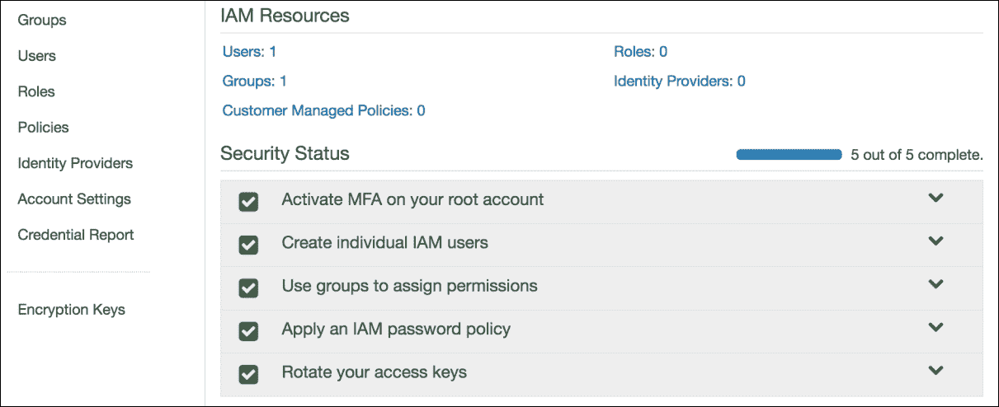

选择**创建密钥**并填写详细信息：

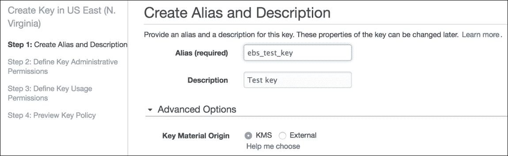

然后你可以定义谁可以管理密钥：

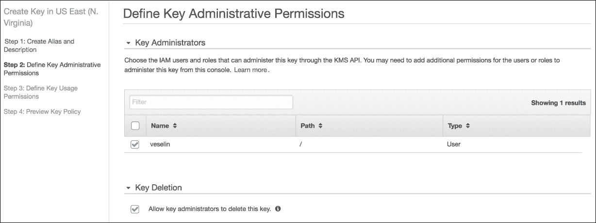

以及谁可以使用它：

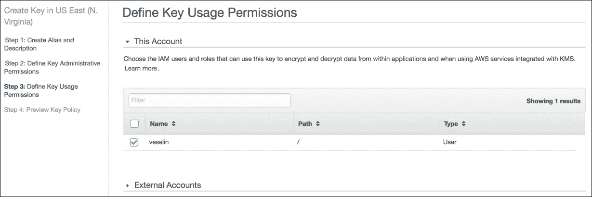

结果应该在密钥列表中显示在仪表盘上：

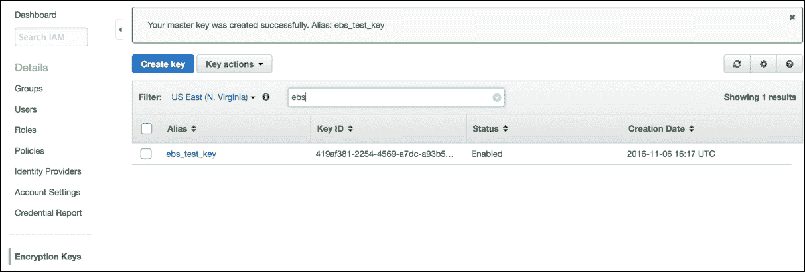

现在，如果你切换到 EC2 控制台并选择创建一个新的 EBS 卷，那么自定义加密密钥应该作为一个选项可用：

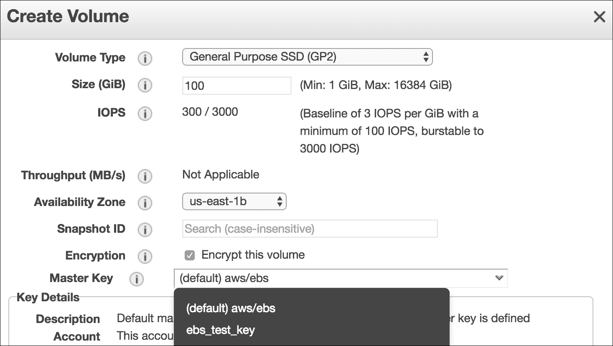

现在你可以按照常规流程，将新的加密卷附加到 EC2 实例上。

### S3 对象

S3 允许使用与 EBS 相同的**AES-256**算法对存储桶内的所有对象或部分对象进行加密。

有几种密钥管理方法可用（参考：[`docs.aws.amazon.com/AmazonS3/latest/dev/serv-side-encryption.html`](http://docs.aws.amazon.com/AmazonS3/latest/dev/serv-side-encryption.html)）：

+   你可以导入自己的外部密钥集。

+   你可以使用 KMS 服务在 AWS 中生成自定义密钥。

+   你可以使用 S3 服务的默认（唯一）密钥。

对现有数据进行加密可以在文件夹级别进行：

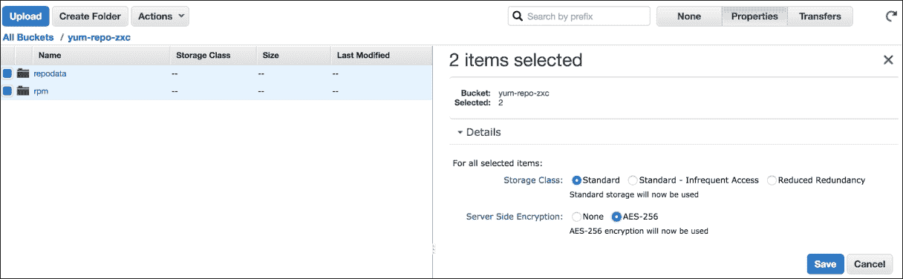

或者通过选择单个文件：

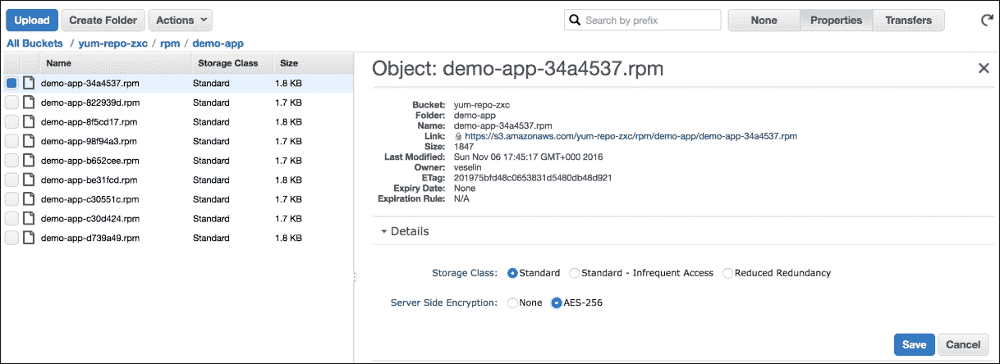

新数据可以根据需求进行加密，方法是在`PUT`请求中指定一个头部（`x-amz-server-side-encryption`），或者如果使用 AWS S3 CLI，则通过传递任意`--sse`选项。

还可以通过使用存储桶策略（参考：[`docs.aws.amazon.com/AmazonS3/latest/dev/UsingServerSideEncryption.html`](http://docs.aws.amazon.com/AmazonS3/latest/dev/UsingServerSideEncryption.html)）来拒绝任何未指定加密的上传尝试。

## 操作系统更新

如果你关注任何安全公告，你可能已经注意到新安全漏洞发布的频率。因此，说操作系统包在完全更新的 EC2 实例被配置好后，几天甚至几个小时就会变得过时，可能并不算夸张。除非最新的漏洞影响到 BASH 或 OpenSSL，否则我们往往会因大多数主机处于隔离环境（如 VPC）中而感到安心，从而一再推迟更新。

我相信我们都同意，这是一种令人恐惧的做法，可能存在的原因是更新生产系统时所带来的焦虑感。像**自动扩展**这样的服务也带来了合法的复杂性，但这可以转化为一种优势。让我们看看如何做到这一点。

我们将一个典型的 EC2 部署分为两组实例：*静态（非自动扩展）*和*自动扩展*。我们的任务是将最新的操作系统更新部署到这两组实例上。

在静态实例的情况下，由于某些应用程序特定的限制或其他类型的限制，无法进行扩展，我们将不得不采取众所周知的方法：首先在一个完全独立的环境中测试更新，然后更新我们的静态生产主机（通常一次一个）。

然而，通过 Auto Scaling，操作系统补丁更新可能会变得更加愉快。您可能记得在前几章中我们使用 Packer 和 Serverspec 生产和测试 AMI。类似的 Jenkins 管道也可以用于执行操作系统更新：

1.  启动源 AMI。

1.  执行包更新。

1.  运行测试。

1.  打包一个新的 AMI。

1.  按阶段在生产环境中部署。

为了熟悉这个过程，我们当然需要付出相当的努力，确保测试、部署和回滚程序尽可能可靠，但最终的结果是值得付出这些努力的。

# 安全审计

AWS 提供了一些不错的工具来帮助您保持安全策略的有效性。这些工具会为您提供详细的审计报告，包括如何改进任何潜在风险区域的建议。此外，您还可以配置服务日志，从而更好地了解部署或整个 AWS 账户中发生的情况。

## VPC 流日志

此服务允许您捕获通过 VPC 流动的网络流量信息。生成的日志（不幸的是，尚未完全实时）包含源/目的端口、源/目的地址、协议及其他相关细节（完整列表请见：[`docs.aws.amazon.com/AmazonVPC/latest/UserGuide/flow-logs.html#flow-log-records`](http://docs.aws.amazon.com/AmazonVPC/latest/UserGuide/flow-logs.html#flow-log-records)）。除了生成一些很酷的图表来帮助识别网络瓶颈外，数据还可以用于发现异常行为。例如，您可以通过解析**流日志**并将任何可疑条目转发到监控解决方案来设计一个内部 IDS。

在 VPC 控制台中，选择一个 VPC 并切换到**流日志**选项卡：

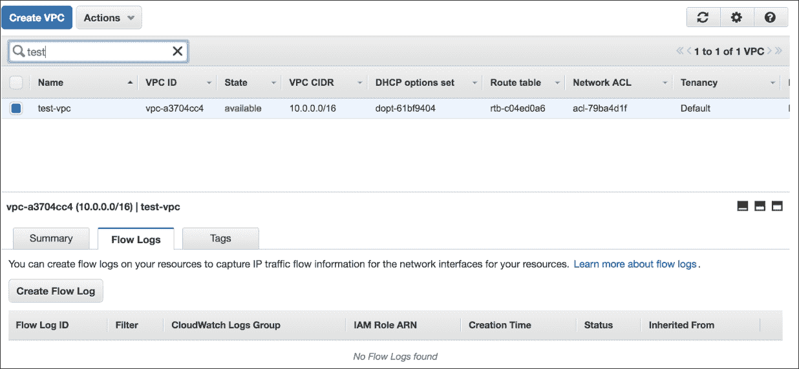

点击**创建流日志**：您需要填写一些参数，如要使用的 IAM 角色（点击**设置权限**以创建一个）和所需的**目标日志组**名称。

几分钟后，所述日志组应出现在**CloudWatch** 仪表板的**日志**部分下：

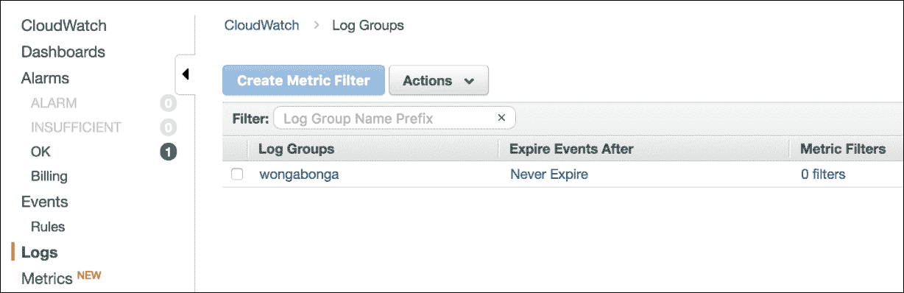

在该组中，您将找到每个 EC2 实例（更准确地说是每个网络接口）对应的日志流，其中包含捕获的流量详细信息。

## CloudTrail

**CloudTrail** 服务用于记录 AWS 账户内的 API 活动。这包括通过 AWS 控制台、CLI、SDK 或其他为您发出调用的服务所做的请求。此日志对安全审计和故障排除都很有帮助。收集的数据存储在 S3 中作为加密对象，并附带签名哈希，以帮助确保没有发生篡改。

要启用该服务，我们进入**CloudTrail** 仪表板，寻找**开始使用**或**添加新日志**按钮：

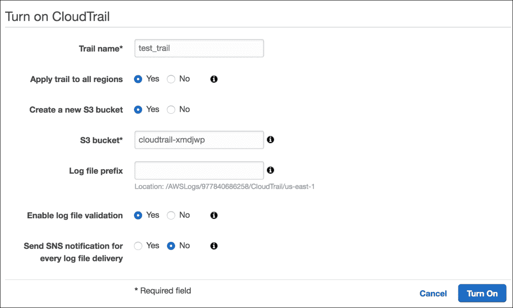

我们选择从所有区域收集数据，并将其存储在启用验证的新 S3 存储桶中。还可以在每次日志交付时接收通知，这对于进一步的处理任务非常有用。

返回仪表板后，我们点击新创建的轨迹以查看其设置：

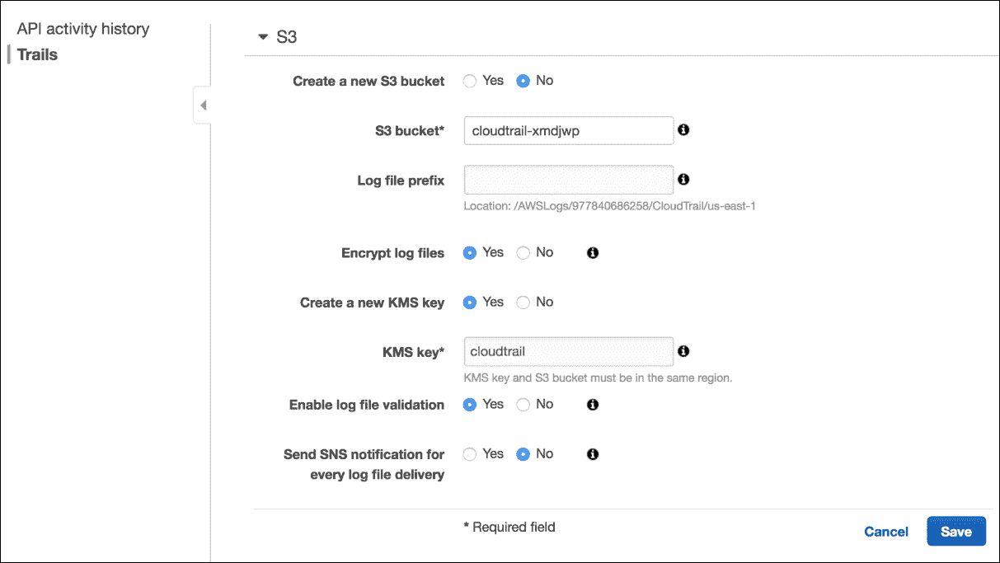

我们启用加密，然后为新的 KMS 密钥输入名称。大约 15 分钟后，我们应该能在 API 活动历史仪表板选项卡下看到事件出现：

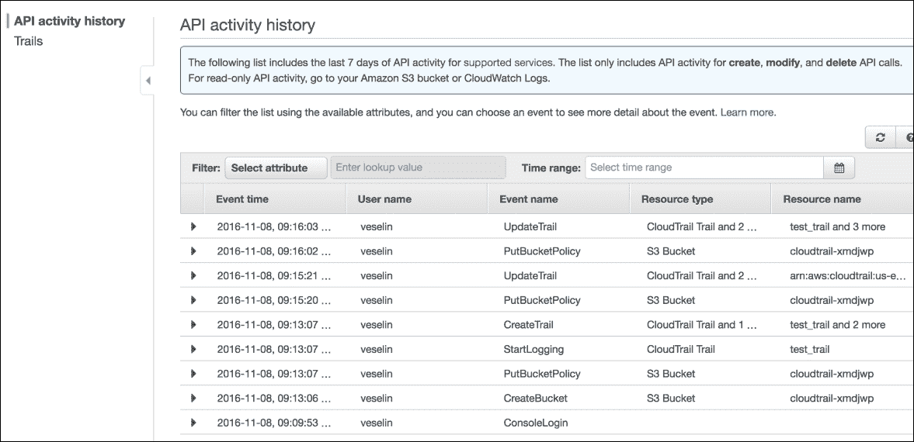

展开这些条目中的任何一项将提供更多信息，例如给定 API 调用使用的 `access_key` 和源 IP。

在 S3 存储桶中，我们会找到两个子文件夹：**CloudTrail** 存储 API 日志，**CloudTrail-Digest** 存储文件哈希值。

## Trusted Advisor

**Advisor** 默认启用，并定期审查您的 AWS 账户，以识别任何风险或改进的领域。

它提供关于成本、性能、安全性和高可用性（HA）的洞察，如仪表板所示：

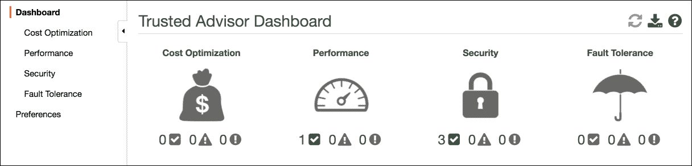

此时我们主要关注安全性提示：

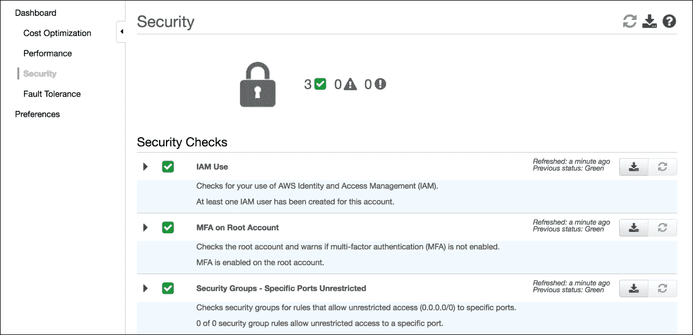

按照我们在本章之前为确保根账户安全所采取的步骤，一切看起来都很正常。

除此视图外，还可以在 **首选项** 选项卡下配置每周电子邮件报告。

## AWS Config

使用 **Config** 我们可以追踪、检查并对部署中发生的资源变更进行警报。

启用时，服务会对区域内找到的资源进行清单管理，并开始记录任何变化。

一旦检测到资源变更，例如添加了一个新规则到安全组，Config 会允许我们查看一个时间轴，显示当前和任何之前的资源变更详情。

另一个强大的功能是变更检查。在 Config 中，我们可以定义一组规则，用于评估每次资源变更，并在必要时生成警报。

让我们尝试这两种使用案例。

点击 **开始使用**，然后选择一个 **存储桶名称** 和 **角色名称**：

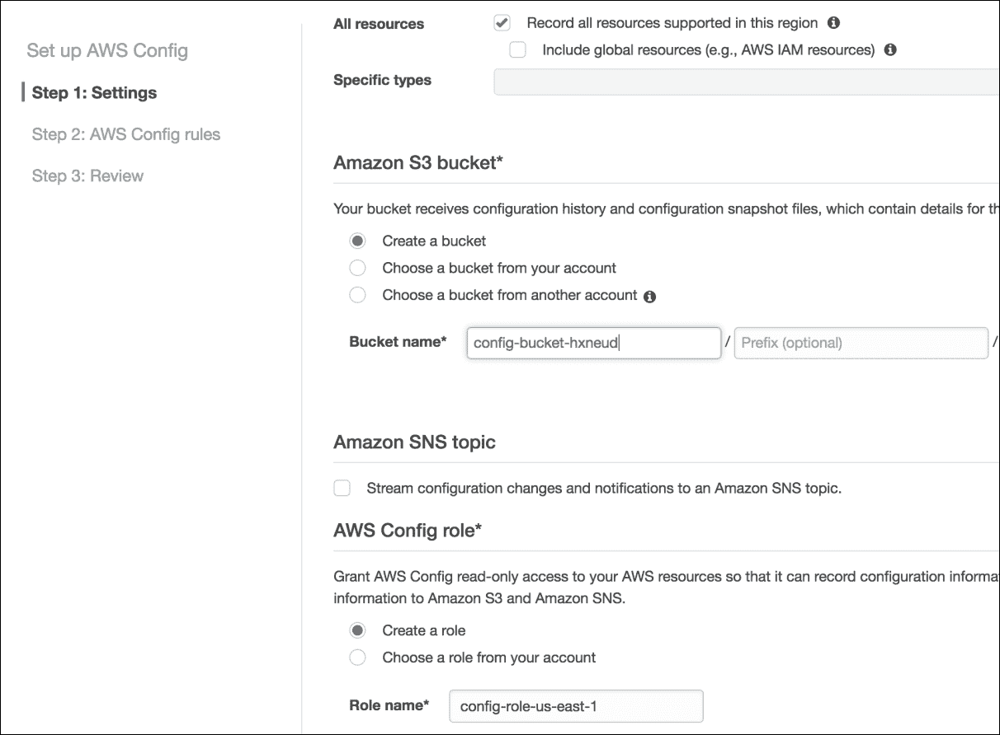

在下一页，我们可以选择一些规则来开始：

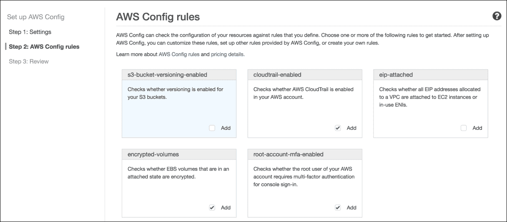

我们选择监控 CloudTrail、EBS 卷和 MFA 设置。完成设置后，返回到仪表板上的 **规则** 选项卡，我们可以添加更多规则。

### 注意

请注意，在撰写本文时，每个活动规则每月需要 $2 的费用。

点击 **添加规则**，并查找 **restricted-ssh** 规则，该规则会监控安全组中的 SSH 访问权限。设置新规则后，我们可以进行一些资源更改，看看 Config 如何对这些变更作出反应。例如，禁用 CloudTrail，并创建一个临时安全组，允许从任何地方进行 SSH 访问。

稍等片刻，我们可以看到 **AWS Config** 仪表板上的效果：

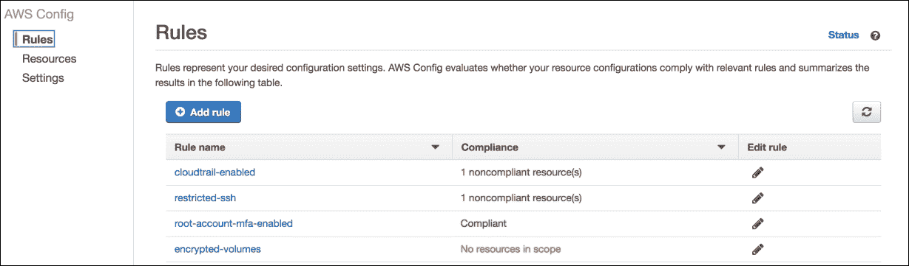

我们可以点击**restricted-ssh**条目查看更多细节。定位列表中的不合规条目并点击**AWS Config**时间轴图标：

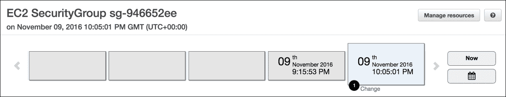

我们可以看到该资源的两个记录状态。点击**更改**，我们可以看到发生了什么：

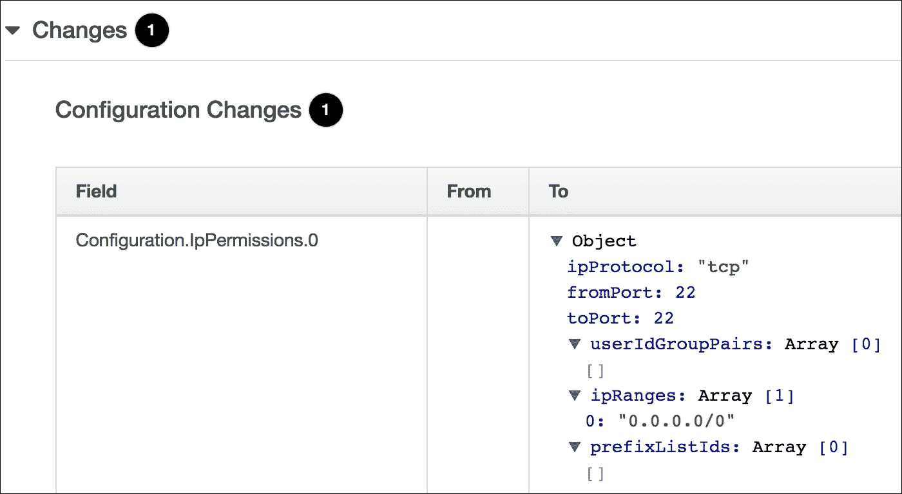

在这里，我们可以看到为什么我们的安全组资源被标记为**不合规**。

除了 AWS 提供的 Config 规则外，您还可以以 Lambda 函数的形式编写自己的规则（参考：[`docs.aws.amazon.com/config/latest/developerguide/evaluate-config_develop-rules.html`](http://docs.aws.amazon.com/config/latest/developerguide/evaluate-config_develop-rules.html)）。

## 自我渗透测试

在这里，我们讨论自我渗透测试作为一种廉价的替代方案，或者作为您在雇佣第三方进行正式测试之前的准备步骤（考虑到每次渗透测试通常是收费的）。

目标是建立一个可以按需和/或定期对我们的 VPC 部署进行内部和外部漏洞扫描的系统。

有两个社区项目可以帮助我们完成这项任务，它们是**OpenVAS**（参考：[`www.openvas.org`](http://www.openvas.org)）和**OpenSCAP**（参考：[`www.open-scap.org`](https://www.open-scap.org)）。

设置这样一个自动扫描器的相对简单方法是使用一个预先制作的 AMI 和一些用户数据。本质上，您会在一个标准的 EC2 实例上安装前面提到的框架之一或两个，并从中创建一个 AMI。然后，启动这个 AMI 的新实例（可能是定期启动），并使用用户数据来启动扫描器，将要扫描的目标 URI 传递给它，然后通过电子邮件发送任何扫描报告或保存到 S3。

调度是通过 Auto Scale Group 实现的，它简单地启动一个节点，然后在 N 小时后终止它（即执行扫描所需的时间）。或者，您可以使用 CloudWatch 事件配合一些 Lambda 函数（参考：[`aws.amazon.com/premiumsupport/knowledge-center/start-stop-lambda-cloudwatch`](https://aws.amazon.com/premiumsupport/knowledge-center/start-stop-lambda-cloudwatch)）。

### 注意

请注意，漏洞扫描或类似活动需要首先获得 AWS 支持的批准（参考：[`aws.amazon.com/forms/penetration-testing-request`](https://aws.amazon.com/forms/penetration-testing-request)）。

遵循本章中的建议是创建一个更安全环境的一个步骤，但我们绝不能认为工作已经完成。有人说过，安全是一个过程，而不是产品，因此它或许应该是每天待办事项的一部分。

推荐您订阅相关的安全信息源或邮件列表。

AWS 维护了自己的一些信息源：

+   [`aws.amazon.com/blogs/security`](https://aws.amazon.com/blogs/security)

+   [`aws.amazon.com/security/security-bulletins/`](https://aws.amazon.com/security/security-bulletins/)

+   [`alas.aws.amazon.com/`](https://alas.aws.amazon.com/)

# 总结

在本章中，我们介绍了如何提高 AWS 账户整体安全性的一些方法。

我们查看了可以用于审计和对可疑活动发出警报的 AWS 服务，以及一些可以用于定期漏洞扫描的开源工具。

在下一章中，我们将查看一些流行的（以及较不常见的）AWS 技巧和窍门。
