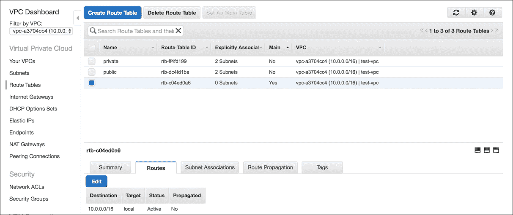
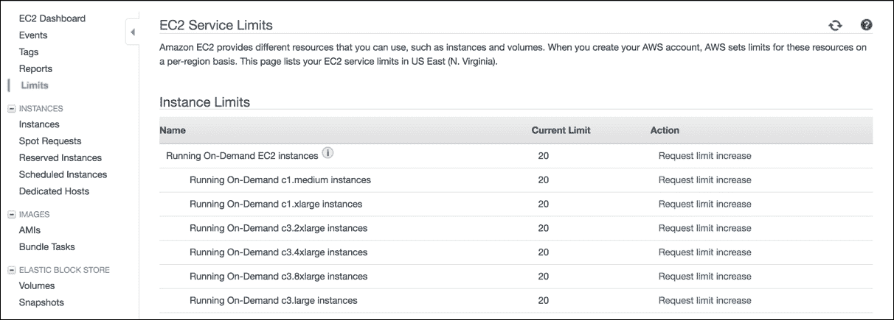
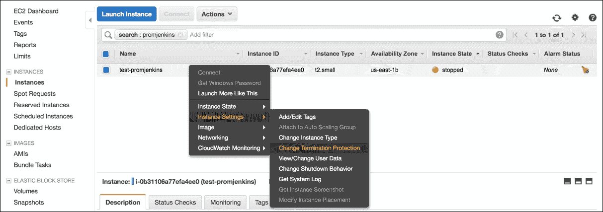

# 第十章：AWS 提示与技巧

在本章中，我想为你提供一些随机的建议。有些是我自己使用 AWS 的经验总结，其他一些则来自 AWS 白皮书或相关博客。

### 注意

**关于此主题的几个链接**：

[`d0.awsstatic.com/whitepapers/AWS_Cloud_Best_Practices.pdf`](https://d0.awsstatic.com/whitepapers/AWS_Cloud_Best_Practices.pdf)

[`wblinks.com/notes/aws-tips-i-wish-id-known-before-i-started/`](https://wblinks.com/notes/aws-tips-i-wish-id-known-before-i-started/)

[`launchbylunch.com/posts/2014/Jan/29/aws-tips/`](https://launchbylunch.com/posts/2014/Jan/29/aws-tips/)

# 使用 VPC

除了最初的少量设置开销外，通常认为在 VPC 内部署基础设施会更好。AWS 默认提供了一个 VPC，并且通常会在其中部署资源，除非你另有要求。VPC 为你提供了更大的灵活性，能够更好地控制网络并增强安全性。此外，它是免费的。

# 将主路由表作为后备

如果你遵循前面的建议，你会发现一个新的 VPC 会附带一个标记为 **Main** 的路由表：

我建议保持当前设置，使用单一的本地路由，并为任何自定义路由需求创建额外的路由表。

这样，主路由表或默认路由表就成了一个安全网，用于任何被创建但未关联的子网，无论是出于失误还是故意。

# 保持在 VPC 内部

尽管诱人，但尽量避免暴露你的 VPC 资源，因为这样会违背目的。也就是说，不要给你的 EC2 实例分配公有 IP，虽然这可能会提供快捷的访问，而是使用一个指定的 ssh-gateway 主机（也叫做堡垒主机或跳跃主机）来进行跳转。

你只会为这台机器分配一个公有（弹性）IP，确保它的安全组只允许你家或工作地点的静态 IP 访问，并通过该 IP 连接（例如通过 ssh）到 VPC 中的其他实例。

# 提前创建 IAM 角色

我们已经讨论过 EC2 实例角色，这是为你的应用提供凭证的更好方式。

一个好的做法是，总是为你的实例创建并分配 IAM 角色，即使当时不需要且没有权限。

这是因为只有在启动 EC2 实例时才能分配 IAM 角色。

# 优先考虑组而非用户

当你创建第一个部署时，你可能不一定有太多用户需要访问你的 AWS 账户。

尽管如此，最好是将权限分配给 IAM 组，并让你的 IAM 用户成为该组的成员，而不是每次新增用户时都赋予其权限。

从长远来看，团队成员通常会需要（重复使用）相同的权限列表。

# 了解 AWS 服务限制

AWS 账户带有一些限制，这些限制可以在 AWS 控制台中找到：

这些措施旨在保护客户和服务提供商免受任何无意的使用。以下是一些示例：

+   您的 CloudFormation 模板中出现编码错误，导致意外分配大量存储或其他资源。

+   配置错误的自动扩展组，启动了数十个或数百个实例。

+   您的用户发起 API 调用，请求一个不寻常数量的实例。

如我们所见，前述的限制大多数情况下是一个很好的主意。

如果您处于生产环境中，准备迎接一个重大事件以及随之而来的流量激增，您当然希望了解您当前的 AWS 服务限制。大多数实例类型的初始限制为 20，VPC EIP 的限制为 5，存储类型的限制为 20 TB。

理想情况下，您应该在了解了预期使用基准（允许突发）之后，尽早审查这些内容，并在需要时联系 AWS 支持申请增加限制。

# 根据需要预热 ELB

在流量激增的问题上，虽然 ELB 性能卓越，但仍然可能会有需要预热它们的场合。

如您所知，ELB 是一组由 AWS 管理的 EC2 实例，运行专有的负载均衡软件。

一个算法确保 ELB EC2 实例的数量会根据您的应用流量模式而增长或缩减。这种自适应扩展过程基于一段时间内采集的平均流量数据，因此并不是非常迅速。

为确保此功能不会成为问题，AWS 允许您请求预热 ELB，也就是说，提前进行扩容。

如果您正在使用高级支持计划，您可能可以等到事件前几小时再处理；否则，您应该尽早联系支持团队，以便考虑到额外的响应时间。

您将被问及一系列与每秒请求次数、平均有效负载大小、事件持续时间以及其他流量特性相关的问题，这些将帮助 AWS 支持团队判断是否有必要进行预热。

# 使用终止保护

不言而喻，如果可以避免，应该避免在机器上保持状态。

毕竟，AWS 的美妙之处在于，它让您不再过于关注单个实例。它提倡集群或服务文化，关注终端节点的健康状态。

对于那些极少数的情况，我们必须拥有这些管理节点或类似的非自动扩展节点，不过，您从保护自己免于错误的 API 调用或控制台点击中，唯一能获得的就是好处。

# 尽可能进行标签标记

这听起来像是一项繁琐的工作，但它确实会带来后续的回报。无论是帮助你更清晰地理解 AWS 账单，还是在管理资源时提供更多的灵活性，标签总是非常有用的。

为你的工具配置标签功能，在资源创建时应用标签，然后定期扫描你的环境，查找任何没有标签的资源。

# 跨多个可用区部署

毫无疑问，在同一物理位置内部署应该会带来最低的延迟。

然而，在大多数使用场景下，增加的几毫秒延迟，换来的是多倍增加的可靠性，这是值得的。

尝试将你的部署至少跨越两个可用区。

# 增强你的 ELB 健康检查

默认的 ELB 健康检查允许你检查原始的 TCP 响应，或者深入到更高层的协议，检查 HTTP/200 响应。

两者都可以。一项基本的检查应该能帮助你入门，但随着应用程序及其依赖项的发展，你可能也需要增强健康检查。

假设你正在提供一个依赖缓存和数据库后端的 Web 应用程序。

如果 ELB 检查的是 `TCP:80`，那么只要你的 HTTP 守护进程在运行，它就会收到一个 OK 响应。如果你检查的是 HTTP/200，反而是验证对应用程序文件（位于磁盘上的）的访问，但可能并没有更多的验证。

你也可以通过将 ELB 指向应用程序内部的专用健康检查端点，从中受益更多，该端点会在返回绿色信号之前验证所有依赖项（磁盘：OK，缓存：OK，数据库：OK）。但要小心不要影响整体应用性能：健康检查调用得越频繁，它应该越轻量。

# 将 SSL 负载卸载到 ELB 上

AWS 现在提供免费的 SSL 证书作为 **证书管理服务** 的一部分，该服务还会处理证书的续期。单单这个理由，就足够不错了。

在 ELB 上管理证书比在多个 EC2 后端实例上进行相同操作要方便得多。此外，通过将 SSL 操作委托给 ELB，至少可以节省一些 CPU 性能。

# EIP 与公共 IP 的比较

关于这两种类型的几个要点，供你参考，万一你不太熟悉这些。

公共 IP：

+   你在启动实例时可以选择是否分配公共 IP。

+   地址会在重启后保持，但停止/启动时不会。

+   这些不收取额外费用

弹性 IP（Elastic IP）：

+   你可以在实例启动后随时将 EIP 与实例关联或取消关联

+   EIP 会在重启或启动/停止操作之间保持关联

+   EIP 会产生费用（如果未使用时）

+   EIP 可以在 EC2 实例之间迁移

鉴于我们今天面临的 IPv4 地址短缺问题，AWS 正巧通过对任何闲置的 EIP 资源收费，巧妙地激励着合理的资源配置。

### 提示

做个绅士/淑女，使用完 IP 后释放它们。

# 留意按整点计费

AWS 允许您按使用量和按需付费，这是非常棒的。但是需要注意的是，AWS 按小时增量计费。

所以，假设您正在运行一些批处理作业，每 10 分钟启动和终止一个实例。一个小时零 10 分钟后，您将启动和终止六个实例（6x 最小增量为 1 小时），尽管它们每个实例的运行时间都不超过 10 分钟，但仍然会计算为 6 小时的可计费使用时间。

无论如何，为了避免意外情况，强烈建议您设置计费警报。这些是简单的 CloudWatch 警报，可以在估计账单达到阈值时通知您。

# 使用 Route53 ALIAS 记录

这是 Route53 服务特有的一种特殊内部 DNS 记录类型。

对于 AWS 用户，别名记录是 CNAME 的一个很好的替代选择（支持的资源）

一些主要优点包括：

+   别名直接解析为 IP 地址，节省了 CNAME 需要的额外查找

+   别名记录支持区域顶点，因此您可以创建一个使用域名顶部的别名（例如 `mydomain.com`）

+   别名记录允许高级 Route53 功能，如加权/延迟/地理路由和故障转移

+   别名查找没有与之相关的 AWS 成本

### 注意

注意：Route53 别名记录目前只能指向有限的一组 AWS 资源。有关更多信息，请参阅：[`docs.aws.amazon.com/Route53/latest/DeveloperGuide/resource-record-sets-choosing-alias-non-alias.html`](http://docs.aws.amazon.com/Route53/latest/DeveloperGuide/resource-record-sets-choosing-alias-non-alias.html)

# S3 桶命名空间是全局的

这意味着，如果在创建桶时遇到名称冲突，很可能是因为 AWS 宇宙中的其他人已经抢先了您的名称。

设计一个命名方案，提供一些唯一性；也许使用您组织的名称或桶名称的随机前缀/后缀。

S3 桶删除通常传播速度较慢。请注意您创建桶的区域。如果选择错误区域，根据我的经验，您需要删除然后等待 20-30 分钟，才能在正确的位置重新创建。

# - 在 S3 桶名称中使用 - 而不是 .

看起来经常有一个问题，即是否应该将桶命名为 `images-example-com` 还是 `images.example.com`。

有两件事需要考虑：

+   您是否希望使用 HTTPS 访问 S3？

+   您是否希望使用自定义域名代替默认的 S3 桶 URL？

严格来说，名称中带有点的桶在使用默认桶 URI 通过 HTTPS 访问时会显示 SSL 不匹配警告。

这是因为 S3 在 `.amazonaws.com` 域上运行，并且任何额外的点会使桶看起来像是子域（不包含在 SSL 证书中）。

另一方面，如果你想使用自定义域名（CNAME）指向你的存储桶，你必须使用点（.）。也就是说，存储桶名称必须与所说的自定义 URL 匹配，才能使 S3 的虚拟主机风格服务正常工作。

例如，我们将存储桶命名为 `images.example.com`，并添加 DNS 记录 `images.example.com` CNAME `images.example.com.s3.amazonaws.com`。

然后，S3 会将传入的请求转发到任何与 HTTP 头中的主机名匹配的存储桶（参见：[`docs.aws.amazon.com/AmazonS3/latest/dev/VirtualHosting.html`](http://docs.aws.amazon.com/AmazonS3/latest/dev/VirtualHosting.html)）。

因此，似乎根据我们选择的名称，我们可以使用其中一个功能或另一个功能（HTTPS 与 CNAME）。但这个困境有解决方案：CloudFront。

在我们的存储桶前放置一个 CloudFront 分发允许指定自定义域名，并且可以使用自定义 SSL 证书。

# 随机化 S3 文件名

一个重要的事实是，S3 在分发数据时会考虑文件名（对象键）。当你的内容不使用顺序命名约定时，性能往往会更好。有关分发机制的更多详细信息，请参考：[`docs.aws.amazon.com/AmazonS3/latest/dev/request-rate-perf-considerations.html`](http://docs.aws.amazon.com/AmazonS3/latest/dev/request-rate-perf-considerations.html)

# 初始化（预热）EBS 卷

过去，所有 EBS 存储都需要初始化，以避免首次访问时的性能损失，而当处理越来越大的卷时，这种性能损失会变得非常明显。如今，情况已经有所改善，因为新的卷不再需要预热（参考：[`docs.aws.amazon.com/AWSEC2/latest/UserGuide/ebs-initialize.html`](http://docs.aws.amazon.com/AWSEC2/latest/UserGuide/ebs-initialize.html)）；然而，仍然需要考虑启动过程中的额外延迟（如果卷在启动时需要）与任何潜在的性能提升之间的权衡。

对于非常大的卷，初始化可能是不可行的，但在其他情况下，确实值得进行初始化。或者，如果你在 EC2 上运行自己的数据库服务器，那么无论卷的大小如何，你都应该考虑预热卷。

你可以使用建议的命令行步骤来测量执行此类优化所花费的时间（参考：[`docs.aws.amazon.com/AWSEC2/latest/UserGuide/ebs-initialize.html`](http://docs.aws.amazon.com/AWSEC2/latest/UserGuide/ebs-initialize.html)）。

# 总结

在本章中，我们探讨了一些技巧、窍门、事实和一般信息，这些内容在使用 AWS 时非常有用。

这自然只是这些公共秘密中的一小部分，如果你对 AWS 环境的独特性以及用户为应对这些特点而创造的各种技巧感到兴奋——我建议你查看：[`aws.amazon.com/blogs/aws/`](https://aws.amazon.com/blogs/aws/)。
