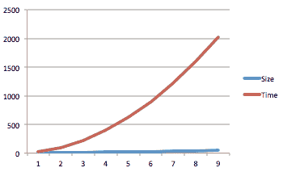
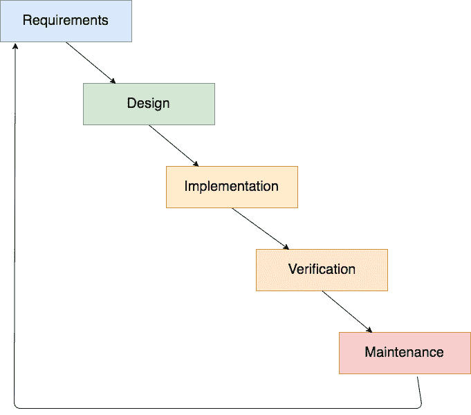
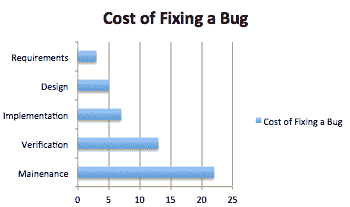

# 现实世界中的 DevOps

在过去的几年里，软件行业发展迅速。我最喜欢的演变例子之一是金融科技（FinTech），这是一个新的领域，其名称源于金融和技术的融合。在这个领域，企业往往以颠覆性的方式构建金融产品，直到威胁到大型传统银行，甚至将它们置于危险之中。

这种情况主要是由于大公司失去了在 IT 系统中保持成本效益的能力，而银行恰恰是这些大公司之一。银行仍然使用 IBM 大型机运行系统，并且不愿意迁移到云端，这一点并不奇怪；同样，银行的核心组件依然是自 90 年代以来没有更新过的 COBOL 应用程序，这也并不奇怪。如果不是因为只有少数具备 AWS 或 Google Cloud Platform 账户的才华横溢的工程师，实际上可以构建出能够替代某些银行产品的服务，比如货币兑换甚至是经纪服务，那这一切或许还不会那么糟糕。

这在过去几年中已成为一种常态，FinTech 中小公司成功的部分原因归功于 DevOps，另一个部分则是其规模。通常，大公司会随着时间推移将 IT 系统商品化，外包给第三方，这些第三方专注于价格，忽视了质量。这是一个非常有效的削减成本的措施，但也有一个副作用：你失去了快速交付价值的能力。

在这一章中，我们将把 DevOps 放到一个更广泛的视角来看，并探索它如何帮助我们创造成本效益高的工作单元，从而在极短的时间内提供大量价值。

# 什么是 DevOps？

亨利·福特（Ford 公司创始人）有一句著名的名言：

“如果我问人们他们想要什么，他们会说更快的马。”

这就是传统系统管理员角色的变化：人们在尝试解决错误的问题。

所谓“错误的问题”，是指缺乏合适的工具来自动化生产系统中的干预，避免人为错误（这种错误比你想象的还要常见），并导致公司流程中的沟通不连续。

最初，DevOps 是开发、运维和 QA 的交集。DevOps 工程师应该做所有事情，完全参与软件开发生命周期（SDLC），解决传统发布管理中的沟通问题。这是理想的状态，在我看来，这正是全栈工程师应当做的：端到端的软件开发，从需求捕获到部署和维护。

如今，这一定义已经被扭曲到了一个地步，DevOps 工程师基本上是一个使用一套工具来自动化任何公司基础设施的系统工程师。这种 DevOps 的定义并没有错，但请记住，我们正在失去一个非常有竞争力的优势：对系统的端到端视角。一般来说，我不会称这个角色为 DevOps 工程师，而是**站点可靠性工程师**（**SRE**）。这是谷歌几年前提出的一个术语，因为有时候（尤其是在大公司中），无法为一个工程师提供执行 DevOps 所需的访问权限。我们将在下一节中讨论这个角色，即 SRE 模型。

在我看来，DevOps 更像是一种理念，而不是一套工具或流程：让工程师接触到产品的完整生命周期需要很大的纪律性，但也能让你对所构建的内容拥有巨大的控制力。如果工程师理解问题，他们就能解决它；这正是他们擅长的。

# DevOps 的起源

在过去的几年里，我们经历了 IT 行业的革命：它从纯粹的 IT 公司蔓延到各行各业：零售、银行、金融等等。这催生了一批小公司，称为初创企业，基本上是一些有创意的个人，他们付诸实践，并走向市场，通常是为了将产品或服务销售给全球市场。像亚马逊、阿里巴巴，更不用说谷歌、苹果、Stripe 甚至 Spotify，已经从创始人车库中的小公司发展为雇佣数千人的大公司。

这些公司最初的共同点一直是企业效率低下：公司越大，完成简单任务所需的时间就越长**。**



企业效率低下图表示例

这种现象创造了一个独立的市场，需求无法通过传统产品满足。为了提供更敏捷的服务，这些初创公司需要具备成本效益。大银行可以在其货币兑换平台上花费数百万，但如果你是一家正在奋斗的小公司，你与大银行竞争的唯一方式就是通过自动化和更好的流程来降低成本。对于小公司来说，这促使它们采用更好的做事方式，因为每一天的过去都意味着离现金耗尽更近，但更大的驱动力是采用 DevOps 工具：失败。

失败是任何系统发展的自然因素。无论我们投入多少努力，失败总是存在，在某个时刻，它总会发生。

通常，公司非常关注消除失败，但有一条不成文的规则却阻碍了它们的成功：80/20 法则：

+   你只需要 20%的时间就能实现 80%的目标。剩下的 20%将占用你 80%的时间。

在避免失败上花费大量时间注定会失败，但幸运的是，另一个解决方案是：快速恢复。

到目前为止，在我的工作经验中，我只见过一家公司问“如果凌晨 4 点发生故障，我们该怎么办？”而不是“我们还能做些什么来防止系统崩溃？”，相信我，创建一个恢复系统要比确保我们的系统不会宕机容易得多（特别是有了现代工具）。

所有这些事件（自动化和故障管理）推动了现代自动化工具的发展，使我们的工程师能够：

+   自动化基础设施和软件

+   快速从错误中恢复

# DevOps 和企业

DevOps 完美契合了小型公司（初创公司）的世界：一些可以访问一切并执行所需命令的个人，能够快速进行系统更改。在这些生态系统中，DevOps 闪耀着光芒。

在大型公司的传统开发模型中，这种访问级别是不可行的。如果您的系统处理的是高度机密的数据，这甚至可能成为法律上的障碍，因为您需要从政府那里为员工获取安全许可才能授予他们对数据的访问权限。

对公司来说，保持一个传统的开发团队将产品交付给运行该产品的工程师，并与开发人员密切合作，以确保沟通不成问题，也会是一个方便的选择。

SRE 也使用 DevOps 工具，但通常他们更多地关注构建和运行一个中间件集群（如 Kubernetes、Docker Swarm 等），为开发人员提供一致性和共同语言，使他们能够抽象化基础设施：他们甚至不需要知道集群部署在哪些硬件上；他们只需要为将要在集群中部署的应用程序创建描述符，并以访问控制和自动化的方式进行，以确保遵循安全政策。

SRE 是一个独立的学科，Google 已经发布了一本免费的电子书，您可以在[`landing.google.com/sre/book.html`](https://landing.google.com/sre/book.html)找到它。

我建议您阅读这本书，它提供了一个相当有趣的观点。

# 传统发布管理

多年来，企业将 IT 系统的发展从其核心业务流程中剥离出来：零售商店的业务是零售而非软件，但现实很快就敲响了警钟，像亚马逊或阿里巴巴这样的公司，部分可以归功于将其 IT 系统置于业务核心位置。

几年前，许多公司习惯于将整个 IT 系统外包，试图像外包办公室维护一样将复杂性从主营业务中剥离出去。这种做法在很长一段时间里是成功的，因为相同应用程序或系统的发布周期足够长（每年发布几次），可以将复杂的变更管理链条组织起来，发布就像一次大爆炸事件，所有的内容都要精确到毫米，几乎没有容忍失败的空间。

通常，这类项目的生命周期非常类似于下图所示：



这种模型传统上被称为**瀑布模型**（你可以看到它的形状），它借鉴了传统工业管道的做法，在这些管道中，事情按非常明确的顺序和阶段发生。在软件行业的最初阶段，工程师们尝试将传统行业的做法应用于软件，尽管这是一个不错的想法，但它也存在一些缺点：

+   旧问题被带到了一个新领域

+   软件的无形性优势被削弱

使用瀑布模型时，我们面临一个大问题：没有什么进展是快速的。无论在流程中投入多少努力，它都是为巨大的软件组件设计的，这些组件每年发布的次数很少，甚至只有一年一次。如果你尝试将这种模型应用于较小的软件组件，它会因涉及的参与者数量而失败。很可能，捕获需求的人不会参与应用程序的开发，而且肯定对部署一无所知。

# 沟通链条

我记得小时候，我们曾经玩一个叫做“疯狂电话”的游戏。有人会编一个充满细节的故事并写在纸上，这个人把故事读给另一个人听，后者需要尽可能多地捕捉信息，并把故事传递给下一个人，直到达到游戏人数的上限。四个人之后，几乎可以肯定，故事不会和最初的版本相似，但还有一个更让人担忧的细节：在第一个人之后，故事就再也不会一样了。细节会被删减或创造出来，但故事肯定会发生变化。

这个游戏正是我们在瀑布模型中试图复制的：那些在需求上工作的人员正在编写一个故事，这个故事将被开发人员转述，而开发人员又会编写另一个故事，交给 QA，以便他们可以测试交付的产品是否符合一个已经经过至少两个人手的故事。

正如你所看到的，这注定会是一场灾难，但等等，我们能做些什么来解决它？如果我们看看传统行业，我们会发现他们从来不会犯错，至少错误率非常低。我认为其中的原因是，他们正在构建的是有形的东西，比如汽车或核反应堆，这些东西可以轻易地进行检查，相信与否，它们通常比软件项目简单。如果你开车，几分钟后你就能发现发动机的问题，但如果你开始使用一个新版本的软件，可能要过几年才能发现安全问题，甚至功能性问题。

在软件中，我们通过创建非常简洁且复杂的图表来缓解这个问题，使用**统一建模语言**（**UML**），这样我们就可以捕捉唯一的事实来源，始终可以回到它来解决问题或验证我们的工件。尽管这是更好的方法，但它也不是没有问题：

+   一些细节很难在图表中捕捉

+   业务相关人员不理解 UML

+   创建图表需要时间

特别是，业务相关人员不理解 UML 是这里的最大问题。在需求收集后，修改它们或在较低级别（如开发、运维等）提出问题时，通常需要涉及一些人，至少有一个人（即业务相关人员）不理解需求捕捉的语言。如果项目的需求从第一次迭代开始就是完全正确的，这不会成为问题，但你参与过的有多少个项目的需求是静态的？答案是没有。

# 修复 bug 的成本

一旦我们明确了存在沟通问题，bug 通常会在我们的过程中出现。无论是与需求的不一致，还是需求本身有误，通常都会导致缺陷，这可能会阻止我们将应用程序部署到生产环境并延迟所有进度。

在瀑布模型中，修复 bug 在每一步都变得越来越可能。例如，在需求阶段修复 bug 非常简单：只需更新图表/文档，就完成了。如果同样的 bug 在验证阶段被 QA 工程师捕获，我们需要：

+   更新文档/图表

+   创建应用程序的新版本

+   部署新版本到 QA 环境



如果 bug 在生产环境中被发现，您可以想象修复它涉及多少步骤，更不用说压力，特别是当 bug 影响到公司收入时。

# 发布新版本

几年前，我曾在一家公司的生产发布步骤中工作，步骤是逐条写在 Microsoft Word 文档中的，并附带解释：

+   将这个文件复制过去：`cp a.tar b.tar`

+   使用以下命令重启服务器`xyz`：`sudo service my-server restart`

这还加上了一长串发布新版本所需执行的操作。这种情况发生是因为那家公司相当大，IT 部门已经商品化，尽管他们的业务是基于 IT 产品的，但他们并没有将 IT 嵌入到业务的核心。

如你所见，这是一个非常危险的情况。即便是创建版本和部署文档的开发人员在场，仍然有人在生产机器上盲目地按照指示部署新的 WAR 文件（一个打包在文件中的 Java Web 应用）。我记得有一天我问过：如果这个人在没有质疑的情况下执行命令，为什么我们不直接写一个在生产环境中运行的脚本呢？他们说那样太危险了。

他们说得对：风险是我们在部署新版本软件时想要减少的因素，而这些软件一天内会被几十万用户使用。公平地说，正是风险促使我们选择在凌晨 4 点而不是在工作时间进行部署。

我看到的问题是，缓解风险的方法（在早上 4 点当没有人购买我们产品时进行部署）创造了我们在 IT 中所说的单点故障：部署是一种“全有或全无”的事件，受时间的巨大限制，因为在早上 8 点，应用的流量通常会从每小时两次访问增长到每分钟成千上万次，早上 9 点通常是一天中最繁忙的时段。

话虽如此，部署结果有两种可能的结果：新软件要么成功部署，要么没有成功。这给相关人员带来了压力，而你最不希望看到的就是压力重重的人在操作一个数百万美元的商业系统。

让我们看看手动部署背后的数学原理，比如之前提到的：

| 描述 | 成功率 |
| --- | --- |
| 从集群中卸载`server 1` | 99.5% |
| 停止`server 1`上的`Tomcat` | 99.5% |
| 移除旧版本的应用（WAR 文件） | 98% |
| 复制新版本的应用（WAR 文件） | 98% |
| 更新配置文件中的属性 | 95% |
| 启动`Tomcat` | 95% |
| 将`server 1`附加到集群 | 99.5% |

这描述了在单台机器上发布新版本的软件所涉及的步骤。整个公司系统有几台机器，因此该过程需要重复进行几次，但为了简化起见，我们假设只在一台服务器上进行部署。

现在有一个简单的问题：整个过程中的失败率是多少？

我们自然倾向于认为，像前面这种链式过程中的失败概率，在每个步骤中是链条上最大的一步：5%。但事实并非如此。公平地说，这是一种非常危险的认知偏差。我们通常会因为对低风险的错误认知而做出非常危险的决定。

让我们用数学来计算失败的概率：

上述列表是依赖事件的列表。如果步骤 4 失败，我们就不能执行第 6 步，因此我们要应用的公式如下：

```
P(T) = P(A1)*P(A2)…*P(An)
```

这导致了以下计算：

```
P(T) = (99.5/100) * (99.5/100) * (98/100) * (98/100) * (95/100) * (95/100) * (99.5/100) = 0.8538
```

我们只有 85.38%的时间会成功。这转化为部署，这意味着我们在凌晨 4 点唤醒来发布新版本的时候，每 6 次中就会出现 1 次问题，但更大的问题是：如果在刚发布后的生产测试中没有人注意到的错误呢？对这个问题的答案既简单又痛苦：公司需要关闭整个系统以回滚到先前的版本，这可能导致收入和客户流失。

# 现代发布管理

几年前，当我在凌晨 4 点进行手动部署时，我记得自问：“一定有更好的办法。”工具还不够成熟，而且大多数公司并不认为 IT 是他们业务的核心。然后，一场变革发生了：DevOps 工具开始在开源社区中表现出色，公司开始创建持续交付管道。其中一些取得了成功，但绝大多数失败了，原因有两个：

+   发布管理流程

+   组织对齐的失败

我们将在本章后面讨论组织对齐问题。现在，我们将专注于发布管理流程，因为它需要与传统的发布管理完全不同，以促进软件生命周期。

在前面的章节中，我们谈到了不同的阶段：

+   需求

+   设计

+   实施

+   验证

+   维护

我们还解释了它在庞大软件中如何运作，我们将功能分组到大版本中，以大爆炸式的方式执行，要么全面部署，要么不部署。

第一次尝试将此流程适应更小的软件组件就是每个人称为敏捷的东西，但没有人真正知道它是什么。

# 敏捷开发和沟通

在传统的发布管理中，一个大问题是沟通：人们传递信息和消息的链条，正如我们所见，往往收效甚微。

敏捷鼓励更短的沟通链：利益相关者应参与软件开发管理，从需求定义到同一软件的验证（测试）。这有一个巨大的优势：团队永远不会构建不需要的功能。如果需要满足截止日期，工程团队会减少最终产品的规模，牺牲功能而不是质量。

"提前交付并频繁交付"是敏捷的座右铭，基本含义是定义一个**最小可行产品**（**MVP**），并在它准备好时尽早交付，以便为应用程序的客户提供价值，然后根据需求交付新功能。通过这种方式，我们从第一次发布开始就提供价值，并在产品生命周期的早期就获得反馈。

为了表达这种工作方式，提出了一个新概念：sprint（冲刺）。冲刺是一个时间段（通常为 2 周），在这段时间内会完成一组功能，并在结束时将其交付到生产环境，以实现不同的效果：

+   客户能够频繁获得价值

+   反馈每 2 周就会到达开发团队，以便采取纠正措施

+   团队变得更加可预测，并且能够准确估算

最后这一点非常重要：如果我们在一个季度发布中的估算偏差为 10%，那么意味着我们误差了两周，而在两周的冲刺中，误差只有一天，随着时间推移，随着每次冲刺积累的知识，团队能够根据已有的功能和所花费的时间建立一个数据库，从而进行比较，调整新的功能。

这些功能不叫功能，它们叫做故事。故事的定义是：在冲刺开始之前，为开发团队准备好所有必要信息的、功能清晰的模块，因此当我们开始开发冲刺时，开发者可以专注于技术活动，而不是集中精力解决这些功能中的未知问题。

并非所有的故事大小相同，因此我们需要一个衡量单位：故事点。通常，故事点与时间框架无关，而是与复杂性相关。这让团队能够计算出每个冲刺结束时能交付多少故事点，因此，随着时间的推移，他们能更好地进行估算，每个人的期望都能得到满足。

每个冲刺结束时，团队应该发布已开发、测试并集成到生产环境中的功能，以便进入下一个冲刺。

冲刺的内容从团队正在维护和准备的待办事项列表中选择。

主要目标是通过保持沟通畅通，满足每个人的期望，能够预测交付内容及其交付时间，并明确交付所需的条件。

有多种方法可以在我们的软件产品中实现敏捷方法。前面讲解的叫做**Scrum**，但如果你研究其他开发方法论，你会发现它们都专注于相同的概念：改善同一团队中不同角色之间的沟通。

如果你对**Scrum**感兴趣，可以查看更多信息：[`en.wikipedia.org/wiki/Scrum_(software_development)`](https://en.wikipedia.org/wiki/Scrum_(software_development))。

# 发布新版本

如前所述，如果我们遵循 Scrum 方法论，我们应该每 2 周交付一个新版本（在大多数情况下，一个 sprint 的周期），这对消耗的资源有显著影响。让我们来做个数学比较：季度发布与双周发布：

+   在季度发布中，除了紧急发布以外，我们一年只发布四次，用来修复生产中发现的问题。

+   在双周发布中，我们每两周发布一次，除此之外还有紧急发布。这意味着每年会发布 26 次（大约 52 周），加上紧急发布。

为了简单起见，我们忽略紧急发布，专注于我们应用程序的日常业务。假设我们需要 10 小时来准备和发布我们的软件：

+   季度发布：*10 x 4 = 40* 每年小时

+   双周发布：*10 x 26 = 260* 每年小时

到目前为止，发布软件始终是相同的活动，无论我们是每季度发布一次还是每天发布一次。其含义是相同的（大致上），所以我们面临一个大问题：我们的双周发布消耗了大量时间，如果我们需要发布修复 QA 中被忽略的问题，情况会更糟。

解决这个问题只有一个办法：自动化。正如前面提到的，直到 2 年前（大约 2015 年），用于协调自动化部署的工具还不够成熟。Bash 脚本曾经很常见，但并不理想，因为 bash 并不是为了改变生产服务器的状态而设计的。

最早的自动化部署工具是用来管理服务器状态的框架：Capistrano 或 Fabric 包装了 `ssh` 访问和状态管理，利用 Ruby 和 Python 上的一组命令，允许开发者创建脚本，根据服务器的状态执行不同的步骤来实现一个目标：发布新版本。

这些框架是一个很好的进步，但它们存在更大的问题：跨公司解决方案通常以不同的方式解决相同的问题，这意味着 DevOps（开发*+* 运维）工程师需要学会如何在每一个公司中处理这些问题。

真正的变化来自 Docker 和编排平台，如 Kubernetes 或 Docker Swarm。在本书中，我们将探讨如何使用它们，特别是 Kubernetes，将部署时间从 10 小时（或者一般的小时）减少到一次简单的点击，这样我们的每年 260 小时变成了每次发布几分钟。

这也有一个副作用，和我们在本章前面解释的内容有关：从一个非常高风险的发布（记住，85.38%的成功率）伴随大量压力开始，我们正在朝着一个可以在几分钟内修补的发布方式发展，因此发布一个 bug，尽管这不好，但由于我们能够在几分钟内修复或甚至在几秒钟内回滚，它的影响大大降低。我们将在第八章中讨论如何做到这一点，*发布管理 – 持续交付*。

一旦我们与这些实践达成一致，我们甚至可以将单个项目发布到生产环境：一旦某个功能完成，如果部署是自动化的，且只需点击一下，为什么不在功能完成时直接推出这些功能呢？

# DevOps 和微服务

微服务是如今的大趋势：小型软件组件，它允许公司在功能的垂直切片上管理他们的系统，单独部署功能，而不是将它们捆绑在一个大应用程序中，这在大团队中可能会导致问题，因为功能之间的交互常常会导致冲突和错误被发布到生产环境，而没人注意到。

一个使用微服务且相当成功的公司例子是 Spotify。不仅在技术层面，甚至在业务层面，他们已经组织好了相关工作，能够协调大量的服务，提供几乎不会失败的顶级音乐流媒体服务，如果失败了，也只是部分失败：

+   播放列表由一个微服务管理；因此，如果它宕机，只有播放列表会不可用。

+   如果推荐功能没有生效，用户通常甚至不会注意到。

这带来了巨大的成本：运营开销。将一个应用拆分成多个微服务需要相应的运营量来维持其运行，如果处理不当，这个开销会呈指数增长。我们来看一个例子：

+   我们的系统由五个应用程序组成：A、B、C、D 和 E。

+   它们每个都是一个单独部署的微服务，每个月需要大约 5 小时的运维时间（部署、容量规划、维护等）。

如果我们将所有五个应用程序合并成一个大应用程序，我们的维护成本将大幅下降，几乎和之前提到的任何微服务的成本一样。数字非常清晰：

+   基于微服务架构的系统每月需要 25 小时的维护时间

+   单体应用每月需要 5 小时的维护时间

这带来了一个问题：如果我们的系统增长到数百个（是的，数百个）微服务，情况就变得难以管理，因为这会消耗我们所有的时间。

唯一的解决方案是自动化。虽然始终会有运营开销，但通过自动化，我们不仅可以节省每个服务每月增加的 5 小时时间，随着时间的推移，这个时间会减少，因为一旦我们自动化了干预，新的服务几乎不会消耗任何时间，一切都会像事件链一样自动发生。

在第八章中，*发布管理 - 持续交付*，我们将设置一个持续交付流水线，演示这一点是如何实现的，尽管我们会有一些手动步骤以保证稳定性，但完全可以自动化在 Kubernetes 等集群上运行的微服务环境中的所有操作。

一般来说，我不建议任何公司在没有适当自动化的情况下启动基于微服务的项目，特别是如果你确信系统会随着时间的推移增长，那么 Kubernetes 将是一个非常有趣的选择：它提供了其他平台所缺乏的功能，比如负载均衡、路由、入口等。我们将在接下来的章节中深入探讨 Kubernetes。

所有这些活动应该是 DevOps 工程师日常工作的组成部分（其中还有很多其他任务），但首先，我们需要解决一个问题：如何调整我们公司的资源，以便最大限度地发挥 DevOps 工程师的作用。

# DevOps：组织对齐

到目前为止，我们已经了解了现代和传统发布生命周期的运作方式。我们还定义了 DevOps 工程师的角色，并说明了他们如何帮助微服务，如前所述，如果没有适当的自动化，它们是不可行的。

除了技术细节，还有一个对 DevOps 文化成功至关重要的因素：组织对齐。

传统的软件开发通常将团队划分为不同的角色：

+   商业分析师

+   开发人员

+   系统管理员

+   QA 工程师

这就是我们所说的横向切片：一个系统管理员团队与开发人员有少数接触点，以便他们获得足够的信息来部署和维护软件。

在现代发布生命周期中，这种方式显然行不通。我们需要的是纵向切片：一个团队应该由每个横向团队的至少一名成员组成。这意味着开发人员、商业分析师、系统管理员和 QA 工程师应该在一起……当然，百分之百的融合并非必需。

在 DevOps 哲学下，这些角色中的一些变得不再重要或需要发展。其理念是一个团队能够独立地构建、部署和运行应用程序，而不依赖外部支持：这被称为跨职能自主管理团队。

在我的职业经验中，跨职能团队是交付高质量可靠产品的最佳组织方式。产品由构建人员管理；因此，他们对产品了如指掌。分析师（取决于业务性质）、开发人员和 DevOps 工程师的组合是将高质量软件交付到生产环境所需的全部人员。有些团队可能还会包括 QA 工程师，但一般来说，由 DevOps 和开发人员创建的自动化测试应该是至高无上的：如果没有良好的代码覆盖率，就不可能以持续交付的方式发布软件。我非常支持分析师亲自进行软件测试，因为他/她是最了解需求的人，因此最适合进行验证。

DevOps 工程师扮演着跨领域的角色：他们需要了解应用是如何构建的（并可能参与开发），但他们的重点与应用的运营相关：安全性、操作准备、基础设施和测试应是他们的日常工作。

我也看到过完全由 DevOps 工程师和分析师组成的团队，没有纯粹的开发人员或 QA。在这种情况下，DevOps 工程师不仅负责基础设施部分，还负责应用开发，这可能会非常具有挑战性，具体取决于系统的复杂性。一般来说，每个案例都需要单独研究，因为 DevOps 并不是一个“通用”的产品。

# 你可以从本书中期待什么

现在我们已经介绍了 DevOps，接下来是具体说明我们将在本书中学习什么内容。主要将集中在 Google Cloud Platform 及其相关的 DevOps 工具上，原因有多方面：

+   GCP 的试用期足够让你完成整本书的学习。

+   这是一个非常成熟的产品。

+   Kubernetes 是 GCP 的重要组成部分。

你将学习 DevOps 工具和实践的基础知识，这些内容提供了足够的细节，让你在需要时能够进一步查找额外的信息，同时也能立即在公司中应用所学。

本书将重点关注 DevOps 的运维部分，因为应用开发方面的知识已经足够，且在 DevOps 世界中并未发生变化。不言而喻，我们不会展示如何为你的应用编写测试，这对于确保系统的稳定性是至关重要的活动：没有良好的代码覆盖和自动化测试，DevOps 是无法奏效的。

一般来说，这些示例足够简单，入门级的 DevOps 人员也能轻松跟上，但如果你想深入了解 GCP 的某些方面，可以参考 [`cloud.google.com/docs/tutorials`](https://cloud.google.com/docs/tutorials) 上的丰富教程集合。

这本书的结构是渐进式的：首先，在讲解不同云提供商的内容之后，展示 Docker 的基础知识，但在深入讲解配置管理工具（具体是 Ansible）和容器编排平台（主要是 Kubernetes）之前。

最终，我们将设置一个名为 Chronos 的时区时间戳管理系统的持续交付管道，我出于多种原因在讲座中使用它：

+   它几乎没有业务逻辑。

+   它基于微服务架构。

+   它涵盖了几乎所有所需的基础设施。

你可以在以下 GitHub 仓库找到 Chronos 的代码：[`github.com/dgonzalez/chronos`](https://github.com/dgonzalez/chronos)。

大多数示例可以通过在本地计算机上使用虚拟化提供商（例如 VirtualBox 和 Kubernetes 示例中的 MiniKube）进行重复，但我鼓励你注册 Google Cloud Platform 的试用版，因为它在写这篇文章时，提供给你 $300 或 1 年的资源供自由使用。

# 概述

在这一章中，我们已经看到了如何调整资源（工程师）以交付低成本、高影响力的 IT 系统。我们还看到了，沟通不畅如何导致缺陷的发布过程，从而使我们的部署陷入僵局，并且从业务角度来看，系统变得相当低效。在本书的其余部分，我们将探讨能够帮助我们不仅改善这种沟通，还能使我们的工程师以更低的成本交付更高质量功能的工具。

这些工具的第一个系列将在下一章中介绍：云数据中心。这些数据中心使我们能够从其资源池中创建资源（虚拟机、网络、负载均衡器等），以满足我们对特定硬件的需求，且价格合理，灵活性高。现代（以及一些非现代）IT 公司越来越多地采用这种云数据中心，这也促使了一系列自动化基础设施的工具的诞生。
