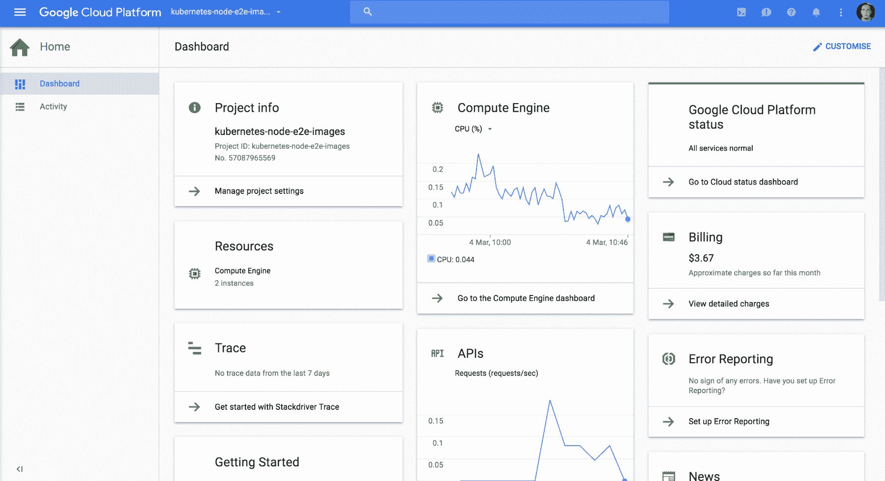
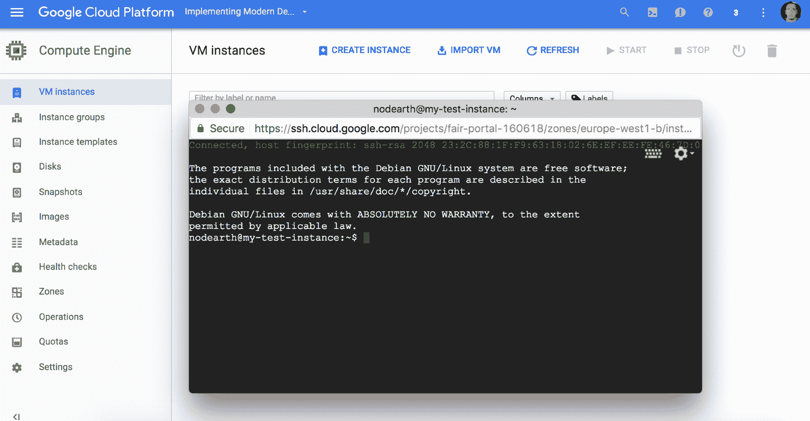

# 第二章：云数据中心——新现实

在过去几年，云系统逐渐成为主流，它们使得企业能够根据需求以一种简便且低成本的方式扩展。它们还使公司能够利用一种叫做**基础设施即代码**（**IAC**）的技术，这基本上允许你将之前需要根据需求购买的物理资源（服务器和路由器）视为代码，你可以查看、运行并重新运行这些代码，以使基础设施适应你的需求。

在本章中，我们将介绍主要的云服务提供商，重点分析它们的主要优点和缺点，以便形成清晰的认识，了解它们提供了什么以及我们作为工程师如何利用这些服务。

在市场上的所有提供商中，我们将重点关注这两家：

+   **Amazon Web Services**（**AWS**）

+   Google Cloud Platform

我们还将简要讨论以下内容：

+   Heroku

+   Azure

+   DigitalOcean

我们应该保持开放的心态，因为它们每个都可以提供不同且有价值的功能集，这是不容忽视的。

我们将介绍**Kubernetes**，在我个人看来，它是现代 DevOps 世界中许多问题的答案。

# 亚马逊网络服务

亚马逊无疑是全球最大的在线零售商，几乎在全球都有业务。每个人都听说过亚马逊，以及这种商店为 21 世纪繁忙社会带来的各种可能性：它们提供几乎任何可以在传统商店购买的商品的送货上门服务。

亚马逊由 Jeff Bezos 于 1994 年创立，从那时起，它每年都在持续增长，提供越来越多的产品和服务，但有一天，它们进入了云计算业务。对于像亚马逊这样的大公司来说，拥有大量的处理能力是有意义的，同时它还具有可靠性，并能够迅速适应业务需求。

起初，云服务是为了满足业务的高可用性需求，并且能够以统一的方式扩展。这使得公司在构建一流的**基础设施即服务**（**IaaS**）方面积累了大量经验，最终他们意识到这些技术可以出售给客户。

到了 2006 年，市场上没有任何竞争对手，所以它们处于成功起步的有利位置。

我记得当时我还在大学，EC2 和 EC3 两项服务首次在一个会议上推出。

EC2 让你能够在云上创建虚拟机，提供一个通过命令行接口和 Web 界面进行操作的 API，后者可以作为你资源的监控工具。

S3 是一种关键价值存储（某种意义上），允许你以非常低的价格存储大量数据，并且同样可以通过命令行界面进行操作。

这真的是一次革命。它是一个完全的范式转变：现在你可以根据需要请求更多资源。这就像是一个 API 调用，几分钟内就可以得到三台新机器。下面的截图展示了 AWS 上的服务列表：


2017 年 1 月 AWS 服务目录

在过去几年中，亚马逊频繁地添加服务，直到有时很难跟上这种速度。在本章中，我们将介绍一些主要的服务（或我认为最有用的服务），展示它们的功能和应用领域。

# EC2 - 计算服务

云系统必须为用户提供的第一个元素是计算能力。**EC2**代表**弹性计算云**，它允许你通过几次点击在云端创建机器。

这是 EC2 界面的样子：


EC2 界面

EC2 于 2006 年 8 月 25 日推出（beta 版本），自那时以来已经经历了很多发展。它为用户提供不同大小的机器，并且在全球范围内可用（截至今天，覆盖 11 个不同的区域）。这意味着用户可以在全球不同地区启动机器，以实现高可用性和低延迟，使得你公司工程师能够在不需要跨国协调团队的情况下构建多区域应用。

它们还提供不同类型的实例，针对不同任务进行了优化，使得用户可以根据自己的需求定制基础设施。总共有 24 种不同类型的实例，但它们也按类型进行了分组，我们将在本章后面详细介绍。

让我们看一个如何启动实例的示例。

# 启动实例

首先，你需要进入 AWS EC2 界面。

1.  现在点击启动实例按钮，这将带你进入以下界面：


1.  这是你可以选择运行镜像的地方。如你所见，镜像是将运行在 EC2 实例上的操作系统。在亚马逊的术语中，这个镜像被称为**Amazon Machine Image**（**AMI**），你可以创建自己的镜像并保存以便后续使用，这样可以便捷地发布预先构建的软件。现在，选择 Ubuntu Server 16.04 并点击选择。

1.  下一屏显示的是镜像的大小。AWS 提供了多种大小和类型的镜像。这一参数会显著影响应用程序的性能，包括网络、内存、CPU 性能以及机器的 I/O。

1.  让我们看一下不同类型的实例：

| **类型** | **描述** |
| --- | --- |
| 突发型实例 | T2 是用于突发处理的通用型实例。它们提供了一个 CPU 基线水平，以应对处理能力的高峰，但这些高峰是按累积方式提供的：在空闲时，CPU 会累积积分，这些积分可以在需求高峰期使用，一旦这些积分用尽，性能就会恢复到基线水平。 |
| 通用型 | M3 是一个通用型实例，具有专用资源（没有突发积分）。它在 CPU、内存和网络资源之间提供了良好的平衡，是需要稳定性能的生产应用程序的最小实例。M4 遵循与 M3 相同的理念，但硬件有所更新：**亚马逊弹性块存储**（**Amazon EBS**）优化、更好的 CPU 以及增强的网络系统是该实例类型的亮点。 |
| 计算优化型 | AWS 的计算优化型实例包括 C3 和 C4。与 M 系列实例相同，C4 是 C3 的硬件升级版。这些类型的实例适用于需要强大 CPU 性能的工作，如数据处理和分析或高要求的服务器。C4 还配备了增强型网络系统，这对于高网络流量应用程序非常有帮助。 |
| 内存优化型 | 如你所料，AWS 还提供了内存优化型实例，适用于需要高内存使用的应用程序。基于 Apache Spark（或大数据应用）的应用程序、内存数据库等，最能受益于这类实例。在这种情况下，内存优化型实例被划分为两个子系列：X1：这些是大规模企业级实例。X1 可用于企业生态系统中最苛刻的应用程序，它是内存密集型实例的旗舰，仅用于非常大的应用程序。R3/R4：尽管比 X1 更为简朴，但 R 实例完全能够处理大多数日常内存密集型应用程序。缓存系统、内存数据库等是 X 和 R 实例的最佳应用场景。 |
| 加速计算实例 | 一些应用程序，如**人工智能**（**AI**），具有特定的计算要求，如**图形处理单元**（**GPU**）处理或可重配置硬件。这些实例被分为三种系列：P2：GPU 计算实例。这些实例经过优化，可执行特定的处理任务，如通过暴力破解密码以及机器学习应用（通常依赖 GPU 算力）。G2：图形处理实例。视频渲染、光线追踪或视频流媒体是这些实例的最佳应用场景。 |

1.  如你所见，每种用户需求都有一个相应的实例可用。目前，我们首先选择一个小型实例，因为我们只是测试 AWS，其次是因为 AWS 提供免费套餐，允许你在 1 年内免费使用`t2.micro`实例，具体如以下截图所示：


1.  现在我们有两个选项。点击“审核实例启动”或“配置实例详情”。在本例中，我们将点击“审核实例启动”，但通过点击“配置实例详情”，我们可以配置实例的多个元素，例如网络、存储等。

1.  当你点击“审核实例启动”后，审查页面将出现。点击“启动”，你应该看到类似于下图所示的界面：


1.  只需为密钥对命名并点击“下载密钥对”按钮，这将下载一个`.pem`文件，稍后我们将使用该文件通过`ssh`访问实例。

1.  一旦你指定了密钥对，点击“启动实例”，如前面的截图所示，就是这么简单。经过几次检查后，你的镜像将准备好安装所需软件（这通常需要几分钟）。

这是在 AWS 中创建运行实例所需的最低配置。正如你所看到的，整个过程在屏幕上有非常详细的解释，一般来说，如果你了解 DevOps 的基础（`ssh`、网络配置和设备管理），你在创建实例时不需要太多帮助。

# 关系型数据库服务

在前一部分中，我们展示了可以用来安装所需软件的 EC2 实例。还有一个服务可以让你管理跨区域的高可用数据库（MySQL、PostgreSQL、Maria DB、Aurora，以及 Oracle 和 SQL Server）。这个服务叫做 RDS，代表关系型数据库服务。

关系型数据库的一大难题是高可用性配置：主主配置通常费用较高，小公司往往无法承担。AWS 通过 RDS 提升了标准，提供了可以通过几次点击就能设置的多区域高可用数据库。

# AWS 与 EC2 的网络配置

AWS 提供了细粒度的网络控制。与任何物理数据中心一样，你可以定义自己的网络，但 AWS 有一个更高级的抽象概念：虚拟私有云（VPC）。

亚马逊**虚拟私有云**（Amazon **VPC**）是 AWS 云的一部分，允许您将资源在子网中分组和隔离，以便按照您的需求组织和规划基础设施。它还允许您在 AWS 和物理数据中心之间创建 VPN，从而扩展后者，增加更多来自 AWS 的资源。同时，当您在 EC2 中创建资源时，您可以选择将资源创建在您自定义的子网中。

在了解 VPC 的结构之前，让我们先解释一下 AWS 如何处理资源的地理分布。AWS 为您提供不同地区的数据中心，例如欧洲、亚洲和美国。以欧盟西部（EU West）为例，它有三个不同的可用区：


在 AWS 中，“区域”概念基本上指的是 AWS 数据中心所在的地理区域。了解这些信息使我们能够构建全球规模的应用程序，通过将流量从最近的数据中心提供服务来提高延迟表现。地理分布的另一个重要原因是许多国家的 数据保护法律。通过选择数据存储的位置，我们可以确保遵守这些法律。

在这些地理区域内，我们有时可以找到可用区。一个可用区基本上是一个物理上分离的数据中心，确保系统的高可用性。例如，在其中一个数据中心发生灾难时，我们可以始终依靠其他可用区进行恢复。

让我们来看一下区域和可用区的分布：


现在我们已经理解了 AWS 从地理角度的运作方式，让我们更深入地了解在区域和可用区层面上 VPC 的概念。

VPC 是 AWS 云中逻辑上隔离的部分，对于用户而言是私有的，可以承载资源，并且跨越 AWS 区域的所有可用区。在这个 VPC 内，我们可以定义不同的子网（不同可用区中的公共和私有子网），并指定哪些机器可以从互联网访问：AWS 允许您创建路由表、Internet 网关、NAT 网关以及其他常见的网络资源，使用户能够构建与物理数据中心中相同的基础设施。

要讨论 AWS 中的网络，仅这一部分就足以写一本完整的书。我们将在本书的后续章节深入探讨一些概念，但如果你真的想深入了解 AWS 的网络部分，你可以访问 [`docs.aws.amazon.com/AmazonVPC/latest/UserGuide/VPC_Introduction.html`](http://docs.aws.amazon.com/AmazonVPC/latest/UserGuide/VPC_Introduction.html) 查找更多的数据和示例。

AWS 还提供了一个非常强大的元素：**Elastic Load Balancing **（**ELB**）。ELB 是经典硬件负载均衡器的现代版本。它使我们能够对资源进行健康检查，只将健康的资源加入池中。此外，AWS 提供两种类型的负载均衡器：经典负载均衡器和应用负载均衡器。第一种版本，顾名思义，是应用负载均衡器，它根据健康检查分配流量，并不理解传输的数据，而应用负载均衡器可以根据请求的信息，基于高级策略来路由流量。ELB 还能够处理完整的 HTTPS 流量，这样我们就可以在负载均衡器中进行 SSL 终止操作，并允许我们的应用将加密/解密任务卸载给负载均衡器。

# AWS 和 EC2 中的存储

到目前为止，我们已经展示了如何在 AWS 中创建机器和网络基础设施。在构建应用程序时，一个重要的方面就是数据存储。默认情况下，当我们在 EC2 中启动机器时，根卷中可以关联两种存储类型来运行操作系统：

+   实例存储支持的镜像

+   **Amazon Elastic Block Store **（**Amazon** **EBS**）存储支持的镜像

第一种类型，即实例存储支持的镜像，依赖于与镜像相关联的存储来挂载并运行根卷。这意味着一旦机器终止，存储在镜像中的数据将丢失（这种类型的镜像不支持停止操作，只支持终止操作）。

第二种类型的实例是由 EBS 支持的。Elastic Block Store 是 AWS 提供的存储服务名称。使用 EBS，用户可以根据需要创建和销毁卷（块设备）以及快照：我们可以在进行风险操作之前创建一个正在运行的镜像副本，以便如果发生错误时可以恢复。

存储类型可以根据我们的需求有所不同：你可以从磁性块设备到 SSD 硬盘，也可以使用通用设备来覆盖所有应用中的大多数使用场景。

通常情况下，所有实例都由 EBS 支持，因为存储在逻辑上与计算分离，这使得我们能够进行一些操作，例如调整实例大小（例如，创建更强大的实例），而不会丢失数据。

可以将多个卷挂载到同一个 EC2 实例中，这些卷会像物理设备一样暴露给它，因此如果我们使用的是基于 Linux 的镜像（如 Ubuntu），我们可以使用 mount 命令将设备挂载到文件夹中。

# Amazon S3

亚马逊**简单存储服务**（Amazon **S3**）正如其名，是一种以非常低的成本，在云端存储大量数据的简单方式，并提供了一套不错的功能。与基于预定义大小的设备存储的 EC2 不同，Amazon S3 实际上是一种键值存储，使我们能够通过键来识别数据。与其他键值存储技术不同，S3 准备好存储从小到非常大的对象（最大可达 5 TB），且响应时间极低，且可以在任何地方访问。

与 EC2 一样，Amazon S3 是一个具有区域概念的功能，但 S3 不理解可用区：S3 服务本身能够将对象存储在不同的设备上，因此您不需要担心这一点。数据存储在一种叫做桶（buckets）的抽象结构中，如果我们尝试将 S3 与文件系统进行比较，它就像一个文件夹，但有一个限制：桶的名称必须在 AWS 账户的所有区域中唯一，因此我们不能在两个不同的区域创建一个名为 `Documents` 的桶。

S3 的另一个优势是 AWS 提供了一个 REST API，可以非常简单地访问对象，这使得它成为现代 Web 存储的理想选择。

在我的职业生涯中，我遇到的 S3 的最佳使用案例之一是在金融机构中管理大量文档。通常，当公司涉及到资金时，他们必须将客户纳入一个叫做 **客户尽职调查**（**CDD**）的过程。这个过程确保客户确实是他们声称的人，且资金来源是合法的。根据金融规定，公司还需要保存这些文件至少 6 年。

为了进行这项调查，用户需要将文件发送给公司，而 Amazon S3 正好适合这个需求：客户将文件上传到公司的官网，实际上是将文件推送到 S3 桶（每个客户一个桶），并通过 Amazon S3 的复制功能将文件跨区域复制。此外，S3 为这一模式提供了另一个有趣的功能：有效期内的对象链接。基本上，这使得您可以创建一个仅在特定时间内有效的链接，因此，如果审查文档的人将链接暴露给第三方，S3 会返回错误，确保文件不容易被意外泄露（用户仍然可以下载它）。

S3 另一个有趣的特点是可以与 Amazon **密钥管理系统**（Amazon **KMS**）集成（KMS 是 AWS 提供的另一项功能），因此我们在 S3 中的所有对象都会由保存在 KMS 中的密钥加密，并且该密钥可以定期透明地轮换。

# 亚马逊 ECR 和 ECS

容器已成为新常态。在过去几年中，我遇到的每个公司都在使用或考虑使用容器来构建软件。这使我们能够在构建软件时考虑微服务的原则（小型独立运行的单个软件组件），因为它提供了从不同应用程序的配置和部署中抽象出一个合理的层次：基本上，所有配置都存储在容器中，我们只需要关心如何运行它。

作为微服务架构的先驱之一，Amazon 创建了自己的镜像注册表和集群（服务）。

正如我们在第三章中将深入讨论的那样，*Docker* 是围绕两个概念构建的：镜像和容器。镜像是应用程序的定义（配置 *+* 软件），而容器是运行镜像的实例。镜像通过 Dockerfile（一个带有非常基础脚本语言的镜像描述）构建并存储在注册表中，在这种情况下是 Amazon **EC2 容器注册表**（**ECR**），我们在 AWS 基础设施中的私有注册表。我们不需要担心可用性或管理资源；我们只需选择容器运行的区域，并将镜像推送到该存储库。

然后，从我们运行 Docker 的主机中，拉取镜像并实例化容器。这既简单又有效，但有一些需要考虑的因素：

+   当我们的主机没有足够的资源来运行我们想要的容器数量时，会发生什么情况？

+   如果我们想确保容器的高可用性会发生什么情况？

+   我们如何确保容器在故障（出于某种原因）时重新启动？

+   我们如何在不中断服务的情况下为系统添加更多的硬件资源？

这些问题在几年前更加棘手，但现在变得简单了：Amazon **EC2 容器服务**（Amazon **ECS**）会为我们处理这些问题。ECS 基本上是一个由资源（EC2 机器）组成的集群，这些资源协同工作，为我们的容器提供运行环境。

在 ECS 中，当创建一个新服务时，我们会指定一些参数，比如应该同时运行多少个容器副本，以及容器应使用什么配置（镜像）。让我们看看它是如何工作的。

# 创建集群

首先，我们将在 AWS 控制台中创建一个集群，并查看它是如何工作的。

1.  转到 Amazon ECS 页面并点击“开始使用”按钮（屏幕上唯一的按钮，因为你还没有创建任何资源）：


1.  在继续之前，确保两个复选框都已勾选。我们想将一个示例应用部署到 ECS，并且还希望将镜像存储在 ECR 中。

1.  下一屏幕至关重要：这里是我们定义镜像存储库的地方，它将决定用于从本地机器通过 Docker 推送镜像的存储库 URI。


1.  只需使用 `devops-test` 作为仓库名称，我们的仓库 URI 看起来将与前面截图中的非常相似。

1.  步骤 2（共 6 步）是 AWS 提供的一系列命令，用于登录 ECR 并推送我们项目的镜像。在本例中，我们将使用一个非常简单的 `Node.js` 应用：

```
       var express = require('express');
       var app = express();

       app.get('/', function (req, res) {
        res.send('Hello World!');
      });

        app.listen(3000, function () {
          console.log('Example app listening on port 3000!');
        });
```

1.  将之前的代码保存在名为 `index.js` 的文件中，放在本地机器上名为 `devops-test` 的文件夹内。由于我们正在使用 express，所以我们需要安装所需的依赖项。只需执行以下命令：

```
 npm init
```

1.  经过几个问题（只需按几次 Enter 就可以了），应该会创建一个名为 `package.json` 的文件。现在我们需要为程序安装 express：

```
 npm install --save express
```

1.  就这样！我们的 `package.json` 文件应该包含一行描述所需依赖项的内容：

```
       {
            "name": "code",
            "version": "1.0.0",
            "description": "",
            "main": "index.js",
        "scripts": {
        "test": "echo "Error: no test specified" 
       && exit 1",
        "start": "node index.js"
       },
       "author": "",
       "license": "ISC",
       "dependencies": {
       "express": "⁴.14.1"
       }
     }
```

1.  这个文件允许我们在需要时重新安装依赖项，而无需手动操作；它还允许我们指定一个命令，当我们执行 `npm start` 时会运行该命令（这是一种使用 npm 运行 Node 应用的标准方式）。按前面的代码中所示添加并突出显示该行，因为我们稍后会需要它（不要忘记上一行的分号）。

1.  现在我们需要编写我们的 Dockerfile。正如我们将在第三章中看到的，*Docker*是一个描述我们的 Docker 镜像外观的文件。在这个案例中，我们将重建在 Docker 容器中运行节点应用程序所需的步骤：

```
    FROM node:latest

    RUN mkdir -p /usr/src/app
    WORKDIR /usr/src/app

    COPY package.json /usr/src/app/
    RUN npm install

    COPY . /usr/src/app

    EXPOSE 3000
    CMD [ "npm", "start" ]
```

1.  不要试图理解这个文件；我们将在本书后面深入讲解。只需将其保存为 `Dockerfile`，并放在之前提到的文件夹 `devops-test` 中。到目前为止，你的 `devops-test` 文件夹应该如下所示：


1.  现在我们准备好按照 ECS 设置中的步骤 2 进行操作。请注意，以下图像与我在 AWS 中的用户相关；你的用户将有不同的参数，因此请使用你自己的参数，而不是复制前面截图中的内容：


完成后，包含你应用程序镜像的新版本应该会安装在你的私有 ECR 中。

1.  下一步（步骤 3）是创建 AWS 所谓的任务定义，它基本上是我们的容器实例的配置：我们将使用多少内存、运行哪个镜像以及在容器中暴露哪些端口。只需保留默认内存，但将端口更改为 `3000`，因为这是我们在前面的示例中使用的端口（节点应用程序）。这是典型的 Docker 参数，我们将在下一章中详细了解 Docker。

1.  一旦准备好，点击下一步，我们将进入第 4 步。此步骤是我们将配置服务的地方。这里的服务指的是我们要保持活跃的容器实例数量，以及如何暴露它们：通过负载均衡器，还是仅通过集群中的 EC2 实例。我们还可以指定用于注册和注销正在运行实例的 IAM（AWS 凭证系统）：


1.  我们只需要保留默认设置，除了两个参数：

    +   所需任务数量：设置为`2`

    +   在 ELB 部分，我们只需选择 sample-app: `80`（或选择不是“No ELB”的选项，这样 AWS 会为我们提供一个 ELB）

1.  点击下一步，在这里我们将定义我们的集群将如何配置：

    +   节点的数量

    +   节点的大小

1.  一旦准备好，只需检查并启动实例。几分钟后，我们的集群应该启动并运行，准备好与我们部署的任务一起工作。

你可以通过集群本身提供的负载均衡器，在端口`3000`上访问我们创建的任务实例。如你所见，ECS 简化了设置容器集群的任务。

在本书中，我们将特别关注 Kubernetes 和 Docker Swarm，主要是因为它们是平台无关的技术，但我相信 Amazon ECS 是构建新容器化系统时值得考虑的一个非常有效的技术。

# 其他服务

如你所见，AWS 中的服务列表几乎是无止境的。我们已经访问了我认为最重要的服务，接下来的章节中，我们将探讨一些其他也很有趣的服务，但遗憾的是，我们无法深入探讨所有服务。然而，AWS 的文档相当完善，每项服务总是附带了详细的使用说明。

在本节中，我们将简要介绍一些服务，尽管它们非常重要，但并不是本书开发的核心内容。

# Route 53

Route 53 是 AWS 中的 DNS 服务。它是一个全球性的可扩展 DNS 服务，允许你执行一些高级操作：

+   注册域名

+   从其他注册商转移域名

+   创建流量路由策略（例如跨区域的故障转移）

+   监控你应用程序的可用性（并将流量重定向到健康的实例）。

使用 Route 53，我们可以将域名链接到 AWS 资源，如负载均衡器、S3 存储桶和其他资源，使我们能够为在 AWS 实例中创建的资源（主要是虚拟机）公开一个人类可读的名称。

# CloudFront

CloudFront 解决了低流量网站在访问量激增时面临的最大问题之一：它提供了缓存，使我们不禁想是否是 AWS 在提供数据，而不是我们的服务器。基本上，CloudFront 拦截对我们主机的请求，渲染页面，并将其缓存长达 24 小时，这样我们的网站就可以将流量卸载到 AWS。它是为提供静态内容而设计的，因为当用户第二次访问相同的 URL 时，将会提供缓存版本，而不是再次访问您的服务器。

强烈建议您使用 CloudFront 为公司的网站提供服务，这样您就可以使用一台非常小的机器处理所有流量，既节省了资源，也能在流量激增时提高站点的正常运行时间。

# Amazon ElasticCache

Amazon ElasticCache，顾名思义，是一个分布式和可扩展的内存缓存系统，可以用于在应用程序中存储缓存数据。

它解决了我们在构建依赖缓存存储和检索数据的应用程序时可能面临的最大问题之一：高可用性和一致的临时数据存储。

# Amazon RDS

**RDS** 代表 **关系型数据库服务**。通过 RDS，您可以通过几次点击配置 DB 实例，用于存储数据：Oracle、MySQL 和 MariaDB 是我们在 RDS 中的几个选择。它利用底层数据库系统的高可用性，这可能是我们依赖 AWS 时面临的一个问题，但通常是可以接受的，因为 SQL 数据库中的高可用性是一个复杂的课题。

# DynamoDB

DynamoDB 是一款出色的工程产品。它是一个 NoSQL 数据库，在任何规模下都能将延迟微调到毫秒级。它存储对象而不是行（无法使用 SQL），是存储大量数据的无模式方式的良好选择。从本质上讲，DynamoDB 非常类似于 MongoDB，但有一个基本区别：DynamoDB 是 AWS 提供的服务，只能在 AWS 内运行，而 MongoDB 是一款可以安装在任何地方的软件，包括 AWS。从功能角度来看，MongoDB 的大部分用例同样适用于建模 DynamoDB 数据库。

# Google Cloud Platform

Google 一直在技术领域处于领先地位。令人惊讶的是，Google 过去没有提供一个联合的服务层；相反，它提供了各个服务，这在为开发人员提供一个稳固的平台构建应用程序时远非理想。为了解决这个问题，它推出了 Google Cloud Platform，这是一个服务集合（基础设施即服务、平台即服务、容器和大数据，以及许多其他功能），使开发人员和公司能够构建具有高度可靠性和可扩展性的系统，提供一些最先进的功能，如 Kubernetes 和一套独特的机器学习 API。

界面也是 Google Cloud 的主要亮点之一：它为你提供了一个 web 控制台，基本上你可以在这里使用一个与所有服务连接的 `ssh` 终端，直接操作，而无需在本地机器上做任何配置。界面中的另一个优点是它使用了传统系统管理员领域的术语，使得大多数服务的学习曲线变得容易。



与 AWS 类似，Google Cloud Platform 允许工程师在全球各地的区域和可用区创建资源，以确保我们系统的高可用性，并遵守当地的法律法规。

但真正的皇冠上的明珠是他们的容器引擎。我是容器编排的忠实粉丝。如今，每个人都在朝着基于微服务的系统发展，看到公司遇到微服务系统操作现实的瓶颈并不奇怪：没有编排工具，这几乎是无法管理的。在市场上所有潜在的选择中（Amazon ECS、Docker Swarm 和 DCOS），有一个特别的工具改变了我的生活：Kubernetes。

Kubernetes 是我在撰写第一本书（*使用 Node.js 开发微服务*）时提出的一个问题的答案：如何通过为开发和运维提供一个共同的基础，有效地自动化微服务环境中的操作？Kubernetes 融合了 Google 多年来在使用容器方面积累的所有专业经验，创造了一个产品，提供了有效管理部署管道所需的所有组件。

在本书中，我们将特别强调 Kubernetes，因为在我看来，它是今天许多团队在成员和资源扩展过程中遇到问题的解决方案。

为了开始使用 GCP，Google 提供了 300 美元的试用信用或 60 天的免费试用，这足以让你了解大部分服务，当然，也足够跟随本书中的示例，玩转我们将要介绍的大多数概念。我建议你激活试用期并开始尝试：一旦信用用完或 60 天试用结束，Google 会要求明确确认启动计费，因此你的账户不会产生额外费用（在撰写本书时是这样的情况）。

# Google 计算引擎

Google Compute Engine 相当于 Amazon Web Services 中的 EC2。它允许您以一种我前所未见的简便方式管理机器实例、网络和存储。在与 AWS 上手时，我发现的一个缺点是，他们创建了一些命名抽象，名称并不直观：虚拟私有云、弹性块存储等。虽然这并不是什么大问题，因为 AWS 在市场中非常知名，但 Google 领会了这一点，并且以非常直观的方式命名其资源，使得新用户几乎无需任何努力即可快速上手该平台。

关于机器类型，与 AWS 相比，Google Cloud Platform 提供了一组简化且有限的机器类型，但足够多样化以满足我们的需求。需要注意的 Google Cloud Platform 特性之一是，硬件随着实例大小的增加而提升，这意味着 64 核心的机器比 2 核心的机器拥有更强的 CPU。

Google Cloud Platform 还提供了一个 CLI 工具，可以通过终端与 GCP 资源进行交互。要安装它，只需访问此网址：[`cloud.google.com/sdk/`](https://cloud.google.com/sdk/)。

然后，根据您的操作系统，按照说明进行操作。

# 标准机器类型

标准机器是任何应用程序中最常用的类型。它们在 CPU 和内存之间提供平衡，适合所有项目中的大多数任务。这些类型的机器为每个虚拟 CPU 提供 3.75 GB 的内存。让我们看几个示例：

| 名称 | CPU | 内存 |
| --- | --- | --- |
| `n1-standard-1` | 1 | 3.75 GB |
| `n1-standard-2` | 2 | 7.50 GB |
| `n1-standard-64` | 64 | 240 GB |

如您所见，命名约定非常简单，容易根据规范名称推测机器的内存和 CPU 数量。

# 高内存机器类型

这些机器经过优化，适用于内存密集型应用程序。每个虚拟 CPU 配备了额外的内存，使您可以在内存方面做到更加出色。

每台高内存类型的机器都配备每个虚拟 CPU 6.5 GB 的内存，以下是一些示例：

| 名称 | CPU | 内存 |
| --- | --- | --- |
| `n1-highmem-2` | 2 | 13 |
| `n1-highmem-8` | 8 | 52 |
| `n1-highmem-64` | 64 | 416 |

这些机器配备大量内存，非常适合分布式缓存、数据库以及许多其他需要相对较高内存消耗的应用程序。

# 高 CPU 机器类型

如其名称所示，高 CPU 型机器是具有高 CPU/内存比率的实例，每个虚拟 CPU 配备 0.9 GB 的内存，这意味着它们非常适合在高强度 CPU 任务中节省一些开销（因为我们减少了大量内存）。以下是这些机器的一些示例：

| 名称 | CPU | 内存 |
| --- | --- | --- |
| `n1-highcpu-2` | 2 | 1.8 GB |
| `n1-highcpu-8` | 8 | 7.2 GB |
| `n1-highcpu-64` | 64 | 57.6 GB |

正如你所看到的，标准机器和高内存机器之间的唯一区别在于，这些机器配置了较少的 RAM，这使得我们在一些应用中可以节省不需要的资源，尤其是当这些应用能够在相同价格下创建更多 CPU 的机器时。高 CPU 机器非常适合需要高 CPU 和低内存消耗的应用，比如数学处理或其他类型的计算。

# 共享核心机器类型

有时，我们真的不需要为我们的流程提供专用的机器，因此 Google Cloud 提供了可以用作共享机器的选项。在我看来，分享核心的机器不适合生产使用，但它们非常适合用作原型或实验不同资源。以下是两种类型的机器：

| 名称 | CPU | 内存 |
| --- | --- | --- |
| `f1-micro` | 0.2 | 0.6 |
| `g1-small` | 0.5 | 1.7 |

正如你所看到的，这里只有两种选项，它们在 RAM 和 CPU 功率上有所不同。我个人在想要尝试新的软件或 Google Cloud Platform 的新产品时，通常会使用这些机器。

别忘了，这些是突发型机器，只适合短时间内的高强度处理，不适合持续消耗资源，因为 CPU 是在不同应用之间共享的。

# 自定义机器和 GPU 处理

有时，我们的机器需要额外的资源，这些资源通常不在其他提供商预定义的机器实例中，但在这种情况下，Google Cloud Platform 通过一个令人惊叹的功能来解救我们：自定义机器类型。

在 Google Cloud Platform 上，使用自定义机器类型，我们可以在资源较少的机器上获得大型机器的硬件升级优势，或者创建适合我们需求的特定配置。

我们可以找到自定义机器的一个最佳例子是，当我们希望在我们的配置中加入 GPU 处理时。在 Google Cloud 中，GPU 可以按需附加到任何非共享（`f1` 或 `g1`）的机器上。借助创建自定义机器类型的能力，我们可以定义希望在其中提升处理能力的 GPU 数量。

总的来说，当我设计系统时，我尽量坚持使用标准类型，以简化我的设置，但创建自定义机器类型并没有错，唯一的问题是，我们可能会轻易陷入过早优化系统的问题，这也是 IT 工作中最常见的难题之一。

# 启动实例

在 Google Cloud Platform 中，一切都被组织在项目中。为了创建资源，你需要将它们与项目关联，因此启动实例的第一步是创建一个项目。为此，只需在第一次进入 Google Cloud Platform 界面时选择“新建项目”按钮，或者在已经创建了一个项目后，点击顶部栏的下拉菜单：

1.  对于本书的示例，我将创建一个名为`Implementing Modern DevOps`的项目，并用它来运行所有示例：


1.  一旦我们创建了项目，就可以继续创建新的虚拟机实例。虽然可以创建超过 64 个核心的实例（通过自定义机器类型），但为了节省成本，我们将使用标准机器类型。继续使用默认值创建实例（只需更改名称）：


1.  我非常喜欢 Google Cloud Platform 的两个特点：

    +   他们如何轻松地命名资源，并使一切都变得清晰易懂

    +   他们在定价方面的透明度

1.  在 Google Cloud Platform 上创建虚拟机时，存在这两个特点：创建机器的表单只有少数几个字段，并且会显示机器每月的费用（所以不会有意外费用）。

1.  和 AWS 一样，Google Cloud Platform 允许你选择实例将要部署的区域和可用区（记住，这是一个物理隔离的数据中心），以确保系统的高可用性。

1.  此外（不在前面的图中），它允许你通过勾选两个复选框，只需几个点击即可允许`http`和`https`流量进入实例。这既简单又有效。

1.  你还可以配置其他内容，如网络、SSH 密钥以及其他我们暂时跳过的参数。只需点击创建按钮（表单底部），然后等待机器完全配置（可能需要几分钟），你应该会看到类似于以下截图的内容：


1.  Google Cloud Platform 最吸引人的特点之一是其用户界面的精心设计。在这种情况下，你可以看到机器描述中有一个名为“连接”的列，允许你通过几种不同的方式连接到机器：

    +   SSH

    +   `gcloud`命令（GCP 的命令行工具）

    +   使用另一个 SSH 客户端

1.  我们将选择 SSH（默认选项），并点击 SSH 按钮。屏幕上应该会弹出一个窗口，几秒钟后，我们应该能看到类似于`ssh`终端的界面，它是我们机器上的终端：



这是一个非常简洁且实用的功能，它基本上使工程师避免携带一组加密密钥，因为加密密钥总是存在泄露的风险，一旦泄露，你的机器就会暴露。

# 网络设置

我不能强调 Google Cloud Platform 如何简化概念并使其看起来类似于现实世界的物理数据中心概念这一点。这在网络设置中同样适用：所有的概念和名称都可以一一映射到现实世界的物理网络概念上。

在 Google Cloud 中，我们可以通过几次点击实现任何符合 IP 网络设计原则的需求（与 AWS 相同）。Google Cloud 还提供了一个有趣的功能（与 AWS 等其他提供商一样），即可以通过 VPN 网络将数据中心扩展到云中，既能享受云产品的好处，又能达到最敏感数据所需的安全性。

# Google 容器引擎

**Google 容器引擎** (**GKE**) 是 Google 提出的一个容器编排方案，利用市场上最强大的容器集群之一：Kubernetes。

如我们在第七章中将进一步讨论的那样，*Docker Swarm 和 Kubernetes——集群基础设施*，Kubernetes 是一个功能丰富的集群，专门用于以受控方式部署和扩展基于容器的应用程序，特别强调定义开发和运维之间的共同语言：一个将开发和运维概念融合为共同基础的框架：资源的 YAML（或 JSON）描述。

Kubernetes 的一个大问题是确保高可用性。当你在本地或云提供商上部署集群时，利用计算资源（AWS 中的 EC2 或 GCP 中的 Compute Engine），你需要负责升级集群版本，并随着 Kubernetes 的新版本发布而不断演进。在这种情况下，Google Cloud Platform 通过容器引擎解决了操作问题：GCP 负责保持主节点的更新，而用户在 Kubernetes 发布新版本时升级节点，这使得我们能够制定不同的集群升级程序。

# 设置集群

在第七章中，*Docker Swarm 和 Kubernetes——集群基础设施*，你将学习如何操作 Kubernetes，但值得在本章中教你如何在 GKE 中设置集群，以便在深入了解 Kubernetes 的核心概念之前，先展示设置集群的简便性：

1.  首先，进入 Google Cloud Platform 中的容器引擎：


1.  如你所见，目前没有设置任何集群，所以我们有两个选择：

    +   创建一个新的容器集群

    +   快速开始

1.  我们只需点击“创建一个容器集群”，然后按照屏幕上的指示（表单）设置我们的集群：


1.  确保区域（Zone）靠近你的地理位置（尽管现在这并不重要），并且大小设置为 `3`。这个参数——大小——将要求 GCP 在计算引擎中创建 `3` 个实例来设置集群，并由 GCP 自行管理一个主节点。关于镜像，我们在这里有两个选项，`gci` 或 `container-vm`。在这种情况下，实际上并不重要，因为这是一个测试集群，但请注意，如果你想使用 NFS 或其他高级文件系统，你将需要使用 `container-vm`。

1.  点击创建，几分钟后，你应该会看到两样东西：

    +   集群是在 Google 容器引擎部分创建的

    +   三个新的虚拟机在计算引擎部分配置

1.  这是一个非常智能的设置，因为通过一些使用 Google Cloud Platform 命令工具（`gcloud`）的命令，我们可以对集群进行扩展或缩减，还可以调整实例的大小以满足我们的需求。如果你探索集群（点击它的名称），你会发现一个“连接到集群”的链接，它会引导你到一个包含连接 Kubernetes 仪表板的说明的页面。


1.  有时，这些指令会失败，因为 `gcloud` 配置不当。如果你在配置集群访问时遇到错误，运行以下命令：

```
 gcloud auth login <your email>
```

1.  然后，按照说明操作。假设你已经配置好了 Google Cloud SDK，一切应该正常工作，运行 `kubectl proxy` 命令后，你应该能够通过 `http://localhost:8001/ui` 访问 Kubernetes 仪表板。

1.  为了测试是否一切按预期工作，只需在 Kubernetes 中运行一个简单的镜像（在此案例中是 `busybox` 镜像）：

```
 kubectl run -i busybox --image=busybox
```

1.  如果我们在运行 Kubernetes 代理时（如前所述）刷新仪表板 (`http://localhost:8001/ui`)，我们应该看到与以下图像相似的内容，位于“部署”部分：


这表明部署（一个 Kubernetes 概念，我们将在第七章，*Docker Swarm 和 Kubernetes - 集群基础设施*中探讨）成功。

# 其他 Google Cloud Platform 产品

Google Cloud 平台不仅有计算引擎和容器引擎，它还是一系列非常有趣的服务集合，适用于不同的用途。由于涉及的范围有限，我们不会看到大多数服务，只会集中于与 DevOps 相关的服务。

# Google App Engine

直到现在，我们一直在使用 DevOps 领域的一个方面，即**IaaS**。Google Cloud 平台还提供了一种名为**平台即服务**（**PaaS**）的服务。在 IaaS 模型中，我们不需要担心底层基础设施：配置机器、安装软件、修补软件。使用**Google App Engine**（或任何其他主要的 PaaS），我们可以忘记基础设施的操作，专注于应用程序的开发，将底层基础设施交给 Google 处理。我们不需要启动机器并安装 Java 来运行基于 Spring Boot 的应用程序，而是只需指定我们希望运行一个 Java 应用程序，GCP 会处理其他一切。

这款产品——Google App Engine，满足了大多数小型到中型项目的需求，但在本书中，我们将重点讨论维护 IaaS 所涉及的 DevOps。

Google App Engine 还为我们提供了诸如用户管理等功能，这是所有应用程序中经常遇到的问题。

# 机器学习 API

Google 一直以其在技术产品上的创新而闻名。它改变了人们使用电子邮件的方式（通过 Gmail），也改变了人们使用手机的方式（通过 Android）。

关于**机器学习**，它们也通过一套创新的 API 震撼了世界，用户可以使用这些 API 来处理图像（使用视觉 API）、翻译文档（使用翻译 API），并通过自然语言 API 分析大量文本数据。

我看到的一个关于视觉 API 的最惊人的用法是，一家公司需要为其客户做一定程度的照片 ID 验证。问题是，很多人上传无效图像（随机图像，甚至是部分面部被遮挡或类似的图像），于是我们使用了视觉 API 来识别那些包含面部且没有胡须、帽子或任何配饰（除了眼镜）的图像。

结果是，做身份验证的人只专注于有效的图像，而不必在继续验证之前对其进行有效或无效的分类。

# 大数据

大数据现在是一个重要的领域。每个人都在努力利用大数据探索新商业领域，或在传统业务中释放其潜力。

Google Cloud Platform 提供了一套大数据 API，使用户能够处理几乎任何大数据任务。通过像 BigQuery 这样的工具，数据分析师可以在几秒钟内对 TB 级别的信息进行查询，而无需设置大规模的基础设施。

一般来说，来自 Google 的大数据 API 被称为 DevOps 世界中的“无操作工具”（no-ops tools）：它们不需要用户进行维护，因为这些工具已经被集成到 Google 中。这意味着，如果一个大查询需要大量的处理能力，Google 会负责透明地将这些计算能力提供给用户。

# 其他云服务提供商

不幸的是，我们在一本书中能讲解的概念有限，因此这次我们将重点介绍 AWS 和 GCP，因为它们是市场上功能最全的云服务提供商。

我总是尝试以开放的心态看待技术，以下是我认为你应该了解的三个云服务提供商：

+   DigitalOcean

+   Heroku

+   Azure

他们提供的服务非常丰富，且都紧跟 DevOps 和安全的新趋势。

# Heroku

Heroku 的核心理念就是这句话：构建应用，而非基础设施。这是一个非常有力的信息。基本上，Heroku 全力推动**PaaS**（平台即服务）概念，让你避免维护底层基础设施：只需指定你想要运行的内容（例如，一个 Node.js 应用程序）以及规模。

通过这一强大的理念，Heroku 让你轻松地通过几个点击部署应用程序实例、数据库或通信总线（例如 Kafka），而无需像使用 DevOps 工具（如 Ansible、Chef 或类似工具）那样进行繁琐的配置。

Heroku 是初创公司首选的云服务提供商之一，因为相比使用 AWS 或 Google Cloud Platform，你可以节省大量时间，因为你只需专注于应用程序，而非基础设施。

# DigitalOcean

DigitalOcean 是一个即使不如 AWS 或 GCP 知名，但为中小型组织提供了一个非常有趣的替代方案的云服务提供商。他们开发了一个非常强大的概念：droplet。

基本上，droplet 是一个可以运行你的软件并通过某些配置连接到不同网络（私有或公共）的组件。

为了创建一个 droplet，我们只需要定义几个内容：

+   镜像（操作系统或一键镜像）

+   尺寸

+   区域

一旦你选择了配置，droplet 便开始运行。这非常简单有效，这也是公司通常所追求的。

# Azure

Azure 是微软推出的云系统平台，也是过去几年增长最快的云服务提供商之一。正如预期的那样，Azure 是运行基于 Windows 的应用程序的**特别优秀**平台，但这并不意味着我们可以忽视它运行 Linux 应用程序的能力。

他们的产品目录和 AWS 或 Google Cloud Platform 一样全面，完全没有理由不选择 Azure 作为你的系统云服务提供商。

Azure 也是市场上最年轻的云服务提供商之一（自 2013 年广泛推出），因此它有一个优势，就是能够解决其他提供商所面临的问题。

# 摘要

到目前为止，我们展示了 AWS 和 GCP 的特点，并介绍了一些在构建系统时非常有趣的其他提供商。市场上有众多竞争者的一个优点是，每个提供商都有自己的强项，我们可以通过使用 VPN 将它们组合起来，在不同的提供商之间创建一个庞大且扩展的虚拟数据中心。

在本书的其余部分，我们将特别关注 AWS 和 GCP，因为它们对于一本 DevOps 书籍来说具有最有趣的特点（当然不能忽视其他云服务提供商，但请记住，篇幅有限）。

我们还将特别关注容器集群，例如 Kubernetes 或 Docker Swarm，因为它们无疑是未来的趋势。
