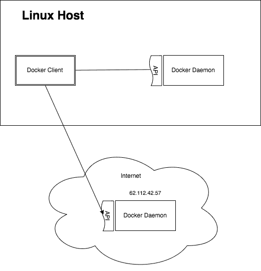
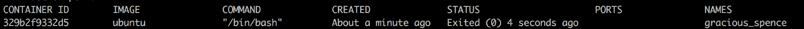
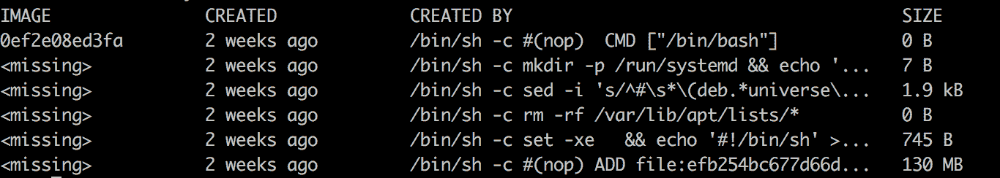
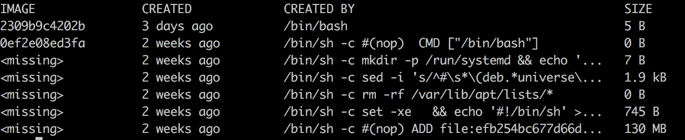
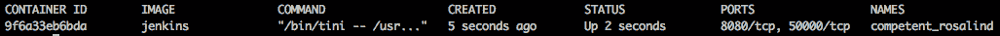
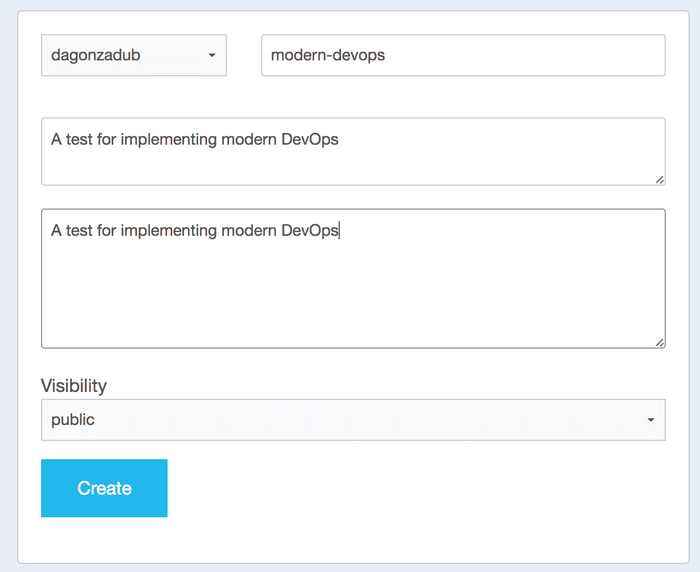
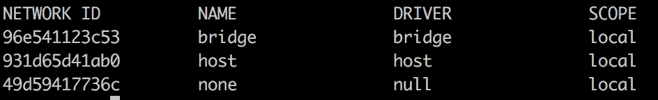

# 第三章：Docker

多年来，开发和运维之间的接触点一直是将新版本应用程序部署到生产环境时的一个问题源。不同的编程语言生成不同类型的制品（Java 的 war 或 JAR，Node.js 的源代码），这导致了在推出新版本时程序的异构性。

这种异构性导致了定制化的版本发布解决方案，这些解决方案往往像是巫术，带有奇怪的习惯，例如凌晨 4 点发布以避免系统中断，或创建容易出错的 bash 脚本，这些脚本比软件本身更难维护。问题除了复杂性外，还在于新员工需要适应你的系统，这总是引入我们大多数时候未意识到的风险，直到某些事情出错。

**Docker** 来拯救我们。有了 Docker，我们可以生成一个可部署的制品，这不仅仅是你构建的软件，还有它的运行时。如果你要部署一个 Java 应用程序，通过 Docker，你将打包应用程序和将要运行你的应用程序的 Java 版本。

听起来像是一个梦想：一个受控环境，从开发到 QA，再到生产（有时会在预生产环境进行检查）作为一个制品被推广，这个过程是可重复的，唯一在不同环境间变化的是配置，通常是通过环境变量注入的。这不是梦想；这是 2017 年的现实，在本章中，我们将快速学习如何在 Docker 中运行容器并构建镜像，速度快得如同光速。

在本章中，我们将覆盖以下主题：

+   Docker 架构

+   Docker 客户端

+   构建`docker images`

+   Docker 注册中心

+   卷（Volumes）

+   Docker 网络

+   Docker Compose

我们还将介绍`docker-compose`，这是一个用于组合多个容器的工具，这样我们就可以在开发机器上组成我们的系统，模拟生产配置，或者至少接近组件间的连接，但在此之前，我们还将深入探讨 Docker 网络：我们如何选择最合适的网络来支持我们的系统，以及 Docker 提供的不同网络之间的主要区别是什么？

Docker 的另一个有趣特点是镜像的构建方式：基本上，我们选择一个基础镜像（我们将了解如何构建一个），然后通过一组精简的命令，我们可以构建一个 Docker 文件，这基本上是一个脚本，用于指导 Docker 根据我们需要的配置来构建我们的镜像。

# Docker 架构

我学习的一种偏好方式是通过实验。为了说明 Docker 架构，我们将展示一个示例，但首先，我们需要安装 Docker 本身。在这个案例中，我正在使用 Mac，但在[`docs.docker.com/engine/installation/`](https://docs.docker.com/engine/installation/)上，你可以找到适合你需求的发行版，并且有一套非常清晰的安装说明（通常是需要安装的包）。

安装 Docker 后，运行以下命令：

```
docker run hello-world
```

一旦完成，输出应该和以下内容非常相似：

```
Unable to find image 'hello-world:latest' locally
latest: Pulling from library/hello-world
78445dd45222: Pull complete
Digest: sha256:c5515758d4c5e1e838e9cd307f6c6a0d620b5e07e6f927b07d05f6d12a1ac8d7
Status: Downloaded newer image for hello-world:latest
Hello from Docker!
```

这条消息显示你的安装似乎工作正常。

为了生成这条消息，Docker 执行了以下步骤：

1.  Docker 客户端联系了 Docker 守护进程。

1.  Docker 守护进程从 Docker Hub 拉取了 `hello-world` 镜像。

1.  Docker 守护进程从该镜像创建了一个新容器，运行生成当前输出的可执行文件。

1.  Docker 守护进程将输出流传输到 Docker 客户端，然后客户端将其发送到你的终端。

如果你想尝试更具挑战性的操作，可以运行一个 Ubuntu 容器，命令如下：

```
$ docker run -it ubuntu bash
```

使用免费的 Docker ID，在[`cloud.docker.com/`](https://cloud.docker.com/)上分享镜像，自动化工作流，等等。

获取更多示例和想法，访问：[`docs.docker.com/engine/userguide/`](https://docs.docker.com/engine/userguide/)。

如你所见，`hello-world` 镜像向你展示了运行前面命令时发生的情况。

这里引入了一些新概念：

+   **Docker Hub**：这是一个中央仓库，既有公共也有私有部分，用户可以将本地构建的镜像推送到这里。Docker 镜像库用于在不同的部署阶段（甚至在不同系统之间）传输镜像。

+   **层**：Docker 镜像由层组成。层基本上是有序的文件系统差异。Docker 镜像是这些层的堆叠，最终形成镜像。当你更改一个已有镜像中的文件时，会创建一个新层，但镜像的其余层会被复用，因此我们可以节省大量（相信我，真的是很多）空间。

+   **Docker 守护进程**：Docker 遵循客户端-服务器架构。在这种情况下，Docker 守护进程是服务器端，可以通过**表现状态转移**（**REST**）API 进行操作。

+   **Docker 客户端**：Docker 客户端是一个**命令行接口**（**CLI**），用于操作 Docker 守护进程。它可以是本地的，也可以是远程的。

最后三个概念是草拟 Docker 架构的关键。请查看以下图示：



客户端/服务器架构在软件中占主导地位。你可能认为这种架构对于像 Docker 这样的系统来说是过度设计，但它实际上为你提供了很多灵活性。例如，在前面的图示中，我们可以看到 Docker CLI（客户端）如何管理本地的 Docker 守护进程实例，同时也能通过设置一个名为 `DOCKER_HOST` 的环境变量与远程守护进程通信，在此案例中，`DOCKER_HOST` 的值为 `62.112.42.57`。

Docker 的一个关键点是它完全利用了 Linux 内核的虚拟化，使得目前无法在 Windows 或 Mac 上运行 Docker（因为它使用了 Linux 内核的能力）。解决方案是创建一个运行 Linux 的虚拟机来运行 Docker 守护进程，CLI 会与虚拟机通信来执行 Docker 命令。

例如，在 Mac 上，Docker 的旧版本使用名为 `Boot2Docker` 的分发版来运行 Docker 守护进程，而 Docker 的新版本则使用名为 **HyperKit** 的轻量级虚拟化解决方案。

Docker for Windows 使用一种与 Mac 上相同的虚拟化技术，因此对于 Mac 所做的所有假设也适用于 Windows。

# Docker 内部结构

到目前为止，我们已经了解了 Docker 在整体架构方面的工作原理，但 Docker 守护进程在操作系统层面上发生了什么呢？

粗略地说，Docker 为你的应用程序提供了一个运行时环境：你可以限制容器使用的核心数量和内存量，但归根结底，运行容器的内核和运行宿主机的内核是一样的。

证明这一点的是 Docker 组织镜像的方式：它计算文件系统的差异，并将其打包成可以重用的层。我们来拉取一个相当大的镜像（不是前面示例中的 hello-world）：

```
docker pull ubuntu
```

这将产生以下输出：

```
Using default tag: latest
latest: Pulling from library/ubuntu
d54efb8db41d: Pull complete
f8b845f45a87: Pull complete
e8db7bf7c39f: Pull complete
9654c40e9079: Pull complete
6d9ef359eaaa: Pull complete
Digest: sha256:dd7808d8792c9841d0b460122f1acf0a2dd1f56404f8d1e56298048885e45535
Status: Downloaded newer image for ubuntu:latest
```

如你所见，Docker 已经拉取了五个层次，这基本上告诉我们 Ubuntu 镜像是通过五个步骤构建的（虽然不完全正确，但这是一个很好的方式）。现在，我们将运行一个 Ubuntu 实例。在 Docker 中，镜像的一个实例就是我们所说的容器，镜像和容器之间的主要区别是顶部的可写层（在 Docker 中，层是以只读模式堆叠起来组成镜像的，就像几个补丁文件中的差异）。让我们来演示一下：

```
docker run -it ubuntu /bin/bash
```

前面的命令在 Ubuntu 镜像的实例中运行 `/bin/bash`。`i` 和 `t` 标志让你像使用虚拟机一样使用容器，分配一个虚拟终端（`t` 标志）并创建交互式会话（`i` 标志）。现在，你可以看到你的提示符已经变成了如下所示：

```
root@329b2f9332d5:/#
```

它不一定完全相同，但应该相似。请注意，你的提示符现在是一个 root 提示符，但不要太兴奋；它仅仅是在容器内。

创建一个文件来更改文件系统：

```
touch test.txt
```

现在可以使用`exit`命令断开与容器的连接。

正如您所看到的，提示符已返回到您的系统提示符，如果您运行`docker ps`，您会看到没有正在运行的容器，但是如果您运行`docker ps -a`（显示所有容器，而不仅仅是正在运行的容器），您应该看到类似以下内容：



这是一个已从镜像创建但不再运行的容器。正如我们之前所说，此容器与镜像之间唯一的区别是顶层可写层。为了证明这一点，我们将从几分钟前运行的容器中创建一个新的镜像：

```
docker commit 329b2f9332d5 my-ubuntu
```

在这种情况下，我正在使用引用`329b`。因为它是前面图片（`docker ps -a`的输出）中显示的，但您需要将哈希更改为您的输出中显示的哈希。公平地说，您不需要全部输入，只需几个字符即可完成任务。如果一切顺利，该命令应输出一个`SHA256`校验和，并将控制权返回给您。现在运行`docker images`（列出 Docker 中的镜像），输出应类似于以下内容：


正如您所看到的，这里有一个名为`my-ubuntu`的新镜像，我们刚刚创建。

现在我们想要检查`ubuntu`镜像和`my-ubuntu`镜像之间的差异。为了做到这一点，我们需要检查每个镜像的层并查看差异。我们要使用的命令是`docker history`，并将镜像名称作为第三个参数。

首先，对于`ubuntu`镜像：



然后对于`my-ubuntu`：镜像（刚从`ubuntu`创建）：



非常有启发性。镜像`my-ubuntu`与`ubuntu`完全相同，只是顶层可写层我们刚刚通过登录到机器并创建文件创建的。这非常聪明，因为尽管这两个镜像都使用大约 130 MB 的空间，但第二个镜像额外使用的空间只是在本例中使用的顶层，仅为 5 字节，导致这两个镜像使用的是 130 MB 和 5 字节的空间。这也产生了我们之前讨论过的副作用：容器与镜像完全相同，只是顶层可写层不同，因此运行容器的实例只使用 5 字节的空间。正如您所看到的，创建 Docker 的工程师考虑到了一切！

Docker 如何将镜像存储在硬盘上的方式是存储驱动程序的责任：Docker 可以使用不同的驱动程序以不同的方式（以及位置，例如 AWS 中的 S3）存储镜像，但是最常见的用例，即默认驱动程序，将镜像存储在硬盘上，并为每个层创建一个文件，文件名为层的校验和。

# Docker 客户端

我们在前一节中已经使用了 Docker 客户端，但我们需要深入了解 Docker CLI 可以提供的选项。我最喜欢的学习方式是通过实验，而我们将在这一节中从上到下建立概念（更多是拆解，而非构建），所以我建议你按顺序完整阅读这一节，不要跳过任何部分，因为后面的示例将会基于前面的内容。

如果你之前稍微了解过 Docker，你会发现这些命令**非常**冗长，并不像你想象的那么直观。最常见的用例是以下组合：

```
docker run -i -t <docker-image>
```

这个命令基本上做了一件简单的事：它以交互模式运行一个容器并分配`伪终端`。这使得我们能够与容器交互并执行命令（并非每个镜像都适用，但对于所有 Linux 发行版的基础镜像来说是成立的）。让我们看看这意味着什么：

```
docker run -i -t ubuntu
```

这应该会返回一个类似于以下的提示：

```
root@248ff3bcedc3:/#
```

刚刚发生了什么？提示符变成了 root，并且主机部分有一个奇怪的数字。我们现在在容器内。基本上，现在我们可以运行将在容器内执行的命令。要退出容器，只需键入`exit`，控制权将返回到主机的终端，容器会继续在后台运行。

大多数时候，前面的命令就能满足我们的需求，但有时我们希望将容器运行在后台：假设你启动了一个 Jenkins 服务器，并且不想让终端一直挂在它上面。为了做到这一点，我们只需要添加`-d`选项（守护进程模式），并去掉`-i`和`-t`选项：

```
docker run -d jenkins
```

一旦镜像被拉取并开始运行，控制权就会返回到你的终端。输出的最后一行应该是类似下面的一串长字符：

```
9f6a33eb6bda4c4e050f3a5dd113b717f07cc97e2fdc5e2c73a2d16613bd540b
```

这是正在运行的容器的哈希值。如果你执行`docker ps`，将会产生类似的输出：



注意，截图中`CONTAINER ID`下的值与前一个命令的哈希值的前几位数字相匹配。

从理论上讲，我们已经运行了一个 Jenkins 实例，如前面的图片所示，它正在监听端口`8080`和端口`50000`。让我们尝试用浏览器访问`http://localhost:8080`。没有反应。基本上，我们的浏览器无法打开该 URL。

这是因为我们没有告诉 Docker 将容器端口绑定到主机机器的本地端口。为了做到这一点，我们需要先停止容器，然后带上一个特殊的参数重新启动它。

现在是时候学习如何停止容器了。我们这里有两个选项：

+   **停止容器**：通过停止选项，我们向容器中的主进程发送`SIGTERM`信号，并等待它完成（有一个宽限期）。然后，我们发送`SIGKILL`信号。

+   **杀死容器**：使用 kill 选项时，我们向容器中的主进程发送 `SIGKILL` 信号，这会强制容器立即退出，而无法保存状态。

在这种情况下，选择哪个并不重要，但请小心。当你在生产环境中运行时，确保在执行此操作前可以安全地停止容器，因为使用停止选项时，我们允许正在运行的软件保存当前的事务并优雅地退出。在这种情况下，我将要杀死容器：

```
docker kill 9f6a
```

Docker 很聪明。我不需要指定完整的容器标识符，仅用几个字符，Docker 就能识别容器（或在其他命令中识别镜像）并将其杀死。

如果你记得之前的例子，当我们杀死一个容器时，会留下一个层，进入一个 `dead` 状态的容器，我们可以通过添加 `-a` 选项来探索它，使用 `docker ps` 命令。对于这个例子，我们也将使用以下命令删除这个层：

```
docker rm 9f6a
```

就这样。容器在我们的主机中从未存在过。

现在，回到 Jenkins 的例子，我们希望以一种能够从浏览器访问正在运行实例的方式来运行 Jenkins。让我们修改一下前面的命令并解释原因：

```
docker run -p 8080:8080 -p 50000 -d jenkins
```

几秒钟后，如果我们在浏览器中访问 `http://localhost:8080`，我们应该能看到 Jenkins 的初始配置页面，它会要求输入初始密码才能继续。

让我们先解释一下前面的命令。我们可以看到一个新选项：`-p`。如你所料，`-p` 是来自端口。实际上，你可以将 `-p` 改为 `--port`，一切照常运行。使用 `-p` 选项，我们将主机（你的机器）上的端口映射到容器中。在这个例子中，我们将主机的端口 `8080` 映射到容器的端口 `8080`，将主机的端口 `50000` 映射到容器的端口 `50000`，但如果我们想映射不同的主机端口，该怎么做呢？嗯，这其实非常简单：

```
docker run -p 8081:8080 -p 50001:50000 -d jenkins
```

运行上述命令后，我们有两个 Jenkins 实例在运行：

+   第一个实例暴露在你机器的端口 `8080` 上。

+   第二个实例暴露在你机器的端口 `80801` 上。

请注意，尽管我们没有使用端口 `50000`，我将其更改为 `50001`，因为你的机器上的端口 `50000` 已经被我们之前运行的第一个 Jenkins 实例占用。

如你所见，Jenkins 要求输入密码，而 `http://localhost:8080` 的初始网页上写明密码可以在日志或文件系统中找到。重点是日志，使用 Docker，我们可以随时提取由守护进程注册的任何容器的日志。让我们尝试一下：

```
docker logs 11872
```

在我的情况下，运行在端口 `80801` 上的 Jenkins 实例的 ID 以 `11872` 开头。执行上述命令应该能提取 Jenkins 的启动日志，我们可以用来进行故障排除，或者在此情况下，恢复用于初始化 Jenkins 的密码。

Docker 中另一个有趣且常见的选项是将环境变量传递给容器内运行的应用程序。如果你仔细想想，配置 Docker 容器内的应用程序只有三种方式：

+   环境变量

+   一个包含数据的卷

+   从网络获取配置

让我们看一下来自 Docker Hub 的官方 MySQL 镜像：

+   [`hub.docker.com/_/mysql/`](https://hub.docker.com/_/mysql/)

MySQL 是一个流行的数据库服务器，它也已经被 `dockerized`（容器化）。如果你稍微浏览一下文档，你会发现其中的一个配置选项是 MySQL 数据库的 root 密码。公平地说，快速入门示例指向了正确的方向：

```
docker run --name some-mysql -e MYSQL_ROOT_PASSWORD=my-secret-pw -d mysql
```

这里的新选项是 **`-e`**。这个选项允许你将环境变量传递给容器，并指定你希望设置的值，格式为 `=` 后跟值。运行完前面的命令后，我们将执行另一个命令：

```
docker inspect caa40cc7d45f
```

在这个例子中，`caa40cc7d45f` 是在我的机器上运行 MySQL 时得到的 ID（你可能会得到不同的 ID）。终端中应该会输出一个巨大的 JSON，但其中有一个特别的部分，Config，里面有一个子部分叫做 `Env`，它应该与以下内容非常相似：

```
...
"Env": [
   "MYSQL_ROOT_PASSWORD=my-secret-pw",
   "no_proxy=*.local, 169.254/16",
   "PATH=/usr/local/sbin:/usr/local/bin:/usr/sbin:/usr/bin:/sbin:/bin",
   "GOSU_VERSION=1.7",
   "MYSQL_MAJOR=5.7",
   "MYSQL_VERSION=5.7.17-1debian8"
 ],
...
```

就是这样。我们之前传递的环境变量 `MYSQL_ROOT_PASSWORD` 现在可以作为环境变量在容器内访问。

在 `docker inspect` 命令中，有很多非常有价值的信息。只要浏览一下，你可能会对其中的大部分信息感到熟悉：它主要是 Linux 术语。

到目前为止，我们已经浏览了截至 2017 年 1 月最常见的命令。如你所知，软件的发展非常迅速，到你阅读这本书时，Docker 已经加入了新的版本（比如 secrets）。检查当前情况的最佳方式是通过 [`www.docker.com`](http://www.docker.com) 上的文档，在我看来，它相当全面。你当前 Docker 安装的命令参考也可以通过 `docker help` 命令获得。

# 构建 Docker 镜像

在前面的章节中，我们使用 Docker 的 commit 命令构建了一个镜像。虽然这方法可行，但我看到一个大问题：它不可重复。当镜像中的软件由于新漏洞或版本更新被修补时，没有一种简单的方法可以反复重建镜像。

为了解决这个问题，Docker 提供了一种更好的构建镜像的方式：Dockerfile。

Dockerfile 是一个包含一组有序命令的文件，这些命令可以将镜像准备好以供使用。诸如安装软件、升级内核版本以及添加用户等常见操作都可以在 Dockerfile 中进行。让我们来看一个例子：

```
FROM node:latest

RUN mkdir -p /app/
WORKDIR /app/

COPY package.json /app/
RUN npm install

COPY . /app

EXPOSE 8080
CMD [ "npm", "start" ]
```

如果你在 IT 领域工作了几年，实际上你不需要解释发生了什么，但我们还是确保大家都在同一页面：

+   我们是基于最新的 Node.js 镜像创建镜像。

+   在 `/app` 中创建了一个新文件夹。我们的应用将安装在那里。

+   工作目录被设置为这个新文件夹。

+   复制 `package.json` 并安装 Node.js 依赖项。记住，我们已经将工作目录设置为 `/app`，所以 `RUN` 命令将在 `/app` 文件夹中执行。

+   复制剩余的源代码。

+   将端口 `8080` 暴露给外部世界。

+   运行 `npm start`。

一旦做几次就会变得非常简单。需要记住的一点，可能会让初学者抓狂的是：`CMD` 和 `RUN` 的区别。

在前面的 Dockerfile 中，我们有时使用 `RUN`，有时使用 `CMD`，但它们似乎执行相同的操作：运行一个命令。其实有一个区别：

+   `RUN`：在构建镜像时运行此命令。

+   `CMD`：这将在基于生成的镜像启动的容器中运行该命令。

此外，`RUN`（通常）会创建一个新的层，而 `CMD` 使用容器的可写层。

现在，是时候测试之前的 Dockerfile 了。在构建镜像之前，我们需要构建一个小的 Node.js 应用程序，这个程序将作为镜像中运行的软件。创建一个新文件夹并添加以下三个文件：

+   `package.json`

+   `index.js`

+   Dockerfile（之前的那个）

`package.json`的内容如下：

```
{
 "name": "test",
 "version": "1.0.0",
 "description": "Test",
 "main": "index.js",
 "scripts": {
 "start": "node index.js"
 },
 "author": "Test",
 "license": "MIT"
}
```

`index.js` 的内容如下：

```
console.log('Hello world!')
```

现在，将之前的文件和之前描述的 Dockerfile 放在同一个文件夹中，运行以下命令：

```
docker build . -t my-node-app
```

几秒钟后，您的镜像将准备好使用。让我们检查一下。如果您使用`docker images`命令列出您的镜像，应该可以看到一个名为`my-node-app`的镜像。现在基于这个镜像创建一个容器：

```
docker run my-node-app
```

你应该会看到类似以下的内容：

```
npm info it worked if it ends with ok
npm info using npm@4.1.2
npm info using node@v7.7.4
npm info lifecycle test@1.0.0~prestart: test@1.0.0
npm info lifecycle test@1.0.0~start: test@1.0.0
> test@1.0.0 start /app
> node index.js
hello world!
npm info lifecycle test@1.0.0~poststart: test@1.0.0
npm info ok
```

如你所见，在高亮部分，我们的应用程序输出显示在这里。

# Dockerfile 参考

如前所述，Dockerfile 非常简单，如果有任何疑问，Dockerfile 语言的官方文档非常详尽。

一般来说，创建 Dockerfile 使用的语言非常类似于几年前 Windows 的批处理语言（`.bat` 文件）。

让我们看一下最常用的命令：

| `FROM` | 该指令用于指定基础镜像。每个 Docker 镜像都是从基础镜像开始创建的（您可以从正在运行的 Linux 发行版创建基础镜像）。 |
| --- | --- |
| `COPY` | 如你所料，`COPY` 允许你将文件和文件夹复制到镜像中。例如，我们可以将我们的应用程序、war 文件或任何其他将在镜像分发时一起打包的工件复制进去。 |

| `ADD` | 这个指令与 `COPY` 完全相同，但有三个不同之处：

+   文件的来源可以是一个在复制之前下载的 URL。

+   文件的来源可以是一个打包文件（例如 TAR 文件），该文件将在镜像文件系统中解压。

|

| `RUN` | 该命令在镜像中运行一个命令。例如，它可以用来在镜像中安装软件。它每次都会在 Docker 镜像中创建一个新的层，因此要小心，并尽量将`RUN`命令保持在最低限度。 |
| --- | --- |
| `CMD` | 这是当镜像实例化为容器时运行的默认命令。正如在前面的例子中所看到的，我们使用`CMD`来执行`npm start`，该命令会运行`node index.js`（参考`package.json`）。它不会创建新层，因为它使用顶部的可写层来存储更改。 |
| `ENTRYPOINT` | `ENTRYPOINT`类似于`CMD`，但它会覆盖 docker 镜像中的默认命令`/bin/sh -c`。为了覆盖指定的入口点，你需要在运行镜像实例时传递`--entrypoint`标志。`ENTRYPOINT`非常适合将容器配置为命令行工具，因为你可以将一个相当复杂的命令和复杂的设置打包在一个容器中。 |
| `MAINTAINER` | 使用`MAINTAINER`，你可以指定镜像的维护者（还可以指定电子邮件）。 |
| `EXPOSE` | 该命令暴露了第一个参数指定的端口，以便容器可以监听该端口。实际上，它并不会在`docker`客户端主机上暴露该端口，因此用户必须传递`-p`标志才能访问指定的端口。 |

使用这些命令，你几乎可以构建任何你想要的内容，尤其是`RUN`命令，它允许用户在容器内运行任何命令，使我们能够运行脚本（如`python`、`bash`和`ruby`）或使用包管理器安装软件。

除了前述指令外，Dockerfile 语言还支持添加环境变量、卷以及其他一些功能，使其功能非常强大。

# Docker 仓库

在上一节中，我们创建了一个安装并准备好使用的全新镜像（在这个例子中，是一个非常简单的`Hello world` Node.js 应用程序）。

现在，我们需要分发这个镜像，以便它可以在我们部署管道的所有阶段安装，或者甚至供其他开发者使用。Docker 不仅适用于运行应用程序，它也是一个非常有趣的选择，用来创建其他开发者也能受益的命令行工具。

为了分发镜像，我们必须依赖导出/导入镜像或使用仓库。仓库基本上是一种软件，允许我们存储和分发 Docker 镜像。仓库有两种类型：

+   公共仓库

+   私有仓库

让我们来看看不同的仓库类型。

# 公共仓库

最著名的公共仓库是 Docker Hub。它是每个 Docker 安装都默认知道的官方仓库。此外，它还提供私有仓库，但最有趣的功能是所有官方镜像都可以在 Docker Hub 上获取。

让我们看看如何使用它。首先，您需要创建一个账户。注册后，创建一个新的仓库：



这个仓库托管了一个名为`modern-devops`的镜像，我们将向其中推送一个镜像。一旦创建完成，您可以看到 Docker Hub 建议您使用以下命令来拉取镜像：

```
docker pull dagonzadub/modern-devops
```

在您的情况下，`dagonzadub`需要替换成您的用户名。显然，我们不会拉取一个还不存在的镜像，所以我们先推送一个镜像。在前面的部分，我们创建了一个名为`my-node-app`的镜像。我们将使用这个镜像来测试 Docker Hub。Docker 依赖标签系统来知道将镜像推送到哪里或从哪里拉取。由于我们正在使用`default`注册表，因此无需指定 URL，但需要指定用户和仓库名称。如果您没有删除之前创建的镜像，请运行以下命令：

```
docker tag my-node-app dagonzadub/modern-devops
```

然后，运行这个命令：

```
docker push dagonzadub/modern-devops
```

几秒钟后（根据您的上传速度，可能几分钟），您的镜像就会出现在 Docker Hub 上。由于我们将其标记为`public`，任何人都可以拉取并使用您的镜像。

# 私有注册表

那么，如果我们想将镜像存储在我们基础设施中的私有注册表里会发生什么呢？

好的，我们有一些选择。如果我们使用云服务提供商，例如 Google Cloud Platform 或 Amazon Web Services，它们提供的 Docker 注册表仅在您的账户内可以访问，您还可以指定镜像所在的区域（记住，我们处理的数据类型可能需要遵守严格的合规规则，规定我们应该存储数据的位置）。

在 AWS 中，容器注册表被称为**EC2 容器注册表**（**ECR**），在 GCP 中，它被称为容器注册表。如果您的基础设施在这些私有云平台之一，我鼓励您使用它，因为您可以利用平台提供的访问控制。

有时，我们可能会发现自己处于无法使用云服务提供商的情况，因为我们的系统必须部署在本地。这时，我们就需要使用一个私有的本地 Docker 注册表。

现在，市场上有很多选项，但很可能随着越来越多的公司使用 Docker，未来几个月或几年市场会进一步扩大。

在所有的注册表选项中，有三个我特别感兴趣：

**Quay**：这是目前市场上的一个完整注册表（截至本文写作时）。它有一些有趣的功能，其中可能最有趣的是能够扫描镜像，寻找已安装软件的安全漏洞。它还可以根据您的 git 仓库中的变化构建镜像，因此如果您的 Dockerfile 在 GitHub 中被修改，Quay 会自动触发构建并部署新的镜像版本。Quay 并非免费，使用它需要购买许可证。

**注册表**：这是一个普通概念的简单名称。它是注册表 API 的官方实现，并以容器的形式打包。它默认没有界面或访问控制，但它完成了工作。它还提供存储管理驱动程序，因此我们可以将镜像部署到 S3 或 Google Cloud Storage 的存储桶中，以及许多其他选项。Registry 是免费的，可以从 Docker Hub 拉取。

Docker Trusted Registry：这是 Docker 企业版的一部分。像几乎所有其他商业注册表一样，它提供静态容器分析以及存储管理驱动程序。**Docker Trusted Registry**（**DTR**）不是免费的，因此需要支付许可证费用才能使用。

# Docker 数据卷

到目前为止，我们已经看到如何创建镜像，如何将镜像存储到注册表中，以及 Docker 镜像的工作原理（层和容器与镜像的区别）。

任何应用程序的一个重要部分就是存储。通常情况下，Docker 应用程序应该是无状态的，但随着新的编排软件的出现，例如 Kubernetes、Docker Swarm 等，越来越多的工程师正在朝着容器化数据库的方向发展。

Docker 以一种非常优雅的方式解决了这个问题：你可以像使用普通文件夹一样，将本地机器中的文件夹挂载到容器中。

这是一个非常强大的抽象，因为它利用了将数据从容器中推送出来并保存到**网络附加存储**（**NAS**）或任何其他存储技术的能力（可以使用 Google Cloud Storage 或 S3 中的存储桶作为容器中挂载的数据卷）。

让我们从基础开始。先运行一个 MySQL 数据库：

```
docker run --name my-mysql -e MYSQL_ROOT_PASSWORD=my-secret-pw -d mysql:latest
```

这有效。它实际上做到了预期的功能：它启动了一个包含 mysql 实例的容器。问题是，所有数据都将写入**`/var/lib/mysql`**，而这个文件夹被映射到容器的顶部可写层（记住，在前一节中，我们解释了容器和镜像的区别）。保存数据的唯一方法实际上是提交更改并创建一个新的镜像，但这并不可管理，当然，这不是你想要的做法。想一想：如果你在 Docker 中删除了一个文件，实际上是在顶部层进行的操作，而这个层是唯一可写的，因此实际上你并没有删除文件；你只是把它隐藏了。文件依然存在于某一层中，占用了空间，但不可见。Docker 记录的是差异，每一层本身就是上一层的差异集（想一想 Git 是如何工作的；原理是一样的）。

我们不打算将更改提交到新的镜像中，而是将 docker 主机中的一个文件夹挂载到容器中。让我们稍微修改一下之前的命令：

```
docker run --name my-mysql-2 -v /home/david/docker/data:/var/lib/mysql -e MYSQL_ROOT_PASSWORD=my-secret-pw -d mysql:latest
```

现在我们有了一个新的标志`-v`，后面跟着`data:/var/lib/mysql`的值。命令的含义非常简单：将`/home/david/data`文件夹挂载到我的容器的`/var/lib/mysql`路径下。

如你所料，数据文件夹，在我的例子中是`/home/david/data`，应该存在于你当前的目录中，因此如果它不存在，请创建它或修改路径以适应你的设置，然后启动容器。这个用例只能通过`-v`标志实现：将主机中的选定文件夹挂载到容器中。

现在，在数据文件夹中执行`ls`命令（在 Docker 主机中）：

```
ls /home/david/data
```

你可以看到`mysql`实际上已经写入了与启动时创建的数据库对应的数据文件。

Docker 卷不限于每个容器一个，因此你可以根据需要多次使用**`-v`**标志，以满足你的需求。

另一种挂载容器与主机之间共享文件夹的方式是直接指定容器内的路径：

```
docker run --name my-mysql-3 -v /var/lib/myysql -e MYSQL_ROOT_PASSWORD=my-secret-pw -d mysql:latest
```

这个命令将会从我们的 Docker 主机挂载一个文件夹到容器中，但在 Docker 主机中的文件夹将由存储驱动程序和`docker`本身管理：

```
docker inspect my-mysql-3
```

输出是熟悉的。我们之前在前面的章节中见过它，但现在我们要寻找不同的信息。我们实际上在寻找一个名为`Mounts`的部分，类似下面这样（至少类似）：

```
"Mounts": [
 {
 "Type": "volume",
 "Name": "572c2303b8417557072d5dc351f25d152e6947c1129f596f08e7e8d15ea2b220",
 "Source": "/var/lib/docker/volumes/572c2303b8417557072d5dc351f25d152e6947c1129f596f08e7e8d15ea2b220/_data",
 "Destination": "/var/lib/mysql",
 "Driver": "local",
 "Mode": "",
 "RW": true,
 "Propagation": ""
 }
 ]
```

这也可以通过 Dockerfile 中的`VOLUME`指令实现。

上面的 JSON 告诉我们哪个本地文件夹将被挂载到容器中（JSON 的`Source`值），并提供了一个有趣的洞察：卷已经被`docker`命名（JSON 的`Name`值）。

这意味着 Docker 跟踪所有（或曾经）挂载在任何容器中的卷，并且可以通过 API 调用列出它们：

```
docker volume ls
```

这应该产生类似以下的输出：

```
DRIVER VOLUME NAME
 local 13b66aa9f9c20c5a82c38563a585c041ea4a832e0b98195c610b4209ebeed444
 local 572c2303b8417557072d5dc351f25d152e6947c1129f596f08e7e8d15ea2b220
 local 695d7cbc47881078f435e466b1dd060be703eda394ccb95bfa7a18f64dc13d41
 local b0f4553586b17b4bd2f888a17ba2334ea0e6cf0776415e20598594feb3e05952
```

如你所料，我们也可以通过`api`调用创建卷：

```
docker volume create modern-devops
```

这个卷的创建方式与前一个例子相同：由 Docker 来决定将本地机器上的哪个文件夹挂载到容器中的指定路径，但在这种情况下，我们首先创建卷，然后将其挂载到容器。你甚至可以检查这个卷：

```
docker volume inspect modern-devops
```

这应该返回类似下面的内容：

```
[
{
"Driver": "local",
"Labels": {},
"Mountpoint": "/var/lib/docker/volumes/modern-devops/_data",
"Name": "modern-devops",
"Options": {},
"Scope": "local"
}
]
```

现在我们可以使用这个命名资源并将其挂载到我们的容器中，只需引用名称即可：

```
docker run --name my-mysql-4 -v modern-devops:/var/lib/myysql -e MYSQL_ROOT_PASSWORD=my-secret-pw -d mysql:latest
```

最后一个（但同样重要的）有趣用例是在卷中帮助我们在不同的容器间共享配置。想象一下，你有一个相当复杂的设置，导致 Docker 命令非常庞大，带有多个`-v`。Docker 为我们提供了一个更简单的方式来跨容器共享卷配置：

```
docker run --name my-mysql-5 --volumes-from my-mysql-4 -e MYSQL_ROOT_PASSWORD=my-secret-pw -d mysql:latest
```

这非常简单直观：`my-mysql-5`将以`my-mysql-4`的卷配置启动。

# Docker 网络

网络是 Docker 的一个重要部分。默认情况下，Docker 提供了三个网络，我们可以通过执行以下命令来查看它们：

```
docker network ls
```

这应该产生类似以下的输出：



让我们解释一下不同的网络：

+   `bridge`: 这是默认网络。它与主机机器完全不同，具有不同的 IP 范围，在桥接模式下（主机机器作为容器的“路由器”）。创建时未指定网络的容器会附加到默认的桥接网络。

+   `host`: 在这个网络中，容器与 Docker 主机共享网络堆栈。如果您检查容器中的配置，您会发现它与 Docker 主机中的配置完全相同。

+   `none`: 这很容易猜到；容器未连接到任何网络，只连接到容器中的回环接口。

现在是看一些示例的时候了。我们将使用 `busybox`，它是 Docker 映像的“瑞士军刀”。它有几个 Unix 工具，我们可以从中受益，但在这种情况下，我们将从中受益的特性是它是一个功能齐全的 Linux，并且占用空间较小。

让我们运行以下命令：

```
docker run -it busybox /bin/sh
```

如果您已经按照前面的部分操作，现在您应该能够理解结果：我们获得了正在运行的容器的 root 访问权限。

接下来的步骤是在容器内部执行 `ifconfig` 命令。它应该会给我们两个接口：

`- eth0 - 172.17.0.2`

`- lo - 127.0.0.1`

IP 可能会改变，但您应该看到这两个接口。将 IP 与 Docker 主机上的 IP 进行比较，我们可以验证容器正在桥接网络中运行，因为 IP 和网络完全不同；在我的情况下，我的 Docker 主机上的 IP 是 `10.0.0.12`。

现在，让我们在另一个终端中使用 `busybox` 来生成另一个容器：

```
docker run -it busybox /bin/sh
```

到目前为止，我们应该有两个正在运行的 `busybox` 实例，并且它们应该具有连续的 IP 地址，在我的情况下是 `172.17.0.2` 和 `172.17.0.3`。如果您回到第一个 `busybox` 实例的终端，您可以通过 IP 地址对第二个容器进行 ping 测试。这是因为它们都属于（或连接到）相同的网络，即默认的桥接网络。

要在主机网络中运行容器，我们只需将 `--network=host` 标志传递给 `docker run` 命令，就可以了；这样我们的容器将与 Docker 主机共享网络堆栈，但是要注意，如果您使用的是 Mac 或 Windows，则 Docker 主机是一个虚拟机，所以不要尝试通过 localhost 访问它；您需要找到运行 `docker` 的虚拟机的 IP 地址。

# 用户定义的网络

在 Docker 中也可以创建自定义的隔离网络。从安全角度来看，这是很有意思的，因为它使我们能够在网络层面上隔离不同的容器，从而可以强制执行更高级别的访问控制。

要创建网络，我们只需执行以下命令：

```
docker network create my-network
```

就是这样。这是一个简单的方法，但效果如预期。正如您所知，网络是一个复杂的主题，因此 Docker 提供了自定义范围、掩码和其他参数的选项。用户定义的网络类型为桥接。

一旦网络创建完成，你可以在该网络中运行新的容器，如下所示（在一个新终端中）：

```
docker run -it --network=my-network busybox /bin/sh
```

如预期，这些容器将与其他网络隔离。在这种情况下，这两个容器是启动在 `bridge` 网络中的。以我的情况为例，第三个容器（刚刚启动的那个）IP 地址是 `172.19.0.2`，而启动在桥接网络中的两个容器分别是 `172.17.0.2` 和 `172.17.0.3`。在不同网络的容器之间执行 ping 命令会导致 100% 丢包。

# Docker Compose

大多数时候，Docker 就是微服务的代名词。在 Docker 中运行一个大型单体应用没有太大意义，因为整个 Docker 引擎是为了运行拆分成不同小服务的大型应用程序而设计的。虽然在 Docker 上运行单体应用没有技术限制，但当容器编排软件介入时（在后续章节中介绍），这就真的违背了容器化的目的。

在处理微服务时，开发过程中通常会同时运行多个服务，因为新服务需要依赖现有服务来执行操作。

为了实现这一设置，Docker 提供了一个名为 `docker-compose` 的工具，通过创建一个定义容器的 YAML 文件，它可以启动一个完整的容器生态系统。

Docker Compose 曾在 Docker 初期非常流行。如今，它仍然被广泛使用，但随着 Kubernetes 容器编排工具接管了生产环境的工作，它的使用范围逐渐缩小至开发阶段。

让我们来看一下 Docker Compose 是如何工作的：

```
version: '2'
services:
my_app:
build: .
depends_on:
- db
db:
image: postgres
```

前面的 YAML 文件是一个 `docker-compose` 定义。如你所见，它包含了两个组件：

+   一个 web 应用程序（当前文件夹）

+   一个数据库（postgres）

将文件保存到名为 `docker-compose.yaml` 的文件夹中。

这是一个应用程序连接数据库的典型案例。为了简化起见，我们的应用程序将只是一个虚拟应用（没有数据库连接），代码如下：

```
let dns = require('dns')

dns.lookup('db', (err, result) => {
console.log('The IP of the db is: ', result)
})
{
 "name": "modern-devops",
 "version": "1.0.0",
 "description": "Test",
 "main": "index.js",
 "scripts": {
 "start": "node index.js"
 },
 "author": "",
 "license": "ISC"
 }
package.json
```

而我们的 Dockerfile 非常简单：

```
FROM node:onbuild
```

这个 Dockerfile 会安装所需的依赖并在我们的应用文件夹根目录下运行 `npm start`。

如你所见，应用程序非常简单，它仅仅尝试解析名称 `db`，而不是连接到数据库（公平地说，我们甚至没有指定连接数据库的端口）。我们将演示 `docker-compose` 如何连接容器。到目前为止，工作文件夹中应该有四个文件：

+   `index.js`

+   `package.json`

+   Dockerfile

+   `docker-compose.yaml`

回到我们的 `docker-compose` 文件，我们可以看到在 `my_app` 的定义中，我们要求构建当前文件夹（构建 Dockerfile 描述的镜像），并且我们指定容器本身依赖另一个名为 `db` 的容器。这使得 Docker 执行操作并连接这两个容器，从而能够通过名称从 `my-app` 访问 `db`。为了实现这一点，`/etc/hosts` 中创建了一个条目，记录了 `db` 的 IP 地址，这样 `my-app` 就能解析它。Docker Compose 非常容易理解：它几乎是自解释的，并且使用 YAML 格式使得一切变得更加可读。现在我们需要运行它：

```
docker-compose up
```

一旦完成，它应该会输出很长的一段内容，但有些行会显示我们的成功：

```
my_app_1 | > my_app@1.0.0 start /usr/src/app
my_app_1 | > node index.js
my_app_1 |
my_app_1 | The IP of the db is 172.20.0.2
my_app_1 | npm info lifecycle my_app@1.0.0~poststart:my_app@1.0.0
web_1 | npm info ok
```

高亮部分告诉我们，`my_app` 能通过 IP 访问 db，因为它们位于同一个桥接网络上。我们来看看这里发生了什么：

+   Docker 从 Dockerfile 构建了当前文件夹（如 `my_app` 中指定的）的镜像

+   Docker 从 Docker Hub 拉取了 `postgres` 镜像

+   Docker 按顺序启动了镜像：首先是 `db`，其次是 `my_app`，如依赖关系中所指定的

在本书中，我们将特别强调编排技术，接着我们将在第五章《基础设施即代码》中回到 Docker Compose，届时我们将深入探讨 Docker Swarm，这时 Compose 变得非常有用。

# 总结

在本章中，我们从内部结构到命令行界面走访了 Docker，学习了如何操作 Docker 主机。现在，我们有足够的知识来理解在生产环境中运行 Docker 的后果和好处。我们没有讨论如何开发 Docker 插件以及不同的存储驱动，因为不幸的是，本书的篇幅有限，无法介绍所有有趣的概念，但我们已经深入探讨了 Docker，足以通过网络上可用的资源（官方文档、视频等）进一步学习。

在下一章中，我们将研究如何围绕我们的软件自动化任务：运行测试、构建镜像以及其他许多不应手动完成的任务。这种自动化被称为 **持续集成**，因为它允许我们的团队以无缝的方式集成新特性。
