# 第四章：持续集成

在软件构建过程中，质量评估通常会被推到生命周期的末尾，发布之前。当团队在一个六个月的发布周期内工作时，这些缺点不如在发布周期只有几天（甚至几小时！）时那么明显，但根据我的经验，我可以告诉你，在软件开发早期就获取反馈对于将质量提高到我们可以接受的水平至关重要。

软件中存在一种误解，致使许多软件项目面临危险：软件必须是完美的*.* 这是完全错误的。想想这些真实世界中的系统：你汽车的引擎、核电站、大城市的水净化系统等等；这些系统关乎人命，并且它们也会失败。在这些系统上花费了大量资金，但无法确保完全安全，那你怎么认为你公司编写的软件就能做到完美呢？

与其将资源投入到使软件完美，不如我通过艰难的经验得出结论：更好的做法是将资源投入到构建软件的方式，使工程师能够尽可能快速地修复问题，并能够在有足够信心的情况下缩短发布周期。在本章中，我们将探讨持续集成的关键组成部分：

+   软件开发生命周期

+   传统持续集成服务器：

    +   Bamboo

    +   Jenkins

+   现代持续集成服务器：

    +   Drone

其目标是建立一个有效的持续集成流水线，以确保可靠性，并使我们能够更快地交付产品。

# 软件开发生命周期

软件开发生命周期是我们作为软件工程师的日常活动图表，等等，这本书是关于 DevOps 的；那我们为什么要谈论软件工程呢？理论上讲，DevOps 是 IT 活动的一部分，涵盖了软件组件的完整生命周期，从初期到发布再到后续的维护。如今，许多公司正在招聘 DevOps 工程师，基于招聘强化版的系统管理员，尽管这种做法有效，但它完全忽视了 DevOps 角色的最大优势：让团队中有人接触软件的所有方面，这样问题就可以快速解决，而无需涉及来自不同团队的人。

在进一步讨论之前，让我们看看软件开发生命周期是如何运作的：

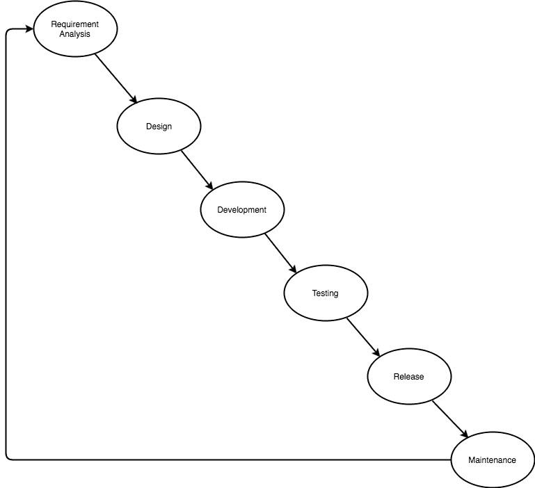

这是 IT 素养中最经典且最研究透彻的软件开发生命周期，几乎每个人在大学里都经历过这一过程，并且即使我们之前没见过，它也作为一种心理模型存在于每个人的脑海中。如今，随着敏捷方法的出现，人们倾向于认为这个模型已经过时。但我认为它仍然是一个非常有效的模型，唯一变化的是规模以及不同利益相关者在之前图示中的参与度。让我们从上到下简要地了解每个步骤的目标：

+   **需求分析**：这是我们将遇到大部分问题的地方。我们需要在 IT 外部人员（如会计、市场营销人员、农民等）与 IT 人员之间找到共同的语言，这通常会导致术语不同，甚至商业流程被错误捕捉的问题。

+   **设计**：在这一阶段，我们将使用 IT 人员可以立即理解的语言设计流程，这样他们就能够高效地编码。通常，这一阶段会与需求分析重叠（如果利益相关者本身就懂 IT），这也是理想的情况，因为图表是我们正在寻找的完美中介语言。

+   **开发**：顾名思义，这就是软件被构建的地方。这是开发人员擅长的事情：构建符合（可能有缺陷的）规范并且能够正常工作的技术制品。这里我们需要聪明：不管我们做什么，我们的软件都不可能完美无缺，我们需要相应地进行规划。当我们在敏捷环境中工作时，“尽早交付，频繁交付”是减少错误规范影响的座右铭，这样利益相关者就能在问题变得过大之前对产品进行测试。我还认为，尽早让利益相关者参与进来是一个不错的策略，但这不是万灵药，所以无论我们做什么，我们的软件必须是模块化的，以便我们可以插拔模块以适应新的需求。为了确保我们模块的功能正常，我们编写可以快速运行的单元测试，以确保代码按照预期的方式执行。

+   **测试**：这是持续集成存在的地方。我们的持续集成服务器将在适当时运行测试，并尽快通知我们应用程序可能存在的问题。根据软件的复杂性，在这一阶段我们的测试可能非常广泛，但一般来说，持续集成服务器专注于运行集成测试和验收测试（也就是说，集成服务器通常会运行所有测试，因为单元测试应该是低成本的）。

+   **发布**：在这个阶段，我们将软件交付到所谓的生产环境中；人们开始使用软件，无论我们在前期阶段投入多少精力，都难免会出现 Bug，这也是我们设计软件时希望能快速修复问题的原因。在发布阶段，我们可以创建一些稍后将在本书中看到的东西，称为**持续交付**（**CD**）流水线，它使开发人员能够非常快速地执行构建-测试-部署周期（甚至每天几次）。

+   **维护**：维护有两种类型：演化性和修正性。演化性维护是通过添加新功能或改进业务流程来推动软件的发展，以适应业务需求。修正性维护是修复错误和误解的过程。我们希望将后者最小化，但不能完全避免。

# 测试类型

在上一节中，我们讨论了不同类型的测试：

+   **单元测试**：我们所说的白盒测试是模拟依赖项并测试特定代码片段的业务流程。

+   **集成测试**：这些测试旨在验证应用程序不同组件之间的集成，而不是广泛地测试业务逻辑。有时，当软件不太复杂时，集成测试被用作单元测试（尤其是在动态语言中），但这并不是最常见的使用场景。

+   **验收测试**：这些测试旨在验证业务假设，通常基于我们所称的用户故事原理，描述具有“给定假设”风格的情境。

每个测试有不同的目标，它们协同工作，但请记住以下图示：

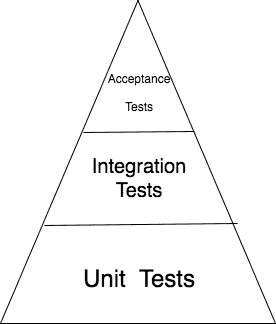

这就是我所说的测试金字塔，背后有多年的经验（不仅仅是我的）：你的软件应该有大量的单元测试，较少的集成测试，以及一些验收测试。这可以确保大部分业务逻辑被单元测试覆盖，集成测试和验收测试用于更特定的功能。此外，集成测试和验收测试通常更昂贵，因此通常建议最小化它们的使用（但前提是不降低测试覆盖率）。

当与 CI 服务器协作时，通常开发人员会在自己的计算机上运行**单元测试**，因为它们快速且能够发现大量潜在问题，将集成测试和验收测试留给 CI 服务器，在开发人员进行其他任务时运行这些测试。

# 传统 CI 服务器

在本节中，我们将介绍最传统的 CI 服务器：

+   Bamboo

+   Jenkins

它们已经存在一段时间了，尽管它们在企业界得到了广泛使用，但在与新的、更现代的 CI 服务器（如 Drone 或 Travis）相比，它们的优势正在逐渐减弱（尽管 Travis 已经存在一段时间，但它已被重新设计以支持云端工作）。

# Bamboo

**Bamboo**是由 Atlassian 开发的专有 CI 服务器。Atlassian 是一家专注于为开发者提供工具的软件公司。像 JIRA 和 Bitbucket 这样的产品由 Atlassian 开发，并在 IT 界广为人知。Bamboo 是他们为 CI 活动提供的解决方案，并且因与其他产品的良好集成而非常受欢迎。

让我们安装它。为此，请访问 Bamboo 的主页：[`confluence.atlassian.com/bamboo/`](https://confluence.atlassian.com/bamboo/)并按照快速入门指南中的说明操作。如你所见，安装过程非常简单，生成评估许可证并经过一些步骤（快速安装）后，你应该能在本地计算机上运行 Bamboo：

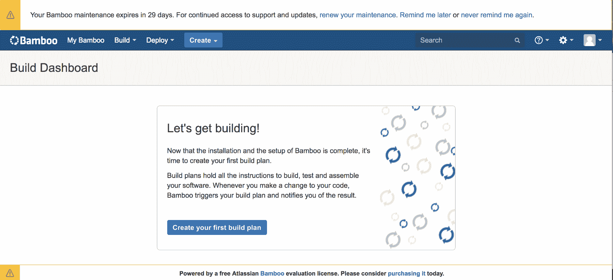

如果你点击标有“创建你的第一个构建计划”的按钮，你会发现设置 Bamboo 中的作业非常简单。在这个例子中，我们可以使用我之前创建的一个开源项目——**Visigoth**，它是一个带有断路器功能的负载均衡器，用于微服务之间的互联。GitHub 仓库位于[`github.com/dgonzalez/visigoth`](https://github.com/dgonzalez/visigoth)。

如果你想修改它，可以将其分叉到你的 GitHub 仓库中。Visigoth 是一个单一组件，彼此之间不互相作用，因此只为其创建了单元测试。在相应的字段中输入仓库的克隆 URL，在此情况下为 Git 仓库，然后提交表单。

如果你的 GitHub 账户启用了**基于时间的一次性密码**（**TOTP**）保护，你可能需要在表单的源部分选择“无认证的 Git 仓库”，而不是选择“GitHub 仓库”来创建测试计划。

一旦你完成了创建计划的步骤，它将要求你为测试计划添加任务，目前，这些任务仅包括从 Git 检出源代码。在这种情况下，Visigoth 是一个 Node.js 应用程序，因此，测试是通过执行`npm test`命令来运行的。为了执行此命令，我们需要添加两个`type`命令任务。第一个任务将用于安装应用程序的依赖项，第二个任务将用于运行测试。让我们先添加第一个任务：

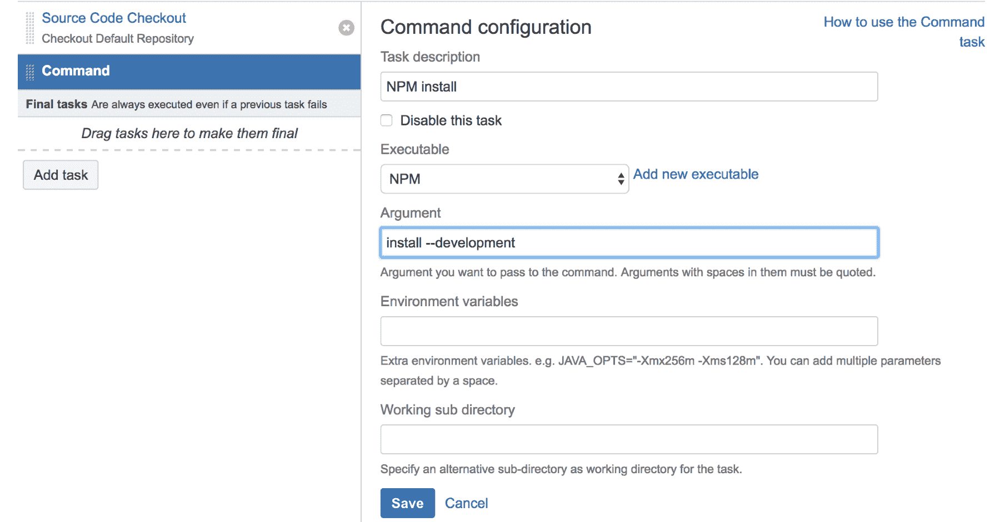

如你所见，我通过点击“添加新可执行文件”并指定`NPM`所在路径来添加了一个可执行文件。你可以通过在安装 Bamboo 的机器的终端执行`which npm`来找到该路径。

你需要在安装了 Bamboo 的同一台机器上安装 Node.js 才能运行测试。当前的 LTS 版本与之兼容良好，但 Visigoth 是在 Node 6.x 上进行测试的。

现在我们将添加第二个命令，它将执行`npm test`来运行测试。该命令只会在前两个步骤（检出代码[Checkout Default Repository]和安装依赖[NPM install]）成功后执行：

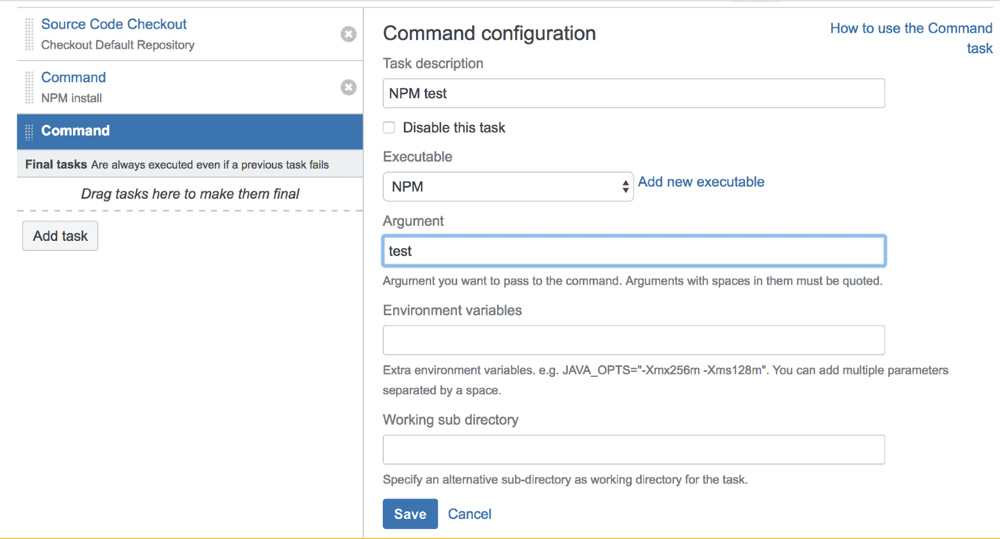

一旦保存了任务，我们就完成了执行 Visigoth 测试所需的所有操作。现在，剩下的唯一任务就是运行该作业：

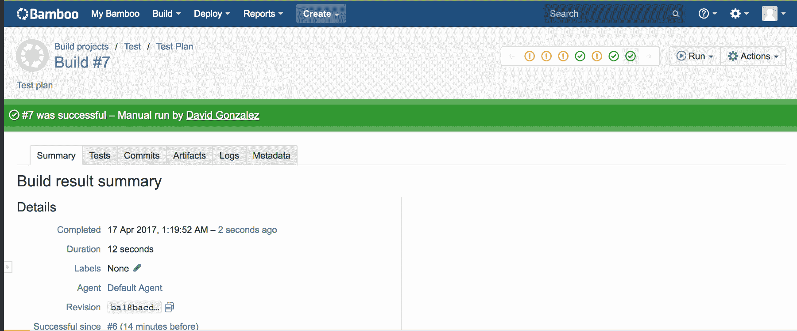

如果一切正常，你应该会看到一个绿色的徽章和成功的消息。正如你看到的，我的构建在之前的运行中失败了，因为我正在调整 CI 服务器以运行 Visigoth。

你可以查看作业的日志，看看有多少测试成功通过以及其他有用的信息。如果你进一步探索，你还会看到 Bamboo 提供了不同类型的任务，比如 mocha 测试运行器，这使得 Bamboo 能够理解测试结果。目前，在当前配置下，如果任何测试失败，Bamboo 将无法识别失败的是哪个测试。我建议你尝试不同的配置，甚至不同的应用程序，以便熟悉它。正如你自己所看到的，界面非常友好，通常通过创建新任务，达到你期望的配置也相当简单。

默认情况下，Bamboo 会创建一个名为**触发器**的东西。触发器是一种导致测试计划执行的操作。在这种情况下，如果我们更改了作业创建时使用的 GitHub 仓库，测试计划将被触发以验证更改，确保新代码的持续集成。

另一种有趣的触发器类型是基于时间的触发器。这种类型的触发器允许我们在夜间运行构建，因此如果我们的测试需要几分钟甚至几个小时才能完成，我们可以在没人使用服务器时执行它。此类触发器帮助我避免了由于夏令时调整导致的一些错误，这些错误会导致某些测试失败，因为代码片段无法很好地处理跨时区的时间变化。

总的来说，Bamboo 能够应对各种情况，并且已经适应了现代的需求：我们甚至可以在测试通过后构建 Docker 镜像，并将其推送到远程注册表，以便后续部署。Bamboo 还能够在构建后的阶段采取行动，例如，如果构建在夜间失败，它会通过电子邮件或其他通信渠道通知我们。

# Jenkins

我已经使用 Jenkins 一段时间了，我必须说，使用它让我感到非常舒适，因为我知道它是免费的、开源的，并且高度可定制。它有一个强大且文档完善的 API，使用户能够自动化几乎与持续集成相关的所有事务。在第八章，*发布管理 – 持续交付*，我们将设置一个持续交付管道，使用 Jenkins 以便在测试结果满意时能够透明地发布应用程序的新版本，使我们的团队能够专注于开发，并自动化所有与部署相关的活动。

Jenkins 也是模块化的，这使得开发人员可以编写插件来扩展功能，例如，在构建失败时向 Slack 渠道发送消息，或将 Node.js 脚本作为作业的一部分执行。

在可扩展性方面，Jenkins 像 Bamboo 一样，可以通过主从配置扩展到数百个节点，从而为我们的 CI 服务器增加更多的计算能力，以便并行执行一些任务。

就其本身而言，Jenkins 足以提供几本书的内容，但我们将探讨设置自动化作业以测试应用程序所需的内容。也可以为 Jenkins 编写插件，因此，实际上它的功能没有限制。

现在让我们先关注 Jenkins 的操作方面。为了运行 Jenkins，我们有两个选择：

+   以 Docker 容器的方式运行

+   将其作为程序安装在您的 CI 服务器上

现在，我们将使用 Jenkins 的 Docker 镜像进行安装，因为这是运行它的最简单方式，并且适合我们的目的。让我们开始吧。首先要做的是通过命令行运行一个简单的 Jenkins 实例：

```
docker run -p 8080:8080 -p 50000:50000 jenkins
```

这将运行 Jenkins，但要注意，所有关于配置和执行的构建信息都将存储在容器中，因此如果丢失容器，所有数据也会丢失。如果您想使用一个卷来存储数据，需要执行的命令如下：

```
docker run --name myjenkins -p 8080:8080 -p 50000:50000 -v /var/jenkins_home jenkins
```

这将创建一个可以在升级到新版本的 Jenkins 或甚至重新启动相同容器时重用的卷。运行该命令后，日志将显示类似于以下图示的内容：

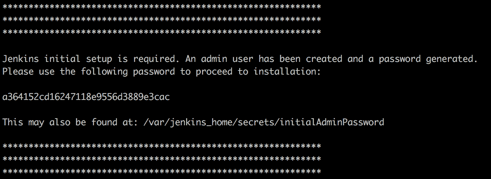

这是 Jenkins 的初始密码，设置实例时需要用到它。几秒钟后，容器的日志将停止，这意味着您的 Jenkins 服务器已准备好使用。只需打开浏览器，访问`http://localhost:8080/`，您将看到类似于以下内容的界面：

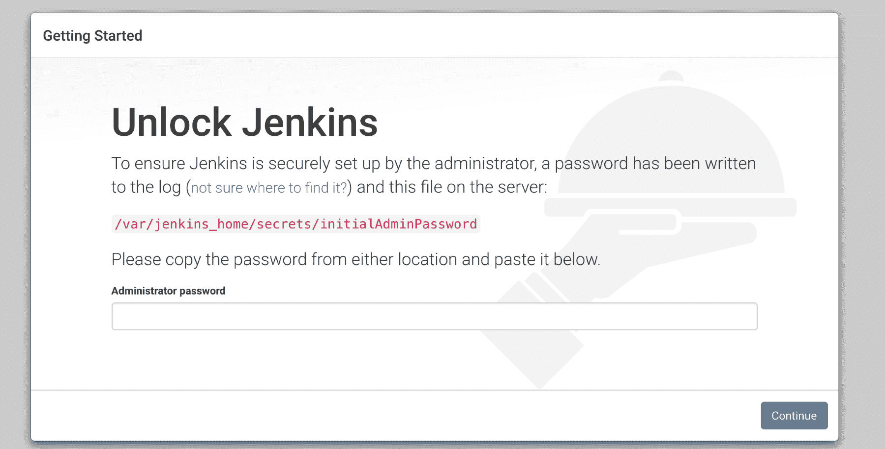

这里是您可以输入先前保存的管理员密码，并单击“继续”按钮的位置。接下来的屏幕将询问您是否应安装建议的插件，或者您是否想选择要安装的插件。请选择建议的插件。几分钟后，它将允许您创建用户，就这样。Jenkins 正在一个容器中运行：

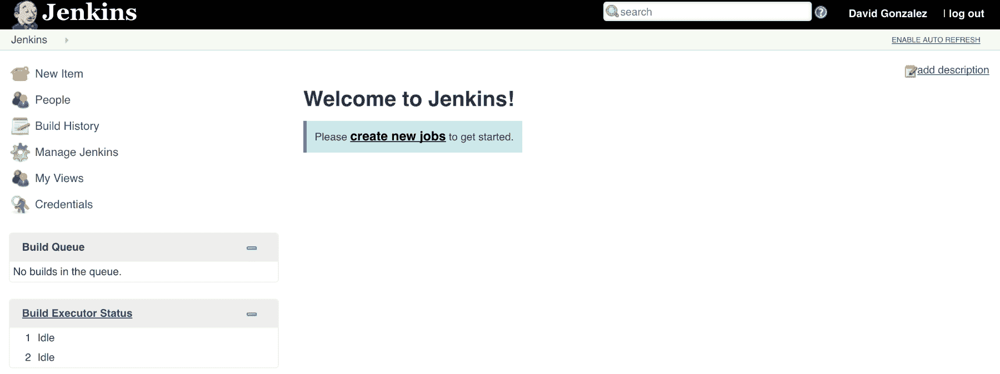

现在我们将创建一个新的作业。我们将使用与 Bamboo 相同的代码库，以便我们可以比较这两个集成服务器。让我们点击“创建新项目”。您将看到以下表单：

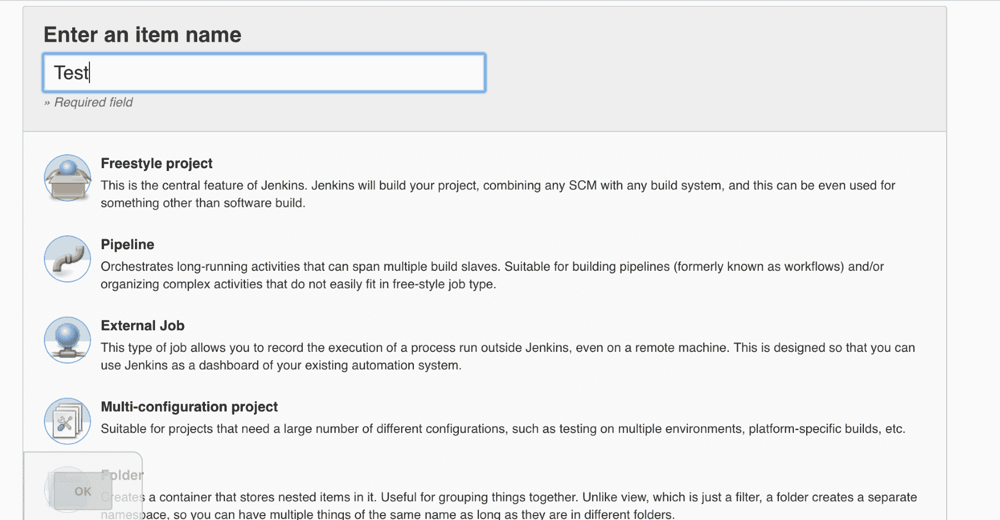

只需为项目输入名称，并选择第一个选项：自由样式项目。Jenkins 有不同类型的项目。自由样式项目是一种我们可以定义步骤的项目类型，就像我们在 Bamboo 中所做的那样。另一个有趣的选项是流水线类型，我们可以通过一个称为 **DSL**（即 **领域特定语言**）的语言定义一组步骤和阶段，创建可以保存为代码的流水线。

接下来的屏幕是我们配置项目的地方。我们将使用 Git，其存储库托管在 [`github.com/dgonzalez/visigoth.git`](https://github.com/dgonzalez/visigoth.git) 上。

如果您之前在 Bamboo 中创建了分支，则可以使用您的分支。您的配置应与以下屏幕截图所示类似：

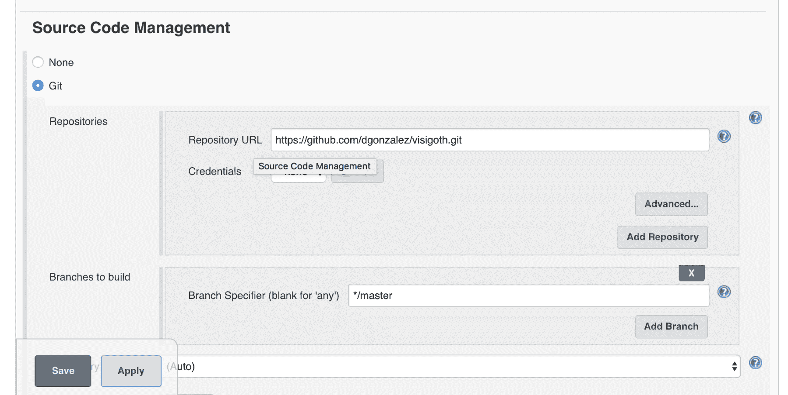

现在我们需要使用 `npm install --development` 命令安装 Visigoth 的依赖项，并使用 `npm test` 命令执行测试，但我们是从容器中运行 Jenkins，而这个容器并未安装 Node.js。我们将利用我们的 Docker 知识来安装它。检查 Docker Hub 中 Jenkins 镜像的 Dockerfile，我们可以验证它基于 Debian Jessie（它基于 OpenJDK，但是它基于 Debian Jessie），因此我们可以在其中安装所需的软件。要安装软件的第一步是获得容器的 root 访问权限。正如您在 第二章 中所学到的，“云数据中心 - 新的现实”，我们可以在正在运行的容器上执行命令。让我们执行以下命令：

```
docker exec -u 0 -it eaaef41f221b /bin/bash
```

此命令在 ID 为 `eaaef41f221b` 的容器中以 UID 和 GID 为 `0` 的用户（在您的系统中将会有所不同，因为每个容器的 ID 都是唯一的）执行 `/bin/bash`。我们需要这样做是因为 Jenkins 镜像定义并使用一个名为 `jenkins` 的新用户，其具有已知的 UID 和 GID，因此如果未传递 `-u 0` 标志，则 `/bin/bash` 命令将由用户 `jenkins` 执行。

一旦我们在容器中获得了 root 权限，继续安装 Node.js：

```
curl -sL https://deb.nodesource.com/setup_7.x | bash -
```

一旦上一个命令的执行完成，运行以下命令：

```
apt-get install -y nodejs build-essentials
```

就这样。从现在开始，我们的 Jenkins 容器有了 Node.js 的安装，可以运行 Node.js 脚本。也就是说，我们应该避免在生产容器中安装软件。我们的容器应该是**不可变的工件**，在生命周期内不做更改，因此我们应该将这个镜像的更改提交并标记为新版本，以便将其发布到生产容器中。由于我们没有生产容器，所以我们边做边修改。

我们生产环境中的容器应该是不可变的工件：如果我们需要更改它们的状态，我们会创建新版本的镜像并重新部署，而不是修改正在运行的容器。

一旦安装了 Node.js，我们可以退出容器中的 root shell，然后回到 Jenkins 完成我们的任务。就像我们在 Bamboo 中做的一样，以下是我们运行测试所需要的步骤：

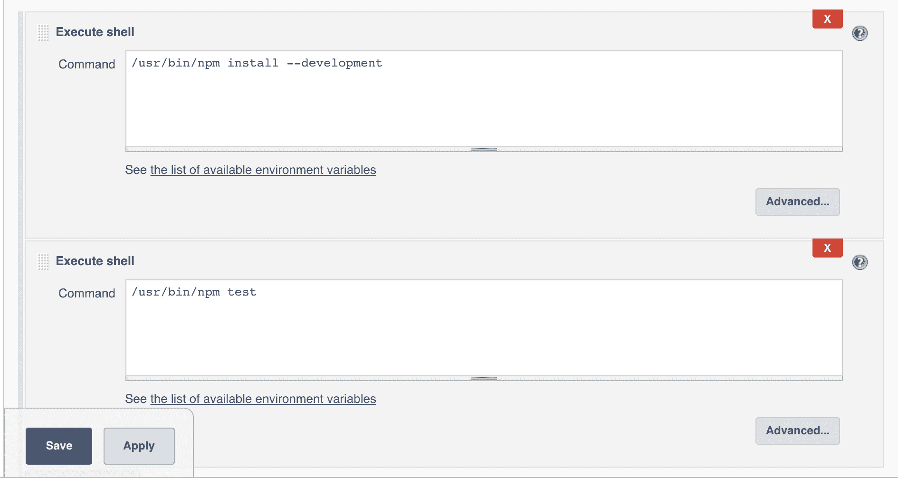

在作业配置的最底部，有一个叫做 **post-build** 的操作部分。这个部分允许你在作业完成后执行一些操作。这些操作包括发送电子邮件、将提交信息添加到 Git 仓库等。如我们之前提到的，Jenkins 是可扩展的，通过安装新插件，可以添加新的操作。

Jenkins 还可以通过用户输入对构建进行参数化。

一旦你添加了这两个步骤到构建中，点击保存，我们就完成了：现在你已经拥有一个完全功能的 Jenkins 作业。如果我们运行它，它应该能够成功运行 Visigoth 上的测试。

# 密钥管理

CI 服务器的一个功能是能够与通常依赖某种凭证（如访问令牌或类似物品）来验证用户身份的第三方服务进行通信。暴露这些密钥是不被鼓励的，因为它们可能会对我们的公司造成重大损害。

Jenkins 以非常简单的方式处理此问题：它提供了一种安全存储凭证的方法，可以将这些凭证作为环境变量注入到构建中，以便我们可以使用它们。

我们来看一些示例。首先，我们需要在 Jenkins 中创建密钥。为此，我们需要从首页进入管理 Jenkins 页面。

一旦我们到达那里，你应该看到一个非常相似的界面：

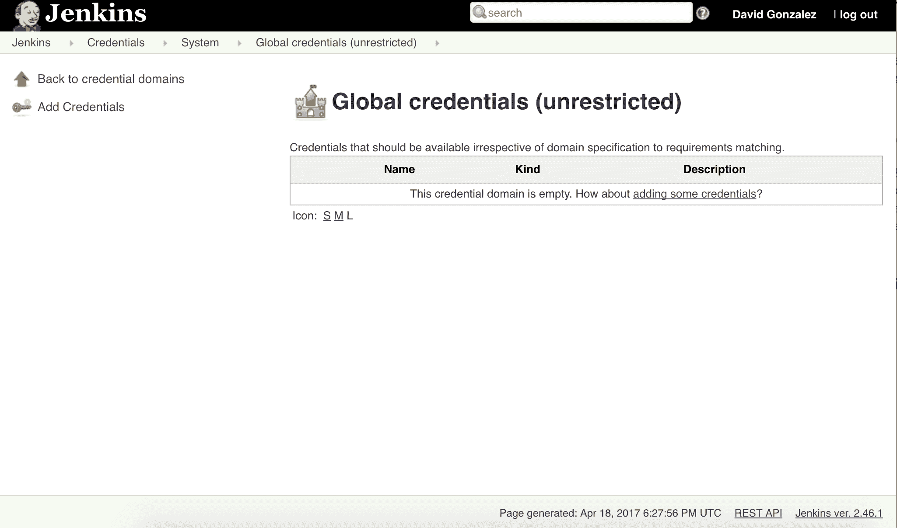

我们使用的是全局凭证存储，因为我们只是想展示其工作原理，但 Jenkins 允许你将凭证封装起来，以便你可以在不同的使用场景下限制访问权限。在 Jenkins 中，凭证除了可以注入到构建上下文外，还可以连接到插件和扩展，以便它们可以对第三方系统进行身份验证。

现在，点击左侧的“添加凭证”按钮：

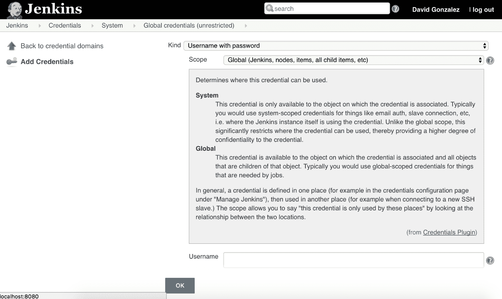

在继续之前，有些字段需要我们填写，但它们非常基础：

+   类型：这是我们想要创建的秘密类型。如果打开下拉菜单，会有几种类型，从文件到证书，涵盖用户名和密码等。

+   范围：这是我们秘密的作用范围。文档不是 100%清晰（至少第一次阅读时不清晰），但它允许我们在某些情况下隐藏秘密。这里有两个选项：全局（Global）和系统（System）。选择全局时，凭据可以暴露给 Jenkins 及其子对象中的任何对象，而选择系统时，凭据只能暴露给 Jenkins 及其节点。

其余字段取决于秘密的类型。接下来，我们将创建一个`用户名与密码`类型的秘密。只需在下拉菜单中选择它并填写其余细节。创建完成后，它应该会出现在凭据列表中。

下一步是创建一个绑定到这些凭据的任务，以便我们可以使用它们。只需像本节开始时看到的那样创建一个新的自由风格项目，但我们将在配置任务的屏幕上停下来，特别是在构建环境部分：

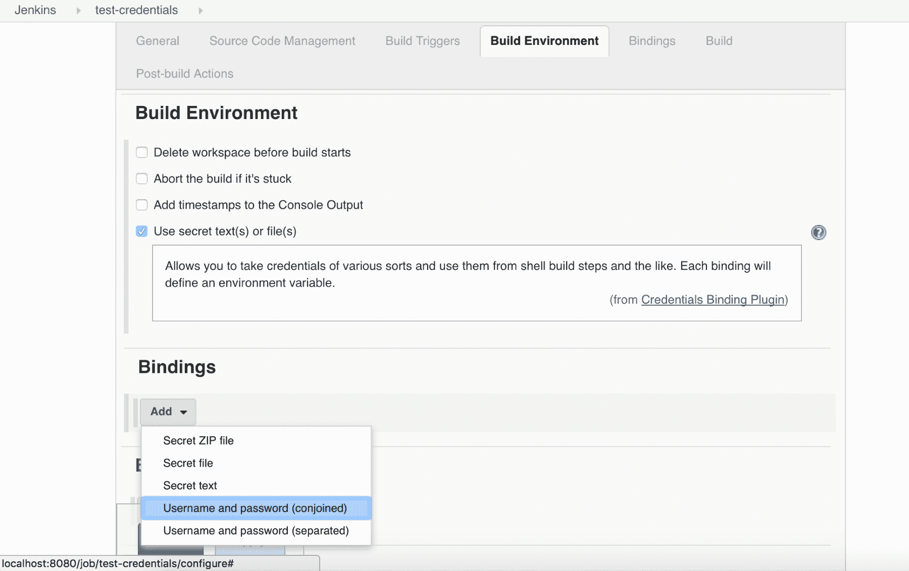

现在选择用户名和密码（联合）。联合用户名和密码意味着我们在一个变量中获得完整的秘密（用户名和密码），而分开则会将秘密分成两个变量：一个用于用户名，另一个用于密码。

一旦我们选择了它，创建绑定的表单就非常简单：

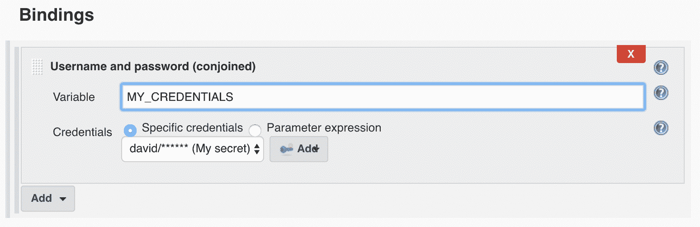

我们可以选择存储秘密的变量，并且还可以选择具体的秘密。有一个单选按钮可以让你选择“参数表达式”或“特定凭据”，因为我们可以将任务参数化，让用户在触发屏幕中输入内容。为了展示 Jenkins 设计的周全，我们将添加一个构建步骤，通过将秘密回显到日志中来使用它：

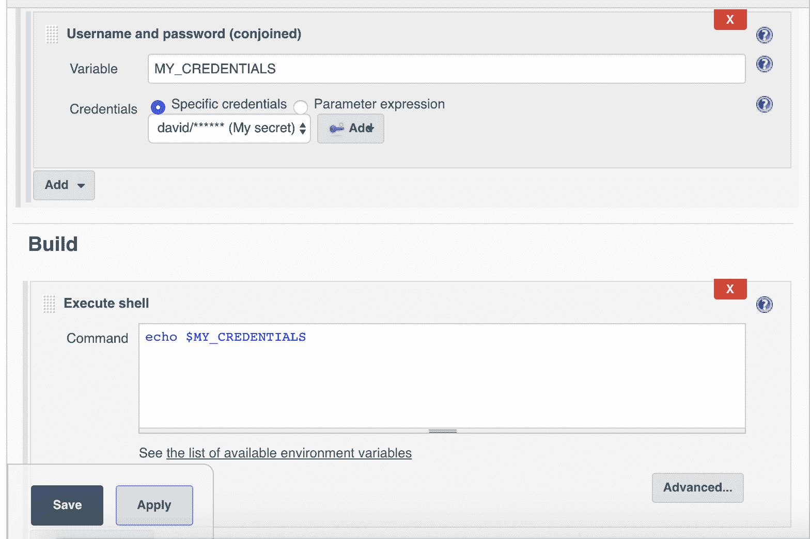

点击保存按钮以保存任务并运行它。一旦任务执行完成，转到结果并点击控制台输出。如果你原本期待在这里看到秘密，Jenkins 将给你一个惊喜：

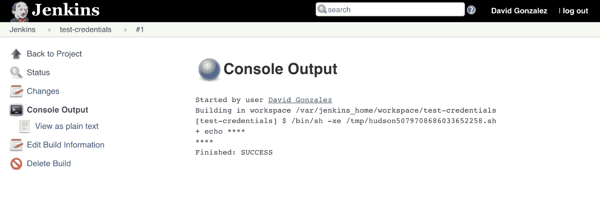

为了防止未授权用户暴露秘密，该秘密已被掩码处理。虽然这种方法并非万无一失，因为有人可能会轻易地从通过 Jenkins 检查出的应用程序中的测试中提取该秘密，但它确实为安全性提供了一定的保障，剩下的则依赖于代码审查和流程。

# 现代 CI 服务器

在 IT 领域，有一件事是明确的，那就是市场发展非常迅速，每隔几年，就会有一个新的趋势打破曾经被认为是完美解决方案的问题。CI 软件也不例外。在过去的几年中（考虑到本书是 2017 年写的），基础设施即代码（Infrastructure as Code）吸引了大量的关注，而在 CI 中，其对应的概念是流水线即代码（Pipelines as Code）。

Jenkins 和 Bamboo 最近已经添加了对声明式流水线的支持，但它们并不是围绕这个概念构建的。

# Drone CI

Drone 可能是市场上最新的 CI 服务器。我决定在本章介绍它，因为当我在 nearForm Ltd. 了解到它时，它对我来说是一个巨大的启示。那时，我已经习惯了 Jenkins，它适用于我在职业生涯中遇到的每一个用例，从 CI 到持续交付，有时甚至作为堡垒主机，使用一种叫做回调 URL 的功能，在这个功能下，工作可以通过向特定 URL 发送 HTTP 请求来触发。

Drone 是基于容器概念构建的。Drone 中的所有内容都是容器，从服务器到测试运行的地方，最有趣的部分是，甚至插件也是容器。这使得编写新的插件以执行自定义操作变得非常容易，唯一的要求是，如果容器成功完成，必须返回 `0` 作为退出代码，如果不成功，则返回非零退出代码。

对于 Jenkins 或 Bamboo，编写插件需要几个小时的测试和阅读文档。而对于 Drone，我们只需要知道如何构建 Docker 镜像以及我们想要完成的任务。

请注意，Drone 仍然处于 0.5 版本，并且发展非常快速，因此在你阅读本书时，Drone 可能已经发生了显著变化，但我还是决定包括它，因为我认为它是一个非常有前途的软件。

# 安装 Drone

为了安装 Drone，我们将使用 `docker-compose`，并将其配置为与 GitHub 一起使用。

Drone 和 Docker 一样，遵循客户端-服务器架构，因此我们可以找到两个不同的组件：服务器和 CLI。我们将首先继续进行服务器部分的配置。请查看以下 `docker-compose` 文件：

```
version: '2'

services:
drone-server:
image: drone/drone:0.5
ports:
- 80:8000
volumes:
- ./drone:/var/lib/drone/
restart: always
environment:
- DRONE_OPEN=true
- DRONE_GITHUB=true
- DRONE_GITHUB_CLIENT=${DRONE_GITHUB_CLIENT}
- DRONE_GITHUB_SECRET=${DRONE_GITHUB_SECRET}
- DRONE_SECRET=${DRONE_SECRET}

drone-agent:
image: drone/drone:0.5
command: agent
restart: always
depends_on: [ drone-server ]
volumes:
- /var/run/docker.sock:/var/run/docker.sock
environment:
- DRONE_SERVER=ws://drone-server:8000/ws/broker
- DRONE_SECRET=${DRONE_SECRET}
```

在前面的 Docker Compose 文件中，运行了两个容器：一个是服务器，另一个是代理。在 0.4 版本之前，Drone 的主节点可以执行构建，但在此之后，需要一个代理来运行构建。在继续之前，我们需要配置一些秘密信息，这些信息通过环境变量传递给 Compose（使用`${VAR_NAME}`符号）：

+   `DRONE_GITHUB_CLIENT`：如前所述，我们将使用 GitHub 作为源代码的来源，以便进行测试。在 GitHub 上注册一个新的 OAuth 应用时，这个值会提供给你。你可以在 GitHub 的设置部分创建 OAuth 应用。小心，创建 GitHub OAuth 应用时需要的参数之一是回调 URL。在这种情况下，我们将使用`http://localhost/authorize`，因为我们在本地计算机上工作。

+   `DRONE_GITHUB_SECRET`：与`DRONE_GITHUB_CLIENT`相同，这是在 GitHub 上创建新 OAuth 应用时提供的。

+   `DRONE_SECRET`：这是一个与代理和主服务器共享的任意字符串。你只需创建一个简单的字符串，但在生产环境中运行 Drone 时，确保字符串足够长，以免被猜到。

为了让 Drone 与 GitHub 集成工作，我们需要从 GitHub 接收回调。一旦我们获取到所有的值，我们只需要运行以下命令：

```
DRONE_GITHUB_CLIENT=your-client DRONE_GITHUB_SECRET=your-secret DRONE_SECRET=my-secret docker-compose up
```

在一行命令中，我们设置了所需的三个变量，并运行了`docker-compose up`。如果一切顺利，当你访问`http://localhost`时，应该能看到类似下面的窗口：

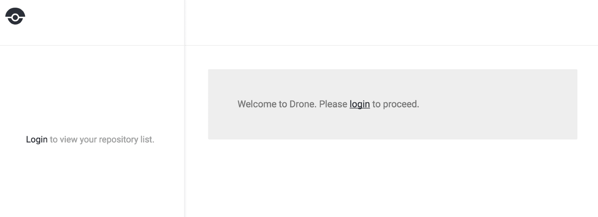

如果点击登录，Drone 应该会将你重定向到 GitHub 进行授权，然后 GitHub 会将你重定向到创建 OAuth 应用时指定的回调 URL，即你的本地 Drone 安装地址`http://localhost/authorize`。有时可能需要一些调整，但一般来说，非常容易让它工作。如你所见，Drone 利用 GitHub 的身份验证，因此需要一个 GitHub 账号来登录。

现在我们将继续进行 CLI 配置。只需访问[`readme.drone.io/0.5/install/cli/`](http://readme.drone.io/0.5/install/cli/)并选择适合你平台的版本，在我的案例中是 macOS。只需将二进制文件放在路径中，你就可以开始使用了。为了配置 Drone 服务器的位置，你需要指定两个环境变量：

+   `DRONE_SERVER`：这是你的 Drone 服务器的 URL，在这种情况下是`http://localhost`

+   `DRONE_TOKEN`：登录 Drone 后，进入帐户页面并点击显示令牌。这就是你需要的值

设置好这两个变量后，执行以下命令：

```
drone info
```

这应该会显示你的 GitHub 用户名和你用来注册的电子邮件。

# 运行构建

Drone 在运行构建时有不同的理念：它通过触发管道来响应远程仓库中代码的变化。我们来创建一个超级简单的仓库，里面有一个非常简单的 Node.js 应用。我已经在我的 GitHub 账户上创建了这个仓库，为了让一切更加简单：[`github.com/dgonzalez/node-example-drone/`](https://github.com/dgonzalez/node-example-drone/)。只需将其 fork 到你自己的账户，就可以开始了。

我们需要做的第一件事是激活你本地 Drone 安装中的项目。只需进入账户，在仓库列表中激活`node-example-drone`。现在，它应该像下面的截图一样出现在主屏幕上：

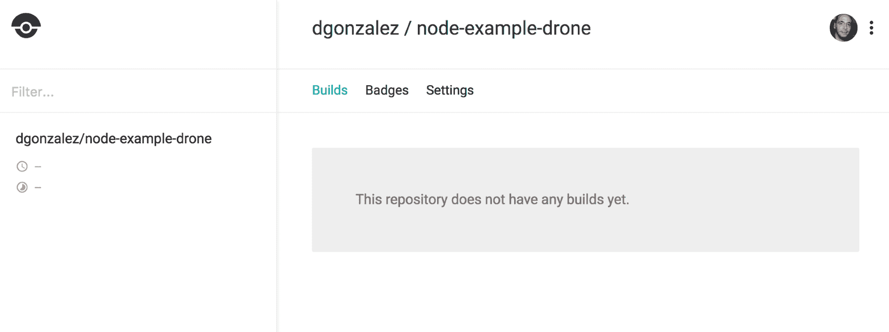

现在我们面临一个小问题：Drone 是为了触发通过 GitHub 发送到我们的 Drone 服务器的 webhook 而创建的。由于我们在一个私有网络中工作，我们需要以某种方式将我们的服务器暴露到互联网。在这种情况下，我们将使用一个叫做**Ngrok**的服务（[`www.ngrock.com`](http://www.ngrock.com)），以便将 Drone 暴露到互联网，而在生产环境中工作时这并不是必要的，因为它应该可以通过互联网访问（或者至少通过代理访问）。只需按照说明操作，一旦在终端运行它，它应该和下面的截图非常相似：

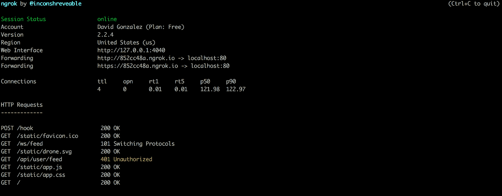

这指定了哪个主机被转发到你的本地地址，在我的例子中是`http://852cc48a.ngrok.io`。只需在浏览器中打开它，检查是否可以从那里访问 Drone。

还剩下一件事，就是编辑 Drone 在我们激活时安装在 GitHub 仓库中的 webhook。你可以在 GitHub 的仓库设置中找到它。只需编辑 webhook，将 URL 从`http://localhost`更改为你的 Ngrok URL，在我的例子中是`http://852cc48a.ngrok.io`。

# 执行管道

现在设置完成，在做任何事情之前，先看一下 forked 仓库中的`.drone.yaml`文件：

```
debug: true
pipeline:
 build:
 image: node
 commands:
 - npm install --development
 - npm test
```

这是我们的管道，正如你所猜测的，它会和我们的代码一起提交到仓库中。当 GitHub 将 webhook 传送到我们的 Drone 安装时，Drone 会执行此管道中的指令。由于 Drone 与容器一起工作，Drone 首先会基于我们指定的 node 创建一个镜像，并执行以下操作：

+   它会安装依赖

+   它会运行测试

如果执行这些命令的容器的退出代码是`0`，那么我们的构建就成功了，你可以通过推送一些更改到你的 GitHub 仓库，并观察 Drone 如何响应来进行测试。

还有一种通过 CLI 接口重新触发构建的方法（不是第一次）。打开终端，在配置好之前提到的环境变量后（如果你还没有做），执行以下命令：

```
drone build list dgonzalez/node-example-drone
```

这将返回一个已执行构建的列表。只需将`dgonzalez`更改为你的用户名，正如你在网页界面中看到的那样。为了重新运行之前的构建，我们可以执行以下命令：

```
drone build run dgonzalez/node-example-drone 1
```

这个命令触发了一个已构建的 Drone 构建。这在你怀疑构建因外部因素而失败时特别有用。

有时，webhook 会失败（尤其是我们与 Ngrok 的设置），但 GitHub 允许你在仓库的 webhook 部分调试这个问题。

这是管道的最简单案例。如前所述，Drone 基于插件，这些插件也是 Docker 镜像。插件列表非常全面，可以在[`github.com/drone-plugins`](https://github.com/drone-plugins)找到。

假设我们想将镜像推送到 Google Cloud 中的 **Google Container Registry**。我们将使用来自[`github.com/drone-plugins/drone-gcr`](https://github.com/drone-plugins/drone-gcr)的插件 `drone-gcr`。这是我们的管道：

```
debug: true
pipeline:
  build:
    image: node
    commands:
      - npm install --development
      - npm test
  publish:
    gcr:
      repo: myrepo/node-example-drone
      token: >
         {
            ...
         }
```

这里有一个两阶段的管道：它首先执行测试，一旦测试成功，就将镜像部署到 Google Cloud Registry。我们在管道中有不同的阶段可以使用：

+   **构建**: 用于构建测试和相关命令

+   **发布**: 用于将工件发布到远程仓库

+   **部署**: 对于持续集成非常有用，因为它允许我们以持续交付的方式部署软件

+   **通知**: 用于通过电子邮件、Slack 或其他任何渠道发送通知

例如，如果我们想发送一个 Slack 通知，我们只需要将以下几行添加到管道中：

```
 notify:
   image: plugins/slack
   channel: developers 
   username: drone
```

记住，YAML 对制表符和空格非常敏感，因此 `notify` 需要与 `publish` 或 `build` 在同一级别。

# 其他功能

在撰写本文时，Drone 正在积极开发中，不断添加新功能，并进行一些重大重构。它还提供了其他功能，如秘密管理和支持服务。

通过秘密管理，我们可以注入加密后的秘密，这些秘密存储在数据库中，只有在我们的 Drone CLI 使用来自 Drone 服务器的有效令牌进行加密签名后，才会注入到构建中。

Drone 还提供支持服务，这些服务在测试期间与测试一起运行。当我们的集成测试依赖数据库，或需要启动像 Hashicorp Vault 这样的第三方软件，或者像 Consul 或 Eureka 这样的服务发现基础设施时，这非常有用。

预计未来 Drone 将会有更多功能，但目前它正在经历重大变化，因为它正在积极开发（与像 Jenkins 这样的成熟服务器不同，后者已经存在了一段时间）。

# 总结

在本章中，我们介绍了三种不同的 CI 工具：

+   Bamboo，一种商业工具

+   Jenkins，一种行业标准的开源工具

+   Drone，一款尖端技术的 CI 服务器

我们在本书中讨论了将来要使用的 Jenkins 的关键特性，但我们也展示了 Drone 如何将容器的概念融入一个非常强大的 CI 系统，尽管它还不够成熟，但我预计在未来几年将成为行业标准。

我们需要注意的重要概念已经解释过了，但总结来说，我们使用集成服务器来为我们运行测试，这样可以让开发人员不需要做这些工作，同时也能在夜间运行测试，以确保每日构建的稳定性。

在下一章，我们将探讨社区所称的 I**nfrastructure as Code:** 基本上是一种将我们的基础设施视为代码来处理的方式，优雅地管理资源。
