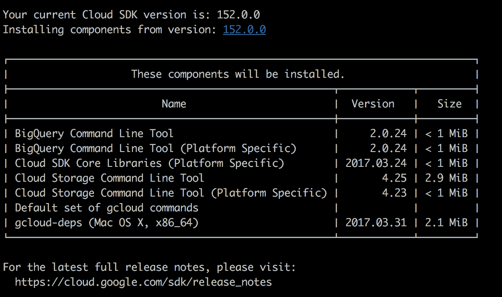
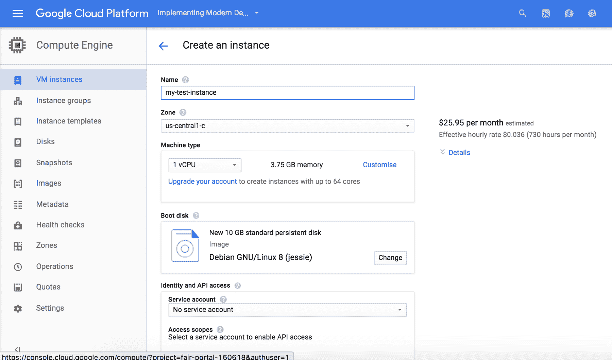
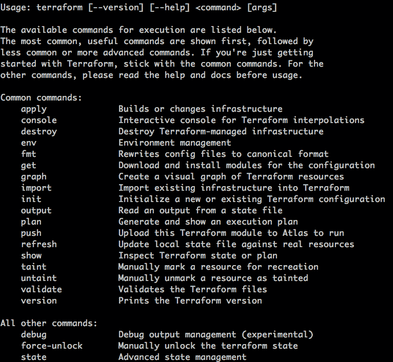
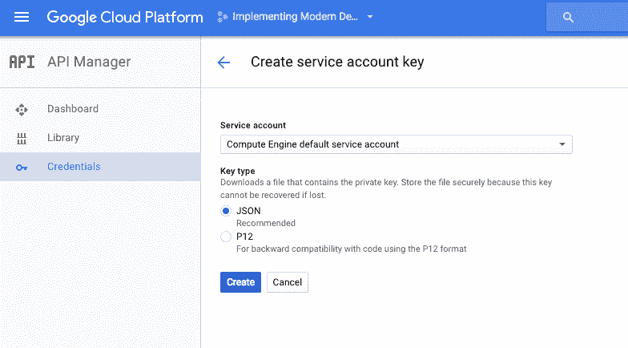
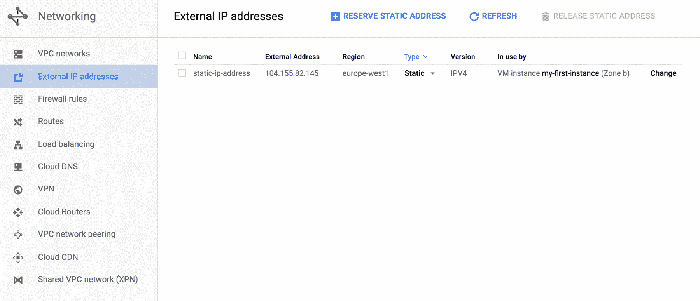
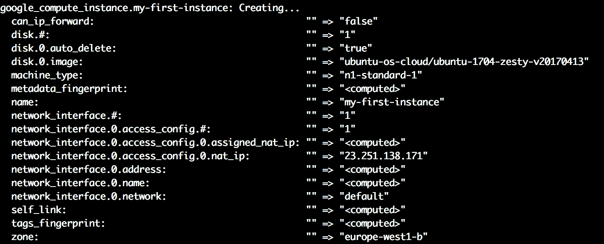

# 基础设施即代码

在前几章中，我们展示了新一代云数据中心如何帮助我们非常轻松地创建在线资源（虚拟机、Docker 仓库、加密密钥），将硬件配置周期从几周（购买、运输和安装新计算机）缩短到几秒钟。我们还看到了市场上有不同的供应商可以提供类似的功能，并且具有各自不同的优势，我们可以在构建系统时加以利用。

你已经学会了如何通过他们提供的网页界面创建资源，但这种方式的可扩展性如何呢？手动创建资源阻止了我们保持自动化的资源清单，这对于安全目的以及像管理软件组件一样管理我们的基础设施是必要的。

在本章中，你将首先学习如何通过云数据中心供应商提供的 SDK 来构建云中的资源，然后通过一个叫做**Terraform**的软件组件来构建，**Terraform**是一个管理在线资源的行业标准。我们将专注于**Google Cloud Platform**，原因有几个：

我个人认为，命令行界面更易于使用。

Google Cloud Platform 的试用版涵盖了大量资源，你可以在本书中使用这些资源进行实验，因为你几乎可以在全套产品中创建任何资源。

在写这篇文章时（2017 年 4 月），在云数据中心方面，Google Cloud Platform 提供了最具性价比的服务。

也就是说，AWS、Azure 或任何其他供应商也提供了非常有趣的试用账户，但遗憾的是，我们不能在一本书中涵盖所有内容。

# Google Cloud Platform SDK -  gcloud

Google 为我们提供了一个非常全面的 SDK，它可以用于操作 Google Cloud Platform 以及安装与云操作相关的软件组件。

我们需要做的第一件事是安装`gcloud`。

虽然有 Windows 版安装程序，但通常来说，对于基于 Unix 的系统（主要是 Linux 和 Mac），我们有一个可以从命令行执行的交互式安装程序，并且有一个无人值守模式（用于自动配置）。

不同的选项可以在[`cloud.google.com/sdk/downloads`](https://cloud.google.com/sdk/downloads)找到。

为了安装它（在我的例子中是在 Mac 上），我们需要做的第一件事是运行以下命令：

```
curl https://sdk.cloud.google.com | bash
```

这将启动在线模式下的交互式安装程序：在安装过程中，我们会被问到一系列问题。

第一个是安装目录。默认情况下，这是用户的主目录，但你可以将其更改为你选择的文件夹。选择文件夹后，它将开始下载并安装所需的基础组件。

问题是，你是否愿意通过收集匿名数据来帮助改进 Google Cloud SDK。请根据你的偏好作答。

现在，Google Cloud SDK 将开始安装核心组件。



如前图所示，Google SDK 安装了一些用于操作 Google Cloud Platform 上基本服务的软件包。安装完成后（无需执行任何操作），它会询问你是否要修改系统的 `PATH` 变量。只需回复 `Y` 并按 *Enter* 键，这样 `gcloud` 命令就可以在控制台中使用了。它会询问你要在哪个文件中修改 `PATH` 变量。通常，安装程序提供的默认选项已经足够好。在修改文件之前，Google Cloud SDK 安装程序会创建一个备份文件，文件名与原文件相同，扩展名为 `.backup`，这样你可以还原更改。

现在完成了。它会提示你启动一个新的 shell 来使更改生效。关闭终端并重新打开，检查 `gcloud` 命令是否可用。

现在我们已经安装了 Google Cloud SDK，是时候配置认证了。执行以下命令：

```
gcloud init
```

它会要求你登录，因此请选择“是”，这将打开一个浏览器窗口，要求你输入 Google 凭证。输入与你的试用账户相关联的凭证（如果你没有注册试用版，请在配置凭证之前进行注册）。如果你在 Google Cloud Platform 上已经创建了项目，它会要求你在控制台中选择要使用的项目。在我的例子中，我已经在第二章中配置了一个项目，*云数据中心——新现实*，所以我选择了名为 `implementing-modern-devops` 的项目。

接下来的主题是配置 Google Compute Engine。请选择“是”并选择你的可用性区域。在我的情况下，欧洲的任何地方都适合我。

完成此步骤后，我们就完成了。提示符会告诉我们已经创建了一个名为“default”的配置。这意味着 Google Cloud SDK 可以使用多个凭证，但在本例中，我们将只使用一组凭证和一个项目。

# 使用 Google Cloud SDK 创建资源

一旦我们设置好，就该开始创建资源了。正如你所猜测的，创建资源的命令可能会非常复杂，也可能非常简单，取决于你的需求。幸运的是，Google 工程师在创建 Google Cloud Platform 的界面时已经考虑到了这一点。

首先，你需要登录到你的 Google Cloud Platform 账户。登录后，进入 Compute Engine 并填写表单以创建新的资源。输入实例名称，选择离你最近的区域（在我这里是欧洲），选择机器类型（默认即可），API 访问（我们不需要这个，但默认设置可以），并勾选允许 HTTP 流量和允许 HTTPS 流量。在点击创建之前，请查看以下截图：



如果你查看最底部，在“创建”按钮下面，有两个链接：

+   REST 等效

+   命令行

现在，我们将重点关注命令行链接。点击它，你应该会看到一个带有一些命令的窗口。让我们解释一下它们：

```
gcloud compute --project "implementing-modern-devops" instances create "test-instance" \
               --zone "europe-west1-c" --machine-type "n1-standard-1" --subnet "default" \
               --maintenance-policy "MIGRATE" \
               --service-account "1085359944086-compute@developer.gserviceaccount.com"
               --scopes \                     
                    "https://www.googleapis.com/auth/devstorage.read_only", \
                    "https://www.googleapis.com/auth/logging.write", \
                    "https://www.googleapis.com/auth/monitoring.write", \
                    "https://www.googleapis.com/auth/servicecontrol", \
                    "https://www.googleapis.com/auth/service.management.readonly", \
                    "https://www.googleapis.com/auth/trace.append" \ 
               --tags "http-server","https-server" --image "debian-8-jessie-v20170327" \
               --image-project "debian-cloud" --boot-disk-size "10" --boot-disk-type "pd-standard" \
               --boot-disk-device-name "test-instance"
```

第一个命令创建了虚拟机。如你所见，没有人能够轻松学会如何创建这个命令，但幸运的是，Google Cloud Platform 为你提供了每个将要创建的资源的命令，因此你可以使用 UI 来生成这些命令。也就是说，前面的命令设置了**Google Cloud**提供的每一个潜在设置，换句话说，我们能够运行前面的命令，得到相同的结果，无论我们在云账户中更改了什么设置。

还有一个更简短的版本：

```
gcloud compute --project "implementing-modern-devops" instances create "test-instance"
```

这个命令与之前那个非常长的命令完全相同，但假设设置是默认的（记住，你已经选择了一些参数，比如默认区域）。

另外两个命令更简单：

```
gcloud compute --project "implementing-modern-devops" firewall-rules create "default-allow-http" --allow tcp:80 --network "default" --source-ranges "0.0.0.0/0" --target-tags "http-server"
```

也看看这个：

```
gcloud compute --project "implementing-modern-devops" firewall-rules create "default-allow-https" --allow tcp:443 --network "default" --source-ranges "0.0.0.0/0" --target-tags "https-server"
```

正如你所猜测的，这些命令允许 HTTP 和 HTTPS 流量进入我们的主机，正如 UI 表单中所描述的那样。

这些是基础的基础设施即代码。我们可以将这些命令写入 bash 脚本中，然后就可以开始了；我们的基础设施将会自动为我们创建。以同样的方式，如果我们不想依赖 Google Cloud SDK，我们可以选择 REST 选项，它将向我们展示需要向 Google Cloud 发出的 HTTP 请求列表，以便创建相同的资源。如果你熟悉像 Python、JavaScript（Node.js）等编程语言，你就会知道发出 HTTP 请求以创建资源是多么简单，这样你就能像管理代码一样管理基础设施，遵循相同的生命周期。

这是管理云端资源的一大步，但它仍然不完整。想象一下这个情况：你在一家拥有相当复杂设置的公司工作，比如在不同的时区有几台机器，并且网络配置相当复杂。你怎么能一眼看出哪些机器在运行，防火墙规则是什么呢？

答案很简单：根据我们今天所知道的，这种方式不可行。在下一部分，你将学习如何使用来自 HashiCorp 的**Terraform**来管理不仅是资源的创建，还有不同云提供商上在线资源的完整生命周期。

# Terraform

**Terraform**是**HashiCorp**开发的一款产品。HashiCorp 是一家专注于 DevOps 工具的公司，例如 Consul，一个高度可用的分布式键值存储，或 Vagrant，一个使用与生产环境相同的提供程序来重现开发环境的工具。

Terraform，顾名思义，允许你以声明式的方式在云数据中心创建基础设施，跟踪哪些内容在何处被创建，并允许你从代码角度应用更改：你的基础设施作为代码进行描述，因此，它可以遵循其生命周期。

我们需要做的第一件事是下载并安装 Terraform。只需在浏览器中打开[`www.terraform.io/downloads.html`](https://www.terraform.io/downloads.html)网址并选择你的平台，在我这里是 Mac。Terraform 是一个压缩成 ZIP 文件的单一二进制文件（据我所知，所有平台都是如此），我解压并将其放在我的路径中，在我的情况下，是`/usr/local/bin/terraform`。

请小心，某些 OSX 配置并不包含`/usr/local/bin/`在`PATH`环境变量中，因此你可能需要在能够从任何路径执行 Terraform 之前，手动添加它。

一旦安装完成，并且`PATH`变量中包含`/usr/local/bin/`作为以分号分隔的值之一，我们可以检查一切是否按预期工作：

```
terraform version
```

这应该返回以下输出：

```
Terraform v0.9.4
```

这确认了一切都正确无误。另请注意，现如今 DevOps 工具更新非常迅速，它们需要一天比一天做更多的事情。我们将使用最新的版本 0.9.4，但当你读到这本书时，可能会有一个更新的版本，带有新特性甚至可能有一些不兼容的更改。幸运的是，Terraform 附带了一个非常强大的文档。让我们查看所有可用的命令。只需执行这个：

```
terraform
```

这应该输出类似以下的内容：



现在，为了显示任何命令的帮助对话框，我们只需要在命令后加上标志`-h`。例如，我们来查看`apply`命令的帮助：

```
terraform apply -h
```

它将输出该命令在命令提示符下的所有可用选项列表。

# 创建资源

现在我们已经安装了所有要求的软件包，我们将创建我们的第一个资源，帮助我们理解 Terraform 是如何工作的以及它的强大功能。请在你的计算机上创建一个名为`implementing-modern-devops`的文件夹，并添加一个名为`resources.tf`的文件，文件内容如下：

```
provider "google" {
 credentials = "${file("xxx.json")}"
 project = "implementing-modern-devops"
 region = "europe-west1-b"
}

resource "google_compute_instance" "my-first-instance" {
}
```

如你所见，前面的片段与 JSON 非常相似，但它实际上被称为 HCL：HashiCorp 配置语言。我们来解释一下这段代码的作用。

第一部分是我们配置凭据的地方。如你所见，Terraform 期望有一个名为`xxx.json`的文件，而我们现在没有该文件。如果我们查看 Google Cloud Platform 的 Terraform 官方文档，它指出我们需要从 Google Cloud Platform 的 API 管理器部分创建一个服务帐户，如下图所示：



一旦我们选择 JSON 格式创建它，文件将自动保存在我们的计算机上，包含我们操作 Google Cloud Platform 所需的凭证。

请小心。如果泄露了这些凭证，别人可能会代表你创建或销毁资源，这可能会导致重大费用或数据丢失。

将文件复制到之前创建的文件夹 *(*`implementing-modern-devops`)，并将其重命名为 `xxx.json`，使其与我们的配置匹配。

第二部分是我们虚拟机的描述，即将在 Google Cloud 中创建的实例。在这种情况下，我们创建了一个名为 `my-first-instance` 的资源，类型为 `google_compute_instance`。我们故意没有指定任何配置，因为我想展示如何使用 Terraform 排查问题，鉴于其高质量的错误日志，排查过程非常简单。

让我们看看发生了什么。从我们项目的根目录，即 `implementing-modern-devops` 文件夹中，运行以下命令：

```
terraform plan
```

这个命令将描述在 Google Cloud 中创建基础设施所需的步骤。在这种情况下，它相当简单，因为我们只有一台机器，但这对于学习 Terraform 会非常有帮助。

让我们来看一下发生了什么，以及在输出中是如何解释的：

```
Errors:

 * google_compute_instance.my-first-instance: "disk": required field is not set
 * google_compute_instance.my-first-instance: "name": required field is not set
 * google_compute_instance.my-first-instance: "machine_type": required field is not set
 * google_compute_instance.my-first-instance: "zone": required field is not set
```

上述命令失败了。基本上，我们的计算实例需要四个字段，而我们没有指定：`machine_type`、`name`、`zone` 和 `disk`。在这种情况下，我们可以指定这些字段，但如果你需要检查额外的参数，关于资源 `google_compute_instance` 的所有文档可以在 [`www.terraform.io/docs/providers/google/r/compute_instance.html`](https://www.terraform.io/docs/providers/google/r/compute_instance.html) 查阅。

访问它并阅读内容，以便熟悉它。

我们还将指定网络接口（基本上是我们想要连接到机器的网络），因为如果现在不这样做，稍后的 `apply` 命令将会失败。

现在，我们将解决第一次运行时发现的问题。用以下内容替换 `google_compute_instance` 块：

```
resource "google_compute_instance" "my-first-instance" {
 name = "my-first-instance"
 machine_type = "n1-standard-1"
 zone = "europe-west1-b"
 disk {
 image = "ubuntu-os-cloud/ubuntu-1704-zesty-v20170413"
 }

 network_interface {
   network = "default"
   access_config {
    // Ephemeral IP
   }
 }
}
```

返回终端并再次执行 `terraform plan`。输出将类似于以下内容：

```
+ google_compute_instance.my-first-instance
 can_ip_forward: "false"
 disk.#: "1"
 disk.0.auto_delete: "true"
 disk.0.image: "ubuntu-os-cloud/ubuntu-1704-zesty-v20170413"
 machine_type: "n1-standard-1"
 metadata_fingerprint: "<computed>"
 name: "my-first-instance"
 network_interface.#: "1"
 network_interface.0.access_config.#: "1"
 network_interface.0.access_config.0.assigned_nat_ip: "<computed>"
 network_interface.0.address: "<computed>"
 network_interface.0.name: "<computed>"
 network_interface.0.network: "default"
 self_link: "<computed>"
 tags_fingerprint: "<computed>"
 zone: "europe-west1-b"

Plan: 1 to add, 0 to change, 0 to destroy.
```

出于空间考虑，我省略了资源说明之前的解释性文本，但基本上它告诉我们可以将此计划保存在文件中，以便将其作为参数传递给接下来我们将要运行的 `apply` 命令。

这使我们能够确保执行的内容与我们在计划中看到的相符，以防别人已经在计算需要更改的内容之前修改了在线基础设施，Terraform 会将资源文件中的配置与 Google Cloud 中现有的基础设施进行同步。因此，可能会发生这种情况：我们执行 `terraform plan` 时，别人通过另一个 Terraform 脚本或手动修改了我们的云基础设施，然后我们的 `terraform apply` 命令与计算出的计划不同。

一旦确认我们的 Terraform 计划是创建一台虚拟机，执行以下命令：

```
terraform apply
```

几秒钟后，脚本应该会完成并展示出已创建、已更改或已销毁的内容：

```
google_compute_instance.my-first-instance: Creating...
 can_ip_forward: "" => "false"
... (lines omitted: they should match the ones in the plan) ...
 zone: "" => "europe-west1-b"
google_compute_instance.my-first-instance: Still creating... (10s elapsed)
google_compute_instance.my-first-instance: Still creating... (20s elapsed)
google_compute_instance.my-first-instance: Still creating... (30s elapsed)
google_compute_instance.my-first-instance: Creation complete

Apply complete! Resources: 1 added, 0 changed, 0 destroyed.

The state of your infrastructure has been saved to the path
below. This state is required to modify and destroy your
infrastructure, so keep it safe. To inspect the complete state
use the `terraform show` command.

State path: terraform.tfstate
```

如果一切按计划进行，我们的文件夹中应该会有一个名为 `terraform.tfstate` 的文件，它是我们在云端创建的虚拟基础设施的状态。我们还会有一个扩展名为 `backup` 的相同文件，它是我们在执行最后一次 `apply` 命令之前基础设施的状态。

这个文件非常重要。Terraform 可以根据云端的变更来刷新它，但无法重新构建它。有些人将此文件与 Terraform 脚本一起保存，而其他人则更倾向于使用后端存储此文件并管理 Terraform 状态。

# 远程状态管理

后端是一种存储我们状态的系统，它将状态存储在一个共享环境中，所有使用相同配置的人都可以快速访问。让我们看看如何使用 **Google Cloud Storage** 来实现这一点。只需执行以下命令：

```
terraform remote config -backend=gcs -backend-config="bucket=my-terraform" -backend-config="path=terraform/infrastructure"
```

以下是一些注意事项：我们需要在 Google Cloud Storage 界面中创建一个名为 `my-terraform` 的存储桶，并且需要为 Google Cloud 配置应用程序默认凭证。最简单的方法是通过设置名为 `GOOGLE_APPLICATION_CREDENTIALS` 的环境变量，将其路径指向我们用来在运行基础设施时进行 GCP 认证的 `xxx.json` 文件。如果你在同一文件夹下，只需运行以下命令：

```
export GOOGLE_APPLICATION_CREDENTIALS=./xxx.json
```

一旦完成并且 Terraform 命令执行成功，如果我们检查 Google Cloud Storage 中的存储桶，我们会发现一个新项，它包含我们在本地文件系统中使用的 `terraform.tfstate` 文件的内容。

现在我们可以通过改变基础设施并查看如何在 Google Cloud Storage 中的存储桶中反映这些变化来测试它是否正常工作。你可以通过运行 `terraform destroy` 并检查远程状态在 Google Cloud 中的变化来轻松做到这一点。

小心处理状态文件。它们包含关于你公司基础设施的非常重要的信息，可能会被用作攻击的切入点。

这个功能用于在工程团队中共享配置，它由 Terraform 完全管理：你无需手动拉取或推送状态文件，因为 Terraform 会为你处理这些操作。

# 修改你的基础设施

到目前为止，我们只创建了资源并将云数据中心的状态存储在在线存储桶中。接下来你将学习如何修改已有的基础设施，就像我们之前创建的项目一样。

如你所见，我们从一个非常简单的示例开始：创建一台带有临时 IP 地址的虚拟机（由 Google 分配的默认 IP 地址，非固定）。

现在，我们将创建一个静态 IP 并将其分配给我们的虚拟机，以确保它始终使用相同的 IP 地址。通过 Terraform 来实现这一点的方法是创建一个类型为 `google_compute_address` 的资源，如下所示：

```
resource "google_compute_address" "my-first-ip" {
 name = "static-ip-address"
}
```

现在，我们可以执行 `terraform plan` 来查看如果应用基础设施更改，哪些内容会发生变化。正如你在新的执行计划中看到的那样，Terraform 识别出我们需要创建一个新的 `google_compute_address` 类型的资源，但是……我们如何将这个 IP 地址附加到我们的虚拟机呢？让我们重新检查虚拟机的配置：

```
resource "google_compute_instance" "my-first-instance" {
 name = "my-first-instance"
 machine_type = "n1-standard-1"
 zone = "europe-west1-b"
 disk {
 image = "ubuntu-os-cloud/ubuntu-1704-zesty-v20170413"
 }

 network_interface {
 network = "default"
 access_config {
 nat_ip = "${google_compute_address.my-first-ip.address}"
 } 
}
```

在代码的高亮行中，你可以看到将我们的虚拟机与我们将要创建的新地址关联是多么简单：我们创建的资源，即地址，将具有计算属性（在运行时计算的属性），这些属性可以在其他资源中使用。在 Terraform 中，插值值的语法是 `${}`，其中括号中的值为要插值的属性值，在本例中是名为 `my-first-ip` 的资源的 IP 地址。

如果你前往 Google Cloud 控制台并打开外部 IP 部分，你会看到类似于以下屏幕截图的内容：



IP 地址已按预期与我们的虚拟机关联。

# Terraform 变量

我们之前没有提到的一点是 Terraform 可以与变量一起使用。请看以下定义：

```
provider "google" {
 credentials = "${file("xxx.json")}"
 project = "implementing-modern-devops"
 region = "europe-west1"
} 
```

这是我们提供程序的配置。有些字符串很可能会在其他地方使用，比如区域或项目名称。Terraform 有变量的概念，变量是一个可能会变化的值，因此我们可以将其提取到一个单独的文件中。到目前为止，我们已经创建了一个名为 `resources.tf` 的文件。现在，让我们创建一个名为 `vars.tf` 的文件，内容如下：

```
variable "project_name" {
 type = "string"
 default = "implementing-modern-devops"
}

variable "default_region" {
 type = "string"
 default = "europe-west1"
}
```

现在，我们将把这些变量应用到我们的文件中。默认情况下，Terraform 会查看当前文件夹中所有扩展名为 `.tf` 的文件，构建所有已描述事实的知识库，并开始根据需要创建我们的基础设施（内部构建一个依赖关系图，可以使用 `terraform graph` 命令进行检查）。这意味着我们不需要做任何特别的操作，Terraform 就能识别我们的变量文件：

```
provider "google" {
 credentials = "${file("xxx.json")}"
 project = "${var.project_name}"
 region = "${var.default_region}"
} 
```

我们可以在几乎任何地方使用变量，以便更轻松地创建我们的基础设施。如你所见，语法与插值时使用的语法相同；实际上，这就是插值。

在变量文件中，我们已经为这些变量指定了默认值，但我们也可能根据环境或调整配置时需要更改这些值。Terraform 还允许你通过三种方式来覆盖变量：

+   在命令行中

+   使用名为 `terraform.tfvars` 的文件

+   使用环境变量

第一种方式就是简单地在 `terraform` 命令中添加额外的标志。例如，如果我们想在应用基础设施更改时修改 `project_name`，只需传递一个额外的标志，并指定变量的值：

```
terraform apply -var 'project_name=my-new-name' 
```

就是这样。你可以通过更改项目名称或区域来进行实验，看看`terraform plan`如何创建新的资源（因为它们在不同的项目中不存在）。

第二种方法是使用包含变量定义的文件。为了测试它，在你的项目根目录下创建一个名为`terraform.tfvars`的文件，并填入以下内容：

```
project_name = "my-new-project-name"
```

现在，如果你运行`terraform plan`，你将看到 Terraform 计划创建新资源，因为它们在名为`my-new-project-name`的项目中不存在。文件名不一定是`terrafrom.tfvars`，但如果你使用不同的名称创建它，Terraform 默认不会加载它，你需要传递`-var-file`标志来加载它。

在继续之前，别忘了移除`terraform.tfvars`文件。

覆盖变量的第三种方法是通过环境变量。这种方法特别有趣，因为它可以轻松地通过外部因素来管理不同环境的配置。约定是定义一个与 Terraform 中的变量同名的环境变量，但前缀加上`TF_VAR_`。例如，对于变量`project_name`，我们可以执行以下命令：

```
export TF_VAR_project_name=my-new-project-name
```

# Terraform outputs

到目前为止，我们已经使用 Terraform 来创建我们的基础设施，但我们对我们的云环境（在本例中是 Google Cloud Platform）几乎没有任何了解。HashiCorp 的工程师们也考虑到了这一点，并创建了一个名为输出（output）的元素，允许我们打印脚本创建的资源的值。

到目前为止，我们有两个文件：

+   `resources.tf`

+   `variables.tf`

在继续之前，请确保你已经通过运行`terraform apply`创建了在线基础设施，就像我们之前所做的那样。

现在，我们将创建另一个文件，名为`outputs.tf`。这并非偶然。在 Terraform 中，这是推荐的项目布局方式，它有助于代码的可读性，并且能够分隔职责。

将以下内容添加到`outputs.tf`文件中：

```
output "instance_ip" {
 value = "${google_compute_instance.my-first-instance.network_interface.0.access_config.0.nat_ip}"
}
```

我们稍后会回到这个命令，但现在我们需要重新运行 apply 命令，以便让 Terraform 为我们创建输出。某些内容已经发生了变化：

```
google_compute_address.my-first-ip: Refreshing state... (ID: static-ip-address)
google_compute_instance.my-first-instance: Refreshing state... (ID: my-first-instance)

Apply complete! Resources: 0 added, 0 changed, 0 destroyed.

Outputs:

instance_ip = 23.251.138.171
```

即使你没有更改基础设施，`Terraform apply`也需要运行，才能使你的输出可用。

现在我们可以看到一个新的部分，叫做 outputs，它包含了我们在 outputs 文件中定义的值。如果你想随时查看它，只需运行以下命令：

```
terraform output instance_ip
```

或者，直接运行以下命令：

```
terraform output
```

第一个将只显示实例的 IP（这对于作为其他命令的输入特别有用）。第二个则显示你在 Terraform 脚本中定义的所有输出。

现在，让我们解释一下输出是如何工作的。在这个例子中，我们使用了以下字符串来识别我们想要输出的内容：

```
google_compute_instance.my-first-instance.network_interface.0.access_config.0.nat_ip
```

前两个键（由点分隔）很明确：我们的资源类型和名称。然后，IP 属于`network_interface`中的`acccess_config`部分，值存储在`nat_ip`中，但那里的 0 是怎么回事呢？

很简单；我们可以通过重复`network_interface`块多次来定义多个网络接口：代码中的第一个接口是`0`，第二个是`1`，依此类推...

这个属性路径有时可能很难计算，尽管大多数情况下从配置文件中是相当明显的。如果你在寻找想要输出的内容时遇到问题，下面有一个快捷方式：当你运行`terraform apply`时，在输出中你会看到类似这样的内容：



这是你可以在输出中显示的所有属性的列表；键是左侧的列。例如，如果我们想显示创建 VM 的区域，就像这样简单：

```
output "instance_zone" {
 value = "The zone is ${google_compute_instance.my-first-instance.zone}"
}
```

如你所见，这里的插值也起作用，允许你将字符串与 Terraform 资源的值混合在一起。

# 摘要

Terraform 是每个 DevOps 工程师必须掌握的基本工具，它允许你像管理代码一样管理基础设施，可以与 Google Cloud Platform 或 AWS 等云服务提供商高效工作，具有生命周期管理和部署基础设施的能力。

在本章中，我们看到了 Terraform 在创建虚拟基础设施方面的最重要内容。你已经学到了足够的知识，可以借助在线文档，创建资源并将它们连接起来，从而创建更大的项目。

即使我们在本章中遵循的示例相当基础，在下一章中，我们将创建更复杂的基础设施并安装所需的软件，以便以自动化方式运行它。

我们还将使用更高级的 Terraform 功能，例如模块，以创建高度可重用的组件，这些组件可以与不同的团队共享，甚至作为开源组件。
