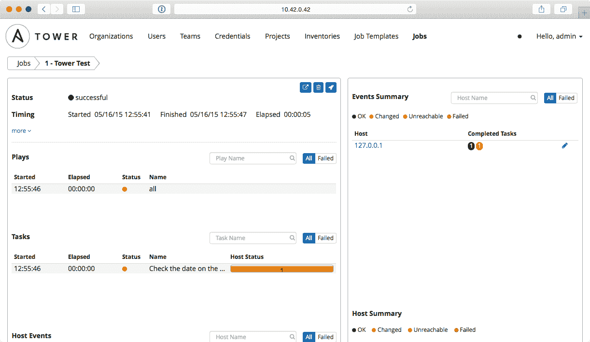

# 服务器提供

在上一章中，你学习了如何创建将承载我们应用程序的基础设施。正如我们所见，基础设施自动化是一个新兴的领域，我们使用了 Terraform 来实现它。Terraform 的问题在于它只能用于构建基础设施，但为了提供软件，我们需要其他工具。

在本章中，我们将深入探讨 Ansible，因为它与 Puppet 和 Chef 一起，是目前市场上最为流行的服务器提供工具。

本章将涵盖以下主要内容：

+   服务器提供软件

    +   Chef

    +   Puppet

    +   Ansible

+   Ansible

    +   Ansible 配置

    +   Ansible 变量

        +   变量

        +   远程事实

        +   模板

    +   流程控制

    +   Ansible 角色

+   Ansible Tower

正如你所见，这是一章非常广泛的内容，包含了许多示例，帮助你学习 Ansible 的最重要功能。

在阅读本章时，你需要注意的一点是，无法在单一章节中展示 Ansible 的所有功能。公平地说，掌握所有功能并达到熟练水平可能需要一本书的内容。正如你现在可以猜到的那样，当我需要处理 Ansible 时，第一件事就是打开官方文档，并将其与代码并排放置，这样我可以随时参考它，获取我之前没有接触过或已经很久没有使用过的功能和示例。

我们还将探讨 Ansible Tower 部分，它是一款用于在堡垒主机模式下运行 Ansible playbook 的软件，可以在你的基础设施内运行，而不是在工作站上运行。

# 服务器提供工具

如前所述，软件提供的选项很少。在本章中，你将学习如何使用 Chef 和 Ansible，重点介绍 Ansible，因为它在许多公司中广泛使用，而且比 Chef 更容易掌握。

市场上还有其他有效且优秀的解决方案，但我们将特别关注 Ansible，因为对我而言，它是所有工具中最容易学习和扩展的。

# Chef

Chef 是一款非常有趣的软件，它遵循堡垒主机原则，在我们的服务器上运行配置。堡垒主机是一台放置在私有网络中的服务器，它能够直接或通过代理访问我们的服务器，从而执行必要的操作，将它们设置为所需的状态。这是一个不容忽视的选项，因为服务器提供过程中的最大挑战之一是管理密钥和授权，例如 Ansible 就需要通过第三方软件（如 Red Hat 的 Ansible Tower）来改进这方面的功能。

Chef 使用食谱来配置服务器的各个部分。食谱基本上是一组声明性指令，定义了为了让服务器达到所需状态需要执行的操作。例如，看看这个：

```
execute "update-upgrade" do
   command "apt-get update && apt-get upgrade -y"
   action :run
end

package "apache2" do
   action :install
end
```

上面的代码将升级我们的系统，然后安装 Apache2 网络服务器。

一旦完成此食谱，它将从工作站上传到 Chef 服务器，关键点是：在 Chef 中，有三个角色：

+   服务器

+   工作站

+   节点

服务器是存放食谱和配置的地方。在进行任何工作之前需要先安装，安装说明可以在 [`docs.chef.io/install_server.html`](https://docs.chef.io/install_server.html) 上找到。

Chef 服务器有三种模式：

+   **企业版**：这可以安装在你的基础设施内部，并且需要许可证，所以你需要根据管理的节点数量支付费用。

+   **开源**：这也可以在你的基础设施中安装，但**没有任何支持**。它是免费的，必须由你公司配置和维护。它也是企业版 Chef 的简化版本。

+   **托管**：Chef 服务器托管在第三方硬件上，你无需担心其维护和升级。根据你公司设置的不同，这可能不是一个可选项。

节点是目标主机。每个节点都在 Chef 服务器上注册，并有一个运行列表：一旦执行 `chef-client` 命令，这个列表上的食谱将在主机上运行。

工作站是用来配置和上传 Chef 服务器的计算机。此计算机使用一个名为 knife 的软件，可以在 Chef 服务器上执行所有操作：

+   配置角色

+   根据角色和其他参数查找虚拟机

+   配置运行列表

+   管理机密

Knife 使用加密密钥与 Chef 服务器进行通信，因此所有通信都是以受信方式进行的。

现在，如果我们想把一切都形象化，看起来会像下面的图示：


如你所见，尽管设置相当复杂（你需要设置几个软件组件），但也有明显的好处：我们的 Chef 服务器位于基础设施的防火墙后，在隔离区中，但它通过 CLI 工具进行管理，因此我们所有的机密和配置都安全地保存在我们的基础设施内。

Chef 有一个陡峭的学习曲线，一旦我们度过了初学阶段，就会变得非常熟悉，添加新功能和使用 Ruby 强大的功能扩展 DSL 变得非常容易，且界面设计非常合理。

# Puppet

Puppet 已经存在一段时间，并且在 DevOps 世界中被广泛使用。Puppet 有两个版本：

+   开源

+   企业版

开源版本原封不动地提供，提供了一套完整的功能，可以让你完全自动化基础设施的配置管理。

企业版除了支持外，还附带一套扩展的功能，使得你公司中的工程师工作更加轻松。

和 Chef 一样，Puppet 也遵循堡垒主机架构：服务器安装在你的基础设施中的非军事区内，节点（你的服务器）通过 Puppet 代理执行指定的任务，以达到所需状态。

Chef 和 Puppet 之间的主要区别在于，Puppet 是声明性的，而 Chef 更像是命令式的：

+   在 Puppet 中，你指定希望服务器处于什么状态，Puppet 会负责保持它们在该状态。

+   在 Chef 中，你声明一系列步骤，旨在将服务器引导到所需的状态。

也就是说，Chef 还允许你声明守卫条件，这些是执行步骤的前提条件。

根据我的经验，我发现来自 DevOps 背景的人更容易接受 Puppet，因为它类似于他们多年来做过的事情，而编写 Chef 的食谱更像是软件开发。

# Ansible

Ansible 是我们将在本书其余部分开发内容时使用的工具。依我看，它是最容易学习和扩展的。它也容易理解，并提供了一个功能非常全面的开源版本，涵盖了 Ansible 的所有特性。你还可以购买 Ansible Tower（或类似工具）的许可证，以便在堡垒主机配置下运行 Ansible Playbooks，就像 Chef 或 Puppet 一样。

Ansible 基本上是一个**领域特定语言**（**DSL**），用于在清单中定义的远程主机上执行操作。

Ansible 通过通过 SSH 在目标服务器上运行 playbooks 来工作，因此与 Chef 或 Puppet 不同，我们不需要在远程主机上安装任何东西；只需能够通过 SSH 连接即可。Playbook 基本上是一个**另一种标记语言**（**YAML**），它包含一系列指令，用于将服务器引导到所需状态，就像我们执行一个 Bash 脚本一样。Playbook 看起来像这样：

```
---
- hosts: webservers
 vars:
 http_port: 80
 max_clients: 200
 remote_user: root
 tasks:
 - name: ensure apache is at the latest version
 yum: name=httpd state=latest
 - name: write the apache config file
 template: src=/srv/httpd.j2 dest=/etc/httpd.conf
 notify:
 - restart apache
 - name: ensure apache is running (and enable it at boot)
 service: name=httpd state=started enabled=yes
 handlers:
 - name: restart apache
 service: name=httpd state=restarted
```

通过阅读文件，你会理解如何轻松直观地明白 Playbook 正在做什么。

正如你所看到的，在第二行中，我们指定了希望在名为`webservers`的主机上运行此 Playbook。这个定义也可以在 Ansible 的另一部分：清单中进行。Ansible 清单基本上是一个包含你基础设施中主机列表的文件，如下所示：

```
[webservers]
host1
host2

[dbservers]
192.168.0.[1:3]
```

这个文件非常简洁，但也可能变得相当复杂：

+   方括号中的名称是组名。

+   组包含可以用生成器定义的主机，或者它们可以只是列出。

+   组可以拥有特定于它们的配置，甚至覆盖变量。

在前面的例子中，我们有两个组：`webservers` 和 `dbservers`。

Web 服务器只有两个主机：

+   `Host1`

+   `Host2`

Dbservers 使用生成器，我们有三个主机：

+   `192.168.0.1`

+   `192.168.0.2`

+   `192.168.0.3`

如前所述，我们还可以在清单中定义变量。这些变量可以作用于组和主机。让我们看看以下清单：

```
[dbservers]
192.168.0.[1:3]

[webservers]
host1 role=master
host2

[dbservers:vars]
timezone=utc
```

正如你所看到的，我们有两个变量：

+   `timezone`：这适用于 `dbservers` 组中的所有主机。

+   `role`：这适用于 `webservers`*组*中的主机`host1`。

这个变量可以在 `playbooks` 中使用，以便为特定主机提供特定的配置，正如我们稍后在本章中看到的那样。

组也可以组合成更大的组：

```
[dbservers]
192.168.0.[1:3]

[webservers]
host1
host2

[mongoservers]
10.0.0.1
10.0.0.2

[dataservers:child]
mongoservers
dbservers
```

在前面的清单中，我们可以找到以下内容：

+   `dbservers`

+   `mongoservers`

+   `webservers`

+   `dataservers`

+   `all`

+   `ungrouped`

尽管我们没有指定，但 Ansible 总是有两个默认的组，分别是 `all` 和 `ungrouped`，这两个组名称具有自描述性：`all` 是清单中的所有主机，`ungrouped` 是未在任何组中指定的所有主机。

如前所述，Ansible 不遵循像 Chef 或 Puppet 那样的堡垒主机架构，而是遵循客户端/服务器架构：我们的主机需要能够到达目标主机（清单中的主机）才能工作。

这可能会根据您的基础设施架构带来不便，但可以通过使用 Ansible Tower 或 Rundeck 从您的隔离区内执行 Ansible playbooks 来解决。

在本章中，我们将使用 Ansible 与 Terraform 结合构建真实的生产级示例，以便更好地理解这些工具的实际应用。

# Ansible

在本节中，我们将迈出使用 Ansible 进行更全面示例的第一步。现在，我们将安装和配置 NGINX，这是一个非常流行的 Web 服务器，以便展示 Ansible 的主要概念。

首先，我们将使用 Google Cloud Platform 创建一个虚拟机，并为其分配一个静态 IP，以便我们可以从清单中进行定位。我们将使用 Terraform 来完成这个操作。首先，我们来看一下我们的资源文件：

```
provider "google" {
  credentials = "${file("account.json")}"
  project = "${var.project_name}"
  region = "${var.default_region}"
}

resource "google_compute_instance"
"nginx" {
  name = "nginx"
  machine_type = "n1-standard-1"
  zone = "europe-west1-b"
  disk {
   image = "ubuntu-os-cloud/ubuntu-1704-zesty-v20170413"
  }
  network_interface {
    network = "default"
    access_config {
      nat_ip = "${google_compute_address.nginx-ip.address}"
    }
  }
}

resource "google_compute_address" "nginx-ip" {
  name = "nginx-ip"
}
```

现在，我们来看一下我们的 vars 文件：

```
variable "project_name" {
  type = "string"
  default = "implementing-modern-devops"
}

variable "default_region" {
  type = "string"
  default = "europe-west1"
}
```

在本例中，我们将重用前一章节的项目，因为一旦完成，我们可以方便地关闭所有内容。现在，我们运行我们的计划，看看将要创建哪些资源：

```
+ google_compute_address.nginx-ip
 address: "<computed>"
 name: "nginx-ip"
 self_link: "<computed>"

+ google_compute_instance.nginx
 can_ip_forward: "false"
 disk.#: "1"
 disk.0.auto_delete: "true"
 disk.0.image: "ubuntu-os-cloud/ubuntu-1704-zesty-v20170413"
 machine_type: "n1-standard-1"
 metadata_fingerprint: "<computed>"
 name: "nginx"
 network_interface.#: "1"
 network_interface.0.access_config.#: "1"
 network_interface.0.access_config.0.assigned_nat_ip: "<computed>"
 network_interface.0.access_config.0.nat_ip: "<computed>"
 network_interface.0.address: "<computed>"
 network_interface.0.name: "<computed>"
 network_interface.0.network: "default"
 self_link: "<computed>"
 tags_fingerprint: "<computed>"
 zone: "europe-west1-b"

Plan: 2 to add, 0 to change, 0 to destroy.
```

到目前为止，一切看起来都正确。我们正在创建两个资源：

+   静态 IP

+   虚拟机

现在，我们可以应用我们的基础设施：

```
google_compute_address.nginx-ip: Creating...
 address: "" => "<computed>"
 name: "" => "nginx-ip"
 self_link: "" => "<computed>"
google_compute_address.nginx-ip: Still creating... (10s elapsed)
google_compute_address.nginx-ip: Creation complete
google_compute_instance.nginx: Creating...
 can_ip_forward: "" => "false"
 disk.#: "" => "1"
 disk.0.auto_delete: "" => "true"
 disk.0.image: "" => "ubuntu-os-cloud/ubuntu-1704-zesty-v20170413"
 machine_type: "" => "n1-standard-1"
 metadata_fingerprint: "" => "<computed>"
 name: "" => "nginx"
 network_interface.#: "" => "1"
 network_interface.0.access_config.#: "" => "1"
 network_interface.0.access_config.0.assigned_nat_ip: "" => "<computed>"
 network_interface.0.access_config.0.nat_ip: "" => "35.187.81.127"
 network_interface.0.address: "" => "<computed>"
 network_interface.0.name: "" => "<computed>"
 network_interface.0.network: "" => "default"
 self_link: "" => "<computed>"
 tags_fingerprint: "" => "<computed>"
 zone: "" => "europe-west1-b"
google_compute_instance.nginx: Still creating... (10s elapsed)
google_compute_instance.nginx: Still creating... (20s elapsed)
google_compute_instance.nginx: Creation complete

Apply complete! Resources: 2 added, 0 changed, 0 destroyed.
```

一切按预期工作。如果我们检查 Google Cloud Platform，我们可以看到我们的虚拟机已创建并关联了一个公共 IP：


在这种情况下，关联的公共 IP 是 `35.187.81.127`。重要的是验证我们是否可以通过 SSH 访问该服务器。为此，只需点击实例行右侧的 SSH 按钮，它应该会打开一个带有终端访问权限的 Cloud Console 窗口。

如果 SSH 访问失败，您需要在防火墙中为端口`22`添加一个入站允许规则。以这个例子为例，允许任何 IP 访问任何端口，但在您的实际基础设施中请不要这么做，因为这会带来安全隐患。

一旦一切启动并运行，就可以开始使用 Ansible。首先，我们将创建我们的清单文件：

```
[nginx-servers]
35.187.81.127
```

这非常简单：一个包含我们公有 IP 地址的组，该组连接到我们的虚拟机。将文件保存为 `inventory`，并放置在一个新的文件夹中，例如命名为 `ansible-nginx`。创建好 inventory 后，我们需要验证所有主机是否可达。Ansible 为此提供了一个工具：

```
ansible -i inventory all -m ping
```

如果你执行上述命令，Ansible 将 `ping`（实际上，它并没有使用 ping 命令，而是尝试发起与服务器的连接）所有在参数 `-i` 中指定的 inventory 主机。如果你将所有内容替换为一个组的名称，Ansible 只会尝试访问该组中的主机。

让我们看看命令的输出：

```
35.187.81.127 | UNREACHABLE! => {
 "changed": false,
 "msg": "Failed to connect to the host via ssh: Permission denied (publickey).\r\n",
 "unreachable": true
}
```

我们在连接远程主机时遇到了问题，原因是我们没有任何密钥可以供主机验证以确认我们的身份。这是预期的，因为我们没有进行配置，但现在，我们将通过创建一个密钥对并使用 Google Cloud SDK 安装到远程主机来解决这个问题：

```
gcloud compute ssh nginx
```

这个命令将做三件事：

+   生成一个新的密钥对。

+   在我们的远程虚拟机上安装密钥对。

+   在 GCP 中打开我们的虚拟机 shell。

生成的新密钥可以在 `~/.ssh/` 目录下找到，名称为 `google_compute_engine` 和 `google_compute_engine.pub`（私钥和公钥）。

一旦命令执行完成，我们的 shell 应该像这样：


现在我们有一个连接到虚拟机的终端，并且可以执行命令。`gcloud` 默认配置了一个用户；在我的案例中是 `davidgonzalez`，该用户可以在不输入密码的情况下使用 `sudo`。在这种情况下，我们将以 root 用户身份执行 playbook，因此我们需要能够以 root 用户身份登录虚拟机。将 `~/.ssh/authorized_keys` 文件复制到 `/root/.ssh/authorized_keys` 中，这样我们就可以做到这一点。因此，我们已经将之前生成的公钥复制到了 root 用户的授权密钥集中。

一般来说，应尽量避免使用 root 权限，但在这种情况下，为了方便，我们将以 root 用户身份执行 playbook。

为了让 Ansible 能够使用该密钥，我们需要将它添加到服务器上的守护进程中：

```
ssh-add ~/.ssh/google_compute_engine
```

这个命令应该输出成功信息，说明身份验证已添加。

现在我们可以再次运行我们的 pin 命令：

```
ansible -i inventory all -m ping
```

输出应该会有很大不同：

```
35.187.81.127 | SUCCESS => {
 "changed": false,
 "ping": "pong"
}
```

这意味着现在 Ansible 可以访问我们的服务器；因此，它将能够在该服务器上执行 playbook。

现在是时候开始编写我们的第一个 `ansible` playbook 了。在同一个文件夹 `ansible-nginx` 中，创建一个名为 `tasks.yml` 的文件，内容如下：

```
---
- hosts: all
 user: root
 tasks:
 - name: Update sources
 apt:
 update_cache: yes
 - name: Upgrade all packages
 apt:
 upgrade: dist
```

这很容易理解：

+   我们的 playbook 将影响所有主机。

+   运行 playbook 的用户将是 root。

+   然后我们将执行两个任务：

    +   更新 `apt cache`。

    +   升级所有软件包。

一旦我们拥有了两个文件（inventory 和 playbook），我们可以运行以下命令：

```
ansible-playbook -i inventory tasks.yml
```

我们应该生成类似如下的输出：


在本章中，我们将运行几个 playbook，所以我建议你保持相同的虚拟机处于运行状态，并将它们全部执行，以节省时间和资源。Google Cloud Platform 的试用账户会为你提供足够的空间，可以在几天或几周内运行它们。

让我们解释一下输出：

+   首先，它指定了我们要在哪个组上执行 playbook。在这个例子中，我们指定了组为`all`。

+   然后，我们可以看到三个任务被执行。如你所见，描述与`tasks.yml`中指定的描述相匹配。这在理解你的 playbook 输出时非常有用，尤其是在它们失败时。

+   然后我们得到一个总结：

    +   执行了三个任务

    +   其中两个在服务器上产生了变化

    +   零个失败

简单有效。这是最接近在服务器上执行脚本的方式：一组指令，一个目标主机及其输出。

在 Ansible 中，动作被封装到模块中，而不是使用简单的 bash 指令。模块是 DSL 的一个组件，允许你执行特殊的操作。在之前的 playbook 中，apt 是一个包含在 Ansible 核心中的模块。有关它的文档可以在[`docs.ansible.com/ansible/apt_module.html`](http://docs.ansible.com/ansible/apt_module.html)找到。

让我们再看看我们使用`apt`模块的一个例子：

```
- name: Update sources
 apt:
 update_cache: yes
```

如你所猜测，这相当于以下内容：

```
apt-cache update
```

因此，在这种情况下，Ansible 提供了一个名为 command 的不同模块，允许我们在我们的清单主机上执行命令。请看下面的`yaml`：

```
- name: Update sources
 command: apt-cache update
```

这相当于之前的`yaml`，两者执行相同的操作：更新`apt-cache`。

一般来说，如果给定任务有模块可用，建议使用它，因为它比执行等效命令更好地处理（或至少能期望它处理）错误和输出。

现在，一旦我们的 playbook 成功执行，我们可以预期我们的系统已更新。你可以通过再次运行 playbook 来检查它：


现在你可以看到，只有一个任务在服务器上产生了变化（更新了 apt 源）。

# Ansible 配置

Ansible 的一个特点是能够为每个项目覆盖默认设置。为了实现这一点，我们只需在项目根目录创建一个名为`ansible.cfg`的文件，Ansible 会读取该文件并应用配置。

有大量可以配置的参数，所有这些参数都可以在官方文档中找到，网址是[`docs.ansible.com/ansible/intro_configuration.html`](http://docs.ansible.com/ansible/intro_configuration.html)。

如你所见，Ansible 的文档非常好，大多数时候，它能为你的问题提供答案。

让我们看看配置是如何帮助我们的。如果你还记得前面的例子，我们已经指定了`-i`标志，用于告诉 Ansible 库存文件的位置。Ansible 对此有默认值，即`/etc/ansible/hosts`。在我们的小项目中，库存文件与代码放在同一文件夹中，为了让 Ansible 知道这一点，我们需要创建一个如下内容的配置文件：

```
[defaults]
inventory = ./inventory
```

现在，我们使用以下命令再次运行我们的`playbook`：

```
ansible-playbook tasks.yml
```

我们没有指定主机列表，但 Ansible 在读取了`ansible.cfg`后知道库存文件可以位于`./inventory`。

Ansible 有一套配置优先级的层级结构：

+   `ANSIBLE_CONFIG` 环境变量

+   `ansible.cfg`

+   `.ansible.cfg`

+   `/etc/ansible/ansible.cfg`

因此，如果我们定义一个名为`ANSIBLE_CONFIG`的环境变量指向一个文件，Ansible 将从该位置读取配置文件，其他选项将被忽略。这在环境隔离时特别有用：我们的 CI 服务器可以在环境文件中定义自己的配置，而开发者则可以将`ansible.cfg`文件提交到源代码控制中，以便在团队中共享。

`ansible.cfg` 文件中可以指定几个部分。各个部分控制 Ansible 的不同方面，如连接。在某些情况下，我们可能需要为 `ssh` 添加特殊的参数，只需在 `ansible.cfg` 文件中添加以下几行：

```
[ssh_connection]
ssh_args=<your args here>
```

# Ansible 变量、远程事实和模板

变量和模板是 Ansible 中非常重要的一部分。它们允许我们覆盖配置中的值（如服务器和剧本），使得我们可以编写通用的剧本，通过少量修改即可在不同的配置中重用。通过模板，我们可以从主机渲染配置文件，这样我们就可以利用 Ansible 来管理远程服务器的配置，几乎不需要任何额外的工作。它还可以用来为不同的主机生成和安装 SSL 证书，且对用户透明。

它们（变量和模板）都使用一个名为 Jinja2 的模板引擎，它允许在我们的配置中嵌入逻辑和插值。

一般来说，有几种方式来定义变量，但我们只会探讨最常见的几种（根据我的标准），否则我们需要几个章节来详细记录这些方法。如果你想深入了解定义变量的不同方式，官方文档提供了一个相当全面的指南，地址是 [`docs.ansible.com/ansible/playbooks_variables.html`](http://docs.ansible.com/ansible/playbooks_variables.html)。

# Ansible 变量

变量是最简单的自定义选项。通过变量，我们可以定义将在剧本中替换的值。让我们看看以下的剧本：

```
---
- hosts: all
  user: root
  tasks:
  - debug:
    msg: "Hello {{ myName }}! I am {{ inventory_hostname }}"
```

用之前的代码片段替换 `tasks.yml` 的内容。我们的任务中有两个新的符号。此外，我们的任务是新的：debug 用于在执行 playbook 时将变量的值输出到终端。让我们看看执行情况（我们将使用与之前示例相同的配置）：

```
ansible-playbook -i inventory tasks.yml
```

它失败了：


失败的原因可以从信息中看到：我们定义了一个名为 `name` 的变量，但没有为其指定值。如果存在无法插值的值，Ansible 将失败并中止任务的执行。

这里还有一个有趣的信息：Ansible 给了你一个参数，允许你仅在那些未成功的主机上重试 playbook。如果我们只想在失败的主机上重试 playbook，可以运行以下命令：

```
ansible-playbook -i inventory tasks.yml --limit @/Users/dgonzalez/code/ansible-variables/tasks.retry
```

新的参数 `tasks.retry` 是一个包含可重新运行失败主机列表的文件。

回到我们缺失的变量，我们需要定义一个名为 `myName` 的变量。定义变量的方式有几种；第一种是在命令行中定义：

```
ansible-playbook -i inventory tasks.yml -e myName=David
```

你可以看到，现在 playbook 的输出看起来更好了：


如你所见，变量已经被插值，我们可以看到信息 `Hello David! I am 35.187.81.127`。

定义变量的第二种方式是通过库存，如我们之前所见：

```
[nginx-servers]
35.187.81.127 myName=DavidInventory
```

如果我们修改库存以匹配前面的代码片段，那么变量的值将是 `DavidInventory`，我们就不需要在命令行中传递值：

```
ansible-playbook -i inventory tasks.yml
```

这将输出信息 `Hello DavidInventory! I am 35.187.81.127`。

在 Ansible 中定义变量的第三种方式是在 playbook 本身中定义。请看下面的 playbook：

```
---
- hosts: all
 vars:
 myName: David
 user: root
 tasks:
 - debug:
 msg: "Hello {{ myName }}! I am {{ inventory_hostname }}"
```

听起来很简单，一旦你在 playbook 的 `vars` 部分定义了变量，它就会变得可用；因此，其他地方不需要指定值。

定义变量的第四种方式是通过文件。Ansible 旨在成为一个自文档化的组件，便于没有太多经验的人理解。Ansible 让理解 playbook 任务变得更容易的一个方法就是可以将每一段配置写入文件。变量也不例外，因此 Ansible 允许你在文件或 playbook 中定义变量。

我们从文件开始。在你工作的同一文件夹中（即包含 playbook 和库存的文件夹）创建一个名为 `vars.yml` 的文件，并添加以下内容：

```
myName: DavidFromFile
yourName: ReaderFromFile
```

现在我们可以运行以下命令来使用变量文件：

```
ansible-playbook -i inventory playbook.yml -e @vars.yml
```

如果你查看输出，它将与之前的输出相同。

在这种情况下，我们定义了一个新的变量（`yourName`），但我们并没有使用它，这也没关系。我只是想向你展示，如果存在未绑定的插值，Ansible 会报错，但如果有未使用的变量，它是不会抱怨的。

在这个例子中，我们通过命令行在剧本中包含了`vars.yml`，并且在文件名前面加上了`@`符号，然而在 Ansible 中还有另一种使用变量文件的方式：从剧本内部包含它们。让我们来看一下如何操作：

```
---
- hosts: all
 user: root
 tasks:
 - name: Include vars
 include_vars:
 file: vars.yml
 - debug:
 msg: "Hello {{ myName }}! I am {{ inventory_hostname }}"
```

在这个例子中，我们在我们的剧本中使用了`include_vars`模块。现在，使用以下命令执行剧本：

```
ansible-playbook -i inventory tasks.yml
```

你将得到以下输出：


正如你所看到的，有一个额外的任务，它接受一个文件并将变量注入到上下文中。

这个模块非常灵活，有多种方式可以将变量文件包含到我们的剧本中。我们使用的是最直接的一种，但你可以在官方文档中查看其他选项：[`docs.ansible.com/ansible/include_vars_module.html`](http://docs.ansible.com/ansible/include_vars_module.html)。

另一种将变量文件包含到剧本中的方法是使用剧本中的`vars_files`指令：

```
---
- hosts: all
 user: root
 vars_files:
 - vars.yml
 tasks:
 - debug:
 msg: "Hello {{ myName }}! I am {{ inventory_hostname }}"
```

这将获取`vars.yml`文件，并将所有定义的变量注入到上下文中，使它们可以在后续使用。

正如你所看到的，Ansible 在定义变量方面非常灵活。

在 Ansible 中，还有一种有趣的设置变量的方式，它帮助我们进一步自定义剧本：`set_fact`。设置事实允许我们在剧本中动态地设置变量。`set_fact` 可以与另一个有趣的指令`register`结合使用。让我们看一个例子：

```
---
- hosts: all
 user: root
 tasks:
 - name: list configuration folder
 command: ls /app/config/
 register: contents
 - set_fact:
 is_config_empty: contents.stdout == ""
 - name: check if folder is empty
 debug: msg="config folder is empty"
 when: is_config_empty
 - name: installing configuration
 command: <your command here>
 when: is_config_empty
```

我们在这里所做的基本上是，如果我们应用的配置文件夹为空（假设的配置文件夹），就将变量设置为`true`，以便只有在它不存在时才会重新生成。这是通过使用`when`指令来实现的，它允许我们根据条件执行指令。我们将在本章后面回到这个话题。

我们已经介绍了最常见的定义变量的方法，但还有一个问题待解答：不同定义变量方法的优先级是什么？

这是我在使用 playbook 时必须自问的问题，实际上，最终你只会使用几种方法来创建变量，因此它的重要性并不像它应该有的那样高。在我个人的做法中，当不使用角色时，我倾向于创建一个包含变量的文件，如果我需要覆盖某个值，我会在命令行（或环境变量）中进行设置，这也是链条中优先级最高的地方。完整的变量优先级列表可以在[`docs.ansible.com/ansible/playbooks_variables.html#variable-precedence-where-should-i-put-a-variable`](http://docs.ansible.com/ansible/playbooks_variables.html#variable-precedence-where-should-i-put-a-variable)找到。

# Ansible 远程事实

Ansible 中的远程事实是一种通过显式配置文件或脚本来指定远程主机配置的方式，脚本返回有关服务器的数据。一般来说，这个功能对于执行诸如维护、设置专门标记主机为不在池中的标志等操作非常有用，以确保我们的 playbook 对这些主机没有任何影响。

看一下以下命令（假设之前示例中的清单文件已经在文件夹中，且虚拟机正在 Google Cloud Platform 上运行）：

```
ansible all -m setup -i inventory --user=root
```

这将输出大量数据（JSON 格式的数据）。这些数据包含了关于远程主机的所有已知事实，例如 CPU 类型、机器 ID、网络接口、内核版本等。它们可以在我们的 playbook 中使用，但也可以扩展，添加更多由远程主机控制的数据，而无需任何本地配置。

为了设置自定义的远程事实，我们有几个选项，但最终，自定义事实默认是通过 JSON 文件在`/etc/ansible/facts.d/`下定义的。也可以在同一个文件夹中创建一个可执行文件（脚本），这样 Ansible 会执行它并将输出作为事实，添加到事实范围内。来看一下下面的文件：

```
{
 "my_name": "David Gonzalez"
 }
```

将它放入远程主机（前面所有示例中使用的主机）中，并在`/etc/ansible/facts.d/example.facts`中创建一个包含之前内容的文件*。

完成后，运行以下命令：

```
ansible all -m setup -i inventory --user=root | grep -B 3 -A 3 my_name
```

它看起来几乎像是魔法一样，但现在你的命令输出应该包括你之前创建的事实：

```
 },
 "ansible_local": {
 "example": {
 "my_name": "David Gonzalez"
 }
 },
 "ansible_lsb": {
```

现在它们可以在你的 playbook 中通过`ansible_local`变量使用，例如，访问`my_name`*：

```
---
- hosts: all
 user: root
 tasks:
 - name: Gather my_name fact.
 debug: msg="{{ ansible_local.example.my_name }}"
```

如前所述，Ansible 还可以从放置在事实路径中的脚本中收集事实。这个脚本应该有`x`标志，表示它是可执行的，并且应该有`.fact`扩展名。让我们来看一个我觉得非常有用的有趣技巧。当我尝试诊断我们系统中的故障时，我首先检查的就是 CPU 使用率。大多数时候，我们的系统都是高度可观测的（已经在监控中），因此很容易检查 CPU 负载，但有时候，监控可能并未部署。

首先，进入我们在前面例子中使用的服务器，并在 `/etc/ansible/facts.d/cpuload.fact` 路径下创建一个文件，内容如下：

```
#!/bin/bash
CPU_LOAD=`grep 'cpu ' /proc/stat | awk '{usage=($2+$4)*100/($2+$4+$5)} END {print usage "%"}'`
echo { \"cpu_load\": \"$CPU_LOAD\"}
```

这是一个简单的脚本，它将输出包含系统 CPU 负载信息的 JSON 格式数据。文件创建后，给它执行权限：

`chmod u+x /etc/ansible/facts.d/cpuload.fact`

完成了。在断开 SSH 会话之前，确保通过执行脚本来验证它是否按预期工作：

```
/etc/ansible/facts.d/cpuload.fact
```

这应该输出类似以下内容：

```
{ "cpu_load": "0.0509883%"}
```

现在是时候测试我们编写的事实了。我们将创建一个 playbook，获取 CPU 负载并通过调试消息将其输出到终端。内容如下：

```
- hosts: all
 user: root
 tasks:
 - name: Get CPU load
 debug: msg="The CPU load for {{ ansible_hostname }} is {{ ansible_local.cpuload.cpu_load }}"
```

运行之前的 playbook：

```
ansible-playbook -i inventory tasks.yml
```

你应该会得到如下类似的输出：


现在，我们有了一个基础工具，可以通过一个简单的命令检查服务器上的 CPU 负载，利用主机组来管理 Ansible。

有一件事我们还没解释，就是 Ansible 在每个 playbook 中输出的第一个任务：收集事实。

这个任务获取我们在本节中提到的所有事实，并为 playbook 执行创建上下文，因此在这种情况下，我们得到的 CPU 负载是执行该任务时收集到的 CPU 负载。

# Ansible 模板

模板是 Ansible 的另一项强大工具。它们允许我们渲染配置文件、应用程序属性和任何可以存储在人类可读文件中的内容。

模板高度依赖变量和模板引擎 Jinja2，Ansible 使用 Jinja2 渲染模板。首先，我们将使用一个简单的 playbook 在服务器上安装 `nginx`：

```
---
- hosts: all
 user: root
 tasks:
 - name: Update sources
 apt:
 update_cache: yes
 - name: Upgrade all packages
 apt:
 upgrade: dist
 - name: Install nginx
 apt:
 name: nginx
 state: present
```

正如你所看到的，这非常简单：

+   更新 `apt 缓存`

+   升级系统

+   安装 `nginx`

现在，只需运行之前创建的 VM 上的 playbook：

`ansible-playbook -i inventory tasks.yaml`

当 playbook 执行完成后，你应该在远程服务器上看到 `nginx` 正在运行。为了验证这一点，只需打开浏览器，并使用你的 VM 的 IP 地址作为 URL。你应该能看到 `nginx` 的欢迎页面。

现在，我们将创建一个包含 `nginx` 配置的模板，在这个模板中我们可以轻松地添加或移除服务器。请在当前目录（即 playbook 所在的目录）下创建一个名为 `nginx-servers` 的文件夹，并添加一个名为 `nginx.yml` 的文件，内容如下：

```
---
- hosts: all
 user: root
 vars_files:
 - vars.yml
 tasks:
 - name: Update sources
 apt:
 update_cache: yes
 - name: Upgrade all packages
 apt:
 upgrade: dist
 - name: Install nginx
 apt:
 name: nginx
 state: present
 - template:
 src: nginx-servers/nginx-one.conf.j2
 dest: /etc/nginx/sites-enabled/default
 owner: root
 - service:
 name: nginx
 state: reloaded
```

让我们稍微解释一下这个文件：

+   系统通过 `apt` 进行升级。

+   同样使用 `apt` 安装，`nginx` 被成功安装。请注意，Ansible 使用声明式方法来安装软件包：你声明软件包的名称以及执行 playbook 后软件包的目标状态。

+   Playbook 会从名为 `nginx-one.conf.j2` 的模板渲染虚拟服务器的 `nginx` 配置。我们稍后会详细讲解这一部分。

+   Playbook 会重新加载 `nginx` 服务，使新配置生效。

在前面的 playbook 中我们缺少了几个模块。第一个模块是名为 `nginx-one.conf.j2` 的文件。这个文件是一个模板，用于渲染服务器中虚拟主机的 `nginx` 配置。让我们来看一下该文件的内容：

```
server {
   listen {{ server_one_port }} default_server;
   index index.html;
}
```

创建一个名为 `sites-enabled` 的文件夹，并将 `nginx-one.conf.j2` 文件添加到其中，内容如前所述。这个文件是一个标准的 `nginx` 服务器块，但有一个特殊之处：我们将 *server_one_port* 作为端口的占位符，以便控制 `nginx` 虚拟主机暴露的端口。这对我们来说很熟悉：我们正在使用变量来渲染模板。

第二个模块是名为 `vars.yml ()` 的文件，内容如下：

```
server_one_port: 3000
```

这非常简单：它只是定义了渲染之前模板所需的变量。使用模板时需要注意的一点是，模板中的所有变量都可以在上下文中访问，从远程服务器收集的事实到各个地方定义的变量。

一旦我们把所有东西准备好（前面提到的两个文件、前面的 playbook 和之前示例中的清单），我们就可以像往常一样运行 playbook，并验证一切是否按预期工作：

```
ansible-playbook -i inventory nginx.yml
```

如果一切按预期工作，你应该在 Google Cloud Platform 上的虚拟机中拥有一个完全功能的 `nginx` 服务器（提供默认页面），并且运行在 `3000` 端口。

Google Cloud Platform 默认启用拒绝策略以增强安全性，因此你可能需要调整防火墙设置，以允许某些端口的入站流量。

# 流程控制

在 Ansible 中，可以使用流程控制语句，例如使用变量作为输入的循环或条件语句。这可以用来对某些数据集重复执行任务，或者在未满足某些条件时避免执行某些任务：例如，我们可能希望根据服务器的底层系统使用不同的命令。

在之前的示例中，我们已经看过使用 `when` 子句的条件语句，但让我们再解释一下：

```
---
- hosts: all
 user: root
 tasks:
 - command: /bin/false
 register: result
 ignore_errors: True

 - debug: msg="fail!"
 when: result|failed

 - debug: msg="success!"
 when: result|succeeded
```

上述代码非常易读：执行一个命令（忽略可能出现的错误，以便我们的 playbook 继续执行），并注册一个名为 result 的变量。接下来，我们有两个调试任务：

+   第一个技巧只有在 `/bin/false` 命令失败时才会被执行。

+   第二个技巧只有在 `/bin/false` 命令成功执行后才会被执行。

在这个 playbook 中，我们使用了两个新技巧：

+   `ignore_errors`：使用这个子句时，如果任务失败，playbook 将继续执行后续任务。如果我们想测试系统中的假设，比如某些文件是否存在或某个网络接口是否已配置，这个功能非常有用。

+   `管道符号 (|)`：这个符号叫做 `pipe`。它是一个 Jinja2 表达式，用于过滤值。在这个例子中，我们使用了 failed 和 succeeded 过滤器，根据命令的执行结果返回 true 或 false。Jinja2 提供了许多过滤器，可以像 Unix 管道一样处理数据。

另一种控制流结构是循环。让我们来看看循环是如何工作的：

```
---
- hosts: all
 user: root
 vars:
 names:
 - David
 - Ester
 - Elena
 tasks:
 - name: Greetings
 debug: msg="Greetings {{ item }}! live long and prosper."
 with_items: "{{ names }}"
```

在这里，我们使用了一个我们在解释变量时没有看到的新内容：它们可以具有诸如列表和字典这样的结构。在此示例中，我们定义了一个包含几个名字的列表，并为每个名字输出一条消息。现在是时候运行 playbook 了。将前面的内容保存到名为 `loops.yml` 的文件中，并执行以下命令：

```
ansible-playbook -i inventory loops.yml
```

我们假设库存与前面示例中使用的相同。完成后，你应该在终端中看到类似以下的输出：


也可以使用紧凑版本的声明来定义列表。请查看以下语句：

```
 names:
 - David
 - Ester
 - Elena
```

这可以重新定义如下：

```
names: ['David', 'Ester', 'Elena']
```

这完全是等效的。

在 Ansible 中也可以定义字典并将其用作变量。它们还可以作为可迭代元素使用，这使得我们能够为数据赋予结构：

```
---
- hosts: all
 user: root
 vars:
 namesAge:
 - name: David
 age: 33
 - name: Ester
 age: 31
 - name: Elena
 age: 1
 tasks:
 - name: Presentations
 debug: msg="My name is {{ item.name }} and I am {{ item.age }} years old."
 with_items: "{{ namesAge }}"
```

如果你熟悉软件开发，前面的代码片段应该能让你完全理解：一个结构化数据的列表（对象数组），它包含需要通过键来访问的信息。

在本书的其余部分，我们将使用 Ansible 中更高级的流程控制结构，并在过程中进行解释。如果你想进一步了解，可以参考以下链接：

+   条件语句 ([`docs.ansible.com/ansible/playbooks_conditionals.html`](http://docs.ansible.com/ansible/playbooks_conditionals.html))

+   循环 ([`docs.ansible.com/ansible/playbooks_loops.html`](http://docs.ansible.com/ansible/playbooks_loops.html))

+   Jinja2 模板 ([`docs.ansible.com/ansible/playbooks_templating.html`](http://docs.ansible.com/ansible/playbooks_templating.html))

# 角色

我们一直在编写一些 Ansible playbook，正如你可以想象的那样，其中有很多内容可以抽象成通用的工作单元。目前，凭借我们对 Ansible 的了解，我们能做的最好的事情就是为 playbook 和文件使用命名约定，以免将它们混淆，但 Ansible 提供了一种更好的方法：角色。

把角色想象成软件中常见的可重用功能模块：一组高度内聚的 playbook、变量和资源，它们共同协作，完成一个特定的目的。例如，如果我们在管理 `nginx`，将所有相关资源放在一个单独的模块（在此情况下是角色）中，可以提高代码的重用性和清晰度。

一个选择是使用 Ansible 特性来包含 playbook。虽然我们之前没有讲过，但使用 Ansible，可以包含带任务的 YAML 文件来创建依赖关系，如下所示：

```
---
- include: play-include.yml
- hosts: all
 user: root
 tasks:
 - debug: msg="I am the main playbook"
 - include: tasks-include.yml
```

让我们解释一下发生了什么。我们可以看到两个包含的文件：

+   第一个包含的是 Ansible 所谓的 play 包含。它本身就是一个功能完整的 playbook，作为模块被包含到另一个 playbook 中。

+   第二个包含的是 Ansible 所谓的任务包含。它只包含一组任务列表。

通过查看两个文件的内容，可以轻松地解释这一点。首先，查看 `play-include.yml` 的内容：

```
---
- hosts: all
 user: root
 tasks:
 - debug: msg="I am a play include"
```

其次，查看 `tasks-include.yml` 的内容：

```
---
- debug: msg="I am a task include"
- debug: msg="I am a task include again"
```

现在我们将执行之前的 playbooks，看看输出结果是什么。将第一个 playbook 的内容保存在一个名为 `tasks.yml` 的文件中，并使用与之前所有示例相同的清单。现在运行以下命令：

```
ansible-playbook -i inventory tasks.yml
```

执行完成后，让我们检查输出，应该与以下内容非常相似：


让我们来解释一下：

1.  play 包含（`play-include.yml`）通过输出其中的调试信息来执行。

1.  主 playbook 中的调试任务被执行。

1.  任务包含（`tasks-include.yml`）通过执行其中包含的两个调试信息来执行。

这并不复杂，但如果多尝试几次 playbooks，就会变得更容易。

尽管之前的示例能够生成一个非常干净且可重用的文件集合，但有一个更好的方法：使用角色。角色是独立的功能集，允许像其他软件组件一样，轻松进行维护。

根据之前的示例，我们可以使用三个角色重新编写它：

+   play 包含（`play-include.yml`）

+   主要任务（`tasks.yml`）

+   任务包含（`tasks-include.yml`）

为了开始创建角色，首先创建一个名为 `ansible-roles` 的新文件夹，并在其中创建一个名为 `roles` 的文件夹。之前没有提到的一点是，创建一组文件夹来存放 Ansible 资源是一个好习惯：任务文件夹存放任务，文件夹用于存储需要传输到远程主机的所有文件等等。一般来说，我同意这种设置，但为了示例的简单性，我们简化了配置。对于角色，这种设置是必须的。我们需要根据需要创建适当的文件夹。在这种情况下，由于我们只使用任务来演示角色的工作方式，我们将在每个角色内创建任务文件夹，因为如果不这样做，我们就无法执行角色中的任务。

在 **roles** 文件夹内，我们将创建另一个名为 `play-include` 的文件夹，它将是前面示例中 `play-include.yml` 的等效物，但以角色的形式呈现。

现在是时候创建我们的第一个角色 playbook 了：创建一个名为 `main.yml` 的文件，并将其放置在 `play-include/tasks/` 文件夹中。`main.yml` 文件的内容如下：

```
---
- debug: msg="I am a play include"
```

现在是时候添加第二个角色，名为 `main-tasks`，方法是创建一个名为 *roles* 的文件夹，并在 `roles/main-tasks/tasks` 文件夹中添加一个名为 `main.yml` 的文件：

```
---
- debug: msg="I am the main playbook"
```

我们的第三个也是最后一个角色叫做 `tasks-include`。像之前一样，创建文件夹（在 roles 文件夹内），并在 tasks 文件夹中添加一个名为 `main.yml` 的文件：

```
---
- debug: msg="I am a task include"
- debug: msg="I am a task include again"
```

就这样，你已经创建了三个可以在不同 Ansible 项目中重用的角色。现在是时候使用它们了。创建一个名为 `tasks.yml` 的文件，放在你项目的根文件夹中（在我的案例中是 `ansible-roles`），并添加以下内容：

```
---
- hosts: all
 user: root
 roles:
 - main-tasks
 - play-include
 - tasks-include
```

这是在添加了之前所有文件后，你的项目应该呈现的样子：


清单与之前示例中的相同（记住，推荐的是复用相同的虚拟机）。现在是时候运行我们的 playbook 了：

```
ansible-playbook -i inventory tasks.yml
```

这将生成类似以下的输出：


如果我们比较之前示例的输出，我们可以看到它几乎相同，唯一的区别是任务的说明，其中指示了任务来自哪个角色。

在角色中，我们还可以定义变量并访问全局作用域中定义的变量以及许多其他功能。正如之前所说，Ansible 足够庞大，完全可以写一本书，因此我们这里只是简单介绍了一些重要部分（根据我的标准）。如常，Ansible 的文档相当不错，如果你想深入了解角色，可以访问 [`docs.ansible.com/ansible-container/roles/index.html`](https://docs.ansible.com/ansible-container/roles/index.html) 查阅相关资料。

如果我能给你关于 Ansible 的一些建议，那就是你应该始终尝试使用角色。无论你的项目多大或多简单，你很快就会发现，角色所提供的隔离性和可重用性几乎不花成本，且非常有益。

# Ansible Tower

我们已经看到 Ansible 提供了许多非常有用的功能，这些功能对任何希望在 IT 部门自动化任务的 DevOps 工程师来说都非常重要。

使用 Ansible 时有一个设计挑战，那就是 playbooks 是从你自己的计算机运行到远程服务器的，如下图所示：


这可能是一个问题，因为正如你现在所了解的那样，Ansible 使用机密（ansible-vault secrets），并且可能涉及一些敏感信息，这些信息可能会被从工作站上拦截或窃取。在 Chef 或 Puppet 中没有这个问题，因为它们遵循堡垒主机方法，但这可能是一些公司选择 Ansible 时遇到的问题。

其中一个解决方案来自 Red Hat，名为 Ansible Tower。该软件安装在你的 IT 基础设施中（在本例中为 Google Cloud Platform），并提供一个 UI，操作方式类似于 CI 服务器，能够启用角色访问控制到 Ansible 剧本，并且添加了一个在普通 Ansible 中没有的安全层：机密信息保存在基础设施内的一个服务器（Ansible Tower）中，从未离开过该基础设施。

Ansible Tower 提供了 Ansible 中所有的功能，因此你不需要重写任何剧本；只需根据新的基础设施几何形状进行调整。

让我们来看一下以下的图示：


如你所见，现在我们的 Ansible 主机已经在我们的基础设施内部；因此，它可以通过网页界面进行操作，从而增强了我们 IT 操作的安全性。

Ansible Tower 还提供了一个 API，可以用来与我们的软件或 CI 服务器建立集成点。

Ansible Tower 由 Red Hat 授权，因此如果你想在公司中使用它，需要购买许可证。在撰写本文时，市场上还没有太多的替代品，而且现有的替代品在功能上不如 Ansible Tower。而且，它的 UI（如下一张截图所示）非常简洁，虽然这并不是最重要的，但也总是值得考虑的因素。



# 总结

在本章中，你了解了 Ansible 的主要功能，但显然，我们并没有覆盖所有的可能性，因为要掌握它们需要写好几本书。此外，还有一个需要注意的地方：DevOps 工具正在不断发展。

当你在 IT 世界的 DevOps 领域工作时，你始终需要随时准备学习新知识。

Ansible 最初是为了在云端（以及本地）完全配置虚拟机而创建的，但随着 Kubernetes 或 Docker Swarm 等现代工具逐渐占据市场份额，它正慢慢转向配置管理，将 Docker 整合到持续交付环境中的完整软件开发生命周期中。

在下一章中，你将学习更多关于 Kubernetes 和 Docker Swarm 的内容，因为它们是 DevOps 领域中的下一个重要趋势。特别是 Kubernetes，它是一个我认为将在未来几个月或几年内超越所有其他工具的编排工具，因为它提供了任何 IT 公司所需的所有资源，借助 Google 多年来在容器中运行软件的经验。

我认为，像 Docker 这样的容器引擎即将突破盈亏平衡点，成为全球主要软件公司所有软件组件和架构的常规工具。
