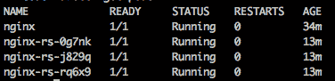

# Docker Swarm 和 Kubernetes - 集群基础设施

到目前为止，我们已经看到了 Docker 的强大，但我们还没有释放容器的全部潜力。你已经学会了如何在单一主机上运行容器，并利用本地资源，但没有办法将我们的硬件资源以一种可以将其统一作为一个大主机来使用的方式进行集群。这带来了许多好处，但最明显的一点是，我们为开发人员和运维工程师之间提供了一个中间件，它作为一种通用语言，这样我们就不需要去找运维团队请求指定大小的机器了。我们只需提供我们的服务定义，Docker 集群技术就会处理这些事情。

在本章中，我们将深入探讨如何在 Kubernetes 上部署和管理应用程序，但我们也会看看 Docker Swarm 是如何工作的。

人们通常倾向于将 Kubernetes 和 Docker Swarm 视为竞争对手，但根据我的经验，它们解决的是不同的问题：

+   **Kubernetes** 专注于先进的微服务拓扑，提供了多年的容器运行经验的全部潜力，源自 Google。

+   **Docker Swarm** 提供了最直接的集群能力，用于以非常简单的方式运行应用程序。

简而言之，Kubernetes 更适合于高级应用，而 Docker Swarm 是一种增强版的 Docker。

这有一个代价：管理 Kubernetes 集群可能非常困难，而管理 Docker Swarm 集群相对简单。

目前的 DevOps 生态系统中还存在其他集群技术，如 DC/OS 或 Nomad，但不幸的是，我们需要关注那些在我看来最适合 DevOps 的技术，特别是 Kubernetes，我认为它正在吞噬 DevOps 市场。

# 为什么要集群？

在第一章《*现实世界中的 DevOps*》中，你学习了组织对齐以及为什么在公司中调整角色以适应 DevOps 工具是如此重要。现在仅仅作为开发者或系统管理员已经不再足够；你现在需要成为一名全栈 DevOps 工程师，才能在任何项目中获得成功。全栈 DevOps 意味着你需要理解企业和组织中使用的技术。想一想，如果你成为了一名土木工程师，而不是 IT 工程师，你必须了解当地的规则（业务），以及用于建造道路和桥梁的工具的商业名称（技术），同时还要能够协调它们的建设（运维）。也许并不是每个工程师都需要知道所有的内容，但他们需要了解整个图景，以确保项目的成功。

回到容器和 DevOps，今天让每个人都能理解的概念是必不可少的。你需要确保项目中的所有工程师都能够追溯软件的整个过程，从构思（需求）到部署（运维），同时也要考虑可预测性，这样那些几乎不懂技术的业务人员也能围绕你所构建的产品规划策略。

实现这里描述的流的关键之一是可预测性，而实现可预测性的方法是对资源进行统一和可重复的使用。正如你之前学到的那样，像 Amazon Web Services 或 Google Cloud Platform 这样的云数据中心为我们提供了一个几乎无限的资源池，可以按照传统方式构建我们的系统：

+   定义虚拟机的大小

+   配置虚拟机

+   安装软件

+   维护它

或者，如果我们想绘制一个图表，以便更好地理解，它将类似于下图：


这里有几点需要考虑：

+   开发和运维之间的明确分离（这可能会根据公司规模有所不同）

+   由开发部门拥有的软件组件以及由运维部门拥有的部署和配置

+   一些服务器可能相对低效（**服务器 1**），负载非常低

这是 40 多年来软件开发的情景，如果我们在运行 Docker 容器时仍然是这种情况，但其中有几个问题：

+   如果在生产环境中**组件 3**出现问题，谁负责处理？

+   如果配置不匹配，当开发人员不应该看到生产环境中的情况时，谁来修复它？

+   **服务器 1**运行着一个可能一天只调用一次或两次的软件组件（比如工作站的认证服务器）；我们需要为它配置一个完整的虚拟机吗？

+   我们如何以透明的方式扩展我们的服务？

这些问题是可以解答的，但通常它们的答案往往来得太晚，而“隐藏的需求”只有在最糟糕的时刻才会显现出来：

+   服务发现

+   负载均衡

+   自愈基础设施

+   电路断开

在大学时期，所有不同学科的共同点之一是可重用性和可扩展性。你的软件应该具有可扩展性和可重用性，这样我们就可以创建组件库，形成工程的最佳实践（不仅仅是软件开发）：构建一次，到处使用。

在软件开发的运维部分，这一点一直被完全忽视，直到近年来才开始受到重视。如果你在一家公司担任 Java 开发人员，那么有一套被世界上每一个 Java 开发人员接受并使用的实践，这样你几乎可以毫无问题地快速上手（理论上是这样）。现在我们提出一个问题：如果所有的 Java 应用都遵循相同的实践和公共模式，为什么每家公司却以不同的方式部署它们？

在 IT 世界中，持续交付流水线几乎每个公司都需要，但我见过至少三种不同的组织方式，而且这些方式背后有着大量只有一两个人知道的定制“魔法”。

集群在这里拯救我们。让我们重新排列一下之前的图像：


在这种情况下，我们解决了我们的一些问题：

+   现在，开发和运维通过中间件连接起来：集群。

+   组件可以被复制（参考组件 1 和组件 1'），无需额外的硬件支持。

+   DevOps 工程师是两个团队（开发和运维）之间的纽带，让事情以更快的节奏推进。

+   整个系统的稳定性并不依赖于单一服务器（或组件），因为集群是以能够接受一定程度故障的方式构建的，这样可以通过降低性能或关闭较不关键的服务来容忍故障：为了保持公司财务流程的正常运行，牺牲邮件服务是可以接受的。

说到隐藏的需求。这就是我们需要决定使用哪种集群技术的地方，因为它们从不同角度处理服务发现、负载均衡和自动扩展。

# Docker Swarm

正如我们在前面的章节中看到的，Docker 是一个非常棒的工具，它遵循了运行作为容器打包的应用的最现代的架构原则。在这种情况下，Docker Swarm 仅运行 Docker 容器，忽略了其他目前不适用于生产环境的技术，比如 Rkt。甚至 Docker 本身也在某种程度上是新兴的，以至于一些公司在将其部署到生产系统时犹豫不决，因为市场上没有太多的专业知识，也存在许多关于安全性或 Docker 工作原理的疑虑。

**Docker Swarm** 是 Docker 的集群版，它以非常简单的方式解决了上一节中描述的问题：几乎所有你在 Docker 章节中学到的 Docker 命令都可以在 Docker Swarm 中使用，这样我们就可以在不直接管理硬件的情况下联邦化我们的硬件资源。只需将节点添加到资源池中，Swarm 就会管理它们，并充分利用我们构建纯容器系统的方式。

Docker Swarm 不是我们需要单独安装的东西，它是嵌入在 Docker 引擎中的一种模式，而不是一个独立的服务器。

Docker Swarm 正在快速发展，并且随着更多特性的加入，它正在带动 Docker 本身的发展，特别是在 Swarm 模式下使用时。最有趣的部分是，我们如何在没有额外操作的情况下利用我们的 Docker 知识，因为 Docker 引擎的 Swarm 模式会自动处理资源。

这也是一个问题：我们受限于 Docker API，而在 Kubernetes 中（稍后我们会详细讲解），我们不仅不受 Docker API 的限制，还可以扩展 Kubernetes API 来添加新对象，以满足我们的需求。

Docker Swarm 可以通过 `docker-compose` 进行操作（在一定程度上），它为基础设施即代码提供了一个不错的方案，但当我们的应用程序变得复杂时，它并不是特别全面。

在当前的 IT 市场中，Kubernetes 似乎是编排战斗的明显赢家，因此我们将重点关注它，但如果你想了解更多关于 Docker Swarm 的内容，可以参考官方文档，链接为 [`docs.docker.com/engine/swarm/`](https://docs.docker.com/engine/swarm/)。

# Kubernetes

Kubernetes 是容器编排的皇冠上的明珠。该产品本身由 Google 利用多年的生产容器运行经验进行改进。最初，它是一个内部系统，用于运行 Google 的服务，但在某个时刻，它成为了一个公开的项目。如今，它是一个由少数几家公司（如 Red Hat、Google 等）维护的开源项目，并被成千上万的公司使用。

在撰写本文时，Kubernetes 工程师的需求已经飙升，达到了公司愿意聘用那些虽然在该领域没有专业知识，但有良好学习态度的人来学习新技术的程度。

我认为 Kubernetes 之所以变得如此流行，主要有以下几个原因：

+   它解决了所有的部署问题

+   它自动化微服务的运维

+   它提供了一种通用的语言，将运维和开发连接起来，拥有一个清晰的接口

+   一旦设置完成，它非常容易操作

如今，许多公司希望缩短交付周期，而其中最大的一个问题就是**围绕交付过程积累的繁文缛节**。在一个市场中，五名熟练的工程师能够赶超传统银行，因为他们能够消除繁文缛节，简化交付流程，使得他们可以每天发布多次。

我的职业活动之一是参加各种会议（在都柏林的聚会、科克的 RebelCon、多个地方的 **Google Developer Groups** (**GDGs**)、Google IO Extended），我在所有的演讲中总是使用相同的话语：发布管理应该不再是一个重大的事件，让整个世界停顿三小时才能发布公司应用的新版本，而应该变成一个无痛的过程，可以随时回滚，从而通过提供管理故障发布的工具来减轻大部分压力。

这（不仅仅是这个，但主要是这个）就是 Kubernetes：一套工具和虚拟对象，它们为工程师提供了一个框架，可以用来简化所有与我们应用相关的操作：

+   扩展规模

+   缩减规模

+   零停机发布

+   金丝雀发布

+   回滚

+   密钥管理

Kubernetes 是以技术无关的方式构建的。Docker 是主要的容器引擎，但所有组件都设计为具有可互换性：一旦 Rkt 就绪，切换到 Rkt 会很容易，这给用户带来了有趣的视角，因为他们不会被某一种特定技术绑定，这样避免供应商锁定就变得更加容易。这同样适用于软件定义网络和其他 Kubernetes 组件。

一个痛点是设置和使用 Kubernetes 的陡峭学习曲线。

Kubernetes 非常复杂，熟练掌握其 API 和操作可能需要几周，甚至几个月的时间，但一旦你精通它，你所节省的时间完全能够弥补所有学习所花费的时间。

同样地，设置集群并不容易，甚至有公司开始将 Kubernetes 作为一种服务出售：它们负责维护集群，你负责使用它。

在我看来（再次强调，这是我的个人看法），Kubernetes 的一个最先进的提供商是 **Google 容器引擎** (**GKE**)，这也是我们将在本书中用于示例的提供商。

当我在规划本章内容时，我必须在两个选项之间做出决定：

+   设置集群

+   展示如何围绕 Kubernetes 构建应用程序

我考虑了几天，后来我意识到一件事：有大量的信息和大约半打方法来设置集群，而且没有一个是官方的。其中一些方法得到了官方 Kubernetes GitHub 仓库的支持，但在撰写本文时（截至撰写时），并没有官方的、首选的设置 Kubernetes 实例的方法，无论是在本地还是在云端。因此，选择的讲解集群部署的方法可能在本书上市时已经过时。以下是目前最常见的设置 Kubernetes 集群的方式：

+   **Kops**：这个名字代表 Kubernetes 操作，它是一个用于操作集群的命令行接口：通过几条命令创建、销毁和扩展集群。

+   **Kubeadm**：目前，Kubeadm 还处于 alpha 阶段，任何时候都可能会有破坏性更新集成到源代码中。它通过在每个我们希望加入集群的节点上执行简单的命令，简化了 Kubernetes 的安装，就像我们使用 Docker Swarm 时的做法一样。

+   **Tectonic**：Tectonic 是 CoreOS 推出的一个产品，用于在多个云服务提供商（如 AWS、Open Stack、Azure）上轻松安装 Kubernetes。它对于最多九个节点的集群是免费的，我强烈建议你至少尝试一下，以了解集群拓扑结构。

+   **Ansible**：Kubernetes 官方仓库还提供了一套 playbooks，用于在任何虚拟机提供商或裸机上安装 Kubernetes 集群。

所有这些选项都是从头开始搭建集群的有效方法，因为它们通过隐藏细节和全貌，自动化了 Kubernetes 架构的部分内容。如果你真的想了解 Kubernetes 的内部工作原理，我推荐 Kelsey Hightower 写的一本指南《Kubernetes the hard way》，它展示了如何围绕 Kubernetes 设置一切，从需要在节点间共享信息的 etcd 集群，到用于与 `kubectl`（Kubernetes 的远程控制工具）通信的证书。你可以在 [`github.com/kelseyhightower/kubernetes-the-hard-way`](https://github.com/kelseyhightower/kubernetes-the-hard-way) 找到这本指南。

而且它会随着 Kubernetes 新版本的发布而更新。

正如你从这个解释中可以猜到的，在这一章中，你将学习 Kubernetes 的架构，但主要，我们将专注于如何在 Kubernetes 上部署和操作应用程序，以便在本章结束时，我们能够充分理解如何从一个已经运行的集群中获益。

# Kubernetes 逻辑架构

一旦你开始使用 Kubernetes，你会发现第一个问题是如何在脑海中构建一个关于 Kubernetes 中一切如何运行以及如何连接的思维地图。

在这种情况下，我花了几周时间才完全理解这一切是如何连接的，但一旦我脑海中有了这个全貌，我画出了类似于下图所示的结构：


这是 Kubernetes 的一个非常高层次的概述：一个主节点负责协调容器的运行，这些容器被分组在不同节点上的 pods 中运行（它们曾经被称为 minions，但现在已经不再使用这个术语）。

这张思维地图帮助我们理解一切如何连接起来，并引入了一个新的概念：pod。Pod 本质上是一组一个或多个容器，它们在协同操作中执行单一任务。例如，想象一个缓存和一个缓存预热器：它们可以在不同的容器中运行，但在同一个 pod 上，这样缓存预热器就可以作为一个独立应用程序来打包。我们稍后会再讨论这个概念。

通过这张图，我们还能够识别出不同的物理组件：

+   主节点

+   节点

主节点是运行所有支持服务的节点，如 DNS（用于服务发现）以及 API 服务器，允许我们操作集群。理想情况下，您的集群应该有多个主节点，但在我看来，能够快速恢复主节点比拥有高可用性配置更重要。毕竟，如果主节点宕机，通常可以保持一切正常运行，直到我们恢复主节点，通常只需生成一个使用与旧主节点相同模板的新 VM（在云上）即可。

也可以运行一个带有 IP Tables 阻止连接到关键端口的主节点，以防它加入集群，并在希望主节点成为集群领导时移除 IP Tables 规则。

节点基本上是工作节点：它们根据指令从主节点部署和维持应用程序的运行，按照指定的配置。它们使用一个名为 Kubelet 的软件，这基本上是 Kubernetes 的代理程序，负责与主节点进行通信。

关于网络，这里有两层网络：

+   硬件网络

+   软件网络

硬件网络是我们所熟知的，用于连接集群中的虚拟机（VM）。它在我们的云服务提供商（如 AWS，Google Cloud Platform 等）中定义，并没有什么特别之处，只需记住，理想情况下，这个网络应该是高性能网络（千兆以太网），因为节点间的流量可能会很大。

软件网络（或**软件定义网络，SDN**）是运行在 Kubernetes 中间件之上的网络，通过**etcd**与所有节点共享，etcd 基本上是一种分布式键值存储，Kubernetes 用它作为协调点来共享关于多个组件的信息。

这个 SDN 用于连接各个 Pod：IP 地址是虚拟 IP，不在外部网络中实际存在，只有节点（和主节点）知道。它们用于在不同节点之间路由流量，因此，如果节点 1 上的应用程序需要访问**节点 3**上的 Pod，使用这个网络，应用程序可以通过标准的`http/tcp`协议栈进行访问。这个网络看起来与下图类似：


让我们简单解释一下这个网络结构：

+   网络上的地址 192.168.0.0/16 是物理地址。它们用于连接组成集群的虚拟机（VM）。

+   网络上的地址 10.0.0.0/24 是软件定义网络地址。它们无法从集群外部访问，只有节点能够解析这些地址并将流量转发到正确的目标。

网络是 Kubernetes 中一个相当重要的话题，目前性能瓶颈最常见的原因是节点之间的流量转发（我们将在本章稍后讨论），这会导致额外的节点间流量，从而可能导致 Kubernetes 中运行的应用程序普遍变慢。

一般来说，现阶段我们需要了解的 Kubernetes 架构就是这些。Kubernetes 的核心理念是提供一组统一的资源，这些资源可以作为一个单一的计算单元，支持零停机操作的简便实现。目前，我们还不清楚如何使用它，但重要的是我们已经有了对 Kubernetes 集群整体架构的理解。

# 在 GCP 上设置集群

我们在 Kubernetes 中要开始操作的第一件事就是集群。虽然有多种选择，但我们将使用 GKE，因为我们已经注册了试用，并且账户里应该有足够的信用额度来完成整个书中的内容。

如果你没有在 GCP 上注册试用，另一个选择是 Minikube。Minikube 是一个开箱即用、易于安装的本地集群，它运行在虚拟机上，是一个非常好的工具，可以在不担心破坏任何东西的情况下尝试新特性。

Minikube 项目可以在 [`github.com/kubernetes/minikube`](https://github.com/kubernetes/minikube) 上找到。

它的文档相当全面。

为了在 GCP 上创建一个集群，首先我们需要做的是在 GCP 的在线控制台中打开容器引擎，它将显示类似于以下截图的内容：


这意味着你目前没有集群。点击“创建容器集群”按钮，并填写以下表单：


这里有几点需要考虑的事项：

+   给集群起个全面的名字。在我的例子中，我命名为 `testing-cluster`。

+   选择一个地理位置上靠近你的区域，在我的例子中是 `europe-west1-c`。

+   关于集群版本，选择默认版本。这是你希望集群运行的 Kubernetes 版本，之后可以无缝升级。此外，请注意 Kubernetes 每大约两个月发布一个新版本，因此到你读这本书时，很可能会有更现代的版本可用。

+   机器类型也应该选择标准类型（1 个 vCPU，3.75 GB 的 RAM）。

+   集群的规模是我们希望在集群中使用的机器数量。三台是测试的一个不错选择，也可以在以后增加或减少。

其他内容应该是默认的。自动升级和自动修复是 Beta 功能，我现在还不建议在生产集群中使用。这两个选项允许 GCP 在有新版本的 Kubernetes 发布或某个节点因某种原因发生故障时自动采取措施。

填写完表单后，点击创建集群，这样就完成了。现在 Google 正在为我们配置一个集群。为了查看发生了什么，打开 GCP 中的 Compute Engine 标签，你应该看到类似下面的截图：


三台带有 "`gke-`" 前缀的机器已经在计算引擎中创建，这意味着它们属于 GKE，**K** 代表 **Kubernetes**。它们是普通机器，除了 Google 已经配置好设置 Kubernetes 节点所需的所有软件外，没什么特别之处，但是主节点在哪里？

在 Google Cloud Platform 上运行 Kubernetes 的有趣之处在于：他们会管理你的主节点，因此你无需担心高可用性或升级问题，这些操作是自动完成的。

我们集群的主节点托管着我们整个集群的关键组件之一：API 服务器。Kubernetes 中的所有操作都是通过 API 服务器与一个名为 `kubectl` 的组件进行的。`kubectl` 代表 Kubernetes 控制，是一个终端程序，可以安装在本地机器（或持续集成服务器）上，添加给定集群的配置，然后开始向我们的集群发出命令。

首先，我们将安装 `kubectl`。在前面的章节中，我们已经安装了 Google Cloud SDK（`gcloud` 命令），可以通过以下命令来安装 `kubectl`：

```
gcloud components install kubectl
```

就这样。现在我们可以像使用任何其他命令一样在系统中使用 `kubectl`，但我们需要添加我们的集群配置。到目前为止，`kubectl` 并未配置为操作我们的集群，因此我们首先需要获取所需的配置。Google Cloud Platform 使这变得非常简单。如果你打开 Google Container Engine 标签页，它现在应该类似于下面的界面：


如你所见，屏幕右侧有一个名为“连接”的按钮。点击它后，你将看到如下表单：


表单中的日期会略有不同（因为你的集群和项目的名称会不同），但表单中会显示两个命令：

+   获取本地机器上 Kubernetes 集群配置的 `gcloud` 命令

+   启动代理到 Kubernetes Dashboard UI 的 `kubectl` 命令

第一个命令很简单。只需执行它：

```
gcloud container clusters get-credentials testing-cluster --zone europe-west1-c --project david-on-microservices
```

输出将类似于下面的内容：

```
Fetching cluster endpoint and auth data.
kubeconfig entry generated for testing-cluster.
```

所以，发生的情况是 `gcloud` 获取了配置并将其本地安装，以便我们可以操作集群。你可以通过运行以下命令来尝试：

```
kubectl get nodes
```

这将输出集群中节点的列表。Kubectl 是一个功能非常强大的命令行工具。通过它，我们几乎可以在集群内做任何事，正如我们将在本章的其余部分中学习的那样。

前面截图中的第二个命令用于启动 Kubernetes 中的代理：

```
kubectl proxy
```

这将输出以下内容：

```
Starting to serve on 127.0.0.1:8001
```

让我们来解释一下这里发生了什么。Kubernetes 强烈依赖客户端证书。为了与主节点通信，我们的机器需要代理请求并发送证书来验证它们。

所以，如果我们现在浏览前面截图中的 URL，`http://localhost:8001/ui`，我们会看到 Kubernetes 仪表盘：


仪表盘基本上是一个很好的方式，用于展示我们运行的集群中的所有信息。虽然也可以通过仪表盘操作集群（到一定程度），但我的建议是精通`kubectl`，因为它要强大得多。在仪表盘上，我们可以看到很多信息，比如节点的状态、部署到集群中的项目（Pods、Replica Sets、Daemon Sets 等）、命名空间以及其他许多元素。

四处浏览一下，熟悉一下仪表盘，因为它是一个很好的工具，能够让你实际看到集群中发生的事情。

Kubernetes 将工作负载划分为命名空间。命名空间是一个虚拟集群，允许工程师在不同团队之间隔离资源（在一定程度上）。Kubernetes 也利用命名空间来运行其内部组件。这一点非常重要，因为 Kubernetes 将关键组件分布在不同的节点上，以确保高可用性。在这种情况下，我们有三个组件在每个节点上运行：

+   Kubernetes 仪表盘

+   Kubernetes 代理（`kube-proxy`）

+   Kubernetes DNS（`kube-dns`）

Kubernetes 仪表盘就是我们刚刚看到的：一个用户界面，用于展示 Kubernetes 集群中的信息。

Kubernetes 代理是节点用来从 Pod 地址到节点地址解析 SDN 中的 IP 地址的代理，以便集群能够将流量重定向到正确的节点。

Kubernetes DNS 基本上是一个负载均衡和服务发现机制。在接下来的部分中，你将学习如何使用 Kubernetes 中的构建块来部署应用程序。特别是，Services 与此 DNS 服务紧密耦合，为了在 Kubernetes 中定位一个应用程序，我们只需要知道它的名称以及配置该服务的服务配置，从而将组成该应用程序的 Pods 聚合在一起。

我们在每个节点上运行这些组件的事实使得 Kubernetes 能够进入自动驾驶模式，以应对主节点宕机的情况：即使没有主节点，应用程序也能继续工作（在大多数情况下），因此丢失主节点并不是灾难性事件。

一旦我们在机器上配置了`kubectl`，就可以开始了解 Kubernetes 中的一些构建块，从而构建非常健壮的应用程序。

# Kubernetes 构建块

在前面的部分中，您已经了解了集群拓扑，但现在我们需要工具来在其上运行应用程序。我们已经介绍了 Kubernetes 构建块之一：Pod。在本节中，我们将看一些 Kubernetes 提供的最重要的 API 对象（构建块），以便构建我们的应用程序。

当我开始学习 Kubernetes 时，我在第二家公司工作，他们以持续交付方式部署应用程序，我一直心里有一个问题：为什么不同的公司试图以不同的方式解决同样的问题？

后来我意识到：缺失的元素是持续交付的领域特定语言。缺乏共同的标准和良好理解的应用程序推出方式，阻碍了它们有效工作和早期交付价值。每个人都知道什么是负载均衡器或代理，以及在应用程序的新版本部署中涉及的许多其他元素，但问题所在是人们使用它们的方式不尽相同。如果您雇用新工程师，他们以前对持续交付的了解将变得过时，因为他们需要学习您的做事方式。

Kubernetes 通过一组对象（Pod、ReplicaSets、DameonSets 等）解决了这个问题，这些对象在 YAML 文件（或 JSON）中描述。一旦我们完成本节，我们将已经具备足够的知识，可以从定义我们资源的 YAML 或 JSON 文件中构建一个关于系统外观的图表。这些文件和 Docker 镜像足以让 Kubernetes 运行我们的系统，我们将看几个例子。

# Pods

Pod 是 Kubernetes API 的最基本元素。一个 Pod 基本上是一组共同工作的容器，以提供服务的全部或部分。Pod 的概念可能会引起误解。我们可以运行多个共同工作的容器，这表明我们应该将应用程序的前端和后端放在单个 Pod 中。尽管我们可以这样做，但我强烈建议您避免这样做。原因是将前端和后端捆绑在一起会丧失 Kubernetes 提供的许多灵活性，如自动缩放、负载均衡或金丝雀部署。

一般情况下，Pod 包含一个单一容器，这是迄今为止最常见的用例，但是多容器 Pod 有一些合法的使用案例：

+   缓存与缓存预热

+   预计算和提供 HTML 页面

+   文件上传与文件处理

正如您所见，所有这些活动都是紧密耦合在一起的，但如果 Pod 内部容器的感觉是它们朝着不同的任务（如后端和前端）工作，可能值得将它们放在不同的 Pods 中。

在 Pod 内部容器之间进行通信有两个选项：

+   文件系统

+   本地网络接口

由于 Pod 是不可分割的元素，且运行在同一台机器上，所有挂载在 Pod 内容器中的卷是共享的：在 Pod 中的一个容器创建的文件，可以通过挂载相同卷的其他容器访问。

本地网络接口或回环接口就是我们常说的 localhost。Pod 中的容器共享相同的网络接口；因此，它们可以通过 localhost（或`127.0.0.1`）在暴露的端口上进行通信。

# 部署一个 pod

如前所述，Kubernetes 在配置 API 元素时依赖于**Yet Another Markup Language**（**YAML**）文件。为了部署一个 pod，我们需要创建一个 yaml 文件，但首先，创建一个名为**deployments**的文件夹，在其中创建我们将在本节中创建的所有描述符。创建一个名为`pod.yaml`（或`pod.yml`）的文件，内容如下：

```
apiVersion: v1
kind: Pod
metadata:
 name: nginx
 labels:
 name: nginx
spec:
 containers:
 - name: nginx
 image: nginx
 ports:
 - containerPort: 80
 resources:
 requests:
 memory: "64Mi"
 cpu: "250m"
```

如你所见，前面的`yaml`文件相当具有描述性，但有些点需要进一步说明：

+   `apiVersion`：这是我们将要使用的 Kubernetes API 版本，用来定义我们的资源（在此情况下为 pod）。Kubernetes 是一个快速发展的项目，版本是避免在新版本发布时弃用资源的机制。一般来说，Kubernetes 有三个分支：alpha、beta 和稳定版本。在前述例子中，我们使用的是稳定版。更多信息请参见[`kubernetes.io/docs/concepts/overview/kubernetes-api/`](https://kubernetes.io/docs/concepts/overview/kubernetes-api/)。

+   `metadata`：在这一部分，我们定义了我见过的最强大的发现机制之一：模式匹配。特别是，标签部分将在后续用于将具有特定**标签**的 pods 暴露给外部。

+   `spec`：在这里，我们定义我们的容器。在此情况下，我们部署了一个`nginx`实例，以便我们可以轻松看到一切是如何工作的，而不需要过多关注应用程序本身。正如预期的那样，镜像和暴露的端口已被指定。我们还为该 Pod 定义了 CPU 和内存限制，以防资源消耗失控（注意，YAML 文件请求的资源可能不可用，因此 pod 将使用较低配置的资源运行）。

这是我们可以在 Kubernetes 中创建的最简单配置项。现在是时候将资源部署到我们的集群中了：

```
kubectl apply -f pod.yml
```

这将产生类似如下的输出：

```
pod "nginx" created.
```

免责声明：创建资源的方式有很多种，但在本书中，我将尽可能使用`apply`。另一种可能的方式是使用`create`：

```
kubectl create -f pod.yml
```

`apply`相较于`create`的优势在于，`apply`会对比以前的版本、当前版本以及你想要应用的更改，进行三方差异比较，并决定如何最好地更新资源。这让 Kubernetes 能够做它最擅长的事：自动化容器编排。

使用 create，Kubernetes 不会保存资源的状态，如果我们希望随后运行 apply 以优雅地更改资源的状态，系统会发出警告：

```
Warning: kubectl apply should be used on resource created by either kubectl create --save-config or kubectl apply
pod "nginx" configured
```

这意味着我们可以将系统推向不稳定状态几秒钟，这在某些使用场景中可能是不可接受的。

一旦我们应用了我们的 YAML 文件，我们可以使用`kubectl`查看 Kubernetes 中的情况。执行以下命令：

```
kubectl get pods
```

这将输出我们的 Pod：


我们可以对集群中的其他元素进行类似操作，比如节点：

```
kubectl get nodes
```

这将输出以下内容：


`kubectl get`适用于 Kubernetes 中的所有工作流以及大多数 API 对象。

查看 Kubernetes 中发生的事情的另一种方式是使用仪表盘。现在我们已经创建了一个 Pod，打开`http://localhost:8001/ui`并在左侧导航到 Pod 部分。

记住，要访问仪表盘，你首先需要在终端执行`kubectl proxy`。

在那里，你将看到当前已部署的 Pod 列表，这里只有 nginx。点击它，屏幕应该与这里展示的非常相似：


在这里，我们可以获取大量信息，从 Pod 正在消耗的内存和 CPU 到它运行的节点，还有一些其他有价值的项目，比如应用到 Pod 上的注解。我们可以使用`kubectl describe`命令来获取这些信息，如下所示：

```
kubectl describe pod nginx
```

注解是一个新概念，它是围绕我们的 API 元素的数据，在这种情况下是我们的 Pod。如果你点击“最后应用的配置”在详情部分，你可以看到来自 YAML 文件的数据，如下图所示：


这与之前解释的三方差异（three-way diff）有关，Kubernetes 使用它来决定在不进入不一致状态的情况下升级资源的最佳方式。

截至目前，我们的 Pod 正在 Kubernetes 中运行，但尚未连接到外部世界；因此，无法从集群外部打开浏览器并导航到 nginx 首页。我们可以做的一件事是打开一个远程会话，进入 Pod 内容器的 bash 终端，方式类似于我们在 Docker 中的操作：

```
kubectl exec -it nginx bash
```

我们进入了。实际上，我们已经获得了容器内根终端的访问权限，可以执行任何命令。我们稍后会使用这个功能。

一旦我们了解了 Pod 的工作原理，你可能会有一些关于 Kubernetes 应该做什么的问题：

+   我们如何扩展 Pod？

+   我们如何发布应用程序的新版本？

+   我们如何访问我们的应用程序？

我们将回答所有这些问题，但首先，我们需要了解其他的“构建模块”。

# 副本集

到目前为止，我们知道如何在 pod 中部署应用。单个 pod 的概念非常强大，但它缺乏鲁棒性。实际上，无法定义扩展策略，甚至无法确保在发生故障（例如节点宕机）时 pod 能够保持存活。在某些情况下这可能没问题，但这里有一个有趣的问题。如果我们已经承担了维护 Kubernetes 集群的开销，为什么不充分利用它的优势呢？

为了做到这一点，我们需要使用**Replica Sets**。Replica Set 就像一位在满是 pod 的道路上的交通警察：它们确保交通流畅，一切正常运作，避免崩溃，并移动 pod 以便最大化利用道路（在这种情况下是我们的集群）。

Replica Sets 实际上是对更早期的一个项目——Replication Controller 的更新。升级的原因是标签和资源选择的功能，这一点我们将在深入探讨名为 Service 的 API 项目时看到。

让我们来看一下 Replica Set：

```
apiVersion: extensions/v1beta1
kind: ReplicaSet
metadata:
 name: nginx-rs
spec:
 replicas: 3
 template:
 metadata:
 labels:
 app: nginx
 tier: frontend
 spec:
 containers:
 - name: nginx
 image: nginx
 resources:
 requests:
 cpu: 256m
 memory: 100Mi
 ports:
 - containerPort: 80
```

再次提醒，这是一个 YAML 文件，基本上是相当容易理解的，但可能需要一些解释：

+   在这种情况下，我们使用了`v1beta1`版本的扩展 API。如果你还记得 pod 部分（前面提到过），Kubernetes 有三个分支：stable、alpha 和 beta。完整的参考可以在官方文档中找到，并且由于 Kubernetes 是一个充满活力且始终在发展的项目，API 很可能经常变化。

+   在 spec 部分发生了重要的事情：我们为 Replica Set 定义了一组标签，同时还定义了一个 pod（在这个例子中，是一个单容器的 pod），并指定我们希望它有三个实例（replicas：三）。

简单而有效。现在我们定义了一个名为 Replica Set 的资源，它可以根据配置部署一个 pod 并保持它的存活。

让我们来测试一下：

```
kubectl apply -f replicaset.yml
```

一旦命令返回，我们应该看到以下消息：

```
replicaset "nginx-rs" created
```

让我们用`kubectl`来验证它：

```
kubectl get replicaset nginx-rs
```

根据前面的命令输出，你应该看到 Replica Set 说明有三个预期的 pod，三个已经部署，并且三个准备就绪。注意“current”和“ready”之间的区别：一个 pod 可能已经部署，但仍未准备好处理请求。

我们已指定我们的`replicaset`应该保持三个 pod 存活。让我们来验证一下：

```
kubectl get pods
```

这里没有惊讶：我们的`replicaset`创建了三个 pod，如下图所示：



我们有四个 pod：

+   在前面部分创建的一个

+   Replica Set 创建的三个

让我们杀掉一个 pod，看看会发生什么：

```
kubectl delete pod nginx-rs-0g7nk
```

现在，查询一下运行了多少个 pod：


轰！我们的`replicaset`创建了一个新的 Pod（你可以在 AGE 列中看到是哪一个）。这非常强大。我们从一个 Pod（应用程序）被杀掉时，你会在早上 4 点醒来采取措施的世界，转变为一个当我们的应用程序崩溃时，Kubernetes 会为我们恢复它的世界。

让我们看看仪表盘中发生了什么：


正如你所预期的，Replica Set 为你创建了 Pods。你也可以尝试通过界面杀死它们（每个 Pod 最右边的周期图标允许你这么做），但是 Replica Set 会为你重新生成它们。

现在我们要做一些看起来像是来自外太空的事情：我们将通过一个命令来扩展我们的应用程序，但首先，编辑 `replicaset.yml` 并将 `replicas` 字段从 3 改为 5。

保存文件并执行以下命令：

```
kubectl apply -f replicaset.yml
```

现在再看看仪表盘：


如你所见，Kubernetes 正在根据 Replica Set `nginx-rs` 的指示为我们创建 Pods。在上面的截图中，我们可以看到一个 Pod，其图标没有变绿，因为它的状态是 Pending，但几秒钟后，它的状态变为 Ready，就像其他任何 Pod 一样。

这也是非常强大的，但有一个问题：如果负载高峰发生在早上 4 点钟，谁来扩展应用程序？好吧，Kubernetes 为此提供了解决方案：水平 Pod 自动扩展器。

让我们执行以下命令：

```
kubectl autoscale replicaset nginx-rs --max=10
```

通过上述命令，我们指定 Kubernetes 应该将水平 Pod 自动扩展器附加到我们的 Replica Set。如果你再次浏览仪表盘中的 Replica Set，情况已经发生了显著变化：


让我们解释一下这里发生了什么：

+   我们已经将水平 Pod 自动扩展器附加到我们的 Replica Set：最小 `1` 个 Pod，最大 `10` 个，创建或销毁 Pods 的触发条件是某个 Pod 的 CPU 使用率超过 `80%`。

+   Replica Set 已经缩减到一个 Pod，因为系统没有负载，但如果需要，它会扩展回最多 10 个节点，并在请求高峰期间保持在此状态，之后会缩减到最低所需的资源。

这实际上是任何系统管理员的梦想：无障碍自动扩展和自我修复的基础设施。正如你所看到的，Kubernetes 开始变得合乎逻辑，但在自动扩展部分有一个让人困扰的地方。我们在终端中运行了一个命令，但它并没有被记录下来。那么我们该如何跟踪我们的基础设施呢（是的，水平 Pod 自动扩展器也是基础设施的一部分）？

其实有一个替代方案；我们可以创建一个 YAML 文件来描述我们的水平 Pod 自动扩展器：

```
apiVersion: autoscaling/v1
kind: HorizontalPodAutoscaler
metadata:
 name: nginx-hpa
spec:
 maxReplicas: 10
 minReplicas: 1
 scaleTargetRef:
 kind: ReplicaSet
 name: nginx-rs
 targetCPUUtilizationPercentage: 80
```

首先，从仪表盘中删除前面例子中创建的`HorizontalPodAutoscaler`。然后，将前面的内容写入一个名为`horizontalpodautoscaler.yml`的文件，并运行以下命令：

```
kubectl apply -f horizontalpodautoscaler.yml
```

这应该和`autoscale`命令有相同的效果，但有两个明显的好处：

+   我们可以控制更多的参数，比如 HPA 的名称，或者为其添加元数据，例如标签

+   我们将基础设施作为代码保持在触手可及的地方，这样我们就能知道发生了什么

第二点极为重要：我们正处在基础设施即代码的时代，Kubernetes 利用这个强大的概念来提供可追溯性和可读性。在后续的第八章，*发布管理 – 持续交付*中，你将学习如何使用 Kubernetes 以一种非常简便的方式创建一个适用于 90%软件项目的持续交付流水线。

一旦前面的命令执行完毕，我们可以在仪表盘上查看，确认我们的 Replica Set 确实根据配置附加了一个 Horizontal Pod Autoscaler。

# 部署（Deployments）

即使 Replica Set 是一个非常强大的概念，但我们还没有讨论其中的一部分：当我们应用新的配置到 Replica Set 以便升级我们的应用时，会发生什么？它如何处理我们希望应用在 100%的时间内保持运行而不发生服务中断的问题？

好吧，答案很简单：它不会。如果你应用新的配置到一个 Replica Set 并使用了新的镜像版本，Replica Set 将销毁所有 Pods 并创建新的 Pods，且没有任何保证的顺序或控制。为了确保我们的应用始终保持运行并且有最少的资源（Pods）保障，我们需要使用 Deployments。

首先，看看部署（deployment）是怎样的：

```
apiVersion: apps/v1beta1
kind: Deployment
metadata:
 name: nginx-deployment
spec:
 strategy:
 type: RollingUpdate
 rollingUpdate:
 maxUnavailable: 0
 maxSurge: 1
 replicas: 3
 template:
 metadata:
 labels:
 app: nginx
 spec:
 containers:
 - name: nginx
 image: nginx
 resources:
 requests:
 cpu: 256m
 memory: 100Mi
 ports:
 - containerPort: 80
```

如你所见，它与 Replica Set 非常相似，但有一个新的部分：strategy（策略）。在策略中，我们定义了`rollout`的工作方式，且有两个选项：

+   `RollingUpdate`

+   `Recreate`

`RollingUpdate`是默认选项，因为它似乎在现代 24/7 应用中最为通用：它协调两个 Replica Set，并在创建新 Replica Set 中的 pod 时，同时关闭旧 Replica Set 中的 pod。这是非常强大的，因为它确保了我们的应用始终保持运行。Kubernetes 决定最好的 pod 重新调度方式，但你可以通过两个参数影响这个决策：

+   `maxUnavailable`

+   `maxSurge`

第一个定义了在执行`rollout`时，我们可以从 Replica Set 中丢失多少个 pod。举个例子，如果我们的 Replica Set 有三个副本，且`maxUnavailable`值为`1`，那么 Kubernetes 将在某个时刻允许新 Replica Set 中只有两个 pod 处于`Ready`状态。在这个例子中，`maxUnavailable`是`0`；因此，Kubernetes 会始终保持三个 pod 处于存活状态。

`MaxSurge`与`maxUnavailable`类似，但它的作用相反：它定义了 Kubernetes 可以调度多少个超过副本数量的 Pod。在前面的示例中，设置了`maxSurge`为`1`，且有三个副本，这时在我们的`rollout`中，任何时刻 Pod 的最大数量将是`4`。

通过调整这两个参数以及副本的数量，我们可以实现相当有趣的效果。例如，通过指定三个副本和`maxSurge 1`以及`maxUnavailable 1`，我们强制 Kubernetes 以一种非常保守的方式逐一移动 Pod：在`rollout`过程中，我们可能会有四个 Pod，但我们永远不会低于三个可用的 Pod。

回到策略上，Recreate 基本上是销毁所有的 Pod，并使用新的配置重新创建它们，而不考虑上线时间。在某些情况下，这可能是必要的，但我强烈建议你在可能的情况下使用`RollingUpdate`（几乎总是这样），因为它可以带来更平滑的部署过程。

也可以像对待副本集一样，向一个部署附加一个水平 Pod 自动扩缩器。

让我们测试一下我们的部署。创建一个名为`deployment.yml`的文件，并将其应用到我们的集群中：

```
kubectl apply -f deployment.yml --record
```

一旦命令返回，我们可以进入 Kubernetes 仪表板（如果代理已激活，地址是`localhost:8001/ui`），并查看左侧菜单中的 Deployments 部分，检查发生了什么：


我们有一个新的部署叫做`nginx-deployment`，它已经创建了一个副本集，并且该副本集也包含了指定的 Pod。在前面的命令中，我们传递了一个新的参数：`--record`。这会将命令保存到我们的部署的`rollout`历史中，这样我们就可以查询给定部署的`rollout`历史，以查看它应用了哪些变更。在这种情况下，只需执行以下命令：

```
kubectl rollout history deployment/nginx-deployment
```

这将展示所有改变了名为`nginx-deployment`的部署状态的操作。现在，让我们执行一些更改：

```
kubectl set image deployment/nginx-deployment nginx=nginx:1.9.1
```

我们使用`kubectl`将`nginx`容器的版本改回了 1.9.1 版本（`kubectl`非常多功能，官方文档为几乎所有操作提供了快捷方式），并且发生了几件事。第一件事是，创建了一个新的副本集，Pod 从旧的副本集转移到了新的副本集中。我们可以在仪表板左侧菜单的 Replica Sets 部分验证这一点：


如你所见，旧的副本集有 0 个 Pod，而接管的新副本集有三个 Pod。所有这些都在你不注意的情况下发生，但这是一种非常巧妙的工作流程，背后有 Kubernetes 社区和相关公司的大量努力。

发生的第二件事是我们在`rollout`历史中有了一个新的条目。我们来查看一下：

```
kubectl rollout history deployment/nginx-deployment
```

这应该会产生类似于以下内容的输出：


现在，我们有两个条目来描述我们对部署所做的更改。

如果你在 IT 行业工作了几年，你现在应该已经得出结论：回滚策略总是必要的，因为无论我们的 QA 有多好，生产环境中都会出现 bug，这是现实。 我是那种喜欢以“部署是无关紧要的事件（从技术角度看）”的方式构建系统的人，就像 Kubernetes 所展示的那样，并且工程师总能在生产环境出现问题时轻松找到解决办法。如果出现问题，部署会提供一个简单的回滚方式：

```
kubectl rollout undo deployment/nginx-deployment 
```

执行前面的步骤，然后再次浏览到**副本集**部分的仪表盘：


没错。在几秒钟内，我们已经从不稳定状态（构建失败）恢复到已知的旧版本，而且没有中断服务，也没有涉及到 IT 部门的大部分人员：一个简单的命令将稳定性带回系统。回滚命令有一些配置，我们甚至可以选择想要跳转到的修订版本。

这就是 Kubernetes 的强大之处，也是我们通过使用 Kubernetes 作为企业中间件让生活变得如此简单的原因：一个现代化的 CD 管道，通过几行配置拼凑而成，在全球所有公司中都能以相同的方式工作，简化了`rollouts`和回滚操作。就是这样……简单而高效。

现在，我们似乎已经掌握了将应用程序迁移到 Kubernetes 所需的足够知识，但仍然缺少一个重要部分。到目前为止，我们仅运行了未对外暴露的预定义容器。简而言之，无法从集群外部访问我们的应用程序。你将在下一节中学习如何做到这一点。

# 服务

到目前为止，我们已经能够将容器部署到 Kubernetes 中，并通过使用 Pod、Replica Sets、水平 Pod 自动扩展器以及 Deployments 将它们保持活跃，但到目前为止，你还没有学会如何将应用程序暴露到外部世界，或者如何在 Kubernetes 中使用服务发现和负载均衡。

**服务**负责上述所有操作。在 Kubernetes 中，服务并不是我们所习惯的元素。服务是一个抽象概念，用来通过模式匹配为一组 Pod 赋予实体，并通过相同的接口将其暴露到不同的通道：一组附加到 Pod 上的标签与选择器（另一组标签和规则）匹配，从而将它们分组。

首先，让我们在上一节中创建的部署基础上创建一个服务：

```
kind: Service
apiVersion: v1
metadata:
 name: nginx-service
spec:
 selector:
 app: nginx
 ports:
 - protocol: TCP
 port: 80
 targetPort: 80
```

简单直接，但有一个细节：选择器部分隐藏了一个信息。选择器是 Kubernetes 用来通过模式匹配算法连接组件的机制。让我们解释一下什么是模式匹配。在前面的 Service 中，我们指定了要选择所有具有 `app` 键和 `nginx` 值标签的 Pods。如果你回到前一部分，你会明白我们的部署在 pod 规范中有这些标签。这是一个匹配；因此，我们的服务会选择这些 pods。我们可以通过在仪表盘中的服务部分浏览并点击 `nginx-service` 来检查这一点，但首先，你需要创建 `service`：

```
kubectl apply -f service.yml
```

然后，查看仪表盘：


如你所见，选择了三个 pods，它们都属于我们在前一部分创建的 `nginx` 部署。

不要删除前一部分的部署，否则我们的服务将无法选择 pods。

这个界面有很多有趣的信息。第一条信息是服务有一个 IP：这个 IP 被称为 `clusterIP`。基本上，它是集群内的一个 IP，可以被我们的 pods 和 Kubernetes 中的其他元素访问。还有一个字段叫 `Type`，允许我们选择服务类型。有三种类型：

+   `ClusterIP`

+   `NodePort`

+   `LoadBalancer`

`ClusterIP` 就是我们刚刚创建并解释过的。

`NodePort` 是另一种服务类型，在云环境中很少使用，但在本地环境中非常常见。它会在所有节点上分配一个端口来暴露我们的应用程序。这使 Kubernetes 能够定义流量进入我们 pods 的入口。由于以下两个原因，这带来了挑战：

+   它在我们的内部网络中生成额外的流量，因为节点需要将流量转发以到达 pods（想象一下一个有 100 个节点的集群，但只有三个 pods 运行应用程序，几乎不可能击中运行其中一个的节点）。

+   端口是随机分配的，因此你需要查询 Kubernetes API 以了解分配的端口。

`LoadBalancer` 是这里的皇冠上的明珠。当你创建一个类型为 `LoadBalancer` 的服务时，会配置一个云负载均衡器，使客户端应用程序访问负载均衡器，负载均衡器将流量重定向到正确的节点。正如你想象的那样，对于一个在几秒钟内就能创建和销毁基础设施的云环境来说，这是理想的情况。

回到前面的截图，我们可以看到另一条有趣的信息：内部端点。这是 Kubernetes 用来定位我们应用程序的服务发现机制。我们所做的就是将应用程序的 pods 连接到一个名称：`nginx-service`。从现在开始，不管发生什么，我们的应用程序要想访问我们的 `nginx` pods，只需要知道有一个名为 `nginx` 的服务，知道如何定位它们。

为了进行测试，我们将运行一个名为 `busybox` 的容器实例，它基本上是命令行工具的瑞士军刀。运行以下命令：

```
kubectl run -i --tty busybox --image=busybox --restart=Never -- sh
```

上面的命令将为我们提供一个名为`busybox`的容器的 shell，这个容器运行在 Pod 中，因此我们处于 Kubernetes 集群内部，更重要的是，处于网络内部，这样我们就能看到发生了什么。请注意，前面的命令仅仅运行了一个 Pod：没有创建部署或副本集，因此一旦你退出 shell，Pod 就会结束，资源也会被销毁。

一旦进入 `busybox`，运行以下命令：

```
nslookup nginx-service
```

这应该返回类似如下内容：

```
Server: 10.47.240.10
Address 1: 10.47.240.10 kube-dns.kube-system.svc.cluster.local

Name: nginx-service
Address 1: 10.47.245.73 nginx-service.default.svc.cluster.local
```

好吧，这里发生了什么？当我们创建服务时，我们为它指定了一个名称：`nginx-service`。这个名称已用于将其注册到用于服务发现的内部 DNS 中。如前所述，DNS 服务运行在 Kubernetes 上，所有 Pod 都可以访问，因此它是一个集中式的公共知识库。Kubernetes 工程师还创造了另一种方式来继续服务发现：环境变量。在相同的提示符下，运行以下命令：

```
env
```

该命令会输出所有环境变量，但其中有几个与我们刚刚定义的服务相关：

```
NGINX_SERVICE_PORT_80_TCP_ADDR=10.47.245.73
NGINX_SERVICE_PORT_80_TCP_PORT=80
NGINX_SERVICE_PORT_80_TCP_PROTO=tcp
NGINX_SERVICE_SERVICE_PORT=80
NGINX_SERVICE_PORT=tcp://10.47.245.73:80
NGINX_SERVICE_PORT_80_TCP=tcp://10.47.245.73:80
NGINX_SERVICE_SERVICE_HOST=10.47.245.73
```

这些由 Kubernetes 在创建时注入的变量，定义了应用程序如何找到我们的服务。这个方法有一个问题：环境变量是在创建时注入的，因此如果我们的服务在 Pod 生命周期中发生变化，这些变量就会变得过时，Pod 必须重新启动以注入新的值。

所有这些魔法都通过 Kubernetes 上的选择器机制发生。在这种情况下，我们使用了等号选择器：标签必须匹配才能选择一个 Pod（或一般对象）。有很多选择器选项，截至本文写作时，这仍在不断发展。如果你想了解更多关于选择器的信息，以下是官方文档：[`kubernetes.io/docs/concepts/overview/working-with-objects/labels/`](https://kubernetes.io/docs/concepts/overview/working-with-objects/labels/)。

正如你所看到的，Kubernetes 中的服务用于将我们的应用程序连接在一起。通过服务连接应用程序，让我们可以构建基于微服务的系统，通过将 API 中的 REST 端点与我们要通过 DNS 到达的服务名称关联起来。

到目前为止，你已经学会了如何将我们的应用程序暴露给集群中的其他部分，但我们如何将应用程序暴露给外部世界呢？你也已经了解了有一种服务类型可以用于此：`LoadBalancer`。让我们看一下以下定义：

```
kind: Service
apiVersion: v1
metadata:
   name: nginx-service
spec:
 type: LoadBalancer
   selector:
      app: nginx
 ports:
   - protocol: TCP
      port: 80
      targetPort: 80
```

前面的定义中有一个变化：服务类型现在是`LoadBalancer`。解释这一变化的最佳方式是查看仪表盘中的“服务”部分：


如您所见，我们新创建的服务分配了一个外部端点。如果您访问它，成功！`nginx` 默认页面被呈现出来。

我们创建了两个服务，分别为 `nginx-service` 和 `nginx-service-lb`，类型分别为 `ClusterIP` 和 `LoadBalancer`，它们都指向属于某个部署的相同 Pods，并且通过 ReplicaSet 管理。这个概念可能有点混乱，但下面的图表会更好地解释它：


上面的图表完美地解释了我们在本节中所构建的内容。如您所见，负载均衡器位于 Kubernetes 外部，而其他所有内容都作为 API 的虚拟元素位于我们的集群内部。

# 其他构建块

在前面的章节中，您已经学习了成功将应用程序部署到 Kubernetes 所需的基本知识。我们讨论过的 API 对象如下：

+   Pod

+   ReplicaSet

+   部署

+   Service

在 Kubernetes 中，还有许多其他构建块可以用来构建更复杂的应用程序；每隔几个月，Kubernetes 的工程师们都会添加新元素来改善或增加功能。

其中一个新增元素是 ReplicaSet，它旨在替代另一个叫做 ReplicationController 的组件。ReplicationController 和 ReplicaSet 的主要区别在于，后者为 Pods 提供了更先进的语义标签选择，而这些 Pods 最近在 Kubernetes 中经过了重新设计。

作为一款新产品，Kubernetes 正在不断变化（事实上，当您阅读这本书时，核心元素可能已经发生变化），因此工程师们会尽力保持不同版本之间的兼容性，以便用户不需要在短时间内强制升级。

其他更高级的构建块示例如下：

+   DaemonSet

+   PetSets

+   Jobs 和 CronJobs

+   CronJobs

若要深入了解 Kubernetes 的全栈，我们需要一本完整的书（甚至更多！）。让我们来看看其中的一些。

# Daemon Sets

Daemon Sets 是一个 API 元素，用于 **确保 Pod 在所有（或部分）节点上运行**。Kubernetes 的一个假设是，Pod 不需要关心在哪个节点上运行，但考虑到这一点，可能会有一种情况，我们希望确保至少有一个 Pod 在每个节点上运行，原因如下：

+   收集日志

+   检查硬件

+   监控

为了实现这一点，Kubernetes 提供了一个名为 Daemon Set 的 API 元素。通过标签和选择器的组合，我们可以定义所谓的 **affinity**（亲和性），这可以用来在某些节点上运行我们的 Pods（我们可能有特定的硬件需求，只有少数节点能够提供，因此我们可以使用标签和选择器为 Pods 提供提示，指示它们迁移到特定节点）。

Daemon Sets 有多种方式可以被联系，从 DNS 通过无头服务（一个作为负载均衡器工作的服务，而不是分配有集群 IP）到节点 IP，但 Daemon Sets 在作为通信发起者时效果最佳：某个事件发生后，Daemon Set 会发送一个带有该事件信息的事件（例如，节点空间不足）。

# PetSets

**PetSets** 是 Kubernetes 中一个有趣的概念：它们是强命名资源，其名称应该长期保持不变。目前，Pod 在 Kubernetes 集群中没有强实体：你需要创建一个服务来定位 Pod，因为它们是短暂的。Kubernetes 可以在任何时候重新调度它们，且无需提前通知以更改其名称，正如我们之前所见。如果你在 Kubernetes 中运行一个部署并杀死其中一个 Pod，它的名称会从（例如）*pod-xyz* 改为 *pod-abc*，这种变化是不可预测的。因此我们无法提前知道应用程序中要连接的名称。

当使用 Pet Set 时，情况完全不同。Pet Set 有一个顺序，因此很容易猜测 Pod 的名称。假设我们部署了一个名为 mysql 的 Pet Set，它定义了运行 MySQL 服务器的 Pod。如果我们有三个副本，则命名方式如下：

+   `mysql-0`

+   `mysql-1`

+   `mysql-2`

因此，我们可以将这些知识内建到我们的应用程序中来访问它们。这虽然不是最优解，但足够好：我们仍然是通过名称来耦合服务（DNS 服务发现存在这个限制），但是在所有情况下它都能正常工作，这是值得付出的牺牲，因为作为回报，我们获得了更多的灵活性。理想的服务发现情况是，我们的系统甚至不需要知道执行工作的应用程序的名称：只需将消息投递到虚空（网络）中，适当的服务器会接收并做出响应。

在 Kubernetes 的后续版本中，Pet Sets 被另一个名为 **Stateful Set** 的元素所替代。Stateful Set 相比 Pet Set 主要在 Kubernetes 如何管理 **主控知识以避免脑裂情况** 上有所改进：即两个不同的元素认为它们自己在控制中。

# Jobs

在 Kubernetes 中，**Job** 本质上是一个元素，它生成指定数量的 Pod，并在这些 Pod 完成任务之前等待它们完成其生命周期。当需要运行一次性任务时，比如旋转日志或跨数据库迁移数据，Job 非常有用。

Cron 作业与 Jobs 有相同的概念，但它们是通过时间触发的，而不是一次性过程。

这两者结合起来是非常强大的工具，能够保持任何系统运行。如果你考虑一下如何通过 SSH 在没有 Kubernetes 的情况下旋转日志，那是相当危险的：默认情况下无法控制是谁在做什么，通常也没有审查个人执行的 SSH 操作。

使用这种方法，可以创建一个 Job，并让其他工程师在运行之前进行审查，确保安全性。

# 密钥和配置管理

一般来说，在 Docker 中，密钥通过环境变量传递到容器中。这是非常不安全的：首先，没有控制谁可以访问什么，其次，环境变量并不是设计用来作为密钥的，很多商业软件（包括开源软件）会将它们输出到标准输出中作为启动过程的一部分。不用说，这非常不方便。

Kubernetes 已经非常优雅地解决了这个问题：它不是通过环境变量将密钥传递给容器，而是将密钥挂载为一个文件（或多个文件）卷，准备供使用。

默认情况下，Kubernetes 会将一些与集群相关的密钥注入到我们的容器中，以便它们能够与 API 等进行交互，但也可以创建你自己的密钥。

有两种方式来创建密钥：

+   使用`kubectl`

+   定义一个类型为密钥的 API 元素，并使用`kubectl`进行部署

第一种方法相当简单。在你当前的工作文件夹中创建一个名为*secrets*的文件夹，并在其中执行以下命令：

```
echo -n "This is a secret" > ./secret1.txt
echo -n "This is another secret" > ./secret2.txt
```

这将创建两个文件，其中包含两个字符串（目前是简单字符串）。现在是时候使用`kubectl`在 Kubernetes 中创建密钥了：

```
kubectl create secret generic my-secrets --from-file=./secret1.txt --from-file=./secret2.txt
```

就是这样。一旦完成，我们可以使用`kubectl`查询密钥：

```
kubectl get secrets
```

这在我的情况下返回了两个密钥：

+   集群注入的服务账户令牌

+   我新创建的密钥（`my-secrets`）

创建密钥的第二种方法是通过在`yaml`文件中定义它，并通过`kubectl`进行部署。看一下下面的定义：

```
apiVersion: v1
kind: Secret
metadata:
 name: my-secret-yaml
type: Opaque
data:
 secret1: VGhpcyBpcyBhIHNlY3JldA==
 secret2: VGhpcyBpcyBhbm90aGVyIHNlY3JldA==
```

首先，`secret1`和`secret2`的值似乎是加密的，但实际上它们并没有加密，它们只是被编码为`base64`：

```
echo -n "This is a secret" | base64
echo -n "This is another secret" | base64
```

这将返回你在这里看到的值。密钥的类型是 Opaque，这是密钥的默认类型，其余部分看起来相当简单。现在使用 kubectl 创建密钥（将前面的内容保存在一个名为`secret.yml`的文件中）：

```
kubectl create -f secret.yml
```

就是这样。如果你再次查询密钥，注意应该会有一个名为`my-secret-yaml`的新密钥。也可以通过左侧菜单中的 Secrets 链接，在仪表盘中列出并查看密钥。

现在是时候使用它们了。为了使用这个密钥，需要做两件事：

+   将密钥声明为一个卷

+   从密钥挂载卷

让我们来看一个使用密钥的`Pod`：

```
{
   "apiVersion": "v1",
   "kind": "Pod",
   "metadata": {
      "name": "test-secrets",
      "namespace": "default"
   },
   "spec": {
      "containers": [{
         "name": "pod-with-secret",
         "image": "nginx",
         "volumeMounts": [{
            "name": "secrets",
            "mountPath": "/secrets",
            "readOnly": true
         }]
      }],
      "volumes": [{
          "name": "secrets",
          "secret": {
              "secretName": "my-secret"
          }
      }]
   }
}
```

所以，你在这里学到了一件新事物：`kubectl`也能理解 JSON。如果你不喜欢 YAML，可以将定义写成 JSON 而不会有任何副作用。

现在，查看 JSON 文件，我们可以看到首先密钥是如何被声明为一个卷，然后密钥是如何挂载到路径/secrets 中的。

如果你想验证这一点，只需在你的容器中运行一个命令来检查：

```
kubectl exec -it test-secrets ls /secrets
```

这里应该列出我们创建的两个文件，`secret1.txt` 和 `secret2.txt`，其中包含我们指定的数据。

# Kubernetes- 继续前进

在本章中，你已经学习了足够的内容来运行简单的 Kubernetes 应用程序，尽管我们不能自称为专家，但我们已经在成为专家的路上取得了领先一步。Kubernetes 是一个以光速发展的项目，保持最新状态的最佳方法就是在 GitHub 上关注这个项目，链接地址为 [`github.com/kubernetes`](https://github.com/kubernetes)。

Kubernetes 社区对于用户提出的问题反应迅速，并且非常鼓励大家为源代码和文档做出贡献。

如果你继续使用 Kubernetes，可能会需要一些帮助。官方文档相当完整，尽管有时它似乎需要进行一些重组，但通常它足以让你继续前进。

我发现学习 Kubernetes 最好的方法是在 Minikube（或测试集群）中进行实验，而不是直接投入到更大的项目中。

# 总结

在本章中，我们探讨了部署 Kubernetes 应用程序所需的一些重要概念。正如之前所提到的，在一章中不可能涵盖所有与 Kubernetes 相关的内容，但通过本章的知识，我们将能够在接下来的章节中设置一个持续交付管道，以实现零停机部署，并避免“大爆炸效应”（即会停顿世界的大规模部署），从而让我们的组织变得更快。
