# 发布管理 – 持续交付

发布管理一直是软件开发中最无聊的部分。这是一个讨论的过程，来自不同团队的人（运维、管理、开发等）会把所有细节整理在一起，计划如何部署公司某个应用（或多个应用）的新版本。

这通常是一个发生在早上 4 点的大事件，而且是一个二元事件：我们要么成功发布新版本，要么失败并需要回滚。

在这种类型的部署中，压力和紧张是共同的因素，最重要的是，我们在与统计数据作斗争。

在本章中，您将学习如何创建一个持续交付管道，并部署基于微服务的系统来更新它，确保所有服务持续可用。

我们将专门讨论以下主题：

+   与统计数据作斗争

+   测试系统

+   为镜像设置持续交付管道

+   设置 Jenkins

+   为您的应用程序设置持续交付

# 与统计数据作斗争

我们曾多次提到部署就像“大爆炸”事件。这是我在设置新系统时总是尽量避免的事情：发布应该是平稳的事件，可以随时轻松完成，而且应该能够在几分钟内轻松回滚。

这可能是一个庞大的任务，但一旦你为工程师提供了坚实的基础，奇妙的事情就会发生：他们开始变得更加高效。如果你提供一个稳固的基础，使他们确信只需几次点击（或命令）就能将系统恢复到稳定状态，你就解决了任何软件系统中的大部分复杂性。

让我们来谈谈统计数据。当我们创建部署计划时，我们是在创建一个配置为串联的系统：这是一个有限的步骤列表，将导致我们的系统更新：

+   将 JAR 文件复制到服务器

+   停止旧的 Spring Boot 应用

+   复制属性文件

+   启动新的 Spring Boot 应用

如果任何步骤失败，整个系统都会失败。这就是我们所说的串联系统：任何一个组件（步骤）的失败都会影响整个系统。假设每个步骤的失败率为 1%。1%的失败率似乎是一个可以接受的数字……直到我们将它们串联起来。从前面的例子来看，假设我们有一个包含 10 个步骤的部署。这些步骤的失败率为 1%，即成功率为 99%，或者说是 0.99 的可靠性。将它们串联起来意味着整个系统的可靠性可以表示如下：

```
(0.99)¹⁰ = 0.9043
```

这意味着我们的系统成功率为 90.43%，换句话说，失败率为 9.57%。情况发生了巨大变化：每 10 次部署就有 1 次会失败，这与我们之前提到的每个单独步骤的 1%失败率相差甚远。

几乎 10% 的占比对于依赖系统来说已经相当多，这可能是我们不愿承担的风险，那么为什么不努力将这个风险降到一个可接受的水平呢？为什么不把这个风险转移到一个不会影响生产的前置步骤中，并且将部署简化为一个可以随时断开的简单开关（开/关）呢？

这两个概念叫做金丝雀发布（canary）和蓝绿部署（blue green deployments），我们将研究如何在 Kubernetes 中使用它们，从而降低部署失败的风险，减少传统软件开发中部署时发生的 **大爆炸事件** 带来的压力。

# 测试系统

为了实现持续交付流水线，我们需要一个可以操作的系统，经过一些讨论和演示，我开发了一个我倾向于使用的系统，因为它几乎没有业务逻辑，并且留给我们很多思考底层基础设施的空间。

我称这个系统为 **Chronos**，正如你所猜测的，它的目的是与时区和日期格式的管理有关。这个系统非常简单：

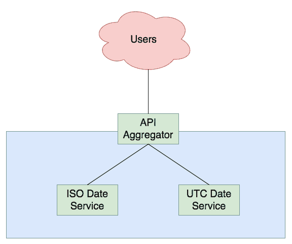

我们有三个服务：

+   API 聚合器

+   一个将时间戳转换为 ISO 格式日期的服务

+   一个将时间戳转换为 UTC 格式日期的服务

这些服务协调工作，将时间戳转换为不同格式的日期，但它们也可以扩展，我们可以聚合更多服务以添加更多功能，并通过 API 聚合器暴露它们。

每个服务都会打包成一个不同的 Docker 镜像，作为 Kubernetes 中的部署（Deployment）进行部署，并通过服务（包括外部和内部服务）暴露到集群和外部世界（如 API 聚合器）。

# ISO 日期和 UTC 日期服务

ISO 日期服务仅仅接收一个时间戳，并返回使用 ISO 格式表示的等效日期。让我们看看它的代码：

```
const Hapi = require('hapi')
const server = new Hapi.Server()
const moment = require('moment')

server.connection({port: 3000})

server.route({
  method: 'GET',
  path: '/isodate/{timestamp}',
  handler: (request, reply) => {
    reply({date: moment.unix(request.params.timestamp).toISOString()})
  }
})

server.start((err) => {
  if (err) {
    throw err
  }
  console.log('isodate-service started on port 3000')
})
```

这个服务本身非常简单：它使用一个名为 moment 的库和一个名为 **hapi** 的框架，通过传递一个 URL 参数中的时间戳来提供等效的 ISO 日期。编写该服务的语言是 Node.js，但你不需要成为该语言的专家，只需能够阅读 JavaScript 即可。像所有 Node.js 应用一样，它配有一个 `package.json` 文件，用于描述项目及其依赖项：

```
{
  "name": "isodate-service",
  "version": "1.0.0",
  "description": "ISO Date Service",
  "main": "index.js",
  "scripts": {
    "start": "node index.js"
  },
  "author": "David Gonzalez",
  "license": "ISC",
  "dependencies": {
    "hapi": "¹⁵.2.0",
    "moment": "².15.1"
  }
}
```

`package.json` 的某些字段是自定义的，但重要部分是依赖项和脚本部分。

现在，剩下一个重要的文件；Dockerfile：

```
FROM node:latest

RUN mkdir /app/
WORKDIR /app/

COPY . /app/
RUN npm install
EXPOSE 3000

CMD ["npm", "start"]
```

为了测试我们的服务，让我们构建 Docker 镜像：

```
docker build . -t iso-date-service
```

几秒钟后（或者稍久一些），我们的镜像已经准备好使用。只需运行它：

```
docker run -it -p 3000:3000 iso-date-service
```

就这些。为了测试它，可以使用 curl 获取一些结果：

```
curl http://localhost:3000/isodate/1491231233
```

这将返回一个 JSON，包含以 ISO 日期格式表示的时间戳，正如你在终端看到的那样。

UTC 日期服务基本相同，只是代码和接口不同：

```
const Hapi = require('hapi')
const server = new Hapi.Server()
const moment = require('moment')
server.connection({port: 3001})

server.route({
  method: 'GET',
  path: '/utcdate/{timestamp}',
  handler:  (request, reply) => {
    let date = moment.unix(request.params.timestamp).utc().toISOString().substring(0, 19)
    reply({date: date})
  }
})

server.start((err) => {
  if (err) {
    throw err
  }
  console.log('isodate-service started on port 3001')
})
```

如你所见，做了一些改动：

+   端口是 `3001`

+   返回的日期是 UTC 日期（基本上是没有时区信息的 ISO 日期）

我们还有一个 Dockerfile，和 ISO 日期服务的相同，还有一个 `package.json`，如下所示：

```
{
  "name": "utcdate-service",
  "version": "1.0.0",
  "description": "UTC Date Service",
  "main": "index.js",
  "scripts": {
    "start": "node index.js"
  },
  "author": "David Gonzalez",
  "license": "ISC",
  "dependencies": {
    "hapi": "¹⁵.2.0",
    "moment": "².15.1"
  }
}
```

这些是小的改动（仅是描述和名称）。总的来说，你应该在 UTC 日期服务中拥有以下文件：

+   Dockerfile（与 ISO 日期服务相同）

+   包含之前代码的 `index.js`

+   `package.json`

如果你想让自己的生活更轻松，只需克隆 `git@github.com:dgonzalez/chronos.git` 仓库，这样你就有了所有准备执行的代码。

现在，为了测试一切是否正确，构建 Docker 镜像：

```
docker build . -t utc-date-service
```

然后运行它：

```
docker run -it -p 3001:3001 utc-date-service
```

一旦启动，我们应该有我们的服务在 `3001` 端口上监听。你可以通过执行 curl 来检查，如下所示：

```
curl http://localhost:3001/utcdate/853123135
```

以类似于 ISO 日期服务的方式，这应该返回一个 JSON 格式的日期，但这次是 UTC 格式。

# 聚合服务

`aggregator` 服务是一个微服务，顾名思义，它聚合了其他两个（或更多）服务，并为消费者提供前端 API，使得所有幕后逻辑得以封装。虽然它并不完美，但这是一个常见模式，因为它允许我们使用断路器的概念并且在专用层中管理错误。

在我们的案例中，服务相当简单。首先，让我们看一下代码：

```
const Hapi = require('hapi')
const server = new Hapi.Server()
let request = require('request')

server.connection({port: 8080})

server.route({
  method: 'GET',
  path: '/dates/{timestamp}',
  handler:  (req, reply) => {
    const utcEndpoint = `http://utcdate-service:3001/utcdate/${req.params.timestamp}`
    const isoEndpoint = `http://isodate-service:3000/isodate/${req.params.timestamp}`
    request(utcEndpoint, (err, response, utcBody) => {
      if (err) {
        console.log(err)
        return
      }
      request(isoEndpoint, (err, response, isoBody) => {
        if (err) {
          console.log(err)
          return
        }
        reply({
          utcDate: JSON.parse(utcBody).date,
          isoDate: JSON.parse(isoBody).date
        })
      })
    })
  }
})

server.start((err) => {
  if (err) {
    throw err
  }
  console.log('aggregator started on port 8080')
})
```

为了简化代码的理解，我们没有使用 promises 或 async/await，而是选择了嵌套的 `callback`（这很容易阅读）。

以下是从前面的代码中需要注意的一些要点：

+   我们通过名称调用服务（`utcdate-service` 和 `isodate-service`），利用与 Kubernetes DNS 的通信

+   在返回之前，`aggregator` 服务会调用两个服务，并返回一个包含聚合信息的 JSON 对象

为了测试这个服务，我们需要创建指向 `isodate-service` 和 `utcdate-service` 的 DNS 条目（或主机条目），这比在 Kubernetes 中测试更为复杂，因此我们暂时跳过测试。

与任何 Node 应用一样，`aggregator` 服务需要一个 `package.json` 来安装依赖项并控制一些方面：

```
{
   "name": "aggregator",
   "version": "1.0.0",
   "description": "Aggregator service",
   "main": "index.js",
   "scripts": {
       "start": "node index.js"
   },
   "author": "David Gonzalez",
   "license": "ISC",
   "dependencies": {
       "hapi": "¹⁵.2.0",
       "request": "².75.0"
   }
}
```

`package.json` 非常重要，特别是脚本块，它指示我们当 Docker 容器基于 Dockerfile 中定义的镜像执行 `npm start` 命令时该做什么：

```
FROM node:latest

RUN mkdir /app/
WORKDIR /app/

COPY . /app/
RUN npm install
EXPOSE 3000

CMD ["npm", "start"]
```

到目前为止，你应该有三个文件：

+   `index.js`

+   `Dockerfile`

+   `package.json`

使用以下命令构建 `docker` 容器：

```
docker build . -t aggregator
```

检查它是否按预期工作：

```
docker run -it -p 8080:8080 aggregator
```

即使服务器无法解析请求，因为它不知道如何与 `isodate-service` 和 `utcdate-service` 通信，它仍然应该启动。

# 将镜像推送到 Google Container Registry

到目前为止，我们的本地仓库中已有三个镜像：

+   `iso-date-service`

+   `utc-date-service`

+   `aggregator`

这三个镜像现在存在于你的计算机上，但不幸的是，我们在 GKE 中的 Kubernetes 集群将无法访问它们。解决这个问题的方法是将这些镜像推送到一个 Docker 注册中心，这样我们的集群就能访问它们。谷歌云提供了一个 Docker 注册中心，非常适合与 GKE 配合使用，原因有很多：

+   **数据隔离**：数据永远不会离开 Google 网络

+   **集成**：GCP 中的服务可以通过隐式认证进行交互

+   **自动化**：这与 GitHub 和其他服务集成，使我们能够构建镜像，自动创建持续交付镜像的管道。

在设置与 Git 的持续交付管道之前，我们将手动推送镜像，以便理解其工作原理。**Google 容器注册中心** (**GCR**) 在全球范围内都有复制，因此你需要做的第一件事是选择存储镜像的地方：

+   `us.gcr.io`在美国托管你的镜像

+   `eu.gcr.io`在欧盟托管你的镜像

+   `asia.gcr.io`在亚洲托管你的镜像

在我的情况下，`eu.gcr.io`是完美的匹配。接下来，我们需要我们的项目 ID。可以通过点击控制台顶部栏中的项目名称找到它：

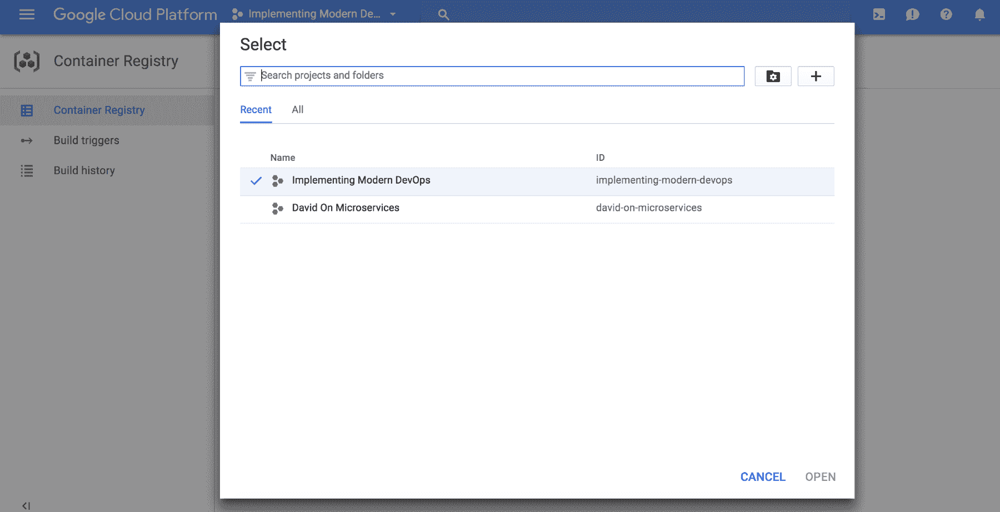

在我的案例中，项目 ID 是`implementing-modern-devops`*.* 现在，第三个组件是我们已经拥有的镜像名称。通过这三个组件，我们可以构建出 Docker 镜像 URL 的名称：

+   `eu.gcr.io/isodate-service:1.0`

+   `eu.gcr.io/utcdate-service:1.0`

+   `eu.gcr.io/aggregator:1.0`

1.0 部分是我们镜像的版本。如果没有指定，默认是 latest，但我们将为镜像打上版本号，以便追溯。

现在是时候为我们的镜像打上合适的标签了。首先是 ISO 日期服务：

```
docker tag iso-date-service eu.gcr.io/implementing-modern-devops/isodate-service:1.0
```

然后是 UTC 日期服务：

```
docker tag utc-date-service eu.gcr.io/implementing-modern-devops/utcdate-service:1.0
```

最后，我们有了`aggregator`服务：

```
docker tag aggregator eu.gcr.io/implementing-modern-devops/aggregator-service:1.0
```

这是 Docker 用来识别镜像推送地址的机制：Docker 读取我们的镜像名称，并识别出镜像要推送到的 URL。在这种情况下，由于我们使用的是私有注册中心（Google 容器注册中心是私有的），我们需要使用凭据，但使用 `gcloud` 命令，操作变得相当简单：

```
gcloud docker -- push eu.gcr.io/implementing-modern-devops/aggregator-service:1.0
```

现在是时候处理`isodate-service`了：

```
gcloud docker -- push eu.gcr.io/implementing-modern-devops/isodate-service:1.0
```

最后，这里是`utcdate-service`：

```
gcloud docker -- push eu.gcr.io/implementing-modern-devops/utcdate-service:1.0
```

小心，项目 ID 会发生变化，因此请根据你的配置自定义命令。

在稍等片刻之后（将镜像推送到 GCR 可能需要几分钟时间），这些镜像应该已经上传到我们私有的 Google 容器注册中心实例中了。

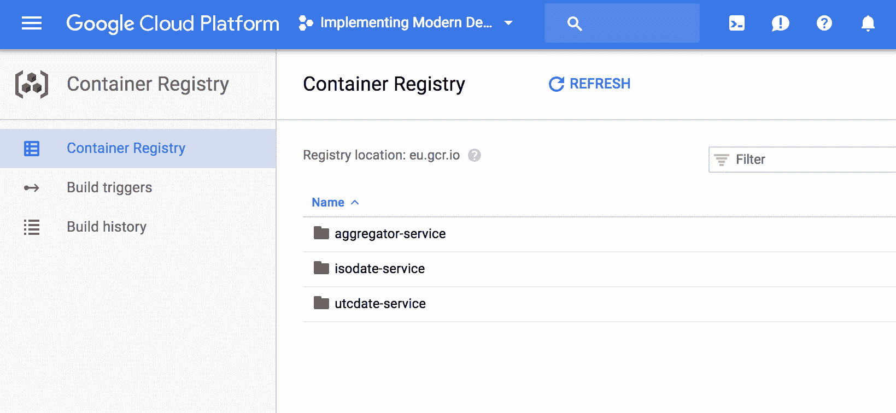

让我们回顾一下我们所做的：

+   我们已经在本地构建了镜像

+   我们给镜像打上了适当的标签，以便能够将它们推送到 GCR

+   我们使用`gcloud`推送了镜像到 GCR

这非常直接，但如果你以前没有做过，可能会有点棘手。我们所有的镜像都保存在我们的私人容器注册表中，随时可以使用。

# 设置镜像的持续交付流水线

现在我们已将镜像部署到 GCR，我们需要自动化这个过程，以最小化人工干预。为此，我们将使用 Google 容器注册表中的构建触发器部分。在这种情况下，我们将使用 GitHub，因为它是业界标准的 Git 代码库管理工具。创建一个[`www.github.com`](https://www.github.com)账号（如果你还没有的话），然后创建三个代码库：

+   `aggregator`

+   `isodate-service`

+   `utcdate-service`

这些可以是公开的，但如果你将来要处理私有代码，应该创建私有代码库（需要付费）或选择其他提供商，比如 Google Cloud Platform 中的源代码库。

我们需要做的第一件事是将三个服务的代码推送到代码库中。Github 会提供相关指令，基本上，过程如下：

1.  克隆代码库

1.  根据需要添加前述部分的代码

1.  将代码推送到远程代码库

我的 GitHub 用户名是`dgonzalez`，推送`aggregator`代码的命令如下：

```
git clone git@github.com:dgonzalez/aggregator.git
```

现在，将`aggregator`中的代码复制到新创建的文件夹中，使用`clone`命令并执行（在`aggregator`文件夹内）：

```
git add .
```

提交更改：

```
git commit -m 'Initial commit'
```

然后将它们`push`到远程代码库：

```
git push origin master
```

在执行这些命令后，你的代码库应该会像下面的截图所示：

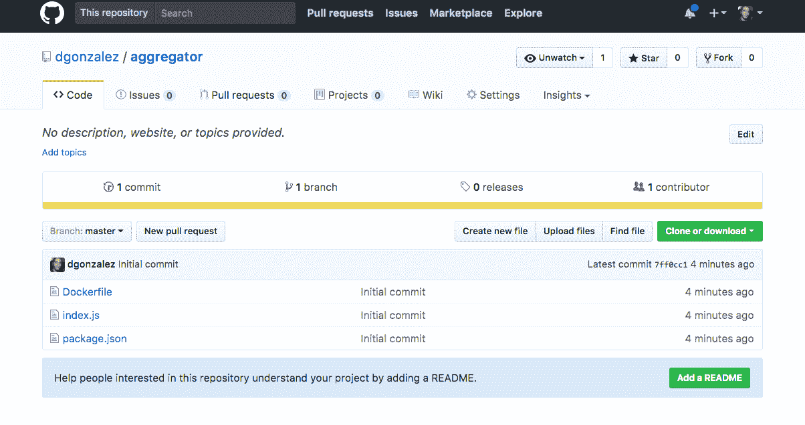

我们使用的命令是非常基础的 Git 命令。你可能对 Git 已经有所了解，但如果你不熟悉，我建议你跟随一些教程，比如[`try.github.io/levels/1/challenges/1`](https://try.github.io/levels/1/challenges/1)。

现在我们的代码库已经准备好了，是时候回到 GCP 设置我们流水线的构建触发器了。我们需要做的第一件事是进入 Google Cloud Platform 的容器注册表中的触发器部分：

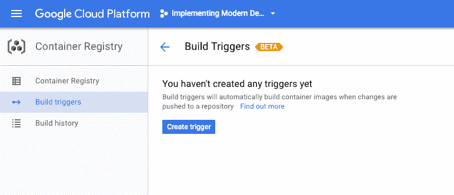

这个功能允许我们创建触发器，这些触发器会根据事件触发镜像的构建。有几种触发策略。在这种情况下，我们将基于新标签的创建来构建镜像。最常见的做法是监控主分支的变化，但我非常支持版本管理。想一想：容器是不可变的工件：一旦创建，就不应更改，但如果容器内部的代码出现问题怎么办？这个策略是从主分支分支出来，然后创建所谓的热修复构建。通过标签，我们也可以做到这一点，只不过是从标签而不是从主分支进行分支，这有以下好处：

+   主分支可以更改，而不会触发事件

+   标签不能被意外创建（因此不会出现意外发布）

+   版本保存在源代码管理器中，而不是在代码中

+   你可以将标签与构建的工件关联起来。

也就是说，完全可以将主分支作为参考点并使用其他组合：这里的重要教训是坚持一个程序并让每个人都清楚。

点击**创建触发器**，然后选择 GitHub。点击“下一步”后，它会让你从列表中选择项目；然后再次点击“下一步”。现在我们会看到一个表单和几个选项：

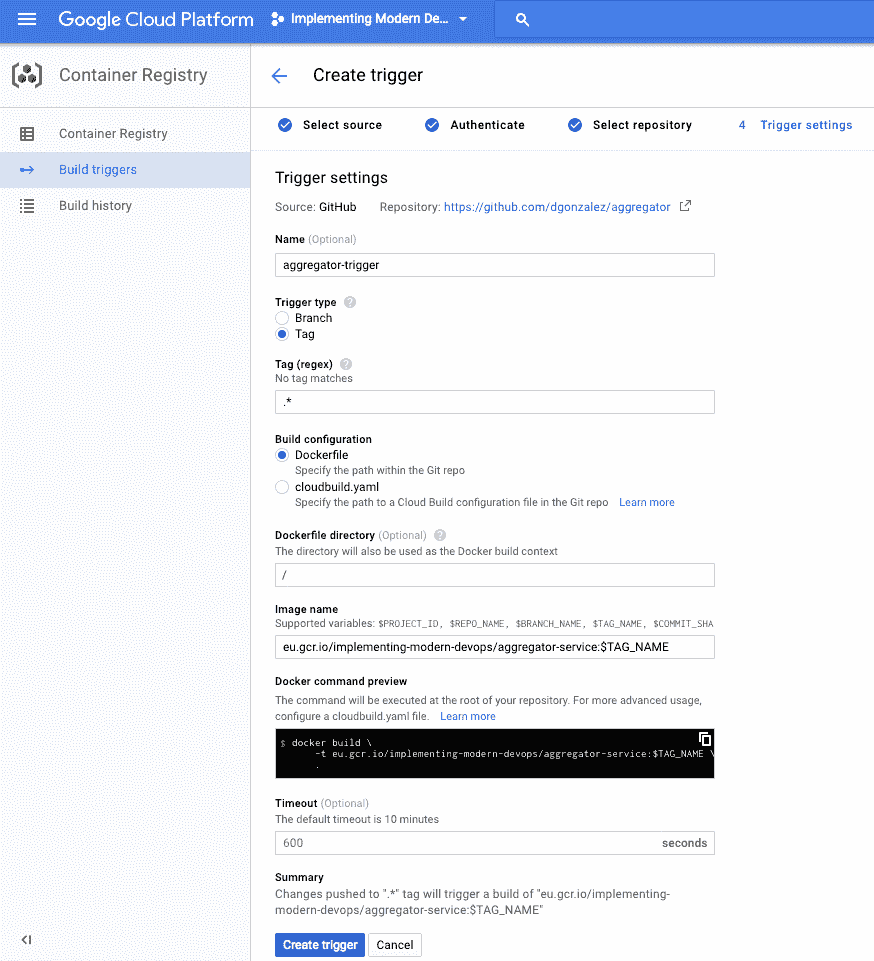

我们将使用 Dockerfile 而不是`cloudbuild.yaml`（后者是 GCP 特有的）并设置触发器以便在标签上触发；镜像名称必须与前面章节中创建的仓库相匹配（记住`eu.*`名称并检查仓库名称）。

创建后，什么也不会发生。我们的仓库没有标签，因此没有构建任何内容。让我们创建一个标签：

```
git tag -a 1.0 -m "my first tag"
```

这将创建一个标签，现在我们需要将其推送到服务器：

```
git push origin 1.0
```

现在，我们回到 GCP 容器注册表，查看发生了什么：一个新的构建已被触发，将版本 1.0 推送到`aggregator`镜像的注册表中：

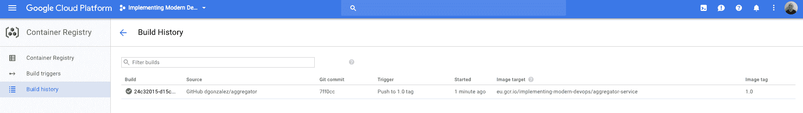

从现在开始，如果我们在仓库中创建新的标签，GCP 将为我们构建镜像，并且可以与 GitHub 中的提交相关联，这样我们就能完全追踪到我们构建的每个环境中的内容。没有比这更好的了。

整个构建和推送过程本可以通过 Jenkins 完成，正如你在第四章（持续集成）中所学到的那样，但我认为如果有人能够以合理的价格处理你的问题，胜过自己去解决它们并在已经复杂的系统中增加更多的可变因素。在这种情况下，注册表、构建流水线和自动化由 Google Cloud Platform 负责。

# 设置 Jenkins

在前面的部分，我们利用了 Google Cloud Platform 的镜像操作，但现在，我们需要从某个地方以 CI/CD 方式管理 Kubernetes。在这种情况下，我们将使用 Jenkins 来实现这个目的。我们在这里有几种选择：

+   在 Kubernetes 中部署 Jenkins

+   在裸机上安装 Jenkins

+   在 Kubernetes 外部的容器中安装 Jenkins

最近，Jenkins 变得对 Kubernetes 更加友好，提供了一个插件，可以在需要时以容器化的方式启动 Jenkins 的从节点，从而将硬件的配置和销毁交给 Kubernetes 来管理。当你的集群足够大（50 台以上机器）时，这是一种非常有趣的方式，但如果集群较小，这可能会导致邻居噪音问题。

我非常推崇分离原则：CI/CD 应该能够与生产基础设施进行通信，但出于两个原因，它不应与生产硬件共用一台机器：

+   资源消耗

+   漏洞

想一想：CI/CD 软件默认情况下对攻击者是脆弱的，因为它需要通过界面执行命令；因此，你实际上是将底层基础设施的访问权限交给了潜在的攻击者。

我的建议是：从简单开始。如果公司规模较小，我会选择将 Jenkins 部署在容器中并挂载卷，逐步发展基础设施，直到集群足够大，可以容纳 Jenkins 而不会对性能造成显著影响；然后将其移入专用的命名空间中。

在第四章（持续集成）中，我们在没有使用任何卷的情况下将 Jenkins 部署在容器中，这可能会带来问题，因为配置可能会在重启后丢失。现在，我们将把 Jenkins 安装在裸机上，这样就有了另一种管理 Jenkins 的方式。

我们需要做的第一件事是创建一台 GCP 机器。

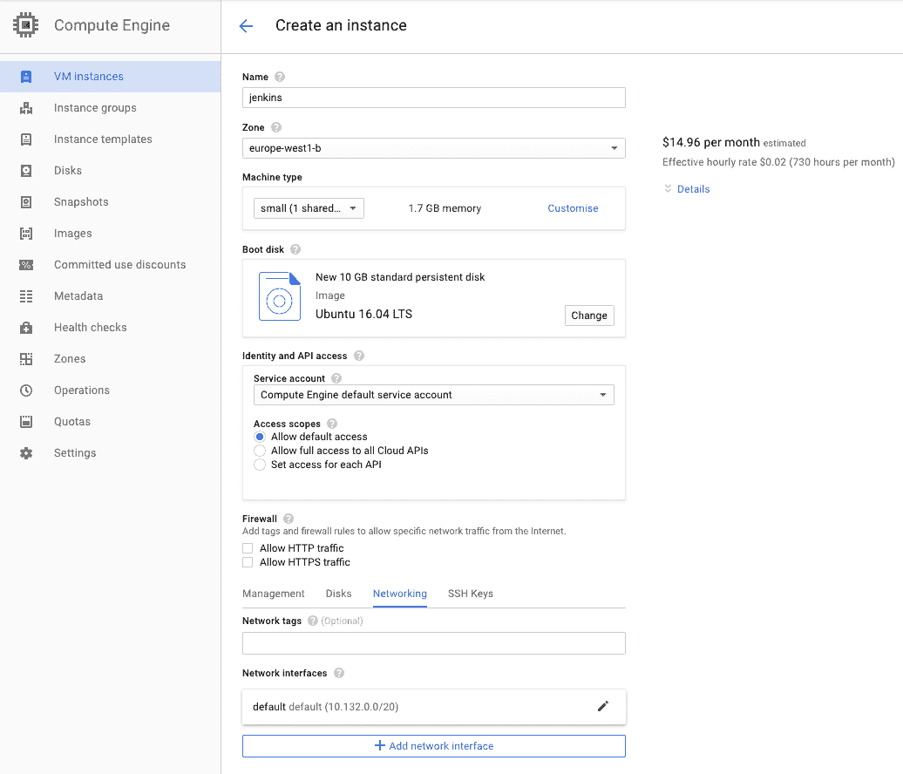

上面的截图是我 Jenkins 机器的配置。以下是几个重要的方面：

+   使用 Ubuntu 而不是 Debian（我选择了最新的 Ubuntu LTS 版本）

+   小型实例（我们可以稍后扩展）

+   可能需要更改防火墙设置，以便能够访问 Jenkins

其他配置都是标准的。我们没有为 Jenkins 配置静态 IP，因为这只是一个演示，但你可能希望配置静态 IP，就像你之前学到的那样，并在 DNS 中添加一个条目，以便为你的 CI 服务器提供一个静态的参考点。

将其以 Terraform 的方式执行也是一个不错的练习，这样你就可以以**基础设施即代码**（**IaC**）的方式管理基础设施。

一旦机器启动，就可以安装 Jenkins。我们将按照官方指南进行操作，指南链接如下：[`wiki.jenkins.io/display/JENKINS/Installing+Jenkins+on+Ubuntu`](https://wiki.jenkins.io/display/JENKINS/Installing+Jenkins+on+Ubuntu)。

使用 Google Cloud 平台的 Web SSH 终端，打开新创建机器的 shell 并执行以下命令：

```
wget -q -O - https://pkg.jenkins.io/debian/jenkins-ci.org.key | sudo apt-key add -
```

然后，添加 Jenkins 仓库：

```
sudo sh -c 'echo deb http://pkg.jenkins.io/debian-stable binary/ > /etc/apt/sources.list.d/jenkins.list'
```

然后，更新软件包列表：

```
sudo apt-get update
```

最后，安装 Jenkins：

```
sudo apt-get install jenkins
```

就这样。一旦前面的命令完成，Jenkins 应该已经安装好，可以作为服务启动、停止和重启。为了确保它在运行，执行以下命令：

```
sudo service jenkins restart
```

现在，如果我们浏览服务器上的公共 IP 和端口 `8080`，我们将看到 Jenkins 的初始屏幕。

你可能需要调整防火墙以允许访问该机器上的端口`8080`。

这个初始屏幕很熟悉，我们需要获取密码以初始化 Jenkins。这个密码在日志中：

```
cat /var/log/jenkins/jenkins.log
```

输入密码并初始化 Jenkins（建议的插件）。这可能需要一些时间；与此同时，我们还需要设置 Gcloud SDK。首先，切换到 Jenkins 用户：

```
sudo su jenkins
```

然后只需执行以下命令：

```
curl https://sdk.cloud.google.com | bash
```

安装完成后，你需要打开一个新的 shell 以使更改生效。这样做并安装 `kubectl`：

```
gcloud components install kubectl
```

现在我们系统中有了 `Kubectl` 二进制文件，我们需要将其连接到一个集群，但首先是时候创建一个集群了。正如你在前几章中学到的，只需创建一个包含三台小型机器的集群。创建完成后，如前一章所示，连接 Jenkins 机器到集群，但首先，运行 `gcloud init` 来配置一个新的 `auth` 会话（选项 2），使用你的帐户。

完成后，确保 `kubectl` 可以与集群通信，通过执行以下测试命令：

```
kubectl get nodes
```

你应该列出组成你集群的三个节点。现在我们需要让 `kubectl` 对 `jenkins` 用户可用。只需运行以下命令：

```
ln -s /root/google-cloud-sdk/bin/kubectl /usr/bin/kubectl
```

将所有者更改为 Jenkins：

现在，回到 Jenkins，按照以下截图设置管理员用户：

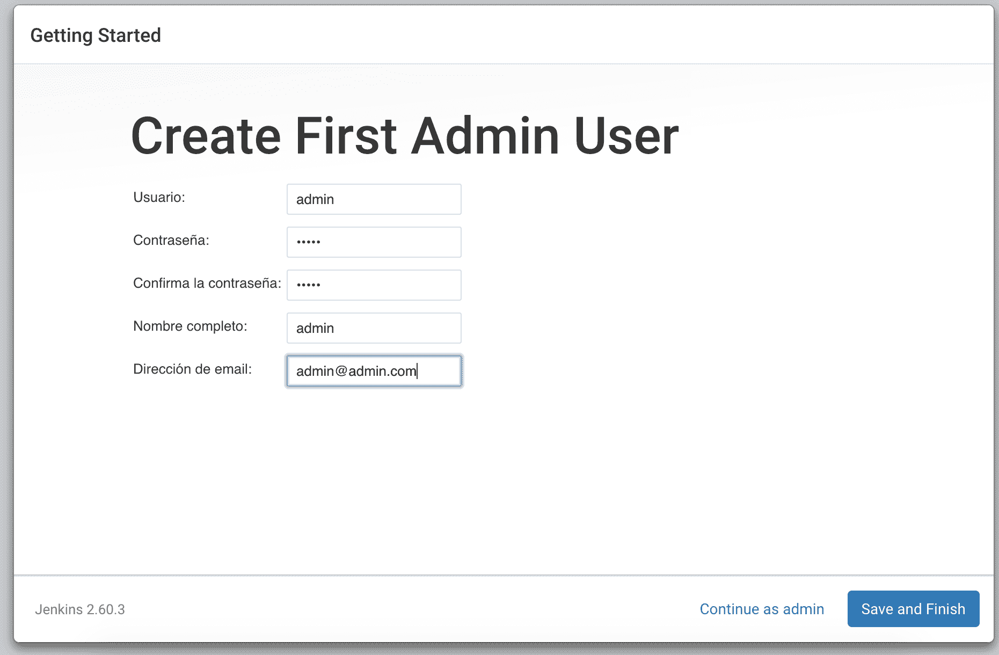

点击保存并完成，就完成了。

在开始创建作业之前，我们需要让 `jenkins` 用户可以使用二进制文件 kubectl。以 root 用户登录并执行：

```
ln -s /var/lib/jenkins/google-cloud-sdk/bin/kubectl /usr/bin/kubectl
```

这将确保 `jenkins` 的 `kubectl` 命令指向前面步骤中 `jenkins` 用户安装的 SDK。

现在，我们有了一切：

+   Jenkins

+   Google Cloud SDK

+   一个 GKE 集群

+   Jenkins 与 GKE 之间的连接

在继续之前，我们将确保一切按预期工作。进入 Jenkins 创建一个新的自由风格项目，并添加一个构建步骤，使用以下命令：

```
kubectl get nodes
```

保存项目并运行。输出应该与以下截图非常相似：

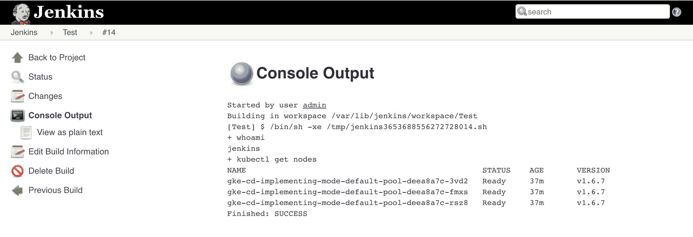

这表示我们可以开始了。

一般来说，Jenkins 和其他 CI 系统绝不应暴露在互联网上。绝不。只需要一个弱密码，如果公开访问，任何人都可以摧毁你的系统。在这个示例中，我们没有配置防火墙，但在你的公司，应该仅允许来自办公室 IP 的访问。

# 为你的应用程序实现持续交付

到目前为止，我们已经设置了一些元素：

+   一个包含我们代码的 GitHub 仓库（`aggregator`）

+   一个在 GCP 中为我们的 Docker 镜像配置的持续交付管道，一旦我们标记代码，就会触发该管道。

+   一个 Kubernetes 集群

+   Jenkins 连接到前面的集群

现在，我们将设置代码和 Kubernetes 基础设施的持续交付管道。这个管道将由 Jenkins 任务触发，我们将手动触发它。

你可能会认为，所有关于**持续交付**（**CD**）的内容都是关于透明地将代码发布到生产环境中，而无需任何人工干预，但实际上这里我们有一些需要手动操作的事件，以便启动构建。我曾在一些地方工作过，其中持续交付是通过更改仓库的主分支自动触发的，在经历了几次事故后，我真的相信，手动触发是获得对部署控制的巨大好处的合理代价。

例如，在发布镜像时，通过手动创建标签来构建我们的镜像，我们设置了一个屏障，以防止任何人不小心向主分支提交代码并发布可能不稳定甚至更糟的版本。现在，我们将做类似的事情，但发布代码的任务将在 Jenkins 中手动触发，因此通过控制对 Jenkins 的访问，我们可以追踪谁做了什么，同时我们还可以免费获得基于角色的访问控制。我们可以为团队成员分配角色，防止经验较少的开发人员在没有监督的情况下制造混乱，同时仍然保持足够的灵活性，以便自动化发布代码。

我们首先需要做的是在 GitHub 上创建一个名为`aggregator-kubernetes`的仓库，用于托管所有 Kubernetes 资源的 YAML 文件。我们将为`utcdate-service`和`isodate-service`做同样的事，但我们先从`aggregator`开始。

一旦我们创建了仓库，就需要创建 Kubernetes 对象来部署并暴露服务。简而言之，我们的系统将呈现以下图示的样子：

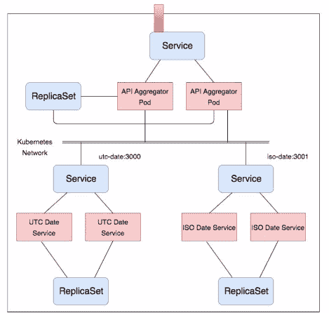

在上面的图片中，我们可以看到我们需要为每个应用程序创建的 Kubernetes 对象（*ReplicaSet*和*Service*）（部署部分省略）。红色部分显示的是应用程序本身。现在，我们聚焦于`aggregator`，因此我们需要创建一个将由 Deployment 管理的`ReplicaSet`和一个将通过`gcloud`负载均衡器将我们的 API 暴露给外界的`LoadBalancer`类型的 Service。

我们需要的第一个元素是我们的部署：

```
apiVersion: extensions/v1beta1
kind: Deployment
metadata:
  name: aggregator
spec:
  replicas: 2
  template:
    metadata:
      labels:
        app: aggregator-service
    spec:
      containers:
      - name: aggregator-service
        image: eu.gcr.io/implementing-modern-devops/aggregator-service:1.0
        ports:
        - containerPort: 8080
```

这没什么意外的。它是一个简单的部署对象，包含了我们自动构建过程为我们创建的镜像（记住，我们创建了版本 1.0 的标签……也别忘了根据你的项目进行定制）。在我们新的仓库 `aggregator-kubernetes` 中，将此文件保存在名为 objects 的文件夹下，文件名为 `deployment.yaml`。现在是时候创建将要暴露我们应用的服务了：

```
kind: Service
apiVersion: v1
metadata:
   name: aggregator-service
spec:
   ports:
      - port: 80
         targetPort: 8080
   selector:
      app: aggregator-service
   type: LoadBalancer
```

再次强调，这非常简单：一个服务，通过 Google Cloud 中的负载均衡器将任何带有标签 app: `aggregator-service` 的内容暴露到外部。将其保存在名为 `service.yaml` 的文件中，放入 objects 文件夹。现在是时候提交更改并将其推送到你的 GitHub 仓库：

```
git add .
```

然后，执行以下操作：

```
git commit -m 'Initial commit'
```

最后，看看这个：

```
git push origin master
```

到现在为止，你已经把 `aggregator` 的所有基础设施代码都放在了你的 GitHub 仓库中，并且布局类似于以下内容：

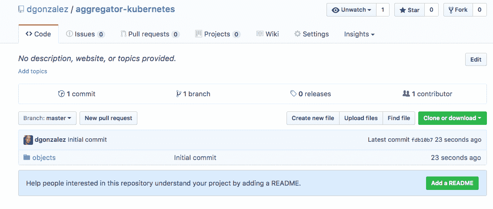

在 objects 文件夹中，你可以找到两个 YAML 文件：`deployment.yaml` 和 `service.yaml`。我们可以使用 `kubectl`（首先将其连接到集群）在本地运行这些文件，以验证它们是否按预期工作（我推荐你这样做）。

现在是时候设置 Jenkins 作业来协调我们的构建了。在 Jenkins 中创建一个新的自由式项目，并进行如下配置：

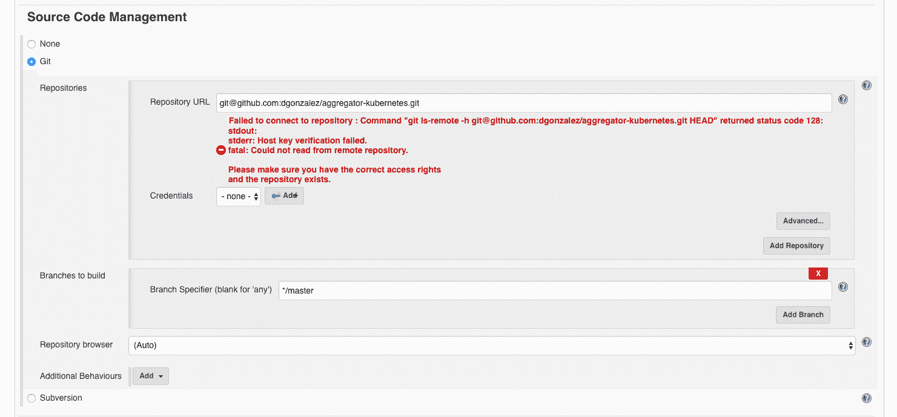

首先，查看 GitHub 仓库。如你所见，出现了一个错误，这仅仅是因为 GitHub 需要一个 SSH 密钥来识别客户端。GitHub 在 [`help.github.com/articles/connecting-to-github-with-ssh/`](https://help.github.com/articles/connecting-to-github-with-ssh/) 中解释了如何生成和配置这些密钥。

一旦你添加了通过生成的私钥进行身份验证的凭证，错误应该会被移除（记住，凭证类型是“带用户名的 SSH 密钥”，你的用户名必须与 GitHub 中的匹配）。

在这里，我们可以尝试很多 Cit 选项，比如在每次构建时创建一个标签，以便追踪系统中发生的事情，或者甚至从标签构建。我们将构建主分支：这次没有标签。

现在，我们将为此任务添加唯一的构建步骤：

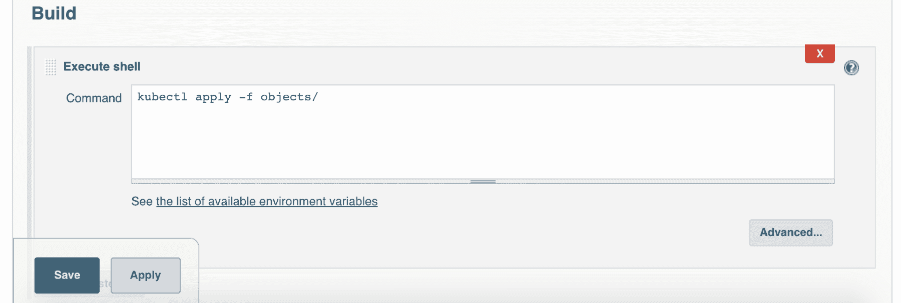

正如你在前面的章节中学到的，使用 `kubectl apply`，我们几乎可以控制一切。在这种情况下，我们将包含 `yamls` 的文件夹作为参数传递，因此 `kubectl` 将根据我们即将创建的 YAML 定义在 Kubernetes 上执行操作。

保存任务并运行。一旦完成，它应该会成功，并且日志类似于以下内容：

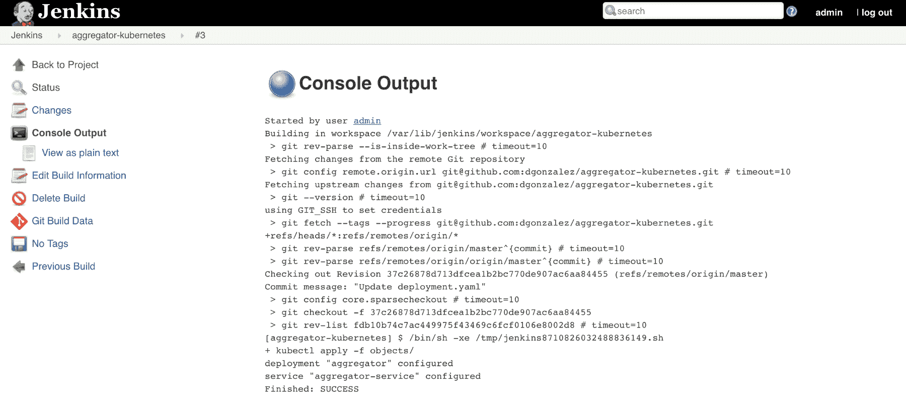

这个任务可能会失败几次，因为涉及很多组件。目前，你已经具备足够的知识来排查这些组件的集成问题。

就是这样。我们的持续交付（CD）管道已成功运行。从现在开始，如果我们想对`aggregator`进行更改，我们只需要向我们的代码仓库添加/修改文件，使用新版本进行标记，修改`aggregator-kubernetes`定义以指向新的镜像，并启动我们的 Jenkins 任务。

还有两个额外的步骤：

+   创建标签

+   手动启动任务

这是你为部署中高度控制所付出的代价，但这里有一点“秘密调料”：我们已经为极大的部署灵活性做好了准备，正如我们将在下一节中看到的那样，但首先，你应该为`utcdate-service`和`isodate-service`重复相同的操作，这样我们的完整系统才能运行。如果你想节省很多时间，或者检查自己是否走在正确的路上，可以查看我的仓库：[`github.com/dgonzalez/chronos`](https://github.com/dgonzalez/chronos)。

每个服务内部都有一个名为 definitions 的文件夹，里面包含了让一切正常运行的 Kubernetes 对象。

注意服务的命名：`aggregator`期望能够从 DNS 中解析`isodate-service`和`utcdate-service`，所以你的服务（Kubernetes 对象）应该按此命名。

# 常规发布

现在一切就绪；如果你已经完成了`utcdate-service`和`isodate-service`的部署，Kubernetes 上应该已经安装了一个完全运行的系统。它的工作原理非常简单：当你通过`/dates/{timestamp}`路径获取`aggregator`的 URL 时，将`timestamp`替换为有效的 UNIX 时间戳，该服务将联系`utcdate-service`和`isodate-service`，并将时间戳转换为 UTC 和 ISO 格式。在我的情况下，Google Cloud Platform 提供的负载均衡器会将 URL 指向：`http://104.155.35.237/dates/1111111111`。

它会有以下响应：

```
{
   utcDate: "2005-03-18T01:58:31",
   isoDate: "2005-03-18T01:58:31.000Z"
}
```

你可以玩一会儿，但其实没什么花样：只是一个简单的演示系统，使微服务及其自动化变得容易理解。在这个例子中，我们没有运行任何测试，但对于持续交付管道来说，测试是必须的（我们稍后会讨论这个问题）。

正如本节标题所示，我们将创建一个新版本的应用程序，并使用我们的持续交付管道发布它。

我们的新版本将非常简单，但也很具示范性。在`aggregator`中，将`index.js`替换为以下代码：

```
const Hapi = require('hapi')
const server = new Hapi.Server()
let request = require('request')
```

```
server.connection({port: 8080})
```

```
server.route({
  method: 'GET',
  path: '/dates/{timestamp}',
  handler: (req, reply) => {
    const utcEndpoint = `http://utcdate-service:3001/utcdate/${req.params.timestamp}`
    const isoEndpoint = `http://isodate-service:3000/isodate/${req.params.timestamp}`
    request(utcEndpoint, (err, response, utcBody) => {
      if (err) {
        console.log(err)
        return
      }
      request(isoEndpoint, (err, response, isoBody) => {
      if (err) {
        console.log(err)
        return
      }
      reply({
        utcDate: JSON.parse(utcBody).date,
        isoDate: JSON.parse(isoBody).date,
        raw: req.params.timestamp
       })
     })
   })
  }
})

server.start((err) => {
  if (err) {
    throw err
  }
  console.log('aggregator started on port 8080')
})
```

在高亮部分，我们向返回对象中添加了一个新部分，基本上返回原始时间戳。现在是提交更改的时候了，但首先，让我们遵循一个好习惯。创建一个分支：

```
git checkout -b raw-timestap
```

这将创建一个名为`raw-timestamp`的本地分支。现在，提交前面代码中所做的更改：

```
git add . && git commit -m 'added raw timestamp'
```

并将分支推送到 GitHub：

```
git push origin raw-timestamp
```

如果我们现在访问 GitHub 界面，会注意到一些变化：

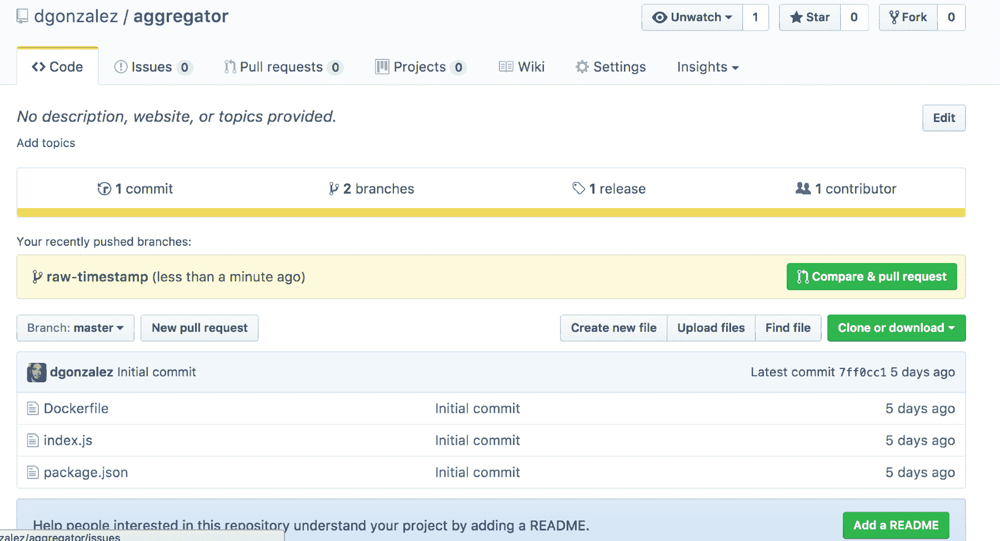

系统建议我们创建一个拉取请求。基本上，拉取请求是向代码库添加代码的请求。点击“比较并拉取请求”，然后在新表单中添加描述并点击“创建拉取请求”。这就是结果：

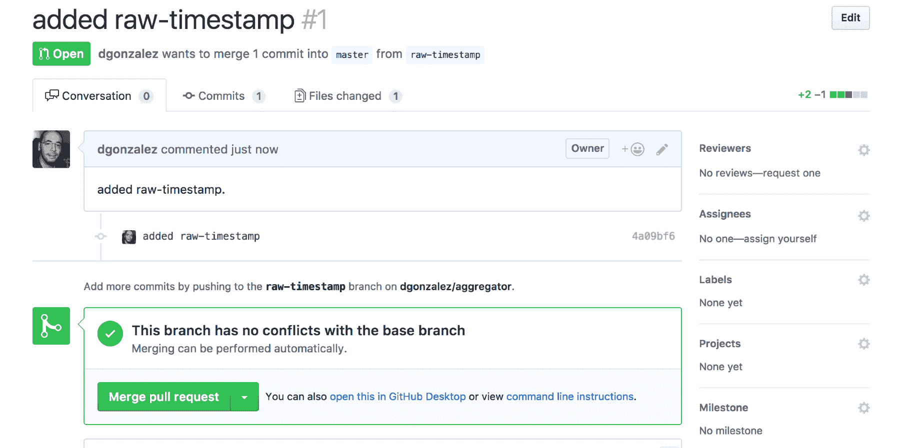

这里有三个选项卡：

+   会话

+   提交

+   文件更改

第一个选项卡显示的是参与者的评论列表。第二个选项卡是他们推送到服务器的提交列表，第三个选项卡则是以差异样式显示的更改列表，包含添加和删除的内容，你可以在此处发表评论，要求更改或建议更好的做法。在大型项目中，主分支通常是锁定的，推送代码到主分支的唯一方法是通过拉取请求，以强制执行代码审查。

一旦你满意，点击合并拉取请求并合并代码。这将把更改推送到主分支（需要确认）。

现在我们准备创建一个标签。可以通过 GitHub 界面完成。如果点击发布链接（位于文件列表上方贡献者数量旁边），它会带你到发布页面：

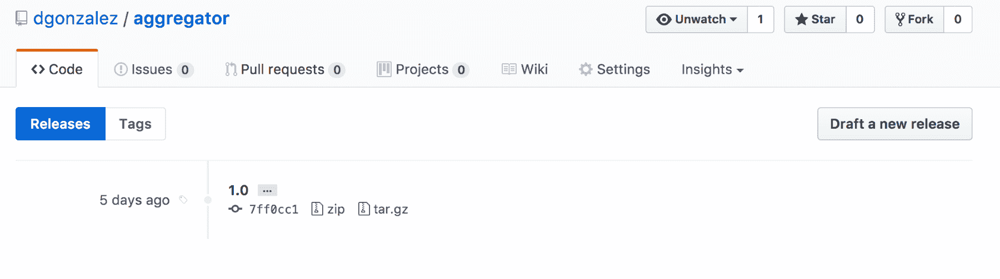

在这里，你可以看到我们之前从终端创建的标签和一个名为“草拟新发布”的按钮。点击它，会显示一个新的表单：

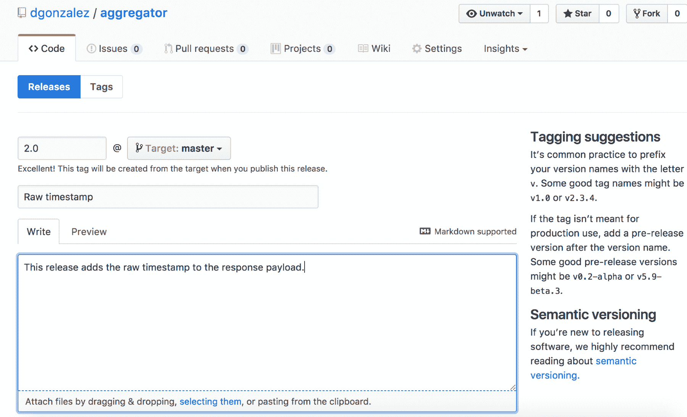

填写细节，如这里所示，并创建发布。这会创建一个与我们在 Google Cloud Platform 中的容器注册表连接的标签，并且到现在（非常快），我们镜像的新版本应该已经可用：

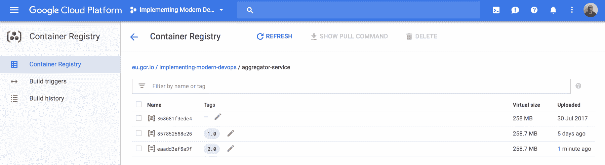

如你所见，我们可以对进入生产环境的内容（包括注册表和集群）有很好的控制。现在唯一剩下的步骤就是将新版本发布到 Kubernetes。返回到名为`aggregator-kubernetes`的代码库（我们在前面的部分创建了它），并将`deployment.yaml`文件中镜像的标签从`eu.gcr.io/implementing-modern-devops/aggregator-service:1.0`改为`eu.gcr.io/implementing-modern-devops/aggregator-service:2.0`。请注意，项目需要根据你的配置进行调整。

完成后，提交并推送更改（来自`aggregator-kubernetes`文件夹）：

```
git add . && git commit -m 'version 2.0 of aggregator' && git push origin master
```

现在一切都准备好了。我们已经站在悬崖边上。如果我们点击在 Jenkins 中创建的作业中的“运行”，新的软件版本将会在 Kubernetes 中部署，并且实现零停机（取决于你的配置，如之前所见）；我们掌控着一切。我们可以决定何时发布，并且我们有一个简单的回滚方法：撤销更改并在 Jenkins 中再次点击“运行”。

一旦你对更改感到满意，运行我们在 Jenkins 中创建的作业（在我的案例中是`aggregator-kubernetes`）。

如果你访问之前相同的 URL（`http://104.155.35.237/dates/1111111111`），结果应该有一些变化：

```
{
   utcDate: "2005-03-18T01:58:31",
   isoDate: "2005-03-18T01:58:31.000Z",
   raw: "1111111111"
}
```

新版本已上线。正如你所想象的，这是一个非常强有力的理由来采纳 DevOps：以最小的努力透明地将软件发布给用户（创建标签并在 Jenkins 中运行任务）。

在下一部分，我们将执行相同的部署，但使用一种称为蓝绿部署的技术，该技术的核心是将新版本以私有模式运行在生产环境中，以便我们在将其提供给公众之前先进行功能测试。

# 蓝绿部署

为了执行蓝绿部署，首先，我们需要回滚到 1.0 版本。编辑`deployment.yaml`文件，在`aggregator-kubernetes`中调整镜像为`1.0`标签，并将更改推送到 GitHub。完成后，在 Jenkins 中运行名为`aggregator-kubernetes`的任务，然后，你就完成了回滚到 1.0 版本。保留 1.0 版本的镜像在注册表中，因为我们将要使用它。

蓝绿部署是一种将软件发布到生产环境的技术，它对公众是不可见的，因此我们可以在将其公开给所有人之前进行测试。Kubernetes 让这一过程变得极其简单：我们需要做的唯一事情是复制`aggregator-kubernetes`中的资源，并为它们分配不同的名称和标签。例如，这是我们的`deployment-bluegreen.yaml`：

```
apiVersion: extensions/v1beta1
kind: Deployment
metadata:
  name: aggregator-bluegreen
spec:
  replicas: 2
  template:
    metadata:
      labels:
        app: aggregator-service-2.0
    spec:
      containers:
      - name: aggregator-service
         image: eu.gcr.io/implementing-modern-devops/aggregator-service:2.0
         ports:
           - containerPort: 8080
```

这是我们的`service-bluegreen.yaml`：

```
kind: Service
apiVersion: v1
metadata:
  name: aggregator-service-bluegreen
spec:
  ports:
  - port: 80
     targetPort: 8080
  selector:
     app: aggregator-service-2.0
  type: LoadBalancer
```

如你所见，我们已经创建了一个具有不同选择器/标签的应用程序垂直切片；因此，我们的原始版本仍在运行，但现在我们有了一个新的服务，名为`aggregator-service-bluegreen`，它通过负载均衡器提供新版本的应用程序，我们可以通过 Kubernetes 界面（如之前所述使用`kubectl proxy`命令）检查它：

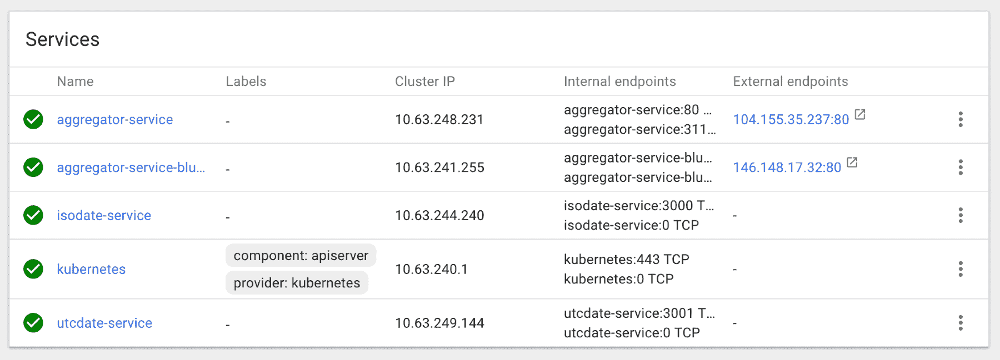

如果你在两个外部端点之间进行切换，你可以看到差异：新版本返回的是原始有效负载以及日期，日期格式为 ISO 格式并且是 UTC 时区（版本 2.0），而旧版本仅返回日期（版本 1.0）。

我们现在处于我们所称的蓝色状态：我们对我们的发布感到满意，并且确信我们的软件在生产配置下能够正常工作，不会影响任何客户。如果有任何问题，客户是不会注意到的。现在是时候进入绿色阶段了。我们在这里有两个选项：

+   移除`aggregator-bluegreen`部署及其所有子项（ReplicaSet 和 Pods，以及`aggregator-service-bluegreen`服务），并升级我们的基础部署（`aggregator`）。

+   更改聚合器服务中的选择器标签，并让它指向新的 Pods

通常来说，我是第一个选项的大粉丝，因为它保持了简单性，但这取决于你；同时也是进行实验的好时机。更改服务中的选择器会立即生效，如果你很急的话，这可能是最简单的路线。

在处理复杂系统时，我总是尽量进行蓝绿部署阶段，以减轻团队的压力。想想看：与其认为一切都很稳定，不如实际验证一切是否按预期工作，没有意外发生，这样发布时不再有不确定性的心理负担。

在下一部分，我们将介绍另一种发布类型，它将一个新的 Pod 引入到正在运行的系统中，从而仅将其暴露给一部分用户。如果有什么问题，它不会破坏系统；它只会产生一些错误。在继续之前，请确保将你的集群恢复到原始状态：只保留一个名为 `aggregator` 的部署和其 Pod（移除蓝绿部署）。

# 金丝雀部署

关于这种部署类型的名称有一个有趣的故事。在所有气体探测器之前，矿工们通常会带上一只金丝雀（这是一种鸟）进入矿井，因为金丝雀对有害气体极为敏感。所有人都在正常工作，但会时刻关注着这只鸟。如果鸟死了，大家就会立即离开矿井，以避免中毒甚至被杀害。

这正是我们将要做的：推出我们软件的新版本，如果有任何问题，它将产生错误，因此我们只会影响有限数量的客户。

同样，这是通过 YAMl 文件完成的，使用我们服务所针对的选择器，但应用的是我们新版本的应用程序。在继续之前，请确保只存在一个名为 `aggregator` 的部署，并且有两个 Pod 正在运行我们应用的 1.0 版本（如“常规发布”部分所示）。

现在，在 `aggregator-kubernetes` 中创建一个文件（放在 objects 文件夹内），并添加以下内容：

```
apiVersion: extensions/v1beta1
kind: Deployment
metadata:
  name: aggregator-canary
spec:
 replicas: 1
  template:
    metadata:
      labels:
 app: aggregator-service
    spec:
      containers:
      - name: aggregator-service
         image: eu.gcr.io/implementing-modern-devops/aggregator-service:2.0
         ports:
         - containerPort: 8080
```

这里有一个简单的解释：我们正在创建一个新的部署，只有一个 Pod，并且该 Pod 拥有与原始部署的 Pod（`aggregator`）相同的标签；因此，`aggregator-service` 将会指向这个 Pod：总共有三个 Pod。

将更改推送到 GitHub 并运行 `aggregator-kubernetes` 任务，该任务将此配置应用到我们的集群中。现在打开我们之前用于测试的端点，在我的例子中是 `http://104.155.35.237/dates/1111111111`，并多次刷新该 URL。大约三分之一的请求应该返回原始时间戳（应用的新版本），其余的应该不返回（1.0 版本）。

你可以通过 Kubernetes 仪表板检查 `aggregator-service` 来验证一切是否正常：

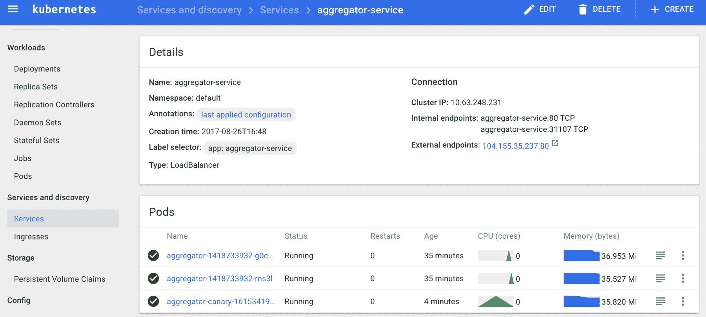

在这里，您可以看到我们的服务针对新创建的 Pod。我通常会保留这种状态几个小时/几天（取决于发布情况），一旦满意，我就会移除`canary`部署并将配置应用到`aggregator`部署中。您还可以根据需要调整副本数量，以改变用户获得新版本的百分比，甚至逐渐增加`canaries`的数量并减少常规 Pod 的数量，直到完全部署应用程序。

这种策略被像 Google 这样的大公司采用，以极大的成功发布新功能。当系统足够大（运行超过`10 +`个 Pod）时，我非常喜欢将其作为起点，但在小系统中，我会犹豫不决，因为受影响请求的百分比会太高（在前面的例子中为 33.3%）。

# 总结

本章非常密集：我们建立了一个持续交付（CD）管道，并讨论了最常见的发布策略，使用 Kubernetes 可以轻松实现。除了故意留下的几个检查点外，一切都是自动化的，这样我们就可以控制系统中正在进行的操作（仅为了安心）。这是本书的高潮：尽管示例很基础，但它们为您提供了足够的工具，使您可以在公司建立类似的设置，以便享受与微服务一起工作的好处，同时减少操作开销，并促进新版本的发布。

在下一章中，我们将学习持续交付的一个重要方面：监控。通过正确的监控，我们可以减少发布中的很多压力，使我们的工程师更加自信，能够及早捕捉错误，从而实现更平稳的部署和更低的生产错误计数。
